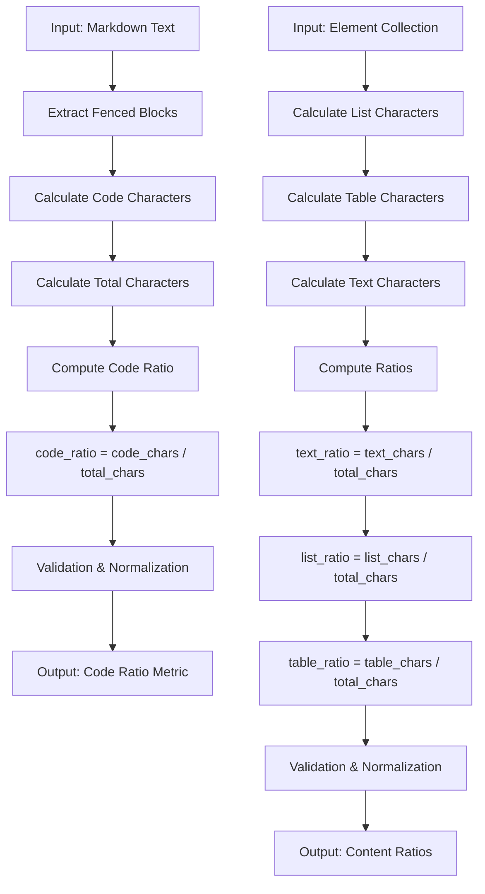
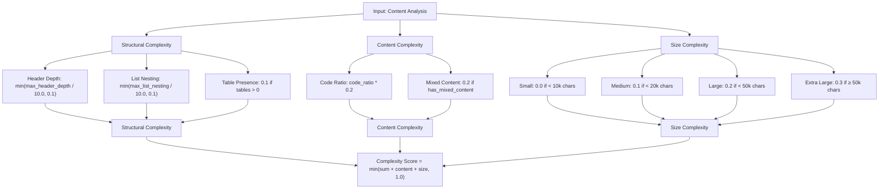
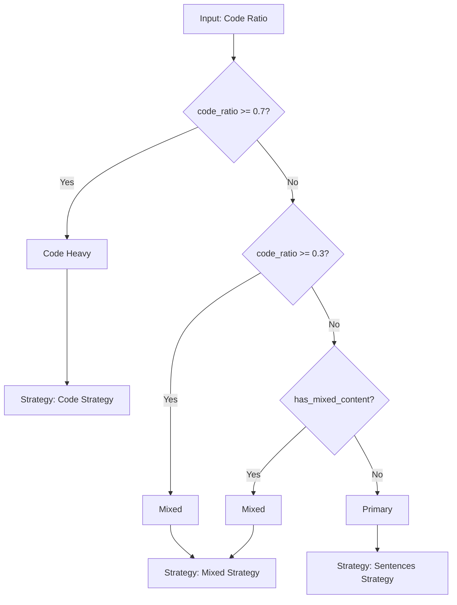
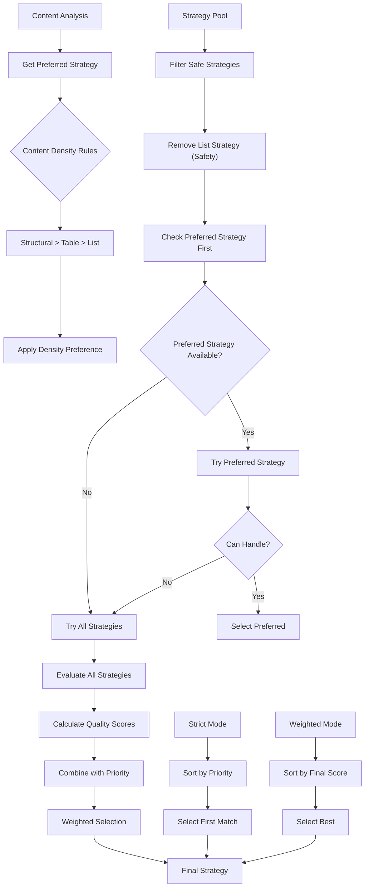
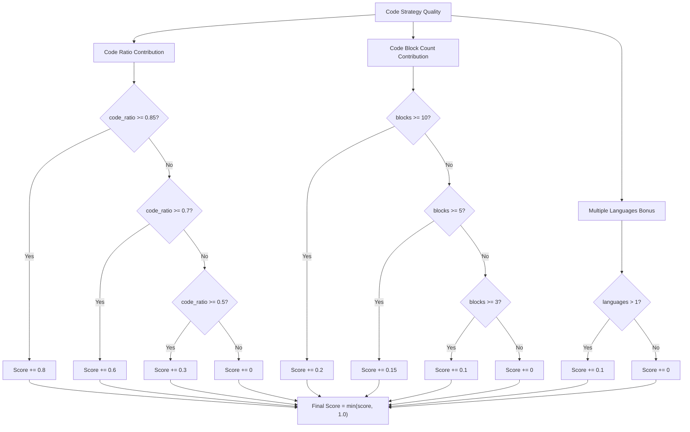
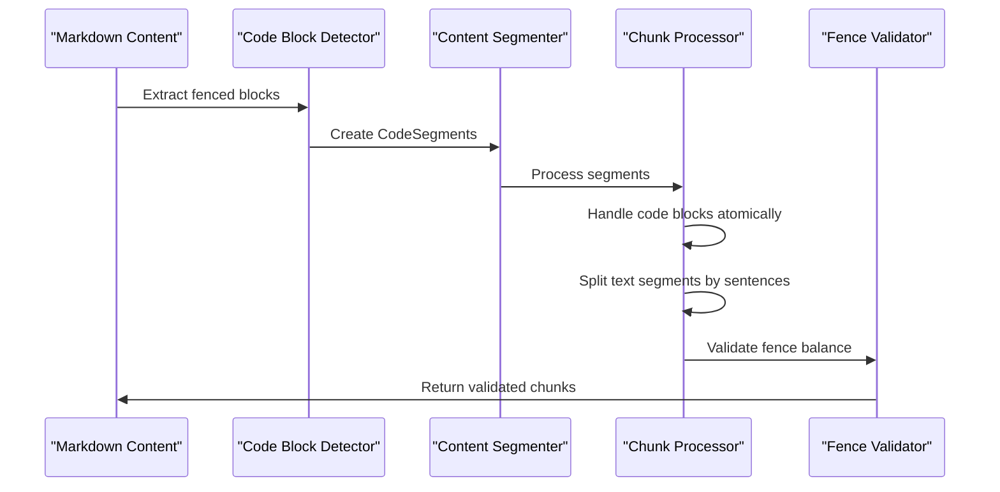
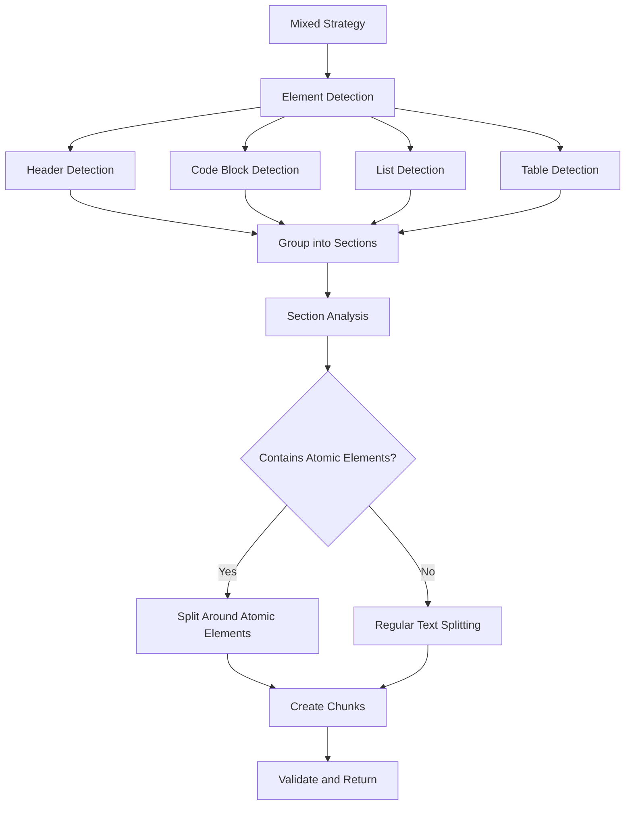
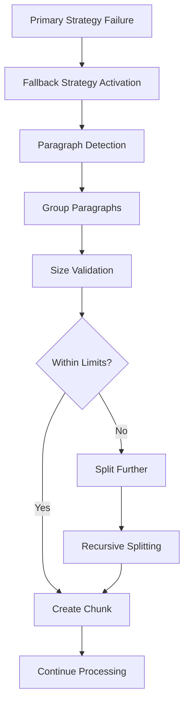
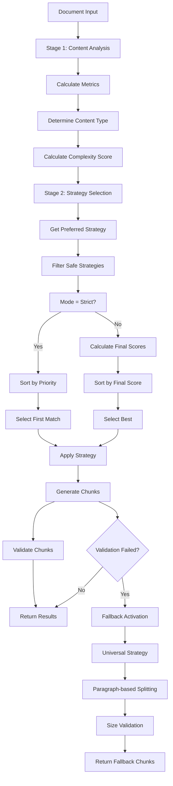
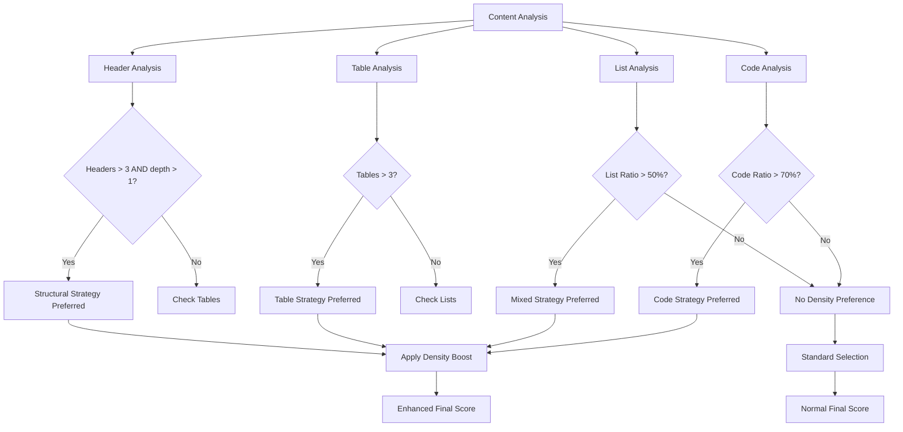

# Algorithms Reference

<cite>
**Referenced Files in This Document**
- [selector.py](file://markdown_chunker_legacy/chunker/selector.py)
- [analyzer.py](file://markdown_chunker_legacy/parser/analyzer.py)
- [base.py](file://markdown_chunker_legacy/chunker/strategies/base.py)
- [code_strategy.py](file://markdown_chunker_legacy/chunker/strategies/code_strategy.py)
- [mixed_strategy.py](file://markdown_chunker_legacy/chunker/strategies/mixed_strategy.py)
- [types.py](file://markdown_chunker_legacy/chunker/types.py)
- [types.py](file://markdown_chunker_legacy/parser/types.py)
- [fallback.py](file://markdown_chunker_v2/strategies/fallback.py)
- [base.py](file://markdown_chunker_v2/strategies/base.py)
- [types.py](file://markdown_chunker_v2/types.py)
</cite>

## Table of Contents
1. [Introduction](#introduction)
2. [Content Analysis Algorithm](#content-analysis-algorithm)
3. [Strategy Selection Algorithm](#strategy-selection-algorithm)
4. [Mathematical Models and Scoring Systems](#mathematical-models-and-scoring-systems)
5. [Strategy Implementation Details](#strategy-implementation-details)
6. [Fallback Mechanism](#fallback-mechanism)
7. [Performance Characteristics](#performance-characteristics)
8. [Flowcharts and Decision Processes](#flowcharts-and-decision-processes)
9. [Pseudocode Implementations](#pseudocode-implementations)
10. [Computational Complexity Analysis](#computational-complexity-analysis)

## Introduction

The Markdown chunker employs sophisticated algorithms to intelligently divide Markdown documents into semantically meaningful chunks. The system operates in two distinct phases: content analysis and strategy selection, each utilizing specialized algorithms to optimize chunking quality for different document types.

The core algorithmic framework consists of three primary components:
- **Content Analysis Engine**: Calculates metrics like code_ratio and complexity_score
- **Strategy Selection System**: Implements priority-based decision logic with weighted scoring
- **Strategy Implementations**: Specialized algorithms for different content types

## Content Analysis Algorithm

### Code Ratio Calculation

The content analysis engine begins by calculating the code ratio, which serves as the foundation for strategy selection decisions.



**Diagram sources**
- [analyzer.py](file://markdown_chunker_legacy/parser/analyzer.py#L28-L208)

The code ratio calculation follows this mathematical formulation:

```
code_ratio = code_characters / total_characters
```

Where:
- `code_characters` = sum of lengths of all fenced code blocks
- `total_characters` = length of the complete markdown text

**Section sources**
- [analyzer.py](file://markdown_chunker_legacy/parser/analyzer.py#L50-L61)

### Complexity Score Calculation

The complexity score quantifies the structural and content complexity of a document using a multi-factor model:



**Diagram sources**
- [analyzer.py](file://markdown_chunker_legacy/parser/analyzer.py#L247-L277)

The complexity score calculation formula is:

```
complexity_score = min(structural_complexity + content_complexity + size_complexity, 1.0)
```

Where:
- **Structural Complexity**: Based on header depth, list nesting, and table presence
- **Content Complexity**: Based on code ratio and mixed content indicators
- **Size Complexity**: Based on document size thresholds

**Section sources**
- [analyzer.py](file://markdown_chunker_legacy/parser/analyzer.py#L247-L277)

### Content Type Classification

The system classifies documents into three primary content types based on calculated ratios:



**Diagram sources**
- [analyzer.py](file://markdown_chunker_legacy/parser/analyzer.py#L279-L295)

**Section sources**
- [analyzer.py](file://markdown_chunker_legacy/parser/analyzer.py#L279-L295)

## Strategy Selection Algorithm

### Priority-Based Decision Logic

The strategy selection algorithm implements a sophisticated priority-based system that evaluates multiple strategies against content analysis metrics.



**Diagram sources**
- [selector.py](file://markdown_chunker_legacy/chunker/selector.py#L79-L235)

### Threshold Configuration System

The strategy selection system uses configurable thresholds to determine strategy applicability:

| Strategy | Code Ratio Threshold | Min Code Blocks | List Ratio Threshold | Table Ratio Threshold |
|----------|---------------------|-----------------|---------------------|----------------------|
| Code | 0.7 | 3 | N/A | N/A |
| Mixed | 0.3 | 1 | 0.6 | 0.4 |
| List | N/A | N/A | 0.6 | N/A |
| Table | N/A | N/A | N/A | 0.4 |
| Structural | N/A | N/A | N/A | N/A |

**Section sources**
- [selector.py](file://markdown_chunker_legacy/chunker/selector.py#L79-L235)

## Mathematical Models and Scoring Systems

### Quality Score Calculation

Each strategy implements a quality scoring algorithm that evaluates how well-suited it is for the given content:

#### Code Strategy Quality Score



**Diagram sources**
- [code_strategy.py](file://markdown_chunker_legacy/chunker/strategies/code_strategy.py#L136-L185)

#### Mixed Strategy Quality Score

The mixed strategy quality score considers multiple content factors:

```
quality_score = 0.0

# Anti-pattern penalty
if code_ratio > 0.7 or list_ratio > 0.7 or table_ratio > 0.6:
    return 0.2  # Low score for specialized documents

# Mixed content bonus
if has_mixed_content:
    score += 0.7

# Balanced code bonus
if 0.3 <= code_ratio <= 0.7:
    score += 0.3
elif 0.1 < code_ratio < 0.3:
    score += 0.2

# Element diversity bonus
element_count = sum([
    code_ratio > 0.1,
    list_ratio > 0.1,
    table_ratio > 0.1,
    text_ratio > 0.3,
])
if element_count >= 3:
    score += 0.2
elif element_count >= 2:
    score += 0.1

return min(score, 1.0)
```

**Section sources**
- [mixed_strategy.py](file://markdown_chunker_legacy/chunker/strategies/mixed_strategy.py#L120-L170)

### Final Score Calculation

The final score combines quality score with strategy priority using a weighted formula:

```
priority_weight = 1.0 / priority
final_score = (priority_weight * 0.5) + (quality_score * 0.5) if can_handle else 0.0
```

This formula ensures that:
- Higher priority strategies receive greater weight
- Quality score contributes equally to the final decision
- Strategies that cannot handle the content receive a score of 0.0

**Section sources**
- [base.py](file://markdown_chunker_legacy/chunker/strategies/base.py#L112-L116)

## Strategy Implementation Details

### Code Strategy Implementation

The code strategy specializes in handling code-heavy documents with sophisticated code block preservation:



**Diagram sources**
- [code_strategy.py](file://markdown_chunker_legacy/chunker/strategies/code_strategy.py#L187-L217)

Key implementation features:
- **Atomic Code Preservation**: Code blocks are never split across chunks
- **Language Detection**: Automatic detection of programming languages
- **Function/Class Extraction**: Metadata extraction for code navigation
- **Intelligent Splitting**: Sentence-based splitting for explanatory text

**Section sources**
- [code_strategy.py](file://markdown_chunker_legacy/chunker/strategies/code_strategy.py#L187-L625)

### Mixed Strategy Implementation

The mixed strategy handles documents with multiple content types by grouping related elements:



**Diagram sources**
- [mixed_strategy.py](file://markdown_chunker_legacy/chunker/strategies/mixed_strategy.py#L172-L201)

**Section sources**
- [mixed_strategy.py](file://markdown_chunker_legacy/chunker/strategies/mixed_strategy.py#L172-L849)

## Fallback Mechanism

### Fallback Strategy Design

When primary strategies fail to handle content effectively, the fallback mechanism ensures chunking continues with a universal approach:



**Diagram sources**
- [fallback.py](file://markdown_chunker_v2/strategies/fallback.py#L37-L95)

The fallback strategy implements a simple yet effective algorithm:

```
function apply_fallback_strategy(content, config):
    paragraphs = split_by_double_newlines(content)
    chunks = []
    current_content = ""
    current_start_line = 1
    
    for para in paragraphs:
        if len(current_content) + len(para) > config.max_chunk_size:
            # Create chunk with current content
            chunks.append(create_chunk(current_content, current_start_line, end_line))
            # Start new chunk
            current_content = para
            current_start_line = next_start_line
        else:
            current_content += para + "\n\n"
    
    # Add final chunk
    if current_content:
        chunks.append(create_chunk(current_content, current_start_line, end_line))
    
    return chunks
```

**Section sources**
- [fallback.py](file://markdown_chunker_v2/strategies/fallback.py#L37-L95)

### Fallback Trigger Conditions

The fallback mechanism activates under several conditions:
- No primary strategy can handle the content
- Strategy selection fails due to configuration issues
- Content structure is too complex for specialized strategies
- Performance thresholds are exceeded

## Performance Characteristics

### Algorithmic Complexity

| Algorithm | Time Complexity | Space Complexity | Notes |
|-----------|----------------|------------------|-------|
| Content Analysis | O(n) | O(n) | Linear with document size |
| Strategy Selection | O(s × n) | O(s) | s = number of strategies |
| Code Strategy | O(n) | O(n) | Linear with content size |
| Mixed Strategy | O(n²) | O(n) | Quadratic in worst case |
| Fallback Strategy | O(n) | O(n) | Linear with content size |

Where:
- n = number of characters in document
- s = number of available strategies

### Performance Optimization Techniques

1. **Early Termination**: Strategy selection stops at first viable option in strict mode
2. **Lazy Evaluation**: Content analysis results cached to avoid recomputation
3. **Incremental Processing**: Documents processed in chunks to reduce memory usage
4. **Parallel Processing**: Independent strategy evaluations can run concurrently

**Section sources**
- [selector.py](file://markdown_chunker_legacy/chunker/selector.py#L79-L235)

## Flowcharts and Decision Processes

### Complete Strategy Selection Flow



**Diagram sources**
- [selector.py](file://markdown_chunker_legacy/chunker/selector.py#L58-L235)

### Content Density Analysis



**Diagram sources**
- [selector.py](file://markdown_chunker_legacy/chunker/selector.py#L237-L277)

## Pseudocode Implementations

### Content Analysis Pseudocode

```
function analyze_content(markdown_text):
    fenced_blocks = extract_fenced_blocks(markdown_text)
    elements = detect_elements(markdown_text)
    
    total_chars = len(markdown_text)
    code_chars = sum(len(block.content) for block in fenced_blocks)
    list_chars = calculate_list_characters(elements.lists)
    table_chars = calculate_table_characters(elements.tables)
    text_chars = total_chars - code_chars - list_chars - table_chars
    
    code_ratio = code_chars / total_chars if total_chars > 0 else 0
    text_ratio = text_chars / total_chars if total_chars > 0 else 0
    list_ratio = list_chars / total_chars if total_chars > 0 else 0
    table_ratio = table_chars / total_chars if total_chars > 0 else 0
    
    complexity_score = calculate_complexity(
        code_ratio, list_ratio, table_ratio, text_ratio,
        max_header_depth, nested_list_depth, total_chars, has_mixed_content
    )
    
    content_type = classify_content_type(code_ratio, list_ratio, table_ratio, has_mixed_content)
    
    return ContentAnalysis(
        total_chars, total_lines, total_words,
        code_ratio, text_ratio, code_block_count,
        header_count, content_type, languages,
        list_count, table_count, list_ratio, table_ratio,
        complexity_score, max_header_depth, has_mixed_content,
        nested_list_depth, inline_code_count, average_line_length,
        max_line_length, empty_lines, indented_lines, punctuation_ratio,
        special_chars, block_elements, preamble
    )
```

### Strategy Selection Pseudocode

```
function select_strategy(analysis, config, strategies, mode="strict"):
    preferred_strategy = get_preferred_strategy_by_density(analysis)
    
    # Safety filter: exclude list strategy in auto mode
    safe_strategies = [s for s in strategies if s.name != "list"]
    
    if mode == "strict":
        return select_strict(analysis, config, safe_strategies, preferred_strategy)
    else:
        return select_weighted(analysis, config, safe_strategies, preferred_strategy)

function select_strict(analysis, config, strategies, preferred_strategy):
    # Try preferred strategy first
    if preferred_strategy:
        for strategy in strategies:
            if strategy.name == preferred_strategy and strategy.can_handle(analysis, config):
                return strategy
    
    # Try all strategies in priority order
    for strategy in strategies:
        if strategy.can_handle(analysis, config):
            return strategy
    
    # Fallback to structural strategy
    for strategy in strategies:
        if strategy.name == "structural":
            return strategy
    
    # Emergency fallback
    return strategies[0]

function select_weighted(analysis, config, strategies, preferred_strategy):
    candidates = []
    
    for strategy in strategies:
        if strategy.can_handle(analysis, config):
            metrics = strategy.get_metrics(analysis, config)
            final_score = metrics.final_score
            
            # Boost preferred strategy
            if preferred_strategy and strategy.name == preferred_strategy:
                final_score += 0.2
            
            candidates.append((strategy, metrics, final_score))
    
    if not candidates:
        # Fallback to structural
        for strategy in strategies:
            if strategy.name == "structural":
                return strategy
    
    # Select best candidate
    best_strategy, _, _ = max(candidates, key=lambda x: x[2])
    return best_strategy
```

### Quality Score Calculation Pseudocode

```
function calculate_quality_code_strategy(analysis):
    score = 0.0
    
    # Code ratio contribution
    if analysis.code_ratio >= 0.85:
        score += 0.8
    elif analysis.code_ratio >= 0.7:
        score += 0.6
    elif analysis.code_ratio >= 0.5:
        score += 0.3
    
    # Code block count contribution
    if analysis.code_block_count >= 10:
        score += 0.2
    elif analysis.code_block_count >= 5:
        score += 0.15
    elif analysis.code_block_count >= 3:
        score += 0.1
    
    # Multiple languages bonus
    if len(analysis.languages) > 1:
        score += 0.1
    
    return min(score, 1.0)

function calculate_final_score(priority, quality_score):
    priority_weight = 1.0 / priority
    return (priority_weight * 0.5) + (quality_score * 0.5)
```

## Computational Complexity Analysis

### Time Complexity Breakdown

#### Content Analysis Phase
- **Fenced Block Extraction**: O(n) where n is document length
- **Element Detection**: O(n) for linear scanning
- **Metric Calculation**: O(1) for each metric
- **Complexity Score**: O(1) computation
- **Total**: O(n) overall

#### Strategy Selection Phase
- **Quality Score Calculation**: O(1) per strategy
- **Priority Sorting**: O(s log s) where s is number of strategies
- **Final Score Computation**: O(s) for all strategies
- **Total**: O(s × n) for content analysis + O(s log s) for sorting

#### Strategy Application Phase
- **Code Strategy**: O(n) for content segmentation
- **Mixed Strategy**: O(n²) in worst case due to nested element processing
- **Fallback Strategy**: O(n) for paragraph splitting
- **Total**: Depends on chosen strategy

### Space Complexity Analysis

#### Memory Usage Patterns
- **Content Analysis**: O(n) for storing analysis results
- **Strategy Objects**: O(s) for strategy instances
- **Chunk Storage**: O(k × m) where k is number of chunks and m is average chunk size
- **Temporary Buffers**: O(m) for chunk processing

#### Optimization Strategies
1. **Streaming Processing**: Process documents in chunks to limit memory usage
2. **Lazy Loading**: Load strategy configurations on demand
3. **Result Caching**: Cache analysis results for repeated queries
4. **Garbage Collection**: Clean up temporary objects promptly

### Performance Tuning Recommendations

1. **Strategy Ordering**: Place most common strategies first in priority list
2. **Threshold Optimization**: Tune thresholds based on typical document types
3. **Parallel Execution**: Utilize multiple cores for independent strategy evaluations
4. **Caching Strategy**: Implement intelligent caching for frequently analyzed content types

The algorithmic framework provides robust, scalable solutions for Markdown chunking with excellent performance characteristics across diverse document types and sizes.