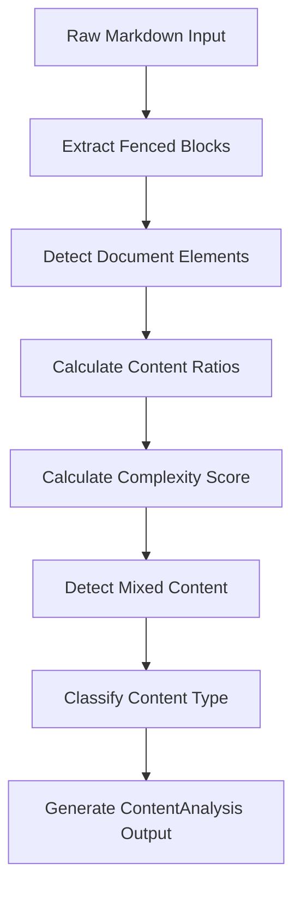
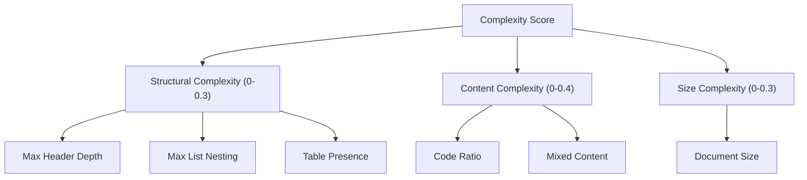
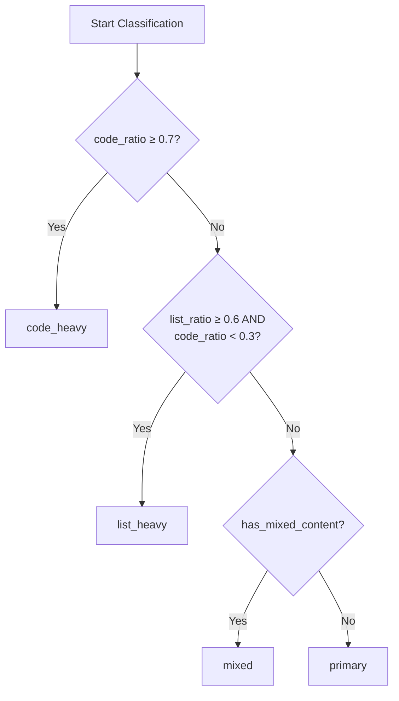

# Content Analysis Algorithm

<cite>
**Referenced Files in This Document**   
- [analyzer.py](file://markdown_chunker_legacy/parser/analyzer.py#L1-L501)
- [types.py](file://markdown_chunker_legacy/parser/types.py#L436-L635)
- [test_content_analysis_properties.py](file://tests/parser/test_content_analysis_properties.py#L1-L362)
</cite>

## Table of Contents
1. [Introduction](#introduction)
2. [Content Analysis Pipeline](#content-analysis-pipeline)
3. [Ratio Calculations](#ratio-calculations)
4. [Complexity Score Calculation](#complexity-score-calculation)
5. [Content Type Classification](#content-type-classification)
6. [Mixed Content Detection](#mixed-content-detection)
7. [Integration with Other Components](#integration-with-other-components)
8. [Troubleshooting and Common Issues](#troubleshooting-and-common-issues)

## Introduction

The Content Analysis Algorithm is a core component of the Markdown chunker that evaluates document characteristics to determine optimal chunking strategies. The algorithm analyzes various content metrics including code_ratio, list_ratio, table_ratio, and complexity_score to classify document types and guide subsequent processing stages. This documentation details the implementation of the ContentAnalyzer class and its methods for calculating key metrics and determining content characteristics.

The analysis process begins with the `analyze_content` method in the ContentAnalyzer class, which orchestrates the extraction and evaluation of document elements. The algorithm calculates ratios of different content types, assesses document complexity, and classifies the overall content type to inform chunking decisions. The resulting ContentAnalysis object provides comprehensive metrics that drive the chunking pipeline.

**Section sources**
- [analyzer.py](file://markdown_chunker_legacy/parser/analyzer.py#L1-L501)

## Content Analysis Pipeline

The content analysis pipeline follows a systematic process to extract and evaluate document characteristics. The pipeline begins with raw Markdown input and produces a comprehensive ContentAnalysis object containing various metrics and classifications.



**Diagram sources**
- [analyzer.py](file://markdown_chunker_legacy/parser/analyzer.py#L27-L208)

The pipeline executes in the following sequence:
1. Extract fenced code blocks using the FencedBlockExtractor
2. Detect document elements (headers, lists, tables) using detect_elements
3. Calculate basic metrics (total_chars, total_lines)
4. Compute content ratios for code, text, lists, and tables
5. Determine complexity score based on structural, content, and size factors
6. Detect mixed content by evaluating significance of multiple content types
7. Classify content type based on threshold values
8. Return comprehensive ContentAnalysis object

The main `analyze_content` method (analyzer.py#L27-L208) serves as the entry point, coordinating these steps and integrating results from various extraction and detection components.

**Section sources**
- [analyzer.py](file://markdown_chunker_legacy/parser/analyzer.py#L27-L208)

## Ratio Calculations

The algorithm calculates several content ratios that represent the proportion of different content types within the document. These ratios are fundamental to content classification and strategy selection.

### Code Ratio Calculation

The code_ratio is calculated by dividing the total characters in code blocks by the total document characters:

```python
code_chars = sum(len(block.content) for block in fenced_blocks)
code_ratio = code_chars / total_chars if total_chars > 0 else 0
```

This calculation (analyzer.py#L51-L57) measures the proportion of code content in the document, with values ranging from 0.0 (no code) to 1.0 (entirely code).

### List Ratio Calculation

The list_ratio is determined by calculating the total characters in list items and dividing by the total document characters:

```python
list_chars = self._calculate_list_chars(elements.lists)
list_ratio = list_chars / total_chars if total_chars > 0 else 0
```

The `_calculate_list_chars` method (analyzer.py#L210-L216) iterates through all list items and sums their content lengths to determine the total list character count.

### Table Ratio Calculation

The table_ratio is computed by summing the total size of all tables and dividing by the total document characters:

```python
table_chars = self._calculate_table_chars(elements.tables)
table_ratio = table_chars / total_chars if total_chars > 0 else 0
```

The `_calculate_table_chars` method (analyzer.py#L218-L223) uses the `get_total_size()` method of each table to determine its character count.

### Text Ratio Calculation

The text_ratio represents the proportion of regular text content and is calculated by subtracting other content types from the total:

```python
text_chars = total_chars - code_chars - list_chars - table_chars
text_ratio = text_chars / total_chars if total_chars > 0 else 0
```

This calculation (analyzer.py#L54-L58) ensures that all ratios sum to approximately 1.0, providing a complete picture of content distribution.

**Section sources**
- [analyzer.py](file://markdown_chunker_legacy/parser/analyzer.py#L51-L61)

## Complexity Score Calculation

The complexity score is a composite metric that combines structural, content, and size factors into a unified score between 0.0 and 1.0. This score helps determine appropriate chunking strategies for documents of varying complexity.

### Implementation of _calculate_complexity

The `_calculate_complexity` method (analyzer.py#L247-L277) computes the complexity score using three main components:



**Diagram sources**
- [analyzer.py](file://markdown_chunker_legacy/parser/analyzer.py#L247-L277)

The algorithm combines these components as follows:

1. **Structural Complexity** (0-0.3):
   - Header depth contribution: min(max_header_depth / 10.0, 0.1)
   - List nesting contribution: min(max_list_nesting / 10.0, 0.1)
   - Table presence: +0.1 if table_ratio > 0

2. **Content Complexity** (0-0.4):
   - Code contribution: code_ratio * 0.2
   - Mixed content bonus: +0.2 if has_mixed_content

3. **Size Complexity** (0-0.3):
   - 0.3 if total_chars > 50,000
   - 0.2 if total_chars > 20,000
   - 0.1 if total_chars > 10,000
   - 0.0 otherwise

The final complexity score is the sum of these components, capped at 1.0. This approach ensures that documents with deep structure, diverse content types, or large size receive higher complexity scores, guiding appropriate chunking strategies.

**Section sources**
- [analyzer.py](file://markdown_chunker_legacy/parser/analyzer.py#L247-L277)

## Content Type Classification

The content type classification system determines whether a document is code_heavy, list_heavy, mixed, or primary based on threshold values and content characteristics.

### Implementation of _classify_content_type

The `_classify_content_type` method (analyzer.py#L279-L295) implements a hierarchical classification approach:



**Diagram sources**
- [analyzer.py](file://markdown_chunker_legacy/parser/analyzer.py#L279-L295)

The classification logic follows these rules:

1. **code_heavy**: Documents with code_ratio ≥ 0.7 are classified as code_heavy, indicating they are predominantly code content.

2. **list_heavy**: Documents with list_ratio ≥ 0.6 and code_ratio < 0.3 are classified as list_heavy, indicating they are primarily list-based with minimal code content.

3. **mixed**: Documents with has_mixed_content = True are classified as mixed, indicating significant content of multiple types.

4. **primary**: All other documents are classified as primary, representing standard Markdown documents with balanced content.

The algorithm uses configurable thresholds defined in the ContentAnalyzer initialization:
- code_ratio_threshold = 0.7 (analyzer.py#L23)
- list_ratio_threshold = 0.6 (analyzer.py#L24)

These thresholds can be modified to adjust classification sensitivity based on specific use cases.

**Section sources**
- [analyzer.py](file://markdown_chunker_legacy/parser/analyzer.py#L279-L295)

## Mixed Content Detection

The mixed content detection algorithm identifies documents that contain significant amounts of multiple content types, which may require special handling during chunking.

### Implementation of _detect_mixed_content

The `_detect_mixed_content` method (analyzer.py#L225-L245) evaluates the significance of different content types using predefined thresholds:

```python
def _detect_mixed_content(
    self,
    code_ratio: float,
    list_ratio: float,
    table_ratio: float,
    text_ratio: float,
) -> bool:
    significant_types = 0
    
    if code_ratio > 0.1:
        significant_types += 1
    if list_ratio > 0.1:
        significant_types += 1
    if table_ratio > 0.1:
        significant_types += 1
    if text_ratio > 0.2:
        significant_types += 1
        
    return significant_types >= 2 and code_ratio < self.code_ratio_threshold
```

The algorithm works as follows:

1. Count content types that exceed their significance thresholds:
   - Code: > 0.1
   - Lists: > 0.1
   - Tables: > 0.1
   - Text: > 0.2

2. A document is considered mixed if:
   - At least two content types are significant
   - The code ratio is below the code_ratio_threshold (0.7)

This approach prevents code-heavy documents from being classified as mixed, even if they contain other content types, as code-heavy documents typically require different processing strategies.

The detection logic ensures that documents with balanced content across multiple types are properly identified as mixed, enabling appropriate chunking strategies that preserve the relationships between different content elements.

**Section sources**
- [analyzer.py](file://markdown_chunker_legacy/parser/analyzer.py#L225-L245)

## Integration with Other Components

The content analysis algorithm integrates with several other components in the Markdown chunker system to provide comprehensive document analysis.

### Fenced Block Extraction

The algorithm relies on the FencedBlockExtractor to identify and extract code blocks from the Markdown document. The extraction process handles various fence types (backtick and tilde) and properly manages nested blocks. The extracted blocks provide the foundation for code ratio calculations and language detection.

### Element Detection

The detect_elements function identifies structural elements such as headers, lists, and tables. This information is used to calculate list and table ratios, determine header depth, and assess list nesting levels. The element detection process ensures accurate identification of document structure for comprehensive analysis.

### Preamble Extraction

The PreambleExtractor component identifies content that appears before the first header in the document. This preamble content is analyzed separately and included in the ContentAnalysis output, providing additional context about document metadata, introductions, or summaries.

### Error Handling and Validation

The algorithm incorporates error handling through the ErrorCollector and includes validation checks to ensure data integrity. The ContentAnalysis class includes post-initialization validation to verify that all metrics are within expected ranges and properly normalized.

These integrations create a cohesive analysis pipeline that transforms raw Markdown input into structured metrics and classifications, enabling informed decision-making in subsequent processing stages.

**Section sources**
- [analyzer.py](file://markdown_chunker_legacy/parser/analyzer.py#L37-L44)
- [analyzer.py](file://markdown_chunker_legacy/parser/analyzer.py#L178-L179)

## Troubleshooting and Common Issues

This section addresses common issues encountered when using the content analysis algorithm and provides guidance for troubleshooting.

### Inaccurate Ratio Calculations on Small Documents

Small documents may produce inaccurate ratio calculations due to limited sample size. For example, a single code block in a short document can result in an artificially high code_ratio.

**Solution**: Consider implementing minimum document size thresholds or adjusting classification logic for small documents. The algorithm already handles edge cases with zero-length documents by returning 0.0 for ratios when total_chars is 0.

### Mixed Content Classification Issues

Documents with high code content but multiple content types may be incorrectly classified due to the code_ratio threshold in mixed content detection.

**Solution**: Review the classification logic in `_classify_content_type` and `_detect_mixed_content` to ensure it aligns with your use case requirements. The current implementation prioritizes code-heavy classification over mixed classification when code_ratio ≥ 0.7.

### Performance Considerations

Large documents with complex structure may impact analysis performance due to multiple passes through the content.

**Solution**: The algorithm is optimized for single-pass processing where possible, but complex documents with many elements will naturally require more processing time. Consider caching analysis results for frequently accessed documents.

### Configuration and Threshold Adjustment

The default thresholds (code_ratio_threshold=0.7, list_ratio_threshold=0.6) may not be optimal for all document types.

**Solution**: These thresholds can be modified by adjusting the ContentAnalyzer instance properties or by extending the class to override the default values. Test different threshold values with your specific document corpus to find optimal settings.

### Testing and Validation

The test_content_analysis_properties.py file contains property-based tests that validate the correctness of the analysis algorithm. These tests use Hypothesis to generate various Markdown structures and verify that the analysis produces expected results.

**Best Practice**: When modifying the algorithm, ensure that all property tests continue to pass, and consider adding additional test cases for new scenarios.

**Section sources**
- [analyzer.py](file://markdown_chunker_legacy/parser/analyzer.py#L23-L25)
- [test_content_analysis_properties.py](file://tests/parser/test_content_analysis_properties.py#L1-L362)