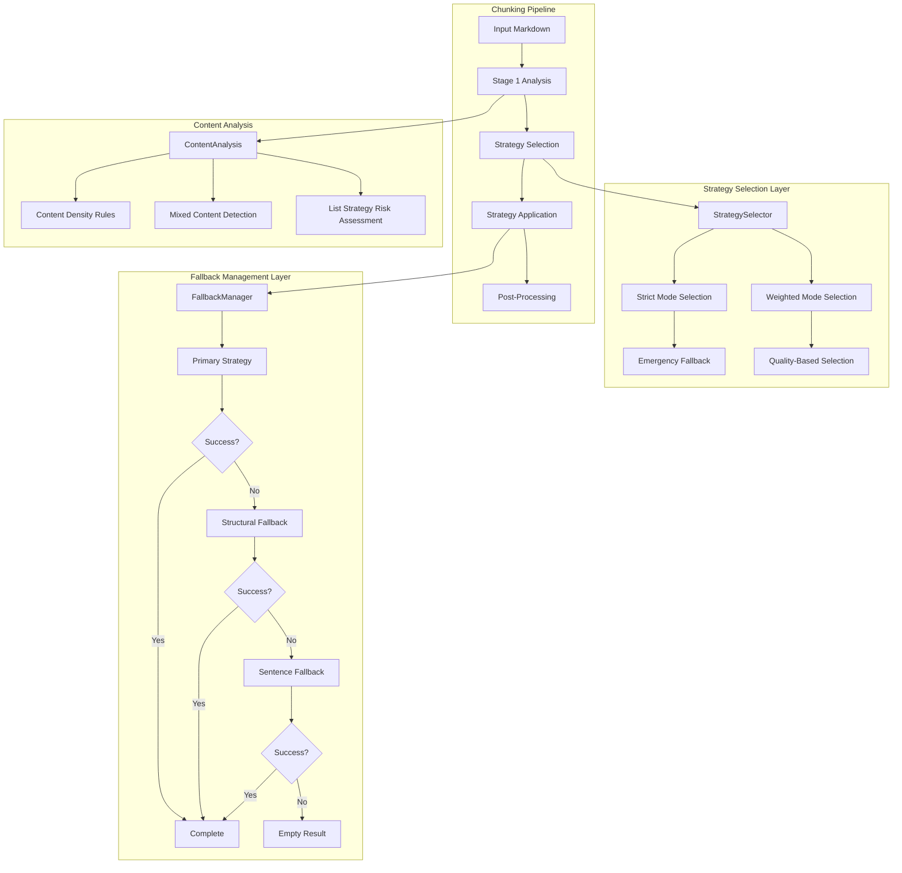
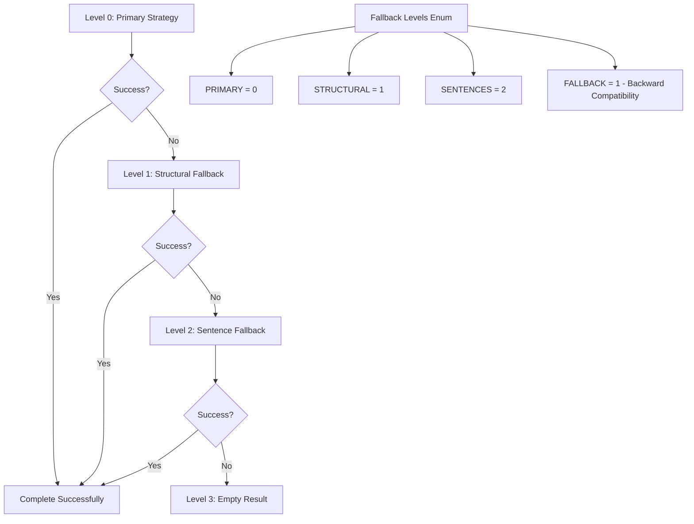
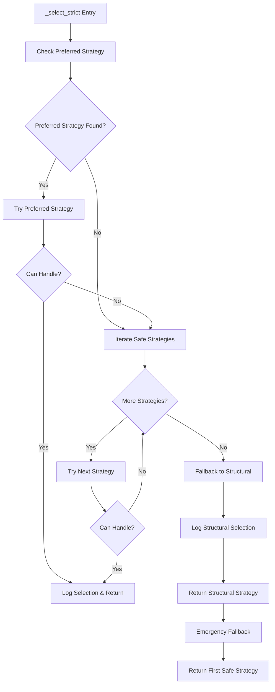
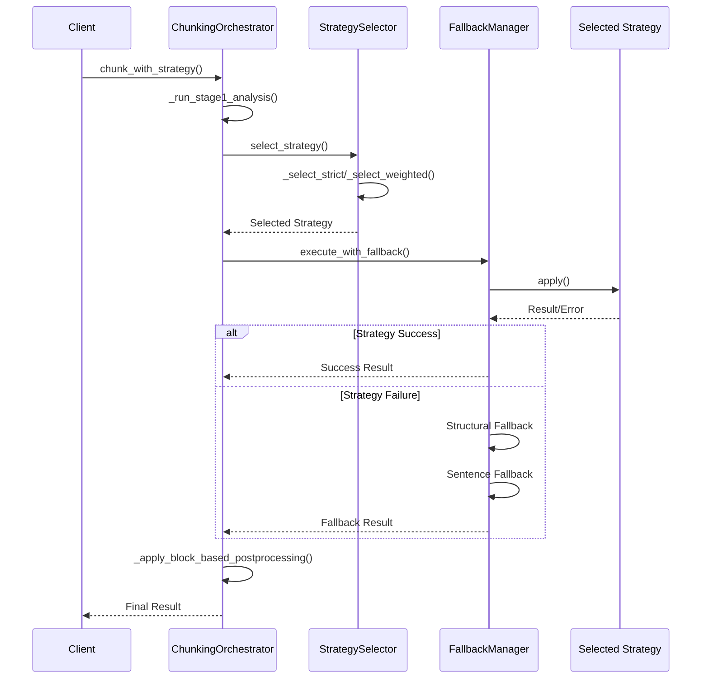

# Fallback Mechanism

<cite>
**Referenced Files in This Document**
- [selector.py](file://markdown_chunker_legacy/chunker/selector.py)
- [fallback_manager.py](file://markdown_chunker_legacy/chunker/components/fallback_manager.py)
- [orchestrator.py](file://markdown_chunker_legacy/chunker/orchestrator.py)
- [test_strategy_selector.py](file://tests/chunker/test_strategy_selector.py)
- [test_fallback_manager_integration.py](file://tests/chunker/test_fallback_manager_integration.py)
- [test_components/test_fallback_manager.py](file://tests/chunker/test_components/test_fallback_manager.py)
- [mixed_strategy.py](file://markdown_chunker_legacy/chunker/strategies/mixed_strategy.py)
</cite>

## Table of Contents
1. [Introduction](#introduction)
2. [System Architecture](#system-architecture)
3. [StrategySelector Multi-Level Fallback](#strategyselector-multi-level-fallback)
4. [FallbackManager 4-Level System](#fallbackmanager-4-level-system)
5. [Emergency Fallback Logic](#emergency-fallback-logic)
6. [List Strategy Exclusion](#list-strategy-exclusion)
7. [Logging and Monitoring](#logging-and-monitoring)
8. [Integration Points](#integration-points)
9. [Common Issues and Troubleshooting](#common-issues-and-troubleshooting)
10. [Performance Considerations](#performance-considerations)
11. [Conclusion](#conclusion)

## Introduction

The Markdown chunker implements a sophisticated multi-level fallback mechanism designed to ensure chunking operations always succeed, even when primary strategies encounter unexpected content or errors. This system operates through two primary components: the StrategySelector, which manages strategy selection with emergency fallback capabilities, and the FallbackManager, which provides a hierarchical fallback chain for error recovery.

The fallback system is built around the principle that chunking should never fail completely - it must always produce chunks, even if they're less optimal than desired. This reliability is achieved through a cascading series of fallback strategies that progressively degrade in quality while maintaining content integrity.

## System Architecture

The fallback mechanism operates through a coordinated architecture involving multiple components working together to provide robust error handling and content preservation.



**Diagram sources**
- [orchestrator.py](file://markdown_chunker_legacy/chunker/orchestrator.py#L87-L128)
- [selector.py](file://markdown_chunker_legacy/chunker/selector.py#L58-L78)
- [fallback_manager.py](file://markdown_chunker_legacy/chunker/components/fallback_manager.py#L60-L177)

## StrategySelector Multi-Level Fallback

The StrategySelector implements a sophisticated multi-level fallback system within the strategy selection phase, providing emergency fallback capabilities when no suitable strategy can be found.

### Selection Modes

The StrategySelector operates in two distinct modes, each with different fallback characteristics:

**Strict Mode Selection** (`mode="strict"`):
- Selects the first applicable strategy by priority
- Provides immediate fallback when primary strategies fail
- Implements emergency fallback logic for complete failure scenarios

**Weighted Mode Selection** (`mode="weighted"`):
- Selects the best strategy based on combined priority and quality scores
- Applies content density preferences with strategy boosting
- Falls back to structural strategy when no suitable strategy is found

### Content Density-Based Strategy Preference

The system analyzes content characteristics to determine preferred strategies based on predefined thresholds:

```mermaid
flowchart TD
A[Content Analysis] --> B{Header Count > 3 AND Depth > 1?}
B --> |Yes| C[Prefer Structural Strategy]
B --> |No| D{Table Count > 3?}
D --> |Yes| E[Prefer Table Strategy]
D --> |No| F{List Ratio > 50%?}
F --> |Yes| G[Prefer List Strategy<br/>(Not Auto-Selected)]
F --> |No| H[No Preferred Strategy]
C --> I[Apply Preferred Strategy]
E --> I
G --> I
H --> J[Apply by Priority]
```

**Diagram sources**
- [selector.py](file://markdown_chunker_legacy/chunker/selector.py#L237-L277)

### Safe Strategy Filtering

To prevent mixed-content risks, the StrategySelector implements safe strategy filtering that excludes potentially problematic strategies from automatic selection:

**Section sources**
- [selector.py](file://markdown_chunker_legacy/chunker/selector.py#L97-L106)

The system maintains a list of "safe" strategies that can be used automatically, excluding:
- **List Strategy**: Excluded due to mixed-content risk where non-list content may be lost
- **Other Potentially Risky Strategies**: Based on content analysis and historical failure rates

## FallbackManager 4-Level System

The FallbackManager implements a comprehensive 4-level fallback system designed to ensure chunking operations always succeed, even when all primary strategies fail.

### Fallback Levels

The system operates through four distinct levels of fallback, each providing different guarantees and fallback strategies:



**Diagram sources**
- [fallback_manager.py](file://markdown_chunker_legacy/chunker/components/fallback_manager.py#L22-L29)

### Level 0: Primary Strategy Execution

Level 0 represents the initial strategy selection and execution phase. The system attempts to apply the selected strategy normally, with the following characteristics:

- **Success Criteria**: Strategy returns non-empty chunks without exceptions
- **Failure Scenarios**: Strategy throws exceptions, returns empty chunks, or produces invalid results
- **Behavior**: Immediate fallback to next level on failure

### Level 1: Structural Fallback

Level 1 provides a robust fallback option that handles specialized content types that primary strategies might struggle with:

**Key Characteristics**:
- **Universal Coverage**: Works with any content type
- **Content Preservation**: Maintains structural integrity of the original document
- **Block-Based Processing**: Handles complex nested structures effectively
- **Fallback Trigger**: Activated when primary strategy fails and isn't structural strategy

### Level 2: Sentence Fallback

Level 2 serves as the ultimate fallback, providing guaranteed chunking capability through sentence-based splitting:

**Key Characteristics**:
- **Guaranteed Success**: Always produces chunks regardless of content type
- **Sentence-Based Splitting**: Divides content into meaningful sentence units
- **Minimal Quality Loss**: Preserves content while ensuring chunking success
- **Fallback Trigger**: Activated when structural fallback fails

### Level 3: Empty Result

Level 3 represents the final fallback state when all other strategies have failed:

**Characteristics**:
- **Empty Chunks**: Returns empty chunk list
- **Error Reporting**: Accumulates all previous errors
- **Fallback Level**: Indicates complete failure state
- **Metadata Preservation**: Maintains fallback information for debugging

**Section sources**
- [fallback_manager.py](file://markdown_chunker_legacy/chunker/components/fallback_manager.py#L60-L177)

## Emergency Fallback Logic

The emergency fallback logic provides critical safety mechanisms that ensure the system never fails completely, even in extreme failure scenarios.

### _select_strict Emergency Path

The `_select_strict` method implements emergency fallback logic that activates when no safe strategy can handle the content:



**Diagram sources**
- [selector.py](file://markdown_chunker_legacy/chunker/selector.py#L79-L150)

### Emergency Fallback Implementation

The emergency fallback follows a specific sequence to ensure maximum reliability:

1. **Structural Strategy Fallback**: When no safe strategy can handle content, structural strategy is selected as the fallback
2. **First Safe Strategy**: If structural fallback fails, the system falls back to the first available safe strategy
3. **Error Propagation**: All errors are accumulated and reported in the final result
4. **Logging**: Comprehensive logging captures the fallback decision tree

**Section sources**
- [selector.py](file://markdown_chunker_legacy/chunker/selector.py#L130-L150)

## List Strategy Exclusion

The system intentionally excludes the List Strategy from automatic selection due to significant mixed-content risk, while still allowing it through explicit override.

### Mixed-Content Risk Assessment

The List Strategy poses unique challenges in mixed-content documents:

**Risk Factors**:
- **Content Loss**: Non-list content may be excluded from chunks
- **Structure Integrity**: List boundaries may not align with logical content divisions
- **Mixed Content Handling**: Difficulty in handling documents with multiple content types
- **Edge Case Behavior**: Unpredictable behavior with complex nested lists

### Exclusion Strategy

The exclusion is implemented through safe strategy filtering:

**Implementation Details**:
- **Filtering Logic**: List strategy is removed from the safe strategies list
- **Automatic Exclusion**: Applied consistently across all selection modes
- **Explicit Override**: Manual strategy selection still allows list strategy usage
- **Safety Message**: Clear logging indicates the exclusion for safety reasons

**Section sources**
- [selector.py](file://markdown_chunker_legacy/chunker/selector.py#L102-L106)

### Alternative Approaches

When list strategy is excluded from auto-selection, the system employs several alternative approaches:

1. **Content Density Analysis**: Determines if list-heavy content would benefit from list strategy
2. **Mixed Content Detection**: Identifies documents requiring mixed-content handling
3. **Fallback Chain**: Relies on other strategies for list-heavy content
4. **Explicit Override**: Allows manual selection when appropriate

## Logging and Monitoring

The fallback mechanism implements comprehensive logging and monitoring to track fallback decisions and diagnose issues.

### _log_selection_reason Method

The `_log_selection_reason` method provides detailed logging of strategy selection decisions:

**Logging Information**:
- **Strategy Name**: The selected strategy
- **Reason**: The rationale for selection
- **Content Analysis**: Key content characteristics
- **Metrics**: Quality and priority scores

**Log Format**:
```
Strategy selected: {strategy_name} | Reason: {reason} | Content: headers={total_headers}, tables={table_count}, lists={list_count}, code_ratio={code_ratio:.2f}
```

### Fallback Metadata

The system adds comprehensive metadata to chunks when fallback occurs:

**Metadata Fields**:
- **fallback_level**: Numeric level of fallback used
- **fallback_reason**: Human-readable description of fallback trigger
- **strategy_used**: Name of strategy that succeeded
- **fallback_used**: Boolean indicating fallback activation

**Section sources**
- [selector.py](file://markdown_chunker_legacy/chunker/selector.py#L152-L171)
- [fallback_manager.py](file://markdown_chunker_legacy/chunker/components/fallback_manager.py#L199-L215)

### Validation and Statistics

The system provides validation and statistics for fallback monitoring:

**Validation Features**:
- **Chain Validation**: Ensures fallback chain is properly configured
- **Strategy Availability**: Verifies fallback strategies are available
- **Configuration Checks**: Validates fallback settings

**Statistics Collection**:
- **Fallback Rate**: Percentage of operations requiring fallback
- **Level Distribution**: Usage distribution across fallback levels
- **Strategy Performance**: Success rates for different strategies

**Section sources**
- [fallback_manager.py](file://markdown_chunker_legacy/chunker/components/fallback_manager.py#L217-L246)

## Integration Points

The fallback mechanism integrates seamlessly with the broader chunking system through well-defined interfaces and coordination points.

### Orchestrator Coordination

The ChunkingOrchestrator coordinates fallback operations across the entire pipeline:



**Diagram sources**
- [orchestrator.py](file://markdown_chunker_legacy/chunker/orchestrator.py#L87-L128)
- [orchestrator.py](file://markdown_chunker_legacy/chunker/orchestrator.py#L240-L389)

### Manual Strategy Override Integration

The system handles manual strategy overrides with special fallback considerations:

**Override Behavior**:
- **Direct Application**: Manual strategies are applied directly without selection
- **Fallback Activation**: Failures in manual strategies trigger fallback chain
- **Empty Result Handling**: Empty results from manual strategies trigger fallback
- **Error Propagation**: All errors are properly propagated through fallback chain

**Section sources**
- [orchestrator.py](file://markdown_chunker_legacy/chunker/orchestrator.py#L264-L311)

### Error Handling Integration

The fallback system integrates with the broader error handling framework:

**Error Types**:
- **StrategySelectionError**: Raised when strategy selection fails completely
- **FallbackError**: Raised when all fallback levels fail
- **StrategyError**: Raised by individual strategies for specific failures

**Error Propagation**:
- **Accumulation**: Errors are accumulated across fallback levels
- **Preservation**: Original error messages are preserved
- **Context**: Additional context is added for debugging

**Section sources**
- [orchestrator.py](file://markdown_chunker_legacy/chunker/orchestrator.py#L347-L374)

## Common Issues and Troubleshooting

Understanding common fallback-related issues helps in diagnosing and resolving problems effectively.

### Infinite Fallback Loops

**Problem**: The system enters an infinite fallback loop, repeatedly trying the same strategies.

**Causes**:
- **Circular Dependencies**: Strategies depend on each other for processing
- **Content Analysis Errors**: Incorrect content analysis leads to repeated failures
- **Configuration Issues**: Misconfigured fallback settings

**Solutions**:
- **Validate Strategy Dependencies**: Ensure strategies don't create circular dependencies
- **Review Content Analysis**: Verify content analysis accuracy and completeness
- **Check Configuration**: Validate fallback settings and strategy priorities

### Fallback Rate Monitoring

**Problem**: High fallback rates indicate underlying issues with primary strategies.

**Monitoring Approach**:
- **Fallback Rate Calculation**: Track percentage of operations requiring fallback
- **Level Distribution**: Monitor distribution across fallback levels
- **Strategy Performance**: Analyze success rates for individual strategies

**Thresholds**:
- **Acceptable Rate**: < 5% fallback rate under normal conditions
- **Warning Level**: 5-15% fallback rate may indicate issues
- **Critical Level**: > 15% fallback rate requires investigation

### Content Completeness Validation

**Problem**: Fallback strategies may produce chunks that don't preserve all content.

**Validation Steps**:
- **Character Count Comparison**: Compare input and output character counts
- **Content Duplication**: Detect excessive content duplication
- **Structure Preservation**: Verify structural elements are maintained

**Section sources**
- [orchestrator.py](file://markdown_chunker_legacy/chunker/orchestrator.py#L413-L483)

### Debugging Fallback Decisions

**Problem**: Difficult to understand why specific fallback decisions were made.

**Debugging Tools**:
- **Selection Explanation**: Use `explain_selection()` method for detailed breakdown
- **Logging Analysis**: Review detailed logs for fallback decision rationale
- **Content Analysis**: Examine content analysis results for strategy selection

**Example Debug Output**:
```
Strategy selected: structural | Reason: Content density match: structural | Content: headers=8, tables=2, lists=1, code_ratio=0.15
```

## Performance Considerations

The fallback mechanism is designed to minimize performance impact while ensuring reliability.

### Strategy Selection Performance

**Optimization Techniques**:
- **Early Termination**: Stop strategy evaluation when first applicable strategy is found
- **Content Analysis Caching**: Cache content analysis results when possible
- **Priority Ordering**: Place most likely strategies first in priority list

**Performance Impact**:
- **Selection Time**: Typically < 1ms for strategy selection
- **Memory Usage**: Minimal additional memory overhead
- **CPU Impact**: Negligible impact on overall processing time

### Fallback Chain Performance

**Optimization Strategies**:
- **Lazy Evaluation**: Strategies are only executed when needed
- **Error Pruning**: Failed strategies are quickly eliminated from consideration
- **Parallel Processing**: Independent fallback attempts can be parallelized

**Performance Metrics**:
- **Fallback Success Rate**: Target > 95% success rate for fallback strategies
- **Processing Time**: Fallback operations add < 10% to total processing time
- **Resource Usage**: Fallback operations use minimal additional resources

### Memory Management

**Memory Optimization**:
- **Result Streaming**: Process chunks in batches to reduce memory footprint
- **Error Accumulation**: Efficiently accumulate and report errors
- **Metadata Management**: Minimize metadata overhead in fallback operations

## Conclusion

The fallback mechanism in the Markdown chunker provides a robust, multi-layered approach to ensuring chunking operations always succeed. Through the combination of StrategySelector emergency fallback logic and FallbackManager hierarchical fallback chains, the system achieves exceptional reliability while maintaining content quality.

Key strengths of the system include:

- **Reliability**: Guaranteed chunking success through multiple fallback levels
- **Flexibility**: Adaptive strategy selection based on content characteristics
- **Transparency**: Comprehensive logging and metadata for debugging
- **Performance**: Minimal performance impact with efficient fallback chains
- **Safety**: Careful strategy selection to prevent content loss

The system's design demonstrates careful consideration of real-world usage patterns, content diversity, and error handling requirements. By providing both automatic fallback capabilities and manual override options, it balances reliability with flexibility, ensuring that users can achieve their desired outcomes while maintaining system stability.

Future enhancements could include adaptive fallback strategies based on historical performance data, improved content analysis for better strategy selection, and enhanced monitoring capabilities for production deployments.