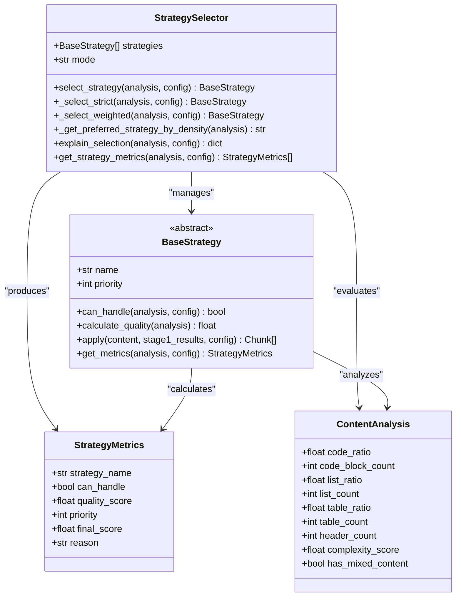
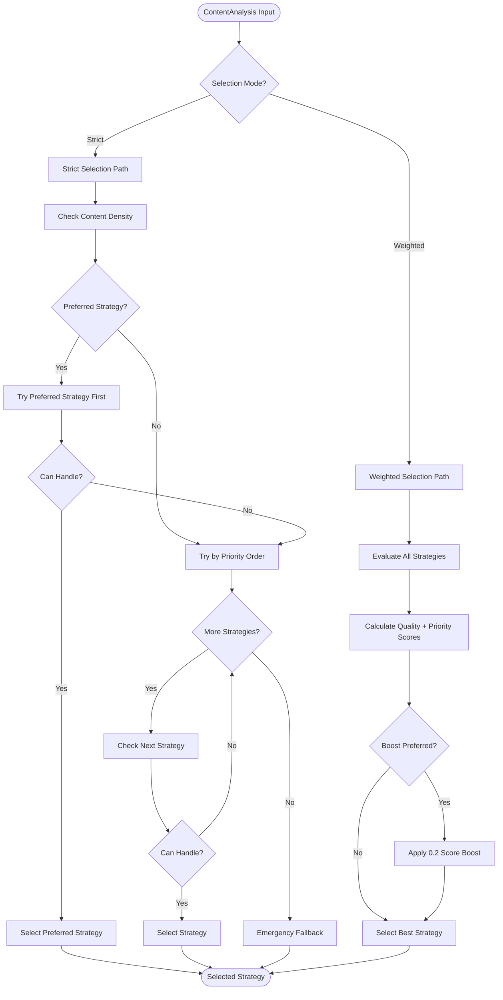
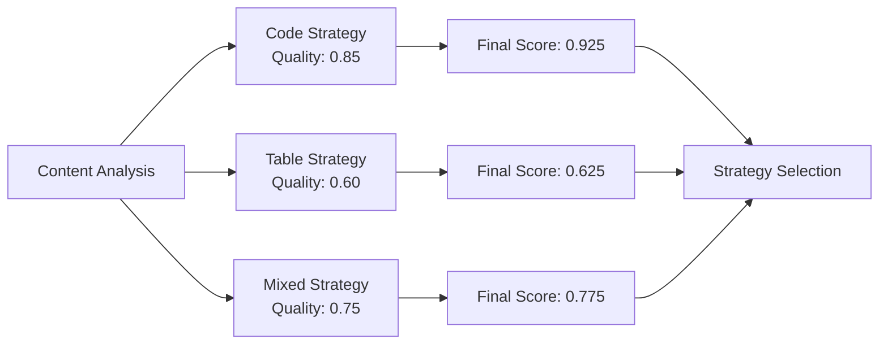
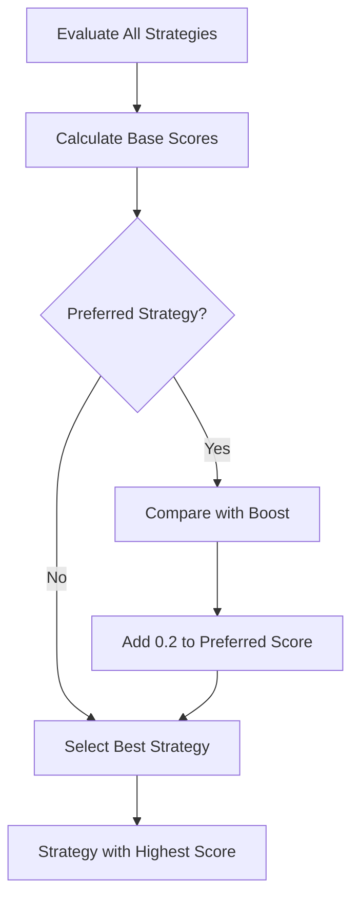
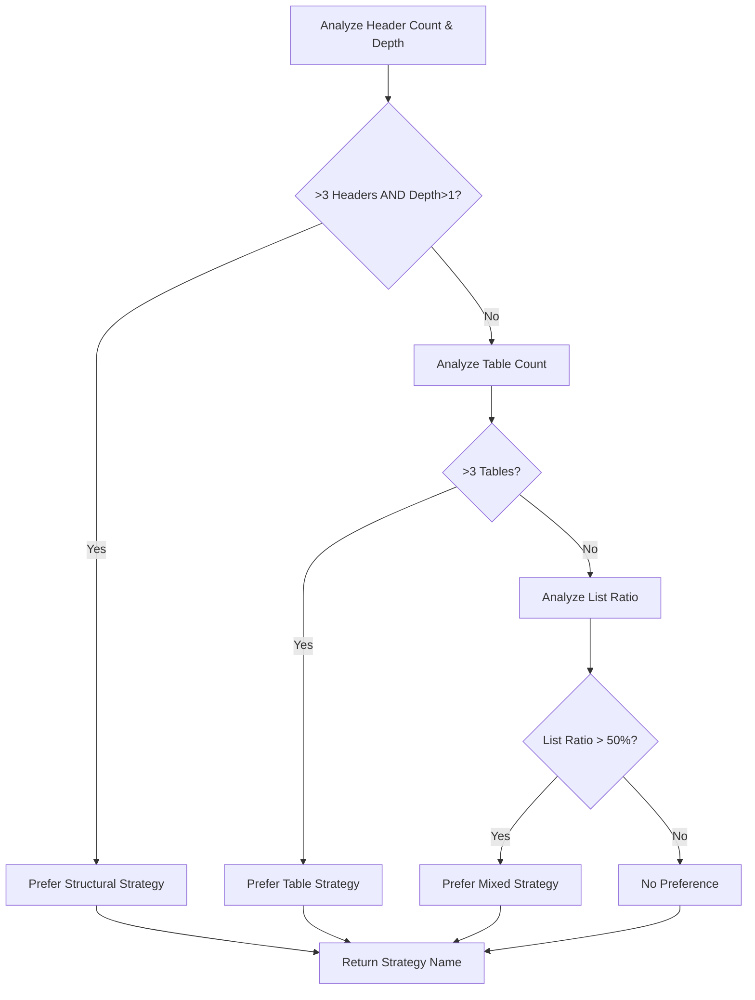
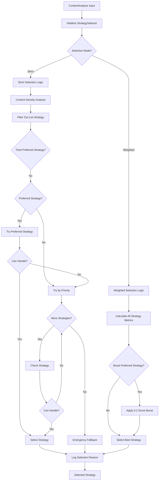
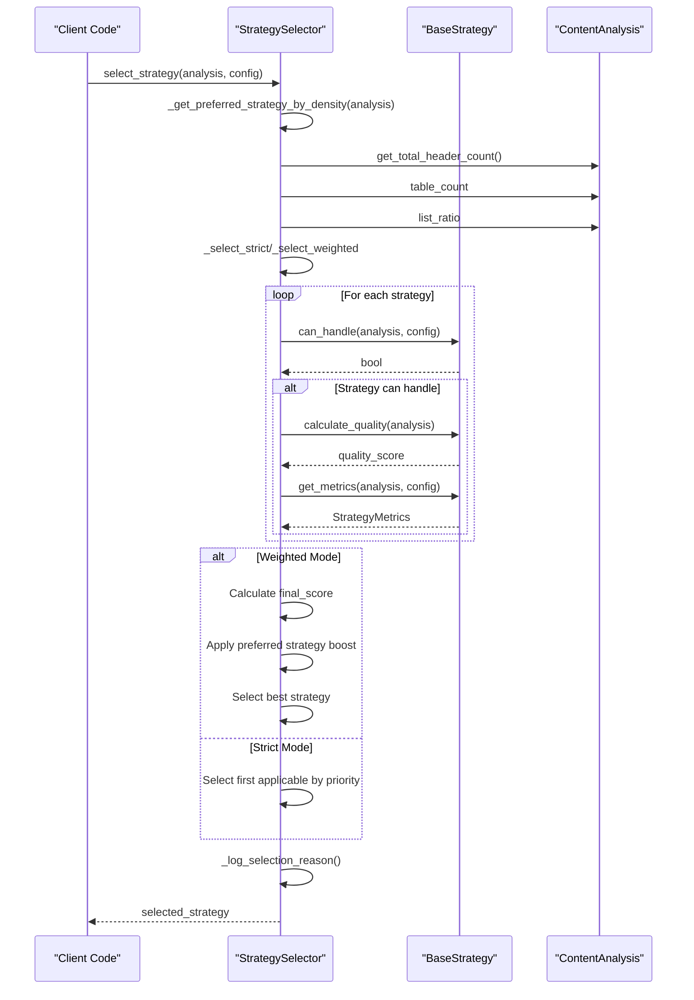

# Strategy Selection Algorithm

<cite>
**Referenced Files in This Document**
- [selector.py](file://markdown_chunker_legacy/chunker/selector.py)
- [types.py](file://markdown_chunker_legacy/chunker/types.py)
- [base.py](file://markdown_chunker_legacy/chunker/strategies/base.py)
- [code_strategy.py](file://markdown_chunker_legacy/chunker/strategies/code_strategy.py)
- [table_strategy.py](file://markdown_chunker_legacy/chunker/strategies/table_strategy.py)
- [mixed_strategy.py](file://markdown_chunker_legacy/chunker/strategies/mixed_strategy.py)
- [test_strategy_selector.py](file://tests/chunker/test_strategy_selector.py)
</cite>

## Table of Contents
1. [Introduction](#introduction)
2. [Architecture Overview](#architecture-overview)
3. [Selection Modes](#selection-modes)
4. [StrategyMetrics System](#strategymetrics-system)
5. [Strict Priority-Based Selection](#strict-priority-based-selection)
6. [Weighted Scoring Selection](#weighted-scoring-selection)
7. [Content Density Analysis](#content-density-analysis)
8. [Strategy Implementation Details](#strategy-implementation-details)
9. [Decision Flow Charts](#decision-flow-charts)
10. [Troubleshooting Guide](#troubleshooting-guide)
11. [Performance Considerations](#performance-considerations)

## Introduction

The strategy selection algorithm in the Markdown chunker serves as the intelligent decision-making system that determines which chunking strategy to use for a given document. This system evaluates content characteristics through a sophisticated scoring mechanism and implements two distinct selection modes to optimize chunking outcomes for different use cases.

The algorithm operates on the principle of content-aware strategy selection, where each strategy is evaluated based on its suitability for the document's content type, structural complexity, and quality metrics. The system prioritizes strategies with higher priority values while considering quality scores to achieve optimal chunking results.

## Architecture Overview

The strategy selection system consists of several interconnected components that work together to make intelligent decisions about chunking strategy selection.



**Diagram sources**
- [selector.py](file://markdown_chunker_legacy/chunker/selector.py#L23-L466)
- [base.py](file://markdown_chunker_legacy/chunker/strategies/base.py#L16-L426)
- [types.py](file://markdown_chunker_legacy/chunker/types.py#L1055-L1079)

**Section sources**
- [selector.py](file://markdown_chunker_legacy/chunker/selector.py#L23-L466)
- [base.py](file://markdown_chunker_legacy/chunker/strategies/base.py#L16-L426)

## Selection Modes

The strategy selection algorithm operates in two distinct modes, each serving different optimization goals:

### Strict Mode
Strict mode prioritizes strategy selection based on predefined priority order, selecting the first strategy that can handle the content. This mode emphasizes reliability and predictability, ensuring that higher-priority strategies are always favored when applicable.

### Weighted Mode
Weighted mode combines priority and quality scores to calculate a final_score for each applicable strategy, selecting the strategy with the highest combined score. This mode optimizes for both strategy priority and content-specific quality, potentially selecting lower-priority strategies when they provide superior quality for the given content.



**Diagram sources**
- [selector.py](file://markdown_chunker_legacy/chunker/selector.py#L78-L235)

**Section sources**
- [selector.py](file://markdown_chunker_legacy/chunker/selector.py#L78-L235)

## StrategyMetrics System

The StrategyMetrics system provides comprehensive evaluation data for each strategy, enabling informed selection decisions through multiple scoring dimensions.

### Metrics Structure

Each strategy produces a StrategyMetrics object containing:

| Metric | Type | Description | Range |
|--------|------|-------------|-------|
| strategy_name | str | Human-readable strategy identifier | N/A |
| can_handle | bool | Whether strategy can process content | True/False |
| quality_score | float | Content-specific suitability score | 0.0 - 1.0 |
| priority | int | Strategy priority level (1=highest) | 1 - 6 |
| final_score | float | Combined priority + quality score | 0.0 - 1.0 |
| reason | str | Human-readable selection rationale | N/A |

### Quality Score Calculation

Quality scores are strategy-specific and reflect how well a strategy matches the content characteristics:



**Diagram sources**
- [base.py](file://markdown_chunker_legacy/chunker/strategies/base.py#L96-L127)
- [code_strategy.py](file://markdown_chunker_legacy/chunker/strategies/code_strategy.py#L136-L185)

**Section sources**
- [types.py](file://markdown_chunker_legacy/chunker/types.py#L1055-L1079)
- [base.py](file://markdown_chunker_legacy/chunker/strategies/base.py#L96-L127)

## Strict Priority-Based Selection

The strict selection mode implements a deterministic approach that prioritizes strategy selection based on predefined priority order while considering content density preferences.

### Selection Algorithm

The `_select_strict` method follows this decision process:

1. **Content Density Analysis**: Evaluate content characteristics to identify preferred strategies
2. **Safety Filtering**: Exclude list strategy from automatic selection for mixed-content safety
3. **Preferred Strategy Attempt**: Try the preferred strategy first if identified
4. **Priority-Based Selection**: Iterate through strategies by priority order
5. **Emergency Fallback**: Default to structural strategy if no other strategy applies

### Safety Mechanisms

The strict mode implements several safety measures:

- **List Strategy Exclusion**: The list strategy is excluded from automatic selection to prevent content loss in mixed documents
- **Emergency Fallback**: Always falls back to structural strategy as ultimate safety net
- **Validation**: Comprehensive validation ensures strategy availability

**Section sources**
- [selector.py](file://markdown_chunker_legacy/chunker/selector.py#L79-L150)

## Weighted Scoring Selection

The weighted selection mode implements an optimization-based approach that balances strategy priority with content-specific quality scores to maximize overall chunking effectiveness.

### Final Score Calculation

The `_select_weighted` method calculates final_score using a combination of priority and quality metrics:

```
final_score = (priority_weight × 0.5) + (quality_score × 0.5)
```

Where:
- `priority_weight = 1.0 / strategy_priority`
- Higher priority strategies receive greater weight in the calculation
- Quality scores are normalized to 0.0-1.0 range

### Preferred Strategy Boost

When content density analysis identifies a preferred strategy, it receives a 0.2 score boost to ensure it's favored when quality scores are close:



**Diagram sources**
- [selector.py](file://markdown_chunker_legacy/chunker/selector.py#L207-L214)

**Section sources**
- [selector.py](file://markdown_chunker_legacy/chunker/selector.py#L173-L235)

## Content Density Analysis

The `_get_preferred_strategy_by_density` method implements content-aware strategy recommendation based on document characteristics, following specific precedence rules.

### Density Criteria

The system evaluates three primary content types to determine preferred strategies:

| Content Type | Threshold | Preferred Strategy | Priority |
|--------------|-----------|-------------------|----------|
| Headers & Depth | >3 headers, depth >1 | Structural | 1 |
| Tables | >3 tables | Table | 5 |
| Lists | >50% list content | Mixed | 3 |

### Strategy Precedence

The system implements a priority hierarchy for content density recommendations:

1. **Structural Strategy**: Highest priority for documents with substantial header hierarchy
2. **Table Strategy**: Medium priority for table-heavy documents
3. **Mixed Strategy**: Lower priority for list-dominant content

### Implementation Logic



**Diagram sources**
- [selector.py](file://markdown_chunker_legacy/chunker/selector.py#L237-L277)

**Section sources**
- [selector.py](file://markdown_chunker_legacy/chunker/selector.py#L237-L277)

## Strategy Implementation Details

Each strategy implements specific logic for content analysis and quality assessment, contributing to the overall selection decision.

### Code Strategy

The Code Strategy specializes in code-heavy documents with sophisticated language detection and function extraction capabilities.

#### Quality Calculation Factors:
- **Code Ratio**: Higher ratios receive better scores
- **Code Block Count**: More blocks increase quality score
- **Language Diversity**: Multiple languages provide bonuses

#### Implementation Features:
- Automatic language detection using regex patterns
- Function and class name extraction
- Atomic code block preservation
- Oversize chunk support for large code blocks

### Table Strategy

The Table Strategy handles table-heavy documents with intelligent row splitting and header preservation.

#### Quality Calculation Factors:
- **Table Count**: More tables improve quality score
- **Table Ratio**: Higher percentage of table content increases score
- **Table Structure**: Well-formed tables receive better ratings

#### Implementation Features:
- Regex-based table detection
- Row-based splitting with header duplication
- Column count and alignment preservation
- Intelligent chunk sizing for wide tables

### Mixed Strategy

The Mixed Strategy manages complex documents with multiple content types requiring semantic relationship preservation.

#### Quality Calculation Factors:
- **Content Balance**: No single dominant content type
- **Element Diversity**: Multiple different element types
- **Proportional Balance**: Balanced code, list, and table ratios

#### Implementation Features:
- Semantic section grouping
- Indivisible element preservation
- Adaptive chunk sizing
- Element type metadata preservation

**Section sources**
- [code_strategy.py](file://markdown_chunker_legacy/chunker/strategies/code_strategy.py#L136-L185)
- [table_strategy.py](file://markdown_chunker_legacy/chunker/strategies/table_strategy.py#L98-L125)
- [mixed_strategy.py](file://markdown_chunker_legacy/chunker/strategies/mixed_strategy.py#L120-L170)

## Decision Flow Charts

### Complete Selection Process



**Diagram sources**
- [selector.py](file://markdown_chunker_legacy/chunker/selector.py#L58-L235)

### Strategy Evaluation Process



**Diagram sources**
- [selector.py](file://markdown_chunker_legacy/chunker/selector.py#L58-L235)
- [base.py](file://markdown_chunker_legacy/chunker/strategies/base.py#L96-L127)

## Troubleshooting Guide

### Common Issues and Solutions

#### Unexpected Fallback Behavior

**Problem**: Strategy selection consistently falls back to structural strategy despite obvious content characteristics.

**Causes**:
- Content analysis thresholds too restrictive
- Strategy configuration issues
- Content density analysis failures

**Solutions**:
1. Verify content analysis accuracy
2. Check strategy threshold configurations
3. Review strategy availability and priorities
4. Enable debug logging for detailed analysis

#### Poor Quality Selection

**Problem**: Suboptimal strategy chosen for specific content types.

**Causes**:
- Incorrect quality score calculations
- Priority configuration conflicts
- Content density analysis misinterpretation

**Solutions**:
1. Use `explain_selection()` method for detailed analysis
2. Review strategy quality calculation logic
3. Adjust priority weights if necessary
4. Validate content analysis results

#### Performance Issues

**Problem**: Slow strategy selection for large documents.

**Causes**:
- Excessive strategy evaluation
- Complex quality calculations
- Inefficient content analysis

**Solutions**:
1. Limit strategy pool size
2. Optimize quality calculation algorithms
3. Implement early termination criteria
4. Use weighted mode for better performance

### Debugging Tools

#### Strategy Selection Explanation

The `explain_selection()` method provides comprehensive insights into strategy selection decisions:

```python
explanation = selector.explain_selection(analysis, config)
print(f"Selected: {explanation['selected_strategy']}")
print(f"Mode: {explanation['selection_mode']}")
print("Strategy Evaluation:")
for strategy in explanation['strategy_evaluation']:
    print(f"  {strategy['name']}: Quality={strategy['quality_score']:.2f}, "
          f"Final={strategy['final_score']:.2f}, "
          f"Selected={strategy['selected']}")
```

#### Validation Methods

```python
# Check strategy configuration validity
validation_issues = selector.validate_strategies()
if validation_issues:
    print("Configuration issues:", validation_issues)

# Get all applicable strategies with scores
applicable = selector.get_applicable_strategies(analysis, config)
for strategy, score in applicable:
    print(f"{strategy.name}: {score:.3f}")
```

**Section sources**
- [selector.py](file://markdown_chunker_legacy/chunker/selector.py#L325-L367)
- [selector.py](file://markdown_chunker_legacy/chunker/selector.py#L369-L401)

## Performance Considerations

### Selection Algorithm Complexity

The strategy selection algorithm operates with O(n) complexity where n is the number of available strategies:

- **Strict Mode**: Worst case O(n) as all strategies may need evaluation
- **Weighted Mode**: Same complexity but with additional score calculation overhead
- **Early Termination**: Both modes implement early termination when applicable strategies are found

### Memory Usage

The system maintains minimal memory overhead:
- StrategyMetrics objects are lightweight data containers
- Content analysis results are cached appropriately
- No recursive evaluations or deep nesting

### Optimization Recommendations

1. **Strategy Pool Management**: Limit strategy pool to relevant strategies for specific use cases
2. **Threshold Tuning**: Adjust content analysis thresholds based on domain requirements
3. **Caching**: Implement caching for frequently analyzed content patterns
4. **Parallel Processing**: Consider parallel evaluation for very large strategy pools

### Monitoring and Metrics

Key performance indicators for strategy selection:

- **Selection Time**: Monitor strategy selection duration
- **Fallback Rate**: Track fallback occurrences across different content types
- **Quality Distribution**: Analyze quality score distributions
- **Strategy Utilization**: Monitor which strategies are most frequently selected