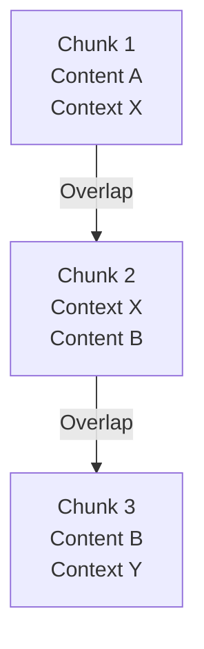

# Behavior Flags Configuration

<cite>
**Referenced Files in This Document**   
- [ChunkConfig](file://markdown_chunker_legacy/chunker/types.py#L500-L600)
- [OverlapManager](file://markdown_chunker_legacy/chunker/components/overlap_manager.py#L38-L200)
- [test_preamble_config.py](file://tests/chunker/test_preamble_config.py#L1-L168)
- [config.py](file://markdown_chunker_v2/config.py#L13-L80)
</cite>

## Table of Contents
1. [Introduction](#introduction)
2. [Core Behavior Flags](#core-behavior-flags)
3. [Overlap Configuration](#overlap-configuration)
4. [Preamble Extraction](#preamble-extraction)
5. [Fallback Mechanisms](#fallback-mechanisms)
6. [Streaming and Performance](#streaming-and-performance)
7. [Configuration Profiles](#configuration-profiles)
8. [Best Practices](#best-practices)
9. [Conclusion](#conclusion)

## Introduction
This document provides comprehensive documentation for the behavior flags that control chunking operations in the markdown chunker system. The chunking process is governed by a set of boolean flags and configuration parameters that determine how markdown content is divided into manageable chunks for downstream processing, particularly in retrieval-augmented generation (RAG) systems and other document processing applications.

The behavior flags system offers fine-grained control over the chunking process, allowing users to optimize for different content types, performance requirements, and application use cases. These flags influence critical aspects of chunking including content preservation, overlap generation, fallback strategies, and preamble handling.

This documentation covers all major behavior flags including allow_oversize, preserve_code_blocks, preserve_tables, preserve_list_hierarchy, enable_overlap, enable_fallback, enable_streaming, extract_preamble, and separate_preamble_chunk, explaining their purpose, impact, default settings, and recommended usage patterns.

**Section sources**
- [types.py](file://markdown_chunker_legacy/chunker/types.py#L500-L600)

## Core Behavior Flags

The core behavior flags control fundamental aspects of how content is preserved during the chunking process. These flags ensure that important structural elements remain intact and that the chunking process respects the semantic boundaries of the original document.

### allow_oversize
The `allow_oversize` flag determines whether chunks can exceed the maximum chunk size when necessary to preserve content integrity. When set to `True` (the default), the system allows oversized chunks for indivisible elements like large code blocks or tables that cannot be split without compromising their meaning or functionality.

This flag is essential for preventing data loss when processing documents with large atomic elements. For example, a code block that is 5,000 characters long will be preserved as a single chunk even if the `max_chunk_size` is set to 4,096 characters. The chunk will be marked with metadata indicating it is intentionally oversized.

When set to `False`, the system will attempt to split such large elements, potentially compromising their integrity but ensuring all chunks adhere strictly to size limits.

**Section sources**
- [types.py](file://markdown_chunker_legacy/chunker/types.py#L534-L535)
- [types.py](file://markdown_chunker_legacy/chunker/types.py#L598-L599)

### preserve_code_blocks
The `preserve_code_blocks` flag controls whether code blocks are kept intact during chunking. When enabled (default: `True`), the system treats code blocks as atomic units that should not be split across multiple chunks.

This preservation is critical for maintaining the functionality and readability of code examples. Splitting a code block across chunks can break syntax, disrupt indentation, and make the code difficult to understand or execute. The chunker identifies code blocks using markdown fence patterns (```language\n...```) and ensures they remain whole.

When disabled, code blocks may be split at natural boundaries, which might be appropriate for very large code files where preserving the entire block would create excessively large chunks.

**Section sources**
- [types.py](file://markdown_chunker_legacy/chunker/types.py#L536-L537)
- [types.py](file://markdown_chunker_legacy/chunker/types.py#L599-L600)

### preserve_tables
The `preserve_tables` flag determines whether markdown tables are kept intact during chunking. When enabled (default: `True`), tables are treated as atomic units that should not be split across chunks.

Tables are particularly sensitive to splitting, as breaking them across chunks can disrupt column alignment, separate headers from data rows, and make the table difficult to interpret. The chunker identifies tables by their pipe (`|`) delimiter structure and ensures they remain complete.

This flag works in conjunction with `allow_oversize`, as large tables may require oversized chunks to maintain their integrity. For documents with many small tables, preserving them ensures each table remains readable and self-contained.

**Section sources**
- [types.py](file://markdown_chunker_legacy/chunker/types.py#L537-L538)
- [types.py](file://markdown_chunker_legacy/chunker/types.py#L600-L601)

### preserve_list_hierarchy
The `preserve_list_hierarchy` flag controls whether list items and their hierarchical structure are preserved during chunking. When enabled (default: `True`), the system attempts to keep related list items together in the same chunk.

This preservation maintains the logical grouping of list items, which is important for understanding enumerated steps, bullet point summaries, or nested outlines. The chunker recognizes list patterns (dashes, asterisks, numbers followed by periods) and considers the hierarchical relationship between nested lists.

Disabling this flag allows lists to be split more freely, which might be appropriate when list items are independent or when strict adherence to chunk size limits is required.

**Section sources**
- [types.py](file://markdown_chunker_legacy/chunker/types.py#L538-L539)
- [types.py](file://markdown_chunker_legacy/chunker/types.py#L601-L602)

## Overlap Configuration

Overlap configuration controls how adjacent chunks share context to maintain continuity and improve the coherence of processed content.

### enable_overlap
The `enable_overlap` flag determines whether overlapping content is generated between adjacent chunks. When enabled (default: `True`), the system creates overlapping regions that provide context continuity between chunks.

Overlap is particularly valuable in RAG systems where a query might reference information that spans chunk boundaries. By including overlapping context, the system increases the likelihood that relevant information is captured in a single chunk.

The overlap size is controlled by two parameters: `overlap_size` (absolute character count) and `overlap_percentage` (relative to average chunk size). The system uses `overlap_size` when specified, falling back to percentage-based calculation when `overlap_size` is zero.



**Diagram sources**
- [overlap_manager.py](file://markdown_chunker_legacy/chunker/components/overlap_manager.py#L38-L80)
- [types.py](file://markdown_chunker_legacy/chunker/types.py#L585-L586)

### Interaction with overlap_size and overlap_percentage
The overlap system supports both fixed-size and percentage-based overlap calculations. The `overlap_size` parameter specifies the exact number of characters to overlap (default: 200), while `overlap_percentage` specifies the overlap as a fraction of the average chunk size (default: 0.1 or 10%).

When both parameters are specified, `overlap_size` takes precedence. The system calculates the effective overlap size using the following logic:

```python
if overlap_size > 0:
    return overlap_size
elif overlap_percentage > 0 and chunks:
    avg_chunk_size = sum(len(c.content) for c in chunks) // len(chunks)
    return int(avg_chunk_size * overlap_percentage)
else:
    return 0
```

Additionally, the system enforces a maximum overlap ratio of 40% of the source chunk size to prevent excessive duplication. For example, in a 1,000-character chunk, the maximum overlap would be 400 characters, regardless of the configured `overlap_size`.

**Section sources**
- [overlap_manager.py](file://markdown_chunker_legacy/chunker/components/overlap_manager.py#L139-L158)

## Preamble Extraction

Preamble extraction controls how content before the first header is handled in the chunking process.

### extract_preamble
The `extract_preamble` flag determines whether content appearing before the first header in a document is extracted and processed specially. When enabled (default: `True`), the system identifies and extracts this preamble content for special handling.

Preamble content often contains important introductory information, metadata, or contextual material that sets the stage for the main document. Examples include document metadata (author, date, version), introductory paragraphs, or high-level summaries.

The system identifies the preamble by finding the first header (lines starting with #) and extracting all content before it. If no headers exist in the document, no preamble is extracted.

**Section sources**
- [types.py](file://markdown_chunker_legacy/chunker/types.py#L597-L598)
- [types.py](file://markdown_chunker_legacy/chunker/types.py#L615-L616)

### separate_preamble_chunk
The `separate_preamble_chunk` flag controls whether the extracted preamble is placed in its own dedicated chunk. When disabled (default), the preamble content is added to the metadata of the first content chunk. When enabled, the preamble is placed in a separate initial chunk.

This flag provides flexibility in how preamble content is structured in the output:

- When `separate_preamble_chunk=False`: Preamble is metadata in first chunk
- When `separate_preamble_chunk=True`: Preamble gets its own chunk

The separate chunk approach is useful when the preamble contains substantial content that should be searchable or retrievable independently, such as detailed document metadata or extensive introductions.

**Section sources**
- [types.py](file://markdown_chunker_legacy/chunker/types.py#L598-L599)
- [types.py](file://markdown_chunker_legacy/chunker/types.py#L616-L617)

### preamble_min_size
The `preamble_min_size` parameter (default: 10) specifies the minimum number of non-whitespace characters required for content to be considered a valid preamble. This prevents trivial content (like whitespace or short phrases) from being treated as a preamble.

For example, if a document starts with "Note:" followed immediately by a header, and the "Note:" text is only 5 characters long, it would not be extracted as a preamble when `preamble_min_size=10`.

This threshold helps filter out insignificant content while ensuring meaningful introductory material is properly captured.

**Section sources**
- [types.py](file://markdown_chunker_legacy/chunker/types.py#L617-L618)
- [test_preamble_config.py](file://tests/chunker/test_preamble_config.py#L1-L168)

## Fallback Mechanisms

Fallback mechanisms ensure robust chunking even when primary strategies fail.

### enable_fallback
The `enable_fallback` flag determines whether fallback strategies are available when the primary chunking strategy fails. When enabled (default: `True`), the system will automatically attempt alternative strategies if the selected strategy cannot produce valid chunks.

The fallback system operates as a chain of strategies, typically following this order:
1. Primary strategy (based on document analysis)
2. Structural strategy (using headers as boundaries)
3. Sentences strategy (splitting at sentence boundaries)

Each level in the fallback chain attempts to chunk the content, with the system proceeding to the next level only if the current strategy fails to produce valid chunks.

**Section sources**
- [types.py](file://markdown_chunker_legacy/chunker/types.py#L539-L540)
- [types.py](file://markdown_chunker_legacy/chunker/types.py#L604-L605)

## Streaming and Performance

Performance-related flags optimize the chunking process for different document sizes and processing environments.

### enable_streaming
The `enable_streaming` flag controls whether streaming processing is used for large documents. When disabled (default: `False`), the entire document is loaded into memory for processing. When enabled, the system processes the document in a streaming fashion, which reduces memory usage for very large files.

Streaming is particularly beneficial for documents exceeding the `streaming_threshold` (default: 10MB), as it prevents excessive memory consumption. However, streaming may limit some advanced analysis capabilities that require full document context.

**Section sources**
- [types.py](file://markdown_chunker_legacy/chunker/types.py#L542-L543)
- [types.py](file://markdown_chunker_legacy/chunker/types.py#L612-L613)

## Configuration Profiles

The system provides several pre-configured profiles that set optimal values for the behavior flags based on common use cases:

### Default Configuration
The default configuration provides balanced settings suitable for general markdown documents:
- `max_chunk_size=4096`
- `min_chunk_size=512`
- `overlap_size=200`
- All preservation flags enabled
- Fallback enabled

### Code-Heavy Configuration
Optimized for technical documentation with extensive code examples:
- `max_chunk_size=6144`
- `code_ratio_threshold=0.5`
- Aggressive code block preservation
- Larger overlap for code context

### RAG-Optimized Configuration
Designed for retrieval-augmented generation systems:
- `max_chunk_size=2048`
- `enable_overlap=True`
- `overlap_size=200`
- Balanced preservation settings

### Search Indexing Configuration
Optimized for search engine indexing:
- `max_chunk_size=1024`
- `enable_overlap=False`
- Reduced preservation to maximize chunk count

**Section sources**
- [types.py](file://markdown_chunker_legacy/chunker/types.py#L714-L758)
- [technical_spec.md](file://tests/fixtures/real_documents/technical_spec.md#L278-L320)

## Best Practices

### Content-Type Based Configuration
- **Code-heavy documents**: Enable all preservation flags, increase `max_chunk_size`, use larger overlap
- **Structured documentation**: Enable header and list preservation, moderate chunk sizes
- **Simple text documents**: Can disable some preservation flags, use smaller chunks
- **Mixed content**: Use default settings with fallback enabled

### Performance Optimization
- For large documents (>10MB): Consider enabling streaming
- For real-time applications: Use smaller chunk sizes and disable expensive analysis
- For batch processing: Use larger chunks and aggressive overlap

### RAG System Optimization
- Use moderate chunk sizes (1500-3000 characters)
- Enable overlap with 10-15% of chunk size
- Preserve code blocks and tables
- Extract preamble content
- Keep fallback enabled for robustness

### Memory-Constrained Environments
- Reduce `max_chunk_size`
- Disable streaming for small documents
- Consider disabling overlap if memory is extremely limited
- Use simpler strategies that require less state

## Conclusion
The behavior flags system provides comprehensive control over the markdown chunking process, allowing fine-tuning for various content types and application requirements. By understanding and appropriately configuring these flags, users can optimize their chunking strategy for specific use cases, balancing content preservation, performance, and output quality.

The default settings provide a robust starting point for most applications, but overriding these defaults can significantly improve results for specialized content types or performance requirements. The key is understanding the trade-offs between content integrity, chunk size constraints, and processing efficiency.

When configuring these flags, consider the downstream application's requirements, the nature of your content, and your performance constraints to achieve the optimal balance for your use case.