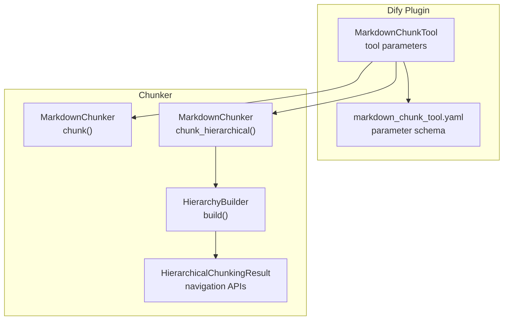
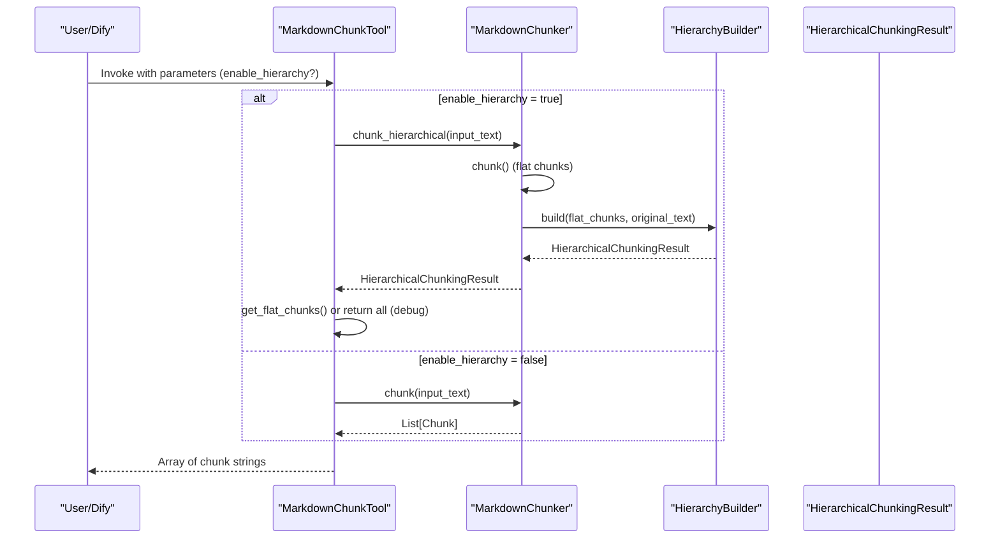
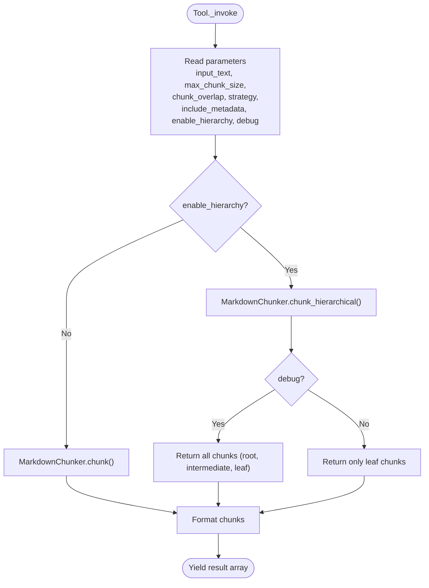
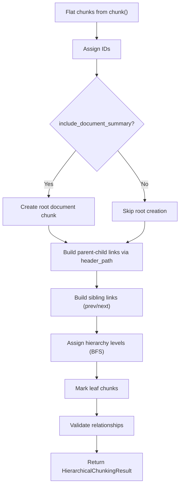
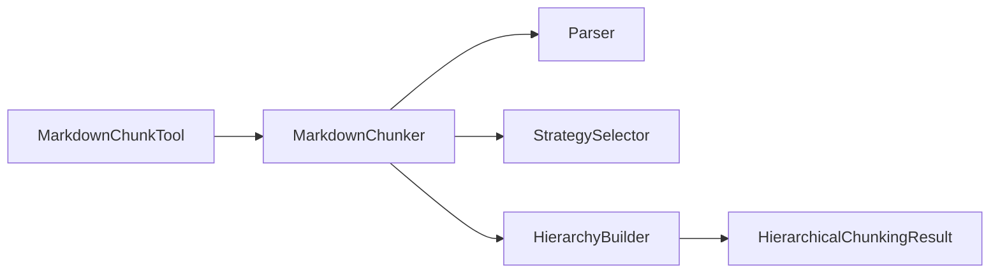

# enable_hierarchy Parameter

<cite>
**Referenced Files in This Document**
- [markdown_chunker_v2/chunker.py](file://markdown_chunker_v2/chunker.py)
- [markdown_chunker_v2/hierarchy.py](file://markdown_chunker_v2/hierarchy.py)
- [markdown_chunker_v2/config.py](file://markdown_chunker_v2/config.py)
- [tools/markdown_chunk_tool.py](file://tools/markdown_chunk_tool.py)
- [tools/markdown_chunk_tool.yaml](file://tools/markdown_chunk_tool.yaml)
- [tests/integration/test_dify_hierarchical_integration.py](file://tests/integration/test_dify_hierarchical_integration.py)
- [tests/chunker/test_hierarchical_chunking.py](file://tests/chunker/test_hierarchical_chunking.py)
- [tests/integration/test_hierarchical_integration.py](file://tests/integration/test_hierarchical_integration.py)
</cite>

## Table of Contents
1. [Introduction](#introduction)
2. [Project Structure](#project-structure)
3. [Core Components](#core-components)
4. [Architecture Overview](#architecture-overview)
5. [Detailed Component Analysis](#detailed-component-analysis)
6. [Dependency Analysis](#dependency-analysis)
7. [Performance Considerations](#performance-considerations)
8. [Troubleshooting Guide](#troubleshooting-guide)
9. [Conclusion](#conclusion)

## Introduction
This document explains the enable_hierarchy parameter and how it controls hierarchical chunking in the Dify plugin. It covers how the parameter is defined, how it is processed by the tool, and how the underlying chunker constructs parent-child relationships and navigation metadata for chunks. It also describes the differences between hierarchical and flat chunking modes and how to use the hierarchical output effectively.

## Project Structure
The enable_hierarchy parameter is surfaced in the Dify tool definition and consumed by the tool’s invocation logic. The chunker exposes a dedicated hierarchical mode that builds parent-child and sibling relationships on top of the flat chunk list produced by the standard chunking pipeline.

**Diagram sources**
- [tools/markdown_chunk_tool.py](file://tools/markdown_chunk_tool.py#L135-L204)
- [tools/markdown_chunk_tool.yaml](file://tools/markdown_chunk_tool.yaml#L124-L137)
- [markdown_chunker_v2/chunker.py](file://markdown_chunker_v2/chunker.py#L176-L207)
- [markdown_chunker_v2/hierarchy.py](file://markdown_chunker_v2/hierarchy.py#L199-L276)

**Section sources**
- [tools/markdown_chunk_tool.yaml](file://tools/markdown_chunk_tool.yaml#L124-L137)
- [tools/markdown_chunk_tool.py](file://tools/markdown_chunk_tool.py#L135-L204)
- [markdown_chunker_v2/chunker.py](file://markdown_chunker_v2/chunker.py#L176-L207)
- [markdown_chunker_v2/hierarchy.py](file://markdown_chunker_v2/hierarchy.py#L199-L276)

## Core Components
- Tool parameter definition: The enable_hierarchy parameter is defined in the tool’s YAML schema with a boolean type, default false, and localized descriptions for human and LLM consumption.
- Tool invocation logic: The tool reads enable_hierarchy and routes to either standard chunking or hierarchical chunking. When hierarchical mode is enabled, the tool returns only leaf chunks by default unless debug mode is also enabled.
- Hierarchical chunking: The chunker’s chunk_hierarchical method applies the standard chunking pipeline and then builds parent-child and sibling relationships using header_path metadata. It assigns hierarchy levels and provides navigation APIs.

Key behaviors:
- Default: enable_hierarchy is false; chunking returns flat chunks.
- When enabled: chunk_hierarchical is used; navigation metadata (parent_id, children_ids, sibling_ids, hierarchy_level, header_path) is added to chunks.
- Backward compatibility: The standard chunk() method is unchanged.

**Section sources**
- [tools/markdown_chunk_tool.yaml](file://tools/markdown_chunk_tool.yaml#L124-L137)
- [tools/markdown_chunk_tool.py](file://tools/markdown_chunk_tool.py#L162-L190)
- [markdown_chunker_v2/chunker.py](file://markdown_chunker_v2/chunker.py#L176-L207)
- [markdown_chunker_v2/hierarchy.py](file://markdown_chunker_v2/hierarchy.py#L199-L276)

## Architecture Overview
The enable_hierarchy parameter toggles between two execution paths:
- Flat mode: chunk() produces a list of chunks with standard metadata.
- Hierarchical mode: chunk_hierarchical() produces a hierarchical structure with navigation metadata and exposes navigation methods.

**Diagram sources**
- [tools/markdown_chunk_tool.py](file://tools/markdown_chunk_tool.py#L162-L204)
- [markdown_chunker_v2/chunker.py](file://markdown_chunker_v2/chunker.py#L176-L207)
- [markdown_chunker_v2/hierarchy.py](file://markdown_chunker_v2/hierarchy.py#L223-L276)

## Detailed Component Analysis

### Tool Parameter: enable_hierarchy
- Definition: Boolean parameter with default false.
- Purpose: Controls whether hierarchical chunking is enabled.
- Behavior:
  - When true: The tool calls chunk_hierarchical and returns leaf chunks by default; debug mode can include root and intermediate chunks.
  - When false: The tool calls chunk and returns flat chunks.

**Section sources**
- [tools/markdown_chunk_tool.yaml](file://tools/markdown_chunk_tool.yaml#L124-L137)
- [tools/markdown_chunk_tool.py](file://tools/markdown_chunk_tool.py#L162-L190)

### Tool Invocation Flow
- Extraction: The tool extracts enable_hierarchy from parameters.
- Routing: If enable_hierarchy is true, it calls chunk_hierarchical; otherwise, chunk.
- Output: The tool formats each chunk according to include_metadata and debug flags.

**Diagram sources**
- [tools/markdown_chunk_tool.py](file://tools/markdown_chunk_tool.py#L162-L204)

**Section sources**
- [tools/markdown_chunk_tool.py](file://tools/markdown_chunk_tool.py#L135-L204)

### Hierarchical Chunking Pipeline
- Standard pipeline: The chunker runs parsing, strategy selection, strategy application, small chunk merging, overlap application, and validation.
- Hierarchical extension: After obtaining flat chunks, the HierarchyBuilder:
  - Assigns unique IDs to chunks.
  - Optionally creates a root document chunk (controlled by include_document_summary).
  - Builds parent-child links using header_path metadata.
  - Builds sibling links and assigns hierarchy levels based on tree depth.
  - Marks leaf chunks and validates relationships.

**Diagram sources**
- [markdown_chunker_v2/chunker.py](file://markdown_chunker_v2/chunker.py#L176-L207)
- [markdown_chunker_v2/hierarchy.py](file://markdown_chunker_v2/hierarchy.py#L223-L276)

**Section sources**
- [markdown_chunker_v2/chunker.py](file://markdown_chunker_v2/chunker.py#L176-L207)
- [markdown_chunker_v2/hierarchy.py](file://markdown_chunker_v2/hierarchy.py#L199-L276)

### Navigation and Metadata
- Navigation APIs:
  - get_chunk(chunk_id)
  - get_children(parent_id)
  - get_parent(child_id)
  - get_ancestors(chunk_id)
  - get_siblings(chunk_id)
  - get_flat_chunks() (leaf-only)
  - get_by_level(level)
  - to_tree_dict() (JSON-safe tree)
- Metadata fields added during hierarchical build:
  - parent_id, children_ids, prev_sibling_id, next_sibling_id
  - hierarchy_level (0=root, 1=sections, 2=subsections, 3+=paragraphs)
  - header_path (used for parent resolution)
  - is_root, is_leaf
  - chunk_id (unique per chunk)

**Section sources**
- [markdown_chunker_v2/hierarchy.py](file://markdown_chunker_v2/hierarchy.py#L14-L197)

### Configuration Interaction
- include_document_summary: Controls whether a root document chunk is created in hierarchical mode. This is part of the chunker configuration and passed to the HierarchyBuilder.
- The tool does not expose include_document_summary directly; it is controlled by the chunker’s configuration.

**Section sources**
- [markdown_chunker_v2/config.py](file://markdown_chunker_v2/config.py#L92-L94)
- [markdown_chunker_v2/chunker.py](file://markdown_chunker_v2/chunker.py#L40-L53)
- [markdown_chunker_v2/hierarchy.py](file://markdown_chunker_v2/hierarchy.py#L208-L222)

### Behavior Verification
- Default disabled: Hierarchical mode is off by default; tests confirm that enabling is required to produce hierarchical metadata.
- Deep nesting: Hierarchical mode handles deeply nested headers robustly.
- Navigation correctness: Tests verify parent-child, sibling, and ancestor relationships, as well as level assignments.

**Section sources**
- [tests/integration/test_dify_hierarchical_integration.py](file://tests/integration/test_dify_hierarchical_integration.py#L75-L118)
- [tests/integration/test_dify_hierarchical_integration.py](file://tests/integration/test_dify_hierarchical_integration.py#L414-L444)
- [tests/chunker/test_hierarchical_chunking.py](file://tests/chunker/test_hierarchical_chunking.py#L90-L130)
- [tests/chunker/test_hierarchical_chunking.py](file://tests/chunker/test_hierarchical_chunking.py#L170-L208)
- [tests/chunker/test_hierarchical_chunking.py](file://tests/chunker/test_hierarchical_chunking.py#L410-L443)
- [tests/integration/test_hierarchical_integration.py](file://tests/integration/test_hierarchical_integration.py#L154-L166)
- [tests/integration/test_hierarchical_integration.py](file://tests/integration/test_hierarchical_integration.py#L168-L191)

## Dependency Analysis
- Tool depends on:
  - Tool YAML schema for parameter definitions.
  - Tool Python implementation for routing and formatting.
- Chunker depends on:
  - Parser and StrategySelector for flat chunking.
  - HierarchyBuilder for hierarchical post-processing.
- HierarchyBuilder depends on:
  - Chunk metadata (header_path, content_type, etc.).
  - Chunk IDs for linking.

**Diagram sources**
- [tools/markdown_chunk_tool.py](file://tools/markdown_chunk_tool.py#L135-L204)
- [markdown_chunker_v2/chunker.py](file://markdown_chunker_v2/chunker.py#L176-L207)
- [markdown_chunker_v2/hierarchy.py](file://markdown_chunker_v2/hierarchy.py#L199-L276)

**Section sources**
- [tools/markdown_chunk_tool.py](file://tools/markdown_chunk_tool.py#L135-L204)
- [markdown_chunker_v2/chunker.py](file://markdown_chunker_v2/chunker.py#L176-L207)
- [markdown_chunker_v2/hierarchy.py](file://markdown_chunker_v2/hierarchy.py#L199-L276)

## Performance Considerations
- Hierarchical mode adds O(n) post-processing to build parent-child and sibling links and compute hierarchy levels.
- Navigation methods are O(1) lookups via an internal index keyed by chunk_id.
- Tests demonstrate acceptable performance on documents with many headers.

**Section sources**
- [markdown_chunker_v2/hierarchy.py](file://markdown_chunker_v2/hierarchy.py#L14-L53)
- [tests/integration/test_hierarchical_integration.py](file://tests/integration/test_hierarchical_integration.py#L168-L191)

## Troubleshooting Guide
Common issues and resolutions:
- Missing hierarchical metadata:
  - Ensure enable_hierarchy is true in the tool parameters.
  - Confirm that the document contains headers or content that produces header_path metadata.
- Unexpected flat output:
  - If debug is false, only leaf chunks are returned. Enable debug to include root and intermediate chunks.
- Empty or incomplete hierarchy:
  - Verify that header_path metadata exists in chunks (produced by the strategy).
  - Check that include_document_summary is set appropriately if a root document chunk is expected.
- Validation failures:
  - The HierarchyBuilder validates parent-child counts and sibling chains. If validation errors occur, inspect chunk metadata for inconsistencies (e.g., mismatched children_ids or broken sibling links).

**Section sources**
- [tools/markdown_chunk_tool.py](file://tools/markdown_chunk_tool.py#L180-L190)
- [markdown_chunker_v2/hierarchy.py](file://markdown_chunker_v2/hierarchy.py#L565-L738)
- [tests/integration/test_hierarchical_integration.py](file://tests/integration/test_hierarchical_integration.py#L154-L166)

## Conclusion
The enable_hierarchy parameter provides a simple way to toggle hierarchical chunking in the Dify plugin. When enabled, the tool invokes the chunker’s hierarchical mode, which enriches chunks with parent-child and sibling relationships and exposes navigation APIs. This enables multi-level retrieval and context navigation while maintaining backward compatibility with flat chunking. Use debug mode to inspect the full hierarchy, and rely on the navigation APIs to traverse parents, children, siblings, and ancestors.