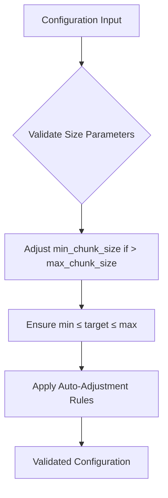
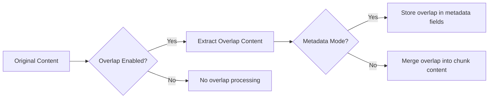
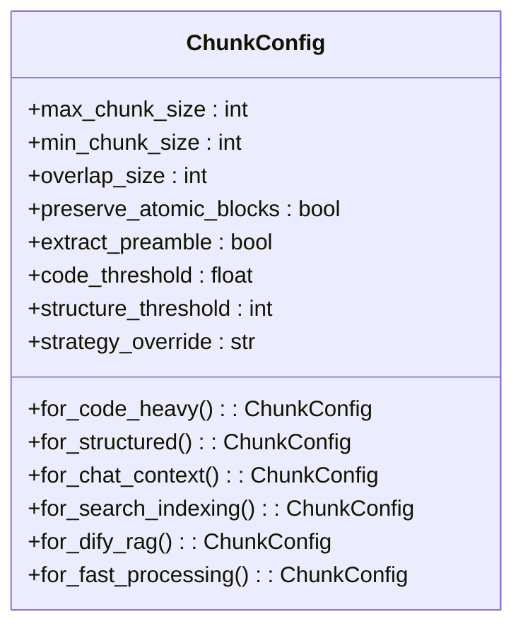
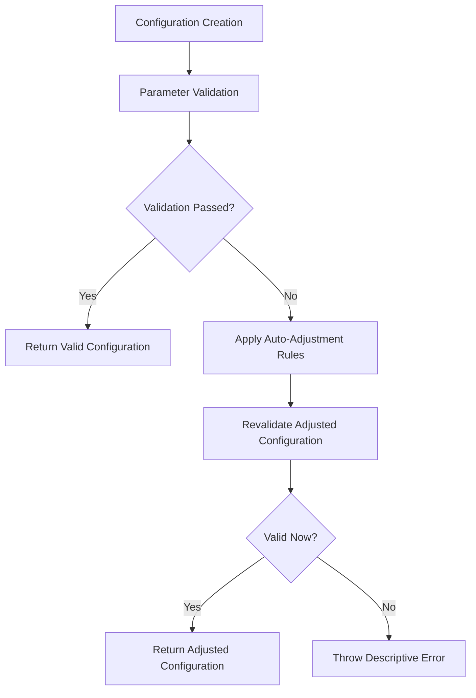

# Configuration Reference

<cite>
**Referenced Files in This Document**   
- [ChunkConfig](file://markdown_chunker_legacy/chunker/types.py#L900-L1080)
- [markdown_chunk_tool.yaml](file://tools/markdown_chunk_tool.yaml#L1-L128)
- [markdown_chunker.yaml](file://provider/markdown_chunker.yaml#L1-L23)
- [config.py](file://markdown_chunker_v2/config.py#L1-L170)
- [test_config_profiles.py](file://tests/chunker/test_config_profiles.py#L1-L70)
- [test_chunk_config_validation.py](file://tests/chunker/test_chunk_config_validation.py#L1-L207)
- [dify_integration.py](file://examples/dify_integration.py#L1-L487)
- [rag_integration.py](file://examples/rag_integration.py#L1-L432)
- [metadata_enricher.py](file://markdown_chunker_legacy/chunker/components/metadata_enricher.py#L1-L713)
</cite>

## Table of Contents
1. [Introduction](#introduction)
2. [Core Configuration Parameters](#core-configuration-parameters)
3. [Configuration Profiles](#configuration-profiles)
4. [YAML Configuration Format](#yaml-configuration-format)
5. [Configuration Validation and Error Handling](#configuration-validation-and-error-handling)
6. [Performance Tuning and Best Practices](#performance-tuning-and-best-practices)
7. [Examples](#examples)

## Introduction

The Markdown chunker provides a comprehensive configuration system that allows fine-tuning of chunking behavior for various use cases. The configuration system is designed to balance flexibility with simplicity, offering both granular control over individual parameters and predefined profiles for common scenarios.

The configuration system centers around the `ChunkConfig` class, which defines all available parameters for controlling the chunking process. These parameters include chunk size settings, overlap configuration, strategy selection thresholds, and metadata enrichment options. The system supports multiple configuration methods, including programmatic configuration in code, YAML-based configuration files for providers and tools, and API-based configuration for integration scenarios.

The configuration system has evolved from a complex set of 32 parameters in earlier versions to a streamlined set of 8 core parameters in the v2.0 release, while maintaining backward compatibility through the `from_legacy` class method. This simplification focuses on the most impactful configuration options while enabling advanced use cases through strategic defaults and automatic adjustments.

**Section sources**
- [ChunkConfig](file://markdown_chunker_legacy/chunker/types.py#L900-L1080)
- [config.py](file://markdown_chunker_v2/config.py#L1-L170)

## Core Configuration Parameters

The Markdown chunker exposes several key configuration parameters that control the chunking behavior. These parameters can be categorized into size parameters, overlap settings, strategy selection thresholds, and metadata enrichment options.

### Size Parameters

The size parameters control the dimensions of the generated chunks:

- **max_chunk_size**: Maximum size of each chunk in characters (default: 4096)
- **min_chunk_size**: Minimum size of each chunk in characters (default: 512)
- **target_chunk_size**: Target size for chunks when possible (default: 2048)

These parameters work together to ensure chunks fall within acceptable size ranges. The system automatically adjusts these values when constraints conflict (e.g., when min_chunk_size exceeds max_chunk_size) to maintain valid configurations.



**Diagram sources**
- [ChunkConfig](file://markdown_chunker_legacy/chunker/types.py#L900-L1080)
- [test_chunk_config_validation.py](file://tests/chunker/test_chunk_config_validation.py#L1-L207)

### Overlap Configuration

Overlap settings control how consecutive chunks share content to maintain context continuity:

- **overlap_size**: Number of characters to overlap between consecutive chunks (default: 200)
- **enable_overlap**: Whether overlap is enabled (derived from overlap_size > 0)
- **include_metadata**: Whether to store overlap in metadata rather than merging into content

The overlap system supports two modes of operation:
1. **Metadata mode** (include_metadata=true): Overlap content is stored in metadata.overlap_prefix/overlap_suffix fields, keeping the main content clean
2. **Legacy mode** (include_metadata=false): Overlap is merged directly into the chunk content



**Diagram sources**
- [markdown_chunk_tool.yaml](file://tools/markdown_chunk_tool.yaml#L53-L66)
- [metadata_enricher.py](file://markdown_chunker_legacy/chunker/components/metadata_enricher.py#L1-L713)

### Strategy Selection Thresholds

The chunker uses content analysis to automatically select the most appropriate chunking strategy based on document characteristics. The following thresholds influence this selection:

- **code_ratio_threshold**: Ratio of code characters to total characters that triggers code-focused strategy (default: 0.3)
- **structure_threshold**: Minimum number of headers required to use structural strategy (default: 3)
- **strategy_override**: Force a specific strategy regardless of content analysis (optional)

These thresholds enable the chunker to adapt its behavior to different document types, using code-aware strategies for code-heavy documents and structural strategies for documents with clear hierarchical organization.

### Metadata Enrichment Settings

Metadata enrichment enhances chunks with additional information that improves searchability and context preservation:

- **preserve_atomic_blocks**: Keep code blocks and tables intact (default: True)
- **extract_preamble**: Extract content before first header as preamble (default: True)
- **include_metadata**: Include structural metadata with each chunk (default: True)

When enabled, metadata enrichment adds information about chunk position, content statistics, strategy used, and document structure to each chunk's metadata dictionary.

**Section sources**
- [ChunkConfig](file://markdown_chunker_legacy/chunker/types.py#L900-L1080)
- [config.py](file://markdown_chunker_v2/config.py#L1-L170)
- [metadata_enricher.py](file://markdown_chunker_legacy/chunker/components/metadata_enricher.py#L1-L713)

## Configuration Profiles

The Markdown chunker provides several predefined configuration profiles optimized for specific use cases. These profiles are implemented as class methods on the `ChunkConfig` class and can be used as starting points for common scenarios.

### Available Profiles

- **for_code_heavy()**: Optimized for code-heavy documents with larger chunk sizes and lower code thresholds
- **for_structured()**: Optimized for structured documents with clear headers and sections
- **for_chat_context()**: Optimized for chat/LLM context with smaller chunks suitable for context windows
- **for_search_indexing()**: Optimized for search indexing with small chunks and overlap for better granularity
- **for_dify_rag()**: Optimized for Dify RAG systems with balanced settings for retrieval quality
- **for_fast_processing()**: Optimized for speed with larger chunks and disabled overlap



**Diagram sources**
- [ChunkConfig](file://markdown_chunker_legacy/chunker/types.py#L900-L1080)
- [test_config_profiles.py](file://tests/chunker/test_config_profiles.py#L1-L70)

### Profile Characteristics

Each profile is designed with specific performance characteristics:

| Profile | Max Chunk Size | Min Chunk Size | Overlap Size | Use Case |
|--------|----------------|----------------|--------------|----------|
| Code Heavy | 8192 | 1024 | 100 | Code documentation, source files |
| Structured | 4096 | 512 | 200 | Technical documentation, articles |
| Chat Context | 1536 | 200 | 200 | LLM context windows, chat applications |
| Search Indexing | 1024 | 100 | 100 | Semantic search, information retrieval |
| Dify RAG | 3072 | 256 | 150 | Dify integration, retrieval-augmented generation |
| Fast Processing | 8192 | 1024 | 100 | Batch processing, large document sets |

These profiles can be used directly or as a basis for custom configurations by modifying specific parameters.

**Section sources**
- [ChunkConfig](file://markdown_chunker_legacy/chunker/types.py#L900-L1080)
- [test_config_profiles.py](file://tests/chunker/test_config_profiles.py#L1-L70)

## YAML Configuration Format

The Markdown chunker supports YAML-based configuration for provider and tool implementations. This format is used in the `provider/markdown_chunker.yaml` and `tools/markdown_chunk_tool.yaml` files to define the interface and default settings.

### Provider Configuration

The provider configuration file defines the overall plugin properties:

```yaml
identity:
  author: asukhodko
  name: markdown_chunker
  label:
    en_US: Advanced Markdown Chunker
    zh_Hans: 高级 Markdown 分块器
    ru_RU: Продвинутый Markdown чанкер
  description:
    en_US: Advanced Markdown chunking with structural awareness for better RAG performance
  icon: icon.svg
  tags:
    - productivity
    - business

tools:
  - tools/markdown_chunk_tool.yaml

extra:
  python:
    source: provider/markdown_chunker.py
```

This configuration specifies the plugin identity, description, and references the tool configuration file.

### Tool Configuration

The tool configuration defines the parameters available to users:

```yaml
identity:
  name: markdown_chunk_tool
  author: asukhodko
  label:
    en_US: Markdown Chunker
  icon: icon.svg

description:
  human:
    en_US: Advanced Markdown chunking with structural awareness for better RAG performance. Intelligently splits documents while preserving context and structure.
  llm: |
    A tool for chunking Markdown documents with structural awareness.

parameters:
  - name: input_text
    type: string
    required: true
    form: llm
    label:
      en_US: Input Text
    human_description:
      en_US: The Markdown text content to be chunked
    llm_description: The Markdown document text that needs to be split into chunks for processing

  - name: max_chunk_size
    type: number
    required: false
    default: 1000
    form: form
    label:
      en_US: Max Chunk Size
    human_description:
      en_US: "Maximum size of each chunk in characters (default: 1000)"
    llm_description: Maximum number of characters allowed in each chunk. Larger values create bigger chunks with more context.

  - name: chunk_overlap
    type: number
    required: false
    default: 100
    form: form
    label:
      en_US: Chunk Overlap
    human_description:
      en_US: "Number of characters to overlap between consecutive chunks (default: 100). With include_metadata=true, overlap is stored in metadata; with include_metadata=false, overlap is merged into chunk content."
    llm_description: Number of characters that overlap between consecutive chunks to maintain context continuity. Overlap placement depends on include_metadata setting.

  - name: include_metadata
    type: boolean
    required: false
    default: true
    form: form
    label:
      en_US: Include Metadata
    human_description:
      en_US: "Include structural metadata with each chunk (default: true). When true, overlap is stored in metadata.overlap_prefix/overlap_suffix fields (clean content); when false, overlap is merged into chunk content (legacy mode)."
    llm_description: "Whether to include metadata about chunk structure, type, strategy used, line numbers, and complexity score. Also controls overlap handling: true stores overlap in metadata (clean content), false merges overlap into content (legacy mode)."

output_schema:
  type: object
  properties:
    result:
      $ref: "https://dify.ai/schemas/v1/general_structure.json"

extra:
  python:
    source: tools/markdown_chunk_tool.py
```

This configuration defines the tool's parameters, including their types, defaults, and user-facing descriptions in multiple languages.

**Section sources**
- [markdown_chunker.yaml](file://provider/markdown_chunker.yaml#L1-L23)
- [markdown_chunk_tool.yaml](file://tools/markdown_chunk_tool.yaml#L1-L128)

## Configuration Validation and Error Handling

The configuration system includes comprehensive validation to ensure settings are valid and consistent. Validation occurs during configuration object creation and includes both parameter-level checks and cross-parameter consistency checks.

### Validation Rules

The system enforces the following validation rules:

- **Positive sizes**: max_chunk_size and min_chunk_size must be positive integers
- **Size ordering**: min_chunk_size ≤ target_chunk_size ≤ max_chunk_size
- **Overlap constraints**: overlap_size must be non-negative and less than max_chunk_size
- **Threshold ranges**: code_threshold must be between 0 and 1
- **Strategy validity**: strategy_override must be one of the valid strategy names

When validation fails, the system raises descriptive `ValueError` exceptions with messages indicating the specific issue.

### Auto-Adjustment Behavior

Rather than rejecting configurations with minor issues, the system implements auto-adjustment rules:

- If min_chunk_size > max_chunk_size, min_chunk_size is adjusted to max_chunk_size // 2
- If target_chunk_size > max_chunk_size, target_chunk_size is adjusted to max_chunk_size
- If target_chunk_size < min_chunk_size, target_chunk_size is adjusted to min_chunk_size

This approach prioritizes usability by automatically correcting common configuration mistakes while maintaining the intent of the configuration.



**Diagram sources**
- [config.py](file://markdown_chunker_v2/config.py#L47-L75)
- [test_chunk_config_validation.py](file://tests/chunker/test_chunk_config_validation.py#L1-L207)

## Performance Tuning and Best Practices

Effective configuration of the Markdown chunker requires understanding the trade-offs between different settings and their impact on performance and quality.

### Performance Considerations

- **Larger chunks** reduce the total number of chunks but may exceed context window limits
- **Smaller chunks** provide finer granularity for search but may break context continuity
- **Overlap** improves context preservation at the cost of increased storage and processing
- **Metadata inclusion** enhances searchability but increases data size

### Best Practices by Document Type

#### Code-Heavy Documents
- Use the `for_code_heavy()` profile as a starting point
- Set higher max_chunk_size (8192) to accommodate large code blocks
- Use moderate overlap (100-150) to maintain context around code
- Enable metadata to preserve code language and structure information

#### Structured Documents
- Use the `for_structured()` profile for documents with clear headers
- Set appropriate structure_threshold (2-3) to trigger structural strategy
- Use moderate overlap (200) to maintain section context
- Enable extract_preamble to handle content before first header

#### Search Indexing
- Use the `for_search_indexing()` profile for optimal search performance
- Use smaller max_chunk_size (1024) for better search granularity
- Enable overlap to maintain context between search results
- Include comprehensive metadata for filtering and faceting

#### LLM Context Windows
- Use the `for_chat_context()` profile for chat applications
- Match max_chunk_size to the LLM's context window (e.g., 1536 for 4K context)
- Use higher overlap (200) to maximize context preservation
- Include metadata to provide additional context to the LLM

### Tuning Guidelines

1. **Start with a profile**: Use an appropriate predefined profile as a baseline
2. **Adjust chunk size**: Modify max_chunk_size based on your downstream system's constraints
3. **Tune overlap**: Set overlap_size to 10-20% of max_chunk_size for optimal context preservation
4. **Evaluate metadata**: Enable include_metadata for applications requiring rich context
5. **Test and iterate**: Validate configuration choices with representative documents

**Section sources**
- [ChunkConfig](file://markdown_chunker_legacy/chunker/types.py#L900-L1080)
- [config.py](file://markdown_chunker_v2/config.py#L1-L170)
- [dify_integration.py](file://examples/dify_integration.py#L1-L487)
- [rag_integration.py](file://examples/rag_integration.py#L1-L432)

## Examples

### Dify Plugin Configuration

For integration with Dify RAG systems, use the optimized configuration:

```python
from markdown_chunker import MarkdownChunker, ChunkConfig

# Use the Dify RAG profile
config = ChunkConfig.for_dify_rag()
chunker = MarkdownChunker(config)

# Process markdown content
result = chunker.chunk_with_analysis(markdown_content)

# Transform to Dify-compatible format
dify_chunks = []
for chunk in result.chunks:
    dify_chunk = {
        "content": chunk.content,
        "metadata": {
            "source": "documentation",
            "chunk_id": f"chunk_{chunk.start_line}_{chunk.end_line}",
            "lines": f"{chunk.start_line}-{chunk.end_line}",
            "size": chunk.size,
            "type": chunk.metadata.get("content_type", "text"),
            "strategy": result.strategy_used
        }
    }
    dify_chunks.append(dify_chunk)
```

### Standalone Library Usage

For standalone library usage with custom configuration:

```python
from markdown_chunker import MarkdownChunker, ChunkConfig

# Create custom configuration
config = ChunkConfig(
    max_chunk_size=2048,
    min_chunk_size=256,
    overlap_size=150,
    enable_overlap=True,
    include_metadata=True,
    code_threshold=0.4,
    structure_threshold=2
)

chunker = MarkdownChunker(config)
result = chunker.chunk_with_analysis(markdown_text)
```

### RAG Optimization Configuration

For retrieval-augmented generation scenarios:

```python
from markdown_chunker import MarkdownChunker, ChunkConfig

# Configuration optimized for RAG
config = ChunkConfig(
    max_chunk_size=1536,  # Optimal for embedding models
    min_chunk_size=200,
    overlap_size=200,     # Overlap for context preservation
    enable_overlap=True
)

chunker = MarkdownChunker(config)

# Prepare chunks for embedding generation
embeddings_data = []
for chunk in result.chunks:
    embeddings_data.append({
        'text': chunk.content,
        'metadata': {
            'chunk_index': chunk.metadata.get('chunk_index', 0),
            'lines': f"{chunk.start_line}-{chunk.end_line}",
            'size': chunk.size,
            'content_type': chunk.metadata.get('content_type', 'text'),
            'strategy': result.strategy_used,
            'has_code': 'language' in chunk.metadata,
            'complexity': result.complexity_score,
        }
    })
```

**Section sources**
- [dify_integration.py](file://examples/dify_integration.py#L1-L487)
- [rag_integration.py](file://examples/rag_integration.py#L1-L432)