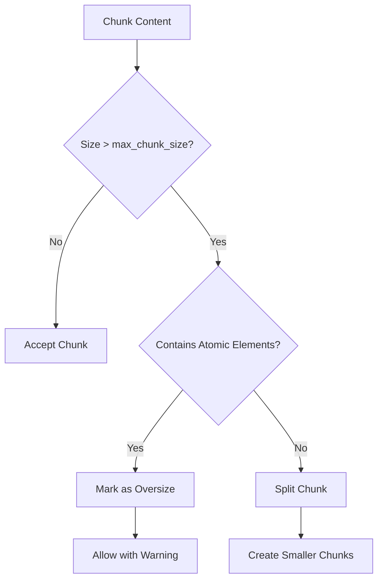
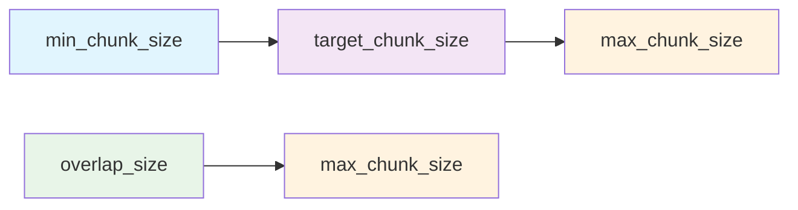
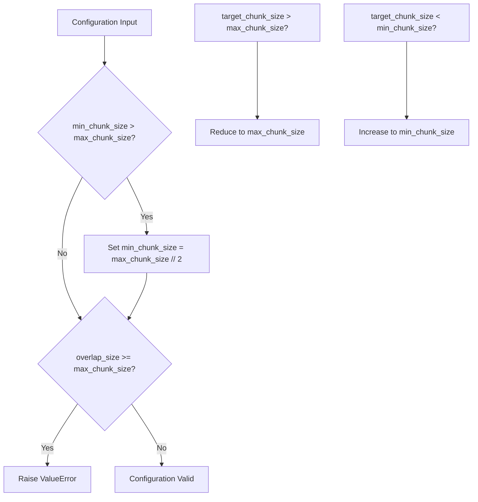
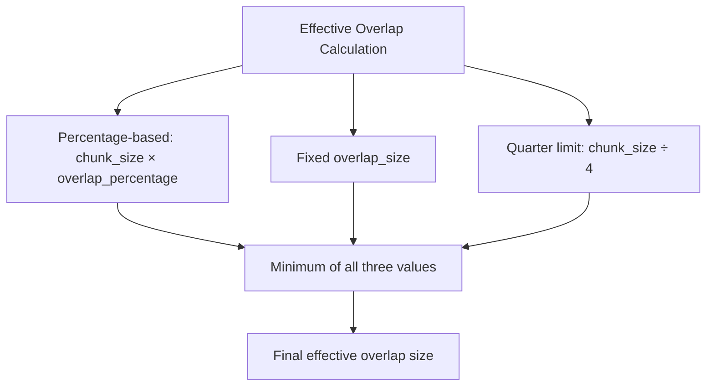
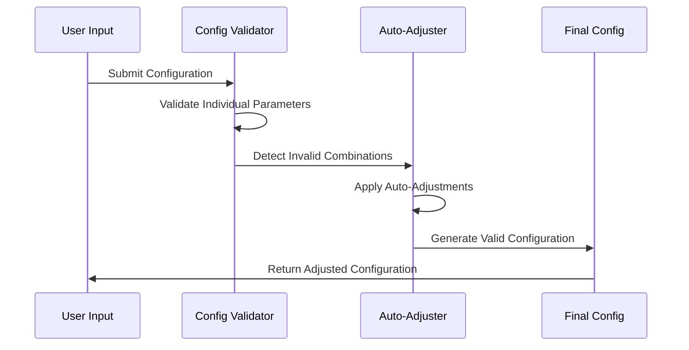

# Core Configuration Options

<cite>
**Referenced Files in This Document**
- [markdown_chunker_v2/config.py](file://markdown_chunker_v2/config.py)
- [markdown_chunker_legacy/chunker/types.py](file://markdown_chunker_legacy/chunker/types.py)
- [markdown_chunker_legacy/chunker/chunk_size_normalizer.py](file://markdown_chunker_legacy/chunker/chunk_size_normalizer.py)
- [markdown_chunker_legacy/api/validator.py](file://markdown_chunker_legacy/api/validator.py)
- [tests/chunker/test_chunk_config_validation.py](file://tests/chunker/test_chunk_config_validation.py)
- [examples/api_usage.py](file://examples/api_usage.py)
- [examples/rag_integration.py](file://examples/rag_integration.py)
- [markdown_chunker_v2/types.py](file://markdown_chunker_v2/types.py)
</cite>

## Table of Contents
1. [Introduction](#introduction)
2. [Core Configuration Parameters](#core-configuration-parameters)
3. [Size Parameter Relationships](#size-parameter-relationships)
4. [Overlap Configuration](#overlap-configuration)
5. [Validation and Auto-Adjustment](#validation-and-auto-adjustment)
6. [Configuration Profiles](#configuration-profiles)
7. [Practical Examples](#practical-examples)
8. [Best Practices](#best-practices)
9. [Troubleshooting](#troubleshooting)

## Introduction

The Markdown chunker provides a sophisticated configuration system that controls how text is segmented into manageable pieces. The core configuration revolves around four fundamental size parameters: `max_chunk_size`, `min_chunk_size`, `target_chunk_size`, and `overlap_size`. These parameters work together to ensure optimal chunking behavior for different use cases, from RAG (Retrieval-Augmented Generation) applications to search indexing and chat contexts.

The configuration system automatically validates inputs, maintains size invariants, and provides sensible defaults while allowing fine-tuned customization for specific requirements.

## Core Configuration Parameters

### max_chunk_size

**Description**: The maximum allowable size for any individual chunk in characters.

**Default Value**: 4096 (v2), 4096 (legacy)

**Data Type**: Integer

**Valid Range**: 1+ characters (minimum: 10, maximum: 100,000)

**Impact**: Controls the upper boundary for chunk sizes, preventing any single chunk from becoming too large to process efficiently.

**Behavior**: When chunks exceed this size, they are automatically split unless they contain atomic elements (code blocks, tables) that must remain intact.



**Diagram sources**
- [markdown_chunker_legacy/chunker/strategies/base.py](file://markdown_chunker_legacy/chunker/strategies/base.py#L193-L223)
- [markdown_chunker_legacy/chunker/orchestrator.py](file://markdown_chunker_legacy/chunker/orchestrator.py#L599-L620)

### min_chunk_size

**Description**: The minimum allowable size for a chunk in characters.

**Default Value**: 512 (v2), 512 (legacy)

**Data Type**: Integer

**Valid Range**: 1+ characters (minimum: 1, maximum: max_chunk_size)

**Impact**: Ensures chunks aren't too small, maintaining meaningful content units while avoiding excessive fragmentation.

**Auto-Adjustment**: If set larger than half of `max_chunk_size`, it's automatically adjusted to `max_chunk_size // 2`.

**Relationship**: Must be less than or equal to `max_chunk_size` and `target_chunk_size`.

### target_chunk_size

**Description**: The ideal chunk size that guides the chunking process.

**Default Value**: 4096 (v2), 4096 (legacy)

**Data Type**: Integer

**Valid Range**: 1+ characters (minimum: min_chunk_size, maximum: max_chunk_size)

**Impact**: Serves as the primary target for chunk size distribution, though actual sizes may vary within bounds.

**Guidance**: The chunker aims to create chunks close to this value while respecting the min/max constraints.

**Auto-Adjustment**: Automatically adjusted if set outside valid ranges:
- Larger than `max_chunk_size`: Reduced to `max_chunk_size`
- Smaller than `min_chunk_size`: Increased to `min_chunk_size`

### overlap_size

**Description**: The number of characters to overlap between consecutive chunks.

**Default Value**: 200 (v2), 200 (legacy)

**Data Type**: Integer

**Valid Range**: 0+ characters (minimum: 0, maximum: max_chunk_size-1)

**Impact**: Creates contextual continuity between chunks, crucial for maintaining semantic coherence in downstream applications.

**Special Cases**:
- **0**: No overlap (discrete chunks)
- **Positive Value**: Fixed character overlap
- **Percentage-based**: Calculated as `chunk_size × overlap_percentage`

**Validation**: Must be less than `max_chunk_size` to ensure meaningful overlap.

**Section sources**
- [markdown_chunker_v2/config.py](file://markdown_chunker_v2/config.py#L31-L46)
- [markdown_chunker_legacy/chunker/types.py](file://markdown_chunker_legacy/chunker/types.py#L900-L1020)

## Size Parameter Relationships

The four core size parameters must maintain specific relationships to ensure proper chunking behavior:



**Diagram sources**
- [tests/chunker/test_chunk_config_validation.py](file://tests/chunker/test_chunk_config_validation.py#L100-L117)

### Size Invariants

The configuration system enforces several critical invariants:

1. **min_chunk_size ≤ target_chunk_size ≤ max_chunk_size**
   - Ensures the target is achievable within bounds
   - Prevents impossible configuration scenarios

2. **overlap_size < max_chunk_size**
   - Guarantees meaningful overlap exists
   - Prevents overlap from consuming entire chunk

3. **min_chunk_size ≤ max_chunk_size**
   - Maintains logical ordering
   - Prevents contradictory constraints

### Auto-Adjustment Logic

When invalid configurations are detected, the system automatically adjusts parameters:



**Diagram sources**
- [markdown_chunker_v2/config.py](file://markdown_chunker_v2/config.py#L47-L74)
- [tests/chunker/test_chunk_config_validation.py](file://tests/chunker/test_chunk_config_validation.py#L67-L88)

**Section sources**
- [tests/chunker/test_chunk_config_validation.py](file://tests/chunker/test_chunk_config_validation.py#L41-L108)
- [markdown_chunker_v2/config.py](file://markdown_chunker_v2/config.py#L47-L74)

## Overlap Configuration

### overlap_size vs overlap_percentage

The chunker supports two approaches to overlap configuration:

**Fixed overlap_size**:
- Explicit character count
- Predictable overlap amounts
- Suitable for applications with fixed context windows

**Percentage-based overlap**:
- Dynamic calculation based on chunk size
- Proportional overlap that scales with chunk size
- Automatic limitation to quarter of chunk size

### Effective Overlap Calculation

The system calculates effective overlap using multiple constraints:



**Diagram sources**
- [markdown_chunker_legacy/chunker/types.py](file://markdown_chunker_legacy/chunker/types.py#L1016-L1020)

### Overlap Validation

The system enforces several overlap constraints:

1. **Non-negative overlap**: `overlap_size ≥ 0`
2. **Within bounds**: `overlap_size < max_chunk_size`
3. **Proportional limits**: Percentage-based overlap respects quarter limitations

**Section sources**
- [markdown_chunker_legacy/chunker/types.py](file://markdown_chunker_legacy/chunker/types.py#L1016-L1020)
- [markdown_chunker_legacy/chunker/chunk_size_normalizer.py](file://markdown_chunker_legacy/chunker/chunk_size_normalizer.py#L156-L200)

## Validation and Auto-Adjustment

### Input Validation

The configuration system performs comprehensive validation:

| Parameter | Validation Rule | Error Condition |
|-----------|----------------|-----------------|
| max_chunk_size | Positive integer | ≤ 0 |
| min_chunk_size | Positive integer | ≤ 0 |
| overlap_size | Non-negative integer | < 0 |
| overlap_size | Less than max_chunk_size | ≥ max_chunk_size |
| code_threshold | Between 0.0 and 1.0 | < 0.0 or > 1.0 |
| structure_threshold | Positive integer | ≤ 0 |

### Auto-Adjustment Behavior

When invalid values are detected, the system follows intelligent adjustment patterns:



**Diagram sources**
- [markdown_chunker_v2/config.py](file://markdown_chunker_v2/config.py#L47-L74)
- [markdown_chunker_legacy/api/validator.py](file://markdown_chunker_legacy/api/validator.py#L155-L185)

### Size Normalization

The chunk size normalizer provides additional protection against size variance:

**Single-Pass Merging**: Reduces size variance through intelligent merging of undersized chunks while preserving content boundaries.

**Boundary Preservation**: Ensures merged chunks respect section paths and content types.

**Oversize Tolerance**: Allows small overages (≤5%) for alignment purposes.

**Section sources**
- [markdown_chunker_legacy/chunker/chunk_size_normalizer.py](file://markdown_chunker_legacy/chunker/chunk_size_normalizer.py#L11-L156)

## Configuration Profiles

The chunker provides pre-configured profiles optimized for specific use cases:

### Default Configuration

**Purpose**: General-purpose balanced settings

**Parameters**:
- `max_chunk_size`: 4096
- `min_chunk_size`: 512
- `overlap_size`: 200
- `code_threshold`: 0.3
- `structure_threshold`: 3

### Code-Heavy Documents

**Purpose**: Technical documentation with extensive code examples

**Parameters**:
- `max_chunk_size`: 8192
- `min_chunk_size`: 1024
- `overlap_size`: 100
- `code_threshold`: 0.2

### Structured Documents

**Purpose**: Well-organized documentation with clear hierarchy

**Parameters**:
- `max_chunk_size`: 4096
- `min_chunk_size`: 512
- `overlap_size`: 200
- `structure_threshold`: 2

### Minimal Configuration

**Purpose**: Small chunks for testing or constrained environments

**Parameters**:
- `max_chunk_size`: 1024
- `min_chunk_size`: 256
- `overlap_size`: 50

### Legacy Factory Methods

The legacy system provides additional specialized configurations:

| Profile | Purpose | Key Characteristics |
|---------|---------|-------------------|
| `for_dify_rag()` | RAG applications | Moderate chunks, overlap enabled |
| `for_chat_context()` | LLM chat contexts | Small chunks, substantial overlap |
| `for_search_indexing()` | Search engines | Small chunks, overlap for granularity |
| `for_api_docs()` | API documentation | Balanced settings with code emphasis |
| `for_code_docs()` | Pure code documentation | No overlap, code-focused |

**Section sources**
- [markdown_chunker_v2/config.py](file://markdown_chunker_v2/config.py#L138-L170)
- [markdown_chunker_legacy/chunker/types.py](file://markdown_chunker_legacy/chunker/types.py#L900-L1080)

## Practical Examples

### RAG Optimization

For Retrieval-Augmented Generation applications, balance chunk size with retrieval precision:

```python
# RAG-optimized configuration
config = ChunkConfig(
    max_chunk_size=2048,      # Moderate size for retrieval
    min_chunk_size=256,       # Minimum meaningful content
    overlap_size=200,         # Context preservation
    enable_overlap=True,      # Required for context
    code_threshold=0.6,       # Emphasis on code content
)
```

### Chat Context Optimization

For LLM chat applications requiring small, focused chunks:

```python
# Chat-optimized configuration
config = ChunkConfig(
    max_chunk_size=1536,      # Fits typical LLM context windows
    min_chunk_size=200,       # Small enough for chat
    overlap_size=200,         # Substantial overlap for continuity
    enable_overlap=True,      # Essential for conversation flow
)
```

### Search Indexing

For search engine applications requiring granular chunks:

```python
# Search-optimized configuration
config = ChunkConfig(
    max_chunk_size=1024,      # Small chunks for better granularity
    min_chunk_size=100,       # Minimum viable content
    overlap_size=100,         # Minimal overlap for search
    enable_overlap=True,      # Enables phrase-based search
)
```

### Fast Processing

For batch processing where speed is prioritized over chunk quality:

```python
# Fast processing configuration
config = ChunkConfig(
    max_chunk_size=8192,      # Large chunks for throughput
    min_chunk_size=1024,      # Reasonable minimum
    overlap_size=100,         # Minimal overlap
    enable_overlap=False,     # Disable overlap for speed
    allow_oversize=True,      # Allow oversized chunks
)
```

**Section sources**
- [examples/rag_integration.py](file://examples/rag_integration.py#L13-L53)
- [examples/api_usage.py](file://examples/api_usage.py#L235-L266)

## Best Practices

### Choosing Appropriate Sizes

**Consider these factors when selecting chunk sizes:**

1. **Downstream Application Requirements**
   - LLM context windows (typically 2K-8K tokens)
   - Vector database embedding limits
   - Search engine result relevance

2. **Document Characteristics**
   - Average sentence length
   - Content density (code-heavy vs. prose)
   - Structural complexity

3. **Performance Trade-offs**
   - Smaller chunks: Better precision, higher overhead
   - Larger chunks: Better efficiency, potential loss of granularity

### Overlap Strategy Selection

**Fixed overlap_size**:
- Use when you need predictable overlap amounts
- Suitable for applications with fixed context windows
- Example: Chat applications with specific context limits

**Percentage-based overlap**:
- Use when overlap should scale with chunk size
- Provides proportional overlap that adapts to content
- Example: Search indexing where granularity matters

### Validation Guidelines

**Always validate your configuration:**

```python
# Best practice validation
try:
    config = ChunkConfig(
        max_chunk_size=desired_size,
        min_chunk_size=desired_size // 4,
        overlap_size=desired_size // 10
    )
    # Configuration is valid and ready to use
except ValueError as e:
    # Handle validation errors gracefully
    logger.error(f"Invalid configuration: {e}")
```

### Monitoring and Tuning

**Track chunking metrics to optimize configuration:**

- **Average chunk size**: Should cluster around target
- **Size variance**: Lower variance indicates consistent chunks
- **Oversize chunks**: Monitor for chunks exceeding limits
- **Undersize chunks**: Identify potential fragmentation issues

**Section sources**
- [markdown_chunker_v2/types.py](file://markdown_chunker_v2/types.py#L190-L240)

## Troubleshooting

### Common Configuration Issues

**Issue**: Configuration validation errors
**Solution**: Check parameter ranges and relationships
```python
# Problematic configuration
config = ChunkConfig(max_chunk_size=100, min_chunk_size=200)
# min_chunk_size cannot be greater than max_chunk_size

# Corrected configuration
config = ChunkConfig(max_chunk_size=200, min_chunk_size=100)
```

**Issue**: Unexpected chunk sizes
**Solution**: Understand auto-adjustment behavior
```python
# Large max_chunk_size triggers auto-adjustment
config = ChunkConfig(max_chunk_size=100000)
print(config.max_chunk_size)  # May be adjusted to 100000 (if within limits)
```

**Issue**: Insufficient overlap
**Solution**: Ensure overlap_size is reasonable relative to chunk size
```python
# Problematic overlap
config = ChunkConfig(max_chunk_size=100, overlap_size=50)
# overlap_size should be less than max_chunk_size

# Corrected overlap
config = ChunkConfig(max_chunk_size=100, overlap_size=25)
```

### Performance Optimization

**Large documents**:
- Increase `max_chunk_size` for fewer chunks
- Enable `allow_oversize` for atomic elements
- Use appropriate `code_threshold` for content type

**Small documents**:
- Decrease `min_chunk_size` to avoid empty chunks
- Consider disabling overlap for discrete content
- Use `structure_threshold` to detect document structure

### Debugging Configuration Issues

**Enable detailed logging** to understand chunking behavior:
```python
import logging
logging.getLogger('markdown_chunker').setLevel(logging.DEBUG)
```

**Monitor chunk statistics** to identify optimization opportunities:
```python
result = chunker.chunk_with_analysis(document)
metrics = ChunkingMetrics.from_chunks(result.chunks)
print(f"Average size: {metrics.avg_chunk_size}")
print(f"Size variance: {metrics.std_dev_size}")
print(f"Oversize chunks: {metrics.oversize_count}")
```

**Section sources**
- [markdown_chunker_legacy/api/validator.py](file://markdown_chunker_legacy/api/validator.py#L155-L185)
- [tests/chunker/test_chunk_config_validation.py](file://tests/chunker/test_chunk_config_validation.py#L159-L170)