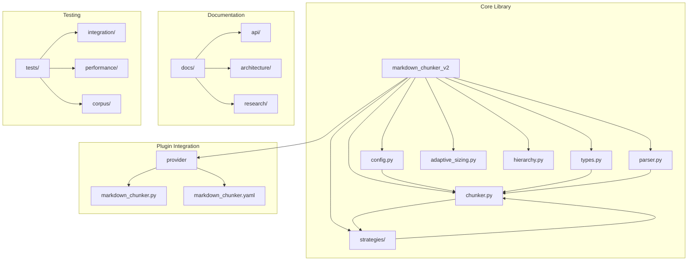
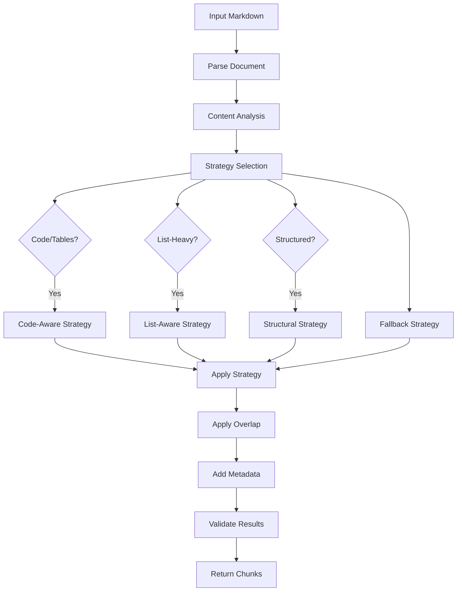
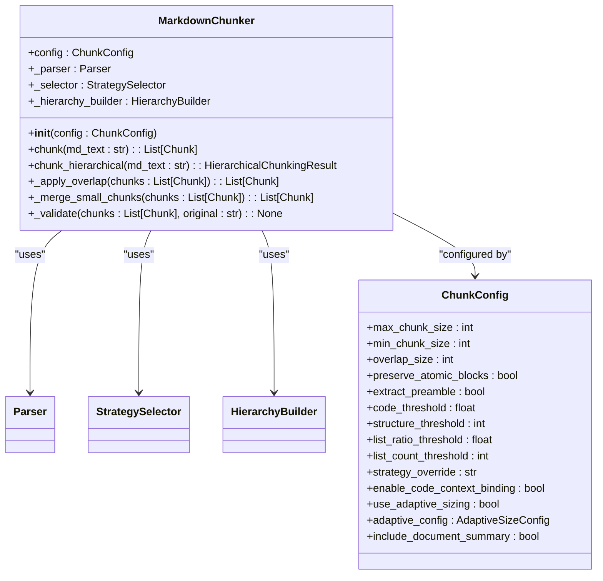
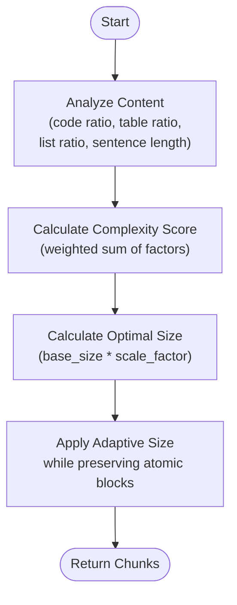
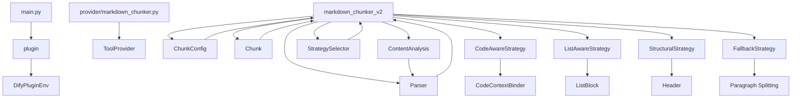

# Advanced Markdown Chunker for Dify

<cite>
**Referenced Files in This Document**   
- [README.md](file://README.md)
- [main.py](file://main.py)
- [manifest.yaml](file://manifest.yaml)
- [markdown_chunker_v2/__init__.py](file://markdown_chunker_v2/__init__.py)
- [markdown_chunker_v2/chunker.py](file://markdown_chunker_v2/chunker.py)
- [markdown_chunker_v2/config.py](file://markdown_chunker_v2/config.py)
- [markdown_chunker_v2/types.py](file://markdown_chunker_v2/types.py)
- [markdown_chunker_v2/parser.py](file://markdown_chunker_v2/parser.py)
- [markdown_chunker_v2/adaptive_sizing.py](file://markdown_chunker_v2/adaptive_sizing.py)
- [markdown_chunker_v2/strategies/base.py](file://markdown_chunker_v2/strategies/base.py)
- [markdown_chunker_v2/strategies/code_aware.py](file://markdown_chunker_v2/strategies/code_aware.py)
- [markdown_chunker_v2/strategies/list_aware.py](file://markdown_chunker_v2/strategies/list_aware.py)
- [markdown_chunker_v2/strategies/structural.py](file://markdown_chunker_v2/strategies/structural.py)
- [markdown_chunker_v2/strategies/fallback.py](file://markdown_chunker_v2/strategies/fallback.py)
- [provider/markdown_chunker.py](file://provider/markdown_chunker.py)
</cite>

## Table of Contents
1. [Introduction](#introduction)
2. [Project Structure](#project-structure)
3. [Core Components](#core-components)
4. [Architecture Overview](#architecture-overview)
5. [Detailed Component Analysis](#detailed-component-analysis)
6. [Dependency Analysis](#dependency-analysis)
7. [Performance Considerations](#performance-considerations)
8. [Troubleshooting Guide](#troubleshooting-guide)
9. [Conclusion](#conclusion)

## Introduction
The Advanced Markdown Chunker for Dify is an intelligent document processing tool designed to split Markdown documents into semantically meaningful chunks optimized for Retrieval-Augmented Generation (RAG) systems. Unlike simple text splitters, this plugin preserves document structure, maintains atomic blocks like code and tables, and automatically selects the best chunking strategy based on content analysis. The system is designed for local processing only, ensuring data privacy and security.

**Section sources**
- [README.md](file://README.md)

## Project Structure
The project follows a modular structure with clear separation of concerns. The core functionality resides in the `markdown_chunker_v2` package, while the Dify plugin integration is handled through the `provider` directory. The `docs` directory contains comprehensive documentation, and `tests` includes extensive test coverage with property-based testing.



**Diagram sources **
- [markdown_chunker_v2/__init__.py](file://markdown_chunker_v2/__init__.py)
- [provider/markdown_chunker.py](file://provider/markdown_chunker.py)

**Section sources**
- [README.md](file://README.md)

## Core Components
The core components of the Advanced Markdown Chunker include the `MarkdownChunker` class, configuration system, type definitions, parser, and multiple chunking strategies. The system uses a pipeline approach: parse once, select strategy, apply strategy, apply overlap, validate, and return results. Key features include adaptive chunk sizing, hierarchical chunking, list-aware processing, and enhanced code-context binding.

**Section sources**
- [markdown_chunker_v2/chunker.py](file://markdown_chunker_v2/chunker.py)
- [markdown_chunker_v2/config.py](file://markdown_chunker_v2/config.py)
- [markdown_chunker_v2/types.py](file://markdown_chunker_v2/types.py)

## Architecture Overview
The architecture follows a clean, modular design with a single responsibility principle. The system analyzes the document once using an AST parser, then selects the optimal strategy based on content characteristics. The chunking process preserves atomic blocks (code, tables), maintains structural integrity, and adds rich metadata for improved retrieval quality. The plugin integrates seamlessly with Dify workflows while operating entirely locally.



**Diagram sources **
- [markdown_chunker_v2/chunker.py](file://markdown_chunker_v2/chunker.py)
- [markdown_chunker_v2/strategies/base.py](file://markdown_chunker_v2/strategies/base.py)

## Detailed Component Analysis

### MarkdownChunker Class Analysis
The `MarkdownChunker` class serves as the main interface for the chunking system. It implements a linear pipeline that ensures consistent processing while allowing for extensibility through strategy patterns.

#### Class Diagram


**Diagram sources **
- [markdown_chunker_v2/chunker.py](file://markdown_chunker_v2/chunker.py)
- [markdown_chunker_v2/config.py](file://markdown_chunker_v2/config.py)

### Strategy Selection Analysis
The system implements a strategy pattern with four distinct approaches for different content types. The selection is based on content analysis metrics like code ratio, list ratio, and header count.

#### Sequence Diagram
```mermaid
sequenceDiagram
participant User as "User Application"
participant Chunker as "MarkdownChunker"
participant Parser as "Parser"
participant Selector as "StrategySelector"
participant Strategy as "Selected Strategy"
User->>Chunker : chunk(md_text)
Chunker->>Parser : analyze(md_text)
Parser-->>Chunker : ContentAnalysis
Chunker->>Selector : select(analysis, config)
Selector-->>Chunker : Strategy
Chunker->>Strategy : apply(md_text, analysis, config)
Strategy-->>Chunker : List[Chunk]
Chunker->>_apply_overlap() : List[Chunk]
Chunker->>_add_metadata() : List[Chunk]
Chunker->>_validate() : None
Chunker-->>User : List[Chunk]
```

**Diagram sources **
- [markdown_chunker_v2/chunker.py](file://markdown_chunker_v2/chunker.py)
- [markdown_chunker_v2/strategies/base.py](file://markdown_chunker_v2/strategies/base.py)

### Adaptive Sizing Analysis
The adaptive sizing feature automatically optimizes chunk size based on content complexity, using factors like code ratio, table presence, and sentence length to determine optimal chunk dimensions.

#### Flowchart


**Diagram sources **
- [markdown_chunker_v2/adaptive_sizing.py](file://markdown_chunker_v2/adaptive_sizing.py)
- [markdown_chunker_v2/chunker.py](file://markdown_chunker_v2/chunker.py)

## Dependency Analysis
The system has minimal external dependencies, focusing on local processing for privacy and performance. The core components are tightly integrated but maintain clear separation of concerns through well-defined interfaces.



**Diagram sources **
- [main.py](file://main.py)
- [provider/markdown_chunker.py](file://provider/markdown_chunker.py)
- [markdown_chunker_v2/__init__.py](file://markdown_chunker_v2/__init__.py)

**Section sources**
- [manifest.yaml](file://manifest.yaml)
- [main.py](file://main.py)

## Performance Considerations
The system is optimized for performance with a single parse pass, linear processing pipeline, and efficient data structures. The adaptive sizing feature helps optimize retrieval quality by matching chunk size to content complexity. Property-based testing ensures correctness across edge cases, and comprehensive benchmarks detect performance regressions.

**Section sources**
- [README.md](file://README.md)

## Troubleshooting Guide
Common issues typically relate to configuration settings or edge cases in Markdown syntax. The system includes extensive validation and error handling, with clear metadata indicating any issues like oversize chunks or unbalanced fences. The 812+ tests provide comprehensive coverage of edge cases.

**Section sources**
- [README.md](file://README.md)
- [markdown_chunker_v2/chunker.py](file://markdown_chunker_v2/chunker.py)

## Conclusion
The Advanced Markdown Chunker for Dify provides a robust, intelligent solution for document chunking in RAG systems. Its structure-aware approach preserves semantic meaning while optimizing for retrieval quality. The modular design, comprehensive testing, and local processing model make it a reliable choice for knowledge base ingestion and document processing workflows.