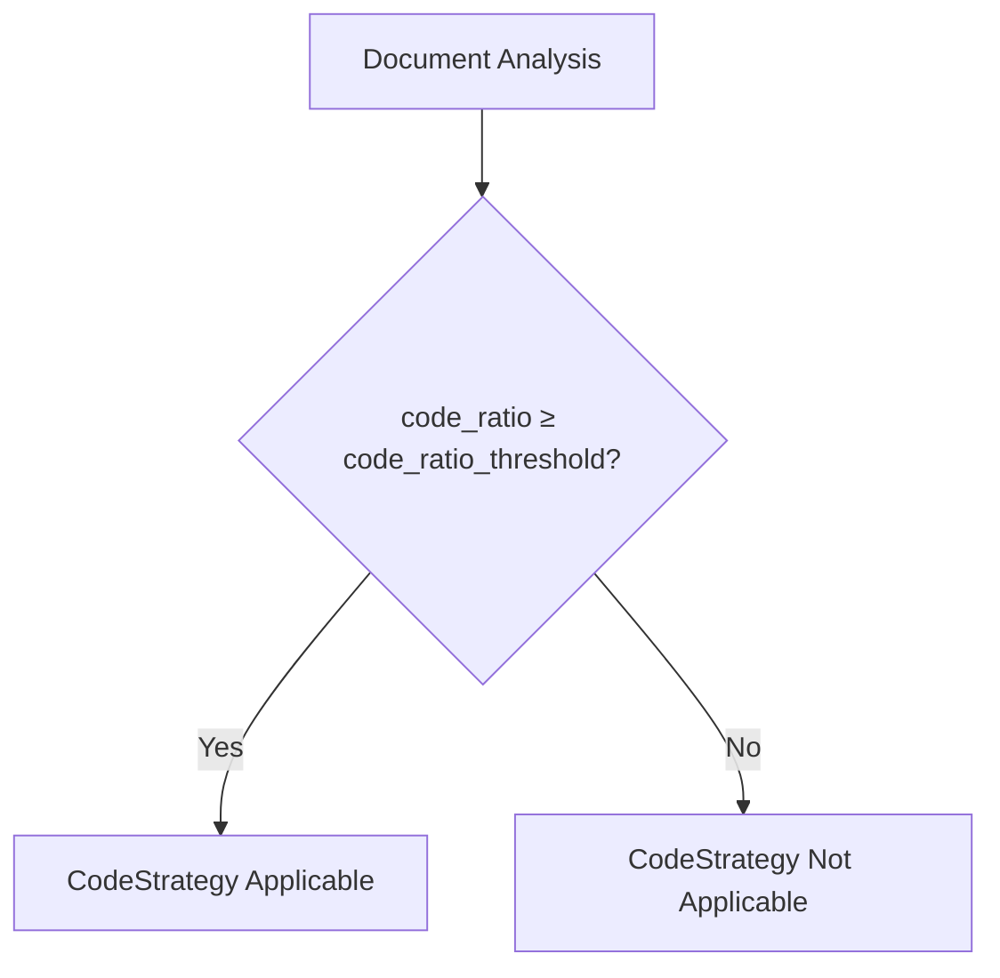
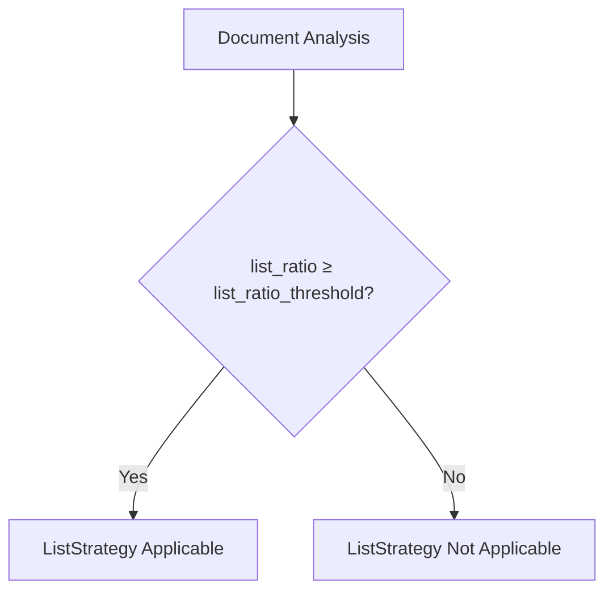
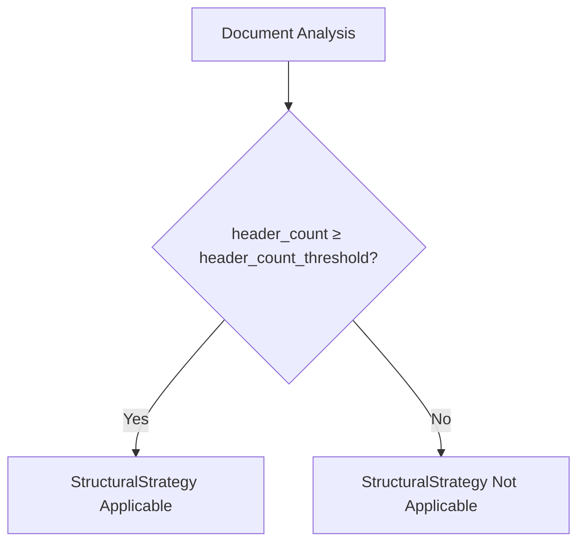
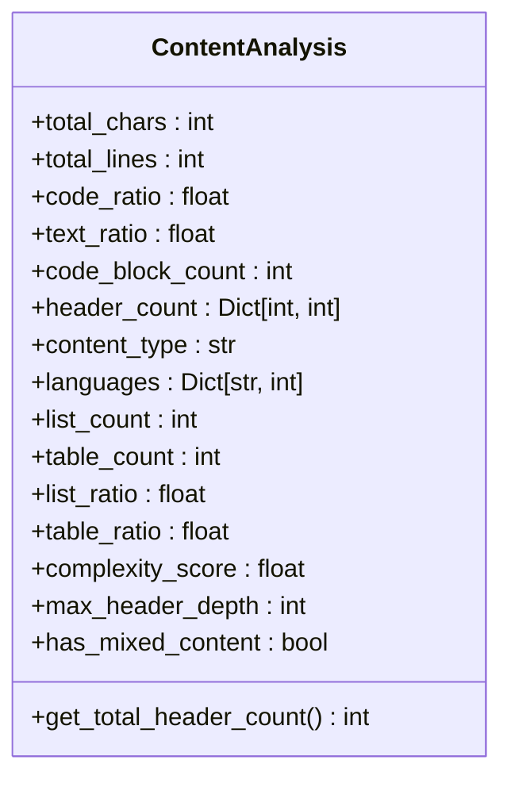
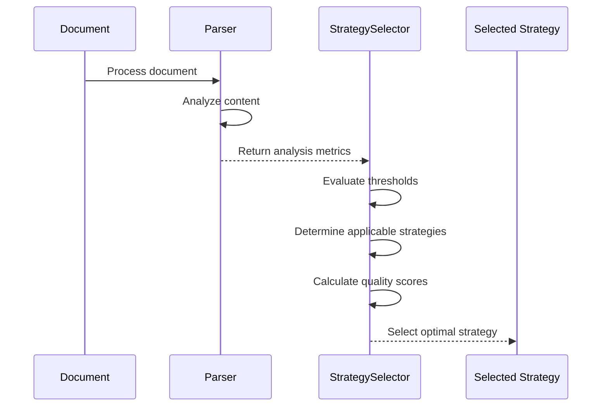

# Strategy Selection Configuration

<cite>
**Referenced Files in This Document**   
- [ChunkConfig](file://markdown_chunker_legacy/chunker/types.py#L500-L800)
- [ContentAnalysis](file://markdown_chunker_legacy/parser/types.py#L436-L799)
- [StrategySelector](file://markdown_chunker_legacy/chunker/selector.py#L23-L466)
- [CodeStrategy](file://markdown_chunker_legacy/chunker/strategies/code_strategy.py#L42-L625)
- [StructuralStrategy](file://markdown_chunker_legacy/chunker/strategies/structural_strategy.py#L59-L800)
- [ListStrategy](file://markdown_chunker_legacy/chunker/strategies/list_strategy.py#L58-L800)
- [TableStrategy](file://markdown_chunker_legacy/chunker/strategies/table_strategy.py#L56-L466)
- [MixedStrategy](file://markdown_chunker_legacy/chunker/strategies/mixed_strategy.py#L58-L500)
</cite>

## Table of Contents
1. [Introduction](#introduction)
2. [Threshold Parameters](#threshold-parameters)
   - [code_ratio_threshold](#code_ratio_threshold)
   - [min_code_blocks](#min_code_blocks)
   - [min_complexity](#min_complexity)
   - [list_count_threshold](#list_count_threshold)
   - [list_ratio_threshold](#list_ratio_threshold)
   - [table_count_threshold](#table_count_threshold)
   - [table_ratio_threshold](#table_ratio_threshold)
   - [header_count_threshold](#header_count_threshold)
3. [Content Analysis Metrics](#content-analysis-metrics)
4. [Strategy Selection Process](#strategy-selection-process)
5. [Configuration Examples](#configuration-examples)
6. [Tuning Guidelines](#tuning-guidelines)

## Introduction
The strategy selection system determines the optimal chunking approach based on document content analysis. This configuration-driven system evaluates various threshold parameters to select the most appropriate strategy for preserving document structure and semantics during chunking. The system analyzes content characteristics such as code density, list structures, table usage, and header hierarchy to make informed decisions about chunking methodology.

The strategy selection process begins with content analysis that calculates various metrics, followed by threshold evaluation to determine which strategies are applicable. Each strategy has specific threshold requirements that must be met for it to be considered. The system then selects the optimal strategy based on priority, quality scoring, and content characteristics.

**Section sources**
- [ChunkConfig](file://markdown_chunker_legacy/chunker/types.py#L500-L800)
- [StrategySelector](file://markdown_chunker_legacy/chunker/selector.py#L23-L466)

## Threshold Parameters

### code_ratio_threshold
The `code_ratio_threshold` parameter determines the minimum proportion of code content required for the CodeStrategy to be considered. This threshold is used to identify code-heavy documents that would benefit from specialized code-aware chunking.

**Parameter Details:**
- **Default Value:** 0.3
- **Data Type:** float
- **Valid Range:** 0.0 to 1.0
- **Purpose:** Controls sensitivity for code-heavy document detection

The actual default value (0.3) differs from the documented value (0.7) to better handle real-world documents with mixed content. A lower threshold allows the code strategy to be applied to documents with moderate code content, ensuring code blocks are preserved even when they don't dominate the document.



**Diagram sources**
- [ChunkConfig](file://markdown_chunker_legacy/chunker/types.py#L588)
- [CodeStrategy](file://markdown_chunker_legacy/chunker/strategies/code_strategy.py#L132)

**Section sources**
- [ChunkConfig](file://markdown_chunker_legacy/chunker/types.py#L588)
- [CodeStrategy](file://markdown_chunker_legacy/chunker/strategies/code_strategy.py#L132)

### min_code_blocks
The `min_code_blocks` parameter specifies the minimum number of code blocks required for the CodeStrategy to be applicable. This threshold ensures that documents with only isolated code snippets are not processed with code-specific chunking logic.

**Parameter Details:**
- **Default Value:** 1
- **Data Type:** int
- **Valid Range:** 1 or higher
- **Purpose:** Prevents code strategy application on documents with minimal code content

The default value was reduced from 3 to 1 to accommodate documents with few but significant code blocks. This adjustment ensures that even documents with a single substantial code block receive appropriate handling.


**Diagram sources**
- [ChunkConfig](file://markdown_chunker_legacy/chunker/types.py#L589)
- [CodeStrategy](file://markdown_chunker_legacy/chunker/strategies/code_strategy.py#L133)

**Section sources**
- [ChunkConfig](file://markdown_chunker_legacy/chunker/types.py#L589)
- [CodeStrategy](file://markdown_chunker_legacy/chunker/strategies/code_strategy.py#L133)

### min_complexity
The `min_complexity` parameter sets the minimum complexity score required for the MixedStrategy to be applicable. This threshold helps identify documents with diverse content types that require a balanced chunking approach.

**Parameter Details:**
- **Default Value:** 0.3
- **Data Type:** float
- **Valid Range:** 0.0 to 1.0
- **Purpose:** Controls activation of mixed content strategy

The complexity score is calculated based on the presence of various content elements (code blocks, headers, lists, tables, multiple languages). Documents with a complexity score above this threshold are considered mixed-content and are candidates for the MixedStrategy.


**Diagram sources**
- [ChunkConfig](file://markdown_chunker_legacy/chunker/types.py#L590)
- [MixedStrategy](file://markdown_chunker_legacy/chunker/strategies/mixed_strategy.py#L64)

**Section sources**
- [ChunkConfig](file://markdown_chunker_legacy/chunker/types.py#L590)
- [MixedStrategy](file://markdown_chunker_legacy/chunker/strategies/mixed_strategy.py#L64)

### list_count_threshold
The `list_count_threshold` parameter defines the minimum number of lists required for the ListStrategy to be considered. This threshold helps identify list-heavy documents that would benefit from list-preserving chunking.

**Parameter Details:**
- **Default Value:** 5
- **Data Type:** int
- **Valid Range:** 1 or higher
- **Purpose:** Controls sensitivity for list-heavy document detection

Documents with a number of lists equal to or exceeding this threshold may be processed with the ListStrategy, which preserves list hierarchy and structure during chunking.


**Diagram sources**
- [ChunkConfig](file://markdown_chunker_legacy/chunker/types.py#L591)
- [ListStrategy](file://markdown_chunker_legacy/chunker/strategies/list_strategy.py#L98)

**Section sources**
- [ChunkConfig](file://markdown_chunker_legacy/chunker/types.py#L591)
- [ListStrategy](file://markdown_chunker_legacy/chunker/strategies/list_strategy.py#L98)

### list_ratio_threshold
The `list_ratio_threshold` parameter sets the minimum proportion of list content required for the ListStrategy to be applicable. This threshold provides an alternative way to identify list-heavy documents based on content composition.

**Parameter Details:**
- **Default Value:** 0.6
- **Data Type:** float
- **Valid Range:** 0.0 to 1.0
- **Purpose:** Controls sensitivity based on list content density

This ratio-based threshold works in conjunction with the count-based threshold, allowing the ListStrategy to be applied when either condition is met (OR logic).



**Diagram sources**
- [ChunkConfig](file://markdown_chunker_legacy/chunker/types.py#L592)
- [ListStrategy](file://markdown_chunker_legacy/chunker/strategies/list_strategy.py#L99)

**Section sources**
- [ChunkConfig](file://markdown_chunker_legacy/chunker/types.py#L592)
- [ListStrategy](file://markdown_chunker_legacy/chunker/strategies/list_strategy.py#L99)

### table_count_threshold
The `table_count_threshold` parameter specifies the minimum number of tables required for the TableStrategy to be considered. This threshold helps identify table-heavy documents that would benefit from table-preserving chunking.

**Parameter Details:**
- **Default Value:** 3
- **Data Type:** int
- **Valid Range:** 1 or higher
- **Purpose:** Controls sensitivity for table-heavy document detection

Documents with a number of tables equal to or exceeding this threshold may be processed with the TableStrategy, which preserves table structure and formatting during chunking.


**Diagram sources**
- [ChunkConfig](file://markdown_chunker_legacy/chunker/types.py#L593)
- [TableStrategy](file://markdown_chunker_legacy/chunker/strategies/table_strategy.py#L94)

**Section sources**
- [ChunkConfig](file://markdown_chunker_legacy/chunker/types.py#L593)
- [TableStrategy](file://markdown_chunker_legacy/chunker/strategies/table_strategy.py#L94)

### table_ratio_threshold
The `table_ratio_threshold` parameter sets the minimum proportion of table content required for the TableStrategy to be applicable. This threshold provides an alternative way to identify table-heavy documents based on content composition.

**Parameter Details:**
- **Default Value:** 0.4
- **Data Type:** float
- **Valid Range:** 0.0 to 1.0
- **Purpose:** Controls sensitivity based on table content density

This ratio-based threshold works in conjunction with the count-based threshold, allowing the TableStrategy to be applied when either condition is met (OR logic).


**Diagram sources**
- [ChunkConfig](file://markdown_chunker_legacy/chunker/types.py#L594)
- [TableStrategy](file://markdown_chunker_legacy/chunker/strategies/table_strategy.py#L95)

**Section sources**
- [ChunkConfig](file://markdown_chunker_legacy/chunker/types.py#L594)
- [TableStrategy](file://markdown_chunker_legacy/chunker/strategies/table_strategy.py#L95)

### header_count_threshold
The `header_count_threshold` parameter defines the minimum number of headers required for the StructuralStrategy to be considered. This threshold helps identify well-structured documents that would benefit from header-based chunking.

**Parameter Details:**
- **Default Value:** 3
- **Data Type:** int
- **Valid Range:** 1 or higher
- **Purpose:** Controls sensitivity for structured document detection

Documents with a number of headers equal to or exceeding this threshold may be processed with the StructuralStrategy, which creates chunks based on header boundaries and preserves document hierarchy.



**Diagram sources**
- [ChunkConfig](file://markdown_chunker_legacy/chunker/types.py#L595)
- [StructuralStrategy](file://markdown_chunker_legacy/chunker/strategies/structural_strategy.py#L160)

**Section sources**
- [ChunkConfig](file://markdown_chunker_legacy/chunker/types.py#L595)
- [StructuralStrategy](file://markdown_chunker_legacy/chunker/strategies/structural_strategy.py#L160)

## Content Analysis Metrics
The strategy selection process relies on content analysis metrics produced by the parser component. These metrics provide the quantitative foundation for threshold evaluation and strategy selection.

**Key Content Analysis Metrics:**
- **code_ratio**: Proportion of code content in the document (0.0 to 1.0)
- **code_block_count**: Number of code blocks detected
- **list_count**: Number of lists detected
- **list_ratio**: Proportion of list content in the document (0.0 to 1.0)
- **table_count**: Number of tables detected
- **table_ratio**: Proportion of table content in the document (0.0 to 1.0)
- **header_count**: Number of headers detected (by level)
- **complexity_score**: Composite score indicating content diversity (0.0 to 1.0)
- **max_header_depth**: Maximum nesting level of headers

The parser component calculates these metrics during the initial analysis phase, providing the strategy selector with the necessary information to make informed decisions. The accuracy and reliability of these metrics directly impact the effectiveness of strategy selection.



**Diagram sources**
- [ContentAnalysis](file://markdown_chunker_legacy/parser/types.py#L436-L799)

**Section sources**
- [ContentAnalysis](file://markdown_chunker_legacy/parser/types.py#L436-L799)

## Strategy Selection Process
The strategy selection process follows a systematic approach to determine the optimal chunking strategy based on content analysis and threshold parameters.

**Selection Process Steps:**
1. **Content Analysis**: Parse document and calculate content metrics
2. **Threshold Evaluation**: Check each strategy's threshold conditions
3. **Applicability Determination**: Identify which strategies can handle the content
4. **Quality Scoring**: Calculate quality scores for applicable strategies
5. **Strategy Selection**: Select optimal strategy based on priority and quality

The system uses a priority-based selection approach where strategies are evaluated in order of priority. The first applicable strategy is selected in strict mode, while weighted mode considers both priority and quality score.



**Diagram sources**
- [StrategySelector](file://markdown_chunker_legacy/chunker/selector.py#L23-L466)
- [ContentAnalysis](file://markdown_chunker_legacy/parser/types.py#L436-L799)

**Section sources**
- [StrategySelector](file://markdown_chunker_legacy/chunker/selector.py#L23-L466)

## Configuration Examples
The following examples demonstrate how different threshold configurations affect strategy selection for various document types.

### Code-Heavy Document Configuration
For documents with extensive code examples, such as API documentation or programming tutorials:

```python
config = ChunkConfig(
    code_ratio_threshold=0.5,
    min_code_blocks=2,
    max_chunk_size=6144,
    overlap_size=300
)
```

This configuration lowers the code ratio threshold to 0.5 and reduces the minimum code blocks to 2, making the CodeStrategy more likely to be selected for documents with moderate code content.

### List-Heavy Document Configuration
For documents with extensive lists, such as checklists or feature comparisons:

```python
config = ChunkConfig(
    list_count_threshold=3,
    list_ratio_threshold=0.5,
    max_chunk_size=3072
)
```

This configuration reduces both thresholds to make the ListStrategy more sensitive to list-heavy content, while using a moderate chunk size to balance context preservation.

### Structured Documentation Configuration
For well-organized documentation with clear section hierarchy:

```python
config = ChunkConfig(
    header_count_threshold=2,
    max_chunk_size=3072,
    overlap_size=150
)
```

This configuration lowers the header count threshold to 2, making the StructuralStrategy more likely to be selected for documents with moderate structure.

**Section sources**
- [ChunkConfig](file://markdown_chunker_legacy/chunker/types.py#L713-L800)

## Tuning Guidelines
When tuning threshold parameters for specific document collections and use cases, consider the following guidelines:

### General Principles
- **Lower thresholds** increase sensitivity, making strategies more likely to be selected
- **Higher thresholds** increase specificity, requiring stronger evidence for strategy selection
- **Balance** between count-based and ratio-based thresholds provides robust detection
- **Document characteristics** should guide threshold selection

### Use Case Recommendations
- **Technical Documentation**: Lower `code_ratio_threshold` (0.4-0.5) and `min_code_blocks` (1-2)
- **API References**: Lower `header_count_threshold` (2) for better section granularity
- **User Manuals**: Lower `list_ratio_threshold` (0.5) for checklist preservation
- **Data Documentation**: Lower `table_count_threshold` (2) for table-heavy content
- **Mixed Content**: Adjust `min_complexity` (0.2-0.4) based on content diversity

### Validation Approach
When adjusting thresholds, validate the impact by:
1. Testing with representative documents from your collection
2. Reviewing selected strategies and chunk quality
3. Checking for unintended strategy selection
4. Evaluating chunk size distribution and content preservation

The goal is to achieve consistent, appropriate strategy selection that preserves document semantics while creating optimally sized chunks for the intended use case.

**Section sources**
- [ChunkConfig](file://markdown_chunker_legacy/chunker/types.py#L500-L800)
- [StrategySelector](file://markdown_chunker_legacy/chunker/selector.py#L23-L466)