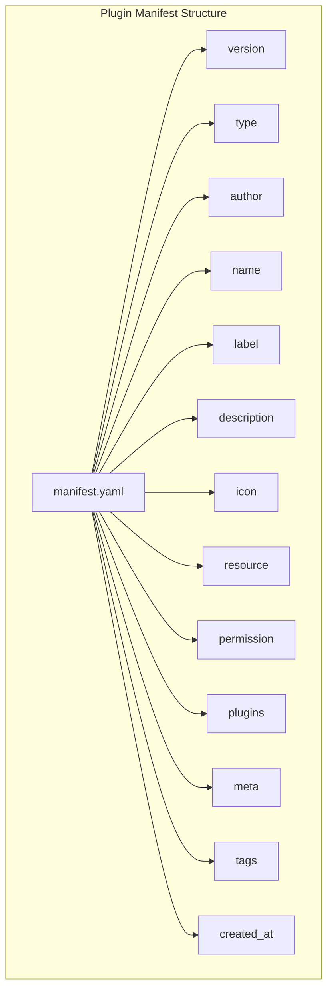
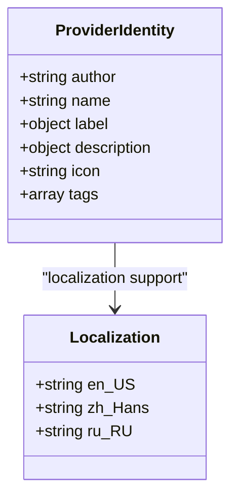
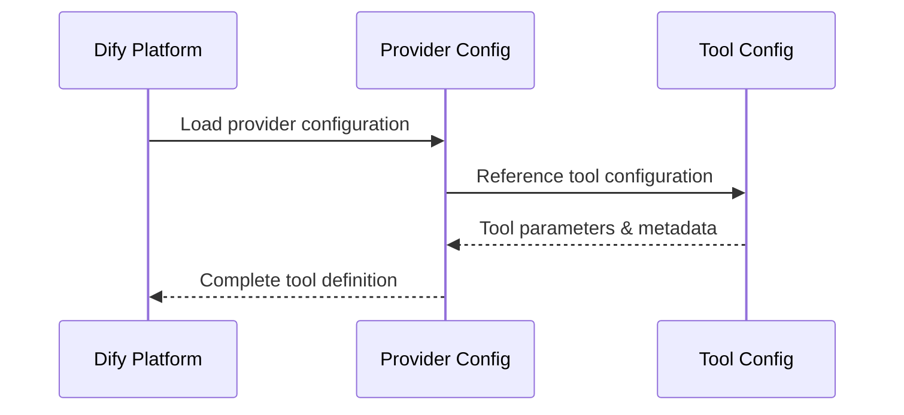
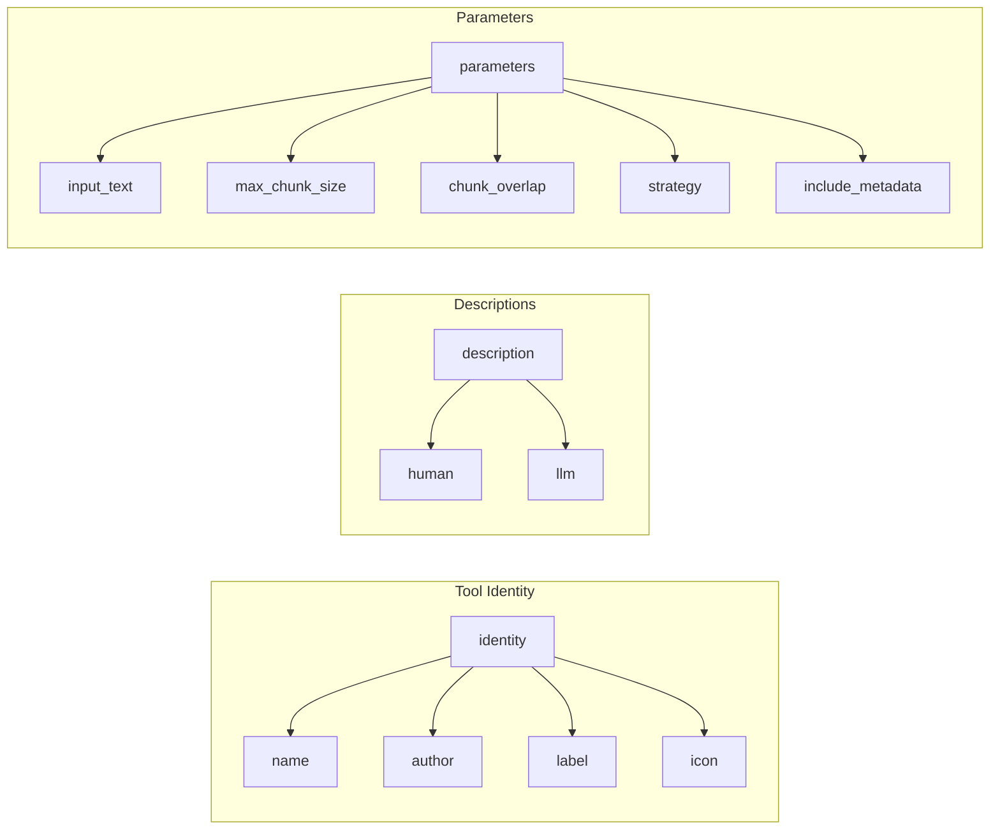
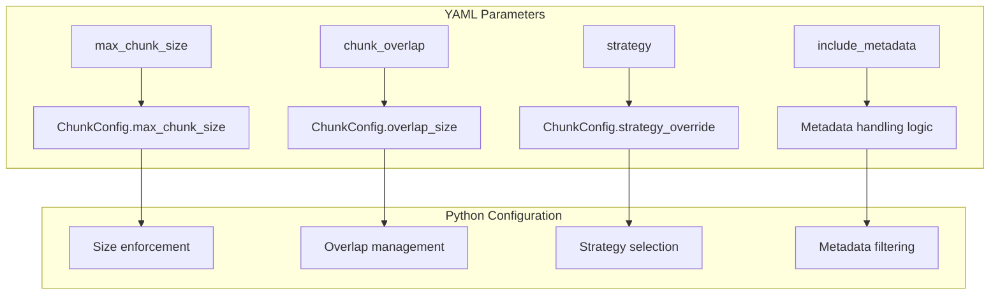
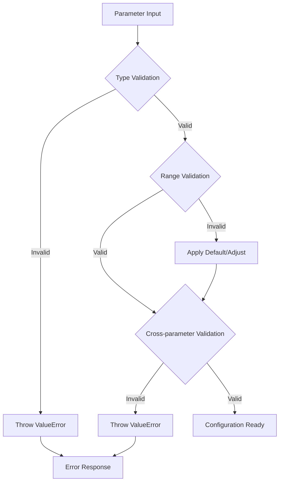
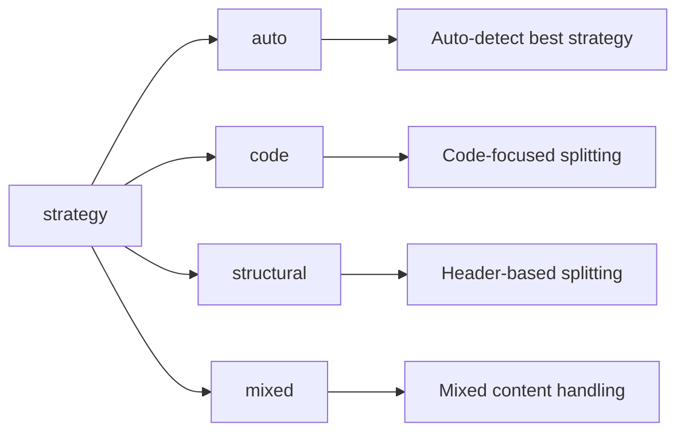
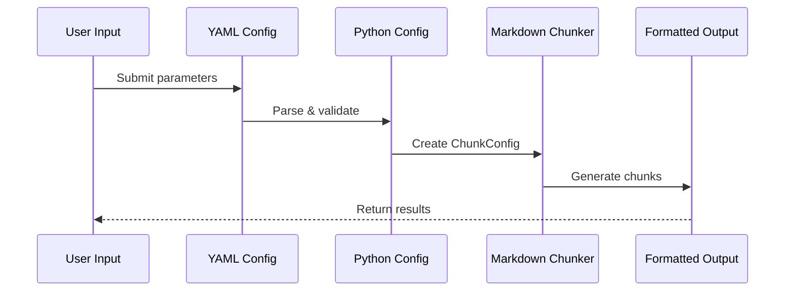

# YAML Configuration Files

<cite>
**Referenced Files in This Document**
- [manifest.yaml](file://manifest.yaml)
- [provider/markdown_chunker.yaml](file://provider/markdown_chunker.yaml)
- [tools/markdown_chunk_tool.yaml](file://tools/markdown_chunk_tool.yaml)
- [provider/markdown_chunker.py](file://provider/markdown_chunker.py)
- [tools/markdown_chunk_tool.py](file://tools/markdown_chunk_tool.py)
- [markdown_chunker_v2/config.py](file://markdown_chunker_v2/config.py)
- [tests/test_provider_yaml.py](file://tests/test_provider_yaml.py)
- [tests/test_tool_yaml.py](file://tests/test_tool_yaml.py)
- [tests/test_manifest.py](file://tests/test_manifest.py)
</cite>

## Table of Contents
1. [Introduction](#introduction)
2. [Plugin Manifest Structure](#plugin-manifest-structure)
3. [Provider Configuration](#provider-configuration)
4. [Tool Configuration](#tool-configuration)
5. [Configuration Parameter Mapping](#configuration-parameter-mapping)
6. [Parameter Validation and Defaults](#parameter-validation-and-defaults)
7. [Form Rendering Options](#form-rendering-options)
8. [Runtime Behavior](#runtime-behavior)
9. [Customization Guidelines](#customization-guidelines)
10. [Best Practices](#best-practices)
11. [Troubleshooting](#troubleshooting)

## Introduction

The Dify Markdown Chunker plugin uses a sophisticated YAML-based configuration system that defines plugin metadata, tool parameters, and runtime behavior. This system enables seamless integration with Dify's plugin architecture while providing flexible customization options for different deployment scenarios.

The configuration system consists of three main YAML files:
- **manifest.yaml**: Plugin-wide metadata and resource requirements
- **provider/markdown_chunker.yaml**: Provider-level configuration and tool references
- **tools/markdown_chunk_tool.yaml**: Tool-specific parameters and behavior

## Plugin Manifest Structure

The manifest.yaml file serves as the root configuration for the entire plugin, defining essential metadata and system requirements.

### Core Metadata Fields



**Diagram sources**
- [manifest.yaml](file://manifest.yaml#L1-L48)

### Field Descriptions

| Field | Type | Required | Description | Example Value |
|-------|------|----------|-------------|---------------|
| `version` | string | Yes | Plugin version following semantic versioning | `2.0.2-a0` |
| `type` | string | Yes | Plugin type identifier | `plugin` |
| `author` | string | Yes | Author identifier | `asukhodko` |
| `name` | string | Yes | Unique plugin name | `markdown_chunker` |
| `label` | object | Yes | Localized display names | `{en_US: "Advanced Markdown Chunker", zh_Hans: "高级 Markdown 分块器"}` |
| `description` | object | Yes | Localized descriptions | `{en_US: "Advanced Markdown chunking...", ...}` |
| `icon` | string | Yes | Icon filename | `icon.svg` |
| `resource.memory` | integer | Yes | Memory requirement in bytes | `536870912` (512MB) |
| `permission.tool.enabled` | boolean | Yes | Tool usage permission | `false` |
| `permission.model.enabled` | boolean | Yes | Model usage permission | `false` |
| `plugins.tools` | array | Yes | Tool configuration files | `["provider/markdown_chunker.yaml"]` |
| `meta.version` | string | Yes | Meta version (same as version) | `2.0.2-a0` |
| `meta.arch` | array | Yes | Supported architectures | `["amd64", "arm64"]` |
| `meta.runner.language` | string | Yes | Programming language | `python` |
| `meta.runner.version` | string | Yes | Python version | `3.12` |
| `meta.runner.entrypoint` | string | Yes | Entry point function | `main` |
| `minimum_dify_version` | string | Yes | Minimum Dify version | `1.9.0` |
| `tags` | array | Yes | Plugin categories | `["productivity", "business"]` |
| `created_at` | string | Yes | ISO 8601 timestamp | `2025-11-22T00:00:00Z` |

**Section sources**
- [manifest.yaml](file://manifest.yaml#L1-L48)
- [tests/test_manifest.py](file://tests/test_manifest.py#L26-L133)

## Provider Configuration

The provider configuration defines the plugin provider class and its relationship to tools.

### Identity Section

The identity section specifies the provider's core attributes and localization support.



**Diagram sources**
- [provider/markdown_chunker.yaml](file://provider/markdown_chunker.yaml#L1-L16)

### Tools Reference

The tools section defines which tool configurations are associated with this provider.



**Diagram sources**
- [provider/markdown_chunker.yaml](file://provider/markdown_chunker.yaml#L17-L18)

### Extra Configuration

The extra section provides Python source mapping for runtime execution.

**Section sources**
- [provider/markdown_chunker.yaml](file://provider/markdown_chunker.yaml#L1-L23)
- [tests/test_provider_yaml.py](file://tests/test_provider_yaml.py#L13-L95)

## Tool Configuration

The tool configuration defines the specific parameters and behavior for the markdown chunking functionality.

### Identity and Description Sections



**Diagram sources**
- [tools/markdown_chunk_tool.yaml](file://tools/markdown_chunk_tool.yaml#L1-L128)

### Parameter Definitions

Each parameter in the tool configuration follows a standardized structure with type, validation, and localization support.

#### Input Text Parameter

| Attribute | Value | Description |
|-----------|-------|-------------|
| `name` | `input_text` | Parameter identifier |
| `type` | `string` | Data type |
| `required` | `true` | Whether parameter is mandatory |
| `form` | `llm` | Form rendering hint |
| `label` | Localized | Display label |
| `human_description` | Localized | Human-readable description |
| `llm_description` | String | LLM-friendly description |

#### Configuration Parameters

| Parameter | Type | Default | Range | Description |
|-----------|------|---------|-------|-------------|
| `max_chunk_size` | `number` | `1000` | `100-10000` | Maximum chunk size in characters |
| `chunk_overlap` | `number` | `100` | `0-1000` | Overlap between consecutive chunks |
| `strategy` | `select` | `auto` | `auto, code, structural, mixed` | Chunking strategy selection |
| `include_metadata` | `boolean` | `true` | `true/false` | Include structural metadata |

**Section sources**
- [tools/markdown_chunk_tool.yaml](file://tools/markdown_chunk_tool.yaml#L1-L128)
- [tests/test_tool_yaml.py](file://tests/test_tool_yaml.py#L13-L188)

## Configuration Parameter Mapping

The YAML configuration parameters map directly to the underlying Python configuration system, specifically the `ChunkConfig` class.

### Parameter Mapping Table



**Diagram sources**
- [tools/markdown_chunk_tool.py](file://tools/markdown_chunk_tool.py#L105-L137)
- [markdown_chunker_v2/config.py](file://markdown_chunker_v2/config.py#L12-L46)

### Legacy Parameter Compatibility

The system maintains backward compatibility with legacy parameter names through automatic mapping and deprecation warnings.

**Section sources**
- [markdown_chunker_v2/config.py](file://markdown_chunker_v2/config.py#L82-L135)

## Parameter Validation and Defaults

The configuration system implements comprehensive validation and sensible default values.

### Validation Rules



**Diagram sources**
- [markdown_chunker_v2/config.py](file://markdown_chunker_v2/config.py#L47-L74)

### Default Values and Constraints

| Parameter | Default | Minimum | Maximum | Validation Rule |
|-----------|---------|---------|---------|-----------------|
| `max_chunk_size` | `4096` | `1` | Unlimited | Must be positive |
| `min_chunk_size` | `512` | `1` | `max_chunk_size` | Must not exceed max_chunk_size |
| `overlap_size` | `200` | `0` | `max_chunk_size-1` | Must be less than max_chunk_size |
| `code_threshold` | `0.3` | `0` | `1` | Must be between 0 and 1 |
| `structure_threshold` | `3` | `1` | Unlimited | Must be positive |

**Section sources**
- [markdown_chunker_v2/config.py](file://markdown_chunker_v2/config.py#L47-L74)

## Form Rendering Options

The YAML configuration defines how parameters appear in Dify's user interface through form hints and rendering options.

### Form Types

| Form Type | Purpose | UI Representation |
|-----------|---------|-------------------|
| `llm` | Large text input | Multi-line textarea |
| `form` | Standard form field | Single-line input |

### Strategy Selection Options

The strategy parameter uses a select dropdown with localized options:



**Diagram sources**
- [tools/markdown_chunk_tool.yaml](file://tools/markdown_chunk_tool.yaml#L68-L103)

**Section sources**
- [tools/markdown_chunk_tool.yaml](file://tools/markdown_chunk_tool.yaml#L23-L128)

## Runtime Behavior

The YAML configuration directly influences the runtime behavior of the plugin through parameter mapping and validation.

### Execution Flow



**Diagram sources**
- [tools/markdown_chunk_tool.py](file://tools/markdown_chunk_tool.py#L99-L157)

### Metadata Handling

The `include_metadata` parameter controls how overlap and structural information are handled:

- **True**: Overlap stored in metadata fields (`overlap_prefix`, `overlap_suffix`)
- **False**: Overlap merged into chunk content (legacy mode)

**Section sources**
- [tools/markdown_chunk_tool.py](file://tools/markdown_chunk_tool.py#L32-L157)

## Customization Guidelines

### Deployment Scenarios

#### High-Performance RAG Systems
```yaml
# Optimized for large documents with context preservation
max_chunk_size: 4096
chunk_overlap: 200
strategy: auto
include_metadata: true
```

#### Code Documentation Processing
```yaml
# Optimized for code-heavy documents
max_chunk_size: 8192
chunk_overlap: 100
strategy: code
include_metadata: true
```

#### Structured Documentation
```yaml
# Optimized for documents with clear structure
max_chunk_size: 2048
chunk_overlap: 100
strategy: structural
include_metadata: true
```

### Custom Parameter Addition

To add new parameters, follow the established pattern:

1. Define parameter in YAML with proper localization
2. Update Python tool implementation to handle new parameter
3. Add validation logic in configuration class
4. Update documentation and tests

## Best Practices

### Configuration Organization

1. **Consistent Naming**: Use snake_case for parameter names
2. **Logical Grouping**: Group related parameters together
3. **Clear Descriptions**: Provide comprehensive human and LLM descriptions
4. **Proper Localization**: Support all required languages (en_US, zh_Hans, ru_RU)

### Parameter Design

1. **Appropriate Defaults**: Choose sensible defaults for all parameters
2. **Reasonable Ranges**: Set practical minimum and maximum values
3. **Type Safety**: Use appropriate data types for each parameter
4. **Validation**: Implement comprehensive validation rules

### Maintenance Guidelines

1. **Version Control**: Track configuration changes with semantic versioning
2. **Backward Compatibility**: Maintain compatibility with older parameter names
3. **Documentation**: Keep configuration documentation synchronized with implementation
4. **Testing**: Validate all configuration combinations in automated tests

## Troubleshooting

### Common Configuration Issues

#### Parameter Validation Errors
- **Symptom**: Configuration rejected during plugin loading
- **Cause**: Invalid parameter values or types
- **Solution**: Check parameter ranges and data types against validation rules

#### Missing Localizations
- **Symptom**: Some languages show default values
- **Cause**: Missing translation entries
- **Solution**: Add complete localization for all required languages

#### Tool Reference Errors
- **Symptom**: Tool not found in Dify
- **Cause**: Incorrect path in tools array
- **Solution**: Verify tool path matches actual file location

### Debugging Configuration

1. **Validate YAML Syntax**: Ensure proper YAML formatting
2. **Check File Paths**: Verify all referenced files exist
3. **Test Parameter Combinations**: Validate all parameter combinations
4. **Review Logs**: Check Dify logs for configuration-related errors

**Section sources**
- [tests/test_manifest.py](file://tests/test_manifest.py#L1-L133)
- [tests/test_provider_yaml.py](file://tests/test_provider_yaml.py#L1-L95)
- [tests/test_tool_yaml.py](file://tests/test_tool_yaml.py#L1-L188)