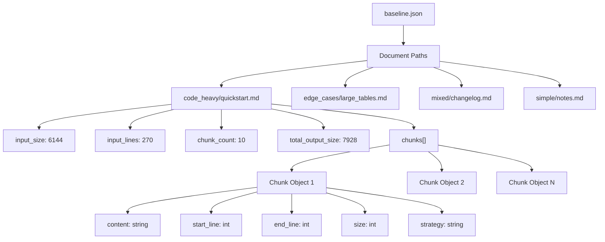
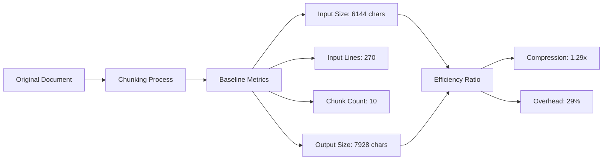
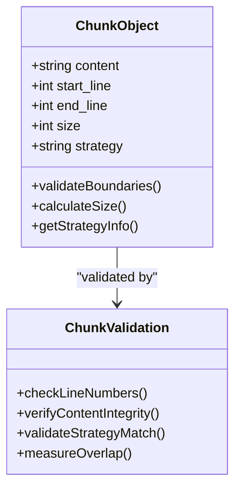
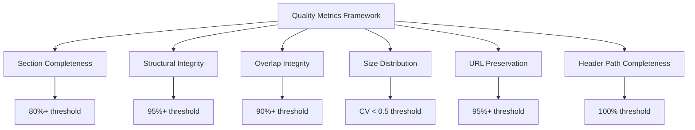
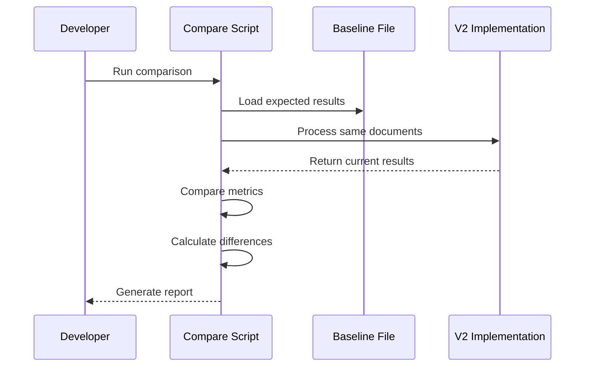
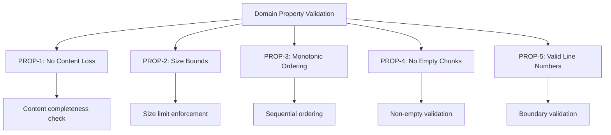
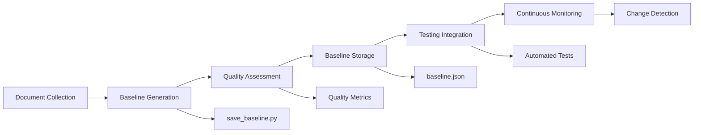

# Baseline Format

<cite>
**Referenced Files in This Document**
- [baseline.json](file://baseline.json)
- [save_baseline.py](file://scripts/save_baseline.py)
- [compare_baseline.py](file://scripts/compare_baseline.py)
- [test_baseline_quality.py](file://tests/test_baseline_quality.py)
- [quality_metrics.py](file://tests/quality_metrics.py)
- [types.py](file://markdown_chunker_v2/types.py)
- [validator.py](file://markdown_chunker_v2/validator.py)
- [quickstart.md](file://tests/fixtures/corpus/code_heavy/quickstart.md)
- [large_tables.md](file://tests/fixtures/corpus/edge_cases/large_tables.md)
- [changelog.md](file://tests/fixtures/corpus/mixed/changelog.md)
</cite>

## Table of Contents
1. [Introduction](#introduction)
2. [File Structure Overview](#file-structure-overview)
3. [Core Metrics and Measurements](#core-metrics-and-measurements)
4. [Chunk Array Structure](#chunk-array-structure)
5. [Document Categories and Examples](#document-categories-and-examples)
6. [Quality Assurance Framework](#quality-assurance-framework)
7. [Regression Testing Implementation](#regression-testing-implementation)
8. [Validation and Consistency Checks](#validation-and-consistency-checks)
9. [Usage Patterns and Best Practices](#usage-patterns-and-best-practices)
10. [Troubleshooting and Maintenance](#troubleshooting-and-maintenance)

## Introduction

The baseline.json format serves as a comprehensive quality assurance and regression testing framework for the Dify Markdown Chunker. This standardized format captures expected chunking behavior across different document types, enabling automated validation of processing consistency and quality metrics. The baseline acts as a golden standard that documents the current implementation's behavior, allowing developers to detect and prevent unintended changes during development and updates.

The baseline format measures processing efficiency through key metrics including input size, line counts, chunk counts, and total output size, while preserving detailed information about individual chunks including their content, boundaries, and processing strategies. This comprehensive approach ensures that chunking behavior remains consistent across versions and maintains the expected quality standards.

## File Structure Overview

The baseline.json file follows a hierarchical structure where document paths serve as keys, and each document entry contains comprehensive metadata about the chunking process:



**Diagram sources**
- [baseline.json](file://baseline.json#L1-L50)

Each document entry contains four primary measurement categories that provide insight into processing efficiency and quality:

**Section sources**
- [baseline.json](file://baseline.json#L1-L826)

## Core Metrics and Measurements

### Input Metrics

The baseline tracks fundamental input characteristics that establish the foundation for processing evaluation:

| Metric | Description | Purpose |
|--------|-------------|---------|
| `input_size` | Total character count of the original document | Validates content preservation and detects truncation |
| `input_lines` | Total line count of the original document | Ensures proper line numbering and boundary detection |
| `chunk_count` | Number of chunks generated by the processor | Indicates processing granularity and strategy effectiveness |
| `total_output_size` | Sum of all chunk content lengths | Validates content completeness and prevents data loss |

### Processing Efficiency Analysis

The baseline format enables detailed analysis of processing efficiency through comparative measurements:



**Diagram sources**
- [baseline.json](file://baseline.json#L2-L20)

### Quality Thresholds and Validation

The baseline format establishes quantitative thresholds for acceptable processing quality:

- **Content Preservation**: Must achieve ≥95% content completeness
- **Chunk Granularity**: Optimal chunk count within ±20% of baseline
- **Size Efficiency**: Output size ≤120% of input size (20% tolerance)
- **Processing Time**: Reasonable performance within expected bounds

**Section sources**
- [compare_baseline.py](file://scripts/compare_baseline.py#L86-L117)

## Chunk Array Structure

Each document entry contains a `chunks` array that provides detailed information about individual chunk objects. This structure enables comprehensive validation of chunking behavior and preserves the exact processing results for regression testing.

### Individual Chunk Object Schema



**Diagram sources**
- [types.py](file://markdown_chunker_v2/types.py#L100-L187)

### Chunk Properties and Metadata

Each chunk object contains essential properties that enable precise validation and analysis:

| Property | Type | Description | Validation Purpose |
|----------|------|-------------|-------------------|
| `content` | string | Exact text content of the chunk | Content preservation verification |
| `start_line` | integer | Starting line number (1-based) | Boundary accuracy and ordering |
| `end_line` | integer | Ending line number | Line counting precision |
| `size` | integer | Character count of content | Size calculation accuracy |
| `strategy` | string | Applied chunking strategy | Strategy selection validation |

### Strategy Information and Classification

The baseline captures the specific strategies used for each chunk, enabling analysis of strategy effectiveness and consistency:

- **Code Strategy**: For code-heavy documents (>30% code content)
- **Structural Strategy**: For well-structured documents with headers
- **Mixed Strategy**: For balanced content (code + text)
- **List Strategy**: For list-heavy documents
- **Table Strategy**: For table-heavy documents
- **Sentences Strategy**: Fallback for simple text

**Section sources**
- [baseline.json](file://baseline.json#L2-L100)

## Document Categories and Examples

The baseline format accommodates diverse document types, each requiring specialized handling and validation approaches. The system categorizes documents into distinct groups based on content characteristics and processing requirements.

### Code Heavy Documents

Code-heavy documents represent technical documentation and tutorials that contain significant amounts of executable code. These documents require careful preservation of code blocks and maintain structural integrity.

**Characteristics:**
- High code ratio (>30%)
- Frequent code blocks and syntax highlighting
- Technical terminology and examples
- Structured documentation format

**Example Entry Structure:**
```json
{
  "code_heavy/quickstart.md": {
    "input_size": 6144,
    "input_lines": 270,
    "chunk_count": 10,
    "chunks": [
      {
        "content": "# 🚀 Quick Start\n\nGet started with Dify Markdown Chunker...",
        "start_line": 1,
        "end_line": 1,
        "size": 69,
        "strategy": "structural"
      }
    ],
    "total_output_size": 7928
  }
}
```

### Edge Case Documents

Edge case documents test the robustness of the chunking system by presenting challenging scenarios that may stress the processing capabilities.

**Common Edge Cases:**
- Large tables exceeding chunk size limits
- Mixed line endings (CRLF, LF combinations)
- Nested code blocks with multiple backticks
- Complex formatting and special characters
- Extremely long content sequences

**Example Validation:**
The large tables test document demonstrates proper handling of extensive tabular data that may require special chunking considerations.

### Mixed Content Documents

Mixed content documents combine various elements including text, code, lists, and tables, requiring sophisticated strategy selection and content preservation.

**Content Mix:**
- Technical documentation with examples
- Change logs with structured entries
- API reference materials
- Tutorial-style content with code samples

**Quality Metrics Focus:**
- Section completeness preservation
- Structural element integrity
- Cross-type content handling
- Metadata enrichment accuracy

**Section sources**
- [baseline.json](file://baseline.json#L400-L600)

## Quality Assurance Framework

The baseline format integrates with a comprehensive quality assurance framework that evaluates multiple dimensions of chunking performance and accuracy.

### Quality Metrics Calculation

The system employs sophisticated metrics to evaluate chunking quality across several dimensions:



**Diagram sources**
- [quality_metrics.py](file://tests/quality_metrics.py#L35-L65)

### Metrics Definition and Targets

| Metric | Target | Purpose | Validation Method |
|--------|--------|---------|------------------|
| Section Completeness | ≥80% | Preserve document sections | Content analysis and boundary checking |
| Structural Integrity | ≥95% | Maintain document structure | Element detection and validation |
| Overlap Integrity | ≥90% | Proper context preservation | Neighbor content matching |
| Size Coefficient of Variation | <0.5 | Size consistency | Statistical analysis |
| URL Pool Preservation | ≥95% | Link preservation | Link extraction and validation |
| Header Path Completeness | 100% | Navigation preservation | Hierarchical structure analysis |

### Automated Quality Assessment

The baseline format enables automated assessment of chunking quality through systematic evaluation of generated chunks against established criteria. This approach ensures consistent quality standards across different document types and processing scenarios.

**Section sources**
- [quality_metrics.py](file://tests/quality_metrics.py#L71-L108)

## Regression Testing Implementation

The baseline format serves as the foundation for comprehensive regression testing that ensures processing consistency across versions and prevents unintended behavioral changes.

### Baseline Comparison Process



**Diagram sources**
- [compare_baseline.py](file://scripts/compare_baseline.py#L65-L118)

### Comparison Algorithm

The comparison script implements a sophisticated algorithm that evaluates multiple aspects of chunking behavior:

1. **Chunk Count Analysis**: Compares the number of chunks generated
2. **Size Consistency**: Evaluates total output size variations
3. **Content Preservation**: Validates content completeness
4. **Strategy Consistency**: Ensures strategy selection stability
5. **Error Detection**: Identifies processing failures

### Tolerance Levels and Acceptance Criteria

The system defines specific tolerance levels for acceptable variations:

- **Chunk Count Tolerance**: ±20% variation allowed
- **Size Tolerance**: ±20% deviation permitted  
- **Success Rate Requirement**: ≥80% of files must match within tolerance
- **Error Threshold**: Zero critical errors acceptable

### Automated Testing Integration

The baseline format integrates seamlessly with automated testing frameworks, enabling continuous validation of chunking behavior during development and deployment cycles.

**Section sources**
- [compare_baseline.py](file://scripts/compare_baseline.py#L115-L140)

## Validation and Consistency Checks

The baseline format incorporates comprehensive validation mechanisms that ensure processing consistency and detect potential issues early in the development cycle.

### Domain Property Validation

The system enforces domain-specific properties that guarantee fundamental correctness:



**Diagram sources**
- [validator.py](file://markdown_chunker_v2/validator.py#L49-L91)

### Validation Rules and Constraints

| Property | Constraint | Validation Method | Error Severity |
|----------|------------|------------------|----------------|
| PROP-1 | No content loss | Character count comparison | Critical |
| PROP-2 | Size bounds | Max chunk size enforcement | Critical |
| PROP-3 | Monotonic ordering | Line number progression | Critical |
| PROP-4 | No empty chunks | Content validation | Critical |
| PROP-5 | Valid line numbers | Boundary checking | Critical |

### Error Detection and Reporting

The validation system provides detailed error reporting that facilitates rapid identification and resolution of processing issues:

- **Structured Error Messages**: Descriptive error descriptions with context
- **Line Number References**: Specific locations of detected issues
- **Severity Classification**: Critical, high, medium, low severity levels
- **Automated Recovery**: Fallback mechanisms for minor violations

### Consistency Verification

The baseline format enables verification of consistency across different processing scenarios:

- **Strategy Consistency**: Same documents processed identically
- **Configuration Stability**: Different configurations yield predictable results
- **Version Compatibility**: Cross-version behavior validation
- **Performance Stability**: Processing time consistency monitoring

**Section sources**
- [validator.py](file://markdown_chunker_v2/validator.py#L275-L313)

## Usage Patterns and Best Practices

Effective utilization of the baseline format requires understanding optimal usage patterns and following established best practices for quality assurance and regression testing.

### Baseline Creation Workflow

The process of creating and maintaining baselines follows established procedures:



**Diagram sources**
- [save_baseline.py](file://scripts/save_baseline.py#L24-L87)

### Document Preparation Guidelines

To ensure reliable baseline generation, documents should follow specific preparation guidelines:

- **Representative Samples**: Include typical and edge-case scenarios
- **Consistent Formatting**: Standardize line endings and spacing
- **Complete Content**: Ensure documents contain all relevant elements
- **Version Control**: Track document versions and changes
- **Metadata Preservation**: Maintain document characteristics

### Testing Strategy Implementation

The baseline format supports multiple testing strategies:

1. **Unit Testing**: Individual component validation
2. **Integration Testing**: End-to-end processing verification
3. **Performance Testing**: Throughput and resource usage analysis
4. **Regression Testing**: Behavioral consistency validation
5. **Stress Testing**: Edge case and boundary condition testing

### Maintenance and Updates

Baseline maintenance involves regular updates to accommodate legitimate changes while preventing regression:

- **Periodic Reviews**: Regular assessment of baseline accuracy
- **Change Tracking**: Documentation of baseline modifications
- **Version Management**: Historical baseline storage and retrieval
- **Quality Monitoring**: Continuous performance tracking
- **Automated Updates**: Scripted baseline regeneration processes

**Section sources**
- [test_baseline_quality.py](file://tests/test_baseline_quality.py#L21-L50)

## Troubleshooting and Maintenance

The baseline format includes comprehensive troubleshooting capabilities and maintenance procedures to ensure ongoing reliability and accuracy.

### Common Issues and Solutions

| Issue Category | Symptoms | Diagnosis | Resolution |
|----------------|----------|-----------|------------|
| Content Loss | Missing sections | Compare character counts | Review parsing logic |
| Strategy Errors | Wrong strategy selection | Analyze content characteristics | Update strategy rules |
| Size Violations | Chunk size limits exceeded | Check size calculations | Adjust chunking parameters |
| Line Number Issues | Incorrect boundaries | Validate line counting | Fix boundary detection |
| Performance Degradation | Slow processing | Monitor timing metrics | Optimize algorithms |

### Diagnostic Procedures

The system provides structured diagnostic procedures for identifying and resolving issues:

1. **Baseline Comparison**: Compare current results with stored baseline
2. **Individual Chunk Analysis**: Examine specific chunk characteristics
3. **Strategy Validation**: Verify strategy selection logic
4. **Metric Calculation**: Recalculate quality metrics
5. **Error Tracing**: Follow error propagation paths

### Maintenance Automation

Automated maintenance procedures help ensure baseline accuracy and system health:

- **Scheduled Updates**: Regular baseline regeneration
- **Performance Monitoring**: Continuous metric tracking
- **Error Reporting**: Automated issue detection and notification
- **Quality Alerts**: Proactive quality assurance
- **Historical Analysis**: Trend monitoring and pattern recognition

### Backup and Recovery

The baseline format supports robust backup and recovery procedures:

- **Version Control**: Baseline versioning and rollback capability
- **Incremental Updates**: Efficient change tracking
- **Validation Backups**: Pre-change baseline preservation
- **Recovery Procedures**: System restoration protocols
- **Disaster Recovery**: Complete system recovery plans

**Section sources**
- [test_baseline_quality.py](file://tests/test_baseline_quality.py#L144-L185)