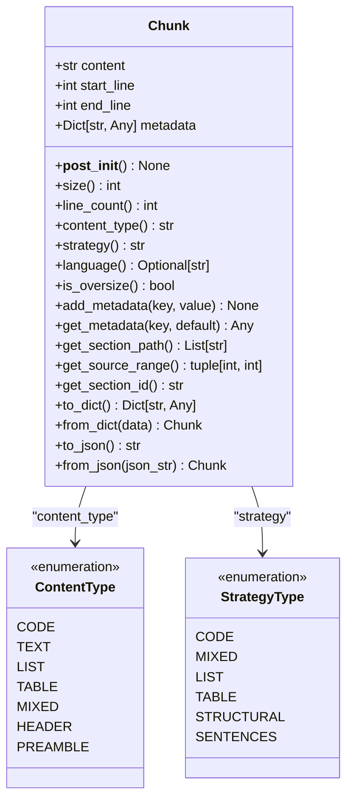
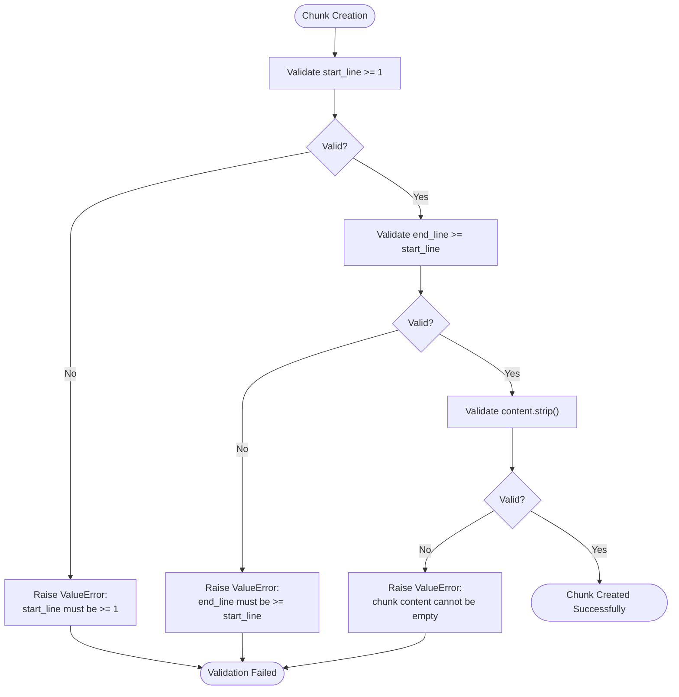

# Chunk Structure

<cite>
**Referenced Files in This Document**
- [markdown_chunker_v2/types.py](file://markdown_chunker_v2/types.py)
- [markdown_chunker_legacy/chunker/types.py](file://markdown_chunker_legacy/chunker/types.py)
- [tests/chunker/test_types.py](file://tests/chunker/test_types.py)
- [tests/chunker/test_serialization.py](file://tests/chunker/test_serialization.py)
- [tests/fixtures/code_heavy.md](file://tests/fixtures/code_heavy.md)
- [tests/fixtures/mixed.md](file://tests/fixtures/mixed.md)
- [tests/fixtures/structural.md](file://tests/fixtures/structural.md)
- [tests/fixtures/list_heavy.md](file://tests/fixtures/list_heavy.md)
- [docs/api/types.md](file://docs/api/types.md)
- [docs/reference/output-format.md](file://docs/reference/output-format.md)
</cite>

## Table of Contents
1. [Introduction](#introduction)
2. [Core Chunk Structure](#core-chunk-structure)
3. [Field Specifications](#field-specifications)
4. [Properties and Computed Values](#properties-and-computed-values)
5. [Document Type Examples](#document-type-examples)
6. [Validation Rules](#validation-rules)
7. [Serialization and Deserialization](#serialization-and-deserialization)
8. [RAG System Integration](#rag-system-integration)
9. [Best Practices](#best-practices)
10. [Troubleshooting](#troubleshooting)

## Introduction

The Chunk data structure is the fundamental building block of the Advanced Markdown Chunker system, representing semantically meaningful fragments of Markdown documents that are optimized for Retrieval-Augmented Generation (RAG) systems. Each chunk encapsulates content along with metadata that preserves context and enables intelligent retrieval and processing.

Chunks serve as the primary output unit for the chunking process, designed to maintain semantic coherence while respecting document structure and content boundaries. They are specifically engineered to support various content types including code blocks, tables, lists, and structured text, making them versatile for different document types and use cases.

## Core Chunk Structure

The Chunk data structure is implemented as a Python dataclass that provides type safety, immutability, and rich functionality for RAG applications.



**Diagram sources**
- [markdown_chunker_v2/types.py](file://markdown_chunker_v2/types.py#L100-L272)
- [markdown_chunker_legacy/chunker/types.py](file://markdown_chunker_legacy/chunker/types.py#L36-L324)

**Section sources**
- [markdown_chunker_v2/types.py](file://markdown_chunker_v2/types.py#L100-L171)
- [markdown_chunker_legacy/chunker/types.py](file://markdown_chunker_legacy/chunker/types.py#L36-L324)

## Field Specifications

### content
The primary text content of the chunk, preserving all Markdown formatting and structure. This field contains the actual textual material that will be processed by RAG systems.

**Characteristics:**
- Type: `str` (immutable text content)
- Purpose: Contains the semantic content to be indexed and retrieved
- Preservation: Maintains original Markdown formatting, including code blocks, tables, and formatting
- Constraints: Cannot be empty or whitespace-only (validated in `__post_init__`)

### start_line
The starting line number of the chunk in the original document, using 1-based indexing. This field establishes the temporal and spatial context for the chunk.

**Characteristics:**
- Type: `int` (positive integer)
- Range: Must be ≥ 1
- Purpose: Enables precise location tracking within the source document
- Relationship: Must be ≤ end_line (validated in `__post_init__`)
- Use case: Supports line-based navigation and context preservation

### end_line
The ending line number of the chunk in the original document, using 1-based indexing. Together with start_line, this defines the exact span of content in the source document.

**Characteristics:**
- Type: `int` (positive integer)
- Range: Must be ≥ start_line
- Purpose: Defines the complete boundary of the chunk's content
- Calculation: line_count = end_line - start_line + 1
- Use case: Enables precise content extraction and overlap management

### metadata
A dictionary containing additional information about the chunk, including content type, strategy used, language identification, and RAG-specific metadata.

**Characteristics:**
- Type: `Dict[str, Any]` (dictionary with string keys)
- Default: Empty dictionary (`{}`)
- Purpose: Stores contextual information for RAG processing
- Extensibility: Can contain arbitrary key-value pairs
- Serialization: Fully preserved during JSON serialization

**Common metadata fields:**
- `"content_type"`: Type of content (code, text, list, table, mixed)
- `"strategy"`: Chunking strategy used (code, mixed, list, table, structural, sentences)
- `"language"`: Programming language for code chunks
- `"allow_oversize"`: Boolean indicating if chunk exceeds normal size limits
- `"section_path"`: Hierarchical path to section containing the chunk
- `"start_offset"`, `"end_offset"`: Character positions in source document

**Section sources**
- [markdown_chunker_v2/types.py](file://markdown_chunker_v2/types.py#L100-L114)
- [markdown_chunker_legacy/chunker/types.py](file://markdown_chunker_legacy/chunker/types.py#L45-L48)

## Properties and Computed Values

### size
Computes the character length of the chunk content, providing a measure of the chunk's textual volume.

**Implementation:**
```python
@property
def size(self) -> int:
    return len(self.content)
```

**Use cases:**
- Size-based filtering and validation
- Memory estimation for processing
- Chunking strategy optimization
- RAG relevance scoring

### line_count
Calculates the number of lines spanned by the chunk, derived from line boundaries.

**Implementation:**
```python
@property
def line_count(self) -> int:
    return self.end_line - self.start_line + 1
```

**Alternative implementation (v2):**
```python
@property
def line_count(self) -> int:
    return self.content.count('\n') + 1
```

**Use cases:**
- Content structure analysis
- Line-based overlap calculations
- Visual representation sizing
- Processing time estimation

### content_type
Retrieves the type of content contained within the chunk, inferred from metadata.

**Default behavior:**
- Returns "text" if no content_type metadata is present
- Common values: "code", "text", "list", "table", "mixed", "header", "preamble"

**Use cases:**
- Strategy selection for RAG processing
- Content-specific preprocessing
- Quality assessment
- Filtering and categorization

### strategy
Identifies the chunking strategy used to create this chunk, reflecting the algorithmic approach.

**Default behavior:**
- Returns "unknown" if no strategy metadata is present
- Common values: "code", "mixed", "list", "table", "structural", "sentences"

**Use cases:**
- Performance analysis and optimization
- Strategy selection for similar documents
- Quality assurance and validation
- Debugging and troubleshooting

### language
Extracts the programming language identifier for code chunks, enabling language-specific processing.

**Return values:**
- String identifier (e.g., "python", "javascript", "rust") for code chunks
- `None` for non-code content or undetected languages

**Use cases:**
- Syntax highlighting and formatting
- Language-specific embeddings
- Code analysis and processing
- Developer documentation enhancement

### is_oversize
Determines whether the chunk exceeds normal size limits, typically for indivisible elements like large code blocks or tables.

**Default behavior:**
- Returns `False` if no allow_oversize metadata is present
- Indicates intentional size violation for content integrity

**Use cases:**
- Size constraint enforcement
- Content preservation decisions
- Processing optimization
- Quality monitoring

**Section sources**
- [markdown_chunker_v2/types.py](file://markdown_chunker_v2/types.py#L124-L137)
- [markdown_chunker_legacy/chunker/types.py](file://markdown_chunker_legacy/chunker/types.py#L91-L172)

## Document Type Examples

### Code-Heavy Documents

Code-heavy documents contain predominantly programming code with minimal prose, requiring specialized chunking strategies to preserve code integrity.

**Example characteristics:**
- High code ratio (>70% of content)
- Frequent code blocks with syntax highlighting
- Minimal text content between code sections
- Structured around functions, classes, and modules

**Chunk examples:**
```python
# Large code block chunk
chunk = Chunk(
    content="```python\ndef fibonacci(n):\n    if n <= 1:\n        return n\n    return fibonacci(n-1) + fibonacci(n-2)\n```",
    start_line=10,
    end_line=15,
    metadata={
        "content_type": "code",
        "strategy": "code",
        "language": "python",
        "allow_oversize": True
    }
)

# Single function chunk
chunk = Chunk(
    content="# Function documentation\n```javascript\nfunction processData(data) {\n    return data.map(item => item.processed);\n}```",
    start_line=20,
    end_line=25,
    metadata={
        "content_type": "code",
        "strategy": "code",
        "language": "javascript"
    }
)
```

### Structured Documents

Structured documents follow clear hierarchical organization with headers, lists, and organized content flow.

**Example characteristics:**
- Well-defined section hierarchy
- Regular header progression
- Logical content grouping
- Balanced text-to-structure ratio

**Chunk examples:**
```python
# Header section chunk
chunk = Chunk(
    content="# Introduction\nThis document provides an overview of the system...",
    start_line=1,
    end_line=3,
    metadata={
        "content_type": "text",
        "strategy": "structural",
        "section_path": ["Introduction"]
    }
)

# Nested list chunk
chunk = Chunk(
    content="## Features\n- Core functionality\n  - Sub-feature A\n  - Sub-feature B\n- Additional features",
    start_line=10,
    end_line=15,
    metadata={
        "content_type": "list",
        "strategy": "structural"
    }
)
```

### Mixed Content Documents

Mixed content documents combine various content types including text, code, lists, and tables within a single document.

**Example characteristics:**
- Balanced content distribution
- Multiple content types intermingled
- Complex structure with transitions
- Requires adaptive chunking strategies

**Chunk examples:**
```python
# Code with documentation chunk
chunk = Chunk(
    content="## Implementation\nHere's the core algorithm:\n```python\ndef main():\n    # Implementation details\n    pass\n```",
    start_line=1,
    end_line=6,
    metadata={
        "content_type": "mixed",
        "strategy": "mixed",
        "language": "python"
    }
)

# Table with explanation chunk
chunk = Chunk(
    content="## Results\n| Metric | Value | Status |\n|--------|-------|--------|\n| Accuracy | 95% | ✅ |\n| Speed | 1000 ops/sec | ⚡ |",
    start_line=10,
    end_line=15,
    metadata={
        "content_type": "table",
        "strategy": "mixed"
    }
)
```

**Section sources**
- [tests/fixtures/code_heavy.md](file://tests/fixtures/code_heavy.md#L1-L74)
- [tests/fixtures/mixed.md](file://tests/fixtures/mixed.md#L1-L51)
- [tests/fixtures/structural.md](file://tests/fixtures/structural.md#L1-L50)
- [tests/fixtures/list_heavy.md](file://tests/fixtures/list_heavy.md#L1-L53)

## Validation Rules

The Chunk data structure enforces several validation rules during initialization to ensure data integrity and prevent processing errors.

### Line Number Validation

**Rule 1: Positive start_line**
```python
if self.start_line < 1:
    raise ValueError("start_line must be >= 1 (1-based line numbering)")
```

**Rule 2: Logical end_line**
```python
if self.end_line < self.start_line:
    raise ValueError("end_line must be >= start_line")
```

**Purpose:**
- Ensures valid line range specification
- Prevents negative or zero-based line numbers
- Maintains chronological order of content

### Content Validation

**Rule: Non-empty content**
```python
if not self.content.strip():
    raise ValueError("chunk content cannot be empty or whitespace-only")
```

**Purpose:**
- Prevents processing of empty or meaningless chunks
- Ensures content availability for RAG systems
- Maintains quality standards

### Validation Flow



**Diagram sources**
- [markdown_chunker_v2/types.py](file://markdown_chunker_v2/types.py#L115-L122)
- [markdown_chunker_legacy/chunker/types.py](file://markdown_chunker_legacy/chunker/types.py#L50-L57)

**Section sources**
- [markdown_chunker_v2/types.py](file://markdown_chunker_v2/types.py#L115-L122)
- [markdown_chunker_legacy/chunker/types.py](file://markdown_chunker_legacy/chunker/types.py#L50-L57)

## Serialization and Deserialization

The Chunk data structure provides comprehensive serialization capabilities for storage, transmission, and persistence across different systems and platforms.

### to_dict Method

Converts a Chunk instance to a dictionary representation suitable for JSON serialization.

**Implementation:**
```python
def to_dict(self) -> Dict[str, Any]:
    return {
        "content": self.content,
        "start_line": self.start_line,
        "end_line": self.end_line,
        "size": self.size,
        "metadata": self.metadata,
    }
```

**Dictionary structure:**
- `"content"`: Original text content
- `"start_line"`: Starting line number (1-based)
- `"end_line"`: Ending line number (1-based)
- `"size"`: Character count (computed property)
- `"metadata"`: Dictionary of additional information

### from_dict Method

Creates a Chunk instance from a dictionary representation.

**Implementation:**
```python
@classmethod
def from_dict(cls, data: Dict[str, Any]) -> "Chunk":
    if not isinstance(data, dict):
        raise ValueError(f"Expected dict, got {type(data).__name__}")
    if "content" not in data:
        raise ValueError("Missing required field: content")
    if "start_line" not in data:
        raise ValueError("Missing required field: start_line")
    if "end_line" not in data:
        raise ValueError("Missing required field: end_line")
    
    return cls(
        content=data["content"],
        start_line=data["start_line"],
        end_line=data["end_line"],
        metadata=data.get("metadata", {}),
    )
```

### JSON Serialization

Provides direct JSON serialization capabilities for web APIs and data interchange.

**to_json method:**
```python
def to_json(self) -> str:
    import json
    return json.dumps(self.to_dict(), ensure_ascii=False)
```

**from_json method:**
```python
@classmethod
def from_json(cls, json_str: str) -> "Chunk":
    import json
    try:
        data = json.loads(json_str)
    except json.JSONDecodeError as e:
        raise ValueError(f"Invalid JSON: {e}")
    return cls.from_dict(data)
```

### Serialization Benefits

**Data Integrity:**
- Automatic validation during deserialization
- Type preservation across serialization boundaries
- Error handling for malformed data

**Interoperability:**
- Standard JSON format for universal compatibility
- Web API integration support
- Database storage optimization

**Performance:**
- Efficient memory usage for large datasets
- Streaming support for big documents
- Compression-friendly format

**Section sources**
- [markdown_chunker_v2/types.py](file://markdown_chunker_v2/types.py#L144-L186)
- [markdown_chunker_legacy/chunker/types.py](file://markdown_chunker_legacy/chunker/types.py#L262-L322)

## RAG System Integration

The Chunk data structure is specifically designed to support Retrieval-Augmented Generation (RAG) systems with features that enhance retrieval quality and processing efficiency.

### Metadata for RAG Enhancement

**Content Type Information:**
```python
# Code chunks for technical retrieval
chunk = Chunk(
    content="```python\ndef search_algorithm():\n    # Implementation\n    pass\n```",
    metadata={
        "content_type": "code",
        "strategy": "code",
        "language": "python"
    }
)

# Text chunks for general knowledge
chunk = Chunk(
    content="The search algorithm uses binary search principles...",
    metadata={
        "content_type": "text",
        "strategy": "sentences"
    }
)
```

**Context Preservation:**
```python
# Structural context for hierarchical retrieval
chunk = Chunk(
    content="# API Reference\n## Authentication\nMethods require JWT tokens...",
    metadata={
        "content_type": "text",
        "strategy": "structural",
        "section_path": ["API Reference", "Authentication"]
    }
)
```

### RAG-Optimized Fields

**Semantic Indicators:**
- `has_bold`, `has_italic`: Formatting importance
- `has_urls`, `has_emails`: Link relevance
- `has_preamble`: Document introduction presence

**Content-Specific Metadata:**
- **Lists**: `list_type`, `has_nested_lists`
- **Code**: `language`, `has_syntax_highlighting`
- **Tables**: `row_count`, `column_count`, `has_header`

### Integration Patterns

**Query Enhancement:**
```python
# Filter chunks by content type for domain-specific retrieval
def filter_by_content_type(chunks, content_type):
    return [chunk for chunk in chunks 
            if chunk.get_metadata("content_type") == content_type]

# Language-specific embedding preparation
def prepare_embeddings(chunks):
    code_chunks = filter_by_content_type(chunks, "code")
    text_chunks = filter_by_content_type(chunks, "text")
    
    # Different embedding strategies for different content types
    code_embeddings = embed_code_chunks(code_chunks)
    text_embeddings = embed_text_chunks(text_chunks)
    
    return combine_embeddings(code_embeddings, text_embeddings)
```

**Overlap Management:**
```python
# Handle overlapping chunks for context preservation
def process_overlapping_chunks(chunks):
    processed = []
    for i, chunk in enumerate(chunks):
        chunk.add_metadata("is_first_chunk", i == 0)
        chunk.add_metadata("is_last_chunk", i == len(chunks) - 1)
        
        if i > 0:
            prev_chunk = chunks[i-1]
            if overlaps_with(prev_chunk, chunk):
                chunk.add_metadata("has_overlap", True)
                chunk.add_metadata("overlap_type", "suffix")
    
    return processed
```

**Section sources**
- [docs/reference/output-format.md](file://docs/reference/output-format.md#L67-L118)

## Best Practices

### Chunk Size Optimization

**Recommended Guidelines:**
- **Minimum size**: 512 characters for adequate context
- **Target size**: 2048 characters for optimal balance
- **Maximum size**: 4096 characters with careful consideration
- **Oversize allowance**: Up to 20% for indivisible elements

**Size-based Strategy Selection:**
```python
def select_optimal_strategy(document_size, content_distribution):
    if document_size < 1000:
        return "sentences"  # Small documents benefit from sentence-level chunks
    elif content_distribution["code_ratio"] > 0.7:
        return "code"       # Code-heavy documents need specialized handling
    elif content_distribution["list_ratio"] > 0.5:
        return "list"       # List-heavy documents preserve structure
    else:
        return "mixed"      # Mixed content benefits from adaptive strategies
```

### Metadata Management

**Consistent Metadata Patterns:**
```python
# Standard metadata structure
standard_metadata = {
    "content_type": "text",      # Required for strategy selection
    "strategy": "sentences",     # Required for performance tracking
    "chunk_index": 0,           # Required for ordering
    "is_first_chunk": True,     # Required for context management
    "is_last_chunk": False,     # Required for context management
}

# Content-specific metadata
def add_code_metadata(chunk, language, function_name=None):
    chunk.add_metadata("content_type", "code")
    chunk.add_metadata("language", language)
    if function_name:
        chunk.add_metadata("function_name", function_name)
    chunk.add_metadata("has_syntax_highlighting", True)

def add_list_metadata(chunk, list_type, nested_levels=0):
    chunk.add_metadata("content_type", "list")
    chunk.add_metadata("list_type", list_type)
    chunk.add_metadata("has_nested_lists", nested_levels > 0)
```

### Error Handling and Validation

**Robust Processing Pipeline:**
```python
def robust_chunk_processing(content, config):
    try:
        # Validate input
        if not content or len(content.strip()) == 0:
            raise ValueError("Empty or null content")
        
        # Create chunker with validation
        chunker = MarkdownChunker(config)
        
        # Process with error handling
        result = chunker.chunk_with_analysis(content)
        
        # Validate output
        if not result.success:
            logger.warning(f"Chunking failed: {result.errors}")
            return []
            
        return result.chunks
        
    except Exception as e:
        logger.error(f"Chunk processing failed: {e}")
        return []
```

### Performance Optimization

**Memory-Efficient Processing:**
```python
def stream_process_large_documents(file_path, chunk_size=4096):
    """Process large documents in streaming fashion."""
    buffer = ""
    current_chunk = []
    
    with open(file_path, 'r', encoding='utf-8') as file:
        for line in file:
            buffer += line
            
            if len(buffer) >= chunk_size:
                # Create chunk from accumulated content
                chunk_content = buffer[:chunk_size]
                remaining = buffer[chunk_size:]
                
                chunk = Chunk(
                    content=chunk_content,
                    start_line=calculate_start_line(current_chunk),
                    end_line=calculate_end_line(current_chunk),
                    metadata={"stream_chunk": True}
                )
                
                yield chunk
                buffer = remaining
                
        # Yield remaining content as final chunk
        if buffer:
            chunk = Chunk(
                content=buffer,
                start_line=calculate_start_line(current_chunk),
                end_line=calculate_end_line(current_chunk),
                metadata={"stream_chunk": True, "last_chunk": True}
            )
            yield chunk
```

## Troubleshooting

### Common Issues and Solutions

**Issue: Empty or Whitespace-Only Chunks**
```python
# Problem: Validation fails with "chunk content cannot be empty"
# Solution: Pre-validate content before chunk creation
def safe_create_chunk(content, start_line, end_line, metadata=None):
    if not content or not content.strip():
        # Skip empty chunks or merge with adjacent chunks
        return None
    
    return Chunk(
        content=content,
        start_line=start_line,
        end_line=end_line,
        metadata=metadata or {}
    )
```

**Issue: Invalid Line Numbers**
```python
# Problem: ValueError with line number constraints
# Solution: Validate and normalize line numbers
def normalize_line_numbers(start_line, end_line):
    if start_line < 1:
        start_line = 1
    if end_line < start_line:
        end_line = start_line
    return start_line, end_line
```

**Issue: Serialization Failures**
```python
# Problem: JSON serialization errors
# Solution: Implement robust serialization with error handling
def safe_serialize_chunk(chunk):
    try:
        return chunk.to_json()
    except TypeError as e:
        # Handle non-serializable metadata
        sanitized_metadata = {
            k: str(v) if not isinstance(v, (str, int, float, bool, list, dict)) else v
            for k, v in chunk.metadata.items()
        }
        
        return Chunk(
            content=chunk.content,
            start_line=chunk.start_line,
            end_line=chunk.end_line,
            metadata=sanitized_metadata
        ).to_json()
```

### Debugging Techniques

**Chunk Inspection:**
```python
def debug_chunk(chunk):
    """Comprehensive chunk inspection for debugging."""
    print(f"Content: {chunk.content[:100]}...")
    print(f"Length: {chunk.size} characters")
    print(f"Lines: {chunk.start_line}-{chunk.end_line} ({chunk.line_count} lines)")
    print(f"Content Type: {chunk.content_type}")
    print(f"Strategy: {chunk.strategy}")
    print(f"Language: {chunk.language}")
    print(f"Oversize: {chunk.is_oversize}")
    print(f"Metadata: {chunk.metadata}")
```

**Validation Pipeline:**
```python
def validate_chunk_pipeline(chunks):
    """Validate a collection of chunks for consistency."""
    results = []
    
    for i, chunk in enumerate(chunks):
        validation = {
            "index": i,
            "valid": True,
            "errors": [],
            "line_consistency": True,
            "content_quality": True
        }
        
        # Line number validation
        if chunk.start_line < 1:
            validation["errors"].append("Invalid start_line")
            validation["valid"] = False
            
        if chunk.end_line < chunk.start_line:
            validation["errors"].append("Invalid end_line")
            validation["line_consistency"] = False
            
        # Content validation
        if not chunk.content.strip():
            validation["errors"].append("Empty content")
            validation["content_quality"] = False
            
        results.append(validation)
    
    return results
```

### Performance Monitoring

**Chunk Quality Metrics:**
```python
def monitor_chunk_quality(chunks):
    """Monitor chunk quality metrics for optimization."""
    metrics = {
        "total_chunks": len(chunks),
        "avg_size": sum(chunk.size for chunk in chunks) / len(chunks) if chunks else 0,
        "min_size": min(chunk.size for chunk in chunks) if chunks else 0,
        "max_size": max(chunk.size for chunk in chunks) if chunks else 0,
        "size_variance": 0,
        "content_type_distribution": {},
        "strategy_distribution": {}
    }
    
    # Calculate variance
    if chunks:
        avg = metrics["avg_size"]
        metrics["size_variance"] = sum((chunk.size - avg) ** 2 for chunk in chunks) / len(chunks)
    
    # Distribution analysis
    for chunk in chunks:
        content_type = chunk.get_metadata("content_type", "unknown")
        strategy = chunk.get_metadata("strategy", "unknown")
        
        metrics["content_type_distribution"].setdefault(content_type, 0)
        metrics["content_type_distribution"][content_type] += 1
        
        metrics["strategy_distribution"].setdefault(strategy, 0)
        metrics["strategy_distribution"][strategy] += 1
    
    return metrics
```

**Section sources**
- [tests/chunker/test_types.py](file://tests/chunker/test_types.py#L51-L69)
- [tests/chunker/test_serialization.py](file://tests/chunker/test_serialization.py#L1-L223)