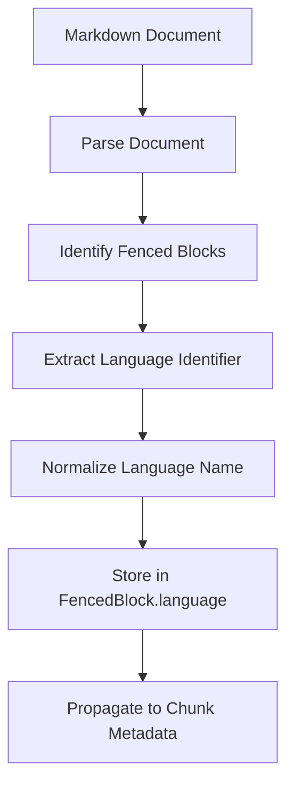
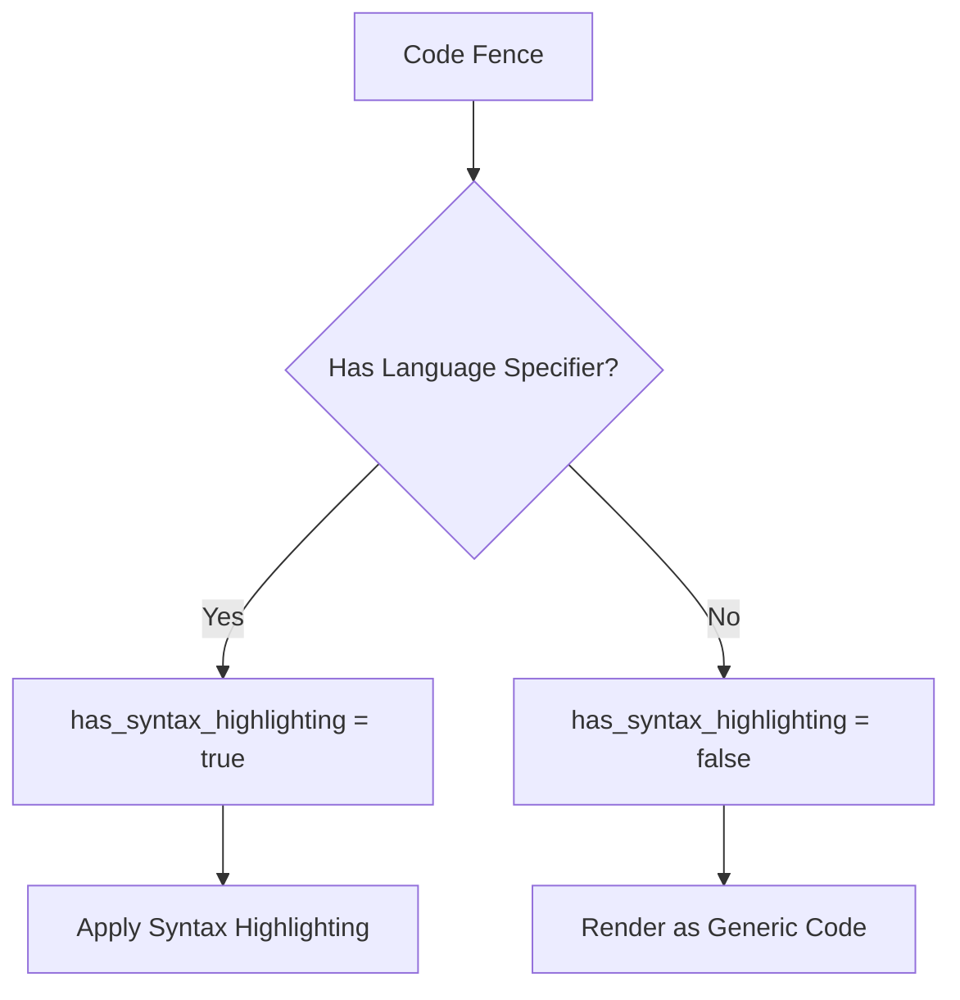
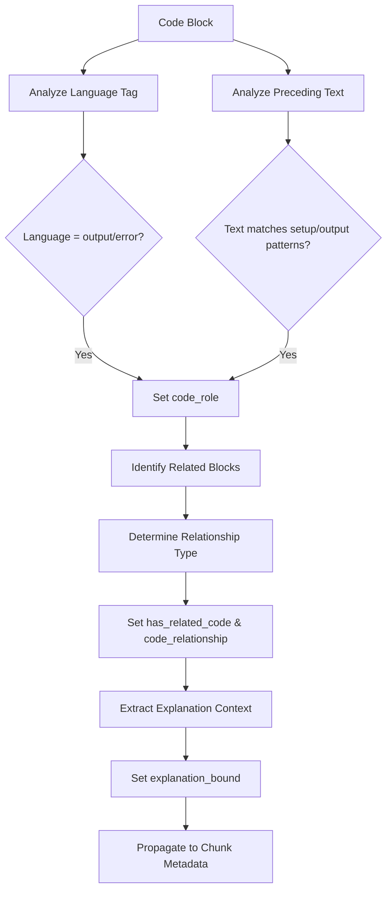
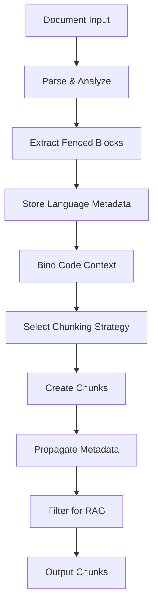
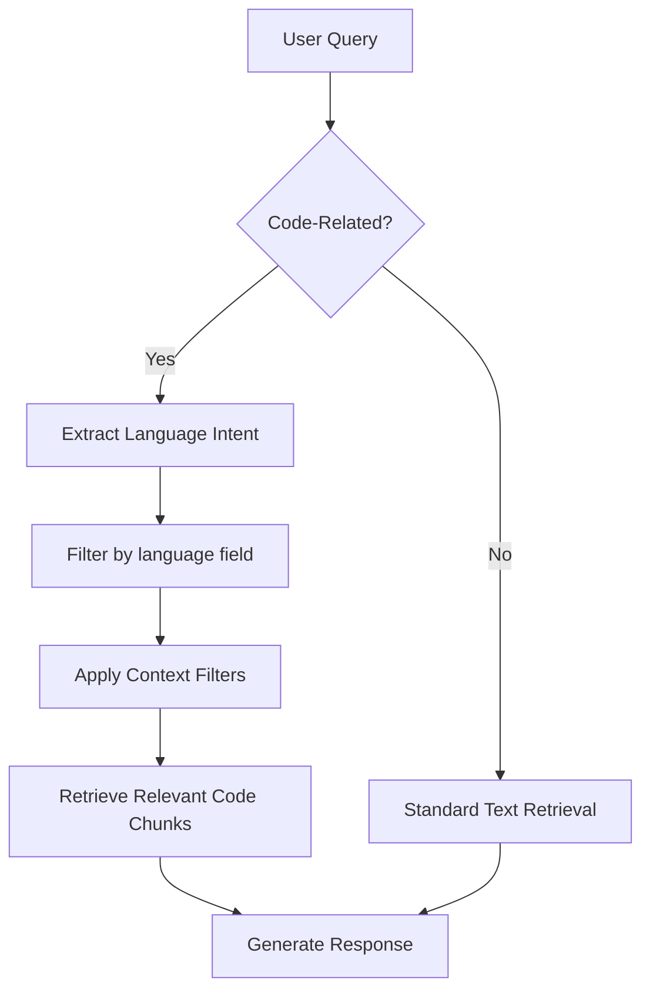

# Code Content Fields

<cite>
**Referenced Files in This Document**   
- [types.py](file://markdown_chunker_v2/types.py)
- [parser.py](file://markdown_chunker_v2/parser.py)
- [code_aware.py](file://markdown_chunker_v2/strategies/code_aware.py)
- [output-format.md](file://docs/reference/output-format.md)
- [api_usage.py](file://examples/api_usage.py)
- [rag_integration.py](file://examples/rag_integration.py)
- [test_metadata_filtering.py](file://tests/test_metadata_filtering.py)
- [fence_handler.py](file://markdown_chunker_legacy/parser/fence_handler.py)
- [code_context.py](file://markdown_chunker_v2/code_context.py)
- [test_code_context_binding.py](file://tests/chunker/test_code_context_binding.py)
- [test_code_context_properties.py](file://tests/chunker/test_code_context_properties.py)
- [06-enhanced-code-context-binding.md](file://docs/research/features/06-enhanced-code-context-binding.md)
</cite>

## Update Summary
**Changes Made**   
- Added new metadata fields introduced by the code context binding system: code_role, has_related_code, code_relationship, and explanation_bound
- Updated metadata processing pipeline to include context binding
- Added new section on code context binding with examples
- Updated usage examples to reflect new metadata fields
- Added new diagram showing context binding process

## Table of Contents
1. [Introduction](#introduction)
2. [Language Field](#language-field)
3. [Has Syntax Highlighting Field](#has-syntax-highlighting-field)
4. [Code Context Binding](#code-context-binding)
5. [Metadata Processing Pipeline](#metadata-processing-pipeline)
6. [Usage Examples](#usage-examples)
7. [RAG System Integration](#rag-system-integration)
8. [Code Access and Processing](#code-access-and-processing)
9. [Conclusion](#conclusion)

## Introduction

The markdown chunker system provides specialized metadata fields for code content that enhance retrieval precision in RAG (Retrieval-Augmented Generation) systems. These metadata fields capture essential information about code blocks within markdown documents, enabling language-specific filtering and processing. The system analyzes markdown content to extract code-specific metadata, particularly focusing on programming language identification and syntax highlighting indicators. This documentation details the implementation and usage of these metadata fields, showing how they are populated from code fence indicators and how they influence chunking strategies and downstream processing in AI applications.

**Section sources**
- [types.py](file://markdown_chunker_v2/types.py#L11-L30)
- [output-format.md](file://docs/reference/output-format.md#L77-L107)

## Language Field

The `language` field specifies the programming language detected in code blocks, extracted from the language identifier in code fence indicators. When a fenced code block is encountered in markdown (using triple backticks ```` ``` ````), the optional language identifier immediately following the opening fence is captured as the language value. The system normalizes language identifiers to lowercase and extracts only the first word when multiple attributes are present. For example, a fence line of ```` ```python title="example.py" ```` results in a language value of "python". The language detection occurs during the parsing phase, where the document is analyzed to identify all fenced code blocks and their associated metadata. This field is crucial for routing code chunks to appropriate language-specific processing pipelines and for enabling language-based filtering in retrieval systems.



**Diagram sources**
- [parser.py](file://markdown_chunker_v2/parser.py#L96-L143)
- [fence_handler.py](file://markdown_chunker_legacy/parser/fence_handler.py#L279-L286)

**Section sources**
- [types.py](file://markdown_chunker_v2/types.py#L24-L25)
- [parser.py](file://markdown_chunker_v2/parser.py#L116-L117)

## Has Syntax Highlighting Field

The `has_syntax_highlighting` field indicates whether syntax highlighting is applied to a code block based on the presence of a language identifier in the code fence. This boolean field is derived from whether a language is specified in the opening fence of a code block. When a code fence includes a language identifier (e.g., ```` ```python ````), the field is set to true, indicating that syntax highlighting should be applied. If the fence has no language specifier (e.g., ```` ``` ````), the field is false. This metadata enables rendering systems to apply appropriate syntax highlighting and helps retrieval systems identify code blocks with explicit language context. The field serves as a quality indicator for code blocks, distinguishing between generic code formatting and language-specific code with proper syntax context.



**Diagram sources**
- [output-format.md](file://docs/reference/output-format.md#L96)
- [test_metadata_filtering.py](file://tests/test_metadata_filtering.py#L123-L155)

**Section sources**
- [output-format.md](file://docs/reference/output-format.md#L96)
- [test_metadata_filtering.py](file://tests/test_metadata_filtering.py#L123-L155)

## Code Context Binding

The code context binding system introduces new metadata fields that classify code blocks based on their role and relationships within documentation. The `code_role` field classifies code blocks into categories such as example, setup, output, before, after, or error based on language identifiers and surrounding text patterns. The `has_related_code` field indicates whether a code block is grouped with other related blocks, while `code_relationship` specifies the type of relationship (e.g., before_after, code_output). The `explanation_bound` field shows whether explanation context is available before or after the code block. These fields are populated by the CodeContextBinder, which analyzes code blocks and their surrounding context to identify patterns like Before/After comparisons, Code+Output pairs, and setup/example sequences.



**Diagram sources**
- [code_context.py](file://markdown_chunker_v2/code_context.py#L63-L510)
- [test_code_context_binding.py](file://tests/chunker/test_code_context_binding.py#L49-L83)
- [06-enhanced-code-context-binding.md](file://docs/research/features/06-enhanced-code-context-binding.md#L51-L244)

**Section sources**
- [code_context.py](file://markdown_chunker_v2/code_context.py#L16-L30)
- [types.py](file://markdown_chunker_v2/types.py#L72-L106)
- [test_code_context_properties.py](file://tests/chunker/test_code_context_properties.py#L77-L124)

## Metadata Processing Pipeline

The metadata processing pipeline extracts code-specific fields during document analysis and propagates them through the chunking process. The pipeline begins with document parsing, where the markdown content is analyzed to identify all structural elements including code blocks. For each fenced code block, the language identifier is extracted and stored in a `FencedBlock` object. During strategy selection, this information informs the chunking approach, with code-heavy documents using the code-aware strategy. The CodeContextBinder analyzes code blocks to determine their role, relationships, and explanation context. When chunks are created, this context information is transferred from the `CodeContext` to the chunk's metadata dictionary. The pipeline also applies normalization, such as converting language names to lowercase and handling edge cases like nested code blocks. Finally, before output, metadata filtering removes internal processing fields while preserving semantic information like language, syntax highlighting, and context binding indicators for downstream use.



**Diagram sources**
- [parser.py](file://markdown_chunker_v2/parser.py#L38-L81)
- [chunker.py](file://markdown_chunker_v2/chunker.py#L65-L88)
- [code_aware.py](file://markdown_chunker_v2/strategies/code_aware.py#L43-L123)
- [code_context.py](file://markdown_chunker_v2/code_context.py#L119-L160)

**Section sources**
- [parser.py](file://markdown_chunker_v2/parser.py#L38-L81)
- [chunker.py](file://markdown_chunker_v2/chunker.py#L65-L88)
- [code_context.py](file://markdown_chunker_v2/code_context.py#L119-L160)

## Usage Examples

The code content fields are populated in various document types, demonstrating their practical application. In API documentation, code examples with language identifiers are processed to include language metadata, enabling developers to filter by implementation language. Technical tutorials use these fields to organize content by programming language, allowing learners to focus on their preferred language. Code-heavy markdown files, such as READMEs with multiple language examples, leverage the metadata to maintain language context during chunking. For instance, a markdown file containing Python, JavaScript, and bash code blocks will have each code chunk tagged with the appropriate language, preserving the semantic context. The has_syntax_highlighting field ensures that only properly annotated code blocks receive syntax highlighting treatment, maintaining visual consistency in rendered output. The new context binding fields enable more sophisticated processing, such as grouping Before/After code comparisons or associating code with its expected output.

**Section sources**
- [api_usage.py](file://examples/api_usage.py#L58-L74)
- [rag_integration.py](file://examples/rag_integration.py#L179-L203)
- [test_extraction_heuristics.py](file://tests/parser/test_extraction_heuristics.py#L65-L280)
- [test_code_context_properties.py](file://tests/chunker/test_code_context_properties.py#L80-L124)

## RAG System Integration

In RAG systems, the code content fields enhance retrieval precision by enabling language-specific filtering and processing. The language field allows query routing to relevant code chunks, so a query about Python syntax can retrieve only Python code examples rather than all code blocks. This targeted retrieval improves response relevance and reduces processing overhead. The has_syntax_highlighting field helps prioritize high-quality code examples with explicit language context over generic code blocks. The new context binding fields provide additional capabilities: code_role enables filtering by code purpose (e.g., setup vs. example), has_related_code and code_relationship allow retrieval of grouped code blocks as a unit, and explanation_bound helps identify code with sufficient surrounding context. These metadata fields support advanced retrieval strategies, such as returning code examples in multiple languages for comparative analysis or filtering by language ecosystem. By leveraging these fields, RAG systems can provide more accurate and contextually appropriate responses to code-related queries, significantly improving the user experience for technical documentation and code assistance applications.



**Diagram sources**
- [rag_integration.py](file://examples/rag_integration.py#L139-L154)
- [test_metadata_filtering.py](file://tests/test_metadata_filtering.py#L157-L184)

**Section sources**
- [rag_integration.py](file://examples/rag_integration.py#L139-L184)
- [test_metadata_filtering.py](file://tests/test_metadata_filtering.py#L157-L184)

## Code Access and Processing

Accessing the code content fields from chunk metadata enables customized processing based on language and syntax highlighting information. The fields influence chunking strategy selection, with documents containing code blocks automatically routed to the code-aware strategy that preserves code block integrity. When processing chunks, applications can access the language field to apply language-specific analysis, such as syntax validation or code quality checks. The has_syntax_highlighting field can trigger specialized rendering pipelines that apply appropriate syntax highlighting themes. The new context binding fields enable more sophisticated processing: code_role allows for purpose-based code analysis, has_related_code and code_relationship support processing of code groups as coherent units, and explanation_bound helps determine whether sufficient context is available for understanding the code. These fields also support dynamic content organization, allowing applications to group or filter chunks by programming language, code purpose, or relationship type. The metadata influences the entire processing pipeline, from initial chunking strategy selection to final output formatting, ensuring that code context is preserved and leveraged throughout the system.

**Section sources**
- [types.py](file://markdown_chunker_v2/types.py#L100-L143)
- [code_aware.py](file://markdown_chunker_v2/strategies/code_aware.py#L33-L41)
- [chunker.py](file://markdown_chunker_v2/chunker.py#L344-L356)
- [code_context.py](file://markdown_chunker_v2/code_context.py#L119-L160)

## Conclusion

The code content fields—language, has_syntax_highlighting, code_role, has_related_code, code_relationship, and explanation_bound—provide essential metadata that enhances the processing and retrieval of code within markdown documents. By extracting language identifiers from code fence indicators and tracking syntax highlighting status, these fields preserve critical context that would otherwise be lost during chunking. The new context binding fields add significant value by classifying code blocks by purpose and identifying relationships between related code blocks. This metadata enables sophisticated processing in RAG systems, allowing for language-specific filtering, targeted retrieval, appropriate rendering, and context-aware processing. The implementation demonstrates a robust pipeline from document parsing through metadata propagation to final output, ensuring that code context is maintained throughout the processing workflow. These fields significantly improve the utility of markdown chunking for technical documentation, API references, and code-heavy content, making information more accessible and relevant to end users.