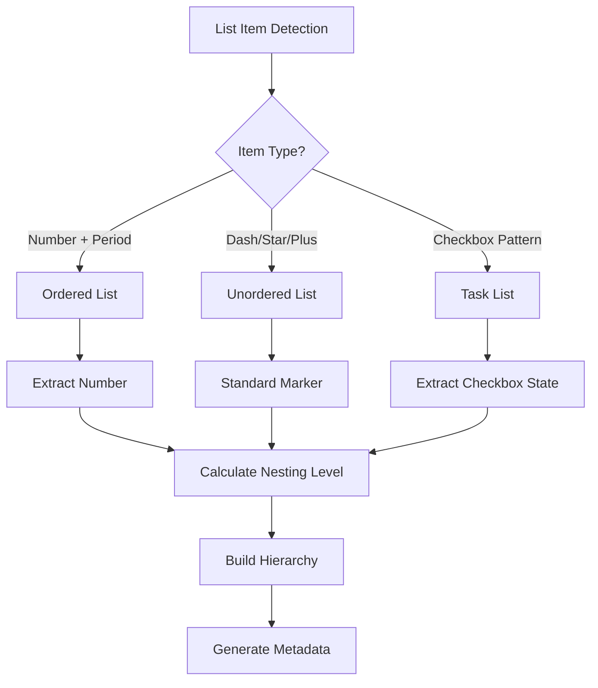
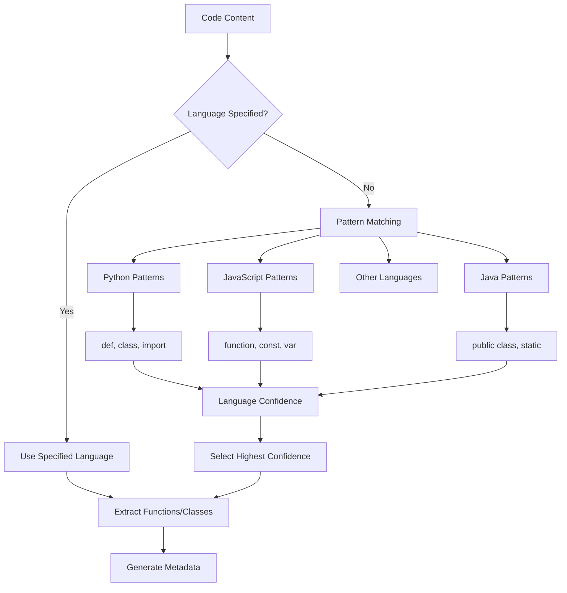
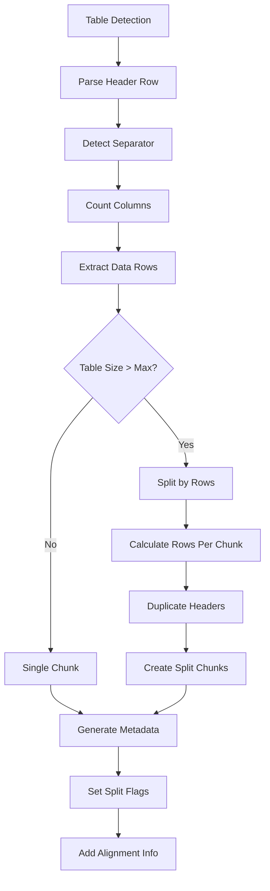
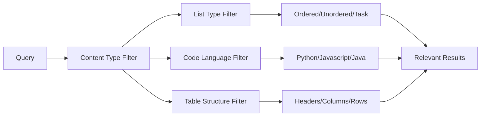
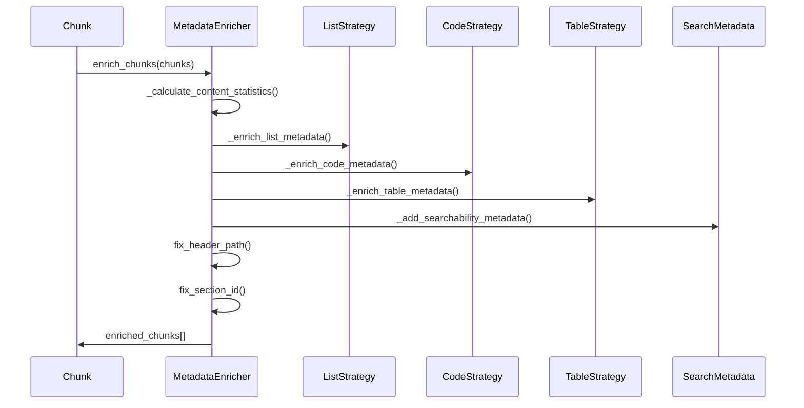
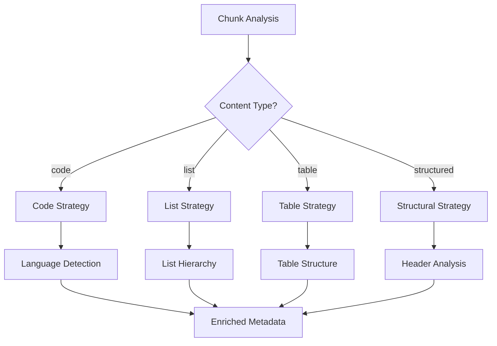

# Content-Specific Metadata Fields

<cite>
**Referenced Files in This Document**
- [metadata_enricher.py](file://markdown_chunker_legacy/chunker/components/metadata_enricher.py)
- [list_strategy.py](file://markdown_chunker_legacy/chunker/strategies/list_strategy.py)
- [code_strategy.py](file://markdown_chunker_legacy/chunker/strategies/code_strategy.py)
- [table_strategy.py](file://markdown_chunker_legacy/chunker/strategies/table_strategy.py)
- [types.py](file://markdown_chunker_v2/types.py)
- [api_documentation.md](file://tests/fixtures/real_documents/api_documentation.md)
- [tutorial.md](file://tests/fixtures/real_documents/tutorial.md)
- [blog_post.md](file://tests/fixtures/real_documents/blog_post.md)
- [test_metadata_enricher.py](file://tests/chunker/test_components/test_metadata_enricher.py)
</cite>

## Table of Contents
1. [Introduction](#introduction)
2. [List Content Fields](#list-content-fields)
3. [Code Content Fields](#code-content-fields)
4. [Table Content Fields](#table-content-fields)
5. [Field Population Examples](#field-population-examples)
6. [RAG Enhancement Benefits](#rag-enhancement-benefits)
7. [Implementation Architecture](#implementation-architecture)
8. [Best Practices](#best-practices)
9. [Troubleshooting](#troubleshooting)

## Introduction

The markdown chunker provides specialized metadata fields that enhance retrieval precision in RAG (Retrieval-Augmented Generation) systems by enabling content-type-specific processing and filtering. These fields are automatically populated during the chunking process and provide detailed information about the structural characteristics of each chunk's content.

Content-specific metadata fields fall into three main categories:
- **List fields**: For documents containing ordered or unordered lists with nesting
- **Code fields**: For code-heavy documents with programming language identification
- **Table fields**: For documents containing tabular data with structural information

These fields enable sophisticated filtering, ranking, and processing capabilities that significantly improve the effectiveness of RAG systems when dealing with diverse document types.

## List Content Fields

### Field Definitions

| Field | Type | Description | Example Values |
|-------|------|-------------|----------------|
| `list_type` | string | Primary list type: 'ordered', 'unordered', or 'mixed' | `'ordered'`, `'unordered'`, `'mixed'` |
| `ordered_item_count` | integer | Number of ordered list items | `3` |
| `unordered_item_count` | integer | Number of unordered list items | `5` |
| `task_item_count` | integer | Number of task list items (checkbox format) | `2` |
| `has_nested_lists` | boolean | Whether the list contains nested sublists | `true` |
| `nested_item_count` | integer | Number of nested list items | `4` |
| `max_nesting` | integer | Maximum nesting depth of list hierarchy | `3` |
| `start_number` | integer | Starting number for ordered lists | `1`, `10` |

### Implementation Details

The list strategy identifies and categorizes different types of list items using regular expression patterns:



**Diagram sources**
- [list_strategy.py](file://markdown_chunker_legacy/chunker/strategies/list_strategy.py#L334-L371)

### List Processing Algorithm

The list strategy employs a sophisticated hierarchy-building algorithm that maintains parent-child relationships:

1. **Pattern Matching**: Uses regex to identify list markers (`1.`, `-`, `*`, `+`, `[ ]`, `[x]`)
2. **Level Calculation**: Determines nesting depth based on indentation (2 spaces per level)
3. **Hierarchy Construction**: Builds tree structure using parent-child relationships
4. **Metadata Generation**: Populates specialized fields based on list characteristics

**Section sources**
- [list_strategy.py](file://markdown_chunker_legacy/chunker/strategies/list_strategy.py#L334-L371)
- [metadata_enricher.py](file://markdown_chunker_legacy/chunker/components/metadata_enricher.py#L212-L239)

## Code Content Fields

### Field Definitions

| Field | Type | Description | Example Values |
|-------|------|-------------|----------------|
| `language` | string | Detected programming language | `'python'`, `'javascript'`, `'java'`, `'go'` |
| `code_block_count` | integer | Number of code blocks in chunk | `2` |
| `has_syntax_highlighting` | boolean | Whether language is specified for highlighting | `true` |
| `has_imports` | boolean | Presence of import/include statements | `true` |
| `has_comments` | boolean | Presence of code comments | `true` |
| `has_inline_code` | boolean | Presence of inline code spans | `false` |
| `function_names` | array[string] | Extracted function/class names | `['hello_world', 'main']` |
| `class_names` | array[string] | Extracted class/interface names | `['MyClass', 'Handler']` |

### Language Detection

The code strategy implements intelligent language detection using multiple approaches:



**Diagram sources**
- [code_strategy.py](file://markdown_chunker_legacy/chunker/strategies/code_strategy.py#L532-L547)

### Code Extraction Process

The code strategy performs comprehensive analysis of code content:

1. **Block Detection**: Identifies fenced code blocks and inline code
2. **Language Recognition**: Matches patterns against known programming languages
3. **Function Extraction**: Uses regex patterns to identify functions and classes
4. **Metadata Enrichment**: Generates detailed code-related metadata

**Section sources**
- [code_strategy.py](file://markdown_chunker_legacy/chunker/strategies/code_strategy.py#L532-L590)
- [metadata_enricher.py](file://markdown_chunker_legacy/chunker/components/metadata_enricher.py#L177-L211)

## Table Content Fields

### Field Definitions

| Field | Type | Description | Example Values |
|-------|------|-------------|----------------|
| `row_count` | integer | Total number of data rows in table | `10` |
| `column_count` | integer | Number of columns in table | `4` |
| `has_header` | boolean | Whether table has header row | `true` |
| `has_column_alignment` | boolean | Whether table has column alignment | `true` |
| `table_row_count` | integer | Number of rows including header | `11` |
| `table_count` | integer | Number of tables in chunk | `1` |
| `is_split` | boolean | Whether table is split across chunks | `false` |
| `split_part` | integer | Part number if split | `1` |
| `total_parts` | integer | Total parts if split | `2` |

### Table Processing Algorithm

The table strategy handles complex table structures with sophisticated splitting logic:



**Diagram sources**
- [table_strategy.py](file://markdown_chunker_legacy/chunker/strategies/table_strategy.py#L293-L343)

### Table Structure Analysis

The table strategy performs detailed analysis of table characteristics:

1. **Header Detection**: Identifies header rows and separator patterns
2. **Column Analysis**: Counts columns and detects alignment markers
3. **Row Processing**: Handles data rows with proper formatting preservation
4. **Split Logic**: Implements intelligent splitting for oversized tables

**Section sources**
- [table_strategy.py](file://markdown_chunker_legacy/chunker/strategies/table_strategy.py#L293-L343)
- [metadata_enricher.py](file://markdown_chunker_legacy/chunker/components/metadata_enricher.py#L241-L267)

## Field Population Examples

### API Documentation Example

For API documentation with code blocks and structured content:

```json
{
  "content": "```python\ndef get_user(user_id):\n    \"\"\"Get user by ID.\"\"\"\n    return db.query(User).filter(User.id == user_id).first()\n```",
  "metadata": {
    "content_type": "code",
    "language": "python",
    "code_block_count": 1,
    "has_imports": true,
    "has_comments": true,
    "function_names": ["get_user"],
    "class_names": [],
    "strategy": "code"
  }
}
```

### Tutorial Example

For educational content with mixed elements:

```json
{
  "content": "1. Install dependencies\n2. Configure settings\n   - Set API keys\n   - Define endpoints",
  "metadata": {
    "content_type": "list",
    "list_type": "ordered",
    "ordered_item_count": 2,
    "unordered_item_count": 1,
    "has_nested_lists": true,
    "max_nesting": 2,
    "strategy": "list"
  }
}
```

### Blog Post Example

For technical articles with tables and code:

```json
{
  "content": "| Metric | Value | Description |\n|--------|-------|-------------|\n| Accuracy | 95% | Model performance",
  "metadata": {
    "content_type": "table",
    "row_count": 2,
    "column_count": 3,
    "has_header": true,
    "has_column_alignment": false,
    "strategy": "table"
  }
}
```

**Section sources**
- [test_metadata_enricher.py](file://tests/chunker/test_components/test_metadata_enricher.py#L131-L162)

## RAG Enhancement Benefits

### Content-Type-Specific Processing

Content-specific metadata fields enable sophisticated RAG enhancements:

#### List-Based Retrieval
- **Hierarchical Filtering**: Retrieve specific list levels or types
- **Progress Tracking**: Identify completion status in task lists
- **Step-by-Step Analysis**: Process procedural content sequentially

#### Code-Based Retrieval
- **Language-Specific Context**: Filter by programming language
- **Function-Level Precision**: Retrieve specific functions or classes
- **Import Analysis**: Understand dependencies and requirements

#### Table-Based Retrieval
- **Structured Data Access**: Query specific columns or rows
- **Alignment Preservation**: Maintain formatting for analysis
- **Split Table Handling**: Reconstruct complete tables from chunks

### Filtering Capabilities



### Ranking Enhancements

Content-specific fields enable intelligent ranking:

1. **Context Relevance**: Prioritize chunks with matching content types
2. **Completeness Score**: Reward chunks with complete structures
3. **Specificity Weighting**: Boost precision for specialized content

## Implementation Architecture

### Metadata Enrichment Pipeline

The metadata enrichment system operates in a multi-stage pipeline:



**Diagram sources**
- [metadata_enricher.py](file://markdown_chunker_legacy/chunker/components/metadata_enricher.py#L35-L67)

### Strategy Selection Logic

The system automatically selects appropriate enrichment strategies:



**Diagram sources**
- [metadata_enricher.py](file://markdown_chunker_legacy/chunker/components/metadata_enricher.py#L118-L130)

**Section sources**
- [metadata_enricher.py](file://markdown_chunker_legacy/chunker/components/metadata_enricher.py#L35-L154)

## Best Practices

### Field Utilization Guidelines

#### List Content Optimization
- Use `list_type` for content categorization
- Leverage `has_nested_lists` for hierarchical processing
- Apply `max_nesting` for depth-aware retrieval

#### Code Content Optimization
- Filter by `language` for language-specific queries
- Use `function_names` for function-level retrieval
- Consider `has_imports` for dependency analysis

#### Table Content Optimization
- Query by `column_count` for schema-aware retrieval
- Use `has_header` for structured vs. unstructured data
- Handle `is_split` for complete table reconstruction

### Performance Considerations

1. **Selective Enrichment**: Only enrich fields needed for your use case
2. **Indexing Strategy**: Create indexes on frequently queried metadata fields
3. **Caching**: Cache enrichment results for repeated queries
4. **Batch Processing**: Process multiple chunks together for efficiency

### Quality Assurance

1. **Validation**: Use the built-in validation system to ensure metadata integrity
2. **Testing**: Test with representative document samples
3. **Monitoring**: Track enrichment accuracy and performance metrics
4. **Feedback Loop**: Continuously improve detection algorithms

## Troubleshooting

### Common Issues and Solutions

#### Missing Language Detection
**Problem**: Code chunks lack language metadata
**Solution**: 
- Verify code block formatting (must use triple backticks)
- Check language specification in code fences
- Review language detection patterns

#### Incorrect List Type Classification
**Problem**: Mixed list types not properly identified
**Solution**:
- Ensure consistent list markers within chunks
- Check for nested list structure detection
- Verify indentation patterns (2 spaces per level)

#### Table Structure Problems
**Problem**: Tables not properly parsed
**Solution**:
- Verify header-separator-row ordering
- Check column alignment markers
- Ensure proper escaping of pipe characters

### Debugging Tools

The system provides comprehensive debugging capabilities:

```python
# Validation example
validation_result = enricher.validate_metadata(chunks)
if not validation_result["valid"]:
    print(f"Issues found: {validation_result['issues']}")

# Summary statistics
summary = enricher.get_metadata_summary(chunks)
print(f"Content distribution: {summary['content_types']}")
```

### Performance Monitoring

Monitor enrichment performance through:

- **Processing Time**: Track enrichment duration per chunk type
- **Accuracy Metrics**: Measure detection accuracy rates
- **Memory Usage**: Monitor memory consumption during enrichment
- **Error Rates**: Track failed enrichment attempts

**Section sources**
- [metadata_enricher.py](file://markdown_chunker_legacy/chunker/components/metadata_enricher.py#L342-L426)