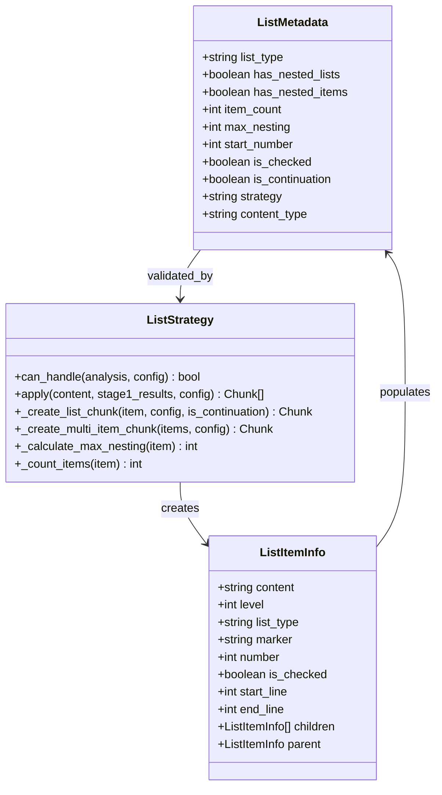
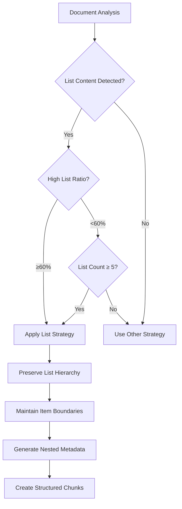
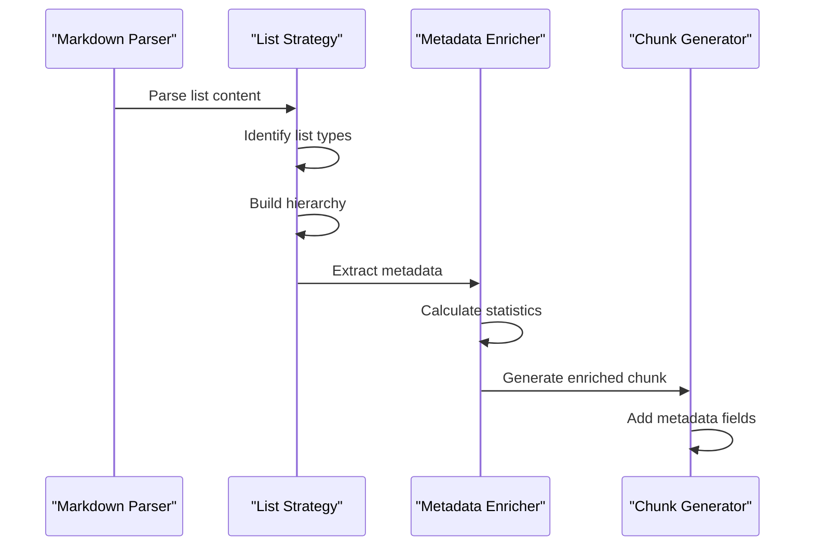

# List Content Fields

<cite>
**Referenced Files in This Document**
- [list_strategy.py](file://markdown_chunker_legacy/chunker/strategies/list_strategy.py)
- [types.py](file://markdown_chunker_legacy/chunker/types.py)
- [metadata_enricher.py](file://markdown_chunker_legacy/chunker/components/metadata_enricher.py)
- [test_metadata_filtering.py](file://tests/test_metadata_filtering.py)
- [test_list_strategy_properties.py](file://tests/chunker/test_list_strategy_properties.py)
- [tutorial.md](file://tests/fixtures/real_documents/tutorial.md)
- [list_heavy.md](file://tests/fixtures/list_heavy.md)
- [api_usage.py](file://examples/api_usage.py)
- [output-format.md](file://docs/reference/output-format.md)
</cite>

## Table of Contents
1. [Introduction](#introduction)
2. [Core List Metadata Fields](#core-list-metadata-fields)
3. [Field Definitions and Purpose](#field-definitions-and-purpose)
4. [Practical Examples](#practical-examples)
5. [RAG Enhancement Capabilities](#rag-enhancement-capabilities)
6. [Accessing List Metadata](#accessing-list-metadata)
7. [Chunking Behavior Influence](#chunking-behavior-influence)
8. [Implementation Details](#implementation-details)
9. [Best Practices](#best-practices)
10. [Troubleshooting](#troubleshooting)

## Introduction

The Python Markdown Chunker provides specialized metadata fields for list content that enable precise retrieval and filtering in RAG (Retrieval-Augmented Generation) systems. These fields capture the structural characteristics of lists, including their type, nesting complexity, and organizational patterns, enhancing the semantic understanding of document chunks.

List-specific metadata fields serve as powerful discriminators for content-based retrieval, allowing RAG systems to filter queries based on list structure, complexity levels, and content organization patterns. This capability is particularly valuable for technical documentation, tutorials, and structured content where list hierarchy carries significant meaning.

## Core List Metadata Fields

The list content fields provide comprehensive information about list structure and characteristics:



**Diagram sources**
- [list_strategy.py](file://markdown_chunker_legacy/chunker/strategies/list_strategy.py#L26-L40)
- [types.py](file://markdown_chunker_legacy/chunker/types.py#L36-L49)

**Section sources**
- [list_strategy.py](file://markdown_chunker_legacy/chunker/strategies/list_strategy.py#L620-L643)
- [types.py](file://markdown_chunker_legacy/chunker/types.py#L13-L23)

## Field Definitions and Purpose

### list_type Field

The `list_type` field identifies the fundamental nature of the list, distinguishing between different list formats and their semantic implications.

| Value | Description | Use Case | RAG Filtering |
|-------|-------------|----------|---------------|
| `"ordered"` | Numerically sequenced items | Step-by-step instructions, procedures | Filter for procedural content |
| `"unordered"` | Bulleted items | Feature lists, categories, unordered collections | Filter for feature comparisons |
| `"task"` | Checkbox-style items | Task lists, progress tracking, to-do lists | Filter for actionable content |

**Purpose**: Enables semantic filtering based on list purpose and structure. Ordered lists often represent procedural or hierarchical content, while unordered lists typically indicate feature sets or categories.

### has_nested_lists Field

The `has_nested_lists` field indicates whether the list contains other lists within its items, capturing structural complexity.

**Detection Method**: Analyzes indentation patterns and list markers to identify nested list structures. The system examines line prefixes to determine if items contain additional list hierarchies.

**RAG Impact**: Allows filtering for documents with complex organizational structures, helping users find content with specific nesting patterns or hierarchical relationships.

### has_nested_items Field

The `has_nested_items` field detects nested list items within individual list entries, identifying when a single list item contains its own sublist structure.

**Detection Logic**: Examines each list item's content for embedded list markers and indentation patterns that indicate nested content.

**Use Case**: Essential for documents where list items themselves contain detailed subcategories or examples, such as configuration options with subsections or feature descriptions with subfeatures.

**Section sources**
- [list_strategy.py](file://markdown_chunker_legacy/chunker/strategies/list_strategy.py#L624-L628)
- [metadata_enricher.py](file://markdown_chunker_legacy/chunker/components/metadata_enricher.py#L235-L236)

## Practical Examples

### Tutorial Document Example

Consider a technical tutorial with multiple list structures:

```markdown
## Installation Steps
1. Download the software
2. Install dependencies
   - Python 3.8+
   - Node.js 16+
   - Docker
3. Configure environment
   - Set environment variables
   - Create configuration files
4. Run tests

## Configuration Options
- Database settings
  - PostgreSQL
  - MySQL
  - MongoDB
- Security settings
  - Authentication
  - Authorization
  - Encryption
```

**Generated Metadata**:
```json
{
  "content_type": "list",
  "list_type": "ordered",
  "has_nested_lists": true,
  "has_nested_items": false,
  "item_count": 4,
  "max_nesting": 2,
  "start_number": 1
}
```

### Technical Specification Example

```markdown
## API Endpoints
- GET /users
  - Retrieve user list
  - Pagination support
  - Filter by role
- POST /users
  - Create new user
  - Validate input data
  - Return user ID
- PUT /users/{id}
  - Update user information
  - Partial updates supported
```

**Generated Metadata**:
```json
{
  "content_type": "list",
  "list_type": "unordered",
  "has_nested_lists": true,
  "has_nested_items": false,
  "item_count": 3,
  "max_nesting": 2
}
```

### Feature Comparison Example

```markdown
## Product Features
- Performance
  - Fast loading times
  - Low memory usage
  - Scalable architecture
- Security
  - Encryption at rest
  - Multi-factor authentication
  - Audit logging
- Usability
  - Intuitive interface
  - Keyboard shortcuts
  - Accessibility support
```

**Generated Metadata**:
```json
{
  "content_type": "list",
  "list_type": "unordered",
  "has_nested_lists": true,
  "has_nested_items": false,
  "item_count": 3,
  "max_nesting": 2
}
```

**Section sources**
- [list_heavy.md](file://tests/fixtures/list_heavy.md#L1-L53)
- [tutorial.md](file://tests/fixtures/real_documents/tutorial.md#L1-L305)

## RAG Enhancement Capabilities

### Structured Query Filtering

List metadata enables sophisticated filtering capabilities for RAG systems:

```python
# Filter for procedural content
procedural_chunks = [
    chunk for chunk in chunks 
    if chunk.metadata.get('list_type') == 'ordered'
]

# Find complex hierarchical content
complex_chunks = [
    chunk for chunk in chunks 
    if chunk.metadata.get('max_nesting', 0) > 2
]

# Retrieve task-oriented content
task_chunks = [
    chunk for chunk in chunks 
    if chunk.metadata.get('list_type') == 'task'
]
```

### Retrieval Precision Enhancement

The list metadata improves retrieval precision by:

1. **Content Type Discrimination**: Differentiating between procedural steps, feature lists, and task items
2. **Complexity Level Filtering**: Allowing users to focus on simple vs. complex organizational structures
3. **Hierarchical Depth Control**: Enabling retrieval based on nesting complexity
4. **Structure-Based Ranking**: Prioritizing chunks with specific list patterns

### Semantic Understanding Improvement

List metadata contributes to semantic understanding by:

- Capturing the organizational intent behind list structures
- Preserving hierarchical relationships within list items
- Maintaining the logical flow of procedural content
- Supporting cross-reference identification within nested structures

**Section sources**
- [test_metadata_filtering.py](file://tests/test_metadata_filtering.py#L87-L284)

## Accessing List Metadata

### Direct Chunk Access

```python
# Access list metadata from chunks
for chunk in chunks:
    if chunk.content_type == "list":
        list_type = chunk.get_metadata("list_type")
        has_nested = chunk.get_metadata("has_nested_lists")
        item_count = chunk.get_metadata("item_count")
        
        print(f"List type: {list_type}")
        print(f"Has nested lists: {has_nested}")
        print(f"Item count: {item_count}")
```

### Metadata Enrichment Access

```python
# Access enriched metadata
metadata = chunk.metadata
list_type = metadata.get("list_type")
has_nested_lists = metadata.get("has_nested_lists")
has_nested_items = metadata.get("has_nested_items")
max_nesting = metadata.get("max_nesting")
item_count = metadata.get("item_count")

# Conditional filtering based on metadata
if has_nested_lists:
    # Process complex hierarchical content
    process_nested_content(chunk)
elif list_type == "ordered":
    # Handle procedural content
    process_procedure(chunk)
else:
    # Handle feature or category content
    process_features(chunk)
```

### API Response Access

```python
# Access metadata in API responses
response = chunker.chunk(document, return_format="dict")
for chunk in response["chunks"]:
    metadata = chunk["metadata"]
    # Use metadata for filtering and ranking
    if metadata.get("list_type") == "ordered":
        # Prioritize procedural content
        prioritize_procedural(chunk)
```

**Section sources**
- [api_usage.py](file://examples/api_usage.py#L180-L210)
- [types.py](file://markdown_chunker_legacy/chunker/types.py#L191-L210)

## Chunking Behavior Influence

### Strategy Selection

The list metadata influences chunking strategy selection and behavior:



**Diagram sources**
- [list_strategy.py](file://markdown_chunker_legacy/chunker/strategies/list_strategy.py#L89-L101)

### Chunk Size and Structure

List metadata affects chunk size calculations and structure preservation:

1. **Item Atomicity**: List items are preserved as atomic units to maintain semantic integrity
2. **Hierarchy Preservation**: Nested list structures are maintained across chunk boundaries
3. **Continuation Handling**: Large lists are split with continuation markers preserving context
4. **Size Optimization**: Chunk sizes are optimized based on list complexity and item counts

### Quality Metrics

The list strategy generates quality metrics that influence chunking decisions:

- **List Type Distribution**: Analysis of ordered, unordered, and task list proportions
- **Nesting Depth**: Measurement of maximum nesting levels for complexity assessment
- **Item Density**: Calculation of items per chunk for optimal distribution
- **Continuation Rate**: Monitoring of chunk continuation usage for context preservation

**Section sources**
- [list_strategy.py](file://markdown_chunker_legacy/chunker/strategies/list_strategy.py#L819-L857)

## Implementation Details

### Metadata Population Process

The list metadata population follows a multi-stage process:



**Diagram sources**
- [list_strategy.py](file://markdown_chunker_legacy/chunker/strategies/list_strategy.py#L135-L170)
- [metadata_enricher.py](file://markdown_chunker_legacy/chunker/components/metadata_enricher.py#L219-L239)

### Field Calculation Algorithms

#### has_nested_lists Detection

The system uses regex patterns to detect nested lists:

```python
# Pattern for detecting indented list items
indented_pattern = r"^\s{2,}[-*+\d]"
indented_items = len(re.findall(indented_pattern, content, re.MULTILINE))
has_nested_lists = indented_items > 0
```

#### max_nesting Calculation

The maximum nesting level is calculated recursively:

```python
def calculate_max_nesting(item):
    if not item.children:
        return item.level
    max_child_level = max(
        calculate_max_nesting(child) for child in item.children
    )
    return max(item.level, max_child_level)
```

#### item_count Aggregation

Item counts are calculated with recursion to include all descendants:

```python
def count_items(item):
    count = 1  # Count this item
    for child in item.children:
        count += count_items(child)
    return count
```

**Section sources**
- [list_strategy.py](file://markdown_chunker_legacy/chunker/strategies/list_strategy.py#L765-L780)
- [list_strategy.py](file://markdown_chunker_legacy/chunker/strategies/list_strategy.py#L782-L799)

## Best Practices

### Configuration Optimization

Configure chunking for optimal list metadata extraction:

```python
from markdown_chunker.chunker.types import ChunkConfig

# Optimize for list-heavy documents
config = ChunkConfig(
    max_chunk_size=2048,
    list_count_threshold=3,  # Lower threshold for list detection
    list_ratio_threshold=0.4,  # Adjust based on content
    preserve_list_hierarchy=True,  # Essential for metadata accuracy
    enable_overlap=True,  # Maintains context across list splits
)
```

### Metadata Utilization Patterns

1. **Filter by List Type**: Use `list_type` for content categorization
2. **Complexity Filtering**: Use `max_nesting` for structural complexity
3. **Procedural Content**: Focus on `ordered` lists for step-by-step content
4. **Feature Discovery**: Use `unordered` lists for feature comparison

### RAG Query Optimization

Structure RAG queries to leverage list metadata:

```python
# Query for procedural content
procedural_query = {
    "list_type": "ordered",
    "min_nesting": 1,
    "max_item_count": 10
}

# Query for feature comparison
comparison_query = {
    "list_type": "unordered",
    "max_nesting": 1,
    "min_item_count": 3
}
```

### Performance Considerations

- Enable `preserve_list_hierarchy` for accurate metadata
- Use appropriate chunk sizes for list complexity
- Consider overlap settings for maintaining list context
- Monitor metadata field usage for query optimization

## Troubleshooting

### Missing List Metadata

**Problem**: List metadata fields are missing from chunks

**Causes and Solutions**:

1. **Incorrect Content Type**: Ensure chunks have `content_type: "list"`
   ```python
   # Check content type
   if chunk.content_type != "list":
       # Re-process with list strategy
       chunk.metadata["content_type"] = "list"
   ```

2. **Strategy Not Applied**: Verify list strategy was selected
   ```python
   # Check strategy
   if chunk.metadata.get("strategy") != "list":
       # Force list strategy or adjust thresholds
       config.list_ratio_threshold = 0.3
   ```

3. **Parsing Issues**: Complex list structures may not parse correctly
   ```python
   # Increase parsing tolerance
   config.preserve_list_hierarchy = True
   ```

### Inaccurate Nesting Detection

**Problem**: `has_nested_lists` or `max_nesting` values are incorrect

**Solutions**:

1. **Verify Indentation**: Ensure consistent indentation patterns
2. **Check List Markers**: Confirm proper list marker usage
3. **Adjust Thresholds**: Modify list detection thresholds
4. **Review Content**: Check for malformed list structures

### Performance Issues

**Problem**: Slow metadata extraction or large metadata overhead

**Optimization Strategies**:

1. **Selective Processing**: Only process documents with known list content
2. **Batch Processing**: Process multiple documents together
3. **Caching**: Cache metadata for repeated queries
4. **Indexing**: Create indexes on frequently queried metadata fields

**Section sources**
- [test_list_strategy_properties.py](file://tests/chunker/test_list_strategy_properties.py#L260-L307)
- [metadata_enricher.py](file://markdown_chunker_legacy/chunker/components/metadata_enricher.py#L346-L384)