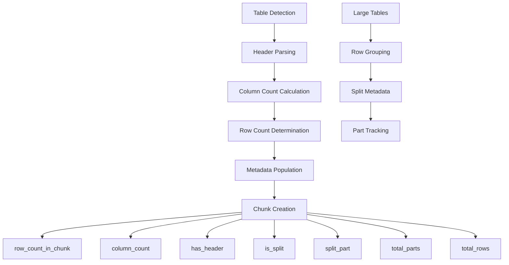
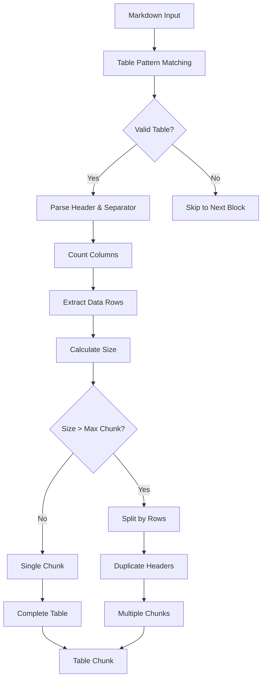

# Table Content Fields

<cite>
**Referenced Files in This Document**
- [table_strategy.py](file://markdown_chunker_legacy/chunker/strategies/table_strategy.py)
- [types.py](file://markdown_chunker_legacy/chunker/types.py)
- [rag_integration.py](file://examples/rag_integration.py)
- [basic_usage.py](file://examples/basic_usage.py)
- [test_table_strategy.py](file://tests/chunker/test_strategies/test_table_strategy.py)
- [test_table_strategy_properties.py](file://tests/chunker/test_table_strategy_properties.py)
- [large_tables.md](file://tests/fixtures/edge_cases/large_tables.md)
- [api_documentation.md](file://tests/fixtures/real_documents/api_documentation.md)
- [technical_spec.md](file://tests/fixtures/real_documents/technical_spec.md)
</cite>

## Table of Contents
1. [Introduction](#introduction)
2. [Core Table Metadata Fields](#core-table-metadata-fields)
3. [Field Definitions and Usage](#field-definitions-and-usage)
4. [Practical Examples](#practical-examples)
5. [RAG System Integration](#rag-system-integration)
6. [Accessing Table Metadata](#accessing-table-metadata)
7. [Table Chunking Strategy Behavior](#table-chunking-strategy-behavior)
8. [Performance Considerations](#performance-considerations)
9. [Best Practices](#best-practices)
10. [Troubleshooting](#troubleshooting)

## Introduction

The Markdown Chunker provides specialized metadata fields for table content that enable precise retrieval and filtering in RAG (Retrieval-Augmented Generation) systems. These fields capture essential structural information about table chunks, allowing for sophisticated queries that filter content based on table dimensions, completeness, and characteristics.

Table metadata enhances retrieval precision by providing granular control over which chunks are selected for downstream processing. This is particularly valuable in technical documentation, API specifications, and structured reports where tables represent critical data structures.

## Core Table Metadata Fields

The table-specific metadata system provides three primary fields that describe table content characteristics:

### Row Count Field (`row_count_in_chunk`)

The `row_count_in_chunk` field indicates the number of rows present in the current table chunk. This field is crucial for understanding the scope and completeness of table data within a specific chunk.

**Key Characteristics:**
- **Type**: Integer
- **Purpose**: Tracks the number of data rows in the current chunk
- **Calculation**: Dynamically calculated based on the actual content
- **Range**: 0 to unlimited (limited by chunk size constraints)

### Column Count Field (`column_count`)

The `column_count` field specifies the number of columns in the table chunk. This enables queries that filter based on table width and structural complexity.

**Key Characteristics:**
- **Type**: Integer
- **Purpose**: Indicates the number of columns in the table
- **Calculation**: Derived from the table header structure
- **Validation**: Automatically verified during table parsing

### Header Presence Field (`has_header`)

The `has_header` field identifies whether the table includes a header row, which is essential for understanding table structure and data interpretation.

**Key Characteristics:**
- **Type**: Boolean
- **Purpose**: Indicates presence of table header
- **Default**: `True` for standard tables
- **Edge Cases**: May be `False` for malformed tables

## Field Definitions and Usage

### Technical Implementation

The table metadata fields are automatically populated during the table detection and chunking process. Here's how each field is determined:



**Diagram sources**
- [table_strategy.py](file://markdown_chunker_legacy/chunker/strategies/table_strategy.py#L345-L411)

### Field Population Logic

The table strategy employs sophisticated logic to populate metadata fields accurately:

1. **Column Count Calculation**: Derived from the table header using pipe (`|`) delimiter counting
2. **Row Count Tracking**: Maintained separately for individual chunks vs. total table rows
3. **Header Detection**: Verified through structural analysis of table format
4. **Split Awareness**: Differentiated between complete tables and partial chunks

**Section sources**
- [table_strategy.py](file://markdown_chunker_legacy/chunker/strategies/table_strategy.py#L395-L411)

## Practical Examples

### API Specification Tables

API documentation often contains tables that describe endpoints, parameters, and response formats. The table metadata enables precise filtering:

```python
# Example: Filter API endpoint tables
def get_api_endpoint_tables(chunks):
    return [
        chunk for chunk in chunks
        if (chunk.metadata.get('has_table', False) and 
            chunk.metadata.get('column_count', 0) >= 3)
    ]
```

**Example Table Structure:**
| Endpoint | Method | Description | Parameters |
|----------|--------|-------------|------------|
| `/api/users` | GET | Retrieve user list | `page`, `limit` |
| `/api/users/{id}` | GET | Get specific user | `id` |

### Technical Comparison Tables

Technical specifications frequently use comparison tables that benefit from metadata-driven filtering:

```python
# Example: Filter comparison tables with specific dimensions
def get_comparison_tables(chunks, min_columns=4, max_rows=10):
    return [
        chunk for chunk in chunks
        if (chunk.metadata.get('has_table', False) and
            chunk.metadata.get('column_count', 0) >= min_columns and
            chunk.metadata.get('row_count_in_chunk', 0) <= max_rows)
    ]
```

### Structured Reports

Financial reports and data summaries often contain structured tables that require precise retrieval:

```python
# Example: Filter financial data tables
def get_financial_tables(chunks):
    return [
        chunk for chunk in chunks
        if (chunk.metadata.get('has_table', False) and
            'financial' in chunk.content.lower())
    ]
```

**Section sources**
- [api_documentation.md](file://tests/fixtures/real_documents/api_documentation.md#L247-L257)
- [technical_spec.md](file://tests/fixtures/real_documents/technical_spec.md#L247-L257)

## RAG System Integration

### Enhanced Retrieval Precision

Table metadata fields significantly improve RAG retrieval precision by enabling:

1. **Dimension-Based Filtering**: Query tables with specific column/row counts
2. **Structure-Aware Retrieval**: Differentiate between complete tables and partial chunks
3. **Content-Type Specificity**: Isolate table-containing chunks from other content types

### Vector Database Integration

The table metadata integrates seamlessly with vector databases for semantic search:

```python
# Example: Prepare table chunks for semantic search
def prepare_table_chunks_for_search(chunks):
    table_chunks = []
    for chunk in chunks:
        if chunk.metadata.get('has_table', False):
            table_chunks.append({
                'id': chunk.metadata.get('chunk_id', ''),
                'text': chunk.content,
                'metadata': {
                    'content_type': 'table',
                    'column_count': chunk.metadata.get('column_count', 0),
                    'row_count': chunk.metadata.get('row_count_in_chunk', 0),
                    'has_header': chunk.metadata.get('has_header', False),
                    'is_split': chunk.metadata.get('is_split', False)
                }
            })
    return table_chunks
```

**Section sources**
- [rag_integration.py](file://examples/rag_integration.py#L165-L170)

### Context Window Enhancement

Table metadata enables smarter context window creation for RAG systems:

```python
# Example: Create context windows around table chunks
def create_table_context_window(chunks, target_chunk_id, window_size=2):
    target_idx = next((i for i, chunk in enumerate(chunks) 
                      if chunk['id'] == target_chunk_id), None)
    
    if target_idx is None:
        return ""
    
    start_idx = max(0, target_idx - window_size)
    end_idx = min(len(chunks), target_idx + window_size + 1)
    
    context_parts = []
    for i, chunk in enumerate(chunks[start_idx:end_idx]):
        marker = ">>> TARGET <<<" if start_idx + i == target_idx else ""
        context_parts.append(f"{marker}\n{chunk['text']}\n")
    
    return "\n".join(context_parts)
```

**Section sources**
- [rag_integration.py](file://examples/rag_integration.py#L101-L136)

## Accessing Table Metadata

### Direct Metadata Access

Table metadata can be accessed through the chunk's metadata dictionary:

```python
# Example: Access table metadata
def analyze_table_chunk(chunk):
    metadata = chunk.metadata
    return {
        'has_table': 'column_count' in metadata,
        'column_count': metadata.get('column_count', 0),
        'row_count': metadata.get('row_count_in_chunk', 0),
        'has_header': metadata.get('has_header', False),
        'is_split': metadata.get('is_split', False),
        'total_rows': metadata.get('total_rows', 0)
    }
```

### Utility Functions

The chunker provides utility functions for metadata access:

```python
# Example: Using chunk methods for metadata access
def get_table_information(chunk):
    return {
        'size': chunk.size,
        'content_type': chunk.content_type,
        'column_count': chunk.get_metadata('column_count', 0),
        'row_count': chunk.get_metadata('row_count_in_chunk', 0),
        'has_header': chunk.get_metadata('has_header', False)
    }
```

**Section sources**
- [basic_usage.py](file://examples/basic_usage.py#L299-L305)

### Bulk Metadata Processing

For processing multiple chunks efficiently:

```python
# Example: Process multiple table chunks
def process_table_chunks(chunks):
    table_stats = {
        'total_tables': 0,
        'total_rows': 0,
        'avg_columns': 0,
        'avg_rows': 0,
        'split_tables': 0
    }
    
    table_chunks = [c for c in chunks if c.metadata.get('has_table', False)]
    
    if table_chunks:
        table_stats['total_tables'] = len(table_chunks)
        table_stats['total_rows'] = sum(
            c.get_metadata('row_count_in_chunk', 0) for c in table_chunks
        )
        table_stats['avg_columns'] = sum(
            c.get_metadata('column_count', 0) for c in table_chunks
        ) / len(table_chunks)
        table_stats['avg_rows'] = table_stats['total_rows'] / len(table_chunks)
        table_stats['split_tables'] = sum(
            1 for c in table_chunks if c.get_metadata('is_split', False)
        )
    
    return table_stats
```

**Section sources**
- [table_strategy.py](file://markdown_chunker_legacy/chunker/strategies/table_strategy.py#L432-L465)

## Table Chunking Strategy Behavior

### Automatic Table Detection

The table strategy automatically detects and processes tables based on markdown syntax:



**Diagram sources**
- [table_strategy.py](file://markdown_chunker_legacy/chunker/strategies/table_strategy.py#L156-L291)

### Large Table Handling

For tables exceeding the maximum chunk size, the strategy employs intelligent splitting:

1. **Row-Based Division**: Tables are split by rows while maintaining header duplication
2. **Progressive Chunking**: Each chunk receives a copy of the table header
3. **Part Tracking**: Metadata tracks which part of the table each chunk represents

### Table Integrity Preservation

The strategy ensures table integrity through several mechanisms:

- **Atomic Processing**: Complete tables are never split across chunks
- **Header Preservation**: Table headers are duplicated in each chunk containing data
- **Structure Maintenance**: Column alignments and separators are preserved

**Section sources**
- [table_strategy.py](file://markdown_chunker_legacy/chunker/strategies/table_strategy.py#L293-L343)

## Performance Considerations

### Memory Efficiency

Table metadata processing is optimized for memory efficiency:

- **Lazy Evaluation**: Metadata is populated only when needed
- **Streaming Processing**: Large tables are processed in chunks
- **Minimal Storage**: Only essential metadata is stored per chunk

### Processing Speed

The table detection algorithm is designed for optimal performance:

- **Linear Complexity**: Table detection runs in O(n) where n is the number of lines
- **Early Termination**: Invalid tables are quickly identified and skipped
- **Batch Processing**: Multiple tables can be processed simultaneously

### Scalability

The system scales effectively with document size:

- **Constant Per-Table Overhead**: Additional tables don't increase processing time exponentially
- **Memory Proportional**: Memory usage grows linearly with table count
- **Parallel Processing**: Independent tables can be processed concurrently

## Best Practices

### Configuration Optimization

Optimize table metadata usage through proper configuration:

```python
# Example: RAG-optimized configuration
config = ChunkConfig(
    max_chunk_size=2048,      # Smaller chunks for better precision
    enable_overlap=True,      # Context preservation
    overlap_size=200,        # Sufficient overlap for table context
    table_count_threshold=2, # Lower threshold for table detection
    table_ratio_threshold=0.3 # Moderate table ratio requirement
)
```

### Query Design

Design efficient queries using table metadata:

```python
# Example: Efficient table queries
def optimized_table_queries(chunks):
    # Use compound filters for better performance
    return [
        chunk for chunk in chunks
        if (chunk.metadata.get('has_table', False) and
            chunk.metadata.get('column_count', 0) >= 2 and
            chunk.metadata.get('row_count_in_chunk', 0) <= 20)
    ]
```

### Metadata Validation

Always validate metadata presence before accessing:

```python
# Example: Safe metadata access
def safe_table_analysis(chunk):
    metadata = chunk.metadata
    return {
        'has_table': 'column_count' in metadata,
        'column_count': metadata.get('column_count', 0),
        'row_count': metadata.get('row_count_in_chunk', 0),
        'estimated_total': metadata.get('total_rows', 0) if metadata.get('is_split', False) else None
    }
```

## Troubleshooting

### Common Issues

#### Missing Table Metadata

**Problem**: Table chunks lack expected metadata fields.

**Solution**: Verify table strategy activation and proper markdown syntax.

```python
# Debug table detection
def debug_table_detection(markdown):
    chunker = MarkdownChunker()
    result = chunker.chunk_with_analysis(markdown)
    
    for i, chunk in enumerate(result.chunks):
        if 'column_count' in chunk.metadata:
            print(f"Chunk {i}: Table detected - {chunk.metadata}")
        else:
            print(f"Chunk {i}: No table metadata")
```

#### Incorrect Column Count

**Problem**: Column count doesn't match expected table structure.

**Cause**: Malformed table syntax or special characters in headers.

**Solution**: Validate table syntax and handle edge cases:

```python
# Example: Robust column count calculation
def robust_column_count(header):
    # Handle special characters and escape sequences
    clean_header = header.replace('\\|', 'ESCAPE_PIPE')
    columns = clean_header.count('|') - 1
    return max(0, columns)  # Ensure non-negative count
```

#### Split Table Confusion

**Problem**: Difficulty distinguishing between complete and split tables.

**Solution**: Use the `is_split` and `total_parts` metadata:

```python
# Example: Identify complete table chunks
def get_complete_table_chunks(chunks):
    return [
        chunk for chunk in chunks
        if (chunk.metadata.get('has_table', False) and
            not chunk.metadata.get('is_split', False))
    ]
```

### Performance Optimization

#### Large Document Processing

For documents with many tables, optimize processing:

```python
# Example: Batch processing optimization
def batch_process_tables(chunks, batch_size=100):
    results = []
    for i in range(0, len(chunks), batch_size):
        batch = chunks[i:i + batch_size]
        # Process batch efficiently
        batch_results = process_table_batch(batch)
        results.extend(batch_results)
    return results
```

#### Memory Management

Monitor memory usage when processing large tables:

```python
# Example: Memory-efficient table processing
import psutil
import gc

def memory_efficient_table_processing(chunks):
    process = psutil.Process()
    initial_memory = process.memory_info().rss
    
    processed_chunks = []
    for chunk in chunks:
        if chunk.metadata.get('has_table', False):
            # Process table chunk
            processed_chunk = process_table_chunk(chunk)
            processed_chunks.append(processed_chunk)
            
            # Periodic garbage collection
            if len(processed_chunks) % 50 == 0:
                gc.collect()
                
                # Check memory usage
                current_memory = process.memory_info().rss
                if current_memory - initial_memory > 100 * 1024 * 1024:  # 100MB
                    print(f"Warning: High memory usage at {len(processed_chunks)} chunks")
    
    return processed_chunks
```

**Section sources**
- [test_table_strategy_properties.py](file://tests/chunker/test_table_strategy_properties.py#L122-L173)