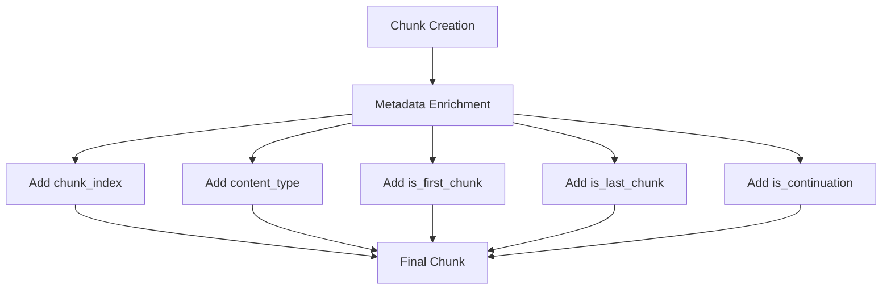
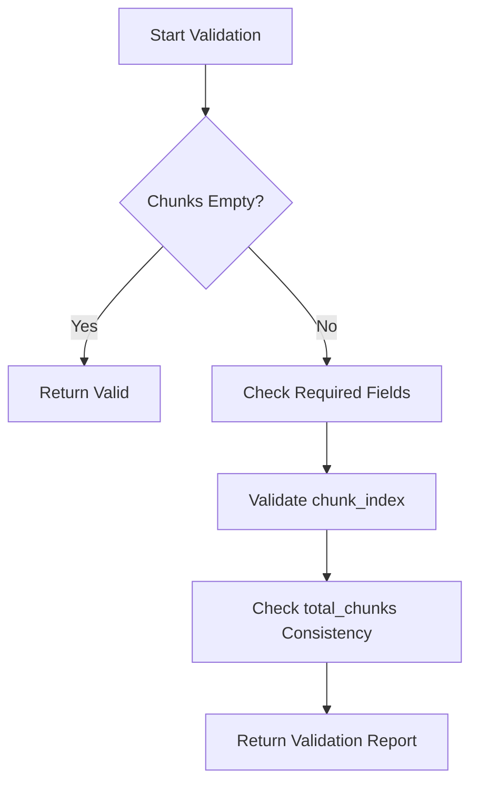

# Core Fields

<cite>
**Referenced Files in This Document**   
- [types.py](file://markdown_chunker_legacy/chunker/types.py)
- [metadata_enricher.py](file://markdown_chunker_legacy/chunker/components/metadata_enricher.py)
- [list_strategy.py](file://markdown_chunker_legacy/chunker/strategies/list_strategy.py)
- [output-format.md](file://docs/reference/output-format.md)
</cite>

## Table of Contents
1. [Introduction](#introduction)
2. [Core Metadata Fields](#core-metadata-fields)
3. [Field Usage and Examples](#field-usage-and-examples)
4. [Document Reconstruction and Context Understanding](#document-reconstruction-and-context-understanding)
5. [Validation and Maintenance](#validation-and-maintenance)
6. [Conclusion](#conclusion)

## Introduction
This document provides a comprehensive overview of the core metadata fields that are always included in chunk metadata within the markdown-chunker system. These fields play a crucial role in maintaining document structure, enabling proper reconstruction, and providing context for downstream applications such as Retrieval-Augmented Generation (RAG) systems. The metadata fields covered include chunk_index, content_type, is_first_chunk, is_last_chunk, and is_continuation, each serving specific purposes in the chunking pipeline.

**Section sources**
- [types.py](file://markdown_chunker_legacy/chunker/types.py#L13-L217)

## Core Metadata Fields

### chunk_index
The chunk_index field represents the 0-based position of a chunk within the sequence of chunks generated from a document. This field is essential for maintaining the correct order of chunks when reconstructing the original document or processing chunks in sequence.

### content_type
The content_type field classifies the type of content contained within a chunk. This classification helps downstream systems understand the nature of the content and process it appropriately. The possible values for this field are defined in the ContentType enumeration and include:
- "code": Code blocks
- "text": Plain text
- "list": List items
- "table": Table content
- "mixed": Mixed content
- "header": Headers
- "preamble": Document preamble

### is_first_chunk and is_last_chunk
These boolean fields indicate the position of a chunk within the chunk sequence. The is_first_chunk field is set to true for the first chunk in the sequence, while the is_last_chunk field is set to true for the last chunk. These fields help identify the boundaries of the document within the chunked representation.

### is_continuation
The is_continuation field indicates whether a chunk continues content from the previous chunk. This is particularly important for content that cannot be easily split, such as code blocks or tables, where maintaining context across chunks is crucial for understanding.

**Section sources**
- [types.py](file://markdown_chunker_legacy/chunker/types.py#L13-L217)
- [metadata_enricher.py](file://markdown_chunker_legacy/chunker/components/metadata_enricher.py#L92-L96)

## Field Usage and Examples

### Setting Metadata Fields
The metadata fields are primarily set by the MetadataEnricher component during the chunking process. This component adds comprehensive metadata to chunks, including the core fields discussed in this document.



**Diagram sources**
- [metadata_enricher.py](file://markdown_chunker_legacy/chunker/components/metadata_enricher.py#L92-L96)

The MetadataEnricher sets these fields based on the chunk's position in the sequence and its content characteristics. For example, the chunk_index is set based on the chunk's position in the list of chunks, while is_first_chunk and is_last_chunk are determined by comparing the chunk's position to the total number of chunks.

### Real-World Examples
In practice, these metadata fields are used extensively in various components of the system. For instance, in the list strategy, the is_continuation field is used to indicate whether a list chunk continues from a previous chunk:

```python
# Example from list_strategy.py
chunk_metadata = {
    "is_continuation": group.is_continuation,
    "content_type": "list",
    "chunk_index": position,
    "is_first_chunk": position == 0,
    "is_last_chunk": position == total_chunks - 1
}
```

Similarly, in RAG integration examples, these fields are used to provide context to the retrieval system:

```python
# Example from rag_integration.py
chunk_data = {
    'chunk_index': chunk.index,
    'content_type': chunk.metadata.get('content_type', 'text'),
    'is_first_chunk': chunk.metadata.get('is_first_chunk', False),
    'is_last_chunk': chunk.metadata.get('is_last_chunk', False),
    'is_continuation': chunk.metadata.get('is_continuation', False)
}
```

**Section sources**
- [metadata_enricher.py](file://markdown_chunker_legacy/chunker/components/metadata_enricher.py#L92-L96)
- [list_strategy.py](file://markdown_chunker_legacy/chunker/strategies/list_strategy.py#L627)
- [output-format.md](file://docs/reference/output-format.md#L156-L181)

## Document Reconstruction and Context Understanding

### Reconstructing Document Order
The core metadata fields play a vital role in reconstructing the original document order from the chunked representation. The chunk_index field provides a direct way to sort chunks back into their original sequence. This is particularly important in distributed systems where chunks might be processed out of order.

When reconstructing a document, the chunks can be sorted by their chunk_index to restore the original document structure:

```python
# Pseudocode for document reconstruction
chunks.sort(key=lambda chunk: chunk.metadata["chunk_index"])
reconstructed_document = "".join(chunk.content for chunk in chunks)
```

### Understanding Chunk Context in RAG Systems
In RAG systems, these metadata fields provide valuable context that enhances the retrieval and generation processes. The content_type field allows the system to apply different processing strategies based on the type of content, such as using specialized parsers for code chunks or applying different summarization techniques for list content.

The is_first_chunk and is_last_chunk fields help the system understand the boundaries of the document, which is useful for tasks like citation generation or determining the scope of retrieved information. The is_continuation field is particularly valuable for maintaining context across chunk boundaries, ensuring that the system can understand content that spans multiple chunks.

For example, when a query involves code comprehension, the system can use the content_type field to prioritize code chunks and use the is_continuation field to ensure that it retrieves complete code blocks even when they span multiple chunks.

**Section sources**
- [types.py](file://markdown_chunker_legacy/chunker/types.py#L13-L217)
- [metadata_enricher.py](file://markdown_chunker_legacy/chunker/components/metadata_enricher.py#L92-L96)

## Validation and Maintenance

### Validation Process
The metadata fields are validated throughout the chunking pipeline to ensure their correctness and consistency. The MetadataEnricher includes a validation method that checks the integrity of metadata across all chunks:



**Diagram sources**
- [metadata_enricher.py](file://markdown_chunker_legacy/chunker/components/metadata_enricher.py#L342-L386)

The validation process ensures that:
- Required metadata fields are present
- chunk_index values are consistent with the actual chunk positions
- total_chunks values are consistent across all chunks and match the actual count

### Maintenance Throughout the Pipeline
The metadata fields are maintained and updated throughout the chunking pipeline. The MetadataEnricher is responsible for initially setting these fields, but other components may update them as needed. For example, the overlap manager may update metadata to reflect overlap information, while the fallback manager may update strategy-related metadata when a fallback strategy is used.

The system ensures that metadata remains consistent even when chunks are modified or reprocessed. This is achieved through careful coordination between components and comprehensive validation checks at various stages of the pipeline.

**Section sources**
- [metadata_enricher.py](file://markdown_chunker_legacy/chunker/components/metadata_enricher.py#L342-L386)

## Conclusion
The core metadata fields—chunk_index, content_type, is_first_chunk, is_last_chunk, and is_continuation—are fundamental to the operation of the markdown-chunker system. These fields enable proper document reconstruction, provide valuable context for downstream applications, and ensure the integrity of the chunking process. By maintaining these fields consistently throughout the pipeline and validating their correctness, the system ensures reliable and meaningful chunked representations of Markdown documents.

The design of these metadata fields reflects a deep understanding of the requirements for document chunking in RAG systems, balancing the need for structural preservation with the practical constraints of chunk size limitations. As the system evolves, these core fields will continue to play a central role in ensuring the quality and usability of chunked content.