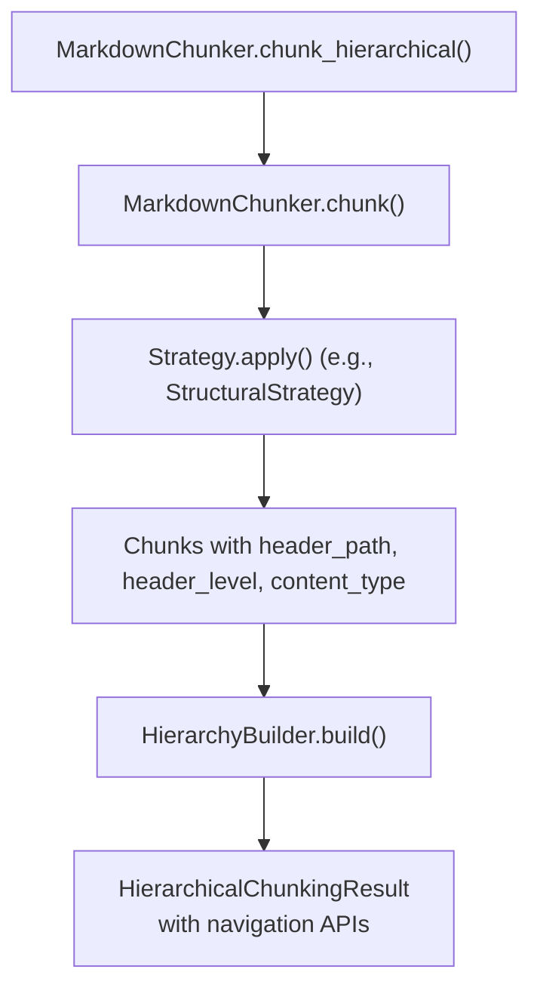
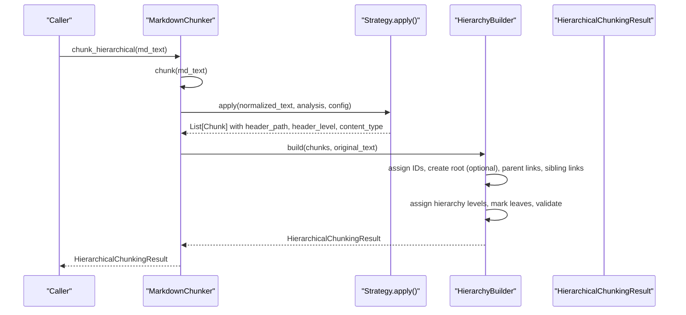
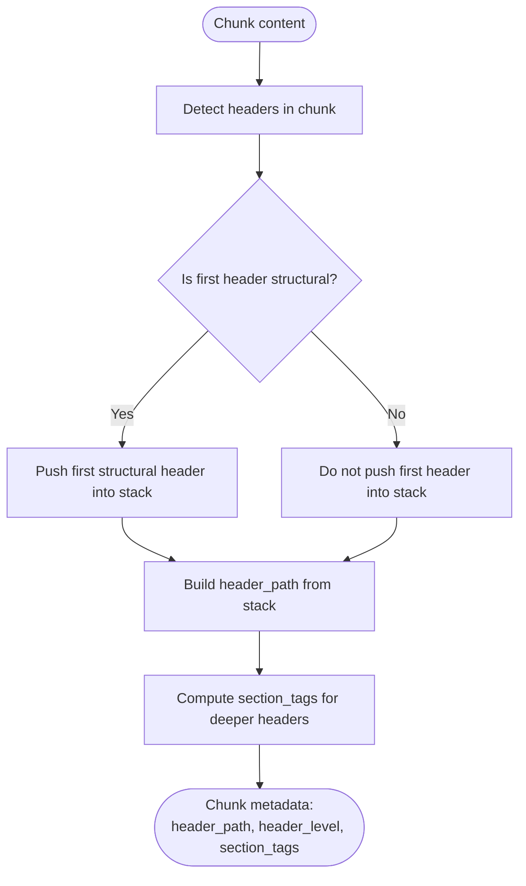
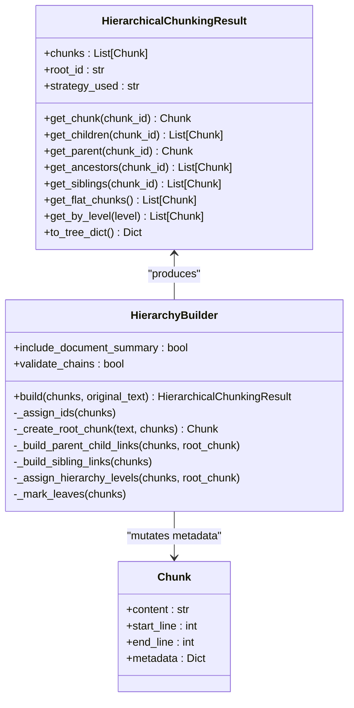
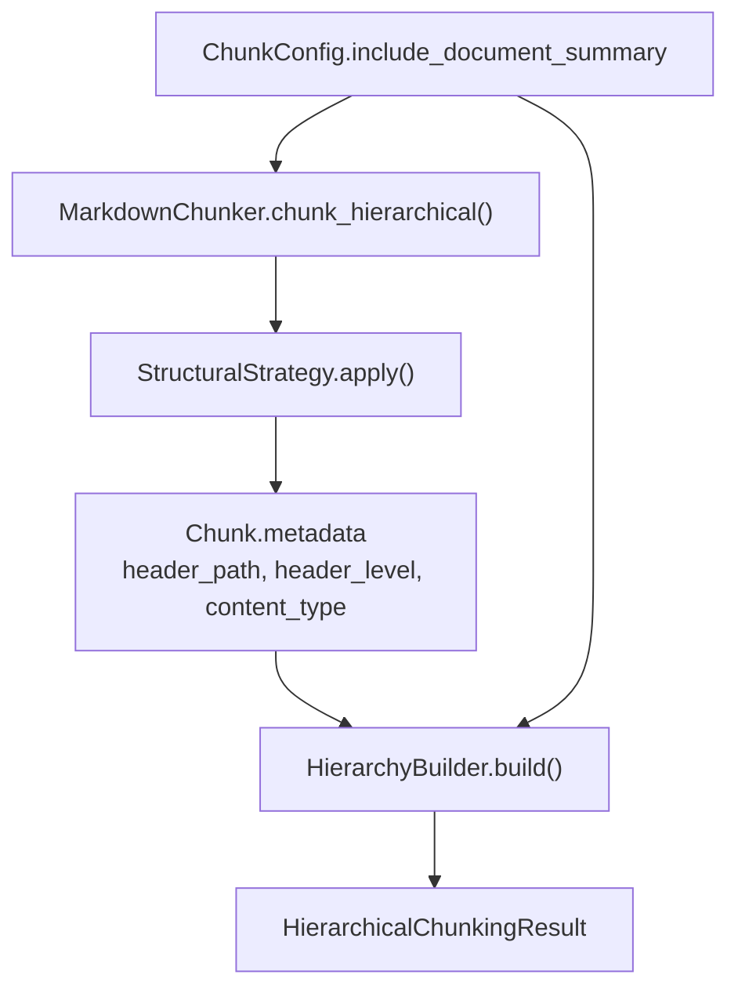

# Hierarchical Metadata Fields

<cite>
**Referenced Files in This Document**
- [hierarchy.py](file://markdown_chunker_v2/hierarchy.py)
- [types.py](file://markdown_chunker_v2/types.py)
- [chunker.py](file://markdown_chunker_v2/chunker.py)
- [structural.py](file://markdown_chunker_v2/strategies/structural.py)
- [config.py](file://markdown_chunker_v2/config.py)
- [chunk_metadata.md](file://docs/api/chunk_metadata.md)
- [types.md](file://docs/api/types.md)
- [test_hierarchical_chunking.py](file://tests/chunker/test_hierarchical_chunking.py)
- [test_hierarchical_integration.py](file://tests/integration/test_hierarchical_integration.py)
</cite>

## Table of Contents
1. [Introduction](#introduction)
2. [Project Structure](#project-structure)
3. [Core Components](#core-components)
4. [Architecture Overview](#architecture-overview)
5. [Detailed Component Analysis](#detailed-component-analysis)
6. [Dependency Analysis](#dependency-analysis)
7. [Performance Considerations](#performance-considerations)
8. [Troubleshooting Guide](#troubleshooting-guide)
9. [Conclusion](#conclusion)

## Introduction
This document explains the hierarchical metadata fields used by the markdown chunker to represent and navigate document structure. It focuses on how header-based paths are derived during chunking, how parent-child and sibling relationships are established afterward, and how navigation APIs expose a navigable tree of chunks. It also covers the configuration options that influence hierarchical behavior and the guarantees tested by unit and integration tests.

## Project Structure
The hierarchical metadata is produced by the chunking pipeline and consumed by the hierarchical builder to construct navigable relationships. The key files involved are:
- Pipeline entry point and orchestration
- Strategy that generates header_path metadata
- Types that define the Chunk and metadata fields
- Hierarchical builder that turns flat chunks into a navigable tree
- Tests that validate hierarchy correctness and navigation

**Diagram sources**
- [chunker.py](file://markdown_chunker_v2/chunker.py#L176-L207)
- [structural.py](file://markdown_chunker_v2/strategies/structural.py#L60-L175)
- [hierarchy.py](file://markdown_chunker_v2/hierarchy.py#L223-L276)

**Section sources**
- [chunker.py](file://markdown_chunker_v2/chunker.py#L176-L207)
- [structural.py](file://markdown_chunker_v2/strategies/structural.py#L60-L175)
- [hierarchy.py](file://markdown_chunker_v2/hierarchy.py#L223-L276)

## Core Components
- Chunk metadata fields used for hierarchy:
  - header_path: hierarchical path to the first header in the chunk
  - header_level: level of the first header (1–6)
  - content_type: “preamble” for pre-first-header content
  - strategy: strategy used to produce the chunk
  - chunk_index: sequential index
  - has_code: whether the chunk contains fenced code
  - Additional hierarchical fields added by the builder:
    - chunk_id: unique 8-character identifier
    - parent_id: parent chunk ID (None for root)
    - children_ids: list of child IDs
    - prev_sibling_id, next_sibling_id: ordered siblings
    - hierarchy_level: 0=document, 1=section, 2=subsection, 3=paragraph
    - is_leaf, is_root: flags indicating leaf/root nodes

- Navigation APIs exposed by HierarchicalChunkingResult:
  - get_chunk(id), get_children(id), get_parent(id)
  - get_ancestors(id), get_siblings(id)
  - get_flat_chunks(), get_by_level(level)
  - to_tree_dict()

**Section sources**
- [types.py](file://markdown_chunker_v2/types.py#L186-L242)
- [types.md](file://docs/api/types.md#L520-L549)
- [chunk_metadata.md](file://docs/api/chunk_metadata.md#L1-L83)
- [hierarchy.py](file://markdown_chunker_v2/hierarchy.py#L14-L198)

## Architecture Overview
The hierarchical metadata is layered on top of the flat chunk list produced by the chunking pipeline. The builder assigns unique IDs, constructs a root document chunk (optionally), builds parent-child relationships from header_path, establishes sibling order, assigns hierarchy levels based on tree depth, marks leaves, and validates relationships.

**Diagram sources**
- [chunker.py](file://markdown_chunker_v2/chunker.py#L176-L207)
- [structural.py](file://markdown_chunker_v2/strategies/structural.py#L60-L175)
- [hierarchy.py](file://markdown_chunker_v2/hierarchy.py#L223-L276)

## Detailed Component Analysis

### Header Path Semantics and Strategy Integration
- StructuralStrategy builds header_path by computing the contextual header stack up to the first structural header in each chunk and then optionally adding the first header if it is structural. It also computes section_tags for headers deeper than the root section in the path.
- header_path is guaranteed to reflect the hierarchy up to and including the first header in the chunk, with special handling for preamble (“/__preamble__”) and empty paths for fallback behavior.
- The builder relies on header_path to establish parent-child relationships and sibling ordering.

**Diagram sources**
- [structural.py](file://markdown_chunker_v2/strategies/structural.py#L401-L495)

**Section sources**
- [structural.py](file://markdown_chunker_v2/strategies/structural.py#L80-L175)
- [structural.py](file://markdown_chunker_v2/strategies/structural.py#L401-L495)
- [chunk_metadata.md](file://docs/api/chunk_metadata.md#L28-L79)

### Hierarchical Builder and Navigation APIs
- HierarchyBuilder.build orchestrates:
  - Assign unique IDs to all chunks
  - Optionally create a root document chunk with a meaningful title and summary
  - Build parent-child links by walking header_path segments and linking to nearest ancestor
  - Establish sibling order by grouping by parent_id and sorting by start_line
  - Assign hierarchy levels via BFS from root
  - Mark leaves and optionally validate relationships
- HierarchicalChunkingResult exposes O(1) navigation APIs backed by an internal index keyed by chunk_id.

**Diagram sources**
- [hierarchy.py](file://markdown_chunker_v2/hierarchy.py#L14-L198)
- [hierarchy.py](file://markdown_chunker_v2/hierarchy.py#L199-L738)
- [types.py](file://markdown_chunker_v2/types.py#L186-L242)

**Section sources**
- [hierarchy.py](file://markdown_chunker_v2/hierarchy.py#L223-L276)
- [hierarchy.py](file://markdown_chunker_v2/hierarchy.py#L342-L488)
- [hierarchy.py](file://markdown_chunker_v2/hierarchy.py#L489-L564)
- [hierarchy.py](file://markdown_chunker_v2/hierarchy.py#L565-L738)

### Configuration Impact on Hierarchical Behavior
- include_document_summary controls whether a root document-level chunk is created.
- max_chunk_size influences whether chunks are marked as allow_oversize and whether adaptive sizing metadata is added.
- overlap_size enables metadata-only overlap context, which does not affect header_path but impacts navigation context.

**Section sources**
- [config.py](file://markdown_chunker_v2/config.py#L92-L94)
- [chunker.py](file://markdown_chunker_v2/chunker.py#L176-L207)
- [chunker.py](file://markdown_chunker_v2/chunker.py#L208-L279)

### Metadata Fields Reference
- Core metadata fields (standard):
  - chunk_index, content_type, has_code, strategy, start_line, end_line
- Header path fields:
  - header_path, header_level, sub_headers (when multiple headers)
- Preamble handling:
  - content_type: "preamble", header_path: "/__preamble__"
- Hierarchical fields (added by builder):
  - chunk_id, parent_id, children_ids, prev_sibling_id, next_sibling_id, hierarchy_level, is_leaf, is_root

**Section sources**
- [types.py](file://markdown_chunker_v2/types.py#L186-L242)
- [chunk_metadata.md](file://docs/api/chunk_metadata.md#L1-L83)
- [types.md](file://docs/api/types.md#L520-L549)

### Validation and Edge Cases
- Unit tests verify:
  - Root creation and children presence
  - Unique chunk_id assignment
  - Bidirectional parent-child links
  - Correct sibling ordering by start_line
  - Hierarchy level mapping and leaf marking
  - get_flat_chunks returns only leaf chunks
  - get_by_level returns chunks at specific levels
  - to_tree_dict serializes safely
- Integration tests validate:
  - Corpus-level invariants (exactly one root, valid parent/child references)
  - Navigation correctness across real documents
  - Backward compatibility (chunk() without hierarchy metadata)
  - Performance characteristics for large hierarchies

**Section sources**
- [test_hierarchical_chunking.py](file://tests/chunker/test_hierarchical_chunking.py#L1-L465)
- [test_hierarchical_integration.py](file://tests/integration/test_hierarchical_integration.py#L1-L215)

## Dependency Analysis
- The chunking pipeline depends on the strategy to populate header_path and header_level.
- The hierarchical builder depends on header_path to compute parent-child relationships.
- Navigation APIs depend on metadata fields populated by both the strategy and the builder.
- Configuration toggles include_document_summary and overlap_size influence the builder’s root creation and overlap metadata respectively.

**Diagram sources**
- [structural.py](file://markdown_chunker_v2/strategies/structural.py#L60-L175)
- [hierarchy.py](file://markdown_chunker_v2/hierarchy.py#L223-L276)
- [config.py](file://markdown_chunker_v2/config.py#L92-L94)
- [chunker.py](file://markdown_chunker_v2/chunker.py#L176-L207)

**Section sources**
- [structural.py](file://markdown_chunker_v2/strategies/structural.py#L60-L175)
- [hierarchy.py](file://markdown_chunker_v2/hierarchy.py#L223-L276)
- [config.py](file://markdown_chunker_v2/config.py#L92-L94)
- [chunker.py](file://markdown_chunker_v2/chunker.py#L176-L207)

## Performance Considerations
- The builder runs in near-linear time relative to the number of chunks, with steps that are O(n) or O(n log n) due to sibling sorting.
- get_chunk, get_children, get_parent, get_siblings are O(1) lookups via an internal index keyed by chunk_id.
- to_tree_dict is safe for JSON serialization and avoids circular references by using IDs.

**Section sources**
- [hierarchy.py](file://markdown_chunker_v2/hierarchy.py#L14-L114)
- [hierarchy.py](file://markdown_chunker_v2/hierarchy.py#L166-L198)

## Troubleshooting Guide
Common issues and checks:
- Missing chunk_id: Ensure chunk_hierarchical() is used (flat chunk() does not add hierarchical metadata).
- Orphan chunks: Verify header_path values and that parent_id is set; preamble chunks link to root.
- Broken sibling chains: Confirm sibling ordering by start_line and absence of cycles.
- Unexpected hierarchy levels: Remember hierarchy_level is computed from tree depth, not header_level.
- Serialization errors: Use to_tree_dict() to export a tree-safe representation.

**Section sources**
- [test_hierarchical_integration.py](file://tests/integration/test_hierarchical_integration.py#L1-L215)
- [test_hierarchical_chunking.py](file://tests/chunker/test_hierarchical_chunking.py#L1-L465)

## Conclusion
Hierarchical metadata fields provide a robust way to represent document structure and enable efficient navigation across chunks. The strategy sets header_path and header_level, the builder enriches the flat chunk list with parent-child and sibling relationships, and the navigation APIs offer O(1) access patterns. Configuration options allow controlling root creation and overlap behavior, while tests ensure correctness and performance across varied inputs.