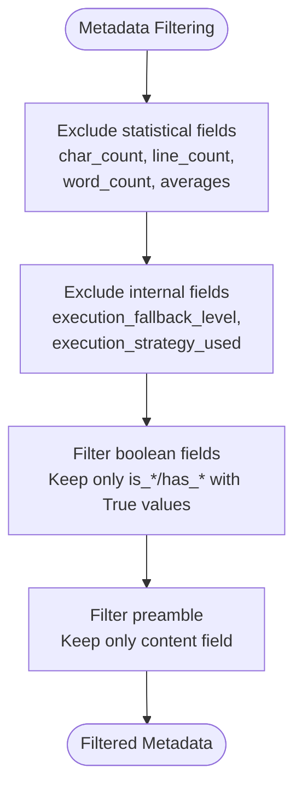
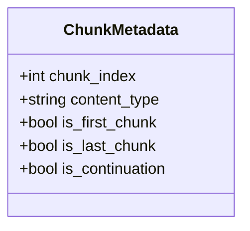
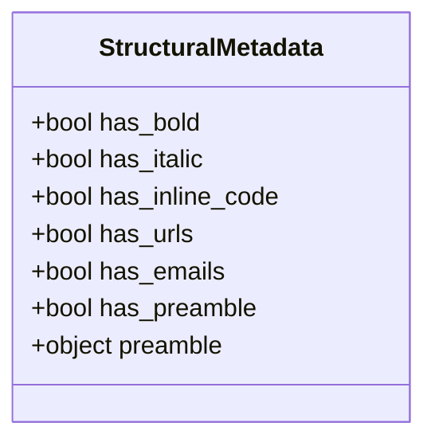
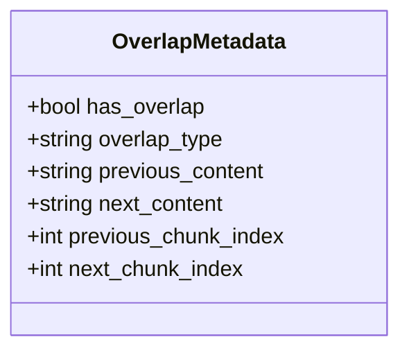
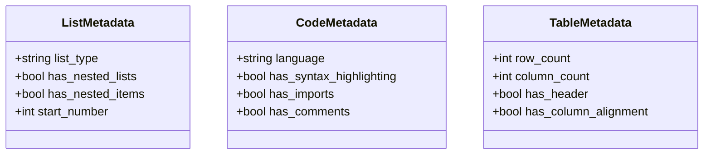
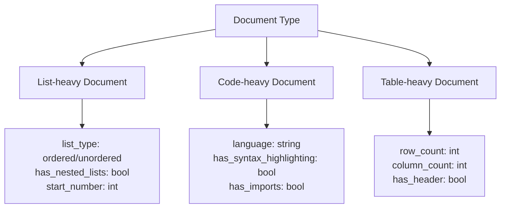
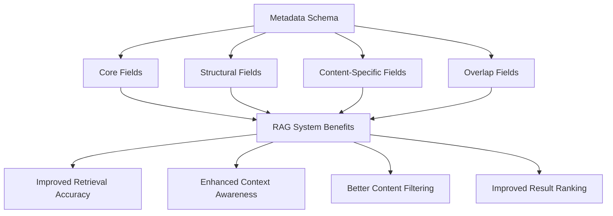

# Metadata Schema

<cite>
**Referenced Files in This Document**   
- [types.py](file://markdown_chunker_legacy/chunker/types.py)
- [metadata_enricher.py](file://markdown_chunker_legacy/chunker/components/metadata_enricher.py)
- [overlap_manager.py](file://markdown_chunker_legacy/chunker/components/overlap_manager.py)
- [test_metadata_filtering.py](file://tests/test_metadata_filtering.py)
- [markdown_chunk_tool.py](file://tools/markdown_chunk_tool.py)
- [output-format.md](file://docs/reference/output-format.md)
- [basic_usage.py](file://examples/basic_usage.py)
- [rag_integration.py](file://examples/rag_integration.py)
</cite>

## Table of Contents
1. [Introduction](#introduction)
2. [Filtering Strategy](#filtering-strategy)
3. [Core Fields](#core-fields)
4. [Structural Fields](#structural-fields)
5. [Overlap Fields](#overlap-fields)
6. [Content-Specific Fields](#content-specific-fields)
7. [Examples](#examples)
8. [RAG Retrieval Enhancement](#rag-retrieval-enhancement)

## Introduction
The metadata schema used in chunking results is designed to provide rich contextual information about each chunk while optimizing for Retrieval-Augmented Generation (RAG) systems. This schema includes various fields that describe the content, structure, and relationships between chunks. The metadata is filtered to include only fields that are useful for RAG retrieval, excluding statistical and internal fields that do not contribute to retrieval quality. The schema supports different content types including lists, code blocks, and tables, with specific fields for each type.

**Section sources**
- [types.py](file://markdown_chunker_legacy/chunker/types.py#L1-L1080)
- [output-format.md](file://docs/reference/output-format.md#L1-L107)

## Filtering Strategy
The metadata filtering strategy is designed to include only fields that are useful for RAG systems while excluding statistical and internal fields that do not contribute to retrieval quality. The filtering process removes fields that are not semantically meaningful for retrieval purposes.

Statistical fields such as character count, line count, word count, and various averages are excluded from the final metadata as they do not help with retrieval. Similarly, internal execution fields like execution_fallback_level, execution_fallback_used, and execution_strategy_used are excluded as they are implementation details not relevant to RAG systems.

Boolean fields prefixed with "is_" or "has_" are included only when their value is True. This sparse representation reduces metadata size while preserving semantic meaning. For example, if a chunk does not have bold text, the "has_bold" field is omitted rather than included with a False value.

Preamble metadata is filtered to keep only the content field, removing internal fields like char_count, line_count, has_metadata, and metadata_fields. This ensures that only the actual preamble text is available for retrieval while discarding implementation-specific details.

**Diagram sources**
- [test_metadata_filtering.py](file://tests/test_metadata_filtering.py#L42-L74)
- [markdown_chunk_tool.py](file://tools/markdown_chunk_tool.py#L43-L59)

**Section sources**
- [test_metadata_filtering.py](file://tests/test_metadata_filtering.py#L42-L121)
- [markdown_chunk_tool.py](file://tools/markdown_chunk_tool.py#L43-L71)

## Core Fields
The core fields are always included in the metadata and provide fundamental information about each chunk. These fields are essential for understanding the chunk's position and role within the overall document structure.

The chunk_index field indicates the position of the chunk in the sequence of chunks, starting from 0. This allows for reconstructing the original document order when needed. The content_type field specifies the primary type of content in the chunk, with common values including "code", "text", "list", "table", and "mixed".

The is_first_chunk and is_last_chunk boolean fields indicate whether the chunk is the first or last in the sequence, respectively. These fields help identify boundary conditions and are always included when true. The is_continuation field indicates whether the chunk continues content from a previous chunk, which is useful for understanding content flow.

**Diagram sources**
- [types.py](file://markdown_chunker_legacy/chunker/types.py#L36-L300)
- [test_metadata_filtering.py](file://tests/test_metadata_filtering.py#L123-L155)

**Section sources**
- [types.py](file://markdown_chunker_legacy/chunker/types.py#L36-L300)
- [test_metadata_filtering.py](file://tests/test_metadata_filtering.py#L123-L155)

## Structural Fields
Structural fields indicate semantic features of the content and help identify formatting and structural elements within the chunk. These fields are prefixed with "has_" and are included only when the corresponding feature is present.

Formatting indicators include has_bold, has_italic, and has_inline_code, which detect the presence of formatted text within the chunk. These fields help identify emphasis and code elements that may be important for retrieval. Link indicators include has_urls and has_emails, which detect hyperlinks and email addresses in the content.

The has_preamble field indicates whether the chunk contains preamble content, with the actual preamble text stored in the preamble.content field. This allows for identifying introductory content that may provide context for the rest of the document.

**Diagram sources**
- [metadata_enricher.py](file://markdown_chunker_legacy/chunker/components/metadata_enricher.py#L301-L339)
- [output-format.md](file://docs/reference/output-format.md#L77-L81)

**Section sources**
- [metadata_enricher.py](file://markdown_chunker_legacy/chunker/components/metadata_enricher.py#L301-L339)
- [output-format.md](file://docs/reference/output-format.md#L77-L81)

## Overlap Fields
Overlap fields are included when overlap is enabled and provide information about the overlapping content between adjacent chunks. This overlap helps maintain context and improve retrieval quality by ensuring that related content is not split across chunk boundaries.

The has_overlap field indicates whether the chunk has overlapping content with adjacent chunks. When overlap is enabled, this field is included with a True value. The overlap_type field specifies the type of overlap, with values such as "prefix" indicating that the overlap is at the beginning of the chunk.

In the metadata mode, overlap information is stored in previous_content and next_content fields rather than being merged into the chunk content. This preserves the clean separation between core content and contextual overlap while making the context available for retrieval systems.

**Diagram sources**
- [overlap_manager.py](file://markdown_chunker_legacy/chunker/components/overlap_manager.py#L343-L391)
- [test_metadata_filtering.py](file://tests/test_metadata_filtering.py#L83-L94)

**Section sources**
- [overlap_manager.py](file://markdown_chunker_legacy/chunker/components/overlap_manager.py#L343-L391)
- [test_metadata_filtering.py](file://tests/test_metadata_filtering.py#L83-L94)

## Content-Specific Fields
Content-specific fields provide detailed information about particular content types such as lists, code blocks, and tables. These fields are included only when the corresponding content type is present in the chunk.

For lists, the list_type field indicates whether the list is ordered, unordered, or a task list. The has_nested_lists field indicates whether the list contains nested lists, which helps identify complex list structures. Additional list-specific fields may include start_number for ordered lists.

For code blocks, the language field specifies the programming language, such as "python", "javascript", or "rust". The has_syntax_highlighting field indicates whether syntax highlighting is applied, which is typically determined by the presence of a language specification in the code fence.

For tables, the row_count and column_count fields specify the dimensions of the table. The has_header field indicates whether the table has a header row, which helps distinguish between data tables and other table-like structures.

**Diagram sources**
- [metadata_enricher.py](file://markdown_chunker_legacy/chunker/components/metadata_enricher.py#L212-L239)
- [metadata_enricher.py](file://markdown_chunker_legacy/chunker/components/metadata_enricher.py#L177-L210)
- [metadata_enricher.py](file://markdown_chunker_legacy/chunker/components/metadata_enricher.py#L241-L265)
- [output-format.md](file://docs/reference/output-format.md#L88-L101)

**Section sources**
- [metadata_enricher.py](file://markdown_chunker_legacy/chunker/components/metadata_enricher.py#L212-L265)
- [output-format.md](file://docs/reference/output-format.md#L88-L101)

## Examples
The metadata schema is demonstrated through various examples that show how different document types generate specific metadata fields. These examples illustrate the practical application of the schema in real-world scenarios.

For a list-heavy document, the metadata includes list_type (e.g., "ordered"), has_nested_lists (True if nested lists are present), and start_number (the starting number for ordered lists). The structural fields may include has_bold or has_italic if list items contain formatted text.

For code-heavy documents, the metadata includes language (e.g., "python"), has_syntax_highlighting (True when language is specified), and potentially has_imports or has_comments. The content_type is set to "code", and the chunk may have a larger size due to code block preservation.

For table-heavy documents, the metadata includes row_count, column_count, and has_header. Additional fields like has_column_alignment may indicate whether the table has alignment specifications. The content_type is set to "table", and the chunk preserves the complete table structure.

**Diagram sources**
- [basic_usage.py](file://examples/basic_usage.py#L220-L251)
- [rag_integration.py](file://examples/rag_integration.py#L309-L327)

**Section sources**
- [basic_usage.py](file://examples/basic_usage.py#L220-L364)
- [rag_integration.py](file://examples/rag_integration.py#L309-L432)

## RAG Retrieval Enhancement
The metadata schema enhances retrieval in RAG systems by providing semantic context that improves search accuracy and relevance. The filtered metadata focuses on fields that contribute directly to retrieval quality while eliminating noise from statistical and internal fields.

The core fields enable reconstruction of document structure and identification of chunk relationships. The chunk_index, is_first_chunk, and is_last_chunk fields help maintain document order, while is_continuation indicates content flow across chunks. This structural awareness allows RAG systems to better understand context and relationships.

Structural fields act as semantic indicators that help identify important content features. Formatting indicators like has_bold and has_italic can signal emphasis, while has_urls and has_emails identify link-rich content. These fields enable content-based filtering and ranking in retrieval systems.

Content-specific fields allow for targeted retrieval based on content type. Systems can filter for code chunks using the language field, find tables using row_count and column_count, or identify list structures with list_type. This enables specialized processing and presentation of different content types.

Overlap fields provide contextual continuity between chunks, reducing the risk of missing important information at chunk boundaries. The previous_content and next_content fields in metadata mode offer explicit context without modifying the core content, allowing retrieval systems to consider surrounding context when ranking results.

**Diagram sources**
- [rag_integration.py](file://examples/rag_integration.py#L139-L154)
- [rag_integration.py](file://examples/rag_integration.py#L353-L408)

**Section sources**
- [rag_integration.py](file://examples/rag_integration.py#L13-L51)
- [rag_integration.py](file://examples/rag_integration.py#L139-L408)