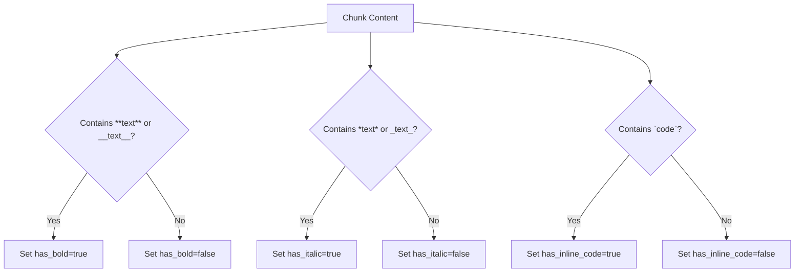
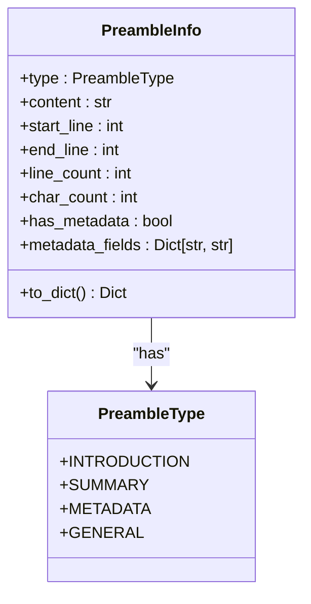
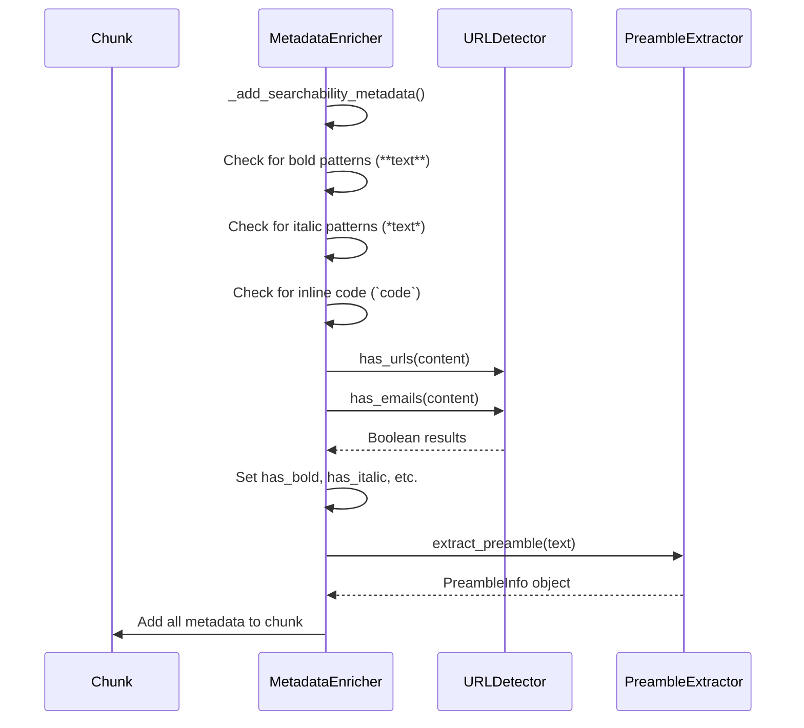
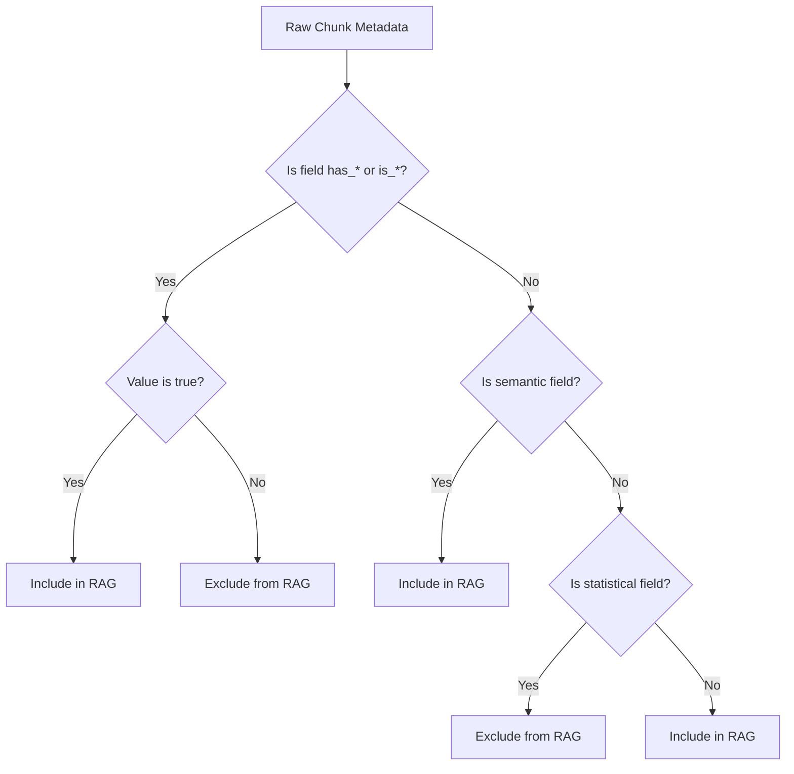

# Structural Fields

<cite>
**Referenced Files in This Document**   
- [metadata_enricher.py](file://markdown_chunker_legacy/chunker/components/metadata_enricher.py)
- [preamble.py](file://markdown_chunker_legacy/parser/preamble.py)
- [url_detector.py](file://markdown_chunker_legacy/chunker/url_detector.py)
- [types.py](file://markdown_chunker_legacy/chunker/types.py)
- [output-format.md](file://docs/reference/output-format.md)
- [test_metadata_filtering.py](file://tests/test_metadata_filtering.py)
</cite>

## Table of Contents
1. [Introduction](#introduction)
2. [Formatting Detection Fields](#formatting-detection-fields)
3. [Link Identification Fields](#link-identification-fields)
4. [Preamble Detection and Structure](#preamble-detection-and-structure)
5. [Content Analysis and Population](#content-analysis-and-population)
6. [RAG Retrieval Enhancement](#rag-retrieval-enhancement)
7. [Validation and Downstream Processing](#validation-and-downstream-processing)

## Introduction
This document details the structural metadata fields used in the Markdown chunker system to preserve semantic context during document processing. These fields enhance retrieval in RAG (Retrieval-Augmented Generation) systems by maintaining important formatting, linking, and structural information that would otherwise be lost during chunking. The metadata fields serve as semantic indicators that help downstream applications understand the nature and context of content fragments.

**Section sources**
- [output-format.md](file://docs/reference/output-format.md#L77-L107)

## Formatting Detection Fields
The formatting detection fields identify the presence of specific Markdown formatting elements within chunks, preserving information about text emphasis and inline code usage.

### has_bold Field
The `has_bold` field indicates whether a chunk contains bold text formatting using either `**text**` or `__text__` syntax. This boolean flag helps identify chunks with emphasized content that may be important for understanding document semantics.

### has_italic Field
The `has_italic` field indicates whether a chunk contains italic text formatting using either `*text*` or `_text_` syntax. This field preserves information about subtle emphasis in the original document.

### has_inline_code Field
The `has_inline_code` field indicates whether a chunk contains inline code formatting using backticks (`` `code` ``). This is distinct from code blocks and helps identify technical terms, commands, or variables within prose.



**Diagram sources**
- [metadata_enricher.py](file://markdown_chunker_legacy/chunker/components/metadata_enricher.py#L331-L337)

**Section sources**
- [metadata_enricher.py](file://markdown_chunker_legacy/chunker/components/metadata_enricher.py#L331-L337)
- [output-format.md](file://docs/reference/output-format.md#L78)

## Link Identification Fields
The link identification fields detect various types of hyperlinks and email addresses within chunks, preserving connectivity information that is crucial for document understanding.

### has_urls Field
The `has_urls` field indicates whether a chunk contains any URLs, including HTTP/HTTPS links, www addresses, or Markdown links `[text](url)`. This field uses comprehensive pattern matching to identify various URL formats.

### has_emails Field
The `has_emails` field indicates whether a chunk contains email addresses in standard format (user@domain.com). This helps identify chunks with contact information or references to individuals.

```mermaid
flowchart TD
A[Chunk Content] --> B{Contains http:// or https://?}
B --> |Yes| C[Set has_urls=true]
A --> D{Contains www.?}
D --> |Yes| E[Set has_urls=true]
A --> F{Contains [text](url)?}
F --> |Yes| G[Set has_urls=true]
A --> H{Contains user@domain.com pattern?}
H --> |Yes| I[Set has_emails=true]
C --> J{Any URL type found?}
E --> J
G --> J
J --> |Yes| K[has_urls=true]
J --> |No| L[has_urls=false]
I --> |Yes| M[has_emails=true]
I --> |No| N[has_emails=false]
```

**Diagram sources**
- [metadata_enricher.py](file://markdown_chunker_legacy/chunker/components/metadata_enricher.py#L320-L327)
- [url_detector.py](file://markdown_chunker_legacy/chunker/url_detector.py#L34-L40)

**Section sources**
- [metadata_enricher.py](file://markdown_chunker_legacy/chunker/components/metadata_enricher.py#L320-L327)
- [url_detector.py](file://markdown_chunker_legacy/chunker/url_detector.py#L34-L40)
- [output-format.md](file://docs/reference/output-format.md#L79)

## Preamble Detection and Structure
The preamble detection system identifies and structures content that appears before the first header in a document, typically containing metadata, introductions, or summaries.

### has_preamble Field
The `has_preamble` field indicates whether a chunk contains or is associated with preamble content from the original document. This boolean flag helps identify chunks that include introductory material.

### preamble Field Structure
When present, the `preamble` field contains a structured object with the following properties:
- `content`: The actual text content of the preamble
- `type`: The detected type of preamble (metadata, summary, introduction, or general)
- `start_line` and `end_line`: Line number boundaries in the original document
- `line_count` and `char_count`: Size metrics
- `has_metadata`: Whether the preamble contains structured metadata fields
- `metadata_fields`: Dictionary of key-value pairs extracted from metadata-style preamble



**Diagram sources**
- [preamble.py](file://markdown_chunker_legacy/parser/preamble.py#L32-L76)
- [preamble.py](file://markdown_chunker_legacy/parser/preamble.py#L23-L30)

**Section sources**
- [preamble.py](file://markdown_chunker_legacy/parser/preamble.py#L32-L76)
- [core.py](file://markdown_chunker_legacy/chunker/core.py#L493)
- [output-format.md](file://docs/reference/output-format.md#L80-L81)

## Content Analysis and Population
The structural metadata fields are populated during content analysis through systematic scanning and pattern matching of chunk content.

### Population Process
The metadata enrichment process analyzes each chunk's content to detect formatting, links, and structural elements:

1. **Formatting Detection**: Regular expressions scan for bold, italic, and inline code patterns
2. **Link Detection**: Comprehensive URL and email pattern matching is applied
3. **Preamble Association**: The first chunk inherits preamble information if present
4. **Metadata Aggregation**: All detected features are compiled into the chunk's metadata dictionary

The `MetadataEnricher` component is responsible for this analysis, using the `_add_searchability_metadata` method to populate formatting and link fields, and the `PreambleExtractor` to handle preamble-related metadata.



**Diagram sources**
- [metadata_enricher.py](file://markdown_chunker_legacy/chunker/components/metadata_enricher.py#L301-L339)
- [url_detector.py](file://markdown_chunker_legacy/chunker/url_detector.py#L88-L109)
- [preamble.py](file://markdown_chunker_legacy/parser/preamble.py#L122-L178)

**Section sources**
- [metadata_enricher.py](file://markdown_chunker_legacy/chunker/components/metadata_enricher.py#L301-L339)
- [url_detector.py](file://markdown_chunker_legacy/chunker/url_detector.py#L88-L109)
- [preamble.py](file://markdown_chunker_legacy/parser/preamble.py#L122-L178)

## RAG Retrieval Enhancement
The structural metadata fields significantly enhance retrieval in RAG systems by preserving semantic context that would otherwise be lost during chunking.

### Context Preservation
These fields maintain important document characteristics:
- Formatting indicators preserve emphasis and code context
- Link indicators maintain connectivity information
- Preamble metadata preserves introductory content and document metadata

### Filtering Strategy
During RAG processing, metadata is filtered to include only semantically valuable fields:
- Boolean fields (has_*, is_*) are included only when true
- Statistical fields (counts, sizes) are excluded as they don't aid retrieval
- Semantic fields (content_type, language, preamble) are preserved
- Preamble content is reduced to just the text content for efficiency

This selective filtering ensures that the metadata accompanying chunks is concise yet rich in semantic value, improving retrieval relevance without adding unnecessary noise.



**Diagram sources**
- [test_metadata_filtering.py](file://tests/test_metadata_filtering.py#L123-L284)

**Section sources**
- [test_metadata_filtering.py](file://tests/test_metadata_filtering.py#L123-L284)

## Validation and Downstream Processing
The structural metadata fields undergo validation and play crucial roles in downstream processing and rendering.

### Validation Process
The metadata fields are validated through several mechanisms:
- Type checking ensures boolean fields contain boolean values
- Content analysis verifies that detected features actually exist
- Cross-component validation ensures consistency between different analysis results
- Boundary checks validate line numbers and character counts

The validation process ensures metadata accuracy and prevents erroneous flags from being set.

### Downstream Processing Roles
These fields serve multiple purposes in downstream applications:
- **Rendering**: Formatting indicators guide proper text rendering with appropriate styling
- **Search Relevance**: Link and formatting indicators improve search result ranking
- **Content Classification**: Metadata helps categorize chunks by content type
- **Navigation**: Preamble information aids in document structure understanding
- **Accessibility**: Semantic context improves content interpretation for assistive technologies

The structural metadata fields thus form a critical bridge between raw text content and meaningful semantic understanding in RAG systems.

**Section sources**
- [metadata_enricher.py](file://markdown_chunker_legacy/chunker/components/metadata_enricher.py#L342-L386)
- [test_metadata_filtering.py](file://tests/test_metadata_filtering.py#L123-L284)
- [preamble.py](file://markdown_chunker_legacy/parser/preamble.py#L82-L84)