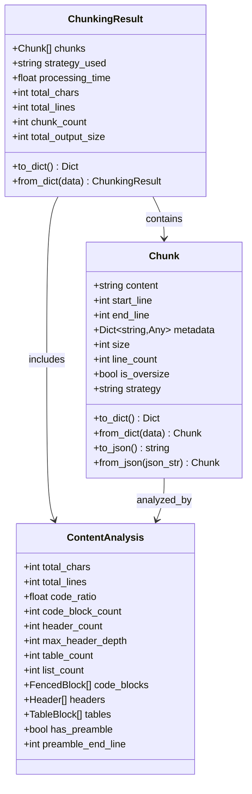

# Output Format Specification

<cite>
**Referenced Files in This Document**
- [markdown_chunker_v2/types.py](file://markdown_chunker_v2/types.py)
- [baseline.json](file://baseline.json)
- [basic_usage.py](file://examples/basic_usage.py)
- [api_usage.py](file://examples/api_usage.py)
- [save_baseline.py](file://scripts/save_baseline.py)
- [compare_baseline.py](file://scripts/compare_baseline.py)
- [metadata.json](file://tests/fixtures/real_documents/metadata.json)
- [code_heavy.md](file://tests/fixtures/code_heavy.md)
- [mixed.md](file://tests/fixtures/mixed.md)
- [structural.md](file://tests/fixtures/structural.md)
- [validator.py](file://markdown_chunker_v2/validator.py)
</cite>

## Table of Contents
1. [Introduction](#introduction)
2. [Core Data Structures](#core-data-structures)
3. [Chunk Object Format](#chunk-object-format)
4. [ChunkingResult Object Format](#chunkingresult-object-format)
5. [Metadata Schema](#metadata-schema)
6. [Baseline.json Format](#baselinejson-format)
7. [Output Examples](#output-examples)
8. [Serialization and Deserialization](#serialization-and-deserialization)
9. [Data Integrity Guarantees](#data-integrity-guarantees)
10. [Quality Assurance](#quality-assurance)
11. [Downstream Integration](#downstream-integration)

## Introduction

The Dify Markdown Chunker produces structured output in JSON format designed for compatibility with RAG (Retrieval-Augmented Generation) systems and downstream applications. The output format emphasizes semantic preservation, metadata richness, and data integrity while maintaining compatibility with Dify's knowledge pipeline UI.

The chunker generates two primary output formats:
- **Object-based format**: Native Python objects with rich metadata
- **JSON-compatible format**: String arrays for UI compatibility

## Core Data Structures

The chunker's output is built around three fundamental data structures that work together to provide comprehensive chunking results.



**Diagram sources**
- [markdown_chunker_v2/types.py](file://markdown_chunker_v2/types.py#L100-L272)

**Section sources**
- [markdown_chunker_v2/types.py](file://markdown_chunker_v2/types.py#L100-L272)

## Chunk Object Format

The `Chunk` object represents a single segment of the original markdown document with comprehensive metadata.

### Basic Structure

| Field | Type | Description | Constraints |
|-------|------|-------------|-------------|
| `content` | string | The actual text content of the chunk | Non-empty, UTF-8 encoded |
| `start_line` | integer | Starting line number (1-indexed) | ≥ 1 |
| `end_line` | integer | Ending line number (1-indexed) | ≥ start_line |
| `metadata` | dictionary | Additional metadata about the chunk | Optional, can be empty |

### Properties and Methods

The Chunk object provides several computed properties:

| Property | Type | Description |
|----------|------|-------------|
| `size` | integer | Character count of content |
| `line_count` | integer | Number of lines in content |
| `is_oversize` | boolean | Whether chunk exceeds max size with allow_oversize flag |
| `strategy` | string | Strategy used to create this chunk |

### Serialization Methods

The Chunk object supports bidirectional serialization:

```python
# Dictionary format
chunk_dict = chunk.to_dict()

# JSON format  
chunk_json = chunk.to_json()

# From dictionary
restored_chunk = Chunk.from_dict(chunk_dict)

# From JSON
restored_chunk = Chunk.from_json(chunk_json)
```

**Section sources**
- [markdown_chunker_v2/types.py](file://markdown_chunker_v2/types.py#L100-L187)

## ChunkingResult Object Format

The `ChunkingResult` object encapsulates the complete result of a chunking operation, including all chunks and associated metadata.

### Core Fields

| Field | Type | Description |
|-------|------|-------------|
| `chunks` | List[Chunk] | Array of chunk objects |
| `strategy_used` | string | Selected chunking strategy |
| `processing_time` | float | Processing duration in seconds |
| `total_chars` | integer | Original document character count |
| `total_lines` | integer | Original document line count |

### Statistical Properties

| Property | Type | Description |
|----------|------|-------------|
| `chunk_count` | integer | Number of chunks produced |
| `total_output_size` | integer | Sum of all chunk sizes |

### Advanced Fields

| Field | Type | Description |
|-------|------|-------------|
| `fallback_used` | boolean | Whether fallback strategy was used |
| `fallback_level` | integer | Level of fallback strategy (1-4) |
| `errors` | List[string] | Error messages encountered |
| `warnings` | List[string] | Warning messages generated |

### Serialization Format

```python
# Complete result serialization
result_dict = result.to_dict()

# Statistics-only access
statistics = {
    "total_chunks": result.chunk_count,
    "total_size": result.total_output_size,
    "avg_size": result.total_output_size / result.chunk_count if result.chunks else 0
}
```

**Section sources**
- [markdown_chunker_v2/types.py](file://markdown_chunker_v2/types.py#L240-L272)

## Metadata Schema

The metadata field within each chunk contains rich contextual information that enables downstream applications to understand and process the chunk effectively.

### Content Type Detection

| Field | Type | Description |
|-------|------|-------------|
| `content_type` | string | Detected content type (code/text/list/table/mixed) |
| `has_code` | boolean | Presence of code blocks |
| `has_urls` | boolean | Presence of URLs |
| `has_emails` | boolean | Presence of email addresses |
| `has_bold` | boolean | Presence of bold formatting |
| `has_italic` | boolean | Presence of italic formatting |
| `has_inline_code` | boolean | Presence of inline code |

### Structural Information

| Field | Type | Description |
|-------|------|-------------|
| `has_header` | boolean | Contains headers |
| `header_depth` | integer | Maximum header depth (1-6) |
| `has_list` | boolean | Contains lists |
| `has_table` | boolean | Contains tables |
| `has_preamble` | boolean | Has frontmatter/preamble |

### Strategy-Specific Metadata

#### Code Blocks
| Field | Type | Description |
|-------|------|-------------|
| `language` | string | Programming language identifier |
| `has_syntax_highlighting` | boolean | Language specified in fence |
| `code_block_count` | integer | Number of code blocks |

#### Lists
| Field | Type | Description |
|-------|------|-------------|
| `list_type` | string | ordered/unordered |
| `has_nested_lists` | boolean | Contains nested lists |
| `list_item_count` | integer | Number of list items |

#### Tables
| Field | Type | Description |
|-------|------|-------------|
| `row_count` | integer | Number of data rows |
| `column_count` | integer | Number of columns |
| `has_header` | boolean | Table has header row |

### Overlap Information

When overlap is enabled, additional metadata tracks neighboring context:

| Field | Type | Description |
|-------|------|-------------|
| `has_overlap` | boolean | Chunk has overlap content |
| `overlap_type` | string | prefix/suffix |
| `previous_content` | string | Previous chunk's content |
| `next_content` | string | Next chunk's content |

### Filtered Metadata Fields

For RAG optimization, certain metadata fields are filtered out:

**Excluded Fields:**
- Statistical: `avg_line_length`, `char_count`, `word_count`
- Count: `item_count`, `nested_item_count`
- Internal: `execution_fallback_level`, `strategy`

**Section sources**
- [markdown_chunker_v2/types.py](file://markdown_chunker_v2/types.py#L100-L187)

## Baseline.json Format

The baseline.json file serves as a quality assurance mechanism and regression testing checkpoint, storing expected chunking results for known documents.

### File Structure

```json
{
  "document_path.md": {
    "input_size": 1234,
    "input_lines": 56,
    "chunk_count": 8,
    "chunks": [
      {
        "content": "Chunk content...",
        "start_line": 1,
        "end_line": 10,
        "size": 200,
        "strategy": "structural"
      }
    ],
    "total_output_size": 1600
  }
}
```

### Baseline Schema

| Field | Type | Description |
|-------|------|-------------|
| `input_size` | integer | Original document size in characters |
| `input_lines` | integer | Original document line count |
| `chunk_count` | integer | Number of chunks produced |
| `chunks` | array | Array of chunk objects |
| `total_output_size` | integer | Sum of all chunk sizes |

### Chunk Object in Baseline

Each chunk in the baseline maintains minimal but essential information:

| Field | Type | Description |
|-------|------|-------------|
| `content` | string | Chunk text content |
| `start_line` | integer | Starting line number |
| `end_line` | integer | Ending line number |
| `size` | integer | Chunk size in characters |
| `strategy` | string | Strategy used |

### Purpose and Usage

The baseline.json file is used for:
- **Regression testing**: Ensuring consistent chunking behavior
- **Quality assurance**: Validating output stability
- **Performance monitoring**: Tracking changes in chunking characteristics
- **Comparison**: Benchmarking against previous implementations

**Section sources**
- [baseline.json](file://baseline.json)
- [save_baseline.py](file://scripts/save_baseline.py)

## Output Examples

### Code-Heavy Document Example

```json
{
  "chunks": [
    {
      "content": "# Code-Heavy Document\n\nThis document contains lots of code blocks...",
      "start_line": 1,
      "end_line": 4,
      "size": 123,
      "strategy": "code"
    },
    {
      "content": "```python\ndef calculate_fibonacci(n):\n    \"\"\"Calculate the nth Fibonacci number.\"\"\"\n    if n <= 1:\n        return n\n    return calculate_fibonacci(n-1) + calculate_fibonacci(n-2)\n```\n\n# Example usage...",
      "start_line": 8,
      "end_line": 20,
      "size": 456,
      "strategy": "code"
    }
  ],
  "strategy_used": "code",
  "processing_time": 0.123
}
```

### Mixed Content Example

```json
{
  "chunks": [
    {
      "content": "# Mixed Content Document\n\nThis document has a mix of text, code, lists, and tables.",
      "start_line": 1,
      "end_line": 4,
      "size": 100,
      "strategy": "mixed"
    },
    {
      "content": "```python\ndef greet(name):\n    return f\"Hello, {name}!\"\n```\n\nprint(greet(\"World\"))",
      "start_line": 13,
      "end_line": 18,
      "size": 150,
      "strategy": "mixed"
    },
    {
      "content": "- First point about the topic\n- Second point with more details\n- Third point that's also important\n  - Nested point A\n  - Nested point B\n- Fourth point to conclude",
      "start_line": 24,
      "end_line": 30,
      "size": 200,
      "strategy": "mixed"
    }
  ],
  "strategy_used": "mixed",
  "processing_time": 0.089
}
```

### Structured Document Example

```json
{
  "chunks": [
    {
      "content": "# Structural Document\n\nThis document has clear hierarchical structure...",
      "start_line": 1,
      "end_line": 4,
      "size": 95,
      "strategy": "structural"
    },
    {
      "content": "## Section 1: Introduction\n\nThis is the introduction section with some basic content.\n\n### Subsection 1.1: Background\n\nBackground information goes here. This helps establish context.",
      "start_line": 6,
      "end_line": 12,
      "size": 210,
      "strategy": "structural"
    }
  ],
  "strategy_used": "structural",
  "processing_time": 0.095
}
```

**Section sources**
- [code_heavy.md](file://tests/fixtures/code_heavy.md)
- [mixed.md](file://tests/fixtures/mixed.md)
- [structural.md](file://tests/fixtures/structural.md)

## Serialization and Deserialization

The chunker provides robust serialization capabilities for both development and production environments.

### JSON Serialization

```python
# Serialize Chunk
chunk = Chunk(content="test", start_line=1, end_line=1)
json_string = chunk.to_json()

# Deserialize Chunk
restored_chunk = Chunk.from_json(json_string)

# Serialize ChunkingResult
result = ChunkingResult(chunks=[chunk], strategy_used="test")
result_json = result.to_json()
```

### Dictionary Format

```python
# Dictionary representation
chunk_dict = chunk.to_dict()
result_dict = result.to_dict()

# From dictionaries
chunk_from_dict = Chunk.from_dict(chunk_dict)
result_from_dict = ChunkingResult.from_dict(result_dict)
```

### Downstream Compatibility

The serialization format ensures compatibility with:
- **Dify UI**: String array format for knowledge pipeline
- **RAG Systems**: Structured metadata for retrieval
- **API Services**: Standard JSON for integration
- **Batch Processing**: Efficient serialization for large datasets

**Section sources**
- [markdown_chunker_v2/types.py](file://markdown_chunker_v2/types.py#L173-L187)

## Data Integrity Guarantees

The chunker implements comprehensive validation to ensure data integrity and consistency.

### Validation Properties

The Validator class enforces five core domain properties:

| Property | Description | Validation |
|----------|-------------|------------|
| PROP-1 | No Content Loss | Total output ≈ input (±10%) |
| PROP-2 | Size Bounds | All chunks ≤ max_chunk_size |
| PROP-3 | Monotonic Ordering | Chunks in line number order |
| PROP-4 | No Empty Chunks | All chunks have content |
| PROP-5 | Valid Line Numbers | Line numbers ≥ 1, end ≥ start |

### Validation Results

```python
validation_result = validator.validate(chunks, original_text)

if validation_result.is_valid:
    print("All domain properties satisfied")
else:
    for error in validation_result.errors:
        print(f"Error: {error}")
    for warning in validation_result.warnings:
        print(f"Warning: {warning}")
```

### Error Handling

Common validation failures and their causes:

| Error Type | Cause | Resolution |
|------------|-------|------------|
| Content Loss | Chunks exceed bounds | Adjust chunking parameters |
| Size Violation | Oversized chunks | Enable allow_oversize |
| Ordering Issue | Incorrect chunk ordering | Check strategy selection |
| Empty Chunks | Malformed content | Review input validation |
| Line Number Error | Invalid line numbers | Fix line numbering logic |

**Section sources**
- [validator.py](file://markdown_chunker_v2/validator.py#L32-L200)

## Quality Assurance

### Regression Testing

The baseline.json system provides automated regression testing:

```python
# Compare current results against baseline
comparison = compare_results(baseline, v2_results)

# Report validation status
if comparison["matching_files"] / comparison["total_files"] >= 0.8:
    print("Regression test PASSED")
else:
    print("Regression test FAILED")
```

### Quality Metrics

Key metrics tracked for quality assurance:

| Metric | Target | Measurement |
|--------|--------|-------------|
| Content Preservation | ±10% | Total output/input ratio |
| Chunk Consistency | ≥80% | Matching baseline files |
| Processing Time | <200ms | Per 1KB document |
| Memory Efficiency | <50MB | Peak memory usage |

### Automated Validation

```python
# Validate all chunks in result
validation = validator.validate(result.chunks, original_text)

# Check specific properties
if validation.is_valid:
    print("All quality checks passed")
else:
    for error in validation.errors:
        print(f"Quality issue: {error}")
```

**Section sources**
- [compare_baseline.py](file://scripts/compare_baseline.py)
- [metadata.json](file://tests/fixtures/real_documents/metadata.json)

## Downstream Integration

### RAG System Integration

The chunker's output format is optimized for RAG systems:

```python
# Vector database storage
for chunk in result.chunks:
    vector_db.add(
        content=chunk.content,
        metadata={
            "start_line": chunk.start_line,
            "end_line": chunk.end_line,
            "strategy": chunk.strategy,
            "content_type": chunk.metadata.get("content_type"),
            "has_code": chunk.metadata.get("has_code"),
            "size": chunk.size
        }
    )
```

### API Response Format

REST API responses use standardized JSON format:

```python
@api.route('/chunk')
def chunk_document():
    result = chunker.chunk(request.json['content'])
    
    return {
        "success": True,
        "chunks": [c.to_dict() for c in result.chunks],
        "metadata": {
            "strategy_used": result.strategy_used,
            "processing_time": result.processing_time,
            "statistics": {
                "total_chunks": result.chunk_count,
                "total_size": result.total_output_size
            }
        }
    }
```

### Batch Processing

Efficient batch processing for large document sets:

```python
def process_documents(documents):
    results = []
    for doc in documents:
        result = chunker.chunk(doc['content'])
        results.append({
            "doc_id": doc['id'],
            "chunks": len(result.chunks),
            "strategy": result.strategy_used,
            "processing_time": result.processing_time
        })
    return results
```

### Streaming Responses

Support for streaming chunk processing:

```python
@app.route('/stream-chunks')
def stream_chunks():
    def generate():
        result = chunker.chunk(document_content)
        for chunk in result.chunks:
            yield json.dumps(chunk.to_dict()) + '\n'
    
    return Response(generate(), mimetype='application/json')
```

**Section sources**
- [api_usage.py](file://examples/api_usage.py)
- [basic_usage.py](file://examples/basic_usage.py)