# Reference

<cite>
**Referenced Files in This Document**
- [markdown_chunker/__init__.py](file://markdown_chunker/__init__.py)
- [markdown_chunker/chunker/types.py](file://markdown_chunker/chunker/types.py)
- [markdown_chunker_v2/__init__.py](file://markdown_chunker_v2/__init__.py)
- [markdown_chunker_v2/types.py](file://markdown_chunker_v2/types.py)
- [markdown_chunker_v2/config.py](file://markdown_chunker_v2/config.py)
- [markdown_chunker_v2/chunker.py](file://markdown_chunker_v2/chunker.py)
- [markdown_chunker_v2/parser.py](file://markdown_chunker_v2/parser.py)
- [markdown_chunker_v2/validator.py](file://markdown_chunker_v2/validator.py)
- [markdown_chunker_v2/strategies/base.py](file://markdown_chunker_v2/strategies/base.py)
- [markdown_chunker_v2/strategies/code_aware.py](file://markdown_chunker_v2/strategies/code_aware.py)
- [markdown_chunker_v2/strategies/structural.py](file://markdown_chunker_v2/strategies/structural.py)
- [baseline.json](file://baseline.json)
- [docs/api/chunker.md](file://docs/api/chunker.md)
- [docs/api/config.md](file://docs/api/config.md)
- [docs/api/types.md](file://docs/api/types.md)
- [docs/architecture/strategies.md](file://docs/architecture/strategies.md)
</cite>

## Table of Contents
1. [Introduction](#introduction)
2. [API Reference](#api-reference)
3. [Configuration Schema](#configuration-schema)
4. [Output Format Specification](#output-format-specification)
5. [Algorithms Documentation](#algorithms-documentation)
6. [Baseline Format Specification](#baseline-format-specification)
7. [Quality Assurance](#quality-assurance)
8. [Integration Examples](#integration-examples)

## Introduction

The Dify Markdown Chunker is a production-ready library for intelligent markdown document chunking, specifically designed for RAG (Retrieval-Augmented Generation) systems. It provides six adaptive chunking strategies that automatically select the optimal approach based on content analysis, ensuring semantic preservation and contextual integrity.

The library operates on a simplified pipeline architecture with linear processing, eliminating duplication and providing predictable performance characteristics. All public interfaces are well-typed with comprehensive validation and error handling.

## API Reference

### Core Classes

#### MarkdownChunker

The main class for chunking markdown documents with intelligent strategy selection.

```python
class MarkdownChunker:
    def __init__(self, config: Optional[ChunkConfig] = None)
    
    def chunk(self, md_text: str, include_analysis: bool = False) -> ChunkingResult
```

**Constructor Parameters:**
- `config` (ChunkConfig, optional): Configuration for chunking behavior. Defaults to `None` (uses default configuration).

**Methods:**

##### chunk()

Chunks markdown text into smaller pieces using the selected strategy.

**Parameters:**
- `md_text` (str): Markdown content to chunk. Must be valid UTF-8 text.
- `include_analysis` (bool, optional): Include content analysis in result. Default: `False`.

**Returns:**
- `ChunkingResult`: Object containing chunks and metadata

**Example:**
```python
from markdown_chunker import MarkdownChunker

chunker = MarkdownChunker()
result = chunker.chunk("# Hello\n\nWorld", include_analysis=True)

for chunk in result.chunks:
    print(f"Content: {chunk.content}")
    print(f"Lines: {chunk.start_line}-{chunk.end_line}")
    print(f"Size: {chunk.size} chars")

print(f"Strategy used: {result.strategy_used}")
print(f"Total chunks: {len(result.chunks)}")
```

#### ChunkConfig

Configuration class controlling chunking behavior and strategy selection.

```python
@dataclass
class ChunkConfig:
    max_chunk_size: int = 4096
    min_chunk_size: int = 512
    overlap_size: int = 200
    preserve_atomic_blocks: bool = True
    extract_preamble: bool = True
    code_threshold: float = 0.3
    structure_threshold: int = 3
    strategy_override: Optional[str] = None
```

**Configuration Parameters:**

| Parameter | Type | Default | Description |
|-----------|------|---------|-------------|
| `max_chunk_size` | int | 4096 | Maximum chunk size in characters |
| `min_chunk_size` | int | 512 | Minimum chunk size in characters |
| `overlap_size` | int | 200 | Size of overlap between chunks |
| `preserve_atomic_blocks` | bool | True | Keep code blocks and tables intact |
| `extract_preamble` | bool | True | Extract content before first header |
| `code_threshold` | float | 0.3 | Code ratio threshold for CodeAwareStrategy |
| `structure_threshold` | int | 3 | Minimum headers for StructuralStrategy |
| `strategy_override` | str or None | None | Force specific strategy |

**Configuration Profiles:**

```python
# For code-heavy documents
config = ChunkConfig.for_code_heavy()

# For structured documentation
config = ChunkConfig.for_structured()

# Minimal configuration
config = ChunkConfig.minimal()
```

#### ChunkingResult

Result object returned by `chunk()` method.

**Attributes:**
- `chunks` (List[Chunk]): List of generated chunks
- `strategy_used` (str): Name of strategy that was used
- `processing_time` (float): Processing time in seconds
- `total_chars` (int): Total characters processed
- `total_lines` (int): Total lines processed

**Properties:**
- `chunk_count` (int): Number of chunks produced
- `total_output_size` (int): Total size of all chunks

#### Chunk

Individual chunk object representing a portion of the original document.

**Attributes:**
- `content` (str): Chunk text content
- `start_line` (int): Starting line number in original document (1-indexed)
- `end_line` (int): Ending line number in original document (1-indexed)
- `metadata` (Dict[str, Any]): Additional metadata

**Properties:**
- `size` (int): Size in characters
- `line_count` (int): Number of lines in chunk
- `is_oversize` (bool): Whether chunk is marked as intentionally oversize
- `strategy` (str): Strategy that created this chunk

**Serialization Methods:**
- `to_dict()` -> Dict[str, Any]: Convert to dictionary
- `from_dict(data: Dict[str, Any]) -> Chunk`: Create from dictionary
- `to_json()` -> str: Serialize to JSON string
- `from_json(json_str: str) -> Chunk`: Deserialize from JSON string

**Section sources**
- [markdown_chunker_v2/__init__.py](file://markdown_chunker_v2/__init__.py#L32-L41)
- [markdown_chunker_v2/chunker.py](file://markdown_chunker_v2/chunker.py#L21-L90)
- [markdown_chunker_v2/config.py](file://markdown_chunker_v2/config.py#L12-L80)

### Utility Functions

#### Convenience Functions

```python
def chunk_text(text: str, config: ChunkConfig = None) -> List[Chunk]
def chunk_file(path: str, config: ChunkConfig = None) -> List[Chunk]
```

**Parameters:**
- `text` (str): Text content to chunk
- `path` (str): File path to chunk
- `config` (ChunkConfig, optional): Configuration (defaults to None)

**Returns:**
- `List[Chunk]`: List of chunk objects

**Example:**
```python
from markdown_chunker import chunk_text, chunk_file

# Chunk text directly
chunks = chunk_text("# Hello\n\nWorld")

# Chunk from file
chunks = chunk_file("README.md")

# With custom config
from markdown_chunker import ChunkConfig
config = ChunkConfig.for_code_docs()
chunks = chunk_file("docs/api.md", config)
```

**Section sources**
- [markdown_chunker_v2/__init__.py](file://markdown_chunker_v2/__init__.py#L32-L41)

## Configuration Schema

### Complete Configuration Options

The `ChunkConfig` class provides eight core parameters for controlling chunking behavior:

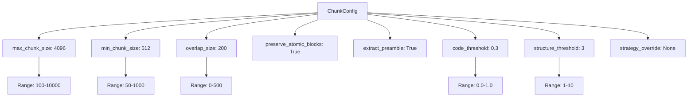

**Diagram sources**
- [markdown_chunker_v2/config.py](file://markdown_chunker_v2/config.py#L32-L46)

### Parameter Details

#### Size Parameters

| Parameter | Type | Default | Range | Impact |
|-----------|------|---------|-------|---------|
| `max_chunk_size` | int | 4096 | 100-10000 | Larger chunks = fewer chunks, more context |
| `min_chunk_size` | int | 512 | 50-1000 | Prevents very small chunks |
| `overlap_size` | int | 200 | 0-500 | Only used if overlap enabled |

#### Behavior Parameters

| Parameter | Type | Default | Description |
|-----------|------|---------|-------------|
| `preserve_atomic_blocks` | bool | True | Keep code blocks and tables intact |
| `extract_preamble` | bool | True | Extract content before first header as preamble |

#### Strategy Selection Parameters

| Parameter | Type | Default | Description |
|-----------|------|---------|-------------|
| `code_threshold` | float | 0.3 | Code ratio threshold for CodeAwareStrategy |
| `structure_threshold` | int | 3 | Minimum headers for StructuralStrategy |

#### Override Parameters

| Parameter | Type | Default | Description |
|-----------|------|---------|-------------|
| `strategy_override` | str or None | None | Force specific strategy (code_aware, structural, fallback) |

### Configuration Validation

The configuration system includes comprehensive validation:

```mermaid
flowchart TD
A[Configuration Input] --> B{max_chunk_size > 0?}
B --> |No| C[Raise ValueError]
B --> |Yes| D{min_chunk_size > 0?}
D --> |No| C
D --> |Yes| E{min_chunk_size > max_chunk_size?}
E --> |Yes| F[Auto-adjust min_chunk_size]
E --> |No| G{overlap_size >= max_chunk_size?}
G --> |Yes| C
G --> |No| H{code_threshold in [0,1]?}
H --> |No| C
H --> |Yes| I{structure_threshold >= 1?}
I --> |No| C
I --> |Yes| J{strategy_override valid?}
J --> |No| C
J --> |Yes| K[Configuration Valid]
```

**Diagram sources**
- [markdown_chunker_v2/config.py](file://markdown_chunker_v2/config.py#L47-L74)

**Section sources**
- [markdown_chunker_v2/config.py](file://markdown_chunker_v2/config.py#L12-L170)

## Output Format Specification

### Chunk Structure

Each chunk contains the following structure:

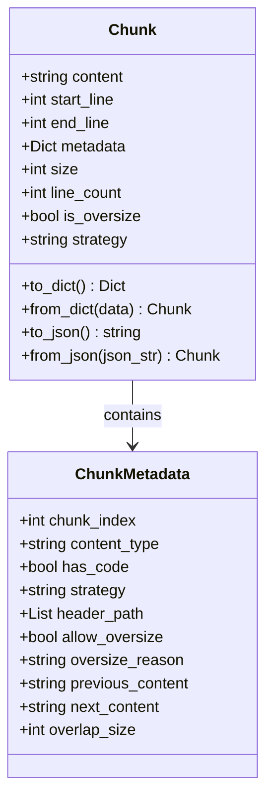

**Diagram sources**
- [markdown_chunker_v2/types.py](file://markdown_chunker_v2/types.py#L100-L187)

### Metadata Fields

#### Standard Metadata

| Field | Type | Description |
|-------|------|-------------|
| `chunk_index` | int | Sequential index of chunk |
| `content_type` | string | text/code/table/mixed |
| `has_code` | bool | Whether chunk contains code blocks |
| `strategy` | string | Strategy that created this chunk |
| `header_path` | List[string] | Hierarchical path to header |

#### Oversize Metadata

| Field | Type | Description |
|-------|------|-------------|
| `allow_oversize` | bool | Whether chunk exceeds max size |
| `oversize_reason` | string | Reason for oversize: code_block_integrity, table_integrity, section_integrity |

#### Overlap Metadata

| Field | Type | Description |
|-------|------|-------------|
| `previous_content` | string | Last N chars from previous chunk |
| `next_content` | string | First N chars from next chunk |
| `overlap_size` | int | Actual overlap size used |

### ChunkingResult Structure

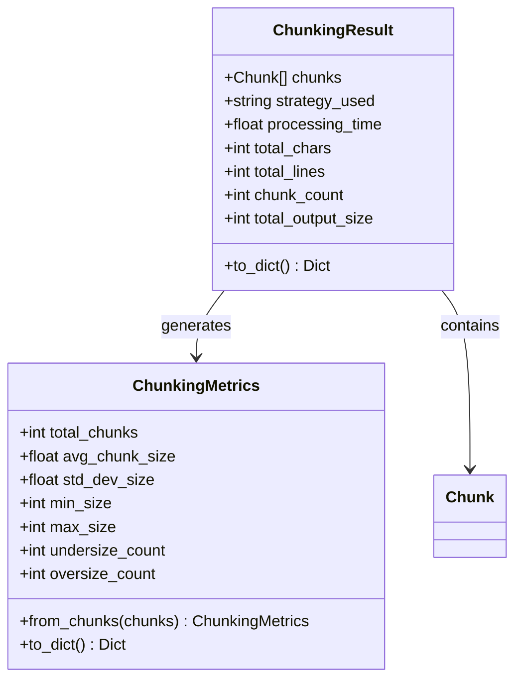

**Diagram sources**
- [markdown_chunker_v2/types.py](file://markdown_chunker_v2/types.py#L240-L272)

### Serialization Formats

#### Dictionary Format

```python
{
    "content": "# Header\n\nContent",
    "start_line": 1,
    "end_line": 3,
    "size": 20,
    "metadata": {
        "chunk_index": 0,
        "content_type": "text",
        "strategy": "structural",
        "header_path": ["/Chapter 1"]
    }
}
```

#### JSON Format

```json
{
    "content": "# Header\n\nContent",
    "start_line": 1,
    "end_line": 3,
    "size": 20,
    "metadata": {
        "chunk_index": 0,
        "content_type": "text",
        "strategy": "structural",
        "header_path": ["/Chapter 1"]
    }
}
```

**Section sources**
- [markdown_chunker_v2/types.py](file://markdown_chunker_v2/types.py#L100-L272)

## Algorithms Documentation

### Strategy Selection Algorithm

The system uses a priority-based strategy selection algorithm:

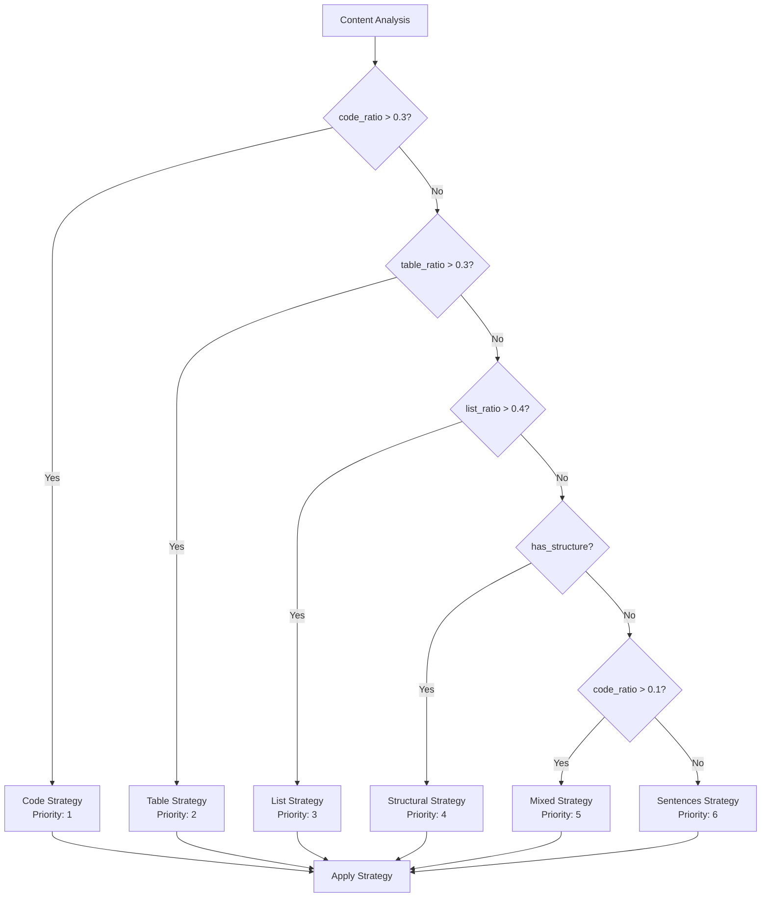

**Diagram sources**
- [markdown_chunker_v2/strategies/base.py](file://markdown_chunker_v2/strategies/base.py#L35-L56)

### Code-Aware Strategy

The Code-Aware Strategy handles documents with code blocks or tables:

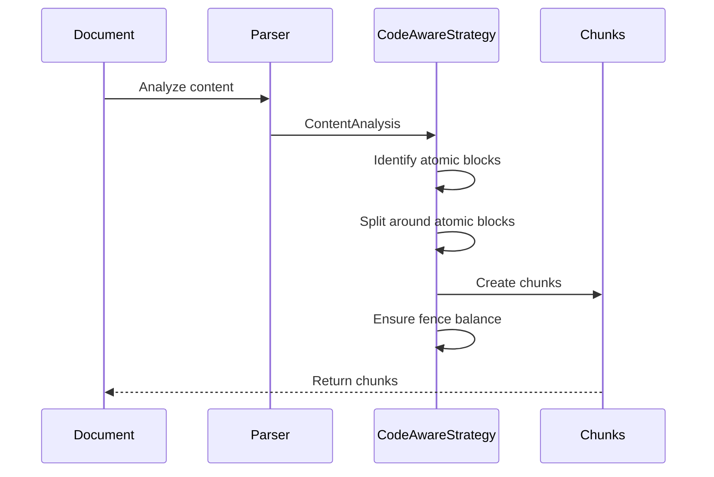

**Diagram sources**
- [markdown_chunker_v2/strategies/code_aware.py](file://markdown_chunker_v2/strategies/code_aware.py#L43-L123)

#### Atomic Block Handling

The strategy identifies and preserves atomic blocks:

| Block Type | Preservation Method | Strategy |
|------------|-------------------|----------|
| Code Blocks | Intact chunks | Never split code |
| Tables | Intact chunks | Preserve table structure |
| Headers | Section boundaries | Respect hierarchy |

### Structural Strategy

The Structural Strategy handles well-structured documents:

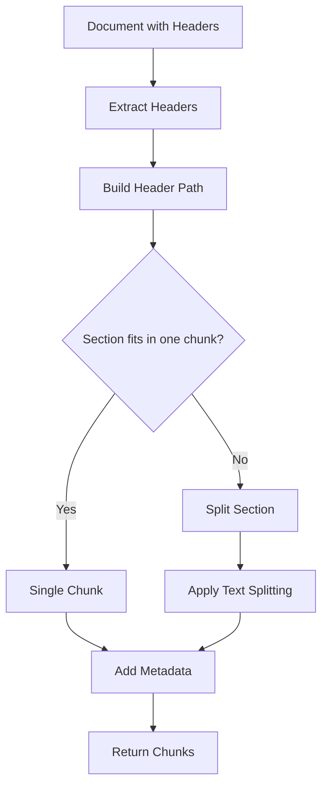

**Diagram sources**
- [markdown_chunker_v2/strategies/structural.py](file://markdown_chunker_v2/strategies/structural.py#L41-L119)

#### Header Path Construction

The strategy builds hierarchical paths for navigation:

```python
# Example header hierarchy
# # Chapter 1
# ## Section 1.1
# ### Subsection 1.1.1

# Results in path: "/Chapter 1/Section 1.1/Subsection 1.1.1"
```

### Overlap Management

The system provides sophisticated overlap management:

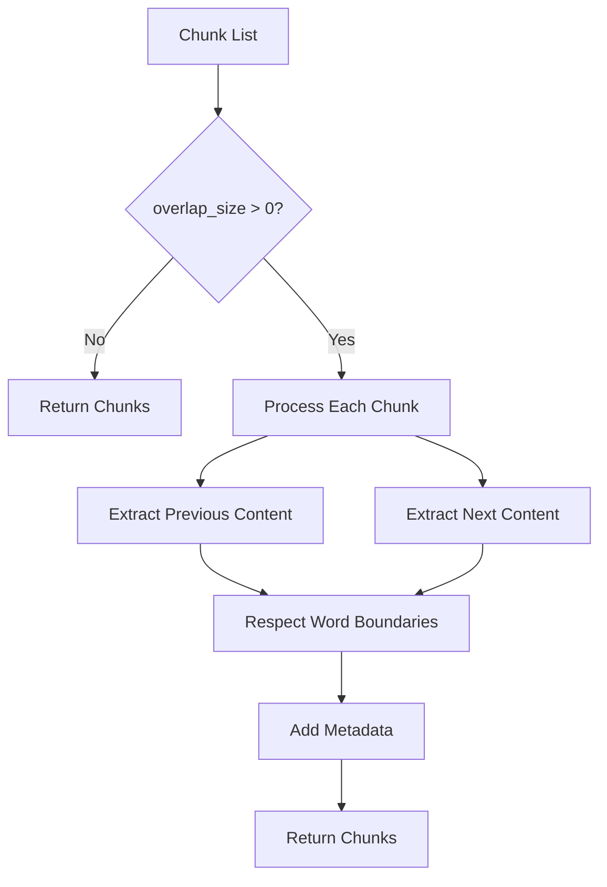

**Diagram sources**
- [markdown_chunker_v2/chunker.py](file://markdown_chunker_v2/chunker.py#L130-L158)

### Validation Pipeline

The system includes comprehensive validation:

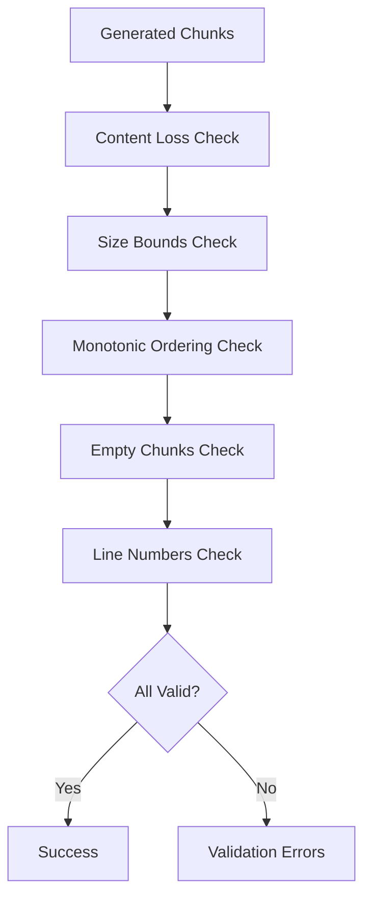

**Diagram sources**
- [markdown_chunker_v2/validator.py](file://markdown_chunker_v2/validator.py#L47-L94)

**Section sources**
- [markdown_chunker_v2/strategies/base.py](file://markdown_chunker_v2/strategies/base.py#L12-L233)
- [markdown_chunker_v2/strategies/code_aware.py](file://markdown_chunker_v2/strategies/code_aware.py#L15-L149)
- [markdown_chunker_v2/strategies/structural.py](file://markdown_chunker_v2/strategies/structural.py#L15-L151)

## Baseline Format Specification

### Baseline Structure

The baseline.json file contains expected chunking results for validation:

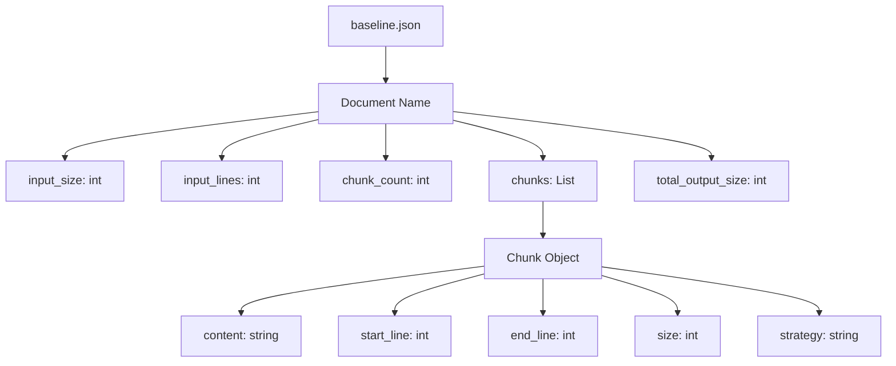

**Diagram sources**
- [baseline.json](file://baseline.json#L1-L50)

### Baseline Example

```json
{
  "code_heavy/quickstart.md": {
    "input_size": 6144,
    "input_lines": 270,
    "chunk_count": 10,
    "chunks": [
      {
        "content": "# 🚀 Quick Start\n\nGet started with Dify Markdown Chunker...",
        "start_line": 1,
        "end_line": 1,
        "size": 69,
        "strategy": "structural"
      }
    ],
    "total_output_size": 7928
  }
}
```

### Baseline Validation

The baseline system validates:

| Metric | Purpose | Validation |
|--------|---------|------------|
| `input_size` | Document size verification | Matches actual input |
| `chunk_count` | Strategy effectiveness | Consistent chunking |
| `total_output_size` | Content preservation | No significant loss |
| Individual chunks | Strategy correctness | Per-chunk validation |

**Section sources**
- [baseline.json](file://baseline.json#L1-L726)

## Quality Assurance

### Domain Properties

The system enforces ten domain properties for correctness:

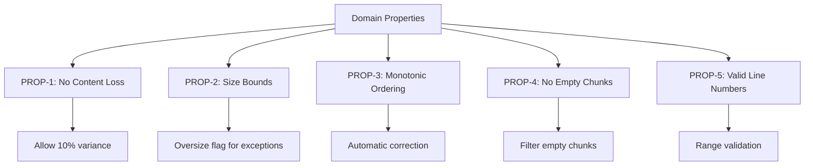

**Diagram sources**
- [markdown_chunker_v2/validator.py](file://markdown_chunker_v2/validator.py#L32-L42)

### Validation Results

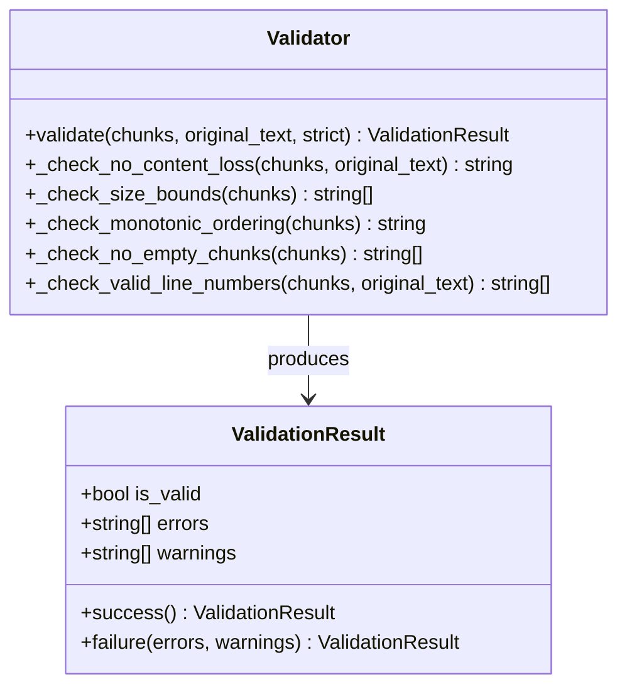

**Diagram sources**
- [markdown_chunker_v2/validator.py](file://markdown_chunker_v2/validator.py#L16-L232)

### Utility Functions

#### validate_chunks()

Convenience function for validating chunks:

```python
def validate_chunks(
    chunks: List[Chunk],
    original_text: str,
    config: Optional[ChunkConfig] = None,
    strict: bool = False
) -> ValidationResult
```

**Parameters:**
- `chunks`: List of chunks to validate
- `original_text`: Original markdown text
- `config`: Configuration (uses defaults if None)
- `strict`: If True, treat warnings as errors

**Returns:**
- `ValidationResult`: Validation outcome with errors and warnings

**Section sources**
- [markdown_chunker_v2/validator.py](file://markdown_chunker_v2/validator.py#L212-L232)

## Integration Examples

### Basic Integration

```python
from markdown_chunker import MarkdownChunker, ChunkConfig

# Create chunker with default configuration
chunker = MarkdownChunker()

# Chunk markdown content
result = chunker.chunk("# Hello\n\nWorld")

# Process chunks
for i, chunk in enumerate(result.chunks, 1):
    print(f"Chunk {i}: {chunk.size} chars, lines {chunk.start_line}-{chunk.end_line}")
```

### Configuration Profiles

```python
from markdown_chunker import MarkdownChunker, ChunkConfig

# For API documentation
config = ChunkConfig.for_api_docs()
chunker = MarkdownChunker(config)

# For code documentation
config = ChunkConfig.for_code_docs()
chunker = MarkdownChunker(config)

# For RAG systems (Dify default)
config = ChunkConfig.for_dify_rag()
chunker = MarkdownChunker(config)

# For search indexing
config = ChunkConfig.for_search_indexing()
chunker = MarkdownChunker(config)
```

### Advanced Usage

```python
from markdown_chunker import MarkdownChunker, ChunkConfig

# Custom configuration
config = ChunkConfig(
    max_chunk_size=2048,
    min_chunk_size=256,
    enable_overlap=True,
    overlap_size=100
)

chunker = MarkdownChunker(config)

# Process with analysis
result = chunker.chunk(markdown_text, include_analysis=True)

# Access analysis
print(f"Content type: {result.analysis.content_type}")
print(f"Code ratio: {result.analysis.code_ratio:.2%}")
print(f"Complexity: {result.analysis.complexity_score:.2f}")

# Access chunks with metadata
for chunk in result.chunks:
    print(f"Content: {chunk.content[:50]}...")
    print(f"Type: {chunk.metadata.get('content_type')}")
    print(f"Strategy: {chunk.metadata.get('strategy')}")
```

### File Processing

```python
from markdown_chunker import chunk_file, ChunkConfig

# Process file with default configuration
chunks = chunk_file("README.md")

# Process file with custom configuration
config = ChunkConfig.for_code_docs()
chunks = chunk_file("docs/api.md", config)

# Process with analysis
from markdown_chunker import MarkdownChunker
chunker = MarkdownChunker()
result = chunker.chunk_with_analysis(open("README.md").read())

print(f"Strategy: {result.strategy_used}")
print(f"Chunks: {len(result.chunks)}")
```

### Dify Integration

```yaml
# Dify workflow configuration
- node: markdown_chunker
  type: tool
  tool: advanced_markdown_chunker
  config:
    max_chunk_size: 2048
    strategy: auto
    chunk_overlap: 100
    include_metadata: true
```

**Section sources**
- [docs/api/chunker.md](file://docs/api/chunker.md#L98-L153)
- [docs/api/config.md](file://docs/api/config.md#L46-L221)