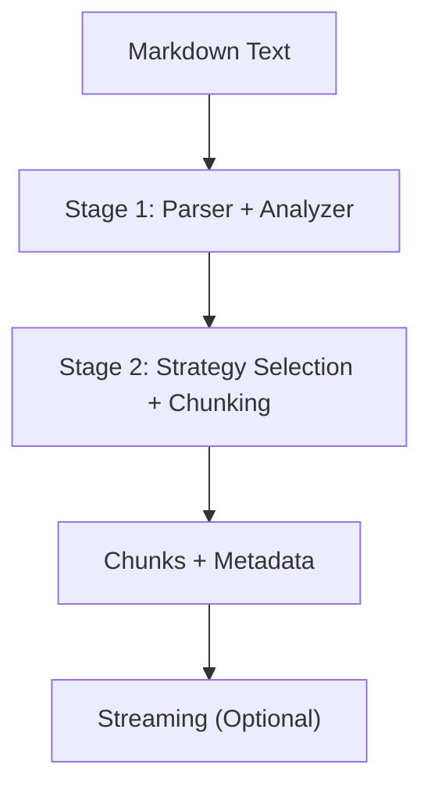
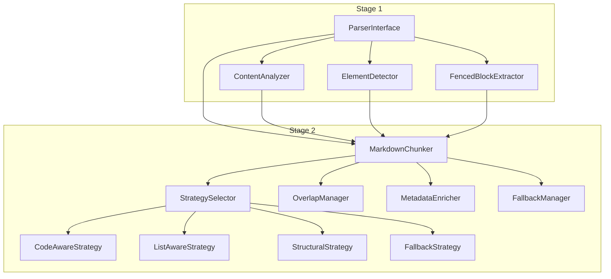
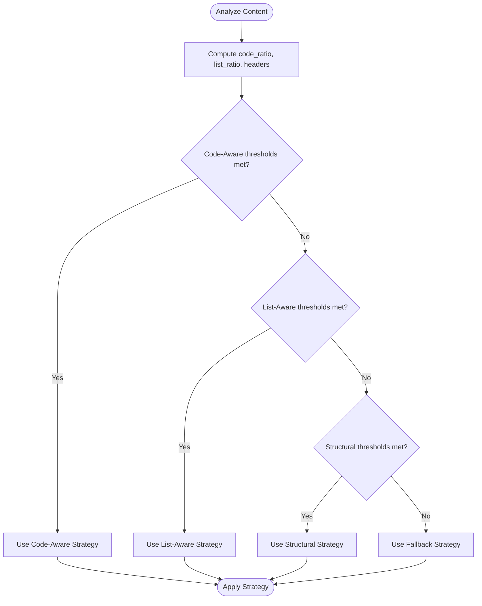
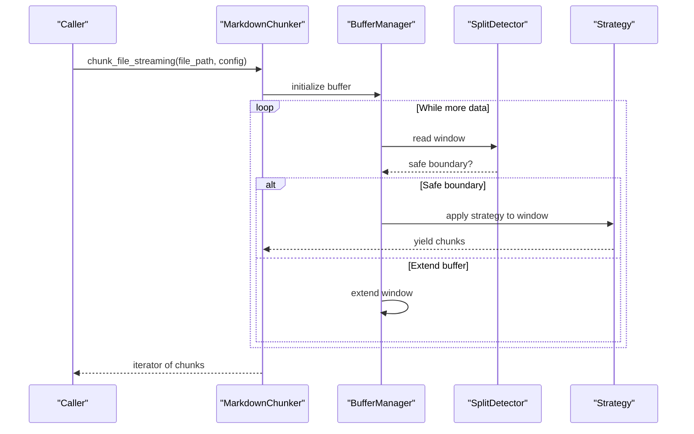
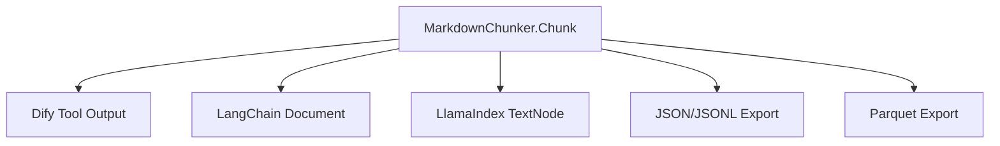
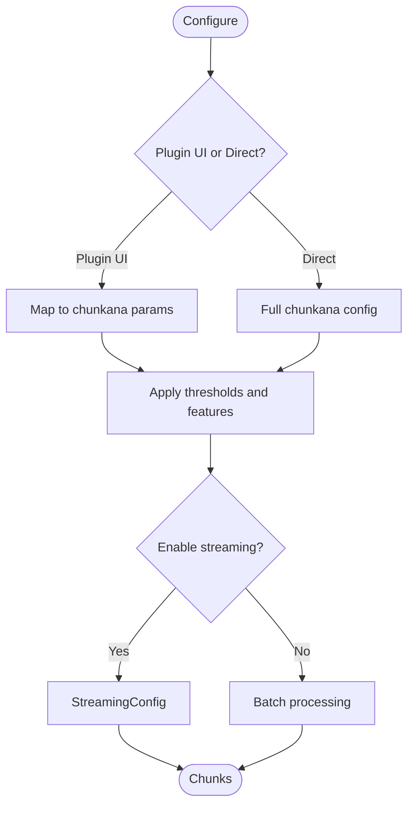
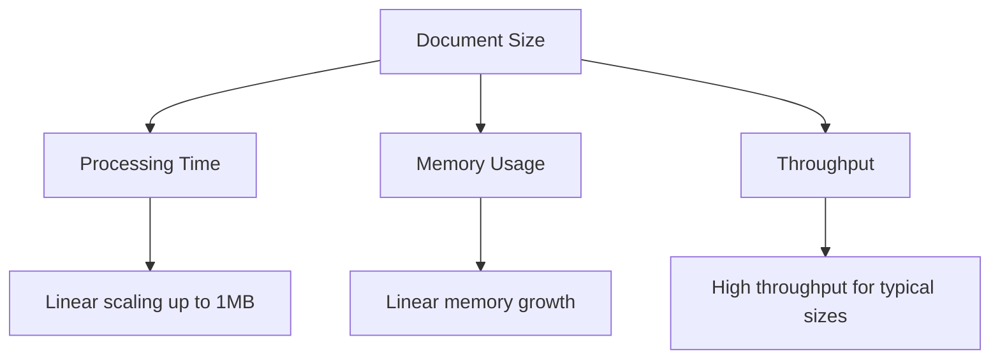
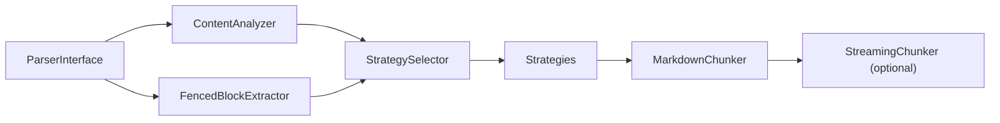

# Competitor Analysis

<cite>
**Referenced Files in This Document**
- [01_competitor_matrix.md](file://docs/research/01_competitor_matrix.md)
- [README.md](file://docs/research/08_integration_analysis.md)
- [README.md](file://docs/architecture/README.md)
- [README.md](file://docs/architecture/chunker.md)
- [README.md](file://docs/architecture/strategies.md)
- [README.md](file://docs/api/chunker.md)
- [README.md](file://docs/api/streaming.md)
- [README.md](file://docs/reference/configuration.md)
- [README.md](file://docs/research/06_advanced_features.md)
- [README.md](file://docs/research/07_benchmark_results.md)
- [markdown_chunker.py](file://provider/markdown_chunker.py)
</cite>

## Table of Contents
1. [Introduction](#introduction)
2. [Project Structure](#project-structure)
3. [Core Components](#core-components)
4. [Architecture Overview](#architecture-overview)
5. [Detailed Component Analysis](#detailed-component-analysis)
6. [Dependency Analysis](#dependency-analysis)
7. [Performance Considerations](#performance-considerations)
8. [Troubleshooting Guide](#troubleshooting-guide)
9. [Conclusion](#conclusion)
10. [Appendices](#appendices)

## Introduction
This document presents a comprehensive competitor analysis for the dify-markdown-chunker-1 project. It synthesizes findings from the competitor matrix and related research to explain how the project’s design choices—particularly around structural awareness, strategy adaptability, and integration capabilities—address gaps observed in the market. The analysis focuses on how the project differentiates itself from existing solutions and how it leverages streaming and configuration flexibility to meet real-world RAG preprocessing needs.

## Project Structure
The project is organized around a two-stage pipeline:
- Stage 1: Content analysis and structural extraction (parsers, element detectors, content analyzer)
- Stage 2: Strategy-driven chunking with overlap, metadata enrichment, and fallback handling

**Diagram sources**
- [README.md](file://docs/architecture/README.md#L1-L120)

**Section sources**
- [README.md](file://docs/architecture/README.md#L1-L120)

## Core Components
- Strategy selection and chunking orchestration
- Five intelligent chunking strategies (Code-Aware, List-Aware, Structural, Fallback, Auto)
- Streaming chunking for large files with safe boundary detection
- Rich configuration and metadata enrichment
- Integration adapters and export formats

**Section sources**
- [README.md](file://docs/architecture/strategies.md#L1-L120)
- [README.md](file://docs/api/streaming.md#L1-L120)
- [README.md](file://docs/reference/configuration.md#L1-L120)

## Architecture Overview
The system separates concerns across stages and strategies, enabling:
- Structural awareness via AST and element detection
- Strategy adaptability via automatic selection and tunable thresholds
- Integration flexibility via standardized chunk format and adapters
- Streaming processing for memory-constrained environments

**Diagram sources**
- [README.md](file://docs/architecture/README.md#L1-L120)
- [README.md](file://docs/architecture/chunker.md#L1-L16)

**Section sources**
- [README.md](file://docs/architecture/README.md#L1-L120)
- [README.md](file://docs/architecture/chunker.md#L1-L16)

## Detailed Component Analysis

### Competitor Matrix and Gap Analysis
The competitor matrix evaluates 10 solutions across key dimensions: header-based splitting, code/table/list preservation, nested fencing, metadata enrichment, configurable size, semantic boundaries, strategy selection, and code-context binding. It highlights:
- Many solutions rely on simple header or size-based splitting
- Few preserve code-text semantics or handle nested fencing
- markdown_chunker_v2 leads in code-aware chunking, automatic strategy selection, and table preservation
- Identified gaps include semantic boundary detection, improved list handling, nested fencing, token-aware sizing, and hierarchical chunk relationships

These gaps directly informed the project’s design priorities:
- Adaptive chunk sizing and semantic boundary detection
- Smart list strategy restoration
- Nested fencing support
- Token-aware sizing
- Hierarchical chunk relationships

**Section sources**
- [01_competitor_matrix.md](file://docs/research/01_competitor_matrix.md#L1-L120)
- [01_competitor_matrix.md](file://docs/research/01_competitor_matrix.md#L327-L411)

### Strategy Selection and Hierarchical Output
The strategy selection algorithm chooses among Code-Aware, List-Aware, Structural, and Fallback strategies based on content characteristics (code ratio, list ratio, header count, complexity). The system supports:
- Automatic selection (Auto)
- Forced strategy selection
- Hierarchical chunk relationships for navigation and retrieval

**Diagram sources**
- [README.md](file://docs/architecture/strategies.md#L280-L314)

**Section sources**
- [README.md](file://docs/architecture/strategies.md#L1-L120)
- [README.md](file://docs/architecture/strategies.md#L280-L314)

### Streaming Processing and Configuration Flexibility
Streaming processing isolates large-file handling from the batch pipeline, preserving quality while bounding memory usage. It:
- Uses windowed buffers with safe split detection (header, paragraph, newline)
- Tracks fence state to avoid splitting code blocks, tables, and LaTeX
- Exposes StreamingConfig for buffer size, overlap lines, and memory ceilings
- Provides chunk metadata for cross-window tracking

**Diagram sources**
- [README.md](file://docs/architecture/README.md#L148-L299)
- [README.md](file://docs/api/streaming.md#L1-L120)

**Section sources**
- [README.md](file://docs/architecture/README.md#L148-L299)
- [README.md](file://docs/api/streaming.md#L1-L120)

### Integration Capabilities and Export Formats
The project’s chunk format aligns with major RAG ecosystems:
- Dify: near-native compatibility; minimal metadata additions
- LangChain and LlamaIndex: adapters available; straightforward mapping
- JSON/JSONL export formats supported; Parquet export ready to implement

**Diagram sources**
- [README.md](file://docs/research/08_integration_analysis.md#L1-L120)
- [README.md](file://docs/research/08_integration_analysis.md#L292-L360)

**Section sources**
- [README.md](file://docs/research/08_integration_analysis.md#L1-L120)
- [README.md](file://docs/research/08_integration_analysis.md#L292-L360)

### Configuration and Extensibility
The configuration system offers:
- Plugin UI parameters for simple workflows
- Direct chunkana configuration for advanced features (adaptive sizing, code-context binding, table grouping, streaming)
- Strategy thresholds and profiles for content-adaptive processing
- Validation and environment-based configuration

**Diagram sources**
- [README.md](file://docs/reference/configuration.md#L1-L120)
- [README.md](file://docs/reference/configuration.md#L191-L240)

**Section sources**
- [README.md](file://docs/reference/configuration.md#L1-L120)
- [README.md](file://docs/reference/configuration.md#L191-L240)

### Performance Characteristics and Benchmarks
Benchmarks demonstrate:
- Near-linear scaling up to 1MB
- Consistent chunk sizes and low variance
- Competitive processing time compared to leading solutions
- Recommendations for lazy regex compilation, streaming for large files, and caching

**Diagram sources**
- [README.md](file://docs/research/07_benchmark_results.md#L1-L120)

**Section sources**
- [README.md](file://docs/research/07_benchmark_results.md#L1-L120)

### Advanced Features and Roadmap
Advanced features under study include:
- Semantic boundary detection (embeddings)
- Nested fencing support (unique differentiator)
- Smart list strategy (restore and improve)
- Token-aware sizing (LLM context windows)
- Hierarchical chunking (parent-child relationships)

These features aim to elevate quality and differentiation while balancing effort and feasibility.

**Section sources**
- [README.md](file://docs/research/06_advanced_features.md#L1-L120)
- [README.md](file://docs/research/06_advanced_features.md#L640-L704)

## Dependency Analysis
The system exhibits:
- Low coupling between stage components (parsers, analyzers, strategies)
- Clear separation of concerns (analysis vs. chunking)
- Optional streaming path that does not affect batch pipeline contracts
- Extensible strategy registry and configuration profiles

**Diagram sources**
- [README.md](file://docs/architecture/README.md#L1-L120)
- [README.md](file://docs/architecture/strategies.md#L1-L120)

**Section sources**
- [README.md](file://docs/architecture/README.md#L1-L120)
- [README.md](file://docs/architecture/strategies.md#L1-L120)

## Performance Considerations
- Prefer streaming for files >10MB or constrained memory environments
- Tune chunk size and overlap to balance quality and retrieval performance
- Use content-adaptive configuration for code-heavy, list-heavy, or table-heavy documents
- Leverage caching and lazy regex compilation for repeated processing

[No sources needed since this section provides general guidance]

## Troubleshooting Guide
Common issues and resolutions:
- Wrong strategy selected: force a specific strategy or adjust thresholds
- Oversized chunks: reduce chunk size or enable adaptive sizing
- Missing context: increase overlap or enable hierarchical mode
- Large memory usage: reduce chunk size, disable advanced features, or switch to streaming

**Section sources**
- [README.md](file://docs/architecture/strategies.md#L482-L529)
- [README.md](file://docs/reference/configuration.md#L430-L530)

## Conclusion
The dify-markdown-chunker-1 project addresses key gaps in the Markdown chunking and RAG preprocessing landscape:
- Structural awareness through AST and element detection
- Strategy adaptability with automatic selection and tunable thresholds
- Integration flexibility via standardized chunk format and adapters
- Streaming support for large files and memory-constrained environments
- Rich configuration and metadata to power downstream RAG pipelines

These design choices differentiate the project from existing solutions and position it as a strong candidate for top-tier performance and usability in RAG workflows.

[No sources needed since this section summarizes without analyzing specific files]

## Appendices

### Visual Comparison Tables

- Competitor Feature Matrix (selected highlights)
  - Header-based splitting: markdown_chunker_v2 leads in robustness and strategy selection
  - Code/table preservation: markdown_chunker_v2 excels in atomic block handling
  - Nested fencing: markdown_chunker_v2 uniquely supports nested fences
  - Metadata enrichment: markdown_chunker_v2 includes rich, strategy-aware metadata
  - Configurable size: markdown_chunker_v2 balances simplicity and control
  - Semantic boundaries: markdown_chunker_v2 is developing semantic boundary detection
  - Strategy selection: markdown_chunker_v2 auto-selects; Unstructured and Chonkie offer similar capabilities
  - Code-context binding: markdown_chunker_v2 unique strength

- Strategy Comparison Example (conceptual)
  - Code-Aware: preserves code blocks and binds context
  - List-Aware: preserves list hierarchy and context
  - Structural: respects header boundaries and builds header paths
  - Fallback: reliable paragraph-based splitting
  - Auto: optimal selection without manual tuning

- Streaming vs. Batch Feature Compatibility
  - All strategies supported in both modes
  - Overlap and metadata preserved
  - Hierarchical chunking: limited in streaming; document summary may be restricted
  - Semantic boundaries: available in batch; planned for streaming

[No sources needed since this section provides general guidance]

### Decision Impact Summaries
- Streaming support: enables processing of large files with bounded memory, critical for documentation-scale corpora
- Configuration flexibility: allows content-adaptive tuning and environment-specific profiles
- Hierarchical chunking: enhances navigability and retrieval depth for structured documents
- Nested fencing: unique differentiator for documentation templates and meta-documentation
- Token-aware sizing: aligns chunk sizes with LLM context windows for better prompt efficiency

[No sources needed since this section provides general guidance]