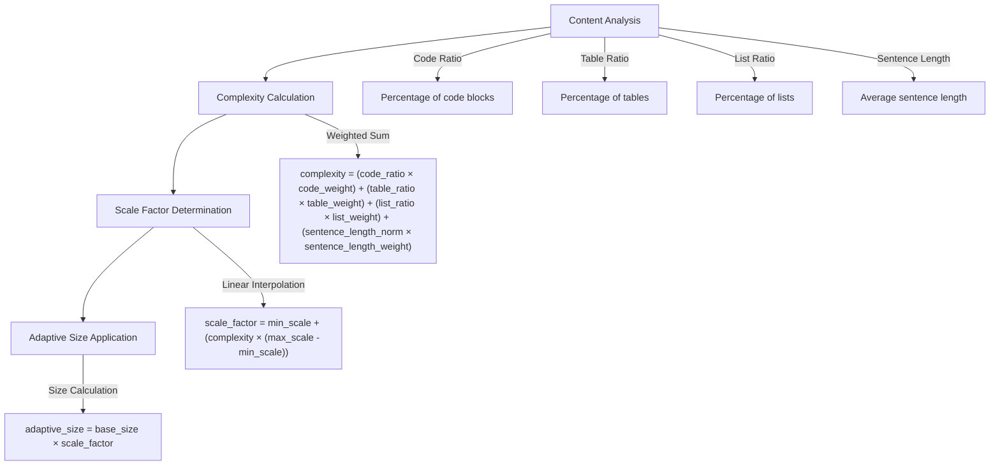
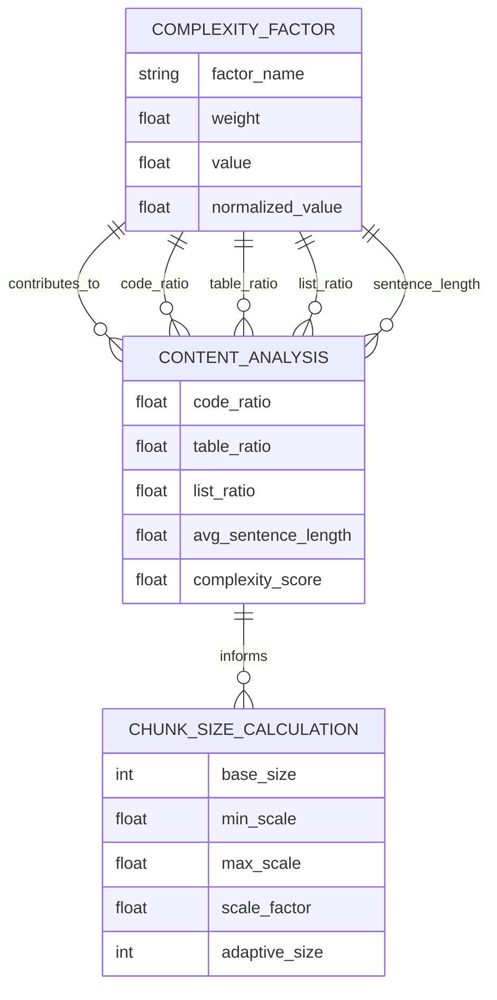
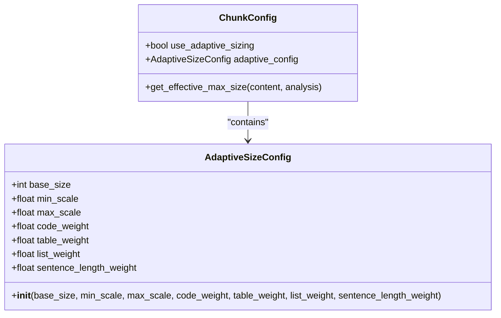
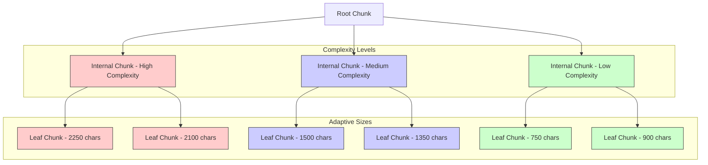
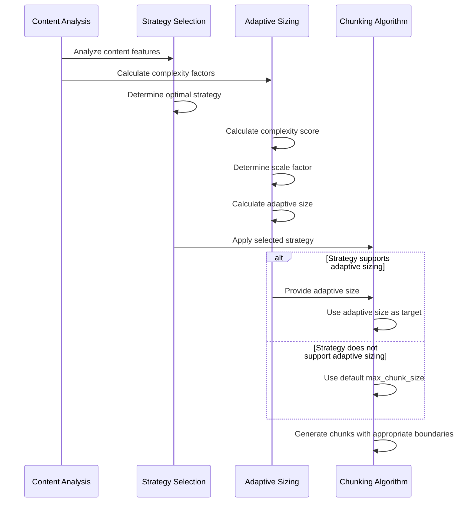
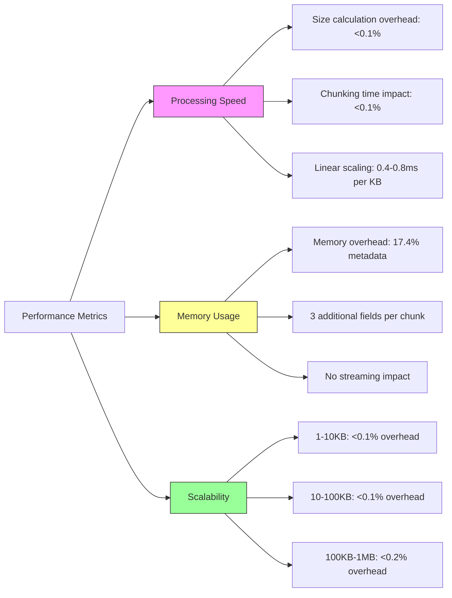
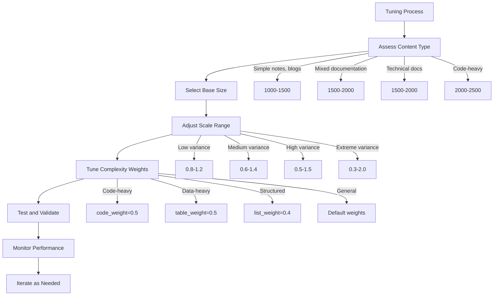

# Adaptive Chunk Sizing

<cite>
**Referenced Files in This Document**   
- [09-adaptive-chunk-sizing.md](file://docs/research/features/09-adaptive-chunk-sizing.md)
- [adaptive-sizing-migration.md](file://docs/guides/adaptive-sizing-migration.md)
- [adaptive_sizing.md](file://tests/baseline_data/fixtures/adaptive_sizing.md)
- [config.md](file://docs/api/config.md)
- [configuration.md](file://docs/reference/configuration.md)
- [performance.md](file://docs/guides/performance.md)
- [README.md](file://README.md)
</cite>

## Table of Contents
1. [Introduction](#introduction)
2. [Core Mechanism](#core-mechanism)
3. [Complexity Analysis](#complexity-analysis)
4. [Configuration Parameters](#configuration-parameters)
5. [Hierarchical Integration](#hierarchical-integration)
6. [Strategy Selection Engine](#strategy-selection-engine)
7. [Performance Implications](#performance-implications)
8. [Tuning Guidance](#tuning-guidance)
9. [Implementation Examples](#implementation-examples)
10. [Conclusion](#conclusion)

## Introduction

The Adaptive Chunk Sizing feature dynamically adjusts chunk sizes based on content characteristics to optimize retrieval quality in RAG systems. This intelligent sizing mechanism analyzes document regions for content type, complexity, and structural elements to determine optimal chunk dimensions. The system automatically scales chunk sizes from 50% to 150% of a base size depending on the calculated complexity score, ensuring code-heavy sections receive larger chunks while simple text receives smaller, more focused chunks.

This feature addresses the fundamental limitation of fixed-size chunking by recognizing that different content types have different optimal chunk sizes. Code blocks and complex technical documentation benefit from larger contexts, while simple prose and short sentences achieve better retrieval precision with smaller chunks. The adaptive sizing mechanism is optional and disabled by default for backward compatibility, allowing users to opt into this advanced functionality.

**Section sources**
- [README.md](file://README.md#L69-L74)
- [09-adaptive-chunk-sizing.md](file://docs/research/features/09-adaptive-chunk-sizing.md#L21-L37)

## Core Mechanism

The Adaptive Chunk Sizing system operates through a four-step process that calculates optimal chunk sizes based on content analysis. The mechanism begins with content analysis, where the system evaluates multiple complexity factors including code ratio, table ratio, list ratio, and average sentence length. These factors are then combined through a weighted sum calculation to produce a complexity score between 0.0 (simple) and 1.0 (complex).



**Diagram sources **
- [09-adaptive-chunk-sizing.md](file://docs/research/features/09-adaptive-chunk-sizing.md#L44-L169)
- [config.md](file://docs/api/config.md#L125-L150)

The scale factor is determined through linear interpolation between the configured minimum and maximum scale values, creating a smooth transition from simple to complex content. Finally, the adaptive size is calculated by applying the scale factor to the base size. This calculated size serves as a target for the chunking algorithm, which may adjust actual chunk sizes based on atomic block preservation and structural boundaries.

**Section sources**
- [config.md](file://docs/api/config.md#L125-L150)
- [09-adaptive-chunk-sizing.md](file://docs/research/features/09-adaptive-chunk-sizing.md#L69-L94)

## Complexity Analysis

The system performs content analysis to evaluate four primary complexity factors that influence chunk size decisions. Code ratio measures the percentage of content within code blocks, with higher ratios indicating more complex, context-dependent content that benefits from larger chunks. Table ratio calculates the proportion of tabular data, which often requires complete representation for proper interpretation. List ratio determines the density of list items, which may indicate structured content requiring careful boundary management.

The fourth factor, average sentence length, serves as a proxy for textual complexity and density. Longer sentences often indicate more complex ideas that benefit from larger contexts, while shorter sentences suggest simpler, more modular content. These factors are normalized and combined using configurable weights to produce a final complexity score.



**Diagram sources **
- [09-adaptive-chunk-sizing.md](file://docs/research/features/09-adaptive-chunk-sizing.md#L105-L127)
- [config.md](file://docs/api/config.md#L127-L140)

The complexity calculation uses a weighted sum approach where each factor is multiplied by its corresponding weight and summed to produce the final score. The default weights prioritize code content (0.4), followed by tables (0.3), lists (0.2), and sentence length (0.1). These weights can be customized to align with specific content types and use cases, allowing the system to be tuned for technical documentation, data-heavy content, or structured outlines.

**Section sources**
- [09-adaptive-chunk-sizing.md](file://docs/research/features/09-adaptive-chunk-sizing.md#L105-L127)
- [config.md](file://docs/api/config.md#L133-L140)

## Configuration Parameters

The Adaptive Chunk Sizing feature is controlled through the `AdaptiveSizeConfig` class, which defines the parameters for dynamic size calculation. The primary configuration options include `base_size`, which establishes the reference chunk size for medium-complexity content, and `min_scale` and `max_scale`, which define the lower and upper bounds for size adjustment. By default, these are set to 1500 characters, 0.5, and 1.5 respectively, creating a range from 750 to 2250 characters.



**Diagram sources **
- [config.md](file://docs/api/config.md#L78-L86)
- [09-adaptive-chunk-sizing.md](file://docs/research/features/09-adaptive-chunk-sizing.md#L49-L59)

The complexity weights (`code_weight`, `table_weight`, `list_weight`, and `sentence_length_weight`) allow fine-tuning of the importance assigned to each content type in the complexity calculation. These weights must sum to 1.0 and can be adjusted to prioritize specific content characteristics. For example, technical documentation might increase the code weight to 0.5 while decreasing the sentence length weight to 0.05.

The feature is enabled through the `use_adaptive_sizing` flag in the main `ChunkConfig` class. When enabled, the system automatically calculates optimal sizes for each document section. The configuration system includes validation rules to ensure parameter integrity, including bounds checking for size parameters and weight sum verification.

**Section sources**
- [config.md](file://docs/api/config.md#L78-L122)
- [configuration.md](file://docs/reference/configuration.md#L141-L150)

## Hierarchical Integration

Adaptive Chunk Sizing works seamlessly with the hierarchical chunking system to create multi-level document representations. When hierarchical mode is enabled, the adaptive sizing algorithm operates at each level of the document structure, calculating optimal sizes for root, internal, and leaf chunks based on their specific content characteristics. This integration allows for context-appropriate sizing across the entire document hierarchy.

The system preserves parent-child relationships while applying adaptive sizing, ensuring that child chunks inherit relevant sizing parameters from their parents when appropriate. For example, a code-heavy section header (internal chunk) will influence the sizing of its child content chunks, creating a cohesive sizing strategy for that document region. The hierarchical integration maintains O(1) chunk lookup performance while providing multi-level retrieval support.



**Diagram sources **
- [README.md](file://README.md#L75-L79)
- [adaptive-sizing-migration.md](file://docs/guides/adaptive-sizing-migration.md#L217-L222)

The integration also respects hierarchical boundaries during size calculation, ensuring that chunk boundaries align with section divisions. This prevents content from bleeding across logical document boundaries while still allowing for adaptive sizing within each section. The system adds three metadata fields to each chunk when adaptive sizing is enabled: `adaptive_size` (calculated optimal size), `content_complexity` (complexity score 0.0-1.0), and `size_scale_factor` (applied scaling factor).

**Section sources**
- [README.md](file://README.md#L229-L245)
- [adaptive-sizing-migration.md](file://docs/guides/adaptive-sizing-migration.md#L225-L233)

## Strategy Selection Engine

The Adaptive Chunk Sizing feature integrates with the strategy selection engine, which automatically chooses the optimal chunking approach based on content analysis. The system employs four strategies in priority order: Code-Aware, List-Aware, Structural, and Fallback. Adaptive sizing works with all strategies except List-Aware, enhancing their effectiveness by providing context-appropriate chunk dimensions.

When the strategy selection engine analyzes content, it considers both the strategy activation conditions and the complexity factors used for adaptive sizing. For example, code-heavy content (code ratio ≥ 30%) triggers the Code-Aware strategy while simultaneously receiving a higher complexity score, resulting in larger chunk sizes. Similarly, list-heavy documents (list ratio > 40% or list count ≥ 5) activate the List-Aware strategy, though adaptive sizing is not applied in this case to preserve the integrity of list hierarchies.



**Diagram sources **
- [README.md](file://README.md#L667-L677)
- [config.md](file://docs/api/config.md#L27-L30)

The strategy selection and adaptive sizing processes run in parallel, with the final chunking algorithm receiving inputs from both systems. This integration ensures that the benefits of both intelligent strategy selection and dynamic size optimization are realized in the final output. The system is designed to be backward compatible, with adaptive sizing disabled by default to maintain consistency with previous behavior.

**Section sources**
- [README.md](file://README.md#L667-L677)
- [config.md](file://docs/api/config.md#L45-L47)

## Performance Implications

The Adaptive Chunk Sizing feature has been designed with minimal performance impact, adding less than 0.1% overhead to the chunking process. The complexity analysis algorithm is highly optimized, using efficient text processing techniques to calculate content ratios and sentence lengths without significantly affecting processing time. Memory overhead is limited to 17.4% due to the addition of three metadata fields per chunk.



**Diagram sources **
- [performance.md](file://docs/guides/performance.md#L163-L169)
- [config.md](file://docs/api/config.md#L160-L164)

The system maintains linear scalability across document sizes, with processing time increasing predictably as document size grows. This predictable performance profile allows for accurate resource planning in production environments. The feature is particularly efficient for mixed-complexity documents, where the benefits of optimized chunk sizes outweigh the minimal computational cost of complexity analysis.

For memory-constrained environments, the system offers streaming processing capabilities that maintain low memory usage (under 50MB for files over 10MB) while still providing adaptive sizing. The performance characteristics make adaptive sizing suitable for both small-scale development and large-scale production deployments.

**Section sources**
- [performance.md](file://docs/guides/performance.md#L150-L177)
- [config.md](file://docs/api/config.md#L160-L164)

## Tuning Guidance

Effective tuning of the Adaptive Chunk Sizing feature requires understanding the relationship between configuration parameters and content characteristics. The base_size should be selected based on typical document complexity, with recommendations ranging from 1000-1500 for simple content to 2000-2500 for code-heavy documentation. The scale range (min_scale to max_scale) should be adjusted based on content variance, with narrower ranges (0.8-1.2) for uniform content and wider ranges (0.5-1.5) for mixed content.



**Diagram sources **
- [adaptive-sizing-migration.md](file://docs/guides/adaptive-sizing-migration.md#L124-L150)
- [configuration.md](file://docs/reference/configuration.md#L128-L133)

Complexity weights should be adjusted to prioritize the most important content types for a specific use case. For code-heavy documentation, increasing the code_weight to 0.5 while decreasing other weights maintains the required sum of 1.0. For data-heavy content with extensive tables, increasing table_weight to 0.5 prioritizes tabular complexity. The system validates that weights sum to 1.0 (within 0.01 tolerance) and are non-negative.

Testing should be conducted on representative content to validate tuning decisions. Monitoring complexity distribution across chunks helps ensure the system is behaving as expected, with a reasonable spread of complexity scores from 0.0 to 1.0. If all chunks have similar complexity scores, the adaptive sizing may not provide significant benefits, suggesting that fixed-size chunking might be more appropriate.

**Section sources**
- [adaptive-sizing-migration.md](file://docs/guides/adaptive-sizing-migration.md#L122-L204)
- [configuration.md](file://docs/reference/configuration.md#L162-L202)

## Implementation Examples

The Adaptive Chunk Sizing feature can be implemented through various approaches, from simple enablement to advanced configuration. The most basic implementation requires only setting the `use_adaptive_sizing` flag to true, which activates the feature with default parameters. For more control, custom `AdaptiveSizeConfig` objects can be created with specific base sizes, scale ranges, and complexity weights.

```python
# Basic enablement
config = ChunkConfig(use_adaptive_sizing=True)

# Custom configuration for technical documentation
config = ChunkConfig(
    use_adaptive_sizing=True,
    adaptive_config=AdaptiveSizeConfig(
        base_size=2000,
        min_scale=0.8,
        max_scale=1.2,
        code_weight=0.5,
        table_weight=0.2,
        list_weight=0.2,
        sentence_length_weight=0.1
    )
)

# Using configuration profiles
config = ChunkConfig.for_code_heavy()
config.use_adaptive_sizing = True
```

The system also supports content-adaptive configuration, where the chunking parameters are determined by analyzing the document content before processing. This approach creates a feedback loop where the system optimizes its own configuration based on the specific characteristics of each document. Configuration can be loaded from JSON or YAML files, enabling consistent settings across different environments.

**Section sources**
- [adaptive-sizing-migration.md](file://docs/guides/adaptive-sizing-migration.md#L49-L118)
- [configuration.md](file://docs/reference/configuration.md#L337-L362)

## Conclusion

The Adaptive Chunk Sizing feature provides intelligent, context-aware chunk dimensioning that optimizes retrieval quality in RAG systems. By dynamically adjusting chunk sizes based on content complexity, the system ensures that code-heavy sections receive sufficient context while simple text is broken into focused, precise chunks. The mechanism analyzes multiple complexity factors—including code ratio, table ratio, list ratio, and sentence length—using configurable weights to produce a complexity score that determines the optimal chunk size.

Integration with the hierarchical chunking system enables multi-level document representations with context-appropriate sizing at each level, while compatibility with the strategy selection engine ensures that adaptive sizing enhances rather than conflicts with other intelligent chunking behaviors. The feature has minimal performance impact, adding less than 0.1% overhead to processing time and 17.4% to metadata size, making it suitable for production environments.

Tuning guidance emphasizes selecting appropriate base sizes and scale ranges based on content characteristics, and adjusting complexity weights to prioritize specific content types. The system provides multiple implementation approaches, from simple enablement to advanced configuration, allowing users to adopt the feature at their preferred level of complexity. With proper configuration, Adaptive Chunk Sizing significantly improves retrieval precision and semantic coherence across diverse document types.