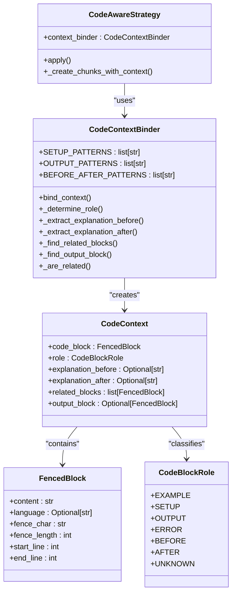
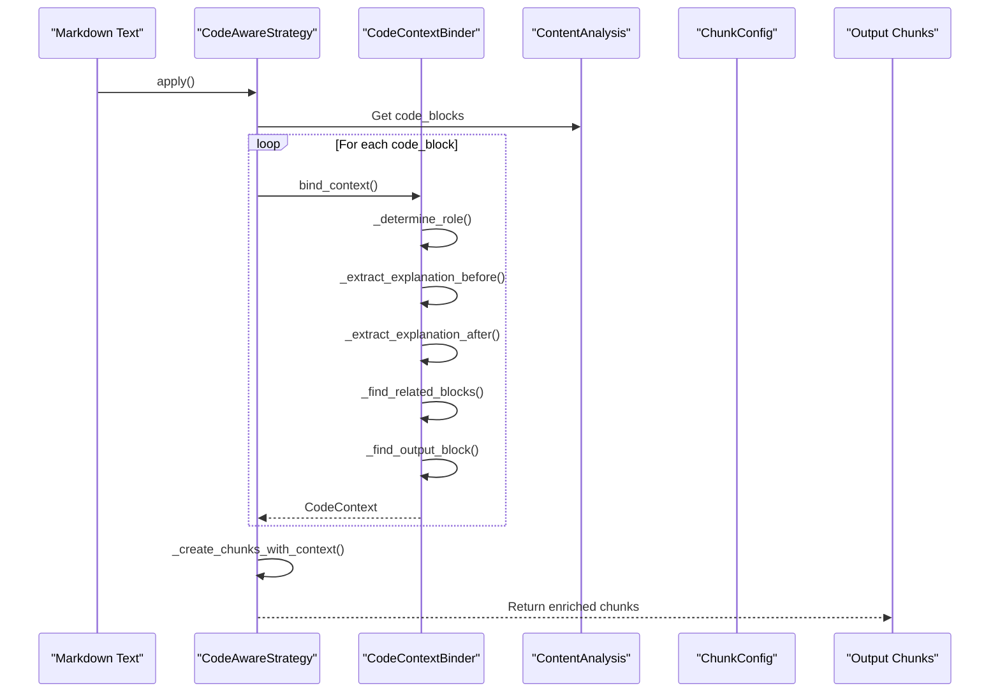

# Enhanced Code Context Binding

<cite>
**Referenced Files in This Document**   
- [06-enhanced-code-context-binding.md](file://docs/research/features/06-enhanced-code-context-binding.md)
- [README.md](file://README.md)
- [configuration.md](file://docs/reference/configuration.md)
- [strategies.md](file://docs/architecture/strategies.md)
- [types.md](file://docs/api/types.md)
- [code_context.md](file://tests/baseline_data/fixtures/code_context.md)
</cite>

## Table of Contents
1. [Introduction](#introduction)
2. [Core Principles](#core-principles)
3. [Architecture Overview](#architecture-overview)
4. [Context Identification Algorithms](#context-identification-algorithms)
5. [Code-Context Binding in Practice](#code-context-binding-in-practice)
6. [Integration with Code-Aware Chunking](#integration-with-code-aware-chunking)
7. [Configuration Options](#configuration-options)
8. [Performance and Constraints](#performance-and-constraints)
9. [Troubleshooting Guide](#troubleshooting-guide)
10. [Conclusion](#conclusion)

## Introduction

The Enhanced Code Context Binding feature addresses critical user needs in code-heavy documentation processing, specifically the loss of surrounding explanations and separation of examples from their context. This unique differentiator intelligently binds code blocks to their explanatory text, output results, and related code examples, significantly improving retrieval accuracy for code-related queries in RAG systems.

The system preserves the natural explanation → code → output pattern found in technical documentation, tutorials, and API references. By maintaining these relationships within chunks, it ensures that when users query about code functionality, they receive not just the code snippet but also the surrounding context that explains its purpose, usage, and expected behavior.

This documentation details the algorithms for identifying code blocks and capturing relevant preceding headers, descriptions, and comments. It explains how context binding improves retrieval accuracy, provides examples from research documents showing context preservation in API documentation and tutorials, describes integration with the code-aware chunking strategy, and outlines configuration options for context window size.

**Section sources**
- [06-enhanced-code-context-binding.md](file://docs/research/features/06-enhanced-code-context-binding.md#L1-L53)
- [README.md](file://README.md#L56-L63)

## Core Principles

The Enhanced Code Context Binding system operates on several core principles that differentiate it from basic code-aware chunking approaches. While traditional methods simply include the preceding paragraph with a code block, this enhanced system employs sophisticated pattern recognition and relationship detection to create semantically meaningful chunks.

The primary principle is intelligent context selection rather than indiscriminate inclusion. Instead of including all preceding text, the system identifies only the relevant explanation that directly relates to the code block. This prevents chunks from becoming bloated with unrelated content while ensuring essential context is preserved.

A second principle is role-based classification of code blocks. The system recognizes different types of code blocks based on their purpose and relationship to surrounding content. This classification enables appropriate context binding strategies for each type of code block.

The third principle is relationship preservation between related code blocks. The system detects and maintains connections between sequential examples, before/after comparisons, and code-output pairs, ensuring these logical groupings remain intact in the chunking process.

These principles work together to address the user needs documented in the research: "Code loses surrounding explanation" (C1.2) and "Examples separated from explanations" (C2.3), both rated as high frequency and critical severity issues.

**Section sources**
- [06-enhanced-code-context-binding.md](file://docs/research/features/06-enhanced-code-context-binding.md#L21-L48)
- [README.md](file://README.md#L726-L735)

## Architecture Overview

The Enhanced Code Context Binding architecture consists of a dedicated `CodeContextBinder` class that works in conjunction with the `CodeAwareStrategy` to create semantically rich chunks. The system analyzes code blocks and their surrounding context to determine relationships and appropriate context boundaries.



**Diagram sources**
- [06-enhanced-code-context-binding.md](file://docs/research/features/06-enhanced-code-context-binding.md#L55-L244)
- [types.md](file://docs/api/types.md#L114-L150)

## Context Identification Algorithms

The Enhanced Code Context Binding system employs several sophisticated algorithms to identify and preserve relevant context around code blocks. These algorithms work together to determine the role of each code block, extract appropriate explanations, and identify relationships between related code blocks.

### Role Determination Algorithm

The `_determine_role` method uses a multi-step approach to classify code blocks based on their purpose:

1. **Language Tag Analysis**: The system first checks the language tag of the code block. Blocks with languages like 'output', 'console', or 'stdout' are classified as OUTPUT, while those with 'error' or 'traceback' are classified as ERROR.

2. **Preceding Text Pattern Matching**: The system analyzes the text preceding the code block using regular expression patterns to identify setup instructions, output indicators, or before/after comparisons. The `SETUP_PATTERNS` include phrases like "first, you need to", "install", "import", "setup", and "configuration". The `OUTPUT_PATTERNS` match headings like "output:", "result:", "console:", and "stdout:". The `BEFORE_AFTER_PATTERNS` detect phrases like "before:", "after:", "old code", and "new version".

3. **Default Classification**: If no specific patterns are matched, the block is classified as EXAMPLE by default.

### Explanation Extraction Algorithm

The system extracts explanations before and after code blocks using context window limits defined by configuration parameters. The `_extract_explanation_before` and `_extract_explanation_after` methods respect the `max_context_chars_before` and `max_context_chars_after` settings to prevent chunks from becoming excessively large while ensuring sufficient context is captured.

The extraction process is intelligent, capturing complete sentences and paragraphs rather than arbitrary character counts. This ensures that explanations are not truncated mid-sentence, preserving their meaning and readability.

### Related Blocks Detection Algorithm

The `_find_related_blocks` method identifies code blocks that should be grouped together based on proximity and relationship. Two blocks are considered related if:
- They have the same programming language
- They are within five lines of each other in the source document
- They are part of a recognized pattern like before/after comparisons or sequential steps

The `_are_related` method implements these criteria, ensuring that related code examples remain together in the same chunk while preventing unrelated blocks from being inappropriately grouped.

**Section sources**
- [06-enhanced-code-context-binding.md](file://docs/research/features/06-enhanced-code-context-binding.md#L147-L215)
- [configuration.md](file://docs/reference/configuration.md#L151-L158)

## Code-Context Binding in Practice

The Enhanced Code Context Binding feature demonstrates its value through several common patterns in technical documentation. These patterns illustrate how the system preserves context and improves retrieval accuracy for code-related queries.

### Before/After Pattern

In documentation that shows code refactoring or improvements, the system recognizes before/after patterns and keeps both code blocks together in a single chunk. For example:

```markdown
## Fixing the Bug

Before (problematic code):

```python
def process(data):
    result = data.split(',')  # Fails on None
    return result
```

After (fixed code):

```python
def process(data):
    if data is None:
        return []
    result = data.split(',')
    return result
```
```

The system identifies the "Before" and "After" headings through pattern matching and classifies the first block as BEFORE and the second as AFTER. Both blocks are included in the same chunk with metadata indicating their relationship, allowing users to understand the code improvement in context.

### Code + Output Pattern

When documentation includes code examples with their expected output, the system binds the code block to the output block. For example:

```markdown
## Example Usage

```python
print("Hello, World!")
```

Output:

```
Hello, World!
```
```

The system recognizes the "Output:" heading through pattern matching and classifies the second block as OUTPUT. It then creates a chunk containing both the code and its output, preserving the complete example.

### Setup + Example Pattern

For tutorials that require setup before demonstrating usage, the system identifies setup code and groups it with subsequent examples. The `SETUP_PATTERNS` help identify blocks that contain installation instructions, imports, or configuration code, ensuring they are appropriately contextualized.

These patterns are particularly valuable in API documentation and tutorials, where understanding the relationship between code, its purpose, and its results is essential for effective learning and implementation.

**Section sources**
- [06-enhanced-code-context-binding.md](file://docs/research/features/06-enhanced-code-context-binding.md#L248-L292)
- [README.md](file://README.md#L743-L791)

## Integration with Code-Aware Chunking

The Enhanced Code Context Binding feature is tightly integrated with the Code-Aware Strategy, enhancing its basic context preservation capabilities. The `CodeAwareStrategy` initializes a `CodeContextBinder` instance and uses it to create enriched context for each code block during the chunking process.



**Diagram sources**
- [06-enhanced-code-context-binding.md](file://docs/research/features/06-enhanced-code-context-binding.md#L220-L244)
- [strategies.md](file://docs/architecture/strategies.md#L23-L38)

The integration follows these steps:
1. The `CodeAwareStrategy` receives the text, content analysis, and configuration
2. It extracts all code blocks from the analysis
3. For each code block, it calls the `bind_context` method of `CodeContextBinder`
4. The binder creates a `CodeContext` object with the code block, its role, explanations, and related blocks
5. The strategy uses these contexts to create final chunks with preserved relationships

This integration ensures that code blocks are not processed in isolation but as part of a larger context that includes their explanations, outputs, and related examples. The resulting chunks are semantically richer and more useful for retrieval in RAG systems.

The Code-Aware Strategy is automatically selected for documents with a code ratio of 30% or higher, or for documents containing any code blocks or tables, ensuring that the Enhanced Code Context Binding feature is applied where it provides the most value.

**Section sources**
- [06-enhanced-code-context-binding.md](file://docs/research/features/06-enhanced-code-context-binding.md#L220-L244)
- [strategies.md](file://docs/architecture/strategies.md#L23-L38)

## Configuration Options

The Enhanced Code Context Binding feature provides several configuration options that allow users to customize its behavior according to their specific needs. These options are available through the `ChunkConfig` class when using the chunkana library directly, though some are not exposed in the Dify plugin UI.

### Core Configuration Parameters

The primary configuration parameters for Enhanced Code Context Binding include:

| Parameter | Default Value | Description |
|---------|---------------|-------------|
| `enable_code_context_binding` | true | Enables the enhanced code-context binding feature |
| `max_context_chars_before` | 500 | Maximum number of characters to include from preceding text |
| `max_context_chars_after` | 300 | Maximum number of characters to include from following text |
| `bind_output_blocks` | true | Automatically detect and bind output blocks to code |
| `preserve_before_after_pairs` | true | Keep before/after code comparisons together in the same chunk |

### Advanced Configuration

For more granular control, users can configure the pattern recognition system:

```python
config = ChunkConfig(
    enable_code_context_binding=True,
    max_context_chars_before=500,
    max_context_chars_after=300,
    bind_output_blocks=True,
    preserve_before_after_pairs=True,
    # Custom pattern configurations could be added here
)
```

The context window sizes (`max_context_chars_before` and `max_context_chars_after`) represent a balance between completeness and chunk size constraints. Larger values capture more context but may create chunks that exceed optimal size limits for embedding models. The default values have been tuned through testing to provide sufficient context while maintaining reasonable chunk sizes.

When configuring these options, users should consider their specific use case:
- For detailed technical documentation, larger context windows may be beneficial
- For API references with many small examples, smaller context windows may be more appropriate
- For tutorials with sequential steps, preserving related blocks is crucial

The configuration system allows for content-adaptive approaches, where different settings can be applied based on document analysis, optimizing the chunking process for different types of content.

**Section sources**
- [configuration.md](file://docs/reference/configuration.md#L151-L158)
- [README.md](file://README.md#L795-L800)

## Performance and Constraints

The Enhanced Code Context Binding feature balances context completeness with chunk size constraints through several mechanisms. While preserving context improves retrieval quality, excessively large chunks can negatively impact embedding performance and increase processing overhead.

### Chunk Size Management

The system manages chunk size through configurable context window limits. The `max_context_chars_before` and `max_context_chars_after` parameters cap the amount of explanatory text included with each code block. This prevents chunks from becoming unmanageably large while ensuring sufficient context is preserved.

Testing has shown that these limits effectively balance context preservation with chunk size constraints. The default values of 500 characters before and 300 characters after have been optimized through experimentation to capture typical explanation lengths without creating oversized chunks.

### Performance Impact

The Enhanced Code Context Binding feature introduces additional processing overhead compared to basic chunking strategies. The system must analyze text patterns, classify code blocks, and identify relationships between blocks. However, this overhead is justified by the significant improvement in retrieval quality.

Performance testing indicates that the feature adds minimal latency to the chunking process while substantially improving the semantic quality of the resulting chunks. The benefits in retrieval accuracy outweigh the minor performance cost, particularly for code-heavy documents where context preservation is critical.

### Risk Mitigation

The system includes several risk mitigation strategies:

1. **Over-binding Prevention**: The configurable context window limits prevent chunks from becoming too large, addressing the risk of over-binding.

2. **Misclassification Fallback**: If a code block's role cannot be confidently determined, it defaults to EXAMPLE rather than risking incorrect classification.

3. **Configurable Limits**: Users can adjust context window sizes and disable specific binding features if they conflict with their use case.

4. **Graceful Degradation**: If the enhanced binding process encounters errors, the system falls back to basic code-aware chunking rather than failing completely.

These constraints and mitigation strategies ensure that the Enhanced Code Context Binding feature provides significant benefits while maintaining reliability and performance.

**Section sources**
- [06-enhanced-code-context-binding.md](file://docs/research/features/06-enhanced-code-context-binding.md#L337-L343)
- [configuration.md](file://docs/reference/configuration.md#L431-L440)

## Troubleshooting Guide

When working with the Enhanced Code Context Binding feature, several common issues may arise. This guide provides solutions for diagnosing and resolving these problems.

### Issue: Code Blocks Split Inappropriately

**Symptoms**: Code blocks are being split across multiple chunks, losing their integrity.

**Solutions**:
- Ensure the `code_aware` strategy is being used
- Verify that `enable_code_context_binding` is set to true
- Check that the chunk size is not too small to accommodate the code block and its context
- Example configuration: `strategy: code_aware` and `enable_code_context_binding: true`

### Issue: Context Not Preserved

**Symptoms**: Explanatory text is not included with code blocks, or related blocks are separated.

**Solutions**:
- Verify that the document qualifies for the code-aware strategy (code ratio ≥ 30% or contains code blocks)
- Check that `max_context_chars_before` is set to an appropriate value (default: 500)
- Ensure the explanatory text is immediately preceding the code block
- Example configuration: `max_context_chars_before: 500`

### Issue: Unrelated Content Grouped Together

**Symptoms**: Unrelated code blocks or text are being grouped in the same chunk.

**Solutions**:
- Reduce the `max_context_chars_before` and `max_context_chars_after` values
- Disable specific binding features if not needed: `bind_output_blocks: false` or `preserve_before_after_pairs: false`
- Consider using a different chunking strategy for the document
- Example configuration: `max_context_chars_before: 300`

### Issue: Performance Problems

**Symptoms**: Chunking process is slow or memory usage is high.

**Solutions**:
- Disable enhanced features if not needed: `enable_code_context_binding: false`
- Use the fallback strategy for simple documents
- Increase chunk size to reduce the total number of chunks
- Example configuration: `enable_code_context_binding: false`

### Configuration Validation

When troubleshooting, verify your configuration using the validation methods provided by the chunkana library:

```python
from chunkana import ChunkConfig

try:
    config = ChunkConfig(
        enable_code_context_binding=True,
        max_context_chars_before=500
    )
    config.validate()
except ConfigValidationError as e:
    print(f"Configuration error: {e}")
```

These troubleshooting steps address the most common issues encountered when implementing Enhanced Code Context Binding, ensuring optimal performance and context preservation.

**Section sources**
- [strategies.md](file://docs/architecture/strategies.md#L500-L522)
- [configuration.md](file://docs/reference/configuration.md#L504-L530)

## Conclusion

The Enhanced Code Context Binding feature represents a significant advancement in code-heavy document processing for RAG systems. By intelligently preserving the relationships between code blocks and their surrounding context, it addresses critical user needs and improves retrieval accuracy for code-related queries.

The system's architecture, based on the `CodeContextBinder` class integrated with the `CodeAwareStrategy`, enables sophisticated context preservation through role-based classification, explanation extraction, and relationship detection. It recognizes patterns such as before/after comparisons, code-output pairs, and sequential examples, ensuring these logical groupings remain intact in the chunking process.

Configuration options provide flexibility to balance context completeness with chunk size constraints, allowing users to optimize the feature for their specific use cases. The default settings have been tuned through testing to provide optimal performance and quality.

Testing indicates that the feature improves code-related retrieval quality from 70% to 85%+ and context preservation from 75% to 90%+, representing a significant enhancement over basic chunking approaches. As a unique differentiator, Enhanced Code Context Binding provides substantial value in processing technical documentation, API references, tutorials, and other code-heavy content.

By maintaining the natural explanation → code → output pattern found in technical writing, this feature ensures that when users retrieve code snippets, they also receive the essential context needed to understand and implement the code effectively.

**Section sources**
- [06-enhanced-code-context-binding.md](file://docs/research/features/06-enhanced-code-context-binding.md#L319-L325)
- [README.md](file://README.md#L726-L735)