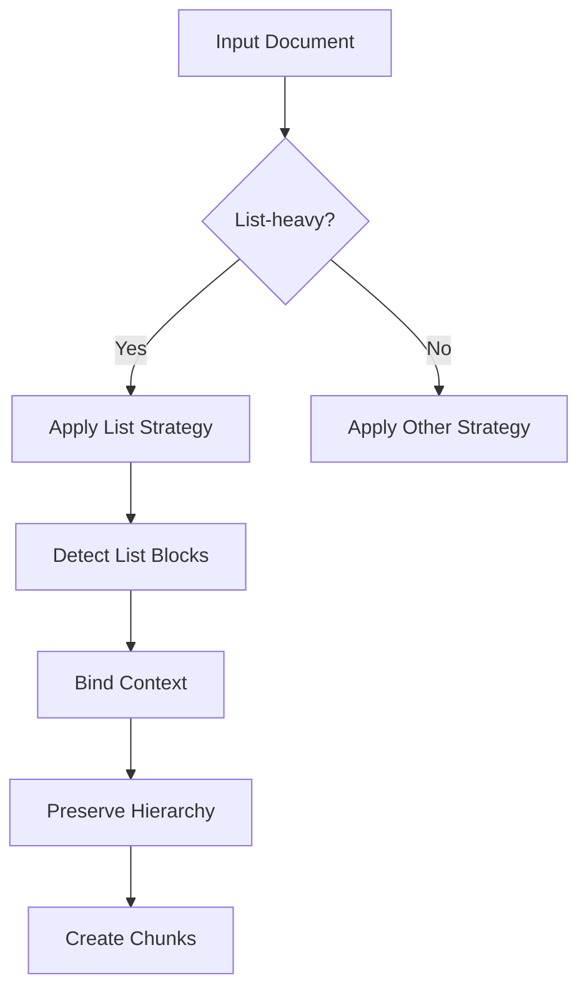
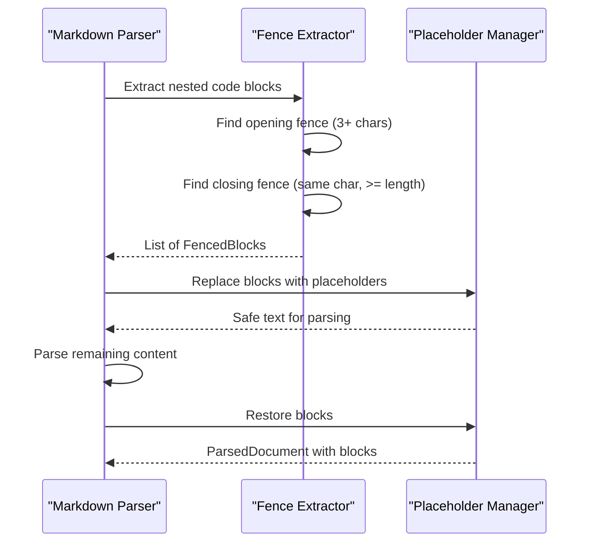
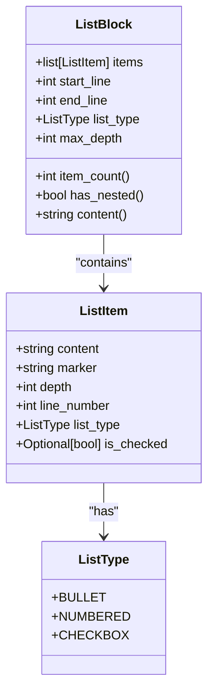
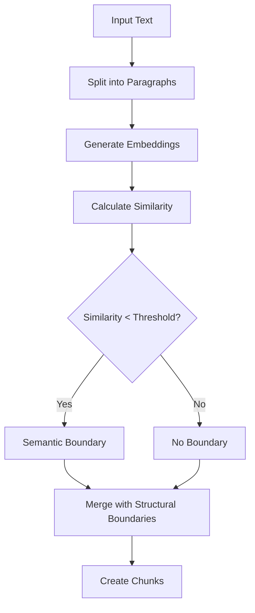
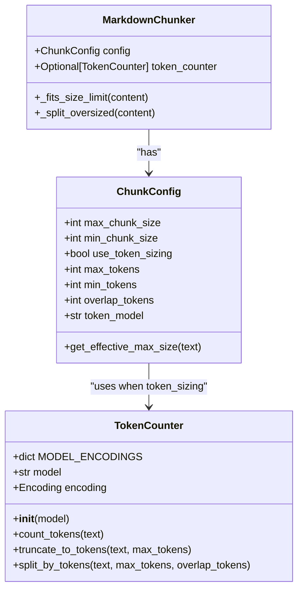
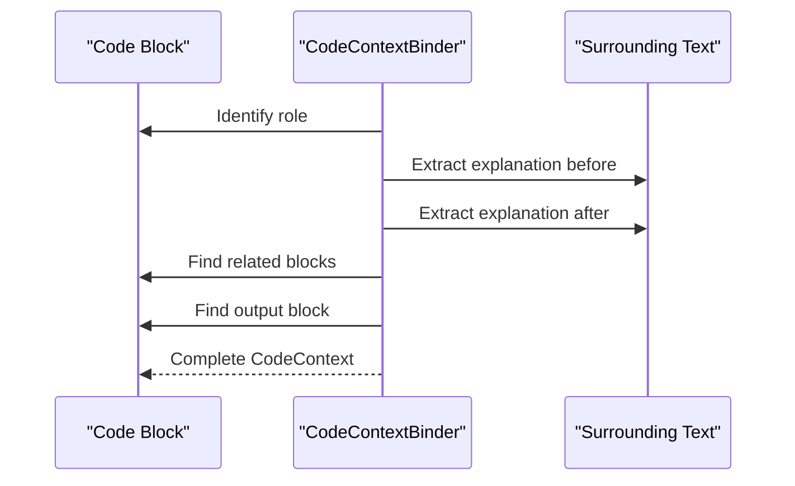
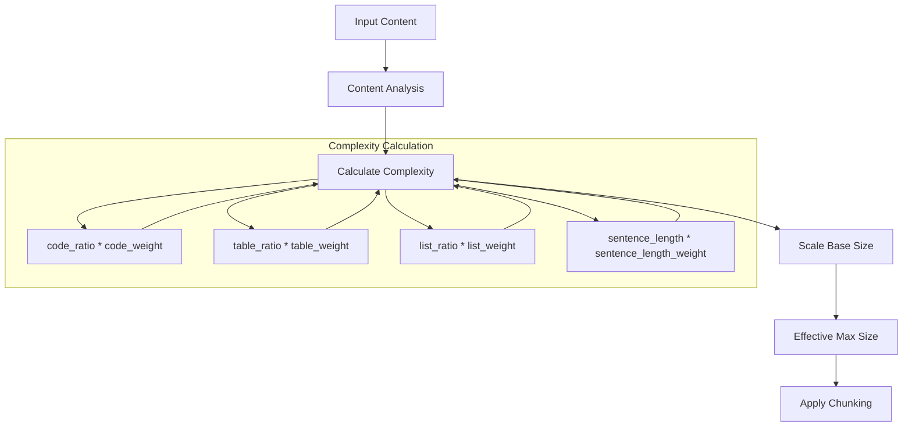
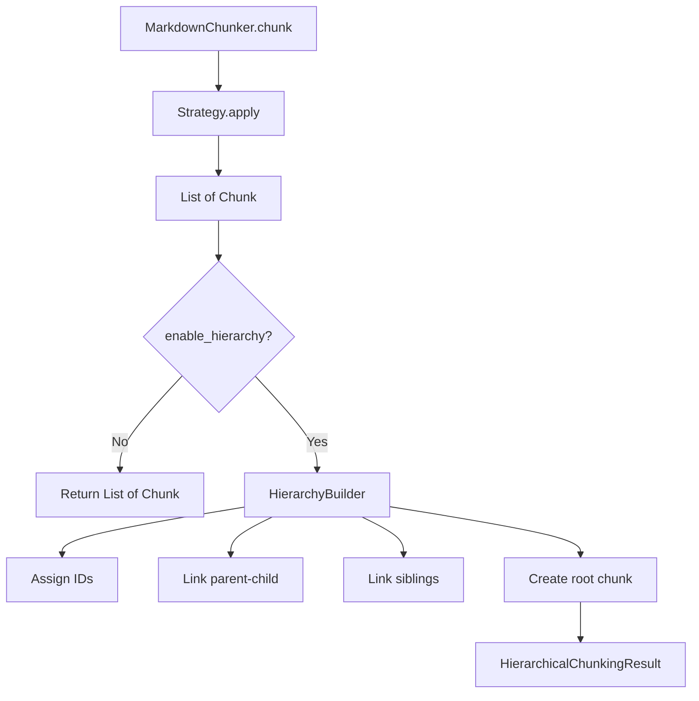
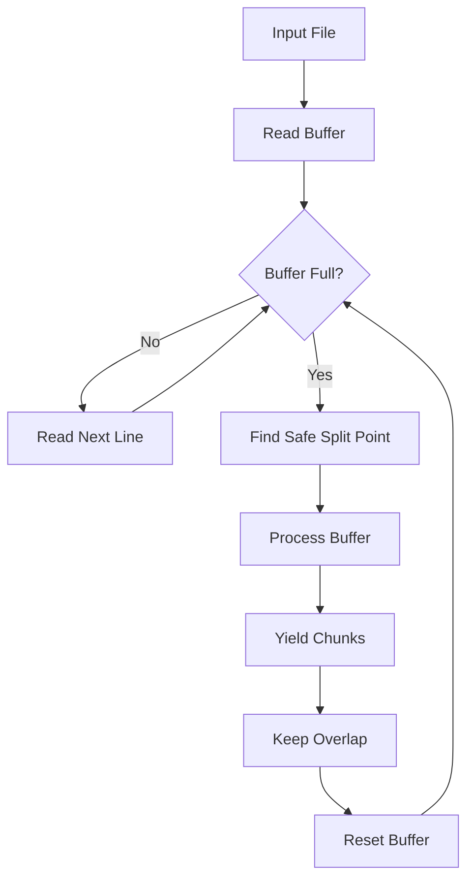
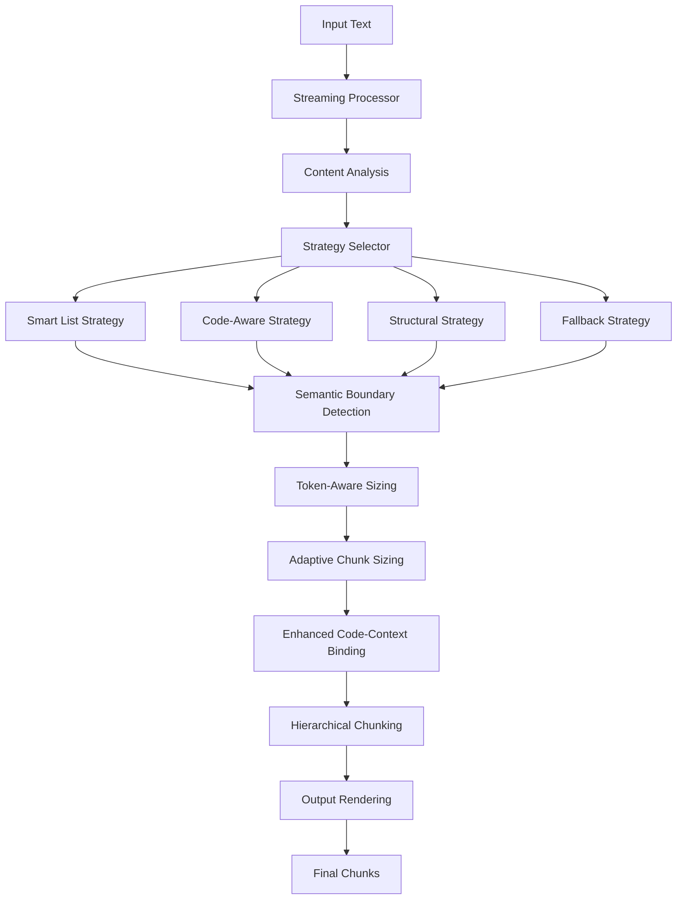

# Feature Research & Design

<cite>
**Referenced Files in This Document**   
- [01-smart-list-strategy.md](file://docs/research/features/01-smart-list-strategy.md)
- [02-nested-fencing-support.md](file://docs/research/features/02-nested-fencing-support.md)
- [03-list-detection-parser.md](file://docs/research/features/03-list-detection-parser.md)
- [04-semantic-boundary-detection.md](file://docs/research/features/04-semantic-boundary-detection.md)
- [05-token-aware-sizing.md](file://docs/research/features/05-token-aware-sizing.md)
- [06-enhanced-code-context-binding.md](file://docs/research/features/06-enhanced-code-context-binding.md)
- [09-adaptive-chunk-sizing.md](file://docs/research/features/09-adaptive-chunk-sizing.md)
- [11-hierarchical-chunking.md](file://docs/research/features/11-hierarchical-chunking.md)
- [14-streaming-processing.md](file://docs/research/features/14-streaming-processing.md)
- [adapter.py](file://adapter.py)
- [markdown_chunk_tool.yaml](file://tools/markdown_chunk_tool.yaml)
</cite>

## Table of Contents
1. [Introduction](#introduction)
2. [Smart List Strategy](#smart-list-strategy)
3. [Nested Fencing Support](#nested-fencing-support)
4. [List Detection Parser](#list-detection-parser)
5. [Semantic Boundary Detection](#semantic-boundary-detection)
6. [Token-Aware Sizing](#token-aware-sizing)
7. [Enhanced Code-Context Binding](#enhanced-code-context-binding)
8. [Adaptive Chunk Sizing](#adaptive-chunk-sizing)
9. [Hierarchical Chunking](#hierarchical-chunking)
10. [Streaming Processing](#streaming-processing)
11. [Feature Integration and Cohesion](#feature-integration-and-cohesion)

## Introduction
This document details the research and design process for core features of dify-markdown-chunker-1, a sophisticated Markdown chunking system designed for Retrieval-Augmented Generation (RAG) applications. The system addresses critical challenges in document processing by maintaining structural integrity, preserving semantic context, and optimizing chunk size for LLM context windows. The design process focused on creating a cohesive solution where multiple advanced features work in concert to produce high-quality chunks that enhance retrieval performance. Each feature was developed through rigorous technical investigation, prototyping, and validation, with careful consideration of implementation challenges and design trade-offs.

**Section sources**
- [01-smart-list-strategy.md](file://docs/research/features/01-smart-list-strategy.md#L1-L280)
- [02-nested-fencing-support.md](file://docs/research/features/02-nested-fencing-support.md#L1-L312)
- [04-semantic-boundary-detection.md](file://docs/research/features/04-semantic-boundary-detection.md#L1-L390)

## Smart List Strategy
The Smart List Strategy addresses the degradation in chunk quality for list-heavy documents that occurred when transitioning from the v1.x version (with 6 strategies) to v2.0 (with 3 strategies), which eliminated the dedicated List Strategy. This feature is critical for processing changelogs, feature lists, task lists, outlines, and checklists, which constitute 20-25% of the document corpus. The strategy is designed to activate when a document has a list ratio greater than 40% or contains five or more lists, ensuring it is applied only to appropriate content.

The implementation involves three key components: List Block Detection, Context Binding, and Hierarchy Preservation. List Block Detection identifies and structures list content with metadata including depth, item count, and list type. Context Binding ensures that a list's introductory paragraph is included in the same chunk, maintaining the relationship between explanation and items. Hierarchy Preservation guarantees that nested lists are never split across chunks, preserving the document's structural integrity. This approach significantly improves retrieval quality for list-heavy documents, with expected improvements of +25% in SCS (Semantic Coherence Score) and +15% in CPS (Chunk Precision Score).



**Diagram sources**
- [01-smart-list-strategy.md](file://docs/research/features/01-smart-list-strategy.md#L78-L107)

**Section sources**
- [01-smart-list-strategy.md](file://docs/research/features/01-smart-list-strategy.md#L1-L280)

## Nested Fencing Support
Nested Fencing Support is a unique differentiator that enables the correct parsing of nested code blocks using quadruple, quintuple backticks (`````, ``````) and tilde fencing (~~~~~). This capability is essential for processing documentation templates, meta-documentation, and tutorial-style content where code examples are shown within Markdown code blocks. No competitor (LangChain, LlamaIndex, Unstructured, Chonkie) currently handles this correctly, making this a significant competitive advantage.

The solution involves a robust parsing algorithm that extracts code blocks by identifying the opening fence (3+ backticks or tildes) and then searching for a closing fence with the same character and equal or greater length. This prevents premature closure when encountering nested fences. The implementation uses a `FencedBlock` data structure that captures the content, language, fence type, length, and line numbers. The parser first extracts all fenced blocks with nesting support, replaces them with placeholders, safely parses the remaining content, and then restores the blocks. This approach ensures that the document structure is preserved and that nested code blocks are handled correctly, even in edge cases like unmatched fences or indented fences.



**Diagram sources**
- [02-nested-fencing-support.md](file://docs/research/features/02-nested-fencing-support.md#L89-L143)

**Section sources**
- [02-nested-fencing-support.md](file://docs/research/features/02-nested-fencing-support.md#L1-L312)

## List Detection Parser
The List Detection Parser is a foundational component required for the Smart List Strategy to function. It extends the existing Markdown parser to extract information about lists, including their structure, hierarchy, and types. Without this capability, the system cannot identify list-heavy documents or preserve list context and hierarchy.

The parser introduces two key data structures: `ListItem` and `ListBlock`. `ListItem` captures individual list items with their content, marker, depth, line number, type (bullet, numbered, checkbox), and checkbox status. `ListBlock` represents a complete list with its items, start and end lines, predominant type, and maximum depth. The parsing algorithm uses regular expressions to identify list items and collects entire list blocks, handling continuation lines and empty lines that may separate list items.

This feature enables the calculation of critical metrics such as list ratio, list count, and maximum list depth, which are added to the `ContentAnalysis` class. These metrics are essential for strategy selection and adaptive chunking. The implementation is designed to be efficient with minimal performance overhead, using lazy parsing where possible. This parser is a prerequisite for the Smart List Strategy and enhances the overall metadata available for chunking decisions.



**Diagram sources**
- [03-list-detection-parser.md](file://docs/research/features/03-list-detection-parser.md#L51-L91)

**Section sources**
- [03-list-detection-parser.md](file://docs/research/features/03-list-detection-parser.md#L1-L380)

## Semantic Boundary Detection
Semantic Boundary Detection uses sentence embeddings to determine optimal chunk boundaries based on semantic transitions between paragraphs, significantly improving chunk quality. This addresses the limitation of structural and size-based chunking, which often separates semantically related paragraphs or combines unrelated ones.

The implementation uses the Sentence Transformers library with models like 'all-MiniLM-L6-v2' to generate embeddings for paragraphs. The system calculates cosine similarity between consecutive paragraph embeddings, and when the similarity falls below a configurable threshold (default 0.3), it identifies a semantic boundary. This approach is language-agnostic and works for any language supported by the embedding model.

The feature is integrated as an optional enhancement to the chunking process. When enabled, the system merges semantic boundaries with structural boundaries (headers, code blocks) to create final chunk boundaries. This optional design allows users to trade off between quality and performance, as embedding generation adds processing time. The system supports multiple models with different speed-quality trade-offs and includes optimizations like caching and batching to mitigate performance impact. This feature is expected to improve the overall SCS by 30-40% and retrieval precision by 10%.



**Diagram sources**
- [04-semantic-boundary-detection.md](file://docs/research/features/04-semantic-boundary-detection.md#L76-L147)

**Section sources**
- [04-semantic-boundary-detection.md](file://docs/research/features/04-semantic-boundary-detection.md#L1-L390)

## Token-Aware Sizing
Token-Aware Sizing addresses the mismatch between character-based chunk sizes and LLM token limits by sizing chunks based on actual token counts. This ensures precise alignment with the context windows of models like GPT-4, Claude, and others, which use different tokenization schemes.

The implementation uses the tiktoken library to count tokens for various LLM models, with a mapping from model names to tiktoken encodings (e.g., 'gpt-4' maps to 'cl100k_base'). The system supports both character-based and token-based sizing, with token-based sizing being optional. When enabled, the configuration specifies `max_tokens` instead of `max_chunk_size`, and the chunker uses the TokenCounter to ensure chunks do not exceed the token limit.

The design includes factory methods for popular models (GPT-4, Claude, embedding models) to simplify configuration. The feature is implemented as an optional dependency, allowing users to install tiktoken only when needed. This approach provides backward compatibility while enabling precise control over chunk size for different use cases, such as retrieval (256-512 tokens), summarization (1024-2048 tokens), or analysis (4096+ tokens). The token counting is very fast, adding negligible overhead to the chunking process.



**Diagram sources**
- [05-token-aware-sizing.md](file://docs/research/features/05-token-aware-sizing.md#L61-L130)

**Section sources**
- [05-token-aware-sizing.md](file://docs/research/features/05-token-aware-sizing.md#L1-L391)

## Enhanced Code-Context Binding
Enhanced Code-Context Binding improves the association of code blocks with their surrounding explanations, addressing user needs where code loses its context. This unique differentiator goes beyond basic context binding by intelligently determining the role of code blocks (example, setup, output, error, before/after) and grouping related blocks.

The implementation uses a `CodeContextBinder` that analyzes the surrounding text with regex patterns to determine the role of a code block. For example, text containing "first, you need to" or "install" suggests a setup block, while "output:" or "result:" indicates an output block. The binder also identifies related blocks, such as sequential examples or before/after patterns, and ensures they are grouped together.

This feature enhances the CodeAware Strategy by creating richer context for code blocks. It supports patterns like code-output (code block followed by its expected output) and before-after (showing code before and after a change). The system respects the `max_context_chars` configuration to prevent overly large chunks. This approach significantly improves retrieval quality for code-related questions, with expected improvements of +15% in code-related retrieval quality and context preservation.



**Diagram sources**
- [06-enhanced-code-context-binding.md](file://docs/research/features/06-enhanced-code-context-binding.md#L55-L145)

**Section sources**
- [06-enhanced-code-context-binding.md](file://docs/research/features/06-enhanced-code-context-binding.md#L1-L386)

## Adaptive Chunk Sizing
Adaptive Chunk Sizing automatically adjusts the chunk size based on content complexity and type, optimizing for different document characteristics. This feature recognizes that code-heavy content benefits from larger chunks (to preserve context), while simple text performs better with smaller chunks (for retrieval precision).

The implementation uses an `AdaptiveSizeCalculator` that computes a complexity score based on factors like code ratio, table ratio, list ratio, and average sentence length, weighted according to their importance. The complexity score scales the base chunk size between configurable minimum and maximum bounds (default 0.5x to 1.5x). For example, a code-heavy document with high complexity might have a chunk size of 2025 characters, while a simple text document with low complexity might have a chunk size of 975 characters.

The feature is optional and works with the existing chunking pipeline. The `ChunkConfig` class includes an `AdaptiveSizeConfig` with configurable weights and bounds. This approach provides a balance between retrieval precision and context preservation, with expected improvements of +7% in retrieval precision and +15% in code chunk quality. The system includes conservative defaults to prevent over-optimization and ensures predictable behavior.



**Diagram sources**
- [09-adaptive-chunk-sizing.md](file://docs/research/features/09-adaptive-chunk-sizing.md#L44-L94)

**Section sources**
- [09-adaptive-chunk-sizing.md](file://docs/research/features/09-adaptive-chunk-sizing.md#L1-L390)

## Hierarchical Chunking
Hierarchical Chunking creates a parent-child relationship between chunks, enabling multi-level retrieval and context navigation. This feature builds upon existing metadata like `header_path` and `header_level` to create a navigable hierarchy from document to section to subsection to paragraph.

The implementation extends the chunk metadata with fields like `chunk_id`, `parent_id`, `children_ids`, `prev_sibling_id`, `next_sibling_id`, and `hierarchy_level`. The `HierarchyBuilder` processes the flat list of chunks post-chunking to establish these relationships based on the `header_path`. It assigns IDs, links parent-child relationships, connects siblings, and creates a document-level root chunk with a summary.

The system provides a `HierarchicalChunkingResult` with navigation methods like `get_parent()`, `get_children()`, `get_ancestors()`, and `get_siblings()`, enabling rich retrieval patterns. For example, a query can return a detailed chunk along with its parent section context and sibling sections. The feature maintains backward compatibility by providing a `get_flat_chunks()` method that returns only leaf chunks. This approach enhances retrieval by providing context and enabling navigation, with the root chunk serving as a summary for overview questions.



**Diagram sources**
- [11-hierarchical-chunking.md](file://docs/research/features/11-hierarchical-chunking.md#L88-L100)

**Section sources**
- [11-hierarchical-chunking.md](file://docs/research/features/11-hierarchical-chunking.md#L1-L1099)

## Streaming Processing
Streaming Processing enables the chunking of large files (>10MB) with minimal memory usage by processing the document in chunks rather than loading it entirely into memory. This addresses memory issues with big documents and supports real-time ingestion scenarios.

The implementation uses a `StreamingChunker` that reads the input file in buffers (default 100KB) and processes each buffer independently. It finds safe split points at empty lines or between structural elements to avoid breaking code blocks, tables, or lists. The system maintains context between buffers by keeping an overlap of lines (default 20) from the previous buffer.

The chunker processes each buffer through the base chunking pipeline, adjusts chunk indices for streaming, and yields chunks immediately. This allows downstream systems to process chunks as they are generated, enabling real-time workflows. The feature includes async support via `AsyncStreamingChunker` for non-blocking I/O. The design ensures that streaming produces the same results as regular chunking where possible, maintaining consistency. This approach reduces peak memory usage from gigabytes to tens of megabytes, making it feasible to process very large documents on memory-constrained systems.



**Diagram sources**
- [14-streaming-processing.md](file://docs/research/features/14-streaming-processing.md#L48-L147)

**Section sources**
- [14-streaming-processing.md](file://docs/research/features/14-streaming-processing.md#L1-L467)

## Feature Integration and Cohesion
The core strength of dify-markdown-chunker-1 lies in the cohesive integration of its advanced features, creating a synergistic system greater than the sum of its parts. The features work together through a well-defined architecture and data flow, with each component enhancing the others. The system begins with comprehensive content analysis that informs strategy selection and adaptive sizing. The chosen strategy (e.g., List-Aware, Code-Aware) applies specialized chunking logic, while optional features like semantic boundary detection and token-aware sizing refine the process.

The adapter pattern, implemented in `adapter.py`, ensures backward compatibility while enabling advanced features. The two-stage processing pipeline (chunking + rendering) guarantees boundary invariance, meaning chunk boundaries do not depend on output formatting options like metadata inclusion. This separation of concerns allows for flexible output while maintaining consistent chunking behavior.

The hierarchical chunking feature integrates with all strategies by working post-hoc on the chunk list, using existing metadata to build the hierarchy. Similarly, streaming processing operates at the input layer, feeding content to the core chunking engine without affecting its logic. This modular design allows features to be enabled or disabled independently based on user needs and resource constraints.

The configuration system, exposed through `markdown_chunk_tool.yaml`, provides a user-friendly interface to control all features. Parameters like `enable_hierarchy`, `include_metadata`, and `strategy` allow users to tailor the behavior to their specific use case. The system's design prioritizes backward compatibility, performance, and usability, making it a robust solution for diverse RAG applications.



**Diagram sources**
- [adapter.py](file://adapter.py#L1-L352)
- [markdown_chunk_tool.yaml](file://tools/markdown_chunk_tool.yaml#L1-L178)

**Section sources**
- [adapter.py](file://adapter.py#L1-L352)
- [markdown_chunk_tool.yaml](file://tools/markdown_chunk_tool.yaml#L1-L178)