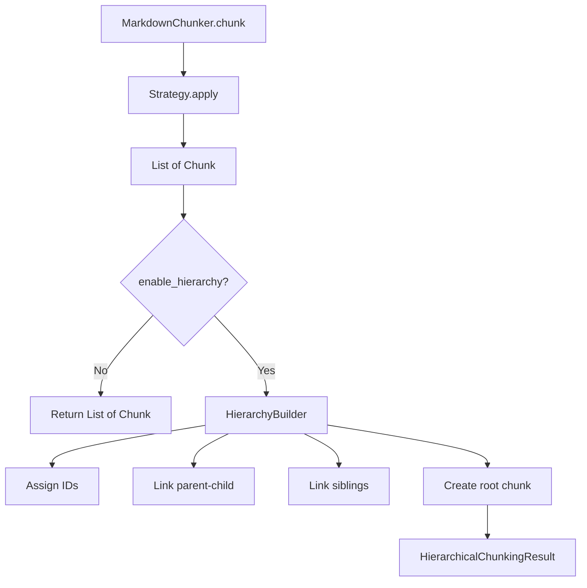
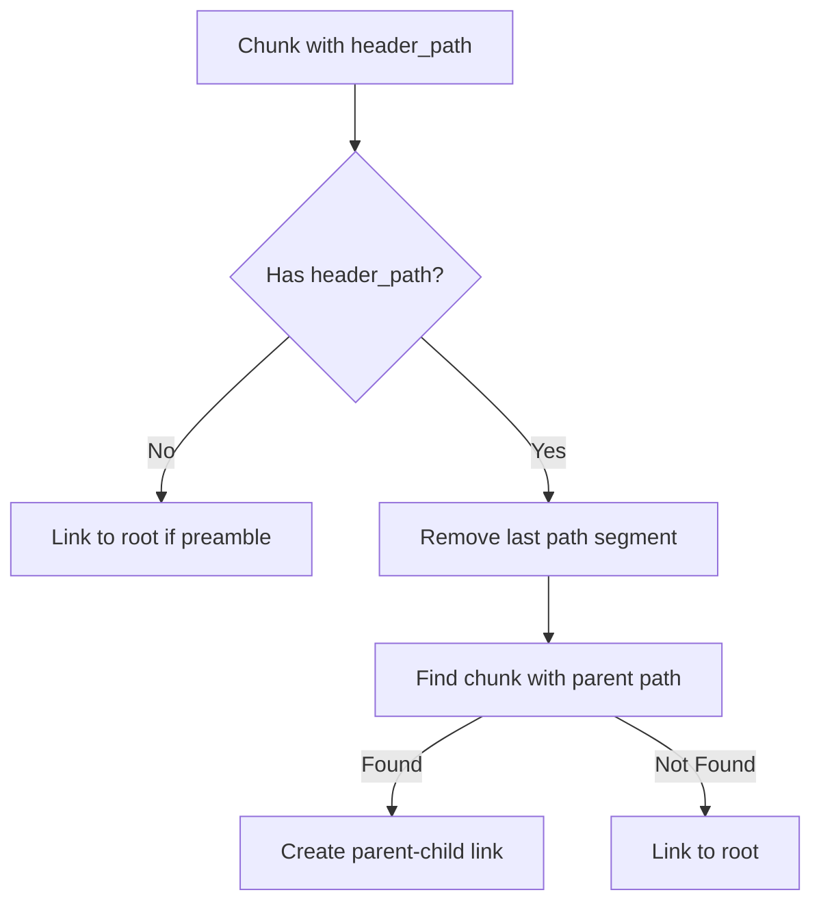
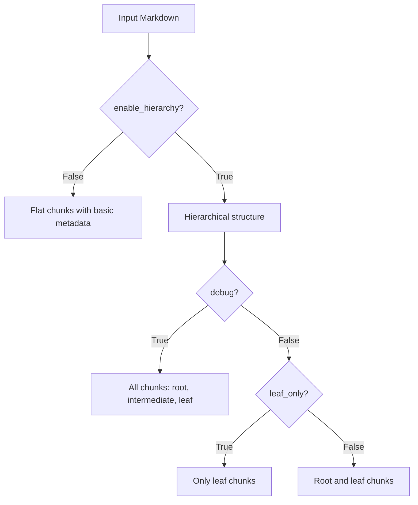

# Hierarchical Chunking

<cite>
**Referenced Files in This Document**   
- [11-hierarchical-chunking.md](file://docs/research/features/11-hierarchical-chunking.md)
- [types.md](file://docs/api/types.md)
- [configuration.md](file://docs/reference/configuration.md)
- [markdown_chunk_tool.yaml](file://tools/markdown_chunk_tool.yaml)
- [adapter.py](file://adapter.py)
</cite>

## Table of Contents
1. [Introduction](#introduction)
2. [Core Architecture](#core-architecture)
3. [Parent-Child Relationship Creation](#parent-child-relationship-creation)
4. [Header-Based Hierarchy Identification](#header-based-hierarchy-identification)
5. [Navigation and Context Retrieval](#navigation-and-context-retrieval)
6. [Metadata Enrichment and Configuration](#metadata-enrichment-and-configuration)
7. [Tree Structure Examples](#tree-structure-examples)
8. [Challenges in Complex Document Representation](#challenges-in-complex-document-representation)
9. [Troubleshooting Guide](#troubleshooting-guide)

## Introduction

The Hierarchical Chunking feature enables the creation of parent-child relationships between document chunks to preserve the original document structure during processing. This system analyzes Markdown documents and creates a hierarchical tree structure that maintains the relationships between sections, subsections, and content elements. The feature builds upon existing structural metadata like `header_path` and `header_level` to establish navigation links between chunks, allowing downstream applications to traverse the document hierarchy for improved context retrieval and multi-level navigation.

The implementation extends the existing chunking system by adding hierarchical metadata fields to chunks without creating a new chunk type. This approach ensures backward compatibility while enabling advanced navigation capabilities. The system supports various chunking strategies and works post-hoc on any chunked output, making it compatible with the project's multi-strategy architecture.

**Section sources**
- [11-hierarchical-chunking.md](file://docs/research/features/11-hierarchical-chunking.md#L1-L100)

## Core Architecture

The hierarchical chunking system follows a post-processing architecture that transforms flat chunk lists into hierarchical structures. The core components include the `HierarchyBuilder` class, `HierarchicalChunkingResult` wrapper, and enhanced metadata fields that enable navigation between related chunks.



The `HierarchicalChunkingResult` class serves as a container for the hierarchical structure, providing navigation methods while maintaining references to the original chunks. It includes an internal index for O(1) lookup performance and methods for traversing the hierarchy in various ways.

**Diagram sources**
- [11-hierarchical-chunking.md](file://docs/research/features/11-hierarchical-chunking.md#L88-L100)

**Section sources**
- [11-hierarchical-chunking.md](file://docs/research/features/11-hierarchical-chunking.md#L104-L235)
- [types.md](file://docs/api/types.md#L442-L486)

## Parent-Child Relationship Creation

The system creates parent-child relationships between chunks by analyzing the existing `header_path` metadata and establishing bidirectional links through ID references. Each chunk receives additional metadata fields that define its position in the hierarchy:

```python
HIERARCHY_METADATA_FIELDS = {
    "chunk_id": str,
    "parent_id": Optional[str],
    "children_ids": List[str],
    "prev_sibling_id": Optional[str],
    "next_sibling_id": Optional[str],
    "hierarchy_level": int,
    "is_leaf": bool,
}
```

The `HierarchyBuilder` class processes the chunks in several phases:
1. Assigns unique 8-character hash IDs to all chunks (instead of UUIDs to minimize storage overhead)
2. Creates a document-level root chunk containing a summary of the document
3. Builds parent-child links by analyzing header paths
4. Establishes sibling relationships based on document order
5. Assigns hierarchy levels based on header depth
6. Marks leaf chunks (those without children)

The parent-child linking algorithm uses the `header_path` (formatted as `/Level1/Level2/Level3`) to determine relationships. A chunk is considered a child of another if its header path starts with the parent's path plus a forward slash. This approach leverages existing metadata rather than duplicating structural information.

**Section sources**
- [11-hierarchical-chunking.md](file://docs/research/features/11-hierarchical-chunking.md#L237-L451)

## Header-Based Hierarchy Identification

The system identifies section hierarchies through header levels and structural patterns in the Markdown document. It uses the existing `header_level` metadata (1-6 corresponding to # through ######) and `header_path` to determine the document structure.

The algorithm for building parent-child links analyzes the header path hierarchy:



For sibling relationships, chunks with the same parent are grouped and sorted by their `start_line` position in the original document. This ensures that navigation between siblings follows the document's natural reading order.

The hierarchy levels are mapped as follows:
- Level 0: Document (root chunk)
- Level 1: Section (H1 headers)
- Level 2: Subsection (H2 headers)
- Level 3: Paragraph (H3+ headers and content)

This mapping collapses deeper header levels (H4-H6) into the paragraph level while preserving the full path information in the `header_path` metadata.

**Section sources**
- [11-hierarchical-chunking.md](file://docs/research/features/11-hierarchical-chunking.md#L361-L451)

## Navigation and Context Retrieval

Hierarchical relationships enable sophisticated navigation and context retrieval in downstream applications. The `HierarchicalChunkingResult` provides several methods for traversing the document structure:

```python
def get_chunk(chunk_id: str) -> Optional[Chunk]          # O(1) lookup by ID
def get_children(chunk_id: str) -> List[Chunk]           # Get direct children
def get_parent(chunk_id: str) -> Optional[Chunk]         # Get immediate parent
def get_ancestors(chunk_id: str) -> List[Chunk]          # Get all ancestors to root
def get_siblings(chunk_id: str) -> List[Chunk]           # Get siblings including self
def get_flat_chunks() -> List[Chunk]                     # Get only leaf chunks
def get_by_level(level: int) -> List[Chunk]              # Get chunks at specific level
def to_tree_dict() -> Dict                               # Serialize hierarchy
```

These methods enable various use cases:
- **Multi-level retrieval**: Applications can request chunks at different hierarchy levels based on query specificity
- **Context enrichment**: When retrieving a detailed chunk, applications can also retrieve its parent sections for context
- **Breadcrumb navigation**: The `get_ancestors` method provides a path from any chunk back to the document root
- **Table of contents generation**: The hierarchy can be used to generate structured summaries
- **Section exploration**: Users can explore all content within a specific section using `get_children`

The system maintains backward compatibility by providing the `get_flat_chunks()` method, which returns only leaf chunks (those without children) for applications that expect a flat structure.

**Section sources**
- [11-hierarchical-chunking.md](file://docs/research/features/11-hierarchical-chunking.md#L131-L235)
- [types.md](file://docs/api/types.md#L442-L486)

## Metadata Enrichment and Configuration

The hierarchical chunking feature integrates with metadata enrichment and provides configuration options for controlling hierarchy depth and output format. The system can be enabled through the `enable_hierarchy` parameter in the tool configuration.

### Configuration Options

| Parameter | Type | Default | Description |
|---------|------|---------|-------------|
| `enable_hierarchy` | boolean | false | Enable parent-child relationships between chunks |
| `debug` | boolean | false | Include all chunks (root, intermediate, leaf) in output |
| `leaf_only` | boolean | false | Return only leaf chunks in hierarchical mode |
| `max_chunk_size` | number | 4096 | Maximum size of each chunk in characters |
| `chunk_overlap` | number | 200 | Characters to overlap between chunks |

When `enable_hierarchy` is set to true, the system returns a hierarchical structure with navigation metadata. The `debug` parameter controls whether all chunks (including structural nodes) are returned, while `leaf_only` filters the output to contain only content chunks suitable for vector database indexing.

The hierarchical metadata fields are designed to minimize storage overhead:
- 8-character hash IDs instead of 36-character UUIDs
- Optional inclusion of intermediate nodes
- Efficient tree serialization that avoids circular references



**Section sources**
- [configuration.md](file://docs/reference/configuration.md#L23-L46)
- [markdown_chunk_tool.yaml](file://tools/markdown_chunk_tool.yaml#L124-L158)
- [adapter.py](file://adapter.py#L121-L130)

## Tree Structure Examples

The hierarchical chunking system generates tree structures from technical documentation that preserve the original document organization. For example, a document with the following structure:

```markdown
# Document Title
## Section 1
### Subsection 1.1
Content here
## Section 2
### Subsection 2.1
More content
```

Would produce a tree structure like:

```json
{
  "id": "a3f9d21c",
  "content_preview": "# Document Title...",
  "header_path": "/Document Title",
  "level": 0,
  "children": [
    {
      "id": "7b2e4f18",
      "content_preview": "## Section 1...",
      "header_path": "/Document Title/Section 1",
      "level": 1,
      "children": [
        {
          "id": "c4e8f90d",
          "content_preview": "### Subsection 1.1...",
          "header_path": "/Document Title/Section 1/Subsection 1.1",
          "level": 2,
          "children": []
        }
      ]
    },
    {
      "id": "91d3a7f2",
      "content_preview": "## Section 2...",
      "header_path": "/Document Title/Section 2",
      "level": 1,
      "children": [
        {
          "id": "e5a2b8d3",
          "content_preview": "### Subsection 2.1...",
          "header_path": "/Document Title/Section 2/Subsection 2.1",
          "level": 2,
          "children": []
        }
      ]
    }
  ]
}
```

The `to_tree_dict()` method serializes the hierarchy into this JSON-compatible format, using IDs to avoid circular references. This structure can be used for visualization, navigation interfaces, or as input to downstream applications that benefit from understanding the document's organization.

**Section sources**
- [11-hierarchical-chunking.md](file://docs/research/features/11-hierarchical-chunking.md#L214-L234)
- [types.md](file://docs/api/types.md#L535-L549)

## Challenges in Complex Document Representation

The hierarchical chunking system addresses several challenges in representing complex document structures:

### Architectural Challenges

| Challenge | Solution |
|---------|----------|
| **Duplication with header_path** | Use existing `header_path` as the foundation for hierarchy building |
| **Multi-strategy architecture** | HierarchyBuilder works post-hoc on any chunking strategy output |
| **Circular references** | Use ID references instead of object references to avoid circular dependencies |
| **Preamble handling** | Special handling for content before the first header using `/__preamble__` path |
| **Deep hierarchies** | Map H3+ headers to paragraph level while preserving full path information |

### Performance Challenges

| Challenge | Solution |
|---------|----------|
| **O(n²) chunk lookup** | Internal index (`_index: Dict[str, Chunk]`) for O(1) lookups |
| **Large documents** | Lazy loading and pagination for documents with many headers |
| **Memory usage** | Root chunk contains only a summary, not duplicated content |

### Edge Cases

The system handles various edge cases:
- **Documents without headers**: Creates a root chunk with a summary and treats content as leaf chunks
- **Documents with only headers**: Creates sibling relationships between header chunks
- **Multiple chunks with same header_path**: Occurs when large sections are split; chunks become siblings
- **Mixed chunking strategies**: Uses header_path as the primary guide for hierarchy construction
- **Empty documents**: Returns empty chunk list without errors

The implementation includes comprehensive testing for these edge cases to ensure robustness across diverse document types.

**Section sources**
- [11-hierarchical-chunking.md](file://docs/research/features/11-hierarchical-chunking.md#L602-L650)

## Troubleshooting Guide

When encountering issues with hierarchical chunking, consider the following troubleshooting steps:

### Common Issues and Solutions

| Issue | Diagnosis | Solution |
|------|-----------|----------|
| **Missing parent-child links** | Check if chunks have valid `header_path` metadata | Ensure the source document has proper header structure |
| **Incorrect hierarchy levels** | Verify `header_level` values in chunk metadata | Process document with structural strategy for accurate header detection |
| **Performance degradation** | Monitor processing time for large documents | Enable debug mode to identify bottlenecks; consider using flat chunking for simple use cases |
| **Missing root chunk** | Confirm `enable_hierarchy` is set to true | Check configuration parameters in tool settings |
| **Sibling order incorrect** | Verify chunks are sorted by `start_line` | Ensure the chunking process preserves document order |

### Configuration Tips

- For vector database indexing, use `leaf_only: true` to exclude structural headers
- For navigation interfaces, use `debug: true` to access all hierarchy levels
- When troubleshooting, compare hierarchical output with flat chunking to isolate issues
- Use the `get_flat_chunks()` method to maintain compatibility with existing RAG pipelines

### Validation Steps

1. Verify the input document has proper Markdown headers
2. Check that `enable_hierarchy` is enabled in the configuration
3. Confirm the chunking strategy preserves structural elements
4. Test with a simple document first before processing complex files
5. Use the `to_tree_dict()` method to visualize the hierarchy structure

The system includes invariant tests that verify hierarchy correctness, including checks for valid parent-child relationships, proper ID references, and consistent sibling ordering.

**Section sources**
- [11-hierarchical-chunking.md](file://docs/research/features/11-hierarchical-chunking.md#L654-L869)
- [configuration.md](file://docs/reference/configuration.md#L504-L530)