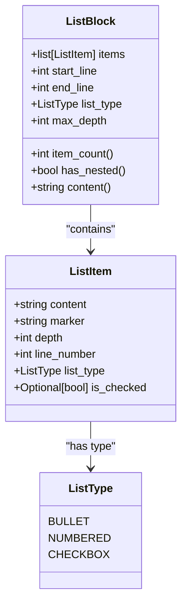
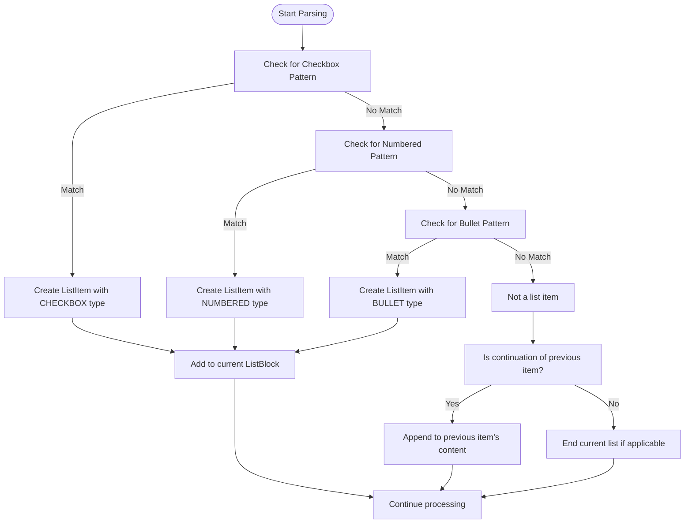
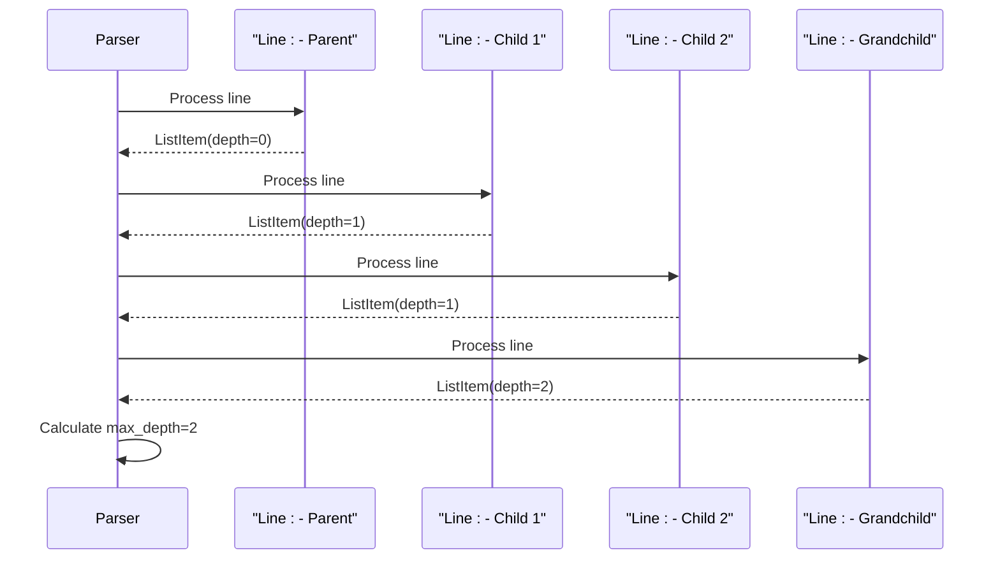
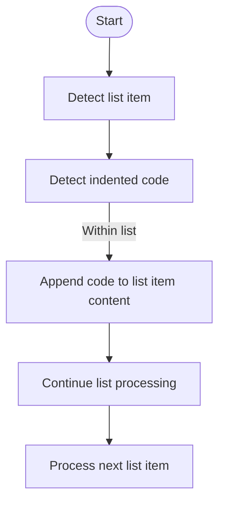
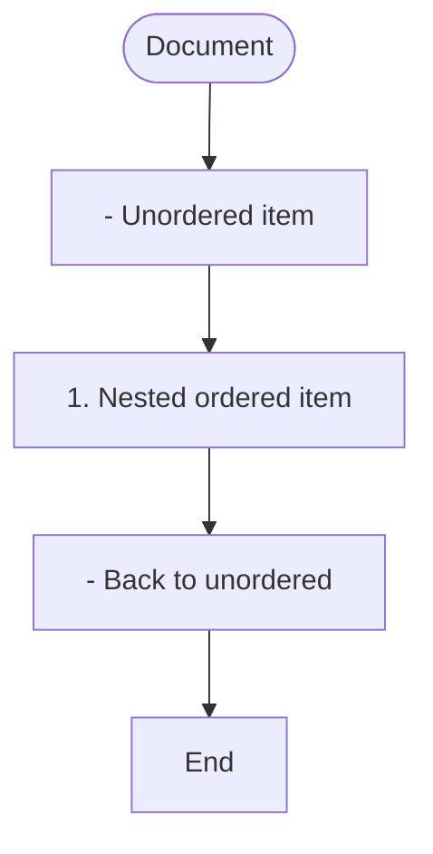
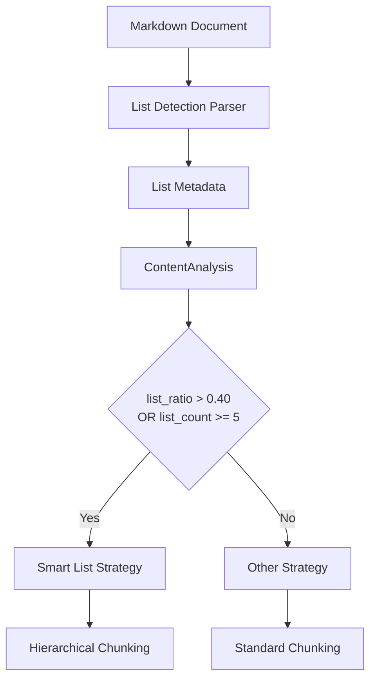

# List Detection Parser

<cite>
**Referenced Files in This Document**   
- [03-list-detection-parser.md](file://docs/research/features/03-list-detection-parser.md)
- [01-smart-list-strategy.md](file://docs/research/features/01-smart-list-strategy.md)
- [algorithms-ru.md](file://docs/reference/algorithms-ru.md)
- [simple_list.md](file://tests/parser/fixtures/basic/simple_list.md)
- [list_in_list.md](file://tests/parser/fixtures/nested/list_in_list.md)
- [task_list.md](file://tests/parser/fixtures/edge_cases/task_list.md)
- [mixed_list_types.md](file://tests/parser/fixtures/edge_cases/mixed_list_types.md)
- [list_with_code.md](file://tests/parser/fixtures/nested/list_with_code.md)
</cite>

## Table of Contents
1. [Introduction](#introduction)
2. [Core Functionality](#core-functionality)
3. [Data Model](#data-model)
4. [Parsing Rules](#parsing-rules)
5. [Hierarchy Detection](#hierarchy-detection)
6. [Edge Case Handling](#edge-case-handling)
7. [Integration with Smart List Strategy](#integration-with-smart-list-strategy)
8. [Parser Output Examples](#parser-output-examples)
9. [Limitations](#limitations)
10. [Troubleshooting](#troubleshooting)

## Introduction

The List Detection Parser is a specialized component responsible for identifying and analyzing list structures within Markdown documents at the Abstract Syntax Tree (AST) level. This parser extracts comprehensive metadata about lists to inform chunking decisions in the hierarchical chunking system. The component plays a critical role in enabling the Smart List Strategy by providing detailed information about list types, hierarchy, and distribution throughout the document.

The parser was developed to address the absence of list detection capabilities in the previous version of the markdown chunker, which prevented optimal processing of list-heavy documents such as changelogs, feature lists, outlines, and checklists. By implementing this parser, the system can now identify list structures and leverage this information for more intelligent chunking strategies.

**Section sources**
- [03-list-detection-parser.md](file://docs/research/features/03-list-detection-parser.md#L1-L380)
- [01-smart-list-strategy.md](file://docs/research/features/01-smart-list-strategy.md#L1-L280)

## Core Functionality

The List Detection Parser identifies list structures by analyzing the document line by line and applying pattern matching to detect list items. The parser extracts metadata that informs the chunking system about the presence, type, and structure of lists within the document. This information is crucial for determining whether the Smart List Strategy should be applied to a particular document.

The parser operates by scanning the document for list item patterns and collecting them into cohesive list blocks. Each list block contains metadata about the list's characteristics, including its type, depth, and item count. This metadata is then used by the content analysis system to calculate metrics such as list ratio, which determines if a document qualifies as "list-heavy."

The parser supports three primary list types:
- Bullet lists (using -, *, or + markers)
- Numbered lists (using numeric markers followed by a period)
- Checkbox lists (using task list syntax with [ ] or [x])

**Section sources**
- [03-list-detection-parser.md](file://docs/research/features/03-list-detection-parser.md#L47-L91)
- [03-list-detection-parser.md](file://docs/research/features/03-list-detection-parser.md#L93-L216)

## Data Model

The List Detection Parser uses a structured data model to represent list elements and their relationships. The model consists of two primary classes: `ListItem` and `ListBlock`, which capture the essential characteristics of list structures in Markdown documents.



**Diagram sources**
- [03-list-detection-parser.md](file://docs/research/features/03-list-detection-parser.md#L56-L90)

The `ListItem` class represents an individual item within a list and contains the following properties:
- **content**: The text content of the list item, excluding the marker
- **marker**: The original marker used for the list item (e.g., "-", "1.", "- [x]")
- **depth**: The level of indentation or nesting (0 for top-level items)
- **line_number**: The line number in the source document where the item appears
- **list_type**: The type of list (bullet, numbered, or checkbox)
- **is_checked**: For checkbox lists, indicates whether the item is checked (True), unchecked (False), or not applicable (None)

The `ListBlock` class represents a complete list structure and contains:
- **items**: An ordered collection of ListItem objects that comprise the list
- **start_line** and **end_line**: The line numbers marking the beginning and end of the list in the source document
- **list_type**: The predominant type of list (determined by counting the frequency of each type within the block)
- **max_depth**: The maximum nesting level found within the list
- **item_count**: A property that returns the total number of items in the list
- **has_nested**: A property that indicates whether the list contains nested items (depth > 0)
- **content**: A property that reconstructs the original Markdown representation of the list

**Section sources**
- [03-list-detection-parser.md](file://docs/research/features/03-list-detection-parser.md#L51-L91)

## Parsing Rules

The List Detection Parser employs a set of regular expression patterns to identify different types of list items in Markdown documents. The parsing rules are designed to handle various Markdown flavors and ensure accurate detection of list structures.



**Diagram sources**
- [03-list-detection-parser.md](file://docs/research/features/03-list-detection-parser.md#L98-L100)
- [03-list-detection-parser.md](file://docs/research/features/03-list-detection-parser.md#L121-L167)

The parser uses the following regular expression patterns to detect list items:

**Bullet Lists**: `r'^(\s*)([-*+])\s+(.+)$'`
- Matches lines that begin with optional whitespace followed by a bullet marker (-, *, or +) and content
- The depth is calculated based on the amount of leading whitespace (2 spaces = 1 level of depth)
- Example: `- Item 1`, `* Item 2`, `+ Item 3`

**Numbered Lists**: `r'^(\s*)(\d+\.)\s+(.+)$'`
- Matches lines that begin with optional whitespace followed by a number and period, then content
- Supports any numeric sequence (1., 2., 3., etc.)
- Example: `1. First item`, `2. Second item`

**Checkbox Lists**: `r'^(\s*)([-*+])\s+\[([ xX])\]\s+(.+)$'`
- Matches task list syntax with checkboxes
- The checkbox state is captured and converted to a boolean value
- Processed first since checkbox lists are a subset of bullet lists
- Example: `- [ ] Unchecked`, `- [x] Checked`

The parser processes the document sequentially, identifying list items and grouping them into cohesive list blocks. When a list item is detected, the parser collects all subsequent lines that belong to the same list block, including continuation lines that represent wrapped content.

**Section sources**
- [03-list-detection-parser.md](file://docs/research/features/03-list-detection-parser.md#L98-L100)
- [03-list-detection-parser.md](file://docs/research/features/03-list-detection-parser.md#L121-L167)

## Hierarchy Detection

The List Detection Parser identifies hierarchical relationships within nested lists by analyzing indentation levels. The parser calculates the depth of each list item based on the amount of leading whitespace, with each 2-space increment representing one level of nesting.



**Diagram sources**
- [03-list-detection-parser.md](file://docs/research/features/03-list-detection-parser.md#L135-L136)
- [03-list-detection-parser.md](file://docs/research/features/03-list-detection-parser.md#L194-L195)

The hierarchy detection algorithm works as follows:
1. For each line, the parser calculates the depth by dividing the number of leading spaces by 2
2. The maximum depth encountered within a list block is stored in the ListBlock object
3. When processing continuation lines (non-empty lines that don't match list patterns but follow a list item), the content is appended to the most recent list item
4. Empty lines may terminate a list block unless followed by another list item at the same or higher level

The parser handles mixed list types within nested structures, such as a bullet list containing a nested numbered list. In such cases, the parser maintains the hierarchical relationship between items while preserving their individual types.

**Section sources**
- [03-list-detection-parser.md](file://docs/research/features/03-list-detection-parser.md#L135-L136)
- [03-list-detection-parser.md](file://docs/research/features/03-list-detection-parser.md#L179-L202)

## Edge Case Handling

The List Detection Parser includes specific logic to handle various edge cases that commonly occur in Markdown documents with list structures. These edge cases include indented code within lists, mixed list types, and continuation lines.

### Indented Code Within Lists

When code blocks appear within lists, the parser must distinguish between code content and list item content. The parser handles this by treating indented code as part of the preceding list item's content.



**Diagram sources**
- [list_with_code.md](file://tests/parser/fixtures/nested/list_with_code.md#L1-L16)

### Mixed List Types

The parser handles documents containing multiple list types by identifying each list block separately and determining the predominant type for each block.



**Diagram sources**
- [mixed_list_types.md](file://tests/parser/fixtures/edge_cases/mixed_list_types.md#L1-L7)

### Continuation Lines

For list items with multi-line content, the parser appends non-list lines that follow a list item to the content of that item, preserving the logical grouping of information.

The parser also handles checkbox lists with various formatting, including both lowercase and uppercase X characters to indicate checked items. Empty lines within lists are handled by checking if the next non-empty line continues the list structure, allowing for intentional spacing within list blocks.

**Section sources**
- [list_with_code.md](file://tests/parser/fixtures/nested/list_with_code.md#L1-L16)
- [mixed_list_types.md](file://tests/parser/fixtures/edge_cases/mixed_list_types.md#L1-L7)
- [task_list.md](file://tests/parser/fixtures/edge_cases/task_list.md#L1-L6)

## Integration with Smart List Strategy

The List Detection Parser integrates with the Smart List Strategy by providing the necessary metadata for strategy selection and chunking decisions. The extracted list information enables the system to identify list-heavy documents and apply appropriate chunking logic.



**Diagram sources**
- [03-list-detection-parser.md](file://docs/research/features/03-list-detection-parser.md#L229-L238)
- [01-smart-list-strategy.md](file://docs/research/features/01-smart-list-strategy.md#L88-L92)

The integration works as follows:
1. The List Detection Parser analyzes the document and extracts list metadata
2. This metadata is incorporated into the ContentAnalysis object, adding fields such as list_count, list_item_count, list_ratio, max_list_depth, and has_checkbox_lists
3. The strategy selector evaluates the content analysis results and activates the Smart List Strategy if the document meets the criteria (list_ratio > 0.40 or list_count >= 5)
4. The Smart List Strategy uses the hierarchical information to preserve nested list structures during chunking

The parser's output enables the Smart List Strategy to maintain the integrity of list structures by ensuring that related items remain together in the same chunk and that hierarchical relationships are preserved.

**Section sources**
- [03-list-detection-parser.md](file://docs/research/features/03-list-detection-parser.md#L229-L238)
- [01-smart-list-strategy.md](file://docs/research/features/01-smart-list-strategy.md#L88-L92)

## Parser Output Examples

The List Detection Parser produces structured output for various list configurations, which can be observed in the test fixtures provided in the codebase.

### Simple List Example

For a basic bullet list:
```
- Item 1
- Item 2
- Item 3
```

The parser output would be a single ListBlock containing three ListItem objects, each with depth=0 and list_type=BULLET.

**Section sources**
- [simple_list.md](file://tests/parser/fixtures/basic/simple_list.md#L1-L3)

### Nested List Example

For a nested list structure:
```
- Outer item 1
  - Inner item 1.1
  - Inner item 1.2
- Outer item 2
  - Inner item 2.1
    - Deep item 2.1.1
```

The parser would create a ListBlock with a max_depth of 2, containing five ListItem objects with appropriate depth values (0 for outer items, 1 for inner items, and 2 for the deep item).

**Section sources**
- [list_in_list.md](file://tests/parser/fixtures/nested/list_in_list.md#L1-L8)

### Checkbox List Example

For a task list:
```
- [ ] Uncompleted task
- [x] Completed task
- [X] Also completed
```

The parser would create a ListBlock with list_type=CHECKBOX, containing three ListItem objects with is_checked values of False, True, and True respectively.

**Section sources**
- [task_list.md](file://tests/parser/fixtures/edge_cases/task_list.md#L1-L4)

## Limitations

The List Detection Parser has several limitations that are important to understand when processing Markdown documents:

1. **Tab vs Space Indentation**: The parser assumes 2-space indentation increments for depth calculation. Documents using tabs or different space counts may not be parsed correctly.

2. **Complex Nested Structures**: While the parser handles basic nested lists, extremely complex nesting patterns with mixed list types at multiple levels may not be fully preserved.

3. **Edge Cases with Code Blocks**: When code blocks contain list-like patterns, there is a potential for false positives, although the parser generally handles indented code within lists correctly.

4. **List Continuation Logic**: The parser's handling of continuation lines assumes that non-list lines following a list item belong to that item, which may not always be the intended structure.

5. **Performance**: While the performance impact is minimal, processing documents with a very high density of lists may introduce slight overhead.

These limitations are mitigated through comprehensive testing and the use of well-defined parsing rules that cover the majority of common Markdown list patterns.

**Section sources**
- [03-list-detection-parser.md](file://docs/research/features/03-list-detection-parser.md#L331-L334)

## Troubleshooting

When encountering issues with list detection, consider the following troubleshooting steps:

1. **Verify Indentation**: Ensure that list indentation uses spaces rather than tabs, with consistent 2-space increments for each level of nesting.

2. **Check List Markers**: Confirm that list markers are properly formatted with a space after the marker (e.g., "- Item" not "-Item").

3. **Examine Empty Lines**: Be aware that empty lines may terminate list blocks unless followed by another list item at the same or higher level.

4. **Review Mixed Content**: For lists containing code blocks or other Markdown elements, ensure proper spacing and formatting to avoid parsing ambiguities.

5. **Validate Checkbox Syntax**: Ensure checkbox lists use the correct syntax with spaces: "- [ ]" for unchecked and "- [x]" for checked items.

6. **Test with Examples**: Compare problematic documents with the test fixtures in the codebase to identify formatting differences.

The parser's behavior can be validated using the unit tests provided in the test suite, which cover various list configurations and edge cases.

**Section sources**
- [03-list-detection-parser.md](file://docs/research/features/03-list-detection-parser.md#L248-L291)
- [simple_list.md](file://tests/parser/fixtures/basic/simple_list.md#L1-L10)
- [list_in_list.md](file://tests/parser/fixtures/nested/list_in_list.md#L1-L8)
- [task_list.md](file://tests/parser/fixtures/edge_cases/task_list.md#L1-L6)