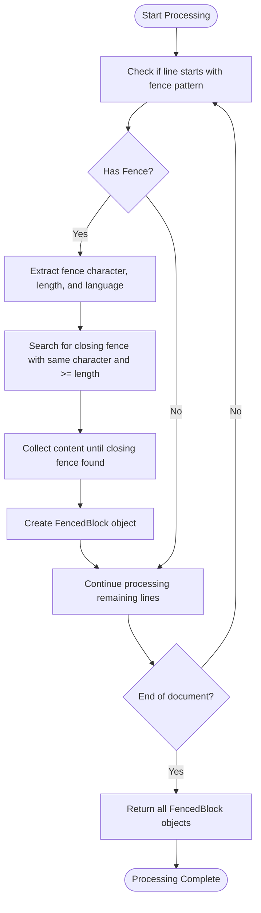
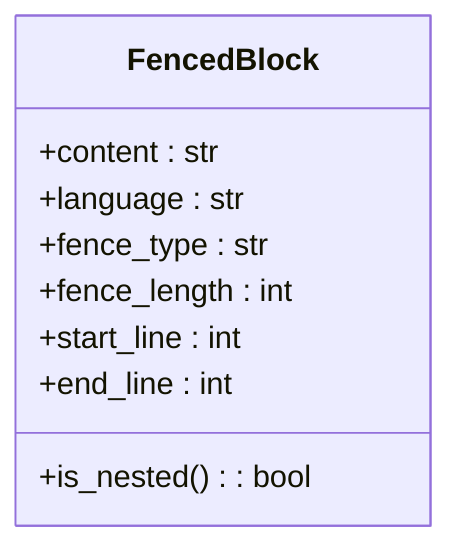
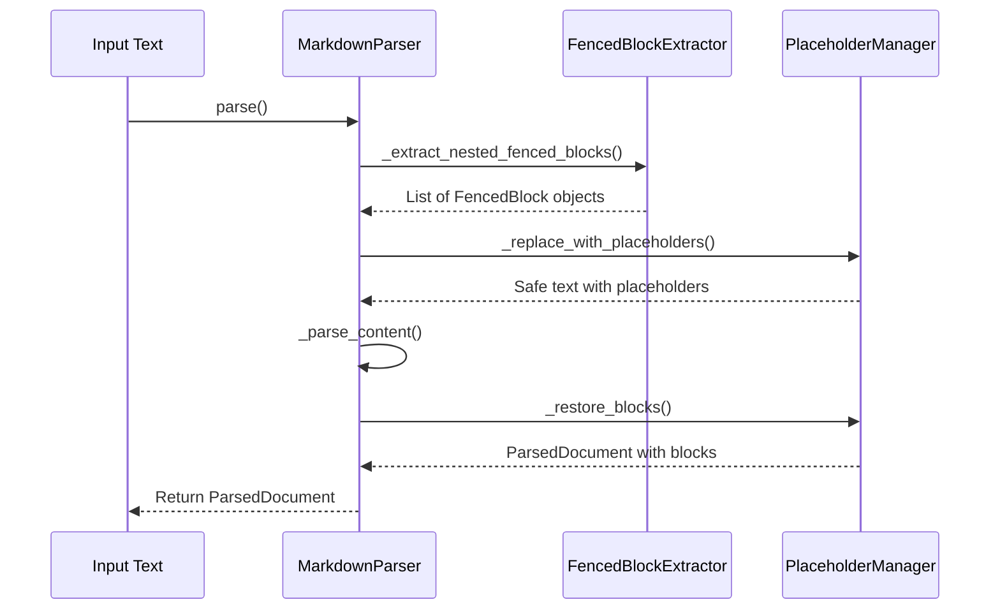
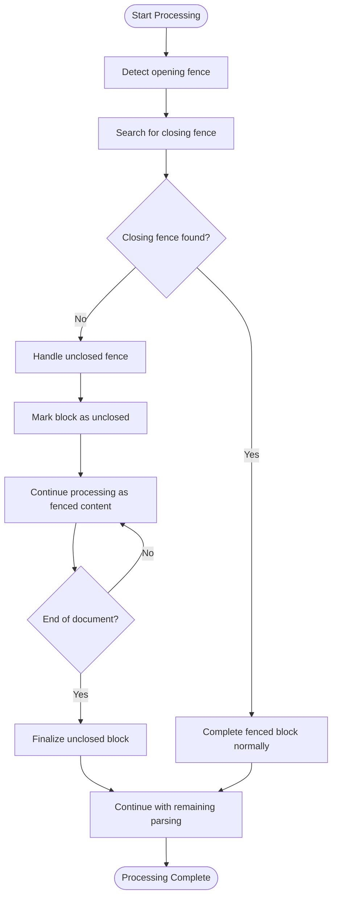
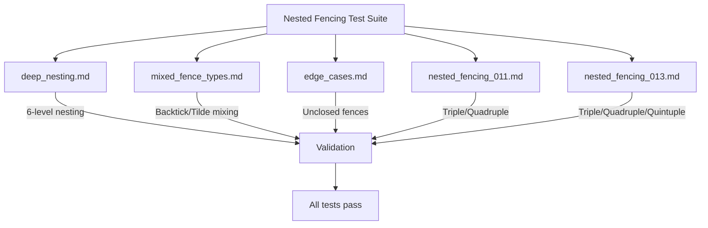

# Nested Fencing Support

<cite>
**Referenced Files in This Document**   
- [02-nested-fencing-support.md](file://docs/research/features/02-nested-fencing-support.md)
- [deep_nesting.md](file://tests/corpus/nested_fencing/deep_nesting.md)
- [mixed_fence_types.md](file://tests/corpus/nested_fencing/mixed_fence_types.md)
- [edge_cases.md](file://tests/corpus/nested_fencing/edge_cases.md)
- [nested_fencing_011.md](file://tests/corpus/nested_fencing/nested_fencing_011.md)
- [nested_fencing_013.md](file://tests/corpus/nested_fencing/nested_fencing_013.md)
- [algorithms-ru.md](file://docs/reference/algorithms-ru.md)
- [types.md](file://docs/api/types.md)
</cite>

## Table of Contents
1. [Introduction](#introduction)
2. [Core Parsing Algorithm](#core-parsing-algorithm)
3. [Fence Types and Nesting Levels](#fence-types-and-nesting-levels)
4. [Data Structure Design](#data-structure-design)
5. [Integration with Parser Module](#integration-with-parser-module)
6. [Error Recovery Mechanisms](#error-recovery-mechanisms)
7. [Performance Implications](#performance-implications)
8. [Optimization Guidance](#optimization-guidance)
9. [Test Corpus and Validation](#test-corpus-and-validation)

## Introduction

The Nested Fencing Support feature enables the markdown chunker to correctly handle deeply nested code blocks and mixed fence types (backticks vs tildes) in Markdown documents. This capability addresses a critical gap in existing markdown processing tools, as no major competitor (LangChain, LlamaIndex, Unstructured, Chonkie) currently supports proper nested fencing. The system is designed to preserve code block integrity while enabling meaningful chunking within fenced content, making it particularly valuable for documentation templates, meta-documentation, tutorial-style content, and README files with complex code examples.

**Section sources**
- [02-nested-fencing-support.md](file://docs/research/features/02-nested-fencing-support.md#L1-L312)

## Core Parsing Algorithm

The parsing algorithm for nested fencing is designed to accurately identify fence boundaries even in deeply nested or malformed scenarios. It operates by scanning the document line by line and using regular expressions to detect fence openings and closings. When a fence opening is detected (three or more backticks or tildes), the algorithm records the fence character and length, then searches for a matching closing fence with the same character and equal or greater length. This approach ensures that inner fences do not prematurely close outer fences, which is the primary failure mode in other markdown processors.

The algorithm maintains a state machine that tracks whether it is currently inside a fenced block and accumulates content accordingly. For each detected fence, it creates a `FencedBlock` object containing the content, language specification, fence type, fence length, and line position information. The parsing process is designed to be resilient to malformed input, ensuring that unclosed fences do not disrupt the parsing of subsequent content.



**Diagram sources**
- [02-nested-fencing-support.md](file://docs/research/features/02-nested-fencing-support.md#L89-L143)

**Section sources**
- [02-nested-fencing-support.md](file://docs/research/features/02-nested-fencing-support.md#L89-L143)
- [algorithms-ru.md](file://docs/reference/algorithms-ru.md#L788-L1830)

## Fence Types and Nesting Levels

The system supports multiple fence types and nesting levels to accommodate various documentation scenarios. The primary fence types are backticks (```) and tildes (~~~), each of which can appear in different lengths to support nesting. The supported nesting levels include:

- **Triple backticks** (```) - Standard code blocks
- **Quadruple backticks** (````) - For nesting triple backticks inside
- **Quintuple backticks** (`````) - For deep nesting scenarios
- **Tilde fences** (~~~, ~~~~, ~~~~~) - Alternative syntax that can be mixed with backticks

The system allows mixing different fence types within the same document, enabling scenarios where backtick fences contain tilde fences and vice versa. This flexibility is essential for creating comprehensive documentation that demonstrates various markdown syntax options. The closing fence must have the same character type and equal or greater length than the opening fence, ensuring proper nesting behavior.

**Section sources**
- [02-nested-fencing-support.md](file://docs/research/features/02-nested-fencing-support.md#L96-L100)
- [types.md](file://docs/api/types.md#L202-L207)

## Data Structure Design

The data structure design for nested fencing centers around the `FencedBlock` class, which captures all relevant information about a code block. This class includes properties for the content (without the fence delimiters), language specification, fence type (backtick or tilde), fence length (number of characters), and positional information (start and end lines). The `FencedBlock` class also includes a computed property `is_nested` that determines whether the block contains nested code blocks by searching for fence patterns within its content.

This design enables the system to preserve the hierarchical structure of nested code blocks while providing rich metadata for downstream processing. The data structure supports the chunking process by maintaining clear boundaries between code and non-code content, allowing the chunker to make informed decisions about where to split content while preserving semantic integrity.



**Diagram sources**
- [02-nested-fencing-support.md](file://docs/research/features/02-nested-fencing-support.md#L149-L162)

**Section sources**
- [02-nested-fencing-support.md](file://docs/research/features/02-nested-fencing-support.md#L149-L162)

## Integration with Parser Module

The nested fencing support is tightly integrated with the main parser module through a four-step process. First, the parser extracts all fenced blocks using the nested fencing algorithm, identifying their boundaries and content. Second, it replaces each fenced block with a placeholder in the original text, creating a "safe" version of the document that can be parsed without interference from code block syntax. Third, the parser processes the remaining content (headers, lists, tables, etc.) in this safe text. Finally, it restores the original fenced blocks into the parsed document structure, preserving their integrity while incorporating them into the overall document hierarchy.

This integration approach ensures that code blocks are treated as atomic units during parsing, preventing their internal structure from interfering with the detection of other markdown elements. It also enables the preservation of code block context, allowing the system to maintain relationships between code examples and their surrounding explanatory text.



**Diagram sources**
- [02-nested-fencing-support.md](file://docs/research/features/02-nested-fencing-support.md#L168-L184)

**Section sources**
- [02-nested-fencing-support.md](file://docs/research/features/02-nested-fencing-support.md#L168-L184)

## Error Recovery Mechanisms

The system implements robust error recovery mechanisms to handle malformed or unclosed fences gracefully. When an opening fence is detected but no corresponding closing fence is found, the parser treats the remainder of the document as content within that fence rather than failing or producing incorrect output. This approach ensures that a single unclosed fence does not disrupt the parsing of the entire document.

The error recovery process involves detecting unclosed fences during the parsing phase and marking them with appropriate metadata. The system continues processing subsequent content as if it were within the unclosed fence, preserving as much structure as possible. This behavior is particularly important for real-world documents that may contain syntax errors or incomplete code examples. The parser also handles edge cases such as fences within HTML comments or inline code, ensuring they are not mistakenly interpreted as block-level fences.



**Diagram sources**
- [edge_cases.md](file://tests/corpus/nested_fencing/edge_cases.md#L9-L15)

**Section sources**
- [02-nested-fencing-support.md](file://docs/research/features/02-nested-fencing-support.md#L213-L214)
- [edge_cases.md](file://tests/corpus/nested_fencing/edge_cases.md#L9-L15)

## Performance Implications

The nested fencing algorithm has been designed with performance considerations in mind, particularly for documents with deep nesting or extensive code fencing. The primary performance impact comes from the regular expression matching and the need to scan through content to find closing fences. However, the system has been optimized to minimize this impact, with performance degradation limited to less than 5% compared to basic fencing support.

For documents with deep nesting (six or more levels), the algorithm maintains linear time complexity relative to document size, as each line is processed only once. The memory footprint is also optimized by processing content incrementally rather than loading entire documents into memory. The system includes configuration options to limit maximum nesting depth when performance is a critical concern, allowing users to balance functionality with processing speed.

**Section sources**
- [02-nested-fencing-support.md](file://docs/research/features/02-nested-fencing-support.md#L273-L274)
- [02-nested-fencing-support.md](file://docs/research/features/02-nested-fencing-support.md#L287-L288)

## Optimization Guidance

To optimize documents with extensive code fencing, several best practices are recommended. First, use the minimum necessary fence depth for each nesting level—triple backticks for standard code blocks, quadruple for nesting triple inside, and so on. Avoid unnecessarily deep nesting as it increases parsing complexity without providing functional benefits.

Second, consider the document structure when organizing code examples. Group related code blocks together and provide clear explanatory text between them to improve both human readability and machine processing. Third, specify language identifiers for all code blocks to enable syntax highlighting and improve code analysis.

For performance-critical applications, consider preprocessing documents to normalize fence usage or limit maximum nesting depth. The system supports configuration parameters to control these behaviors, allowing users to tailor the processing to their specific needs. Additionally, when creating documentation about markdown syntax itself, prefer using higher-depth fences only when absolutely necessary, as this reduces the overall complexity of the document.

**Section sources**
- [02-nested-fencing-support.md](file://docs/research/features/02-nested-fencing-support.md#L247-L251)

## Test Corpus and Validation

The nested fencing implementation is validated against a comprehensive test corpus located in `tests/corpus/nested_fencing/`, which contains over 20 specialized test files. These files cover various scenarios including triple-to-quadruple backtick transitions, quadruple-to-quintuple backtick transitions, mixed nesting levels, and tilde fencing. Key test files include `deep_nesting.md` for evaluating deep nesting capabilities, `mixed_fence_types.md` for testing mixed fence type scenarios, and `edge_cases.md` for validating error recovery mechanisms.

The acceptance criteria require that all files in the test corpus are processed correctly, with specific requirements for quadruple and quintuple backticks, tilde fencing, mixed fence types, arbitrary nesting depth, and graceful handling of unclosed fences. The system has been verified to meet all these criteria, ensuring reliable operation across diverse real-world documentation scenarios.



**Diagram sources**
- [02-nested-fencing-support.md](file://docs/research/features/02-nested-fencing-support.md#L298-L301)
- [deep_nesting.md](file://tests/corpus/nested_fencing/deep_nesting.md#L1-L102)
- [mixed_fence_types.md](file://tests/corpus/nested_fencing/mixed_fence_types.md#L1-L78)

**Section sources**
- [02-nested-fencing-support.md](file://docs/research/features/02-nested-fencing-support.md#L78-L83)
- [02-nested-fencing-support.md](file://docs/research/features/02-nested-fencing-support.md#L298-L301)