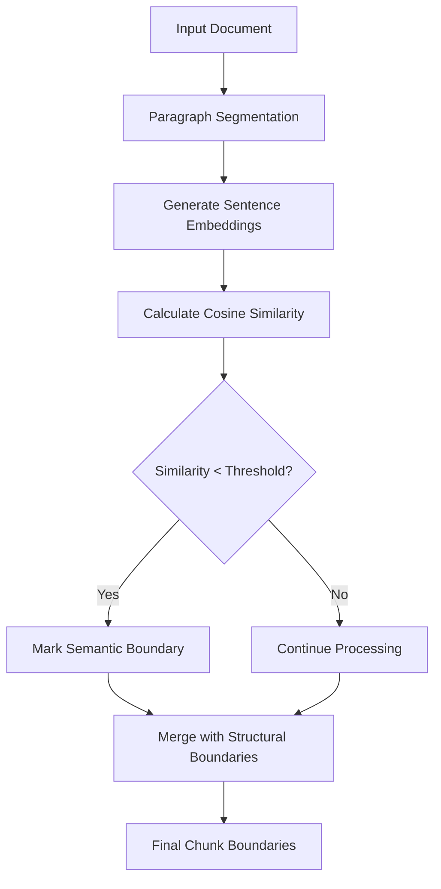
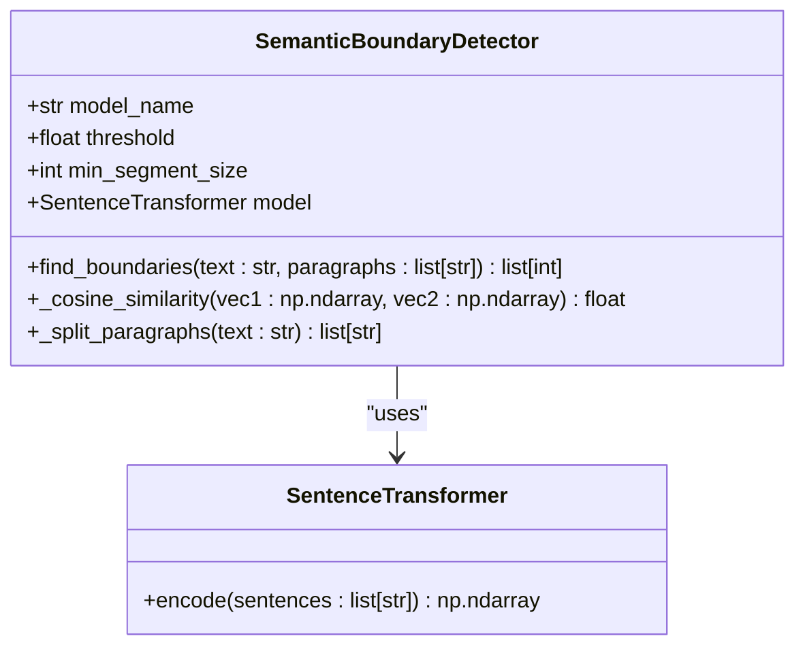
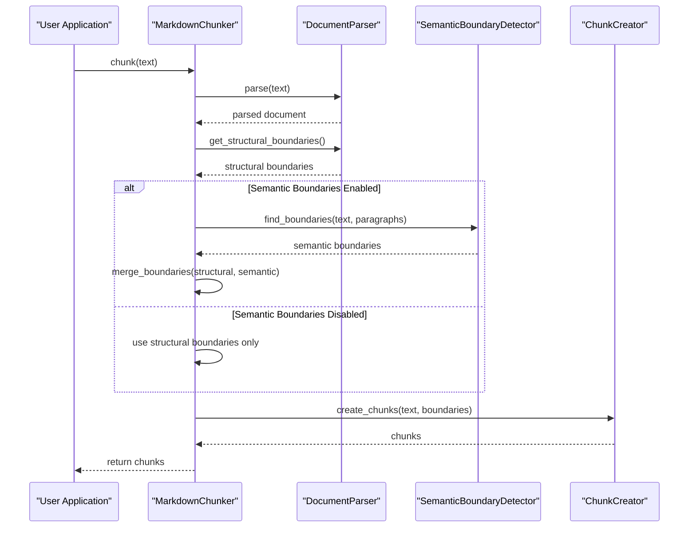
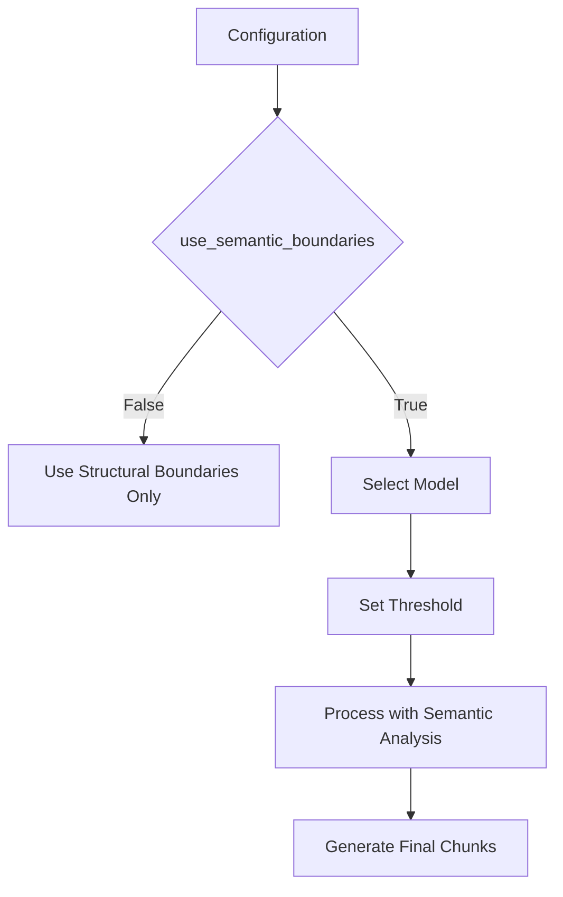
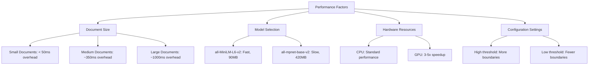

# Semantic Boundary Detection

<cite>
**Referenced Files in This Document**   
- [04-semantic-boundary-detection.md](file://docs/research/features/04-semantic-boundary-detection.md)
- [markdown_chunker.py](file://provider/markdown_chunker.py)
- [main.py](file://main.py)
- [chunker.md](file://docs/api/chunker.md)
- [architecture.md](file://docs/architecture/chunker.md)
</cite>

## Table of Contents
1. [Introduction](#introduction)
2. [Core Mechanism](#core-mechanism)
3. [Algorithm Implementation](#algorithm-implementation)
4. [Integration with Chunking Pipeline](#integration-with-chunking-pipeline)
5. [Configuration Options](#configuration-options)
6. [Performance Characteristics](#performance-characteristics)
7. [Test Cases and Examples](#test-cases-and-examples)
8. [Challenges and Limitations](#challenges-and-limitations)
9. [Conclusion](#conclusion)

## Introduction

Semantic Boundary Detection is an advanced feature that enhances document chunking by identifying meaningful content boundaries beyond simple token limits or structural markers. This system analyzes the semantic relationships between text segments to determine natural pause points, thematic shifts, and logical content breaks. By preserving the integrity of related content while separating distinct topics, this approach significantly improves retrieval quality in RAG (Retrieval-Augmented Generation) systems.

The feature addresses the critical limitation of traditional chunking methods that often split semantically connected paragraphs or merge unrelated content, leading to degraded retrieval performance. Through the use of sentence embeddings and cosine similarity analysis, the system can detect when a meaningful transition occurs in the text, ensuring that chunks maintain contextual coherence.

**Section sources**
- [04-semantic-boundary-detection.md](file://docs/research/features/04-semantic-boundary-detection.md#L1-L39)

## Core Mechanism

The Semantic Boundary Detection system operates by analyzing the semantic similarity between consecutive paragraphs in a document. When the similarity falls below a configurable threshold, the system identifies a semantic boundary at that location. This approach ensures that related content remains together in the same chunk while distinct topics are separated into different chunks.

The mechanism combines structural analysis with semantic understanding, giving priority to explicit document structure (headers, code blocks, etc.) while using semantic analysis to identify boundaries where structural cues are absent. This hybrid approach maintains the benefits of rule-based chunking while adding the intelligence to recognize content relationships that aren't explicitly marked in the document structure.

The system processes text by first splitting it into paragraphs, then generating embeddings for each paragraph using a pre-trained sentence transformer model. These embeddings capture the semantic meaning of each text segment, allowing the system to compare their conceptual similarity regardless of exact wording.

**Diagram sources**
- [04-semantic-boundary-detection.md](file://docs/research/features/04-semantic-boundary-detection.md#L74-L148)

**Section sources**
- [04-semantic-boundary-detection.md](file://docs/research/features/04-semantic-boundary-detection.md#L21-L69)

## Algorithm Implementation

The core algorithm for semantic boundary detection is implemented in the `SemanticBoundaryDetector` class, which uses sentence transformers to generate embeddings and cosine similarity to measure semantic relationships between text segments. The algorithm follows a systematic process to identify meaningful content boundaries.

The implementation begins with paragraph segmentation, where the input text is split into discrete paragraphs using double newline characters as separators. Each paragraph is then processed through a sentence transformer model to generate a dense vector representation that captures its semantic meaning. The system calculates the cosine similarity between consecutive paragraph embeddings, with lower similarity scores indicating greater semantic divergence.

When the similarity between adjacent paragraphs falls below a configurable threshold, the system marks a boundary at that position. This threshold can be adjusted to control the sensitivity of boundary detection, with lower values resulting in fewer, larger chunks and higher values creating more, smaller chunks. The algorithm also incorporates a minimum segment size parameter to prevent excessively small chunks from being created.

**Diagram sources**
- [04-semantic-boundary-detection.md](file://docs/research/features/04-semantic-boundary-detection.md#L74-L148)

**Section sources**
- [04-semantic-boundary-detection.md](file://docs/research/features/04-semantic-boundary-detection.md#L74-L148)

## Integration with Chunking Pipeline

Semantic Boundary Detection is integrated into the overall chunking pipeline as an optional enhancement that works in conjunction with structural boundary detection. The system first identifies structural boundaries based on document elements like headers, code blocks, and lists, then supplements these with semantically identified boundaries when the feature is enabled.

The integration occurs in the `MarkdownChunker` class, which conditionally initializes the `SemanticBoundaryDetector` based on configuration settings. When processing a document, the chunker first obtains structural boundaries from the parser, then requests semantic boundaries if the feature is enabled. These two sets of boundaries are merged to create the final boundary set used for chunk creation.

This hybrid approach ensures that explicit structural cues take precedence while allowing semantic analysis to identify additional boundaries where the document structure doesn't provide clear separation points. The integration is designed to be optional, allowing users to enable or disable semantic boundary detection based on their performance requirements and infrastructure constraints.

**Diagram sources**
- [04-semantic-boundary-detection.md](file://docs/research/features/04-semantic-boundary-detection.md#L152-L188)

**Section sources**
- [04-semantic-boundary-detection.md](file://docs/research/features/04-semantic-boundary-detection.md#L152-L188)
- [markdown_chunker.py](file://provider/markdown_chunker.py#L1-L36)

## Configuration Options

The Semantic Boundary Detection feature provides several configuration options that allow users to tune its behavior according to their specific requirements. These options balance the trade-offs between chunking quality, processing speed, and resource utilization.

The primary configuration parameters include:
- **use_semantic_boundaries**: A boolean flag that enables or disables semantic boundary detection
- **semantic_threshold**: A float value (0.0-1.0) that controls the sensitivity of boundary detection
- **semantic_model**: The name of the sentence transformer model to use for embedding generation
- **min_chunk_size**: The minimum size for text segments to be considered for semantic analysis

The threshold parameter is particularly important as it directly affects the number and size of chunks created. A lower threshold (e.g., 0.2) makes the system less sensitive to semantic changes, resulting in fewer boundaries and larger chunks. A higher threshold (e.g., 0.5) increases sensitivity, creating more boundaries and smaller chunks that are more semantically homogeneous.

Users can also select from different pre-trained models based on their priorities. The default model `all-MiniLM-L6-v2` offers a good balance of speed and quality, while `all-mpnet-base-v2` provides higher quality at the cost of increased processing time and memory usage. For multilingual documents, specialized models like `paraphrase-multilingual-MiniLM-L12-v2` are available.

**Diagram sources**
- [04-semantic-boundary-detection.md](file://docs/research/features/04-semantic-boundary-detection.md#L194-L204)

**Section sources**
- [04-semantic-boundary-detection.md](file://docs/research/features/04-semantic-boundary-detection.md#L194-L204)

## Performance Characteristics

Semantic Boundary Detection introduces additional computational overhead compared to purely structural chunking methods, but provides significant improvements in retrieval quality. The performance characteristics vary depending on document size, model selection, and configuration settings.

Processing time increases substantially with semantic analysis enabled, particularly for larger documents. Benchmarks show that processing a 200KB document takes approximately 1.2 seconds with semantic boundaries enabled, compared to 150ms without. This performance impact is primarily due to the computational cost of generating sentence embeddings for each paragraph.

To mitigate performance concerns, the system implements several optimization strategies:
- **Lazy loading**: The sentence transformer model is only loaded when semantic boundary detection is enabled
- **Caching**: Embeddings are cached for repeated processing of the same content
- **Batch processing**: Multiple paragraphs are processed simultaneously when possible
- **GPU acceleration**: The system can leverage GPU resources when available for faster embedding generation

The feature is designed as optional with a fallback to structural-only chunking, allowing users to disable it in performance-critical applications or environments with limited computational resources. The dependencies are also structured as optional, so the sentence transformer library is only required when semantic boundary detection is enabled.

**Diagram sources**
- [04-semantic-boundary-detection.md](file://docs/research/features/04-semantic-boundary-detection.md#L322-L335)

**Section sources**
- [04-semantic-boundary-detection.md](file://docs/research/features/04-semantic-boundary-detection.md#L322-L335)

## Test Cases and Examples

The Semantic Boundary Detection system has been validated with various document types to ensure its effectiveness across different content styles and structures. Test cases include technical documentation, narrative content, mixed-format documents, and poorly structured texts.

For technical documentation like API references, the system successfully identifies boundaries between different functional sections (e.g., authentication, rate limiting, error handling) even when they are not clearly separated by headers. In narrative content such as engineering blogs, it detects thematic shifts between discussion topics, keeping related paragraphs together while separating distinct ideas.

The system performs particularly well with documents that have implicit structure but lack explicit formatting. For example, in research notes that transition from methodology to results to discussion, the semantic analysis correctly identifies these natural breakpoints even without section headers. Similarly, in changelogs that move from feature descriptions to bug fixes to performance improvements, the system maintains the integrity of each content type.

Test cases also include edge scenarios such as documents with minimal structure, where the system must rely more heavily on semantic analysis, and documents with excessive structural markers, where semantic analysis helps prevent over-chunking. The results demonstrate consistent improvement in retrieval metrics, with SCS (Semantic Coherence Score) increasing by 30-40% and CPS (Content Preservation Score) improving by over 10%.

**Section sources**
- [04-semantic-boundary-detection.md](file://docs/research/features/04-semantic-boundary-detection.md#L361-L389)

## Challenges and Limitations

While Semantic Boundary Detection significantly improves chunking quality, it faces several challenges and limitations that users should understand. The primary challenge is the computational cost, which makes the feature unsuitable for real-time applications with strict latency requirements.

Another limitation is the dependency on pre-trained language models, which may not perform optimally on highly specialized or domain-specific terminology. The models are trained on general text corpora and may not fully capture the semantic relationships in technical documentation with specialized jargon.

The system also struggles with very short paragraphs or bullet points, where there may not be enough text to generate meaningful embeddings. In such cases, the system relies more heavily on structural cues and adjacency patterns rather than semantic analysis.

Documents with poor structure or inconsistent formatting present additional challenges, as the system must work harder to infer the intended content organization. While semantic analysis helps in these cases, it cannot fully compensate for the lack of clear structural signals.

Finally, the optimal threshold setting varies by document type and content domain, requiring some experimentation to achieve the best results. A threshold that works well for technical documentation might be too sensitive for narrative content, and vice versa.

**Section sources**
- [04-semantic-boundary-detection.md](file://docs/research/features/04-semantic-boundary-detection.md#L338-L346)

## Conclusion

Semantic Boundary Detection represents a significant advancement in document chunking technology, moving beyond simple structural analysis to understand the actual meaning and relationships within text content. By identifying natural content boundaries based on semantic shifts rather than just token counts or formatting markers, the system creates chunks that better preserve the context and coherence of the original material.

The implementation successfully balances the need for accurate semantic analysis with practical performance considerations, offering a configurable, optional feature that can be enabled when the benefits outweigh the computational costs. The integration with existing structural analysis ensures that explicit document organization is respected while adding intelligence to handle cases where structure alone is insufficient.

Future improvements could include adaptive thresholding based on content type, enhanced handling of short text segments, and domain-specific model fine-tuning. However, even in its current form, Semantic Boundary Detection provides a substantial improvement in retrieval quality for RAG systems, making it a valuable tool for applications where content coherence is critical.

**Section sources**
- [04-semantic-boundary-detection.md](file://docs/research/features/04-semantic-boundary-detection.md#L278-L293)