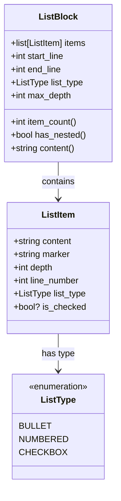
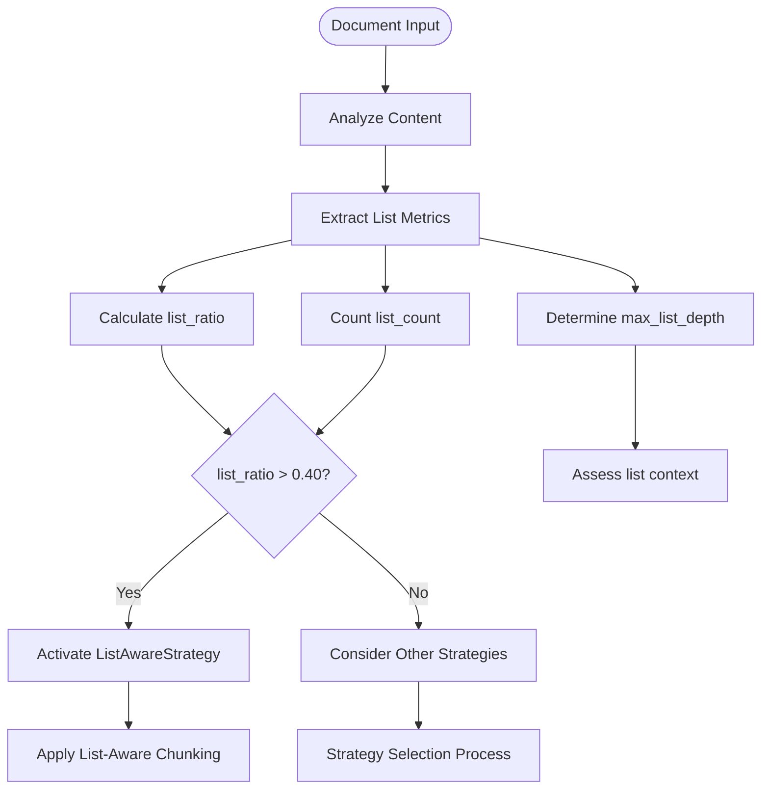
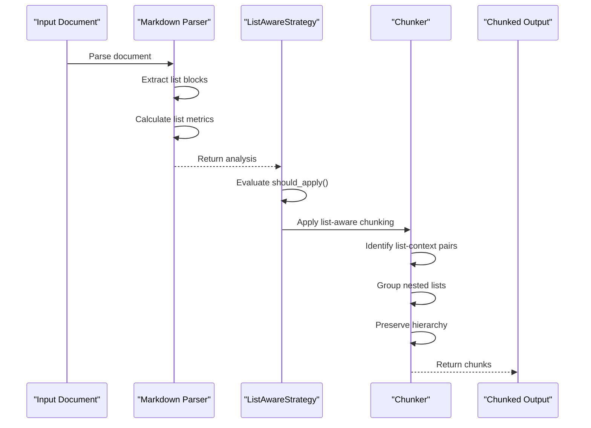
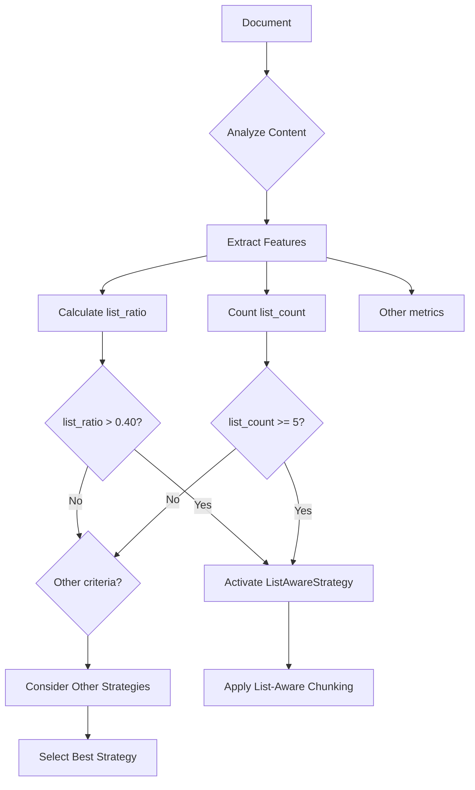

# Smart List Strategy

<cite>
**Referenced Files in This Document**   
- [01-smart-list-strategy.md](file://docs/research/features/01-smart-list-strategy.md)
- [03-list-detection-parser.md](file://docs/research/features/03-list-detection-parser.md)
- [strategies.md](file://docs/architecture/strategies.md)
- [algorithms.md](file://docs/reference/algorithms.md)
- [configuration.md](file://docs/reference/configuration.md)
- [list_strategy.py](file://markdown_chunker/chunker/strategies/list_strategy.py)
- [test_list_strategy.py](file://tests/chunker/test_strategies/test_list_strategy.py)
- [changelogs_005.md](file://tests/corpus/changelogs/changelogs_005.md)
- [node.md](file://tests/corpus/github_readmes/javascript/node.md)
</cite>

## Table of Contents
1. [Introduction](#introduction)
2. [List Detection and Parsing Logic](#list-detection-and-parsing-logic)
3. [Smart List Strategy Implementation](#smart-list-strategy-implementation)
4. [Context Preservation and Hierarchy Maintenance](#context-preservation-and-hierarchy-maintenance)
5. [Integration with Adaptive Strategy Selection](#integration-with-adaptive-strategy-selection)
6. [Configuration Options](#configuration-options)
7. [Edge Case Handling](#edge-case-handling)
8. [Performance Considerations](#performance-considerations)
9. [Troubleshooting Guide](#troubleshooting-guide)
10. [Examples and Test Cases](#examples-and-test-cases)

## Introduction

The Smart List Strategy is a specialized chunking approach designed to handle Markdown documents with high list density, such as changelogs, feature lists, outlines, checklists, and task lists. This strategy addresses the degradation in chunking quality that occurred when the list-specific processing was removed in the transition from v1.x to v2.0 of the markdown chunker.

Documents with significant list content (estimated at 20-25% of the corpus) require special handling to preserve semantic meaning, maintain hierarchical relationships, and keep contextual introductions bound to their associated lists. The Smart List Strategy restores and enhances these capabilities, ensuring that list-heavy documents are processed optimally.

This document details the parsing logic, implementation approach, configuration options, and integration points for the Smart List Strategy, providing comprehensive guidance for developers and users.

**Section sources**
- [01-smart-list-strategy.md](file://docs/research/features/01-smart-list-strategy.md#L1-L280)
- [03-list-detection-parser.md](file://docs/research/features/03-list-detection-parser.md#L1-L380)

## List Detection and Parsing Logic

The foundation of the Smart List Strategy is robust list detection and parsing capabilities implemented in the markdown parser. The parser identifies and extracts list structures with detailed metadata, enabling intelligent chunking decisions.

### List Types Supported

The parser recognizes three primary list types in Markdown:

- **Bullet Lists**: Items marked with `-`, `*`, or `+`
- **Numbered Lists**: Items marked with sequential numbers followed by a period (e.g., `1.`, `2.`)
- **Checkbox Lists**: Items with task completion markers `[ ]` for unchecked and `[x]` or `[X]` for checked

### Parsing Algorithm

The list parsing algorithm uses regular expressions to identify list items and determine their properties:

```python
BULLET_PATTERN = r'^(\s*)([-*+])\s+(.+)$'
NUMBERED_PATTERN = r'^(\s*)(\d+\.)\s+(.+)$'
CHECKBOX_PATTERN = r'^(\s*)([-*+])\s+\[([ xX])\]\s+(.+)$'
```

The algorithm processes the document line by line, identifying list items and their indentation levels. Each list item is represented by a `ListItem` data structure containing:

- Content (text without the marker)
- Marker (the bullet, number, or checkbox syntax)
- Depth (level of nesting based on indentation)
- Line number (position in the original document)
- List type (bullet, numbered, or checkbox)
- Checked status (for checkbox lists)

### List Block Construction

When a list item is detected, the parser collects all consecutive list items to form a `ListBlock`. The algorithm handles:

- **Continuation lines**: Wrapped content that spans multiple lines is appended to the previous list item
- **Empty lines**: The parser checks if a list continues after an empty line before terminating the block
- **Mixed list types**: Within a single list block, different item types are tracked and the predominant type is recorded

The `ListBlock` structure includes metadata such as start and end line numbers, item count, maximum nesting depth, and the primary list type.



**Diagram sources**
- [03-list-detection-parser.md](file://docs/research/features/03-list-detection-parser.md#L51-L91)

**Section sources**
- [03-list-detection-parser.md](file://docs/research/features/03-list-detection-parser.md#L47-L380)

## Smart List Strategy Implementation

The Smart List Strategy is implemented as a specialized chunking strategy that activates when documents meet specific criteria indicating high list density. This strategy ensures that lists are processed in a way that preserves their semantic structure and relationships.

### Strategy Activation Criteria

The ListAwareStrategy activates based on two primary metrics calculated during content analysis:

```python
def should_apply(self, analysis: ContentAnalysis) -> bool:
    return (
        analysis.list_ratio > 0.40 or 
        analysis.list_count >= 5
    )
```

- **List Ratio**: The proportion of document content that appears within lists (default threshold: >40%)
- **List Count**: The number of distinct list blocks in the document (default threshold: ≥5)

These criteria ensure that the strategy is applied to documents where list preservation is most critical, such as changelogs, feature lists, and task checklists.

### Content Analysis Metrics

The `ContentAnalysis` class includes several list-specific metrics that inform strategy selection:

- `list_count`: Number of list blocks in the document
- `list_item_count`: Total number of list items
- `list_ratio`: Proportion of text content within lists
- `max_list_depth`: Maximum nesting level of lists
- `has_checkbox_lists`: Boolean indicating presence of task lists

These metrics are computed during the initial document analysis phase and are used both for strategy selection and subsequent chunking decisions.



**Diagram sources**
- [01-smart-list-strategy.md](file://docs/research/features/01-smart-list-strategy.md#L80-L108)
- [03-list-detection-parser.md](file://docs/research/features/03-list-detection-parser.md#L221-L239)

**Section sources**
- [01-smart-list-strategy.md](file://docs/research/features/01-smart-list-strategy.md#L76-L108)
- [strategies.md](file://docs/architecture/strategies.md#L107-L154)

## Context Preservation and Hierarchy Maintenance

The core value of the Smart List Strategy lies in its ability to preserve list context and hierarchy during chunking, ensuring that semantically related content remains together.

### List Context Binding

The strategy implements context binding to ensure that introductory text preceding a list is kept with the list in the same chunk. This preserves the semantic relationship between a list and its introduction:

```python
def bind_list_context(list_block: ListBlock, preceding_text: str) -> str:
    """
    Bind list to its introductory paragraph.
    
    Example:
    "The following features are available:" + list
    """
```

The algorithm identifies the last paragraph before a list block and determines if it serves as an introduction to the list. If so, this context is included in the same chunk as the list, maintaining the complete semantic unit.

### Hierarchy Preservation

The strategy strictly preserves list hierarchy by ensuring that:

- Parent list items are never separated from their child items
- Nested lists are kept intact and not split across chunks
- The hierarchical relationship between list levels is maintained

When chunk size constraints would force a split within a nested list, the algorithm prioritizes hierarchy preservation over strict size limits, allowing slight overages to keep related content together.

### Chunking Algorithm

The main chunking algorithm follows these principles:

1. **Identify list blocks with context**: Detect all list structures and their surrounding context
2. **Group nested lists**: Keep parent items with their children and sub-lists
3. **Preserve list introductions**: Include introductory paragraphs with their associated lists
4. **Respect max_chunk_size**: Apply size constraints while minimizing hierarchy violations

This approach ensures that complex nested structures like the following example are kept intact:

```markdown
- **Authentication**
  - OAuth 2.0 support
  - SAML integration
  - MFA options
    - SMS
    - Authenticator app
    - Hardware keys
```

All items under "Authentication" remain in a single chunk, preserving the complete feature hierarchy.



**Diagram sources**
- [01-smart-list-strategy.md](file://docs/research/features/01-smart-list-strategy.md#L100-L107)
- [strategies.md](file://docs/architecture/strategies.md#L107-L154)

**Section sources**
- [01-smart-list-strategy.md](file://docs/research/features/01-smart-list-strategy.md#L110-L155)

## Integration with Adaptive Strategy Selection

The Smart List Strategy is integrated into the adaptive strategy selection system, which automatically chooses the most appropriate chunking approach based on document characteristics.

### Strategy Selection Process

The adaptive selection system evaluates multiple strategies and selects the optimal one:

1. **Content Analysis**: Extract structural features including list metrics
2. **Strategy Evaluation**: Each strategy determines if it should apply
3. **Scoring**: Calculate quality scores for applicable strategies
4. **Selection**: Choose the strategy with the highest weighted score

The ListAwareStrategy competes with other strategies like CodeAware, Structural, and Fallback, but has priority for list-heavy documents.

### Priority and Weighting

In strict mode, strategies are sorted by priority, with ListAwareStrategy having high priority for documents meeting its activation criteria. In standard mode, a weighted score is calculated based on:

- Strategy-specific metrics (list_ratio, list_count)
- Document size and complexity
- Configuration overrides

This ensures that the Smart List Strategy is selected when it will provide the greatest quality improvement.



**Diagram sources**
- [algorithms.md](file://docs/reference/algorithms.md#L1-L50)
- [strategies.md](file://docs/architecture/strategies.md#L1-L50)

**Section sources**
- [01-smart-list-strategy.md](file://docs/research/features/01-smart-list-strategy.md#L157-L164)
- [strategies.md](file://docs/architecture/strategies.md#L1-L154)

## Configuration Options

The Smart List Strategy provides configurable parameters that allow users to customize its behavior for specific use cases.

### Strategy Selection Configuration

Users can control when the ListAwareStrategy is applied through configuration parameters:

| Parameter | Default | Description |
|---------|--------|-------------|
| `list_ratio_threshold` | 0.40 | Minimum ratio of list content to activate strategy (0.0-1.0) |
| `list_count_threshold` | 5 | Minimum number of list blocks to activate strategy |
| `strategy_override` | auto | Force specific strategy (list_aware, code_aware, etc.) |

### Plugin Configuration

In the Dify plugin configuration, the strategy can be specified as:

```yaml
config:
  strategy: list_aware
  max_chunk_size: 4096
```

### Direct API Configuration

When using the chunkana library directly, configuration can be set programmatically:

```python
config = ChunkConfig(
    strategy_override="list_aware",
    list_ratio_threshold=0.35,  # Lower threshold for changelogs
    list_count_threshold=3      # Activate with fewer lists
)
```

These configuration options provide flexibility for different document types and use cases, allowing fine-tuning of the strategy activation criteria.

**Section sources**
- [configuration.md](file://docs/reference/configuration.md#L1-L250)
- [strategies.md](file://docs/architecture/strategies.md#L132-L145)

## Edge Case Handling

The Smart List Strategy includes robust handling of various edge cases commonly found in real-world Markdown documents.

### Mixed List Types

Documents may contain multiple list types within close proximity. The strategy handles mixed lists by:

- Treating each contiguous list block as a unit regardless of type
- Preserving the boundaries between different list blocks
- Maintaining the hierarchy within each block

### Interrupted Lists

Lists that are interrupted by non-list content (e.g., code blocks, paragraphs, or horizontal rules) are handled by:

- Treating the interruption as a boundary between list blocks
- Applying context binding to each separate list
- Preserving the hierarchy within each continuous list segment

### Lists with Code Blocks

When lists contain code blocks as item content, the strategy ensures that:

- Code blocks within list items are preserved intact
- The list hierarchy is maintained around the code block
- Syntax highlighting and formatting are preserved

### Deep Nesting

The parser supports list nesting up to 5 levels deep, which covers the vast majority of practical use cases. For extremely deep nesting, the strategy prioritizes preserving the parent-child relationships even if it results in larger chunks.

**Section sources**
- [03-list-detection-parser.md](file://docs/research/features/03-list-detection-parser.md#L182-L202)
- [test_list_strategy.py](file://tests/chunker/test_strategies/test_list_strategy.py#L1-L200)

## Performance Considerations

The Smart List Strategy is designed to balance sophisticated list processing with acceptable performance characteristics.

### Processing Overhead

The additional list detection and hierarchy preservation logic introduces minimal overhead:

- List parsing is performed in a single pass through the document
- Regular expressions are optimized for performance
- List analysis is lazy-loaded and only performed when needed

The performance impact is estimated at less than 3% compared to basic parsing, which is considered acceptable given the significant quality improvements.

### Memory Usage

The strategy maintains list block metadata in memory during processing, but this overhead is proportional to the number of lists rather than document size. For typical documents, the memory footprint is negligible.

### Large Document Handling

For very large list-heavy documents (e.g., extensive changelogs), the strategy:

- Processes lists in a streaming fashion when possible
- Uses efficient data structures to minimize memory usage
- Provides configuration options to adjust behavior for performance-critical scenarios

**Section sources**
- [03-list-detection-parser.md](file://docs/research/features/03-list-detection-parser.md#L331-L334)
- [01-smart-list-strategy.md](file://docs/research/features/01-smart-list-strategy.md#L230-L232)

## Troubleshooting Guide

This section addresses common issues and questions related to the Smart List Strategy.

### Strategy Not Activating

If the ListAwareStrategy is not being selected for a list-heavy document:

1. **Check list metrics**: Verify that the document meets the activation thresholds (list_ratio > 0.40 or list_count >= 5)
2. **Inspect content analysis**: Examine the ContentAnalysis output to confirm list detection
3. **Use override**: Set `strategy_override="list_aware"` to force the strategy
4. **Adjust thresholds**: Lower `list_ratio_threshold` or `list_count_threshold` in configuration

### Lists Being Split

If lists are being split across chunks when they should be preserved:

1. **Verify hierarchy preservation**: Ensure that parent items are not being separated from children
2. **Check chunk size**: Consider increasing `max_chunk_size` to accommodate large nested lists
3. **Examine interruptions**: Look for content (code blocks, horizontal rules) that might be breaking list continuity

### Context Not Preserved

If list introductions are not being kept with their lists:

1. **Check proximity**: Ensure the introductory text immediately precedes the list
2. **Verify formatting**: Confirm there are no unexpected blank lines or formatting issues
3. **Test with examples**: Compare against known working examples like changelogs

**Section sources**
- [01-smart-list-strategy.md](file://docs/research/features/01-smart-list-strategy.md#L236-L245)
- [strategies.md](file://docs/architecture/strategies.md#L509-L510)

## Examples and Test Cases

The Smart List Strategy has been tested and validated against numerous real-world documents from the test corpus.

### Changelog Examples

The strategy excels with changelog documents, which typically have high list density and hierarchical structure:

- **changelogs_005.md**: 128 lists, 256 lines - Changelog with maximum list density
- **changelogs_010.md**: 128 lists, 253 lines - Large changelog with version history
- **changelogs_034.md**: 126 lists, 252 lines - Changelog with deep nesting

### GitHub README Examples

Popular project README files with extensive feature lists:

- **node.md**: 660 lists - Node.js README with extensive API documentation
- **express.md**: 85 lists - Express.js framework features
- **axios.md**: 89 lists - Axios HTTP client API methods

### Before and After Comparison

**Input Document:**
```markdown
# Features

Our product includes:

- **Authentication**
  - OAuth 2.0 support
  - SAML integration
  - MFA options
    - SMS
    - Authenticator app
    - Hardware keys

- **Authorization**
  - Role-based access
  - Permission groups
  - Custom policies
```

**V1.x (List Strategy) Result:** 2 chunks
- Chunk 1: Header + "Authentication" with all sub-items
- Chunk 2: "Authorization" with all sub-items

**V2.0 (CodeAware/Structural) Result:** 3-4 chunks
- Risk of splitting nested items
- Potential separation of header from list

**Smart List Strategy Result:** 2 chunks (optimal)
- Complete preservation of hierarchy and context
- Semantic units kept intact

**Section sources**
- [01-smart-list-strategy.md](file://docs/research/features/01-smart-list-strategy.md#L44-L73)
- [strategies.md](file://docs/architecture/strategies.md#L107-L129)