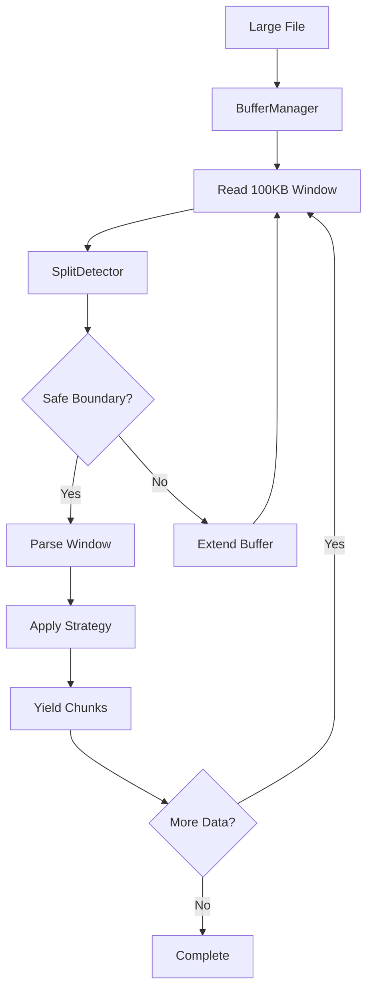
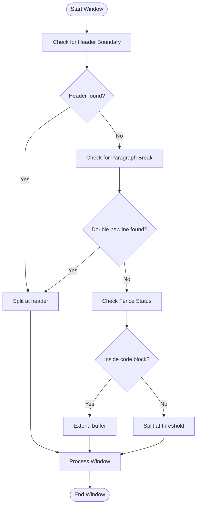
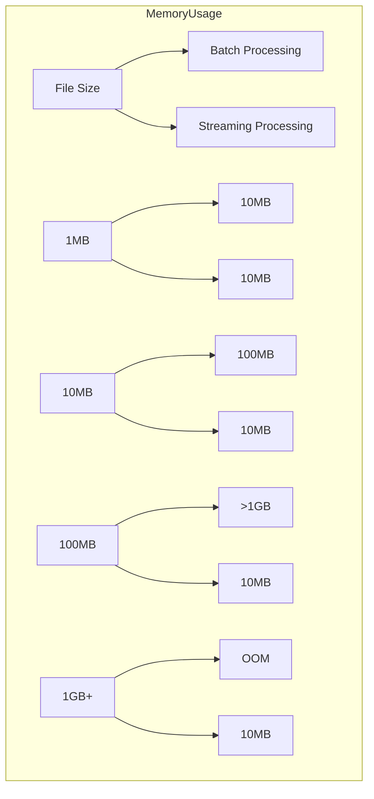

# Streaming Processing

<cite>
**Referenced Files in This Document**   
- [StreamingConfig](file://docs/api/streaming.md#L15-L30)
- [chunk_file_streaming()](file://docs/api/streaming.md#L64-L119)
- [chunk_stream()](file://docs/api/streaming.md#L134-L178)
- [Safe Split Detection](file://docs/api/streaming.md#L213-L237)
- [Streaming Architecture](file://docs/architecture/README.md#L148-L199)
- [Streaming Processing Research](file://docs/research/features/14-streaming-processing.md)
- [Progress Tracking Example](file://docs/api/streaming.md#L240-L259)
- [Error Handling](file://docs/api/streaming.md#L263-L292)
</cite>

## Table of Contents
1. [Introduction](#introduction)
2. [Streaming Architecture](#streaming-architecture)
3. [Buffer Management](#buffer-management)
4. [Windowing Techniques](#windowing-techniques)
5. [Context Maintenance Across Boundaries](#context-maintenance-across-boundaries)
6. [Edge Case Handling](#edge-case-handling)
7. [Memory Usage Comparisons](#memory-usage-comparisons)
8. [Integration with Core Chunker](#integration-with-core-chunker)
9. [Configuration Parameters](#configuration-parameters)
10. [Performance Benefits](#performance-benefits)
11. [Optimization Guidance](#optimization-guidance)
12. [Usage Examples](#usage-examples)
13. [Error Handling](#error-handling)

## Introduction
The Streaming Processing feature enables memory-efficient processing of large Markdown files (>10MB) through buffer-based chunking. This approach maintains chunk quality while keeping memory usage below configured limits, making it suitable for resource-constrained environments and large documentation processing. The system processes files in chunks without loading the entire document into memory, using sophisticated buffer management and windowing techniques to maintain context across buffer boundaries.

**Section sources**
- [Streaming Architecture](file://docs/architecture/README.md#L148-L199)
- [Streaming Processing Research](file://docs/research/features/14-streaming-processing.md)

## Streaming Architecture
The streaming architecture implements a parallel processing path that operates independently from the batch pipeline, preserving existing batch pipeline performance while isolating streaming complexity in a dedicated module. This design ensures backward compatibility and allows users to explicitly opt into streaming via the `chunk_file_streaming()` method.



**Diagram sources**
- [Streaming Architecture](file://docs/architecture/README.md#L182-L196)

**Section sources**
- [Streaming Architecture](file://docs/architecture/README.md#L148-L199)

## Buffer Management
The system employs a dynamic buffer management strategy that reads file content in windows of configurable size (default 100KB). The buffer accumulates lines until reaching the threshold size, at which point the system searches for safe split points to process the buffer contents. This approach ensures that memory usage remains constant regardless of file size, with peak memory consumption determined by buffer size, overlap lines, and processing overhead.

The buffer management system maintains two key components:
- **Primary buffer**: Accumulates incoming lines until threshold is reached
- **Overlap buffer**: Preserves context lines (default 20) from previous buffers to maintain continuity across window boundaries

**Section sources**
- [Streaming Processing Research](file://docs/research/features/14-streaming-processing.md#L103-L141)
- [Streaming API Reference](file://docs/api/streaming.md#L121-L130)

## Windowing Techniques
The streaming processor uses intelligent windowing techniques to identify safe split points that preserve document structure and semantic integrity. The system follows a priority order for split detection:

1. **Header boundary**: Line before `#` header (highest priority)
2. **Paragraph break**: Double newline `\n\n`
3. **Newline outside fence**: Single newline (fence-aware)
4. **Fallback**: Hard split at `safe_split_threshold` (80% of buffer)

This hierarchical approach ensures that structural elements like code blocks, tables, and lists remain intact across window boundaries. The system extends the buffer when encountering fenced content to prevent mid-block splits.



**Diagram sources**
- [Safe Split Detection](file://docs/api/streaming.md#L213-L237)

**Section sources**
- [Safe Split Detection](file://docs/api/streaming.md#L213-L237)
- [Streaming Processing Research](file://docs/research/features/14-streaming-processing.md#L148-L177)

## Context Maintenance Across Boundaries
To maintain context across buffer boundaries, the streaming processor implements an overlap mechanism that preserves a configurable number of lines (default 20) from the end of each processed buffer. This overlap is prepended to the next buffer's content before processing, ensuring that chunks near window boundaries have sufficient context for accurate parsing and chunking.

The context maintenance system also preserves metadata continuity by tracking:
- `stream_window_index`: Which buffer window produced the chunk
- `stream_chunk_index`: Global chunk index across all windows
- `is_cross_window`: Whether the chunk spans buffer boundaries

This approach ensures that downstream consumers of the chunks can understand the processing context and maintain proper ordering.

**Section sources**
- [Streaming API Reference](file://docs/api/streaming.md#L89-L102)
- [Streaming Processing Research](file://docs/research/features/14-streaming-processing.md#L132-L136)

## Edge Case Handling
The streaming processor includes robust edge case handling to maintain document integrity across various challenging scenarios:

- **Code blocks**: Never split mid-block by tracking fence count and extending buffers when inside fenced content
- **Tables**: Preserved as complete units by avoiding splits within table structures
- **Lists**: Maintained as coherent units by preventing splits within list sequences
- **Headers**: Kept with their associated content by prioritizing header boundaries as split points

The system also handles encoding issues by defaulting to UTF-8 encoding and provides explicit error handling for file not found scenarios and memory constraints.

**Section sources**
- [Safe Split Detection](file://docs/api/streaming.md#L224-L236)
- [Error Handling](file://docs/api/streaming.md#L263-L292)

## Memory Usage Comparisons
The streaming processor dramatically reduces memory consumption compared to batch processing, enabling the processing of very large files in memory-constrained environments:

| File Size | Batch Processing | Streaming Processing |
|-----------|------------------|---------------------|
| 1MB | ~10MB | ~10MB |
| 10MB | ~100MB | ~10MB |
| 100MB | >1GB (OOM) | ~10MB |
| 1GB+ | Impossible | ~10MB |

**Scaling:** Memory usage remains constant regardless of file size, with peak memory consumption determined by buffer size and configuration parameters.



**Diagram sources**
- [Memory Usage](file://docs/api/streaming.md#L194-L202)

**Section sources**
- [Memory Usage Comparisons](file://docs/api/streaming.md#L194-L202)
- [Streaming Processing Research](file://docs/research/features/14-streaming-processing.md#L366-L372)

## Integration with Core Chunker
The streaming processor integrates seamlessly with the core chunker through a wrapper architecture that delegates actual chunking operations to the base MarkdownChunker. This design preserves all existing chunking strategies and metadata enrichment capabilities while adding the streaming layer on top.

The integration works as follows:
1. The streaming processor reads a window of content
2. Applies overlap from the previous window
3. Delegates to the base chunker for actual chunking
4. Adjusts metadata to include streaming-specific information
5. Yields chunks to the consumer

This approach ensures feature parity between batch and streaming processing for all chunking strategies except hierarchical chunking, which has limited support in streaming mode.

**Section sources**
- [Streaming Processing Research](file://docs/research/features/14-streaming-processing.md#L72-L73)
- [Streaming API Reference](file://docs/api/streaming.md#L311-L324)

## Configuration Parameters
The streaming processor offers several configurable parameters to optimize performance for different use cases:

### StreamingConfig Parameters

| Parameter | Type | Default | Description |
|---------|------|---------|-------------|
| `buffer_size` | int | 100,000 | Size of buffer window in characters (100KB) |
| `overlap_lines` | int | 20 | Context lines preserved between buffer windows |
| `max_memory_mb` | int | 100 | Maximum memory usage ceiling in megabytes |
| `safe_split_threshold` | float | 0.8 | Where to look for split points (80% of buffer) |

### Usage Examples

```python
from markdown_chunker import StreamingConfig

# Default configuration
config = StreamingConfig()

# Memory-constrained environment
config = StreamingConfig(
    buffer_size=50_000,   # 50KB windows
    max_memory_mb=50      # Strict 50MB limit
)

# Large file optimized
config = StreamingConfig(
    buffer_size=200_000,  # 200KB windows for fewer window transitions
    overlap_lines=30      # More context between windows
)
```

**Section sources**
- [StreamingConfig](file://docs/api/streaming.md#L15-L60)
- [Streaming Processing Research](file://docs/research/features/14-streaming-processing.md#L386-L393)

## Performance Benefits
The streaming processor provides significant performance benefits for large file processing:

- **Constant memory usage**: ~10-15MB regardless of file size
- **Scalability**: Can process files of any size, limited only by disk space
- **Progress tracking**: Enables monitoring of long-running operations
- **Resource efficiency**: Suitable for memory-constrained environments

The system adds ~10-15% processing overhead compared to batch processing, representing a trade-off between slightly slower processing and guaranteed memory bounds. This makes streaming the recommended approach for files >10MB or in memory-constrained environments.

**Section sources**
- [Performance Characteristics](file://docs/api/streaming.md#L182-L210)
- [Streaming Processing Research](file://docs/research/features/14-streaming-processing.md#L374-L381)

## Optimization Guidance
To optimize streaming performance for different file types and use cases:

### For Code-Heavy Documents
- Increase `overlap_lines` to 30-50 to preserve context around code blocks
- Use larger `buffer_size` (200KB+) to reduce window transitions
- Ensure proper fence detection by validating code block syntax

### For Documentation Files
- Maintain default settings for optimal balance
- Use progress tracking for user feedback on large files
- Monitor memory usage to ensure it stays within limits

### For Memory-Constrained Environments
- Reduce `buffer_size` to 50KB or lower
- Set `max_memory_mb` to match available RAM
- Consider processing files in smaller segments if needed

### For Maximum Throughput
- Use larger buffer sizes (200KB-500KB)
- Minimize overlap lines if context preservation is less critical
- Process files in parallel when possible

**Section sources**
- [Performance Characteristics](file://docs/api/streaming.md#L182-L210)
- [Configuration Parameters](file://docs/api/streaming.md#L41-L59)

## Usage Examples
### Basic File Streaming
```python
from markdown_chunker import MarkdownChunker

chunker = MarkdownChunker()

# Process large file
for chunk in chunker.chunk_file_streaming("large_documentation.md"):
    # Process each chunk immediately
    vector_db.add(chunk.content, chunk.metadata)
    
print("Processing complete!")
```

### Memory-Constrained Processing
```python
from markdown_chunker import MarkdownChunker, StreamingConfig

# Strict memory limits
config = StreamingConfig(
    buffer_size=50_000,     # 50KB buffer
    max_memory_mb=50        # Max 50MB
)

chunker = MarkdownChunker()
chunk_count = 0
for chunk in chunker.chunk_file_streaming("huge_docs.md", config):
    chunk_count += 1
    process_chunk(chunk)

print(f"Processed {chunk_count} chunks with minimal memory")
```

### Progress Tracking
```python
import os
from markdown_chunker import MarkdownChunker

chunker = MarkdownChunker()
file_path = "large_documentation.md"
file_size = os.path.getsize(file_path)

processed_bytes = 0
for chunk in chunker.chunk_file_streaming(file_path):
    processed_bytes += len(chunk.content)
    progress = (processed_bytes / file_size) * 100
    print(f"\rProgress: {progress:.1f}%", end="")

print("\nComplete!")
```

**Section sources**
- [Usage Examples](file://docs/api/streaming.md#L106-L119)
- [Progress Tracking Example](file://docs/api/streaming.md#L244-L258)
- [Streaming Processing Research](file://docs/research/features/14-streaming-processing.md#L245-L318)

## Error Handling
### Common Issues and Solutions

**Out of Memory Despite Streaming:**
```python
# Solution: Reduce buffer size
config = StreamingConfig(buffer_size=50_000, max_memory_mb=50)
chunker.chunk_file_streaming(file_path, config)
```

**File Not Found:**
```python
from pathlib import Path

file_path = "docs.md"
if not Path(file_path).exists():
    raise FileNotFoundError(f"File not found: {file_path}")

chunks = chunker.chunk_file_streaming(file_path)
```

**Encoding Issues:**
```python
# Explicitly specify encoding
with open(file_path, "r", encoding="utf-8") as f:
    for chunk in chunker.chunk_stream(f):
        process_chunk(chunk)
```

**Section sources**
- [Error Handling](file://docs/api/streaming.md#L263-L292)
- [Streaming Processing Research](file://docs/research/features/14-streaming-processing.md#L414-L421)