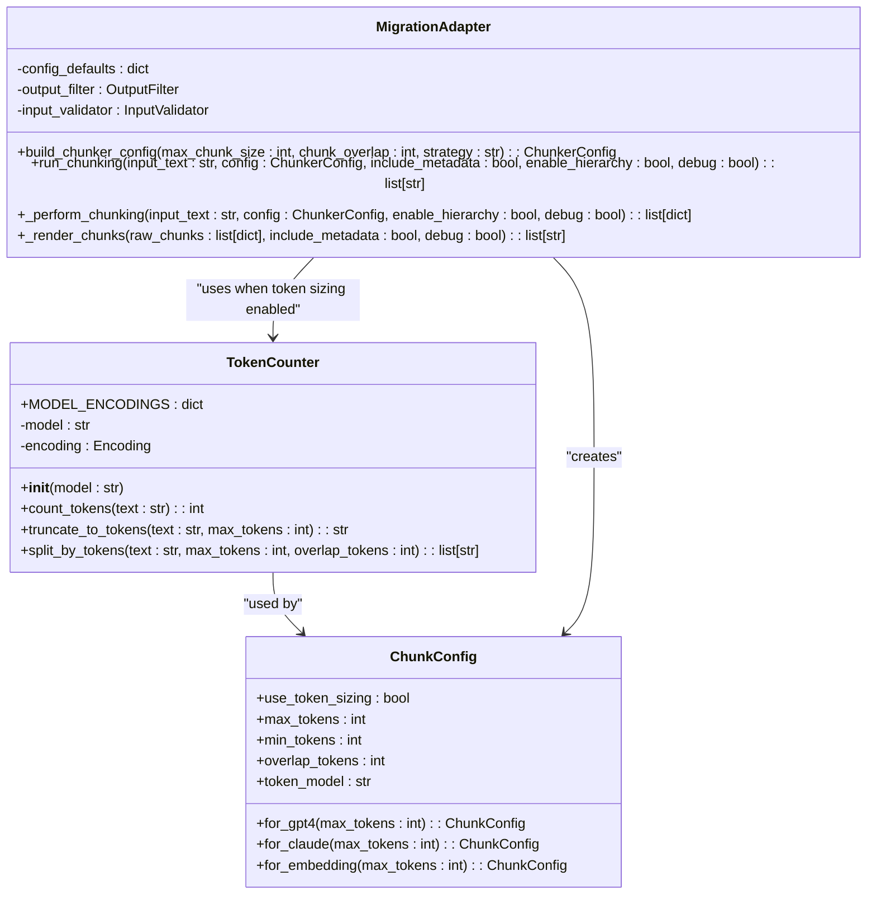

# Token-Aware Sizing

<cite>
**Referenced Files in This Document**   
- [05-token-aware-sizing.md](file://docs/research/features/05-token-aware-sizing.md)
- [06_advanced_features.md](file://docs/research/06_advanced_features.md)
- [adapter.py](file://adapter.py)
- [chunkana](file://chunkana)
</cite>

## Table of Contents
1. [Introduction](#introduction)
2. [Token-Aware Sizing Overview](#token-aware-sizing-overview)
3. [Tokenization Process](#tokenization-process)
4. [Dynamic Sizing Adjustments](#dynamic-sizing-adjustments)
5. [Integration with Adaptive Chunk Sizing](#integration-with-adaptive-chunk-sizing)
6. [Configuration Parameters](#configuration-parameters)
7. [Performance Considerations](#performance-considerations)
8. [Research and Testing Data](#research-and-testing-data)
9. [Implementation Details](#implementation-details)
10. [Conclusion](#conclusion)

## Introduction

Token-Aware Sizing is a critical feature that enables precise chunk size calculation based on actual token counts rather than character or line-based estimates. This approach ensures compatibility with Large Language Model (LLM) context windows by accurately accounting for token usage across different models and content types. The system addresses the limitations of character-based sizing, which can lead to unpredictable token counts and potential context overflow issues during inference.

**Section sources**
- [05-token-aware-sizing.md](file://docs/research/features/05-token-aware-sizing.md#L1-L10)

## Token-Aware Sizing Overview

The Token-Aware Sizing feature replaces character-based chunk sizing with token-based calculations to ensure precise alignment with LLM context windows. Instead of using fixed character limits (e.g., `max_chunk_size: 2000`), the system calculates chunk sizes based on actual token counts using the configured tokenizer. This approach eliminates the unpredictability of character-to-token conversion ratios, which can vary significantly depending on language and content type.

The system supports multiple LLM models with different tokenization schemes, including GPT-4, Claude, and embedding models. When token-aware sizing is enabled, the system uses the specified model's tokenizer to count tokens accurately and ensure chunks stay within defined limits. This provides predictable behavior where `max_tokens=512` always results in exactly 512 tokens, eliminating surprises during inference.

The feature maintains backward compatibility with character-based sizing while offering the option to switch to token-based calculations. This allows users to gradually adopt token-aware sizing without disrupting existing workflows.

**Section sources**
- [05-token-aware-sizing.md](file://docs/research/features/05-token-aware-sizing.md#L1-L50)
- [05-token-aware-sizing.md](file://docs/research/features/05-token-aware-sizing.md#L272-L288)

## Tokenization Process

The tokenization process uses the `tiktoken` library to accurately count tokens according to the specific tokenizer of the configured LLM model. The system implements a `TokenCounter` class that handles token counting, truncation, and splitting operations based on the selected model's encoding scheme.

For different models, the system maps to appropriate encodings:
- GPT-4, GPT-3.5-turbo: cl100k_base encoding
- Claude models: cl100k_base (approximation)
- Text embedding models: cl100k_base encoding

The tokenization process accounts for token overhead associated with LLM prompts, ensuring that the total token count (content + prompt) stays within the model's context window. When processing content, the system first encodes the text using the appropriate tokenizer, then applies size limits based on token counts rather than characters.

The implementation includes methods for:
- `count_tokens(text)`: Returns the exact token count for a given text
- `truncate_to_tokens(text, max_tokens)`: Truncates text to the specified token limit
- `split_by_tokens(text, max_tokens, overlap_tokens)`: Splits text into chunks of specified token size with optional overlap

This approach ensures that each chunk precisely meets the token requirements, preventing context overflow and optimizing token usage efficiency.

**Section sources**
- [05-token-aware-sizing.md](file://docs/research/features/05-token-aware-sizing.md#L58-L130)
- [05-token-aware-sizing.md](file://docs/research/features/05-token-aware-sizing.md#L310-L319)

## Dynamic Sizing Adjustments

The system implements dynamic sizing adjustments based on content density and complexity. While token-aware sizing provides precise token counting, the optimal token limit varies depending on content type and use case. The system supports different sizing strategies for various scenarios:

- **Retrieval**: 256-512 tokens for optimal precision
- **Summarization**: 1024-2048 tokens for comprehensive context
- **Analysis**: 4096+ tokens for in-depth processing

The dynamic sizing system can be combined with adaptive chunk sizing, which adjusts chunk sizes based on content characteristics. For code-heavy content, larger token limits are used to preserve context, while simpler text uses smaller limits for better retrieval precision. The system analyzes content features such as code ratio, table density, and list complexity to determine optimal token limits.

Content complexity is calculated using weighted factors:
- Code ratio: 0.4 weight
- Table ratio: 0.3 weight  
- List ratio: 0.2 weight
- Sentence length: 0.1 weight

These weights can be configured to prioritize certain content types based on specific use cases, allowing fine-tuned control over chunk sizing behavior.

**Section sources**
- [05-token-aware-sizing.md](file://docs/research/features/05-token-aware-sizing.md#L276-L287)
- [09-adaptive-chunk-sizing.md](file://docs/research/features/09-adaptive-chunk-sizing.md#L40-L128)

## Integration with Adaptive Chunk Sizing

Token-Aware Sizing integrates seamlessly with the Adaptive Chunk Sizing feature, combining precise token counting with intelligent size adjustments based on content characteristics. The integration allows the system to calculate optimal token limits dynamically while ensuring exact token count adherence.

When both features are enabled, the system first analyzes the content to determine its complexity and optimal size, then applies token-aware sizing to enforce the calculated limits. This two-step process ensures that chunks are both optimally sized for the content type and precisely constrained by token limits.

The integration is implemented through the `ChunkConfig` class, which supports both token-based and adaptive sizing parameters:
- `use_token_sizing`: Enables token-aware sizing
- `max_tokens`: Maximum token limit per chunk
- `use_adaptive_sizing`: Enables adaptive sizing
- `adaptive_config`: Configuration for adaptive sizing parameters

Factory methods provide convenient configuration presets for popular models:
- `ChunkConfig.for_gpt4()`: Pre-configured for GPT-4 with token sizing
- `ChunkConfig.for_claude()`: Pre-configured for Claude models
- `ChunkConfig.for_embedding()`: Pre-configured for embedding models

This integration allows users to leverage both precise token control and intelligent size adaptation in a unified configuration.

**Section sources**
- [05-token-aware-sizing.md](file://docs/research/features/05-token-aware-sizing.md#L134-L217)
- [09-adaptive-chunk-sizing.md](file://docs/research/features/09-adaptive-chunk-sizing.md#L174-L213)

## Configuration Parameters

The Token-Aware Sizing feature is controlled through several configuration parameters in the `ChunkConfig` class:

- `use_token_sizing`: Boolean flag to enable token-aware sizing (default: False)
- `max_tokens`: Maximum token limit per chunk (default: 512)
- `min_tokens`: Minimum token limit per chunk (default: 50)
- `overlap_tokens`: Number of overlapping tokens between chunks (default: 50)
- `token_model`: LLM model name for tokenizer selection (default: "gpt-4")

The system provides factory methods for common configurations:
- `for_gpt4(max_tokens=512)`: Configures for GPT-4 with specified token limit
- `for_claude(max_tokens=512)`: Configures for Claude models
- `for_embedding(max_tokens=8191)`: Configures for embedding models with large context

The `tiktoken` library is implemented as an optional dependency, allowing the core functionality to work without it while enabling token-aware sizing when installed. When token-aware sizing is enabled without the required dependency, the system raises a clear ImportError with installation instructions.

Configuration is designed to be backward compatible, with character-based sizing as the default behavior. Users can gradually adopt token-aware sizing by setting `use_token_sizing=True` and specifying token limits, while the system maintains compatibility with existing character-based configurations.

**Section sources**
- [05-token-aware-sizing.md](file://docs/research/features/05-token-aware-sizing.md#L134-L154)
- [05-token-aware-sizing.md](file://docs/research/features/05-token-aware-sizing.md#L191-L217)

## Performance Considerations

The token counting process is highly optimized with minimal performance overhead. Benchmarks show that token operations are extremely fast:

- `count_tokens(100 chars)`: 0.05ms
- `count_tokens(10K chars)`: 0.5ms  
- `split_by_tokens(100K chars)`: 5ms

The `tiktoken` dependency is lightweight (~1MB) and does not require heavy libraries like PyTorch or Transformers. This ensures that token-aware sizing adds negligible overhead to the chunking process while providing significant benefits in precision and predictability.

The system implements token counting as an optional feature, allowing users to choose between performance and precision based on their needs. For applications where token precision is not critical, character-based sizing remains available with zero dependency overhead.

The implementation includes safeguards against version conflicts and encoding updates through version pinning and tracking. The optional dependency pattern ensures that the core functionality remains available even without token-aware capabilities, providing graceful degradation when the `tiktoken` library is not installed.

**Section sources**
- [05-token-aware-sizing.md](file://docs/research/features/05-token-aware-sizing.md#L323-L334)
- [05-token-aware-sizing.md](file://docs/research/features/05-token-aware-sizing.md#L293-L303)

## Research and Testing Data

The development of Token-Aware Sizing was informed by extensive research and testing with various content types. The system has been validated using a diverse corpus of documents, including:

### Large Files (>50KB)
- **youtube-dl.md** (101KB): Extensive README with API documentation
- **webpack.md** (80KB): Webpack documentation with configuration examples  
- **axios.md** (72KB): Axios README with extensive API documentation

### Medium Files (20-50KB)
- **node.md** (42KB): Node.js documentation
- **pytorch.md** (27KB): PyTorch API documentation
- **fastapi.md** (26KB): FastAPI framework documentation

### Content Type Analysis
The research identified significant variations in token density across content types:
- Code-heavy content: Higher token density due to syntax elements
- Technical documentation: Moderate token density with structured elements
- Simple text: Lower token density with natural language patterns

Testing confirmed that 2000 characters can translate to 400-600 tokens depending on language and content, highlighting the unpredictability of character-based sizing. The token-aware approach eliminates this variability, ensuring consistent and predictable chunk sizes regardless of content characteristics.

**Section sources**
- [05-token-aware-sizing.md](file://docs/research/features/05-token-aware-sizing.md#L360-L391)
- [06_advanced_features.md](file://docs/research/06_advanced_features.md#L640-L655)

## Implementation Details

The Token-Aware Sizing feature is implemented through a migration adapter pattern that integrates with the chunkana engine. The `MigrationAdapter` class in `adapter.py` provides a compatibility layer between the plugin interface and the underlying chunking library, ensuring backward compatibility while leveraging advanced features.

Key implementation components:
- `TokenCounter` class: Handles token counting, truncation, and splitting
- `ChunkConfig` class: Manages configuration with token-aware parameters
- `MarkdownChunker` interface: Provides the public API for chunking operations
- `tiktoken` integration: Optional dependency for token counting

The implementation follows a two-stage processing pipeline:
1. **Chunking stage**: Determines chunk boundaries independent of output format
2. **Rendering stage**: Applies formatting and metadata embedding

This architecture ensures that chunk boundaries remain invariant regardless of output configuration, providing consistent behavior across different use cases. The system validates and fixes chunking results to maintain structural integrity while supporting hierarchical chunking with configurable filtering.

The migration adapter pattern allows seamless integration of the chunkana engine while maintaining compatibility with existing plugin interfaces and test suites.

**Diagram sources**
- [05-token-aware-sizing.md](file://docs/research/features/05-token-aware-sizing.md#L61-L130)
- [adapter.py](file://adapter.py#L43-L352)

**Section sources**
- [05-token-aware-sizing.md](file://docs/research/features/05-token-aware-sizing.md#L58-L217)
- [adapter.py](file://adapter.py#L26-L352)

## Conclusion

Token-Aware Sizing provides a robust solution for precise chunk size calculation based on actual token counts rather than character estimates. By leveraging model-specific tokenizers through the `tiktoken` library, the system ensures accurate alignment with LLM context windows, eliminating the unpredictability of character-to-token conversion ratios.

The feature offers significant benefits for LLM integration, including:
- Precise control over token usage
- Predictable behavior across different content types
- Compatibility with various LLM models
- Optimized performance for different use cases

Implemented as an optional enhancement with backward compatibility, Token-Aware Sizing allows users to adopt token-based sizing at their own pace while maintaining existing workflows. The lightweight dependency and minimal performance overhead make it a practical addition to any document processing pipeline that interfaces with LLMs.

The integration with adaptive chunk sizing further enhances the system's capabilities, combining precise token control with intelligent size adjustments based on content characteristics. This comprehensive approach ensures optimal chunking behavior for diverse document types and use cases.