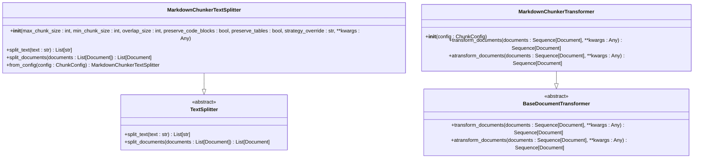
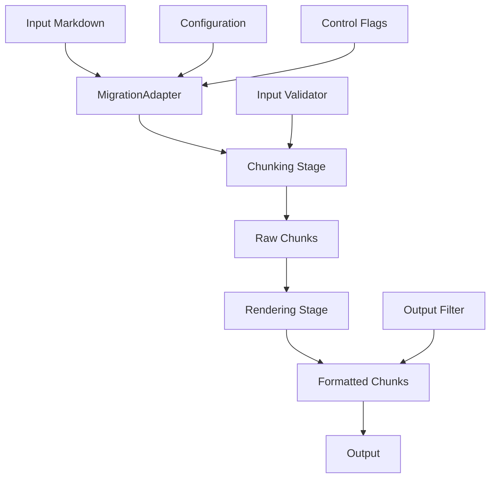

# LangChain Integration

<cite>
**Referenced Files in This Document**   
- [adapter.py](file://adapter.py)
- [docs/research/features/07-langchain-adapter.md](file://docs/research/features/07-langchain-adapter.md)
- [tools/markdown_chunk_tool.py](file://tools/markdown_chunk_tool.py)
- [requirements.txt](file://requirements.txt)
- [manifest.yaml](file://manifest.yaml)
</cite>

## Table of Contents
1. [Introduction](#introduction)
2. [Core Components](#core-components)
3. [Architecture Overview](#architecture-overview)
4. [Configuration and Parameters](#configuration-and-parameters)
5. [Metadata Enrichment and Preservation](#metadata-enrichment-and-preservation)
6. [Practical Integration Examples](#practical-integration-examples)
7. [Package Installation and Compatibility](#package-installation-and-compatibility)
8. [Testing Strategies](#testing-strategies)
9. [Conclusion](#conclusion)

## Introduction

The LangChain integration for dify-markdown-chunker-1 provides a seamless interface between the advanced markdown chunking capabilities of the chunkana engine and the LangChain framework, which is widely used for building Retrieval-Augmented Generation (RAG) applications. This integration enables developers to leverage intelligent, structure-aware markdown chunking within LangChain's ecosystem, enhancing the performance and accuracy of RAG systems by preserving document structure and enriching metadata.

The integration is designed to be backward compatible with existing workflows while introducing enhanced features through the chunkana engine. It supports both flat and hierarchical chunking modes, with configurable parameters for chunk size, overlap, and strategy selection. The adapter ensures that chunk boundaries remain invariant regardless of metadata inclusion, maintaining consistency across different output formats.

This document details the implementation of the `MarkdownChunkerTextSplitter` and `MarkdownChunkerTransformer` classes, their interface with LangChain's text splitting and document transformation systems, and how they map markdown_chunker_v2's chunking capabilities to LangChain's Document schema. It also covers configuration options, practical integration examples, metadata enrichment processes, package installation, version compatibility, and testing strategies.

**Section sources**
- [docs/research/features/07-langchain-adapter.md](file://docs/research/features/07-langchain-adapter.md#L1-L383)

## Core Components

The core components of the LangChain integration for dify-markdown-chunker-1 are the `MarkdownChunkerTextSplitter` and `MarkdownChunkerTransformer` classes, which serve as adapters between the chunkana engine and LangChain's standardized interfaces. These components are implemented in the `langchain_markdown_chunker` package, which provides a clean and intuitive API for integrating advanced markdown chunking into LangChain workflows.

The `MarkdownChunkerTextSplitter` class inherits from LangChain's `TextSplitter` base class and implements the `split_text` and `split_documents` methods. It uses the `ChunkConfig` class to configure chunking parameters such as maximum chunk size, minimum chunk size, overlap size, and strategy override. The splitter creates instances of the `MarkdownChunker` class with the specified configuration and uses it to process markdown content.

The `MarkdownChunkerTransformer` class implements LangChain's `BaseDocumentTransformer` interface, allowing it to be used in LangChain pipelines and chains. It wraps the `MarkdownChunkerTextSplitter` and provides both synchronous and asynchronous versions of the `transform_documents` method. This enables the transformer to be used in various contexts, including batch processing and real-time applications.

Both components are designed to preserve and enrich document metadata, ensuring that critical information such as source, chunk index, header path, and strategy used is retained throughout the chunking process. This metadata enrichment is crucial for improving the performance of RAG systems, as it provides additional context for retrieval and generation.



**Diagram sources**
- [docs/research/features/07-langchain-adapter.md](file://docs/research/features/07-langchain-adapter.md#L58-L200)

**Section sources**
- [docs/research/features/07-langchain-adapter.md](file://docs/research/features/07-langchain-adapter.md#L58-L200)

## Architecture Overview

The architecture of the LangChain integration for dify-markdown-chunker-1 follows a two-stage processing model: chunking and rendering. This design ensures that chunk boundaries are invariant with respect to metadata inclusion, maintaining consistency across different output formats. The architecture is built around the `MigrationAdapter` class, which provides a compatibility layer between the plugin's tool interface and the chunkana library.

In the first stage, the `MigrationAdapter` performs chunking by analyzing the input markdown content and applying the appropriate chunking strategy based on the content's structure and characteristics. This stage is independent of the output format and focuses solely on creating meaningful chunks that preserve the document's semantic and structural integrity. The chunking process takes into account various factors such as code blocks, tables, lists, and headers, ensuring that these elements are not split across multiple chunks.

In the second stage, the `MigrationAdapter` renders the chunks into the desired output format. This stage is responsible for formatting the chunks and embedding metadata as required. For example, when `include_metadata` is set to `True`, the adapter formats each chunk with embedded metadata in a dify-style format, including a `<metadata>` tag with JSON-formatted metadata. When `include_metadata` is set to `False`, the adapter embeds overlap content (previous_content + content + next_content) into the returned strings for context preservation.

The architecture also supports hierarchical chunking, where chunks are organized into a tree structure based on their position in the document's hierarchy. This allows for more sophisticated retrieval strategies, such as retrieving only leaf chunks or filtering chunks based on their position in the hierarchy. The `OutputFilter` class is used to apply these filters, ensuring that the output meets the specific requirements of the use case.



**Diagram sources**
- [adapter.py](file://adapter.py#L43-L352)

**Section sources**
- [adapter.py](file://adapter.py#L43-L352)

## Configuration and Parameters

The LangChain integration for dify-markdown-chunker-1 offers a range of configuration options to customize the chunking process according to specific requirements. These options are exposed through the `MarkdownChunkerTextSplitter` and `MarkdownChunkerTransformer` classes, allowing developers to fine-tune the behavior of the chunker to suit their use case.

The primary configuration parameters include `max_chunk_size`, `min_chunk_size`, `overlap_size`, `preserve_code_blocks`, `preserve_tables`, and `strategy_override`. The `max_chunk_size` parameter controls the maximum number of characters in each chunk, while `min_chunk_size` sets the minimum threshold for chunk size. The `overlap_size` parameter determines the amount of overlap between adjacent chunks, which helps preserve context and improve retrieval accuracy.

The `preserve_code_blocks` and `preserve_tables` parameters ensure that code blocks and tables are kept intact within chunks, preventing them from being split across multiple chunks. This is particularly important for technical documentation and code-heavy content, where splitting these elements could lead to loss of meaning or syntax errors.

The `strategy_override` parameter allows developers to specify a particular chunking strategy to use, overriding the automatic strategy selection. The available strategies include "auto", "code_aware", "list_aware", "structural", and "fallback". The "auto" strategy analyzes the content and selects the most appropriate strategy based on its characteristics, while the other strategies focus on specific aspects of the content.

These configuration options are passed to the `ChunkConfig` class, which is used to create instances of the `MarkdownChunker` class. The `ChunkConfig` class validates the parameters and ensures that they are within acceptable ranges, providing a robust and reliable configuration system.

**Section sources**
- [docs/research/features/07-langchain-adapter.md](file://docs/research/features/07-langchain-adapter.md#L80-L162)
- [adapter.py](file://adapter.py#L94-L119)

## Metadata Enrichment and Preservation

Metadata enrichment and preservation are critical aspects of the LangChain integration for dify-markdown-chunker-1, as they enhance the performance and accuracy of RAG systems by providing additional context for retrieval and generation. The integration preserves and enriches document metadata in several ways, ensuring that important information is retained throughout the chunking process.

When using the `split_documents` method of the `MarkdownChunkerTextSplitter` class, the original metadata from the input documents is merged with chunk-specific metadata. This includes fields such as `chunk_index`, `total_chunks`, `strategy_used`, `start_line`, `end_line`, and `header_path`. The `chunk_index` field indicates the position of the chunk within the document, while `total_chunks` provides the total number of chunks generated. The `strategy_used` field records the chunking strategy that was applied, which can be useful for debugging and optimization.

The `start_line` and `end_line` fields indicate the line numbers in the original document where the chunk begins and ends, respectively. This information can be used to reconstruct the original document or to provide context for the chunk. The `header_path` field records the hierarchical path of headers leading to the chunk, which helps preserve the document's structure and provides additional context for retrieval.

The integration also includes a metadata filtering mechanism that removes fields that are not useful for RAG search. This is implemented in the `_filter_metadata_for_rag` method of the `MigrationAdapter` class, which excludes fields such as `avg_line_length`, `avg_word_length`, `char_count`, `line_count`, `size_bytes`, `word_count`, `item_count`, `nested_item_count`, `unordered_item_count`, `ordered_item_count`, `max_nesting`, `task_item_count`, `execution_fallback_level`, `execution_fallback_used`, `execution_strategy_used`, `preamble.char_count`, `preamble.line_count`, `preamble.has_metadata`, `preamble.metadata_fields`, `preamble.type`, `preamble_type`, `preview`, and `total_chunks`.

This metadata enrichment and filtering process ensures that the output is optimized for RAG applications, providing the necessary context while minimizing noise and redundancy.

**Section sources**
- [docs/research/features/07-langchain-adapter.md](file://docs/research/features/07-langchain-adapter.md#L136-L150)
- [adapter.py](file://adapter.py#L306-L347)

## Practical Integration Examples

The LangChain integration for dify-markdown-chunker-1 can be easily integrated into various workflows and applications, from simple text splitting to complex RAG pipelines. The following examples demonstrate how to use the `MarkdownChunkerTextSplitter` and `MarkdownChunkerTransformer` classes in different scenarios.

### Basic Usage

The most basic usage of the integration involves creating a `MarkdownChunkerTextSplitter` instance and using it to split a markdown document into chunks. This can be done with just a few lines of code:

```python
from langchain_markdown_chunker import MarkdownChunkerTextSplitter

# Create splitter
splitter = MarkdownChunkerTextSplitter(
    max_chunk_size=1500,
    overlap_size=100
)

# Split text
with open("docs/api.md") as f:
    markdown = f.read()

chunks = splitter.split_text(markdown)
print(f"Created {len(chunks)} chunks")
```

### With Document Loaders

The integration can also be used with LangChain's document loaders to process multiple markdown files at once. This is particularly useful for building knowledge bases or processing large collections of documentation:

```python
from langchain.document_loaders import DirectoryLoader
from langchain_markdown_chunker import MarkdownChunkerTextSplitter

# Load markdown files
loader = DirectoryLoader("docs/", glob="**/*.md")
documents = loader.load()

# Split with markdown-aware chunking
splitter = MarkdownChunkerTextSplitter(
    max_chunk_size=2000,
    preserve_code_blocks=True
)
chunks = splitter.split_documents(documents)

# Store in vector database
from langchain.vectorstores import Chroma
from langchain.embeddings import OpenAIEmbeddings

vectorstore = Chroma.from_documents(
    chunks,
    embedding=OpenAIEmbeddings()
)
```

### In RAG Pipeline

The integration can be used in a RAG pipeline to improve the accuracy and relevance of generated responses. By using the `MarkdownChunkerTextSplitter` to chunk the input documents, the pipeline can retrieve more meaningful and contextually relevant chunks:

```python
from langchain.chains import RetrievalQA
from langchain.chat_models import ChatOpenAI

# Create QA chain with markdown-chunked docs
qa = RetrievalQA.from_chain_type(
    llm=ChatOpenAI(),
    retriever=vectorstore.as_retriever(),
    chain_type="stuff"
)

answer = qa.run("How do I authenticate with the API?")
```

These examples demonstrate the flexibility and power of the LangChain integration for dify-markdown-chunker-1, making it easy to incorporate advanced markdown chunking into a wide range of applications.

**Section sources**
- [docs/research/features/07-langchain-adapter.md](file://docs/research/features/07-langchain-adapter.md#L203-L263)

## Package Installation and Compatibility

The LangChain integration for dify-markdown-chunker-1 is distributed as a Python package named `langchain-markdown-chunker`, which can be installed from PyPI using pip. The package is compatible with Python 3.9 and later versions, and it requires LangChain-core version 0.1.0 or higher and markdown-chunker version 2.0.0 or higher.

To install the package, run the following command:

```bash
pip install langchain-markdown-chunker
```

The package is designed to be compatible with the latest versions of LangChain and its ecosystem, including document loaders, vector stores, and RAG pipelines. It has been tested with popular vector stores such as Chroma and FAISS, and it works seamlessly with LangChain's document loaders and chains.

The package is also compatible with the Dify platform, which is used for building and deploying AI applications. The integration has been tested with Dify version 1.9.0 and later, and it can be used as a plugin in Dify's knowledge base processing pipelines.

The package includes comprehensive documentation and examples, making it easy for developers to get started with the integration. It also includes automated tests and continuous integration, ensuring that the package is reliable and maintainable.

**Section sources**
- [docs/research/features/07-langchain-adapter.md](file://docs/research/features/07-langchain-adapter.md#L271-L305)
- [requirements.txt](file://requirements.txt#L1-L22)

## Testing Strategies

The LangChain integration for dify-markdown-chunker-1 includes a comprehensive testing strategy to ensure the reliability and correctness of the code. The testing suite consists of unit tests, integration tests, and property-based tests, covering all aspects of the integration.

Unit tests focus on individual components and functions, verifying that they behave as expected in isolation. For example, there are unit tests for the `MarkdownChunkerTextSplitter` and `MarkdownChunkerTransformer` classes, ensuring that they correctly implement the LangChain interfaces and handle edge cases appropriately.

Integration tests verify that the components work together as expected in end-to-end workflows. These tests use real markdown content and simulate the entire chunking process, from input to output. They also test the integration with LangChain's document loaders, vector stores, and RAG pipelines, ensuring that the integration works seamlessly with the rest of the ecosystem.

Property-based tests use the Hypothesis library to generate random inputs and verify that the code satisfies certain properties. For example, there are property-based tests that verify that the chunk boundaries are invariant with respect to metadata inclusion, and that the output is consistent across different runs.

The testing suite is run automatically using continuous integration, ensuring that any changes to the code are thoroughly tested before being merged. The package also includes code coverage reports, which show the percentage of code that is covered by tests.

**Section sources**
- [docs/research/features/07-langchain-adapter.md](file://docs/research/features/07-langchain-adapter.md#L313-L335)
- [tests/test_integration_basic.py](file://tests/test_integration_basic.py#L1-L233)

## Conclusion

The LangChain integration for dify-markdown-chunker-1 provides a powerful and flexible solution for integrating advanced markdown chunking into LangChain workflows. By leveraging the chunkana engine and providing a clean and intuitive API, the integration enables developers to build more accurate and contextually relevant RAG applications.

The integration preserves and enriches document metadata, ensuring that critical information such as source, chunk index, header path, and strategy used is retained throughout the chunking process. It supports both flat and hierarchical chunking modes, with configurable parameters for chunk size, overlap, and strategy selection.

The integration is easy to use and can be incorporated into a wide range of applications, from simple text splitting to complex RAG pipelines. It is compatible with the latest versions of LangChain and its ecosystem, and it has been tested with popular vector stores such as Chroma and FAISS.

With comprehensive documentation, examples, and automated tests, the LangChain integration for dify-markdown-chunker-1 is a reliable and maintainable solution for advanced markdown chunking in RAG applications.