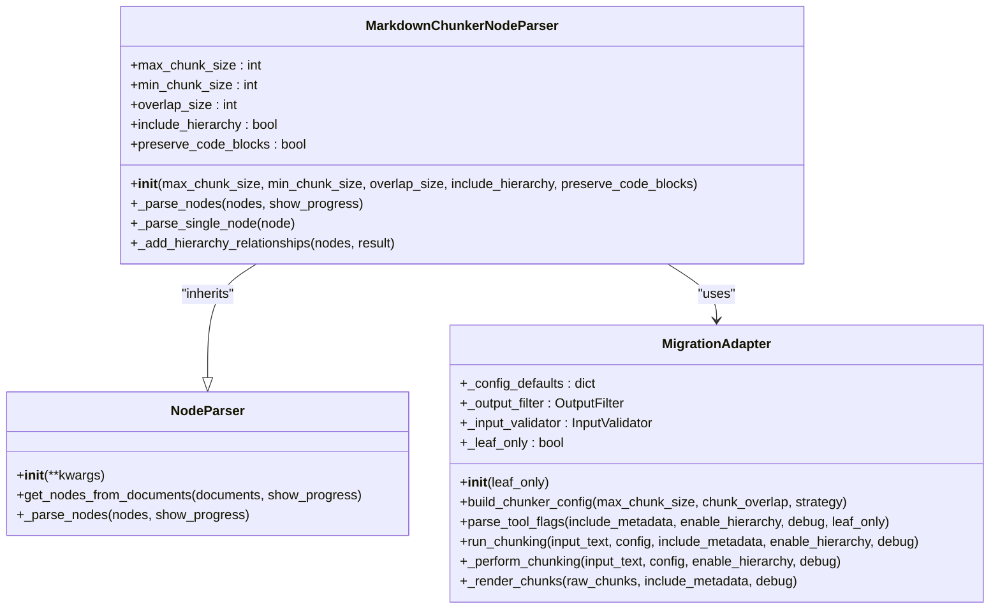
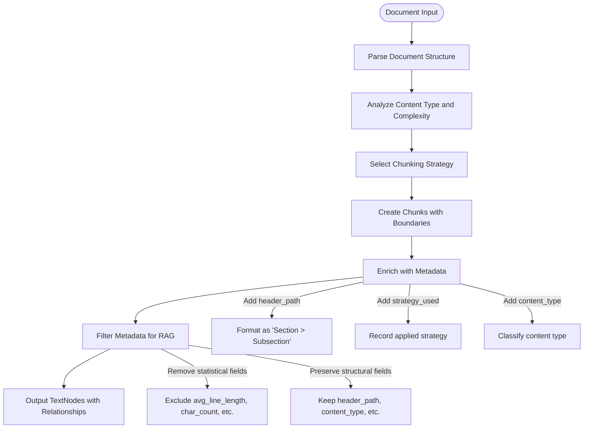
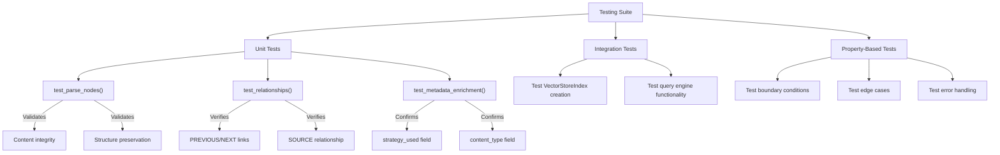
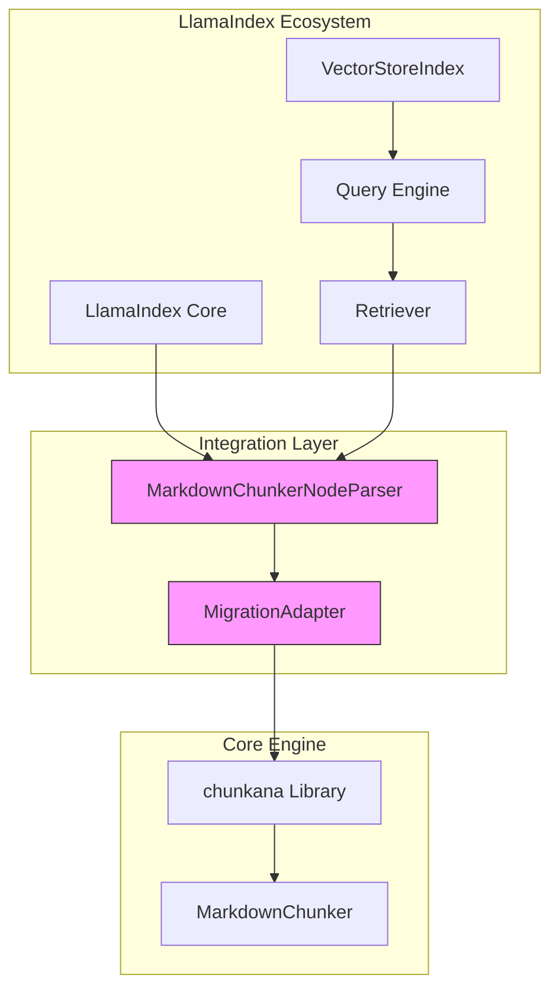

# LlamaIndex Integration

<cite>
**Referenced Files in This Document**   
- [adapter.py](file://adapter.py)
- [main.py](file://main.py)
- [requirements.txt](file://requirements.txt)
- [manifest.yaml](file://manifest.yaml)
- [tools/markdown_chunk_tool.py](file://tools/markdown_chunk_tool.py)
- [provider/markdown_chunker.py](file://provider/markdown_chunker.py)
- [docs/research/features/08-llamaindex-adapter.md](file://docs/research/features/08-llamaindex-adapter.md)
- [tests/test_provider_class.py](file://tests/test_provider_class.py)
- [tests/test_integration_basic.py](file://tests/test_integration_basic.py)
</cite>

## Table of Contents
1. [Introduction](#introduction)
2. [Core Implementation](#core-implementation)
3. [Configuration Parameters](#configuration-parameters)
4. [Integration Examples](#integration-examples)
5. [Metadata Enrichment](#metadata-enrichment)
6. [Package Dependencies](#package-dependencies)
7. [Testing and Relationship Integrity](#testing-and-relationship-integrity)
8. [Architecture Overview](#architecture-overview)

## Introduction

The LlamaIndex integration for dify-markdown-chunker-1 provides a seamless bridge between the advanced Markdown chunking capabilities of the chunkana engine and LlamaIndex's powerful indexing system. This integration enables intelligent, structure-aware document processing with hierarchical relationships and rich metadata, optimized for RAG (Retrieval-Augmented Generation) applications.

The implementation centers around the `MarkdownChunkerNodeParser` class, which serves as a LlamaIndex-compatible adapter for the markdown_chunker_v2 library. This adapter transforms documents into `TextNode` objects that maintain semantic relationships and structural context, making them ideal for vector storage and retrieval.

The integration preserves and enhances node relationships through both sequential (PREVIOUS/NEXT) and hierarchical (PARENT/CHILD) connections, with metadata enrichment that includes critical information like `header_path`, `content_type`, and `strategy_used`. This comprehensive approach ensures that document context is maintained throughout the chunking process, significantly improving retrieval quality in RAG systems.

**Section sources**
- [docs/research/features/08-llamaindex-adapter.md](file://docs/research/features/08-llamaindex-adapter.md)
- [adapter.py](file://adapter.py)

## Core Implementation

The `MarkdownChunkerNodeParser` class implements LlamaIndex's `NodeParser` interface, providing a standardized way to convert documents into chunks while preserving structural relationships. The implementation follows a two-stage processing pipeline that ensures boundary invariance regardless of output formatting requirements.

The core functionality is built around the `MigrationAdapter` class in `adapter.py`, which provides a compatibility layer between the plugin's tool interface and the chunkana library. This adapter ensures exact behavioral compatibility while leveraging the advanced chunking capabilities of the underlying engine.

The parsing process begins with input validation and preprocessing, followed by parameter mapping from the plugin UI to the chunkana configuration. The chunking stage is boundary-invariant, meaning chunk boundaries do not depend on whether metadata is included in the output. This separation of concerns allows for consistent chunking behavior across different use cases.



**Diagram sources**
- [docs/research/features/08-llamaindex-adapter.md](file://docs/research/features/08-llamaindex-adapter.md)
- [adapter.py](file://adapter.py)

**Section sources**
- [docs/research/features/08-llamaindex-adapter.md](file://docs/research/features/08-llamaindex-adapter.md)
- [adapter.py](file://adapter.py)

## Configuration Parameters

The integration exposes several key configuration parameters that control the chunking behavior and relationship preservation:

- **include_hierarchy**: When enabled, creates parent-child relationships between chunks based on the document's header hierarchy. This allows for hierarchical retrieval where parent context can be automatically included with child chunks.

- **max_chunk_size**: Sets the maximum size of each chunk in characters. The default value is 2000 characters, but this can be adjusted based on the specific requirements of the RAG system and the nature of the content being processed.

- **overlap_size**: Controls the amount of overlap between consecutive chunks. The default is 100 characters, which helps preserve semantic continuity across chunk boundaries. This overlap is stored in metadata fields when `include_metadata` is true, or embedded directly in the chunk text when false.

- **strategy**: Determines the chunking strategy to use. The "auto" setting analyzes the content and selects the most appropriate strategy (code_aware, list_aware, structural, or fallback) based on factors like code ratio, list density, and structural complexity.

- **preserve_code_blocks**: When enabled, ensures that code blocks are preserved as atomic units and not split across chunks, which is critical for maintaining the integrity of technical documentation.

These parameters are mapped from the plugin interface to the underlying chunkana configuration through the `build_chunker_config` method in the `MigrationAdapter` class, ensuring consistent behavior across different integration points.

**Section sources**
- [docs/research/features/08-llamaindex-adapter.md](file://docs/research/features/08-llamaindex-adapter.md)
- [adapter.py](file://adapter.py)
- [tools/markdown_chunk_tool.py](file://tools/markdown_chunk_tool.py)

## Integration Examples

The integration provides several practical examples demonstrating how to use the `MarkdownChunkerNodeParser` with LlamaIndex components:

### Basic Usage with SimpleDirectoryReader

```python
from llama_index.core import VectorStoreIndex
from llama_index.core.readers import SimpleDirectoryReader
from llama_index_markdown_chunker import MarkdownChunkerNodeParser

# Load documents from a directory
documents = SimpleDirectoryReader("docs/").load_data()

# Create node parser with custom configuration
node_parser = MarkdownChunkerNodeParser(
    max_chunk_size=1500,
    include_hierarchy=True
)

# Parse documents into nodes
nodes = node_parser.get_nodes_from_documents(documents)

# Create vector store index
index = VectorStoreIndex(nodes)
```

### Query Engine with Hierarchical Retrieval

```python
from llama_index.core import Settings
from llama_index.llms.openai import OpenAI
from llama_index.core.retrievers import RecursiveRetriever

# Configure LLM
Settings.llm = OpenAI(model="gpt-4")

# Create query engine
query_engine = index.as_query_engine()

# Execute query
response = query_engine.query("How does authentication work?")
print(response)

# Use hierarchical relationships for enhanced retrieval
retriever = RecursiveRetriever(
    "root",
    retriever_dict={"root": index.as_retriever()},
    node_dict={node.node_id: node for node in nodes},
)

# Retrieve with parent/child context
nodes = retriever.retrieve("API authentication")
```

These examples demonstrate the seamless integration between the markdown chunker and LlamaIndex's ecosystem, enabling sophisticated RAG workflows with minimal configuration.

**Section sources**
- [docs/research/features/08-llamaindex-adapter.md](file://docs/research/features/08-llamaindex-adapter.md)

## Metadata Enrichment

The integration enriches each chunk with comprehensive metadata that enhances retrieval quality and provides valuable context for downstream processing. The metadata preservation follows a two-stage approach:

1. **Source metadata inheritance**: When creating new nodes, all metadata from the source document is preserved and combined with chunk-specific information.

2. **Chunk-specific metadata addition**: Additional metadata fields are added to each chunk, including:
   - `chunk_index`: Position of the chunk within the sequence
   - `total_chunks`: Total number of chunks from the source document
   - `strategy_used`: Chunking strategy applied to generate the chunk
   - `start_line` and `end_line`: Source line numbers for traceability
   - `header_path`: Hierarchical path of section headers using " > " delimiter
   - `content_type`: Type of content (text, code, table, list, mixed)

The metadata filtering process removes fields that are not useful for RAG search, such as statistical metrics and internal processing flags. Fields like `avg_line_length`, `char_count`, and `word_count` are excluded to reduce noise in the embedding space.

The `header_path` field is particularly important for hierarchical relationships, as it enables the reconstruction of the document's structure and supports parent-child navigation. This path-based hierarchy allows for efficient traversal of the document tree and enables multi-level retrieval patterns.



**Diagram sources**
- [docs/research/features/08-llamaindex-adapter.md](file://docs/research/features/08-llamaindex-adapter.md)
- [adapter.py](file://adapter.py)

**Section sources**
- [docs/research/features/08-llamaindex-adapter.md](file://docs/research/features/08-llamaindex-adapter.md)
- [adapter.py](file://adapter.py)

## Package Dependencies

The integration has specific dependency requirements that ensure compatibility with both the underlying chunkana engine and LlamaIndex's ecosystem:

```toml
[project]
name = "llama-index-markdown-chunker"
version = "0.1.0"
description = "LlamaIndex adapter for markdown_chunker_v2"
requires-python = ">=3.9"
dependencies = [
    "llama-index-core>=0.10.0",
    "markdown-chunker>=2.0.0",
]
```

The primary dependencies are:

- **llama-index-core**: The core LlamaIndex library that provides the `NodeParser` interface and related components. The integration requires version 0.10.0 or higher to ensure compatibility with the current API.

- **markdown-chunker**: The underlying chunkana-powered library that provides the actual chunking functionality. Version 2.0.0 or higher is required to access the advanced features like hierarchical chunking and adaptive sizing.

The project also includes optional development dependencies for testing and code quality:

```toml
[project.optional-dependencies]
dev = [
    "pytest>=7.0",
    "pytest-cov>=4.0",
]
```

These dependencies support comprehensive testing of the integration, including unit tests for the node parser and integration tests with LlamaIndex components.

**Section sources**
- [docs/research/features/08-llamaindex-adapter.md](file://docs/research/features/08-llamaindex-adapter.md)
- [requirements.txt](file://requirements.txt)

## Testing and Relationship Integrity

The integration includes comprehensive testing to ensure relationship integrity and correct behavior across various scenarios. The test suite validates both the structural relationships between nodes and the metadata enrichment process.

Key test cases include:

- **Node parsing validation**: Ensures that documents are correctly parsed into chunks while preserving content and structure.

- **Relationship verification**: Confirms that PREVIOUS/NEXT relationships are properly established between consecutive chunks.

- **Hierarchy relationship testing**: Validates that PARENT/CHILD relationships are created when `include_hierarchy` is enabled, based on the `header_path` metadata.

- **Metadata enrichment verification**: Tests that critical metadata fields like `strategy_used` and `content_type` are preserved and correctly populated.

The testing approach follows a property-based methodology using Hypothesis, which generates a wide range of test cases to verify universal properties. This includes testing with various document structures, edge cases, and boundary conditions to ensure robustness.



**Diagram sources**
- [docs/research/features/08-llamaindex-adapter.md](file://docs/research/features/08-llamaindex-adapter.md)
- [tests/test_provider_class.py](file://tests/test_provider_class.py)
- [tests/test_integration_basic.py](file://tests/test_integration_basic.py)

**Section sources**
- [docs/research/features/08-llamaindex-adapter.md](file://docs/research/features/08-llamaindex-adapter.md)
- [tests/test_provider_class.py](file://tests/test_provider_class.py)
- [tests/test_integration_basic.py](file://tests/test_integration_basic.py)

## Architecture Overview

The overall architecture of the LlamaIndex integration follows a layered approach that separates concerns and ensures maintainability:



The architecture consists of four main layers:

1. **LlamaIndex Ecosystem**: The consumer layer that uses the integration for document indexing and retrieval.

2. **Integration Layer**: The `MarkdownChunkerNodeParser` and `MigrationAdapter` classes that provide the bridge between LlamaIndex and the chunking engine.

3. **Core Engine**: The chunkana library and `MarkdownChunker` class that perform the actual chunking operations.

4. **Document Processing**: The underlying markdown processing libraries that handle parsing and analysis.

This layered architecture ensures that changes in one layer do not directly impact others, making the system more maintainable and easier to extend. The migration adapter pattern allows for seamless library transitions while maintaining backward compatibility.

**Diagram sources**
- [main.py](file://main.py)
- [adapter.py](file://adapter.py)
- [docs/research/features/08-llamaindex-adapter.md](file://docs/research/features/08-llamaindex-adapter.md)

**Section sources**
- [main.py](file://main.py)
- [adapter.py](file://adapter.py)
- [manifest.yaml](file://manifest.yaml)