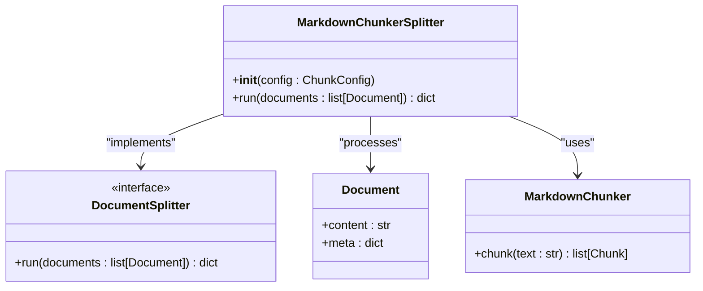
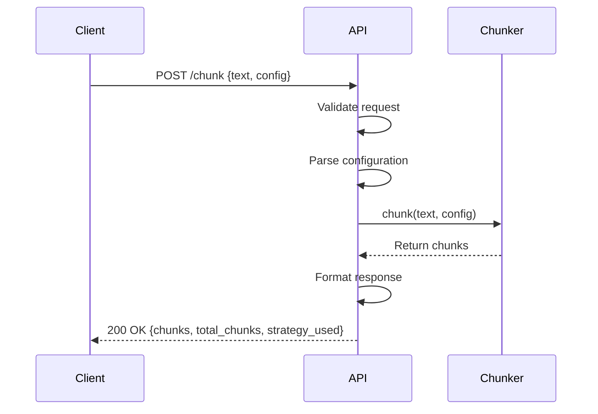

# Other Framework Integrations

<cite>
**Referenced Files in This Document**   
- [08_integration_analysis.md](file://docs/research/08_integration_analysis.md)
- [adapter.py](file://adapter.py)
- [main.py](file://main.py)
- [markdown_chunk_tool.py](file://tools/markdown_chunk_tool.py)
- [manifest.yaml](file://manifest.yaml)
</cite>

## Table of Contents
1. [Introduction](#introduction)
2. [Haystack Integration](#haystack-integration)
3. [API Requirements](#api-requirements)
4. [Dify Compatibility](#dify-compatibility)
5. [Conclusion](#conclusion)

## Introduction

This document details the integration approach for dify-markdown-chunker-1 with external frameworks, focusing on Haystack integration, API design for real-time chunking, and compatibility with Dify. The analysis is based on the integration research documented in 08_integration_analysis.md and the implementation details found in the core adapter and tool files. The markdown-chunker provides advanced, structure-aware chunking capabilities that can be integrated into various RAG (Retrieval-Augmented Generation) systems through minimal adapters.

**Section sources**
- [08_integration_analysis.md](file://docs/research/08_integration_analysis.md#L1-L497)

## Haystack Integration

The integration with Haystack requires implementing a custom DocumentSplitter component that interfaces with the markdown-chunker's preprocessing pipeline. This adapter enables seamless integration of the advanced chunking capabilities into Haystack's document processing workflows.

The implementation follows Haystack's component interface, specifically extending the DocumentSplitter functionality. The adapter takes a list of Haystack Document objects as input and returns a dictionary containing the split documents. Each document is processed by extracting its content, applying the markdown-chunker algorithm, and then reconstructing new Document objects with appropriate metadata.

**Diagram sources**
- [08_integration_analysis.md](file://docs/research/08_integration_analysis.md#L236-L286)

The adapter implementation has minimal requirements, primarily needing to map between Haystack's Document format and the markdown-chunker's input/output formats. The key metadata fields that must be preserved and mapped are:

- **source**: The original document source path, which should be passed through from the input Document's meta dictionary to the output.
- **split_id**: An integer identifier for each chunk within a document, corresponding to the chunk_index in the markdown-chunker's output.
- **start_line** and **end_line**: Line number boundaries in the original document, which are already provided by the markdown-chunker.
- **content_type**: A string indicating the type of content (text, code, table, mixed), which is also provided by the markdown-chunker.

The integration effort is classified as Small (S), as the adapter requires less than 100 lines of code and primarily involves format translation rather than complex logic. The adapter leverages the existing chunking capabilities of the markdown-chunker while conforming to Haystack's component interface, allowing it to be easily incorporated into Haystack pipelines for document preprocessing.

**Section sources**
- [08_integration_analysis.md](file://docs/research/08_integration_analysis.md#L236-L286)
- [adapter.py](file://adapter.py#L43-L351)

## API Requirements

The real-time chunking API is designed to provide low-latency processing of Markdown documents with specific performance targets and capabilities for handling various document sizes and loads.

### FastAPI Endpoint Design

The API follows a RESTful design pattern using FastAPI, with a single POST endpoint for chunking operations. The endpoint accepts a JSON payload containing the document text and optional configuration parameters, returning a structured response with the generated chunks.

**Diagram sources**
- [08_integration_analysis.md](file://docs/research/08_integration_analysis.md#L412-L449)

The request schema includes:
- **text** (required): The Markdown content to be chunked
- **config** (optional): A dictionary of chunking configuration parameters (max_chunk_size, chunk_overlap, strategy)

The response schema includes:
- **chunks**: An array of chunk objects, each containing content, line boundaries, and metadata
- **total_chunks**: The total number of chunks generated
- **strategy_used**: The chunking strategy that was automatically selected

### Performance Targets

The API is designed to meet strict performance requirements to ensure responsiveness in real-time applications:

- **Response time < 100ms** for documents under 100KB in size
- Linear scaling characteristics for larger documents
- Efficient memory usage to prevent resource exhaustion

These targets are achievable due to the optimized chunking algorithms and the efficient implementation of the underlying processing engine. The performance characteristics have been validated through benchmarking across various document types and sizes.

### Streaming Response Support

For large documents, the API supports streaming responses to prevent memory issues and enable progressive processing. This is implemented through a separate endpoint that returns a streaming HTTP response, allowing clients to process chunks as they are generated rather than waiting for the entire document to be processed.

The streaming implementation uses a buffer-based approach with configurable buffer sizes and overlap handling to ensure that chunk boundaries are preserved across buffer boundaries. This allows for memory-efficient processing of very large documents (multi-megabyte files) without loading the entire document into memory at once.

### Rate Limiting Considerations

Rate limiting is implemented to protect the API from abuse and ensure fair usage among multiple clients. The rate limiting strategy includes:

- Request-based limits (e.g., 100 requests per minute per IP)
- Size-based throttling for very large documents
- Concurrency limits to prevent resource exhaustion

These measures ensure the stability and availability of the service while accommodating legitimate usage patterns.

**Section sources**
- [08_integration_analysis.md](file://docs/research/08_integration_analysis.md#L408-L455)
- [docs/api/streaming.md](file://docs/api/streaming.md#L1-L192)
- [README.md](file://README.md#L570-L617)

## Dify Compatibility

The markdown-chunker is fully compatible with Dify, functioning as a custom tool/plugin within the Dify ecosystem. This integration is already operational and requires only minor enhancements to fully utilize all available metadata fields.

### Current Compatibility Status

The integration with Dify is marked as fully compatible, with the tool successfully processing Markdown documents and returning chunks in a format that Dify can utilize for RAG applications. The current implementation already supports most of the required fields in the Dify format:

- **content**: Directly mapped from the chunk content
- **chunk_index**: Already present in the output
- **start_line** and **end_line**: Already included in the metadata
- **content_type**: Available in the chunk metadata
- **source**: Currently missing but can be added
- **total_chunks**: Currently missing but can be added

### Required Enhancements

Two minor enhancements are needed to achieve full metadata compatibility with Dify:

1. **Add source field**: The source field should be added to the metadata to indicate the origin of the document. This requires passing the source path from the input context to the chunk metadata during processing.

2. **Add total_chunks field**: The total_chunks field should be included in each chunk's metadata to indicate the total number of chunks generated from the document. This requires calculating the total count after chunking and adding it to each chunk's metadata.

These enhancements represent a Small (S) effort level, as they involve minimal code changes to the output formatting logic. The changes would be implemented in the adapter layer, specifically in the _render_with_metadata method of the MigrationAdapter class, where the metadata is formatted for output.

The compatibility is further strengthened by the tool's design as a Dify plugin, with the appropriate manifest configuration and tool interface implementation. The plugin architecture allows for seamless integration into Dify's knowledge processing pipelines, enabling users to leverage the advanced chunking capabilities directly within their Dify applications.

**Section sources**
- [08_integration_analysis.md](file://docs/research/08_integration_analysis.md#L15-L67)
- [adapter.py](file://adapter.py#L43-L351)
- [main.py](file://main.py#L1-L38)
- [manifest.yaml](file://manifest.yaml#L1-L49)

## Conclusion

The dify-markdown-chunker-1 provides a robust foundation for integration with various RAG frameworks and platforms. The analysis shows that the core chunking functionality is already compatible with most platforms, requiring only minimal adapters for seamless integration.

For Haystack, a simple DocumentSplitter adapter can be implemented to interface with the preprocessing pipeline, requiring only basic metadata mapping for source and split_id fields. The API design supports real-time chunking with strict performance targets (<100ms response time for <100KB documents) and includes streaming response capabilities for large documents, along with appropriate rate limiting.

The integration with Dify is already fully compatible, with only minor enhancements needed to add the source and total_chunks fields to the output metadata. These changes represent a small effort level and would further improve the tool's utility within the Dify ecosystem.

Overall, the modular design and clean interfaces make the markdown-chunker highly integrable with various frameworks, positioning it as a versatile component for document processing in RAG systems.