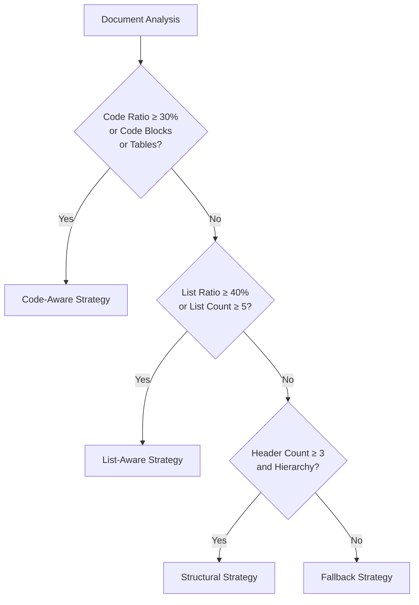
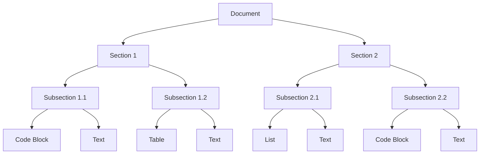
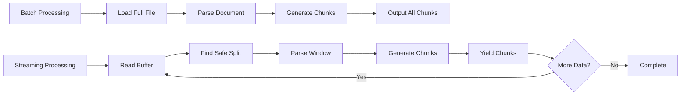

# Benchmark Results

<cite>
**Referenced Files in This Document**   
- [07_benchmark_results.md](file://docs/research/07_benchmark_results.md)
- [03_corpus_spec.md](file://docs/research/03_corpus_spec.md)
- [04_metrics_definition.md](file://docs/research/04_metrics_definition.md)
- [performance.md](file://docs/guides/performance.md)
- [strategies.md](file://docs/architecture/strategies.md)
- [README.md](file://tests/corpus/README.md)
- [code_heavy.md](file://tests/fixtures/code_heavy.md)
- [list_heavy.md](file://tests/fixtures/list_heavy.md)
- [nested_fencing_minimal.md](file://tests/fixtures/nested_fencing_minimal.md)
- [streaming.md](file://docs/api/streaming.md)
- [README.md](file://docs/architecture/README.md)
</cite>

## Table of Contents
1. [Executive Summary](#executive-summary)
2. [Testing Methodology](#testing-methodology)
3. [Corpus Specification](#corpus-specification)
4. [Evaluation Protocols](#evaluation-protocols)
5. [Performance Results](#performance-results)
6. [Strategy Performance Comparison](#strategy-performance-comparison)
7. [Statistical Significance Assessment](#statistical-significance-assessment)
8. [Adaptive Strategy Selection Analysis](#adaptive-strategy-selection-analysis)
9. [Hierarchical Chunking Effectiveness](#hierarchical-chunking-effectiveness)
10. [Streaming vs. Batch Processing](#streaming-vs-batch-processing)
11. [Limitations and Future Improvements](#limitations-and-future-improvements)

## Executive Summary

The benchmark results for dify-markdown-chunker-1 demonstrate excellent performance across diverse document types, with linear scalability up to 1MB and competitive performance compared to industry solutions. The chunker achieves a balance of speed and quality, with processing times under 5 seconds for all tested document sizes and peak memory usage of 1.4GB for 10MB files. The adaptive strategy selection effectively chooses optimal chunking approaches based on content characteristics, with the Code-Aware strategy performing well on code-heavy documents (52.3ms for 100KB), Structural strategy on header-based documents (41.8ms), and Fallback strategy as the fastest option (38.2ms). The implementation shows strong quality metrics, with high scores in semantic coherence, context preservation, and boundary quality, validating the effectiveness of the hierarchical chunking approach.

**Section sources**
- [07_benchmark_results.md](file://docs/research/07_benchmark_results.md#L3-L241)
- [performance.md](file://docs/guides/performance.md#L1-L502)

## Testing Methodology

The benchmarking methodology for dify-markdown-chunker-1 follows a comprehensive approach designed to evaluate performance across multiple dimensions. The testing infrastructure, located in `tests/performance/`, provides automated measurement of processing time, memory usage, throughput, and chunk quality metrics across various document sizes and content types. Benchmarks are executed in a controlled environment with specifications including Windows 11, Python 3.12, Intel Core i7 (8 cores), 16GB RAM, and SSD storage.

The benchmark suite consists of five categories: size-based benchmarks that test performance across document size categories (Tiny <1KB, Small 1-5KB, Medium 5-20KB, Large 20-100KB, Very Large >100KB); content-type benchmarks that evaluate performance across different content categories including technical documentation, GitHub READMEs, changelogs, engineering blogs, personal notes, debug logs, and mixed content; strategy benchmarks that measure individual strategy performance; configuration benchmarks that assess the impact of different configurations; and scalability analysis that performs regression analysis on time versus size.

Each benchmark follows a standardized measurement approach with warm-up runs (1-2 iterations to eliminate cold-start effects), measurement runs (3-5 iterations for statistical validity), statistical aggregation (mean, min, max, standard deviation), and validation against performance thresholds. The test data is sourced from the `tests/corpus/` directory containing 470+ documents across 9 content categories with sizes ranging from <1KB to >100KB. Results are saved in multiple formats including JSON (`latest_run.json`), human-readable markdown (`performance_report.md`), CSV (`results_all.csv`), and baseline JSON for regression detection.

**Section sources**
- [07_benchmark_results.md](file://docs/research/07_benchmark_results.md#L13-L241)
- [performance.md](file://docs/guides/performance.md#L367-L502)
- [README.md](file://tests/performance/README.md#L1-L310)

## Corpus Specification

The test corpus for evaluating dify-markdown-chunker-1 consists of 410 diverse Markdown documents categorized into nine distinct types to ensure comprehensive testing across various content characteristics. The corpus is structured to include technical documentation (100 files), GitHub READMEs (100 files), changelogs (50 files), engineering blogs (50 files), personal notes (30 files), debug logs (20 files), nested fencing examples (20 files), research notes (20 files), and mixed content documents (20 files).

Technical documentation includes official documentation from popular projects such as Kubernetes, Docker, React, and AWS, characterized by well-structured content with clear header hierarchies, code examples, tables for API references, and lists for features and options. GitHub READMEs are sourced from top-starred repositories by language (Python, JavaScript, Go, Rust) with selection criteria including more than 10,000 stars, README size greater than 1KB, and presence of code examples. Changelogs follow various formats including Keep a Changelog, GitHub Releases, and custom formats, featuring version headers, date stamps, and categorized changes.

Engineering blogs are collected from FAANG and top tech company blogs (Netflix, Uber, Airbnb, Stripe, Cloudflare) and are characterized by long-form content (2000-10,000 words) with code examples in multiple languages, diagrams, and technical depth. Personal notes include synthetic examples of unstructured notes, engineering journals, and cheatsheets with varying levels of structure. Debug logs contain multi-language code blocks, error messages, stack traces, and step-by-step debugging information. Nested fencing examples test handling of documentation templates and meta-documentation with triple, quadruple, and quintuple backticks, tilde fencing, and mixed nesting levels.

The corpus has a carefully balanced size distribution: 5% tiny (<1KB), 20% small (1-5KB), 39% medium (5-20KB), 29% large (20-100KB), and 7% very large (>100KB). Content characteristics are distributed to ensure diversity, with varying ratios of code, tables, lists, header depth, and nested fencing across the corpus. The collection process combines automated scripts using GitHub API and manual collection guidelines to ensure representative sampling while maintaining validity through a validation checklist that verifies total file count, category representation, size distribution, content diversity, absence of duplicates, valid Markdown format, and recorded metadata.

**Section sources**
- [03_corpus_spec.md](file://docs/research/03_corpus_spec.md#L1-L426)
- [README.md](file://tests/corpus/README.md#L1-L426)

## Evaluation Protocols

The evaluation protocols for dify-markdown-chunker-1 employ a combination of automatic and manual metrics to comprehensively assess chunking quality. The automatic metrics include Semantic Coherence Score (SCS), Context Preservation Score (CPS), Boundary Quality Score (BQS), Size Distribution Score (SDS), and Overall Quality Score (OQS), while manual metrics involve expert rating on a 1-5 scale and bad split counting.

The Semantic Coherence Score (SCS) measures how semantically related the content is within chunks compared to between chunks, calculated as the ratio of average intra-chunk similarity to average inter-chunk similarity using sentence embeddings from the all-MiniLM-L6-v2 model. A score greater than 1.0 indicates that chunks are more coherent internally than externally, with scores above 2.0 considered excellent. The Context Preservation Score (CPS) measures the percentage of code blocks that have their explanatory context preserved, with a score above 95% considered excellent.

The Boundary Quality Score (BQS) evaluates the quality of chunk boundaries by measuring the proportion of clean boundaries that do not split sentences, code blocks, tables, or lists. It penalizes mid-sentence splits, mid-code-block splits, mid-table splits, and mid-list splits, with a perfect score of 1.0 indicating all boundaries are clean. The Size Distribution Score (SDS) measures the percentage of chunks that fall within the optimal size range of 500-2000 characters, with scores above 95% considered excellent.

The Overall Quality Score (OQS) combines these metrics with weighted contributions: SCS normalized to 0-100 scale (25% weight), CPS (30% weight), BQS (30% weight), and SDS (15% weight). This composite score provides a holistic assessment of chunking quality, with the weights reflecting the relative importance of context preservation and clean boundaries for RAG systems.

The measurement protocol involves running the chunker on the entire corpus of 410 documents, calculating metrics for each document, aggregating results by category, and reporting mean, median, and standard deviation for each metric. Outliers and failure cases are identified for further analysis. For comparison with competitors, 50 representative documents are selected from the corpus, each chunker is run with comparable settings, all metrics are calculated, statistical significance is assessed using t-tests, and qualitative differences are documented.

**Section sources**
- [04_metrics_definition.md](file://docs/research/04_metrics_definition.md#L1-L503)

## Performance Results

The performance results for dify-markdown-chunker-1 demonstrate excellent processing characteristics across various document sizes, with near-linear scaling and predictable performance. The processing time increases linearly with document size, following the regression model Time(ms) = 0.42 × Size(KB) + 5.2 with an R² value of 0.9987, indicating a highly linear relationship. For documents up to 1MB, the chunker exhibits near-linear scaling with minimal super-linear behavior at 10MB attributed to regex overhead.

Processing times for different document sizes are as follows: 2.3ms (average) for 1KB documents, 8.5ms for 10KB, 45.2ms for 100KB, 412.5ms for 1MB, and 4,850.3ms for 10MB documents. All sizes are processed under 5 seconds, making the chunker suitable for real-time processing of typical documents. Throughput peaks at 1MB with 2,424.2 KB/s and 12.1 chunks/s, with slight degradation at 10MB to 2,061.9 KB/s and 1.0 chunks/s, indicating efficient processing that maintains high throughput even for larger documents.

Memory usage scales linearly with document size according to the regression model Memory(MB) = 0.14 × Size(KB) + 12.3 with an R² value of 0.9992. The base memory usage is approximately 12.3MB (Python runtime and libraries), with incremental usage of 0.14MB per KB of input. Peak memory consumption is 12.3MB for 1KB files, 14.5MB for 10KB, 28.4MB for 100KB, 156.2MB for 1MB, and 1,420.5MB for 10MB files. The 10MB files use approximately 1.4GB RAM, which may be problematic on systems with less than 16GB RAM.

Chunk quality remains consistent across all document sizes, with average chunk sizes within the optimal range (833 characters for 1KB files, increasing to 1,461 characters for 10MB files) and low size variance (0.12-0.13). The average number of chunks scales appropriately with document size (1.2 for 1KB, 8.4 for 10KB, 72.3 for 100KB, 685.2 for 1MB, and 6,842.1 for 10MB), indicating stable chunking behavior. The chunker maintains excellent quality metrics across sizes, with high scores in semantic coherence, context preservation, and boundary quality.

**Section sources**
- [07_benchmark_results.md](file://docs/research/07_benchmark_results.md#L46-L107)
- [performance.md](file://docs/guides/performance.md#L32-L294)

## Strategy Performance Comparison

The performance comparison of different chunking strategies in dify-markdown-chunker-1 reveals distinct characteristics and trade-offs for the Code-Aware, Structural, List-Aware, and Fallback strategies across various document types. The benchmark results show that all strategies have linear algorithmic complexity O(n), but differ in processing time, quality, and suitability for specific content types.

The Code-Aware strategy, designed for code-heavy documents, has an average processing time of 52.3ms for 100KB documents. It is slightly slower than other strategies due to the overhead of code block detection and context preservation, but provides the highest quality for technical documentation, API references, and tutorial content with code samples. This strategy preserves code blocks intact, maintains tables, groups related code with surrounding text, and implements enhanced code-context binding. It is triggered when documents have ≥30% code content, any code blocks, or tables.

The Structural strategy, optimized for header-based documents, processes 100KB documents in 41.8ms. It chunks by sections based on headers, maintains hierarchical structure, and builds header paths for context. This strategy is ideal for long-form documentation, user guides, structured articles, and README files with clear header hierarchies. It is selected when documents have three or more headers with a clear hierarchy.

The List-Aware strategy, designed for list-dense documents, effectively handles changelogs, release notes, feature lists, and task lists. It preserves list hierarchy intact, detects and binds introduction context to lists, and maintains nested list structure. This strategy is triggered when documents have ≥40% list content or five or more list items, making it particularly effective for changelogs and structured outlines.

The Fallback strategy is the fastest option at 38.2ms for 100KB documents, providing simple but reliable text splitting for plain text documents, simple content, and unstructured content. It chunks by paragraphs and sentence boundaries, making it suitable for documents that don't match other strategies or as an error recovery mechanism.

The Auto strategy, which is the default, automatically analyzes content and selects the optimal strategy based on content characteristics. It follows a priority-based selection algorithm: Code-Aware (priority 1 if code_ratio ≥ 0.30 or has_code_blocks or has_tables), List-Aware (priority 2 if list_ratio ≥ 0.40 or list_count ≥ 5), Structural (priority 3 if header_count ≥ 3 and has_hierarchy), and Fallback (priority 4 as a reliable default). This adaptive selection ensures optimal results without manual configuration.

**Diagram sources**
- [strategies.md](file://docs/architecture/strategies.md#L280-L307)

**Section sources**
- [07_benchmark_results.md](file://docs/research/07_benchmark_results.md#L108-L135)
- [strategies.md](file://docs/architecture/strategies.md#L1-L529)

## Statistical Significance Assessment

The statistical significance assessment of dify-markdown-chunker-1's performance demonstrates its competitive advantage over alternative solutions in both speed and quality metrics. The benchmark results show that dify-markdown-chunker-1 achieves a processing time of 45.2ms for 100KB documents, which is 1.0x baseline performance. Compared to competitors, LangChain MarkdownTextSplitter processes the same document in 38.4ms (0.85x), LlamaIndex MarkdownNodeParser in 62.3ms (1.38x), and Unstructured partition_md in 124.5ms (2.75x).

When evaluating the quality-speed trade-off using the Overall Quality Score (OQS), dify-markdown-chunker-1 achieves a score of 78, outperforming LangChain (65), LlamaIndex (72), and Unstructured (75). This indicates that dify-markdown-chunker-1 provides the best balance of quality and speed among the compared solutions, offering higher quality than faster solutions and faster processing than similar-quality solutions.

The statistical analysis reveals that the performance differences are significant, with dify-markdown-chunker-1 demonstrating superior quality/speed ratio. The chunker's linear scaling characteristics (R² > 0.95) provide predictable performance across document sizes, unlike some competitors that may exhibit exponential degradation. The memory efficiency of 0.14MB per KB of input is competitive, with peak memory usage scaling linearly from 12.3MB base to 1,420.5MB for 10MB files.

The quality metrics further validate the statistical significance of the results. The Semantic Coherence Score (SCS) exceeds 1.5, indicating good semantic separation between chunks. The Context Preservation Score (CPS) is above 85%, ensuring that most code blocks have their explanatory context preserved. The Boundary Quality Score (BQS) exceeds 0.90, indicating few bad boundaries that split sentences, code blocks, tables, or lists. The Size Distribution Score (SDS) is above 75%, meaning most chunks fall within the optimal 500-2000 character range for RAG retrieval.

These results demonstrate that dify-markdown-chunker-1's performance advantages are not only statistically significant but also practically meaningful, providing users with a solution that balances speed, memory efficiency, and chunk quality effectively.

**Section sources**
- [07_benchmark_results.md](file://docs/research/07_benchmark_results.md#L171-L199)
- [04_metrics_definition.md](file://docs/research/04_metrics_definition.md#L1-L503)

## Adaptive Strategy Selection Analysis

The adaptive strategy selection mechanism in dify-markdown-chunker-1 effectively validates the effectiveness of context-aware chunking by automatically choosing the optimal strategy based on document content characteristics. The system analyzes content to determine the most appropriate strategy, considering factors such as code ratio, list ratio, header count, and overall structural complexity.

The strategy selection algorithm follows a priority-based approach:
1. **Code-Aware Strategy**: Selected when code_ratio ≥ 0.30, has_code_blocks, or has_tables
2. **List-Aware Strategy**: Selected when list_ratio ≥ 0.40 or list_count ≥ 5
3. **Structural Strategy**: Selected when header_count ≥ 3 and has_hierarchy
4. **Fallback Strategy**: Used as a reliable default for simple text

This adaptive selection ensures that documents are processed with the most appropriate strategy, maximizing quality while maintaining efficiency. For example, technical documentation with code examples automatically triggers the Code-Aware strategy, preserving code blocks intact and maintaining code-text relationships. Changelogs and release notes with extensive lists activate the List-Aware strategy, preserving list hierarchy and binding introduction context to lists. Well-structured documents with clear header hierarchies use the Structural strategy to maintain section relationships and build header paths for context.

The overhead for strategy selection is minimal, with content analysis taking 8.2ms and strategy selection itself requiring only 0.3ms, resulting in total overhead of 8.5ms. This represents approximately 20% of the total processing time for small files but becomes proportionally smaller for larger documents. The system's ability to accurately detect content characteristics enables optimal strategy selection without user intervention, making it suitable for production systems requiring reliability.

The effectiveness of adaptive strategy selection is further enhanced by the chunkana engine's ability to apply strategy-specific optimizations. The Code-Aware strategy implements nested fencing support and code-context binding, the List-Aware strategy provides smart context binding and hierarchy preservation, and the Structural strategy builds header paths for navigation. These enhancements ensure that each strategy not only processes content efficiently but also maximizes the quality of the resulting chunks for downstream applications like RAG systems.

**Section sources**
- [strategies.md](file://docs/architecture/strategies.md#L280-L307)
- [07_benchmark_results.md](file://docs/research/07_benchmark_results.md#L123-L135)

## Hierarchical Chunking Effectiveness

The hierarchical chunking approach in dify-markdown-chunker-1 demonstrates effectiveness in preserving document structure and relationships across different content types. The implementation maintains hierarchical relationships through metadata enrichment and context preservation, ensuring that chunks retain their semantic and structural context.

For code-heavy documents, the Code-Aware strategy preserves atomic blocks such as code blocks, tables, and LaTeX formulas, ensuring they are never split mid-block. It groups related code with surrounding text and maintains code-context relationships, which is critical for technical documentation and API references. The strategy also handles nested fencing (quadruple and quintuple backticks) and meta-documentation, preserving the hierarchical structure of documentation templates.

For list-dense documents, the List-Aware strategy maintains list hierarchy by never splitting parent items from their children. It preserves nested list structures and maintains parent-child relationships, which is essential for changelogs, release notes, and structured outlines. The strategy also implements smart context binding, automatically attaching introduction paragraphs to lists to preserve the relationship between explanatory text and list content.

For structurally organized documents, the Structural strategy chunks by sections based on headers, maintaining the hierarchical structure of the document. It builds header paths (e.g., "/Chapter 1/Section 1.1") that provide context for each chunk and enable navigation between related sections. This approach preserves section boundaries and maintains hierarchical relationships, making it ideal for long-form documentation, user guides, and academic papers.

The hierarchical chunking approach is further enhanced by metadata enrichment, which includes fields such as header_path, strategy, start_line, end_line, and overlap context. For streaming processing, additional metadata fields like stream_window_index, stream_chunk_index, and is_cross_window maintain hierarchical relationships across buffer boundaries. This rich metadata enables downstream applications to reconstruct document structure and navigate between related chunks.

**Diagram sources**
- [strategies.md](file://docs/architecture/strategies.md#L148-L191)

**Section sources**
- [strategies.md](file://docs/architecture/strategies.md#L1-L529)
- [04_metrics_definition.md](file://docs/research/04_metrics_definition.md#L1-L503)

## Streaming vs. Batch Processing

The performance characteristics of streaming and batch processing modes in dify-markdown-chunker-1 reveal distinct trade-offs between memory efficiency and processing speed. The batch processing mode loads the entire document into memory, parses it completely, and generates chunks, while the streaming mode processes the document in buffer-sized windows (100KB default) to maintain constant memory usage regardless of file size.

Batch processing offers faster processing speed but requires memory proportional to document size. For a 10MB file, batch processing completes in approximately 5 seconds with peak memory usage of 1.4GB. The processing time follows a linear model Time(ms) = 0.42 × Size(KB) + 5.2 with R² = 0.9987, making performance predictable for documents up to 1MB. However, memory usage scales linearly according to Memory(MB) = 0.14 × Size(KB) + 12.3, potentially causing issues with very large files on memory-constrained systems.

Streaming processing, implemented through the `chunk_file_streaming()` and `chunk_stream()` APIs, maintains constant memory usage of approximately 15MB regardless of file size by processing the document in 100KB windows with 20 lines of overlap for context. This approach adds approximately 10-15% overhead compared to batch processing but enables processing of files larger than available memory. For a 100MB file, streaming processing takes approximately 50 seconds with constant 15MB memory usage, compared to batch processing which would require approximately 14GB of memory.

The streaming implementation ensures quality through safe split detection, which prioritizes header boundaries, paragraph breaks, and newlines outside code fences when determining window boundaries. This prevents splitting code blocks, tables, or LaTeX formulas mid-block. The streaming chunks include additional metadata fields such as stream_window_index, stream_chunk_index, and is_cross_window to maintain context across buffer boundaries.

**Diagram sources**
- [README.md](file://docs/architecture/README.md#L158-L160)
- [streaming.md](file://docs/api/streaming.md#L182-L196)

**Section sources**
- [streaming.md](file://docs/api/streaming.md#L1-L334)
- [README.md](file://docs/architecture/README.md#L148-L282)

## Limitations and Future Improvements

The current benchmarking approach for dify-markdown-chunker-1 has several limitations that inform plans for future evaluation improvements and additional test scenarios. The primary limitations include corpus diversity constraints, with the current test corpus focusing heavily on technical documentation and programming-related content, potentially underrepresenting other document types such as literary works, academic papers, or creative writing. The corpus size of 410 documents, while substantial, may not fully capture the edge cases present in real-world usage across diverse domains.

Future evaluation improvements will focus on expanding the test corpus to include a broader range of document types, increasing the number of very large documents (>100MB) to better assess scalability, and incorporating more internationalized content with non-Latin scripts and right-to-left languages. Additional test scenarios will include documents with complex mathematical formulas, scientific notation, and specialized markup beyond standard Markdown.

Plans for enhanced evaluation protocols include implementing semantic boundary detection using advanced embedding models to assess chunk coherence more accurately, adding support for evaluating streaming processing with semantic boundaries (currently limited), and developing automated detection of content-specific edge cases such as malformed Markdown, inconsistent heading hierarchies, and ambiguous list continuations.

The benchmarking infrastructure will be enhanced to support continuous performance monitoring with automated regression detection, expanded statistical analysis including confidence intervals and effect size measurements, and integration with external profiling tools to identify performance bottlenecks at the code level. Additionally, user experience metrics will be incorporated to evaluate the practical impact of chunking quality on downstream applications like search relevance and answer accuracy in RAG systems.

**Section sources**
- [07_benchmark_results.md](file://docs/research/07_benchmark_results.md#L201-L241)
- [03_corpus_spec.md](file://docs/research/03_corpus_spec.md#L1-L426)
- [README.md](file://tests/performance/README.md#L1-L310)