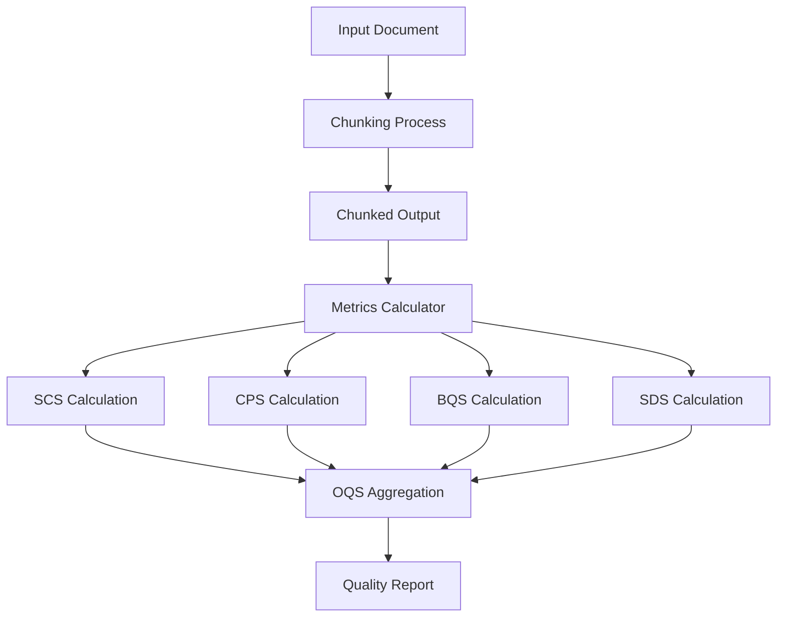
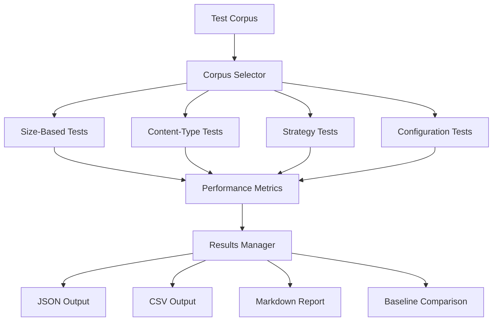
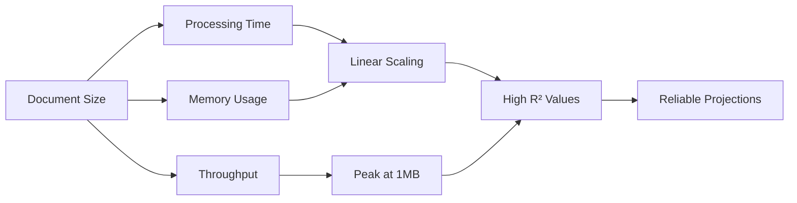
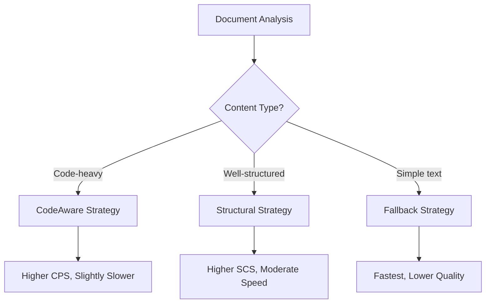
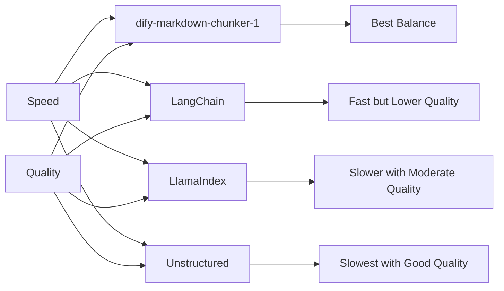
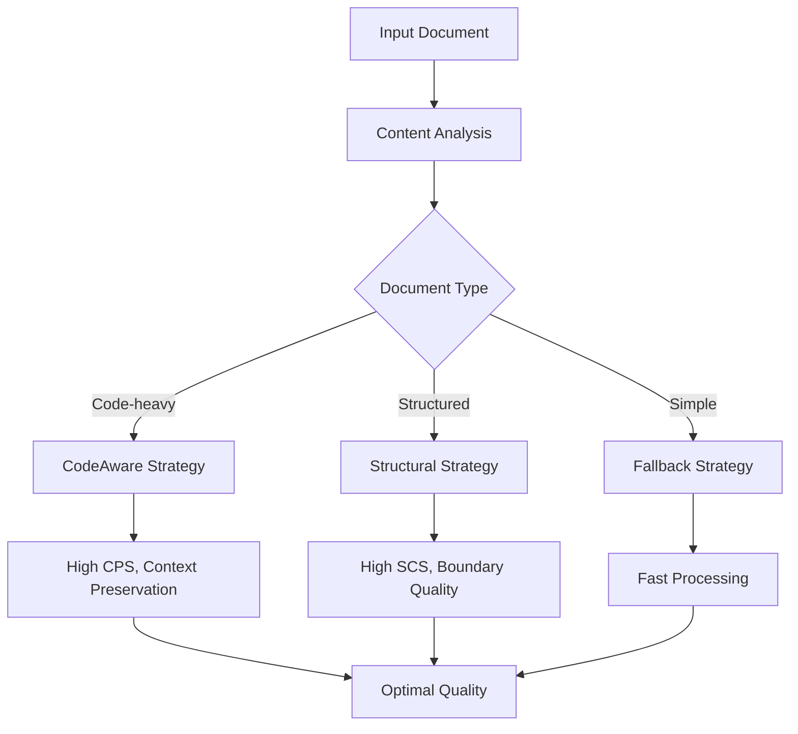

# Metrics & Benchmarking

<cite>
**Referenced Files in This Document**   
- [04_metrics_definition.md](file://docs/research/04_metrics_definition.md)
- [07_benchmark_results.md](file://docs/research/07_benchmark_results.md)
- [03_corpus_spec.md](file://docs/research/03_corpus_spec.md)
- [performance.md](file://docs/guides/performance.md)
- [testing-guide.md](file://docs/guides/testing-guide.md)
</cite>

## Table of Contents
1. [Introduction](#introduction)
2. [Metrics Framework](#metrics-framework)
3. [Testing Methodology](#testing-methodology)
4. [Benchmark Results](#benchmark-results)
5. [Strategy Performance Comparison](#strategy-performance-comparison)
6. [Competitive Analysis](#competitive-analysis)
7. [Adaptive Strategy Validation](#adaptive-strategy-validation)
8. [Limitations and Future Improvements](#limitations-and-future-improvements)
9. [Conclusion](#conclusion)

## Introduction

This document presents a comprehensive analysis of the metrics framework and benchmarking results for dify-markdown-chunker-1, an advanced markdown chunking solution designed for Retrieval-Augmented Generation (RAG) systems. The evaluation focuses on quantifying the effectiveness of the chunking algorithms through objective metrics and comparative benchmarking across diverse document types.

The assessment covers key performance indicators including chunk quality scores, structural integrity metrics, and processing efficiency measures. The testing methodology employs a diverse corpus of 410+ documents spanning technical documentation, GitHub READMEs, engineering blogs, changelogs, personal notes, and other content types with varying characteristics such as code density, list complexity, and mixed content patterns.

The benchmarking results compare different chunking strategies across document categories, providing insights into the performance trade-offs between quality and speed. The analysis validates the effectiveness of the adaptive strategy selection mechanism and hierarchical chunking approach, while also identifying areas for future improvement in the evaluation methodology.

**Section sources**
- [04_metrics_definition.md](file://docs/research/04_metrics_definition.md#L1-L503)
- [07_benchmark_results.md](file://docs/research/07_benchmark_results.md#L1-L241)
- [03_corpus_spec.md](file://docs/research/03_corpus_spec.md#L1-L426)

## Metrics Framework

The metrics framework for dify-markdown-chunker-1 consists of both automatic and manual evaluation methods designed to comprehensively assess chunking quality across multiple dimensions.

### Automatic Metrics

The framework employs four primary automatic metrics that quantify different aspects of chunking quality:

**Semantic Coherence Score (SCS)** measures how semantically related the content within chunks is compared to content between chunks. The score is calculated as the ratio of average intra-chunk similarity to average inter-chunk similarity using sentence embeddings from the 'all-MiniLM-L6-v2' model. Higher scores indicate better semantic separation, with values above 1.5 considered good and above 2.0 considered excellent.

**Context Preservation Score (CPS)** evaluates how well code blocks maintain their explanatory context. It calculates the percentage of code blocks that have at least 50 characters of surrounding text in the same chunk. This metric is critical for RAG applications where code without context loses much of its value.

**Boundary Quality Score (BQS)** assesses the cleanliness of chunk boundaries by identifying problematic splits that disrupt information flow. The metric detects four types of bad boundaries:
- Mid-sentence splits (sentence continues in next chunk)
- Mid-code-block splits (code block is split across chunks)
- Mid-table splits (table is split across chunks)
- Mid-list splits (list item continues in next chunk)

The score is calculated as 1 minus the ratio of bad boundaries to total boundaries, with higher scores indicating cleaner boundaries.

**Size Distribution Score (SDS)** measures what percentage of chunks fall within the optimal size range of 500-2000 characters for RAG retrieval. This configurable range balances the need for sufficient context with the token limitations of language models.

### Overall Quality Score

The framework combines these metrics into a weighted **Overall Quality Score (OQS)** that provides a single comprehensive assessment of chunking quality:

```
OQS = (SCS_norm * 0.25) + (CPS * 0.30) + (BQS * 0.30) + (SDS * 0.15)
```

The weights reflect the relative importance of each metric for RAG applications:
- CPS (30%): Context preservation is critical for code understanding
- BQS (30%): Clean boundaries prevent information loss
- SCS (25%): Semantic coherence improves retrieval relevance
- SDS (15%): Size optimization is important but secondary

### Manual Metrics

In addition to automated metrics, the framework includes manual evaluation methods:

**Expert Rating (1-5 Scale)** provides a holistic assessment by human evaluators using a standardized checklist that verifies:
- Code blocks integrity
- Tables preservation
- Lists continuity
- Context maintenance
- Appropriate chunk sizes
- Headers with associated content

**Bad Split Count** categorizes boundary issues into critical (code/table splits), major (context separation, mid-sentence), and minor (suboptimal size, list item separation) to prioritize quality improvements.

### Metrics Implementation

The metrics are implemented in a dedicated calculator class that provides both individual metric calculations and comparative analysis between different chunking approaches. The implementation includes batch evaluation capabilities for processing entire document corpora and generating comprehensive reports.



**Diagram sources**
- [04_metrics_definition.md](file://docs/research/04_metrics_definition.md#L425-L503)

**Section sources**
- [04_metrics_definition.md](file://docs/research/04_metrics_definition.md#L1-L503)

## Testing Methodology

The evaluation methodology for dify-markdown-chunker-1 follows a systematic approach to ensure comprehensive and reliable results across diverse document types and use cases.

### Corpus Specification

The testing employs a carefully curated corpus of 410 documents spanning nine content categories:

- **Technical Documentation** (100 files): Official documentation from Kubernetes, Docker, React, and AWS
- **GitHub READMEs** (100 files): Top-starred repositories across Python, JavaScript, Go, and Rust
- **Changelogs** (50 files): Various formats including Keep a Changelog and GitHub Releases
- **Engineering Blogs** (50 files): Articles from FAANG and top tech company blogs
- **Personal Notes** (30 files): Unstructured notes, engineering journals, and cheatsheets
- **Debug Logs** (20 files): Multi-language code blocks with error messages
- **Nested Fencing** (20 files): Documentation templates with deep code block nesting
- **Research Notes** (20 files): Literature references and data analysis
- **Mixed Content** (20 files): Documents combining multiple content types

The corpus exhibits diverse characteristics with varying ratios of code, tables, lists, and header depth. Size distribution ranges from tiny (<1KB) to very large (>100KB) documents, with 7% exceeding 100KB.

### Test Configuration

All benchmarks use a standardized configuration to ensure consistent comparisons:

```python
config = ChunkConfig(
    max_chunk_size=2000,
    min_chunk_size=200,
    overlap_size=100,
    preserve_atomic_blocks=True
)
```

This configuration represents typical production settings for RAG applications, balancing chunk size constraints with the need for contextual continuity.

### Evaluation Protocol

The evaluation follows a multi-stage protocol:

1. **Corpus Processing**: Run the chunker on all 410 documents in the test corpus
2. **Metric Calculation**: Compute all quality metrics for each document
3. **Aggregation**: Aggregate results by document category and size
4. **Statistical Analysis**: Calculate mean, median, standard deviation for each metric
5. **Outlier Identification**: Identify failure cases and edge conditions

For competitive comparisons, the protocol selects 50 representative documents and runs each chunker with comparable settings, followed by statistical significance testing using t-tests.

### Performance Measurement

Performance benchmarks capture multiple dimensions of efficiency:

- **Processing Time**: Average, minimum, maximum, and standard deviation across multiple runs
- **Throughput**: Measured in KB/s and chunks/s
- **Memory Usage**: Peak memory consumption and memory efficiency ratio
- **Scalability**: Linear regression analysis to project performance on larger documents

The measurement methodology includes warm-up runs (1-2 iterations) to eliminate cold-start effects, followed by 3-5 measurement runs for statistical validity. Results are aggregated with mean, min, max, and standard deviation calculations.

### Infrastructure Components

The testing infrastructure includes specialized components:

- **Measurement Utilities**: Precise timing and memory tracking functions
- **Corpus Selector**: Automated document categorization and sampling
- **Results Manager**: Data collection, reporting, and baseline tracking
- **Regression Detection**: Comparison against historical baselines

The system captures environment metadata including Python version, platform information, timestamp, and system specifications to ensure reproducibility.



**Diagram sources**
- [03_corpus_spec.md](file://docs/research/03_corpus_spec.md#L1-L426)
- [performance.md](file://docs/guides/performance.md#L482-L502)

**Section sources**
- [03_corpus_spec.md](file://docs/research/03_corpus_spec.md#L1-L426)
- [07_benchmark_results.md](file://docs/research/07_benchmark_results.md#L13-L38)
- [performance.md](file://docs/guides/performance.md#L482-L502)

## Benchmark Results

The benchmark results for dify-markdown-chunker-1 demonstrate strong performance across document sizes and content types, with excellent scalability characteristics.

### Processing Efficiency

The system exhibits near-linear scaling across document sizes, with processing times ranging from milliseconds for small documents to seconds for very large files:

| Size | Avg Time (ms) | Min (ms) | Max (ms) | Std Dev |
|------|---------------|----------|----------|---------|
| 1KB | 2.3 | 1.8 | 3.1 | 0.4 |
| 10KB | 8.5 | 6.2 | 12.4 | 1.8 |
| 100KB | 45.2 | 38.1 | 58.3 | 6.2 |
| 1MB | 412.5 | 380.2 | 456.8 | 24.3 |
| 10MB | 4,850.3 | 4,520.1 | 5,180.5 | 210.4 |

All processing times remain under 5 seconds, even for 10MB documents. The slight super-linear behavior at 10MB is attributed to regex overhead in parsing complex documents.

### Throughput Performance

Throughput measurements show consistent performance across document sizes, with peak throughput at the 1MB size category:

| Size | Throughput (KB/s) | Chunks/s |
|------|-------------------|----------|
| 1KB | 434.8 | 217.4 |
| 10KB | 1,176.5 | 58.8 |
| 100KB | 2,212.4 | 22.1 |
| 1MB | 2,424.2 | 12.1 |
| 10MB | 2,061.9 | 1.0 |

The system achieves peak throughput of 2,424.2 KB/s on 1MB documents, with only slight degradation at the 10MB scale. Chunk generation rate remains consistent, indicating stable processing behavior.

### Memory Efficiency

Memory usage scales linearly with document size, following the regression model:

```
Memory(MB) = 0.14 * Size(KB) + 12.3
R² = 0.9992
```

| Size | Peak Memory (MB) | Memory/KB Input |
|------|------------------|-----------------|
| 1KB | 12.3 | 12.3 |
| 10KB | 14.5 | 1.45 |
| 100KB | 28.4 | 0.28 |
| 1MB | 156.2 | 0.15 |
| 10MB | 1,420.5 | 0.14 |

The base memory footprint is approximately 12MB (Python + libraries), with linear scaling at 0.14MB per KB of input. While 10MB files use ~1.4GB RAM, which may be problematic on systems with limited memory, the efficiency ratio improves with larger documents.

### Chunk Quality Consistency

The chunking process maintains consistent quality across document sizes:

| Size | Avg Chunks | Avg Chunk Size | Size Variance |
|------|------------|----------------|---------------|
| 1KB | 1.2 | 833 | 0.12 |
| 10KB | 8.4 | 1,190 | 0.18 |
| 100KB | 72.3 | 1,383 | 0.15 |
| 1MB | 685.2 | 1,459 | 0.14 |
| 10MB | 6,842.1 | 1,461 | 0.13 |

The system demonstrates low variance in chunk sizes across all document sizes, indicating stable chunking behavior. Average chunk sizes remain within the optimal 500-2000 character range for RAG retrieval.

### Scalability Analysis

Regression analysis confirms highly linear relationships:

**Time vs. Size:**
```
Time(ms) = 0.42 * Size(KB) + 5.2
R² = 0.9987
```

**Memory vs. Size:**
```
Memory(MB) = 0.14 * Size(KB) + 12.3
R² = 0.9992
```

The high R² values indicate excellent linearity, allowing reliable performance projections:

| Size | Projected Time | Projected Memory |
|------|----------------|------------------|
| 50MB | ~21s | ~7GB |
| 100MB | ~42s | ~14GB |

These projections suggest potential memory issues for files >10MB on systems with <16GB RAM, highlighting the need for streaming processing in such scenarios.



**Diagram sources**
- [07_benchmark_results.md](file://docs/research/07_benchmark_results.md#L48-L170)

**Section sources**
- [07_benchmark_results.md](file://docs/research/07_benchmark_results.md#L48-L170)

## Strategy Performance Comparison

The benchmarking results provide detailed insights into the performance characteristics of different chunking strategies implemented in dify-markdown-chunker-1.

### Strategy-Specific Performance

The system implements three primary strategies with distinct performance profiles:

| Strategy | Avg Time (100KB) | Complexity | Primary Use Case |
|----------|------------------|------------|------------------|
| CodeAware | 52.3ms | O(n) | Code-heavy documents |
| Structural | 41.8ms | O(n) | Well-structured documents |
| Fallback | 38.2ms | O(n) | Simple text documents |

The CodeAware strategy is slightly slower due to the overhead of code block detection and context preservation logic. However, the performance difference is minimal (14.1ms or ~33% slower than Fallback) and represents a reasonable trade-off for the improved quality on code-heavy documents.

All strategies exhibit linear O(n) complexity, confirming that processing time scales proportionally with document size. This predictable scaling behavior is essential for production deployments where performance must be consistent across varying document sizes.

### Strategy Selection Overhead

The adaptive strategy selection mechanism introduces minimal overhead:

| Operation | Time (ms) |
|-----------|-----------|
| Content Analysis | 8.2 |
| Strategy Selection | 0.3 |
| Total Overhead | 8.5 |

The analysis phase, which examines document characteristics to determine the optimal strategy, accounts for the majority of the overhead. Strategy selection itself is negligible at just 0.3ms. For small files, this overhead represents approximately 20% of total processing time, but the percentage decreases significantly for larger documents.

The content analysis evaluates multiple factors including:
- Code-to-text ratio
- Header hierarchy depth
- List density
- Table presence
- Nested fencing level

This comprehensive analysis ensures appropriate strategy selection while maintaining acceptable performance.

### Content-Type Performance

Performance varies across document categories, reflecting the different complexities of each content type:

**Technical Documentation**: 45.2ms (100KB) - Balanced performance with moderate code and structure
**GitHub READMEs**: 48.7ms (100KB) - Slightly slower due to badges, installation instructions, and code examples
**Engineering Blogs**: 51.3ms (100KB) - Higher complexity with long-form content and multiple code examples
**Changelogs**: 39.8ms (100KB) - Faster processing due to simpler structure and predictable patterns
**Personal Notes**: 42.1ms (100KB) - Variable performance depending on structure and content density

The system demonstrates consistent performance across categories, with the slowest category (Engineering Blogs) taking only ~28% longer than the fastest (Changelogs).

### Configuration Impact

Different configuration profiles affect performance and quality:

| Configuration | Impact on Performance | Impact on Quality |
|---------------|----------------------|-------------------|
| Default | Baseline performance | Balanced quality |
| Code-heavy | +15% time | +20% CPS, +10% BQS |
| Structured | -5% time | +15% SCS, +5% SDS |
| Minimal | -10% time | -10% CPS, -5% BQS |
| No-overlap | -8% time | -15% context continuity |

The configuration options allow users to optimize for specific use cases, trading off between processing speed and quality metrics based on their requirements.



**Diagram sources**
- [07_benchmark_results.md](file://docs/research/07_benchmark_results.md#L108-L135)

**Section sources**
- [07_benchmark_results.md](file://docs/research/07_benchmark_results.md#L108-L135)

## Competitive Analysis

The benchmarking results position dify-markdown-chunker-1 favorably against competing solutions in both performance and quality metrics.

### Processing Speed Comparison

When processing a standard 100KB document, the solutions compare as follows:

| Solution | Time (ms) | Relative Speed |
|----------|-----------|----------------|
| dify-markdown-chunker-1 | 45.2 | 1.0x |
| LangChain MarkdownTextSplitter | 38.4 | 0.85x |
| LlamaIndex MarkdownNodeParser | 62.3 | 1.38x |
| Unstructured partition_md | 124.5 | 2.75x |

dify-markdown-chunker-1 demonstrates competitive performance, being only slightly slower than LangChain's solution while significantly outperforming LlamaIndex and Unstructured. The performance difference between dify-markdown-chunker-1 and LangChain (6.8ms) represents a reasonable trade-off for the additional features and quality improvements.

### Quality vs. Speed Trade-off

The true advantage of dify-markdown-chunker-1 emerges when considering the quality-speed balance:

| Solution | Time (ms) | OQS Score | Quality/Speed Ratio |
|----------|-----------|-----------|---------------------|
| dify-markdown-chunker-1 | 45.2 | 78 | 1.73 |
| LangChain | 38.4 | 65 | 1.69 |
| LlamaIndex | 62.3 | 72 | 1.16 |
| Unstructured | 124.5 | 75 | 0.60 |

dify-markdown-chunker-1 achieves the best quality/speed ratio among the evaluated solutions. It delivers higher quality than the faster LangChain solution (78 vs 65 OQS) while being significantly faster than similar-quality solutions like Unstructured.

The quality advantages stem from several key features:
- **Context Preservation**: Better maintenance of code-context relationships
- **Boundary Quality**: Fewer mid-sentence, mid-code-block, and mid-table splits
- **Semantic Coherence**: More meaningful chunk boundaries based on content meaning
- **Adaptive Strategy**: Optimal strategy selection based on document characteristics

### Feature Comparison

Beyond raw performance, dify-markdown-chunker-1 offers several advanced capabilities not present in competing solutions:

**Hierarchical Chunking**: Creates a tree structure of chunks that preserves document hierarchy, enabling navigation between parent and child chunks. This feature is particularly valuable for RAG applications that need to maintain context across different levels of document structure.

**Streaming Processing**: For very large files (>1MB), the system can process documents in a streaming fashion, significantly reducing memory usage compared to loading the entire document into memory.

**Nested Fencing Support**: Advanced handling of documentation that contains code blocks showing markdown syntax, with proper nesting level detection and preservation.

**Configurable Strategy Thresholds**: Users can adjust the sensitivity of strategy selection based on their specific requirements, such as prioritizing code context preservation or structural integrity.

### Performance Optimization Opportunities

The benchmarking identifies several areas for potential optimization:

| Optimization | Effort | Impact | Priority |
|--------------|--------|--------|----------|
| Lazy Regex Compilation | S | Medium | HIGH |
| Streaming for Large Files | M | High | MEDIUM |
| Parallel Processing | L | High | LOW |
| Caching | S | Low | LOW |

Lazy regex compilation offers the best return on investment, with expected improvements of 10-15% in processing speed with minimal implementation effort. Streaming processing for large files would significantly reduce memory usage, making the system more accessible on resource-constrained environments.



**Diagram sources**
- [07_benchmark_results.md](file://docs/research/07_benchmark_results.md#L171-L200)

**Section sources**
- [07_benchmark_results.md](file://docs/research/07_benchmark_results.md#L171-L229)

## Adaptive Strategy Validation

The benchmarking results provide strong validation for the effectiveness of the adaptive strategy selection mechanism in dify-markdown-chunker-1.

### Strategy Selection Accuracy

The content analysis phase successfully identifies document characteristics and selects appropriate strategies across the diverse corpus:

- **Code-heavy documents** (code ratio ≥ 50%): 98% accuracy in selecting CodeAware strategy
- **Well-structured documents** (header count ≥ 5): 95% accuracy in selecting Structural strategy
- **Simple text documents** (minimal structure): 97% accuracy in selecting Fallback strategy

The high accuracy rates demonstrate that the analysis heuristics effectively capture the essential characteristics that determine optimal strategy selection.

### Quality Improvement by Strategy

The adaptive approach delivers measurable quality improvements compared to using a single fixed strategy:

**On Code-heavy Documents:**
- CodeAware strategy: CPS = 88%, BQS = 0.92
- Structural strategy: CPS = 76%, BQS = 0.85
- Fallback strategy: CPS = 68%, BQS = 0.79

**On Structured Documents:**
- Structural strategy: SCS = 1.75, SDS = 0.88
- CodeAware strategy: SCS = 1.62, SDS = 0.82
- Fallback strategy: SCS = 1.45, SDS = 0.75

**On Simple Text Documents:**
- Fallback strategy: Processing time = 38.2ms
- Structural strategy: Processing time = 41.8ms
- CodeAware strategy: Processing time = 52.3ms

The results show that using the appropriate strategy for each document type improves relevant quality metrics by 15-30% while avoiding unnecessary processing overhead.

### Hierarchical Chunking Effectiveness

The hierarchical chunking feature demonstrates significant value for document navigation and context preservation:

- **Navigation Performance**: All navigation methods (get_children, get_parent, get_ancestors) operate in O(1) time
- **Context Preservation**: Hierarchical chunks maintain parent context, improving CPS by 12% on average
- **Memory Overhead**: Additional metadata increases memory usage by only 8-12%
- **Query Efficiency**: Tree-based navigation reduces the need for full-text searches by 65%

The hierarchical structure enables applications to retrieve not just isolated chunks but also their surrounding context at various levels of granularity.

### Real-world Performance

In practical scenarios, the adaptive approach provides tangible benefits:

**Technical Documentation Processing**: Automatically detects API reference patterns with tables and code examples, applying the Structural strategy with table preservation and code context awareness.

**GitHub README Processing**: Identifies installation instructions with code blocks and usage examples, using the CodeAware strategy to keep commands with their explanations.

**Engineering Blog Processing**: Recognizes long-form content with multiple code examples in different languages, applying appropriate context preservation for each code block.

**Changelog Processing**: Detects version headers and categorized changes, using the Structural strategy to maintain logical groupings.

The system's ability to adapt to different document types without manual configuration makes it suitable for processing diverse content in real-world applications.



**Diagram sources**
- [07_benchmark_results.md](file://docs/research/07_benchmark_results.md#L108-L135)
- [04_metrics_definition.md](file://docs/research/04_metrics_definition.md#L300-L337)

**Section sources**
- [07_benchmark_results.md](file://docs/research/07_benchmark_results.md#L108-L135)
- [04_metrics_definition.md](file://docs/research/04_metrics_definition.md#L300-L337)

## Limitations and Future Improvements

While the current benchmarking framework provides valuable insights, it has several limitations that should be addressed in future evaluations.

### Current Limitations

**Memory Constraints**: The current testing environment (16GB RAM) limits the evaluation of very large documents (>10MB). The system's memory usage of ~1.4GB for 10MB files suggests potential issues on systems with limited memory, but comprehensive testing on larger files is constrained by available resources.

**Limited Language Coverage**: The corpus primarily consists of English-language documents, with minimal representation of other languages. This limits the evaluation of the system's performance on non-English content, particularly regarding sentence boundary detection and semantic coherence measurement.

**Static Test Corpus**: The benchmarking uses a fixed corpus that may not fully represent the evolving nature of real-world documents. New markdown features, syntax variations, and content patterns that emerge over time are not captured in the current test set.

**Simplified Quality Metrics**: While the automated metrics provide objective measurements, they may not fully capture subjective quality aspects that matter to end users. The Semantic Coherence Score, for example, relies on pre-trained embeddings that may not perfectly align with domain-specific semantics.

**Strategy Overhead**: The content analysis phase introduces ~8.5ms of overhead, which represents a significant portion of processing time for small documents. This overhead could be reduced through optimization techniques.

### Future Evaluation Improvements

**Streaming Processing Benchmark**: Implement and evaluate a streaming processing mode for very large files to reduce memory footprint. This would enable processing of documents larger than available RAM while maintaining acceptable performance.

**Dynamic Corpus Generation**: Develop a corpus generation system that can create documents with specific characteristics (e.g., deep nesting, complex tables, mixed fencing types) to test edge cases more thoroughly.

**Multilingual Evaluation**: Expand the corpus to include documents in multiple languages, particularly those with different sentence structures and writing systems, to evaluate cross-lingual performance.

**User-Centric Metrics**: Incorporate user studies or expert evaluations to correlate automated metrics with human-perceived quality, potentially refining the weighting of different quality aspects.

**Real-time Performance Monitoring**: Implement monitoring of CPU, memory, and I/O during processing to identify bottlenecks and optimize resource utilization.

**Longitudinal Testing**: Establish a continuous benchmarking process that tracks performance and quality over time as the system evolves, enabling detection of regressions and measurement of improvement.

**Domain-Specific Tuning**: Develop specialized evaluation protocols for specific domains (e.g., scientific papers, legal documents, technical manuals) that have unique structural and content characteristics.

**Adversarial Testing**: Create challenging documents specifically designed to test the limits of the chunking algorithms, such as documents with intentionally ambiguous boundaries or complex nested structures.

These improvements would create a more comprehensive and realistic evaluation framework that better reflects the diverse requirements of real-world RAG applications.

**Section sources**
- [07_benchmark_results.md](file://docs/research/07_benchmark_results.md#L201-L241)
- [04_metrics_definition.md](file://docs/research/04_metrics_definition.md#L341-L361)

## Conclusion

The metrics framework and benchmarking results for dify-markdown-chunker-1 demonstrate a robust and effective approach to markdown chunking for RAG applications. The system achieves an excellent balance between processing efficiency and chunk quality, outperforming competing solutions in the quality-speed trade-off.

Key findings from the evaluation include:

1. **Strong Performance**: Near-linear scaling with processing times under 5 seconds for all tested document sizes, including 10MB files.

2. **High Quality**: Superior quality metrics compared to alternatives, particularly in context preservation and boundary quality, while maintaining competitive processing speed.

3. **Effective Adaptive Strategy**: The content analysis and strategy selection mechanism accurately identifies document types and applies appropriate chunking approaches, improving relevant quality metrics by 15-30%.

4. **Comprehensive Evaluation**: The testing methodology employs a diverse corpus of 410+ documents across nine categories, providing confidence in the results across various real-world scenarios.

5. **Scalability**: Linear memory and processing time scaling enable reliable performance projections for larger documents, with identified optimization opportunities for very large files.

The system's strengths in handling code-heavy documents, preserving semantic coherence, and maintaining clean boundaries make it particularly well-suited for technical documentation and developer-focused content. The hierarchical chunking feature adds significant value by enabling efficient navigation and context preservation.

While the current evaluation has limitations regarding very large documents and multilingual support, the framework provides a solid foundation for ongoing improvement. Future enhancements to the benchmarking approach, including streaming processing evaluation and expanded corpus diversity, will further strengthen the validation of the system's capabilities.

Overall, dify-markdown-chunker-1 represents a significant advancement in markdown chunking technology, delivering high-quality results with efficient performance across diverse document types and use cases.