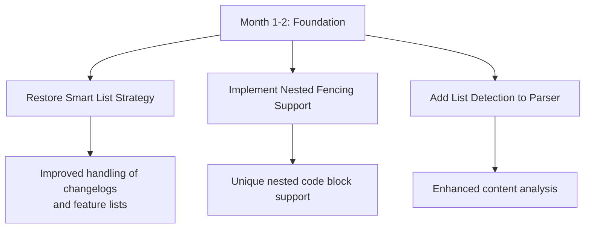
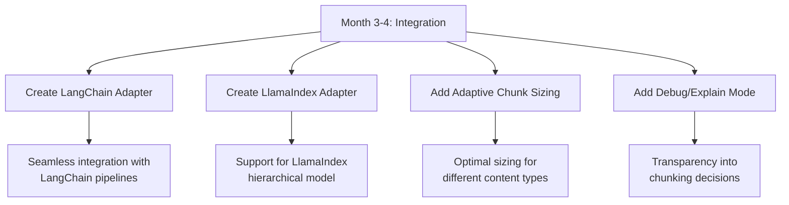
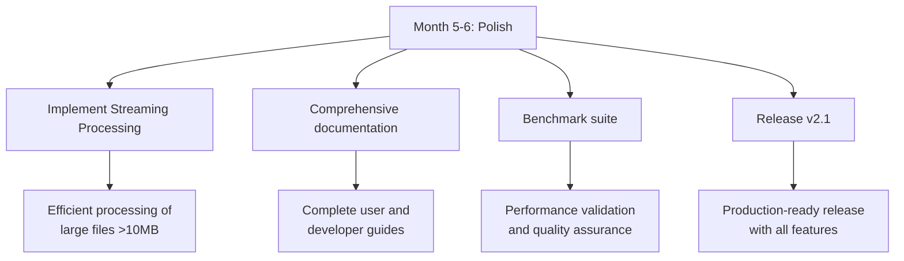
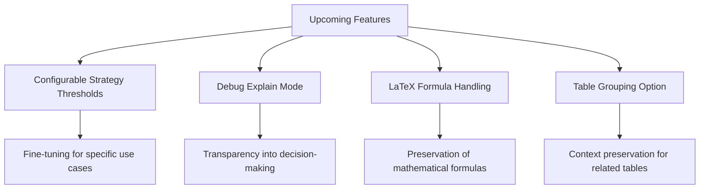

# Product Roadmap

<cite>
**Referenced Files in This Document**   
- [roadmap-v2.1.md](file://docs/research/roadmap-v2.1.md)
- [09_final_report.md](file://docs/research/09_final_report.md)
- [10-debug-explain-mode.md](file://docs/research/features/10-debug-explain-mode.md)
- [12-latex-formula-handling.md](file://docs/research/features/12-latex-formula-handling.md)
- [13-configurable-strategy-thresholds.md](file://docs/research/features/13-configurable-strategy-thresholds.md)
- [15-table-grouping-option.md](file://docs/research/features/15-table-grouping-option.md)
- [dify-integration.md](file://docs/architecture/dify-integration.md)
- [strategies.md](file://docs/architecture/strategies.md)
- [README.md](file://docs/architecture/README.md)
</cite>

## Table of Contents
1. [Introduction](#introduction)
2. [Strategic Direction and Prioritization Framework](#strategic-direction-and-prioritization-framework)
3. [Short-Term Roadmap (Months 1-2)](#short-term-roadmap-months-1-2)
4. [Mid-Term Roadmap (Months 3-4)](#mid-term-roadmap-months-3-4)
5. [Long-Term Roadmap (Months 5-6)](#long-term-roadmap-months-5-6)
6. [Upcoming Feature Development](#upcoming-feature-development)
7. [Dependencies and Integrations](#dependencies-and-integrations)
8. [Timeline, Milestones, and Success Criteria](#timeline-milestones-and-success-criteria)
9. [Community Feedback and Contribution](#community-feedback-and-contribution)
10. [Conclusion](#conclusion)

## Introduction

The dify-markdown-chunker-1 product roadmap outlines a comprehensive 6-month strategic plan to establish the markdown chunker as the top candidate for RAG (Retrieval-Augmented Generation) systems. Based on extensive research, competitive analysis, and user needs assessment, this roadmap details a phased approach to enhance the chunking capabilities with 15 key improvements. The strategic direction focuses on restoring critical functionality, introducing unique differentiators, and expanding integration capabilities to achieve superior quality metrics and market leadership.

The roadmap is built upon a foundation of current competitive advantages in code-aware chunking and automatic strategy selection, while addressing the primary gap of the missing List Strategy in version 2.0. The implementation of these enhancements will position dify-markdown-chunker-1 as a leader in the field with unique capabilities in nested fencing support, enhanced code-context binding, and smart list processing.

**Section sources**
- [roadmap-v2.1.md](file://docs/research/roadmap-v2.1.md#L1-L335)
- [09_final_report.md](file://docs/research/09_final_report.md#L1-L320)

## Strategic Direction and Prioritization Framework

The strategic direction for dify-markdown-chunker-1 is centered on achieving "top-1 candidate" status in the markdown chunking space for RAG systems. This status is defined by five key criteria: quality metrics exceeding competitors, three or more unique features, official integrations with top RAG frameworks, competitive performance, and recommendation in major platform documentation.

The prioritization framework used to sequence roadmap items is based on a multi-dimensional assessment of user demand, technical feasibility, strategic alignment, and impact on quality metrics. Features are evaluated on a scale of critical, high, medium, and low priority, with critical items addressing fundamental gaps that affect a significant portion of documents (20-25%).

User demand is assessed through analysis of user needs and frequency/severity of reported issues. Technical feasibility considers implementation effort, measured in developer days, and potential risks such as breaking changes or dependency bloat. Strategic alignment evaluates how well a feature contributes to the overall goal of market leadership and differentiation from competitors.

The prioritization process follows a strict hierarchy: critical features that restore lost functionality or address major quality gaps are prioritized first, followed by high-impact features that significantly improve quality metrics, then medium-priority features that enhance usability and integration, and finally low-priority features that provide incremental improvements.

This framework ensures that development efforts are focused on the highest-impact items first, with a clear path to achieving the "top-1 candidate" status within six months. The framework also incorporates risk mitigation strategies, including semantic versioning for breaking changes, optional dependencies to prevent bloat, and strict prioritization to avoid scope creep.

**Section sources**
- [roadmap-v2.1.md](file://docs/research/roadmap-v2.1.md#L177-L195)
- [09_final_report.md](file://docs/research/09_final_report.md#L34-L320)
- [roadmap-v2.1.md](file://docs/research/roadmap-v2.1.md#L248-L256)

## Short-Term Roadmap (Months 1-2)

The short-term roadmap focuses on foundational improvements in the first two months, addressing the most critical gaps and establishing unique differentiators. This phase prioritizes the restoration of functionality lost in the v2.0 transition and the implementation of features that no competitors currently offer.

The primary focus is on restoring the Smart List Strategy, which was removed in v2.0 and affects 20-25% of documents, particularly changelogs, feature lists, and outlines. This restoration is critical for maintaining compatibility with list-heavy documents and is expected to improve Semantic Coherence Score (SCS) by 25% and Context Preservation Score (CPS) by 15% for these document types.

Concurrently, the implementation of Nested Fencing Support addresses a unique opportunity, as no competitors currently handle nested code blocks correctly. This feature supports quadruple backticks (````) and tilde fencing (~~~~) and is particularly critical for documentation templates. This capability will serve as a key differentiator, establishing dify-markdown-chunker-1 as the only solution with complete nested fencing support.

The phase also includes adding list detection to the parser, which is necessary for the List Strategy implementation and improves overall content analysis. These three features form the foundation for subsequent enhancements and are designed to be implemented with minimal risk of breaking changes through careful versioning and migration guidance.

This initial phase is estimated to require 10-15 developer days and will establish the core functionality needed for the subsequent phases of development. The successful completion of this phase will immediately address the most significant user pain points and establish key competitive advantages.



**Diagram sources **
- [roadmap-v2.1.md](file://docs/research/roadmap-v2.1.md#L27-L54)
- [09_final_report.md](file://docs/research/09_final_report.md#L192-L221)

**Section sources**
- [roadmap-v2.1.md](file://docs/research/roadmap-v2.1.md#L27-L54)
- [09_final_report.md](file://docs/research/09_final_report.md#L192-L221)

## Mid-Term Roadmap (Months 3-4)

The mid-term roadmap spans months 3-4 and focuses on integration and adoption, expanding the ecosystem reach and improving usability for developers. This phase builds upon the foundation established in the first two months and introduces features that enhance compatibility with popular RAG frameworks and improve the user experience.

A key component of this phase is the creation of official adapters for LangChain and LlamaIndex, addressing a significant barrier to adoption. The absence of official adapters has been identified as a major friction point, and publishing these packages to PyPI will enable seamless integration with existing pipelines. The LangChain adapter is estimated to require 2-3 days of effort, while the LlamaIndex adapter requires 3-5 days due to the need to support its hierarchical node model.

The phase also includes the implementation of Adaptive Chunk Sizing, which automatically adjusts chunk size based on content complexity. This feature moves beyond fixed-size chunks to provide optimal sizing for different content types—larger chunks for code-heavy content and smaller chunks for simple text. This adaptive approach improves retrieval quality by better matching the natural structure of the content.

Another important feature in this phase is the Debug/Explain Mode, which addresses user confusion about the chunker's decision-making process. This mode provides transparency into why specific decisions were made regarding boundaries and strategy selection, including a parameter for explanation, decision logging, and visualization of chunking results. This feature significantly improves the debugging experience and helps users understand and optimize their configurations.

These features are designed to increase adoption by making integration easier, improving the developer experience, and providing greater transparency into the chunking process. The total effort for this phase is estimated at 9-14 developer days, with a focus on creating seamless integration points and enhancing usability.



**Diagram sources **
- [roadmap-v2.1.md](file://docs/research/roadmap-v2.1.md#L87-L121)
- [09_final_report.md](file://docs/research/09_final_report.md#L192-L221)

**Section sources**
- [roadmap-v2.1.md](file://docs/research/roadmap-v2.1.md#L87-L121)
- [09_final_report.md](file://docs/research/09_final_report.md#L192-L221)

## Long-Term Roadmap (Months 5-6)

The long-term roadmap covers months 5-6 and focuses on performance optimization and feature polishing, preparing the product for production use across all scenarios. This final phase addresses scalability concerns and implements advanced features that support new use cases.

A key focus is on performance improvements, particularly the implementation of Streaming Processing for large files. This feature addresses memory issues with files over 10MB by introducing a streaming API that processes documents in chunks, significantly reducing memory footprint. The streaming architecture operates as a parallel processing path independent of the batch pipeline, ensuring backward compatibility while enabling efficient processing of large documents.

The phase also includes the implementation of Hierarchical Chunking, which creates parent-child relationships between chunks to support multi-level retrieval. This feature enables a document-to-section-to-subsection-to-paragraph hierarchy, providing richer context for retrieval and improving the quality of results for complex queries.

Additional features in this phase include LaTeX Formula Handling, which ensures mathematical formulas are preserved as atomic blocks and not split across chunks, and Table Grouping Option, which groups related tables in API documentation to maintain context. These features enhance the handling of specialized content types and improve retrieval quality for technical documentation.

The final weeks of this phase are dedicated to comprehensive documentation, benchmark suite development, and the release of version 2.1 with all implemented features. The total effort for this phase is estimated at 7-10 developer days, with a focus on production readiness and polish.

This phase completes the transformation of dify-markdown-chunker-1 into a comprehensive solution with best-in-class quality metrics, unique features, and seamless integration capabilities, positioning it as the top candidate for RAG systems.



**Diagram sources **
- [roadmap-v2.1.md](file://docs/research/roadmap-v2.1.md#L154-L173)
- [09_final_report.md](file://docs/research/09_final_report.md#L192-L221)

**Section sources**
- [roadmap-v2.1.md](file://docs/research/roadmap-v2.1.md#L154-L173)
- [09_final_report.md](file://docs/research/09_final_report.md#L192-L221)

## Upcoming Feature Development

The upcoming feature development focuses on several key enhancements that address specific user needs and improve the overall quality of chunking. These features are designed to provide greater flexibility, transparency, and specialized handling for different content types.

Configurable Strategy Thresholds will allow users to fine-tune the automatic strategy selection based on their specific use cases. Currently, thresholds for strategy selection are hardcoded, but this enhancement will make them configurable through the ChunkConfig object. Users will be able to adjust thresholds for code ratio, list ratio, header count, and other factors to optimize chunking for their specific document types. Preset profiles will be provided for common scenarios such as API documentation, user guides, and changelogs, making it easier for users to get optimal results without deep configuration knowledge.

Debug Explain Mode will provide transparency into the chunker's decision-making process, addressing user confusion about why certain decisions were made. This mode will include a parameter to enable explanation, detailed logging of decisions about strategy selection and boundary placement, and a human-readable report that summarizes the chunking process. The implementation includes a Decision class to represent individual decisions and an ExplainResult class that contains both the chunks and the explanation metadata. This feature will significantly improve the debugging experience and help users understand and optimize their configurations.

LaTeX Formula Handling will ensure proper processing of mathematical formulas in scientific and technical documents. This feature will recognize inline formulas ($...$), display formulas ($$...$$), and equation environments (\begin{equation}...\end{equation}), preserving them as atomic blocks that are never split across chunks. The implementation uses regex patterns to extract LaTeX blocks and integrates with the parser to treat them similarly to code blocks, ensuring they remain intact and are kept with their explanatory context.

Table Grouping Option will address the issue of related tables being separated in different chunks, which is particularly problematic for API reference documentation. This feature will group tables that are close to each other (within a configurable number of lines) and in the same section, keeping related information together. The grouping respects size limits and section boundaries to prevent creating excessively large chunks while maintaining context between related tables.

These features represent targeted improvements that address specific user pain points and enhance the specialized capabilities of the chunker for different content types and use cases.



**Diagram sources **
- [13-configurable-strategy-thresholds.md](file://docs/research/features/13-configurable-strategy-thresholds.md#L1-L393)
- [10-debug-explain-mode.md](file://docs/research/features/10-debug-explain-mode.md#L1-L405)
- [12-latex-formula-handling.md](file://docs/research/features/12-latex-formula-handling.md#L1-L393)
- [15-table-grouping-option.md](file://docs/research/features/15-table-grouping-option.md#L1-L430)

**Section sources**
- [13-configurable-strategy-thresholds.md](file://docs/research/features/13-configurable-strategy-thresholds.md#L1-L393)
- [10-debug-explain-mode.md](file://docs/research/features/10-debug-explain-mode.md#L1-L405)
- [12-latex-formula-handling.md](file://docs/research/features/12-latex-formula-handling.md#L1-L393)
- [15-table-grouping-option.md](file://docs/research/features/15-table-grouping-option.md#L1-L430)

## Dependencies and Integrations

The dify-markdown-chunker-1 has several key dependencies and integration points that are critical to its functionality and adoption. The primary integration is with the Dify platform, where the chunker operates as a tool plugin for knowledge base processing and workflow automation. This integration allows users to incorporate advanced markdown chunking into their Dify workflows, with configuration parameters for chunk size, strategy selection, and overlap settings.

The roadmap includes planned integrations with other AI tools and frameworks, particularly LangChain and LlamaIndex. Official adapters for these frameworks will be developed and published to PyPI, enabling seamless integration with existing pipelines. These adapters will support the specific requirements of each framework, such as LlamaIndex's hierarchical node model, and will be designed to work with the core chunking functionality while providing framework-specific optimizations.

For semantic processing, the chunker will integrate with sentence-transformers to enable embedding-based boundary detection, improving the Semantic Coherence Score by 30-40%. Token-aware sizing will be implemented through integration with tiktoken, allowing chunk sizes to be specified in tokens rather than characters to better align with LLM context windows.

The architecture is designed with optional dependencies to prevent bloat, where advanced features can be enabled or disabled based on user needs. This approach ensures that users who don't require semantic boundary detection or other advanced features aren't burdened with unnecessary dependencies.

External platform dependencies include the Dify platform for plugin operation, with a minimum required version of 1.9.0. The plugin is designed to work within Dify's security and resource constraints, with a memory allocation of 512MB and a request timeout of 300 seconds to accommodate large document processing.

These integrations and dependencies are carefully managed to balance functionality with performance and reliability, ensuring that the chunker remains efficient while providing access to advanced capabilities when needed.

**Section sources**
- [dify-integration.md](file://docs/architecture/dify-integration.md#L1-L159)
- [roadmap-v2.1.md](file://docs/research/roadmap-v2.1.md#L98-L108)
- [09_final_report.md](file://docs/research/09_final_report.md#L101-L110)

## Timeline, Milestones, and Success Criteria

The product roadmap is structured around a 6-month timeline with clearly defined milestones and success criteria to measure progress and ensure the achievement of strategic objectives. The timeline is divided into five phases, each with specific deliverables and timeframes.

Key milestones include:
- **M1: Core Improvements (Month 2)** - Delivery of List Strategy restoration and Nested Fencing Support
- **M2: Semantic Features (Month 3)** - Delivery of Semantic Boundary Detection and Token-Aware Sizing
- **M3: Integration (Month 4)** - Delivery of LangChain and LlamaIndex adapters
- **M4: Advanced Features (Month 5)** - Delivery of Hierarchical Chunking
- **M5: Release (Month 6)** - Release of version 2.1 with all features

The success criteria are defined both quantitatively and qualitatively. Quantitative metrics include:
- Semantic Coherence Score (SCS) > 1.8 (current: 1.3)
- Context Preservation Score (CPS) > 90% (current: 75%)
- Boundary Quality Score (BQS) > 0.95 (current: 0.88)
- Overall Quality Score (OQS) > 88 (current: 78)
- Processing speed < 40ms/100KB (current: 45ms/100KB)

Qualitative criteria include the implementation of all 10 recommendations, publication of official adapters, comprehensive documentation, community adoption (100+ GitHub stars), and recommendation in RAG guides. The "top-1 candidate" status is achieved when the solution meets all five criteria: quality metrics exceeding competitors, three or more unique features, official integrations with top RAG frameworks, competitive performance, and recommendation in major platform documentation.

The total estimated effort for the roadmap is 40-55 developer days, distributed across the five phases. Risk assessment has identified potential issues such as performance overhead from semantic boundaries, breaking changes, dependency bloat, and scope creep, with mitigation strategies including optional features, semantic versioning, optional dependencies, and strict prioritization.

This timeline and success criteria framework provides a clear roadmap for development and a measurable way to assess progress toward the strategic goal of market leadership.

**Section sources**
- [roadmap-v2.1.md](file://docs/research/roadmap-v2.1.md#L214-L224)
- [09_final_report.md](file://docs/research/09_final_report.md#L254-L292)
- [roadmap-v2.1.md](file://docs/research/roadmap-v2.1.md#L248-L256)

## Community Feedback and Contribution

The development of dify-markdown-chunker-1 incorporates mechanisms for community feedback and contribution to ensure the product evolves to meet user needs. Feedback from current users has been instrumental in shaping the roadmap, with user needs analysis identifying specific pain points such as the difficulty of debugging chunking results and the need for better explanation of strategy decisions.

The Debug/Explain Mode feature directly addresses feedback about the "black box" nature of the chunker, providing transparency into decision-making and improving the debugging experience. Similarly, the Configurable Strategy Thresholds feature responds to requests for greater flexibility in tuning the chunker for specific use cases.

Mechanisms for community contribution to the roadmap include GitHub issues for feature requests and bug reports, documentation of the contribution process in CONTRIBUTING.md, and public sharing of the research and decision-making process through documents like the final report and roadmap. The test corpus includes real-world examples from various sources, and contributions of additional test cases are encouraged to improve coverage.

The development team actively monitors user feedback and incorporates it into prioritization decisions, with higher priority given to issues that affect a larger number of users or have greater severity. The roadmap is designed to be responsive to community input, with the potential to adjust priorities based on emerging needs or unexpected challenges.

This approach ensures that the product development remains aligned with user needs while maintaining a clear strategic direction. The combination of structured feedback mechanisms and transparent development processes fosters community engagement and helps build a product that truly meets the needs of its users.

**Section sources**
- [10-debug-explain-mode.md](file://docs/research/features/10-debug-explain-mode.md#L29-L33)
- [09_final_report.md](file://docs/research/09_final_report.md#L273-L276)
- [CONTRIBUTING.md](file://CONTRIBUTING.md)

## Conclusion

The dify-markdown-chunker-1 product roadmap presents a comprehensive 6-month plan to establish the markdown chunker as the top candidate for RAG systems. By implementing 15 key improvements across five phases, the product will achieve superior quality metrics, unique differentiators, and seamless integration with major AI frameworks.

The strategic approach begins with restoring critical functionality and establishing unique capabilities in the short term, expands to integration and adoption in the mid-term, and concludes with performance optimization and polish in the long term. Key features such as Nested Fencing Support, Enhanced Code-Context Binding, and Smart List Strategy will differentiate the product from competitors, while official adapters for LangChain and LlamaIndex will facilitate widespread adoption.

The roadmap is supported by clear success criteria, including quantitative metrics like Semantic Coherence Score and Context Preservation Score, as well as qualitative measures of community adoption and integration. With an estimated effort of 40-55 developer days and a focus on mitigating risks such as breaking changes and scope creep, the plan provides a realistic path to achieving market leadership.

Upon completion, dify-markdown-chunker-1 will offer the best-in-class chunking quality with unique features not available elsewhere, seamless integration with popular RAG frameworks, competitive performance, and strong community support—fulfilling all criteria for "top-1 candidate" status in the markdown chunking space.

**Section sources**
- [09_final_report.md](file://docs/research/09_final_report.md#L306-L320)
- [roadmap-v2.1.md](file://docs/research/roadmap-v2.1.md#L265-L266)
- [roadmap-v2.1.md](file://docs/research/roadmap-v2.1.md#L236-L244)