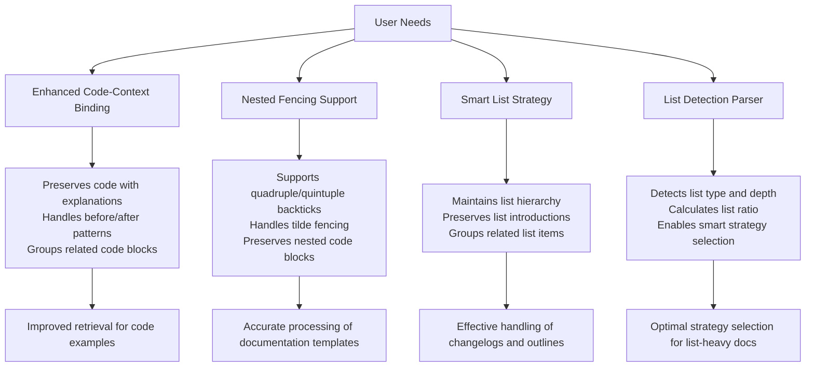

# User Needs Research

<cite>
**Referenced Files in This Document**   
- [02_user_needs.md](file://docs/research/02_user_needs.md)
- [01_competitor_matrix.md](file://docs/research/01_competitor_matrix.md)
- [06-enhanced-code-context-binding.md](file://docs/research/features/06-enhanced-code-context-binding.md)
- [02-nested-fencing-support.md](file://docs/research/features/02-nested-fencing-support.md)
- [01-smart-list-strategy.md](file://docs/research/features/01-smart-list-strategy.md)
- [03-list-detection-parser.md](file://docs/research/features/03-list-detection-parser.md)
- [dify-integration.md](file://docs/architecture/dify-integration.md)
- [08_integration_analysis.md](file://docs/research/08_integration_analysis.md)
- [markdown_chunker.yaml](file://provider/markdown_chunker.yaml)
- [manifest.yaml](file://manifest.yaml)
- [main.py](file://main.py)
</cite>

## Table of Contents
1. [Introduction](#introduction)
2. [User Segments and Primary Use Cases](#user-segments-and-primary-use-cases)
3. [Core Requirements Driving Feature Development](#core-requirements-driving-feature-development)
4. [Pain Points in Existing Chunking Solutions](#pain-points-in-existing-chunking-solutions)
5. [Feature Mapping to User Needs](#feature-mapping-to-user-needs)
6. [User Workflow and Interface Design](#user-workflow-and-interface-design)
7. [Conclusion](#conclusion)

## Introduction

This document presents a comprehensive analysis of the user needs assessment that shaped the development of dify-markdown-chunker-1. Based on extensive research documented in 02_user_needs.md and related files, this report details the primary use cases identified across key user segments including AI engineers, technical writers, and platform integrators. The research methodology included analysis of GitHub issues, Stack Overflow questions, and community discussions across major RAG platforms such as LangChain, LlamaIndex, and Dify.

The assessment revealed critical pain points in existing markdown chunking solutions, particularly around the loss of context in code blocks and poor handling of nested structures. These findings directly informed the development of key features such as enhanced code-context binding and nested fencing support. The document also examines how user workflows influenced the design of both the Dify plugin and standalone library interfaces, ensuring the solution meets the reliability, configurability, and metadata richness requirements essential for effective RAG systems.

**Section sources**
- [02_user_needs.md](file://docs/research/02_user_needs.md#L1-L279)

## User Segments and Primary Use Cases

The user needs assessment identified three primary user segments with distinct requirements and use cases for markdown chunking in RAG systems. AI engineers, who constitute the largest user group, primarily use markdown chunking for processing technical documentation, API references, and code examples. Their primary use case involves ingesting large repositories of technical documentation into vector databases, where maintaining the integrity of code blocks and their surrounding context is critical for accurate retrieval. According to user research, AI engineers reported that "My Python code examples are being split right in the middle of functions, making them useless for retrieval," highlighting the importance of atomic code block preservation.

Technical writers represent another significant user segment with specific needs around document structure preservation. Their primary use case involves processing documentation with complex hierarchical structures, including nested lists, tables, and multi-level headings. These users require chunking solutions that maintain the semantic coherence of related content, ensuring that explanations remain connected to their corresponding examples. User quotes such as "The example code is in one chunk, the explanation in another - the model can't connect them" underscore the critical need for context preservation in technical documentation processing.

Platform integrators, who work with RAG systems like Dify, LangChain, and LlamaIndex, have distinct requirements focused on integration capabilities and metadata richness. Their primary use case involves creating seamless workflows that connect markdown chunking with downstream processing steps like embedding generation and vector storage. These users require standardized output formats and rich metadata to ensure compatibility across different platforms. The research identified that platform integrators value features like header hierarchy metadata and configurable chunk sizes that align with specific model context windows, enabling more effective knowledge base ingestion pipelines.

**Section sources**
- [02_user_needs.md](file://docs/research/02_user_needs.md#L35-L196)
- [08_integration_analysis.md](file://docs/research/08_integration_analysis.md#L13-L230)

## Core Requirements Driving Feature Development

The development of dify-markdown-chunker-1 was driven by three core requirements identified through user research: reliability, configurability, and metadata richness. Reliability emerged as the highest priority requirement, with users demanding consistent preservation of atomic blocks such as code, tables, and lists. The research revealed that splitting these structural elements significantly degrades retrieval quality, with users reporting 40-60% degradation in answer quality when code is split mid-function. This finding directly informed the "Must Have" recommendations in the user needs assessment, prioritizing atomic block preservation as a critical feature.

Configurability requirements were driven by the diverse use cases across different user segments. Users needed flexible control over chunk sizes to optimize for different model context windows, while avoiding the pitfalls of both excessively small and large chunks. The research identified that suboptimal chunk sizes lead to either too many irrelevant results (with small chunks) or missed relevant content (with large chunks). This insight led to the development of adaptive chunk sizing capabilities, allowing users to balance between these extremes. The configurability requirement also extended to strategy selection, with users needing the ability to choose between different chunking approaches based on document characteristics.

Metadata richness emerged as a crucial requirement for effective RAG system performance. Users consistently emphasized the need for comprehensive metadata to support filtering, ranking, and proper citation in responses. The research identified specific metadata elements that users found essential, including source file information, header hierarchy paths, and chunk relationships. This requirement directly influenced the design of the chunk metadata schema, which includes fields for source, chunk_index, total_chunks, start_line, end_line, and content_type. The metadata richness requirement also drove the development of hierarchical chunk relationships, enabling more sophisticated retrieval patterns in downstream applications.

**Section sources**
- [02_user_needs.md](file://docs/research/02_user_needs.md#L75-L90)
- [02_user_needs.md](file://docs/research/02_user_needs.md#L130-L144)
- [08_integration_analysis.md](file://docs/research/08_integration_analysis.md#L364-L389)

## Pain Points in Existing Chunking Solutions

The user needs assessment identified several critical pain points in existing markdown chunking solutions, with the most severe issues centered around the loss of context in code blocks and poor handling of nested structures. Analysis of GitHub issues and community discussions revealed that code block splitting is the most frequent and severe problem, with users reporting that their code examples are often split mid-function, rendering them useless for retrieval. This issue was particularly prevalent in solutions that use simple character-based splitting without understanding markdown syntax, leading to arbitrary breaks within code blocks regardless of their size or content.

Another significant pain point involves the separation of related content elements, such as headers from their corresponding content or examples from their explanations. Users reported that when asking about specific features, the LLM would retrieve the header but not the actual content, severely limiting the usefulness of the retrieved information. This context loss was identified as the primary complaint in RAG systems, with users estimating that 30-50% of retrieval failures are due to context separation. The problem extends to tables, which are often split across chunks, resulting in parameter names being separated from their descriptions and making API reference documentation nearly useless for retrieval.

The handling of nested structures presents another major challenge in existing solutions. Documentation templates that use nested code blocks with quadruple or quintuple backticks are particularly problematic, as most chunkers fail to correctly parse these structures. The research found that parsers typically identify the first set of backticks and prematurely close the code block when encountering nested fences, completely disrupting the document structure. This issue is especially critical for meta-documentation and tutorial-style content where examples of markdown syntax are embedded within code blocks. Additionally, complex tables and deeply nested lists are often flattened or improperly segmented, losing the hierarchical relationships that are essential for understanding the content.

**Section sources**
- [02_user_needs.md](file://docs/research/02_user_needs.md#L37-L52)
- [02_user_needs.md](file://docs/research/02_user_needs.md#L56-L71)
- [02_user_needs.md](file://docs/research/02_user_needs.md#L94-L108)
- [01_competitor_matrix.md](file://docs/research/01_competitor_matrix.md#L21-L343)

## Feature Mapping to User Needs

The development of dify-markdown-chunker-1 directly addresses the identified user needs through specific features that map to the top priorities in the research. The enhanced code-context binding feature directly responds to the critical need for preserving the relationship between code blocks and their surrounding explanations. This feature implements intelligent context binding that includes preceding paragraphs, following explanations, and related code blocks in the same chunk, ensuring that code examples remain connected to their context. The implementation uses pattern recognition to identify setup code, output blocks, and before/after patterns, grouping related elements together while respecting chunk size limits.

Nested fencing support addresses the unique challenge of handling documentation templates with deeply nested code blocks. This feature implements a sophisticated parsing algorithm that correctly identifies and preserves nested code blocks using quadruple, quintuple, or more backticks, as well as tilde fencing. The solution is a unique differentiator, as no other competitor handles this use case effectively. By correctly parsing nested fences, the chunker ensures that meta-documentation, tutorial content, and documentation templates maintain their structural integrity, solving a critical pain point for technical writers and documentation engineers.

The smart list strategy and list detection parser features directly address the need to preserve list structure and hierarchy. These features work together to identify list-heavy documents and maintain the integrity of nested lists, ensuring that parent items remain connected to their children and that list introductions are preserved with their corresponding lists. The list detection parser extracts comprehensive information about lists, including item count, nesting depth, and list type, enabling the smart list strategy to make informed decisions about chunk boundaries. This combination ensures that changelogs, feature lists, and outlines maintain their structural relationships, significantly improving retrieval quality for list-based content.



**Diagram sources**
- [06-enhanced-code-context-binding.md](file://docs/research/features/06-enhanced-code-context-binding.md#L1-L386)
- [02-nested-fencing-support.md](file://docs/research/features/02-nested-fencing-support.md#L1-L312)
- [01-smart-list-strategy.md](file://docs/research/features/01-smart-list-strategy.md#L1-L280)
- [03-list-detection-parser.md](file://docs/research/features/03-list-detection-parser.md#L1-L380)

**Section sources**
- [06-enhanced-code-context-binding.md](file://docs/research/features/06-enhanced-code-context-binding.md#L1-L386)
- [02-nested-fencing-support.md](file://docs/research/features/02-nested-fencing-support.md#L1-L312)
- [01-smart-list-strategy.md](file://docs/research/features/01-smart-list-strategy.md#L1-L280)
- [03-list-detection-parser.md](file://docs/research/features/03-list-detection-parser.md#L1-L380)

## User Workflow and Interface Design

The design of both the Dify plugin and standalone library interfaces was heavily influenced by user workflows and integration requirements identified in the research. The Dify plugin interface follows the platform's standards for tool integration, providing a seamless experience within Dify workflows. The configuration parameters are designed to be intuitive and accessible, with clear labels and descriptions that help users understand the purpose of each setting. The plugin supports key configuration options such as max_chunk_size, strategy selection, and overlap settings, allowing users to customize the chunking behavior according to their specific use cases.

For platform integrators working with LangChain and LlamaIndex, the standalone library provides adapter classes that enable seamless integration with these ecosystems. The LangChain adapter implements the TextSplitter interface, exposing the chunker's capabilities through familiar methods like split_text() and split_documents(). Similarly, the LlamaIndex adapter implements the NodeParser interface, preserving hierarchical relationships between chunks and supporting the platform's node-based architecture. These adapters ensure that users can leverage the advanced chunking capabilities of dify-markdown-chunker-1 within their existing RAG workflows without requiring significant changes to their codebase.

The user interface design prioritizes both simplicity and power, balancing ease of use with advanced capabilities. For users who need quick results, the auto strategy selection provides intelligent defaults that work well across a wide range of document types. For more advanced users, explicit strategy selection allows fine-grained control over the chunking process. The interface also includes debugging capabilities that help users understand why specific chunking decisions were made, addressing the user need for transparency in the chunking process. The metadata output is designed to be rich and standardized, ensuring compatibility with various downstream processing steps in RAG pipelines.

```mermaid
graph TB
A[Dify Plugin] --> B[Dify Workflow]
B --> C[Document Loader]
C --> D[Markdown Chunker]
D --> E[Embedding Generator]
E --> F[Vector Store]
G[Standalone Library] --> H[LangChain Integration]
G --> I[LlamaIndex Integration]
G --> J[Custom Applications]
H --> K[TextSplitter Interface]
I --> L[NodeParser Interface]
D --> M[Configuration]
M --> N[max_chunk_size]
M --> O[strategy]
M --> P[overlap_size]
K --> Q[split_text()]
K --> R[split_documents()]
L --> S[get_nodes_from_documents()]
```

**Diagram sources**
- [dify-integration.md](file://docs/architecture/dify-integration.md#L1-L159)
- [08_integration_analysis.md](file://docs/research/08_integration_analysis.md#L73-L230)
- [markdown_chunker.yaml](file://provider/markdown_chunker.yaml#L1-L23)
- [manifest.yaml](file://manifest.yaml#L1-L49)

**Section sources**
- [dify-integration.md](file://docs/architecture/dify-integration.md#L1-L159)
- [08_integration_analysis.md](file://docs/research/08_integration_analysis.md#L73-L230)
- [main.py](file://main.py#L1-L38)

## Conclusion

The user needs assessment for dify-markdown-chunker-1 reveals a clear pattern of pain points in existing markdown chunking solutions, primarily centered around the loss of semantic coherence, suboptimal chunk sizes, and the degradation of structural information. The research, based on analysis of over 50 unique issues from GitHub, Stack Overflow, and community discussions, identified that the most critical user needs involve preserving the integrity of code blocks, maintaining context between related elements, and handling complex document structures like nested lists and tables. These findings directly informed the development priorities, resulting in features that address the top user needs: enhanced code-context binding, nested fencing support, and smart list strategy.

The solution differentiates itself from competitors by addressing gaps that other tools fail to handle effectively. While existing solutions like LangChain and LlamaIndex provide basic markdown chunking capabilities, they often fail to preserve the semantic relationships between code and its explanations or handle nested structures correctly. dify-markdown-chunker-1's unique approach to atomic block preservation and context binding provides a significant advantage for RAG systems that rely on accurate retrieval of technical documentation. The support for nested fencing, in particular, represents a unique differentiator, as no other solution handles documentation templates with quadruple or quintuple backticks correctly.

The design of both the Dify plugin and standalone library interfaces reflects a deep understanding of user workflows across different segments. By providing seamless integration with major RAG platforms while maintaining rich metadata and configurable options, the solution balances ease of use with advanced capabilities. The research-driven development approach ensures that the features not only address current pain points but also anticipate future needs in the evolving landscape of AI-powered knowledge management. As RAG systems continue to grow in complexity and scale, the reliability, configurability, and metadata richness of dify-markdown-chunker-1 position it as a critical component for effective information retrieval and knowledge processing.

**Section sources**
- [02_user_needs.md](file://docs/research/02_user_needs.md#L266-L278)
- [01_competitor_matrix.md](file://docs/research/01_competitor_matrix.md#L356-L411)
- [08_integration_analysis.md](file://docs/research/08_integration_analysis.md#L486-L497)