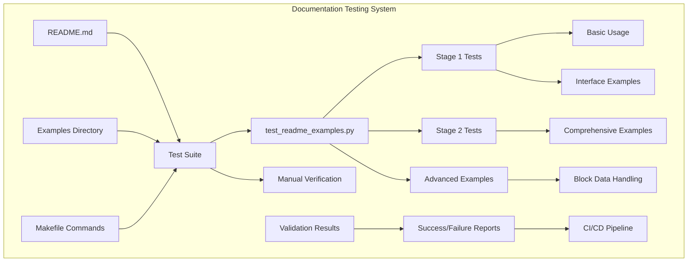
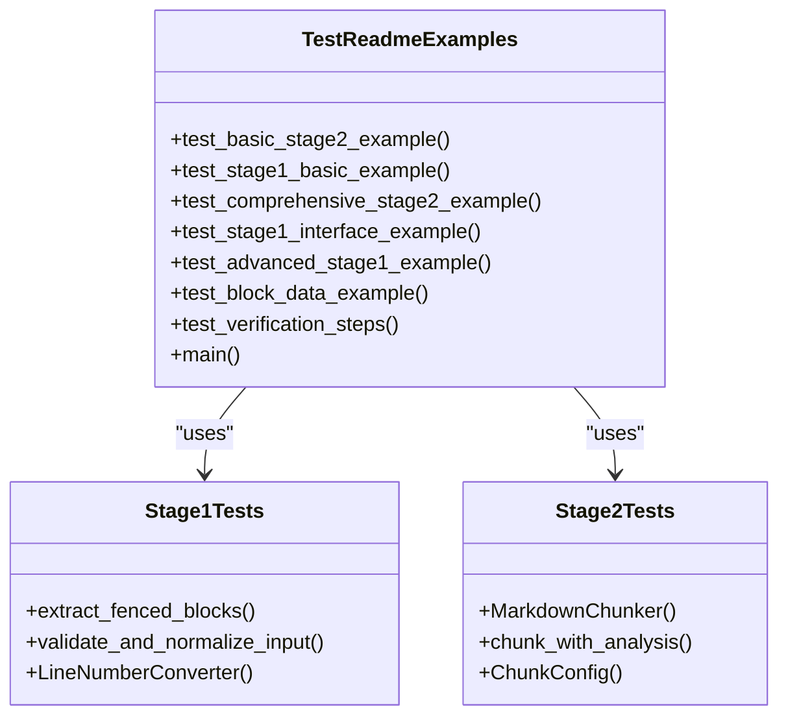
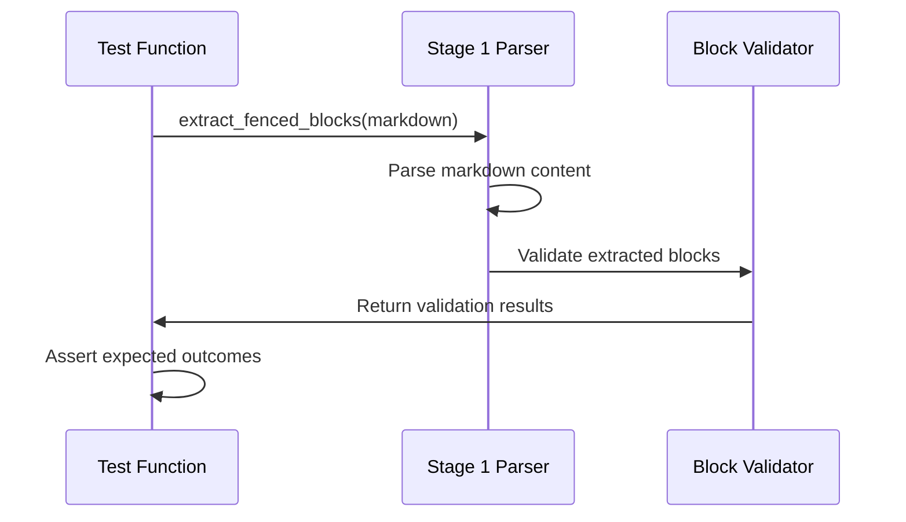
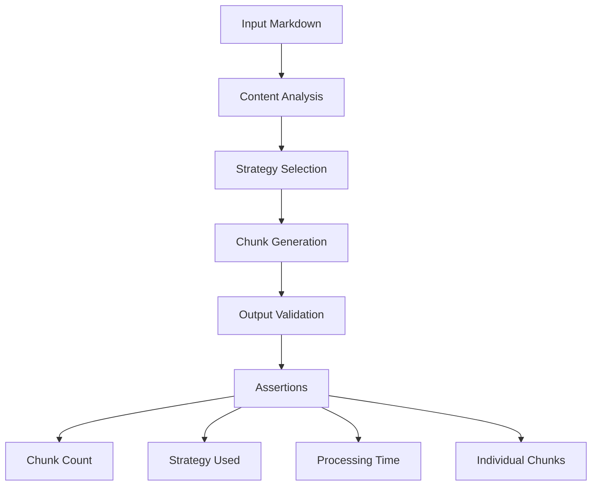
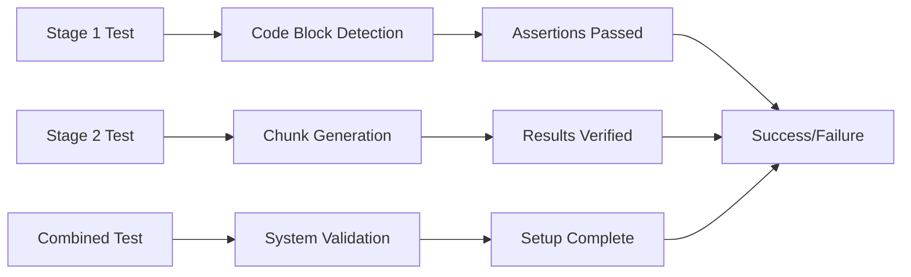
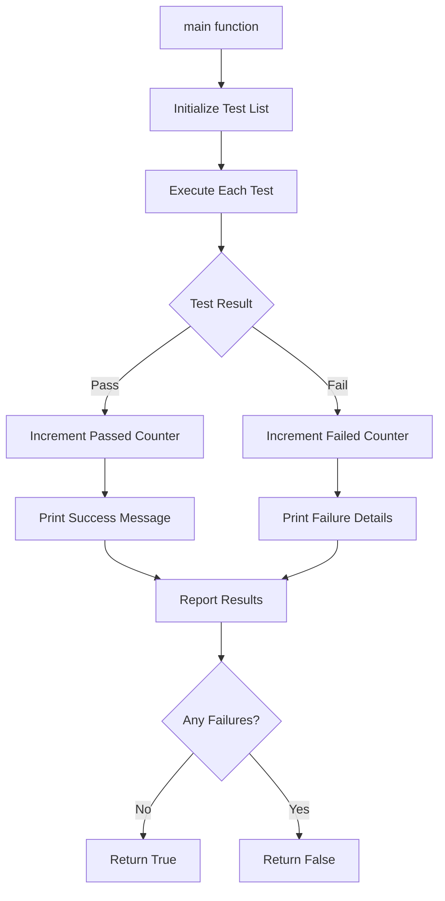
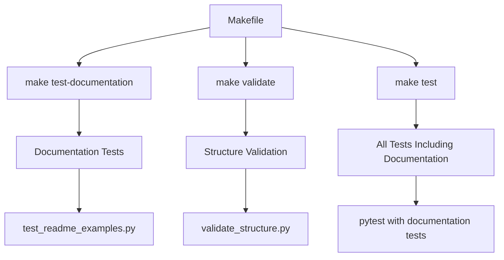

# Documentation Testing

<cite>
**Referenced Files in This Document**
- [test_readme_examples.py](file://tests/documentation/test_readme_examples.py)
- [README.md](file://README.md)
- [basic_usage.py](file://examples/basic_usage.py)
- [api_usage.py](file://examples/api_usage.py)
- [dify_integration.py](file://examples/dify_integration.py)
- [Makefile](file://Makefile)
- [test_documentation_accuracy.py](file://tests/parser/test_documentation_accuracy.py)
- [validation.py](file://markdown_chunker/parser/validation.py)
</cite>

## Table of Contents
1. [Introduction](#introduction)
2. [Documentation Testing Architecture](#documentation-testing-architecture)
3. [Test Readme Examples Module](#test-readme-examples-module)
4. [Stage-by-Stage Validation](#stage-by-stage-validation)
5. [Verification Steps](#verification-steps)
6. [Main Validation Function](#main-validation-function)
7. [Adding New Examples](#adding-new-examples)
8. [Build System Integration](#build-system-integration)
9. [Benefits and Trust Building](#benefits-and-trust-building)
10. [Best Practices](#best-practices)

## Introduction

The Dify Markdown Chunker project implements a sophisticated documentation testing system that ensures all code examples in the README remain functional and accurate across versions. This system prevents documentation drift by executing examples as tests, building user trust through guaranteed working usage patterns, and maintaining synchronization between documentation and implementation.

The documentation testing approach goes beyond simple syntax validation, providing comprehensive verification that examples not only parse correctly but also produce expected outputs and demonstrate proper chunking behavior. This creates a robust feedback loop where documentation changes trigger immediate validation of their correctness.

## Documentation Testing Architecture

The documentation testing system is built around several key components that work together to ensure accuracy and reliability:



**Diagram sources**
- [test_readme_examples.py](file://tests/documentation/test_readme_examples.py#L248-L286)
- [README.md](file://README.md#L1-L281)

The architecture follows a multi-layered approach where examples serve dual purposes: as documentation and as executable tests. This ensures that every documented usage pattern is validated against the actual implementation.

**Section sources**
- [test_readme_examples.py](file://tests/documentation/test_readme_examples.py#L1-L287)
- [README.md](file://README.md#L1-L281)

## Test Readme Examples Module

The `test_readme_examples.py` module serves as the primary validation engine for documentation accuracy. It systematically executes all code examples from the README as automated tests, ensuring they remain functional across different versions.

### Module Structure and Organization

The module is organized into distinct test functions, each corresponding to specific sections of the README documentation:



**Diagram sources**
- [test_readme_examples.py](file://tests/documentation/test_readme_examples.py#L7-L286)

Each test function focuses on validating specific aspects of the documentation:

- **Basic Stage 2 Examples**: Validate fundamental chunking operations
- **Stage 1 Interface Examples**: Test parsing and extraction capabilities  
- **Advanced Stage 1 Examples**: Demonstrate complex parsing scenarios
- **Block Data Examples**: Verify structured data handling
- **Verification Steps**: Confirm complete setup and operation

**Section sources**
- [test_readme_examples.py](file://tests/documentation/test_readme_examples.py#L1-L287)

## Stage-by-Stage Validation

The documentation testing system implements a comprehensive stage-by-stage validation approach that mirrors the README's progression from basic concepts to advanced usage patterns.

### Stage 1: Parsing and Extraction

Stage 1 validation focuses on the foundational parsing capabilities demonstrated in the README:



**Diagram sources**
- [test_readme_examples.py](file://tests/documentation/test_readme_examples.py#L23-L34)
- [test_readme_examples.py](file://tests/documentation/test_readme_examples.py#L136-L225)

The Stage 1 tests validate:
- Basic code block extraction
- Language identification
- Line number accuracy
- Nested block handling
- Input normalization

### Stage 2: Chunking Operations

Stage 2 validation demonstrates the complete chunking pipeline:



**Diagram sources**
- [test_readme_examples.py](file://tests/documentation/test_readme_examples.py#L36-L91)
- [test_readme_examples.py](file://tests/documentation/test_readme_examples.py#L227-L245)

Stage 2 tests verify:
- Automatic strategy selection
- Content type detection
- Complexity scoring
- Processing time measurement
- Individual chunk properties

**Section sources**
- [test_readme_examples.py](file://tests/documentation/test_readme_examples.py#L7-L91)
- [test_readme_examples.py](file://tests/documentation/test_readme_examples.py#L227-L245)

## Verification Steps

The verification system implements a comprehensive validation process that ensures the complete setup and operational readiness:

### Complete Setup Validation

The verification steps test both Stage 1 and Stage 2 components to ensure complete system functionality:



**Diagram sources**
- [test_readme_examples.py](file://tests/documentation/test_readme_examples.py#L227-L245)

### Error Handling and Reporting

The verification system includes robust error handling to provide clear feedback when examples fail:

- **Exception Capture**: All test failures are caught and reported with detailed messages
- **Step-by-Step Validation**: Each verification step is tested independently
- **Success Indicators**: Clear pass/fail indicators for each validation component
- **Completion Confirmation**: Final success message when all verifications pass

**Section sources**
- [test_readme_examples.py](file://tests/documentation/test_readme_examples.py#L227-L245)

## Main Validation Function

The `main()` function serves as the central orchestration point for all documentation validation activities:

### Validation Orchestration



**Diagram sources**
- [test_readme_examples.py](file://tests/documentation/test_readme_examples.py#L248-L286)

### Test Execution and Reporting

The main function implements a systematic approach to test execution:

- **Test Enumeration**: Maintains a comprehensive list of all validation tests
- **Sequential Execution**: Runs tests in a predetermined order
- **Result Tracking**: Tracks both passed and failed tests
- **Comprehensive Reporting**: Provides detailed results with individual test outcomes
- **Exit Code Management**: Returns appropriate exit codes for CI/CD integration

### Integration with Command Line Interface

The module supports direct execution as a standalone script:

- **Direct Invocation**: Can be run directly with `python test_readme_examples.py`
- **Exit Code Handling**: Returns 0 for success, non-zero for failure
- **Verbose Output**: Provides detailed progress and result information
- **CI/CD Compatibility**: Designed for integration with continuous integration systems

**Section sources**
- [test_readme_examples.py](file://tests/documentation/test_readme_examples.py#L248-L286)

## Adding New Examples

The documentation testing system is designed to accommodate new examples while maintaining validation coverage. Here's how to properly add new examples:

### Example Integration Process

When adding new examples to the README, follow this process to ensure they are properly validated:

1. **Create Corresponding Test**: Add a new test function that mirrors the example
2. **Maintain Naming Convention**: Use descriptive names that match the example section
3. **Implement Assertions**: Include appropriate assertions to validate expected behavior
4. **Update Test List**: Add the new test to the main validation function
5. **Verify Coverage**: Ensure the new example is executed during validation

### Best Practices for Example Creation

New examples should follow established patterns for consistency and reliability:

- **Import Statements**: Use explicit imports to ensure test isolation
- **Assertion Patterns**: Implement comprehensive assertions for all expected outcomes
- **Error Handling**: Include appropriate error handling and validation
- **Documentation Comments**: Provide clear comments explaining the example's purpose
- **Output Verification**: Verify both functional behavior and expected outputs

### Example Template

Here's a template for creating new validation tests:

```python
def test_new_example():
    """Test the new example from README"""
    print("Testing new example...")
    
    # Import required modules
    from markdown_chunker.module import ClassName
    
    # Execute example code
    result = ClassName().method(parameters)
    
    # Validate expected outcomes
    assert result.property == expected_value
    assert len(result.collection) == expected_count
    
    print("✅ New example validation passed")
```

**Section sources**
- [test_readme_examples.py](file://tests/documentation/test_readme_examples.py#L1-L287)

## Build System Integration

The documentation testing system integrates seamlessly with the project's build infrastructure through the Makefile:

### Makefile Commands

The Makefile provides convenient commands for running documentation validation:



**Diagram sources**
- [Makefile](file://Makefile#L1-L136)

### Continuous Integration

The documentation testing system is designed for continuous integration environments:

- **Automated Execution**: Tests run automatically as part of the CI pipeline
- **Failure Reporting**: Clear failure reporting for broken documentation examples
- **Integration Points**: Hooks for various CI/CD platforms
- **Parallel Execution**: Supports parallel test execution for faster validation

### Validation Commands

Key validation commands include:

- **`make validate`**: Runs all validation including documentation tests
- **`make test-documentation`**: Executes only documentation validation
- **`python test_readme_examples.py`**: Direct execution of documentation tests

**Section sources**
- [Makefile](file://Makefile#L1-L136)
- [test_readme_examples.py](file://tests/documentation/test_readme_examples.py#L248-L286)

## Benefits and Trust Building

The documentation testing system provides significant benefits that build user confidence and ensure reliable usage patterns:

### Preventing Documentation Drift

The primary benefit is preventing documentation drift between examples and implementation:

- **Immediate Feedback**: Changes to implementation immediately show in documentation tests
- **Version Synchronization**: Ensures examples remain accurate across version updates
- **Regression Prevention**: Automatically catches regressions in documented functionality
- **Quality Assurance**: Provides continuous validation of documented features

### Building User Confidence

Users gain confidence through guaranteed working examples:

- **Verified Usage Patterns**: All documented usage patterns are proven to work
- **Reliable Documentation**: Examples are not just theoretical but executable
- **Trust Establishment**: Users can rely on documentation for production usage
- **Reduced Support Burden**: Fewer questions about broken or outdated examples

### Development Workflow Benefits

The system improves development workflow efficiency:

- **Faster Development**: Immediate validation of documentation changes
- **Better Documentation**: Encourages comprehensive and accurate documentation
- **Knowledge Transfer**: Examples serve as both documentation and learning resources
- **Consistency Maintenance**: Ensures consistent behavior across all documented features

**Section sources**
- [test_readme_examples.py](file://tests/documentation/test_readme_examples.py#L1-L287)

## Best Practices

To maximize the effectiveness of the documentation testing system, follow these established best practices:

### Example Design Principles

- **Self-Contained**: Each example should be complete and runnable independently
- **Clear Purpose**: Examples should clearly demonstrate specific functionality
- **Realistic Scenarios**: Use realistic content that reflects typical usage
- **Comprehensive Coverage**: Cover both success and edge cases where appropriate

### Testing Guidelines

- **Assert Expected Outcomes**: Always include assertions to validate results
- **Test Edge Cases**: Include tests for boundary conditions and error scenarios
- **Maintain Isolation**: Ensure tests don't depend on external state
- **Provide Meaningful Messages**: Include clear success/failure messages

### Maintenance Practices

- **Regular Updates**: Keep documentation examples synchronized with implementation
- **Continuous Validation**: Run documentation tests as part of regular development
- **Review Process**: Include documentation validation in code review processes
- **Monitoring**: Track test results and address failures promptly

### Integration Recommendations

- **CI/CD Integration**: Include documentation validation in all CI/CD pipelines
- **Automated Reporting**: Set up automated reporting for documentation test failures
- **Documentation Reviews**: Treat documentation examples like production code
- **Version Control**: Track documentation changes alongside implementation changes

The documentation testing system represents a mature approach to maintaining accurate, reliable documentation that builds user trust and ensures consistent functionality across all documented usage patterns.