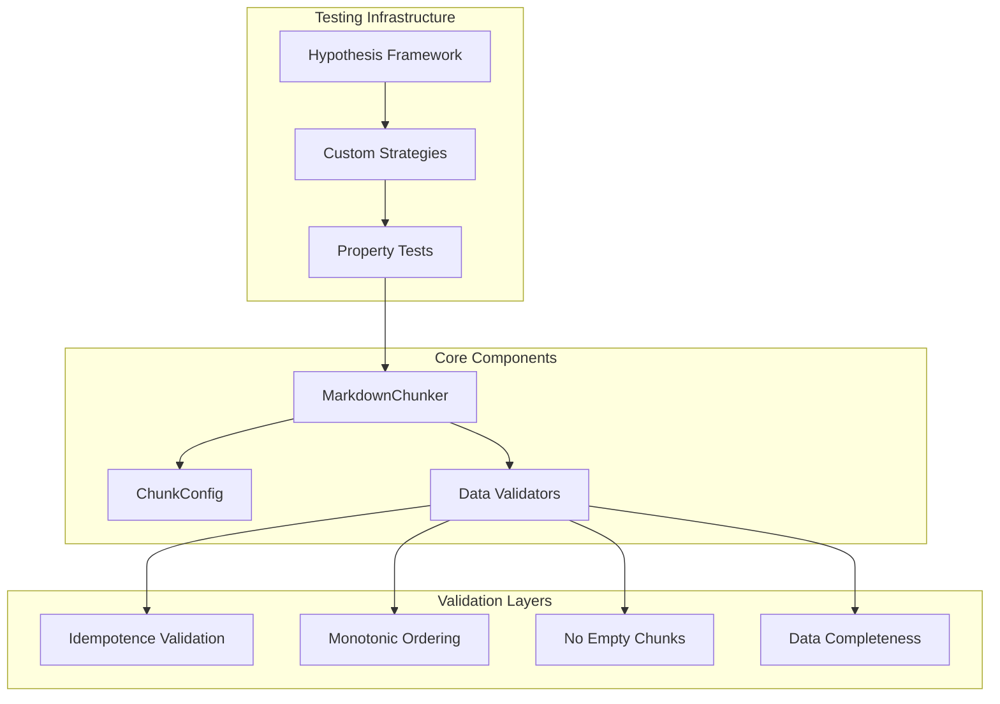
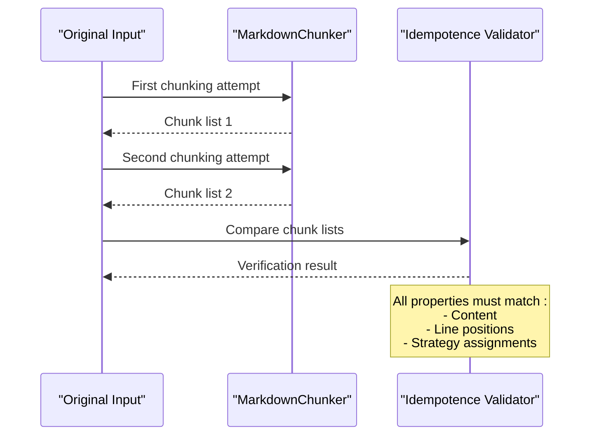
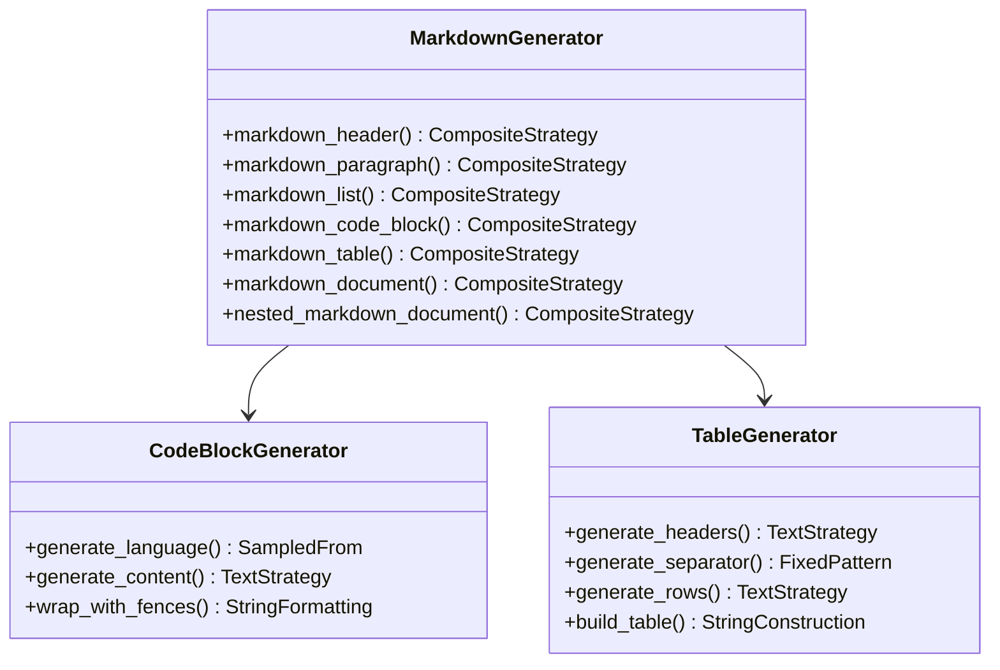
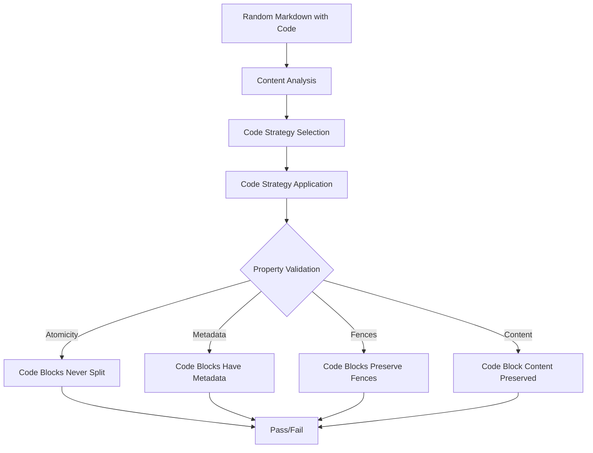
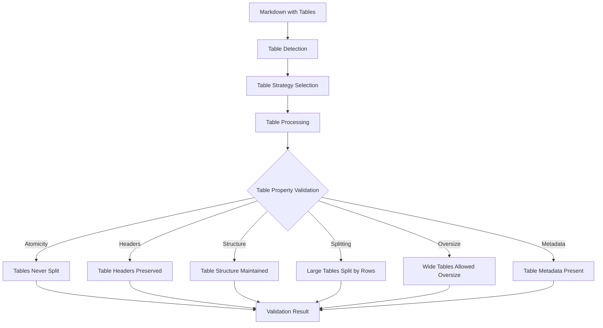
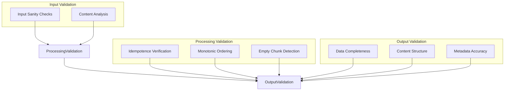

# Property-Based Testing Framework

<cite>
**Referenced Files in This Document**
- [tests/conftest.py](file://tests/conftest.py)
- [tests/chunker/test_code_strategy_properties.py](file://tests/chunker/test_code_strategy_properties.py)
- [tests/chunker/test_table_strategy_properties.py](file://tests/chunker/test_table_strategy_properties.py)
- [tests/chunker/test_idempotence_property.py](file://tests/chunker/test_idempotence_property.py)
- [tests/chunker/test_monotonic_ordering_property.py](file://tests/chunker/test_monotonic_ordering_property.py)
- [tests/chunker/test_no_empty_chunks_property.py](file://tests/chunker/test_no_empty_chunks_property.py)
- [markdown_chunker/chunker/core.py](file://markdown_chunker/chunker/core.py)
- [markdown_chunker/chunker/types.py](file://markdown_chunker/chunker/types.py)
- [markdown_chunker/chunker/strategies/code_strategy.py](file://markdown_chunker/chunker/strategies/code_strategy.py)
- [markdown_chunker/chunker/strategies/table_strategy.py](file://markdown_chunker/chunker/strategies/table_strategy.py)
</cite>

## Table of Contents
1. [Introduction](#introduction)
2. [Framework Architecture](#framework-architecture)
3. [Core Properties Tested](#core-properties-tested)
4. [Custom Hypothesis Strategies](#custom-hypothesis-strategies)
5. [Property Implementation Details](#property-implementation-details)
6. [Edge Case Exploration](#edge-case-exploration)
7. [Validation Mechanisms](#validation-mechanisms)
8. [Performance Considerations](#performance-considerations)
9. [Testing Methodology](#testing-methodology)
10. [Conclusion](#conclusion)

## Introduction

The markdown-chunker project employs a sophisticated property-based testing framework built on Hypothesis to ensure robust and reliable chunking behavior across diverse input scenarios. This approach systematically verifies fundamental invariants that must hold true regardless of the specific input content, providing comprehensive coverage far beyond traditional example-based testing.

Property-based testing transforms the testing paradigm by generating thousands of random test cases automatically, exploring edge cases and corner cases that would be difficult to discover manually. The framework focuses on verifying essential guarantees about chunking behavior, ensuring that the system maintains data integrity, preserves ordering, and handles various content types consistently.

## Framework Architecture

The property-based testing framework is structured around several key components that work together to provide comprehensive validation:

**Diagram sources**
- [tests/conftest.py](file://tests/conftest.py#L1-L220)
- [markdown_chunker/chunker/core.py](file://markdown_chunker/chunker/core.py#L41-L150)

**Section sources**
- [tests/conftest.py](file://tests/conftest.py#L1-L220)
- [markdown_chunker/chunker/core.py](file://markdown_chunker/chunker/core.py#L1-L100)

## Core Properties Tested

The framework verifies four fundamental properties that ensure the reliability and correctness of the chunking system:

### Idempotence Property

The idempotence property guarantees that chunking the same input twice with identical configurations produces identical results. This ensures deterministic behavior and prevents unexpected variations in output.

**Diagram sources**
- [tests/chunker/test_idempotence_property.py](file://tests/chunker/test_idempotence_property.py#L92-L116)

### Monotonic Ordering Property

The monotonic ordering property ensures that chunks appear in the same order as their content appears in the original document, with strictly increasing line numbers. This preserves the logical flow and prevents content from being reordered incorrectly.

### No Empty Chunks Property

The no empty chunks property guarantees that non-empty input never produces empty or whitespace-only chunks, maintaining data integrity and preventing unnecessary fragmentation.

### Data Completeness Property

The data completeness property validates that no content is lost during the chunking process, ensuring that the union of all chunks contains the complete original document.

**Section sources**
- [tests/chunker/test_idempotence_property.py](file://tests/chunker/test_idempotence_property.py#L1-L368)
- [tests/chunker/test_monotonic_ordering_property.py](file://tests/chunker/test_monotonic_ordering_property.py#L1-L391)
- [tests/chunker/test_no_empty_chunks_property.py](file://tests/chunker/test_no_empty_chunks_property.py#L1-L343)

## Custom Hypothesis Strategies

The framework employs sophisticated custom strategies to generate realistic markdown content for testing:

### Markdown Structure Generation

The testing infrastructure provides reusable strategies for generating various markdown elements:

**Diagram sources**
- [tests/conftest.py](file://tests/conftest.py#L23-L220)

### Strategy Implementation Details

The custom strategies are designed to create realistic markdown structures while maintaining testable properties:

| Strategy | Purpose | Key Features |
|----------|---------|--------------|
| `markdown_header` | Generates headers with varying levels | Random level (1-6), filtered text, realistic content |
| `markdown_paragraph` | Creates realistic text paragraphs | Character filtering, size constraints, punctuation preservation |
| `markdown_list` | Generates ordered and unordered lists | Item count control, realistic formatting |
| `markdown_code_block` | Creates code blocks with language detection | Language sampling, content generation, fence preservation |
| `markdown_table` | Builds complete tables with headers | Column/row count control, alignment preservation |
| `markdown_document` | Creates complete documents | Mixed content types, realistic structure |
| `nested_markdown_document` | Generates deeply nested content | Recursive structure, realistic hierarchy |

**Section sources**
- [tests/conftest.py](file://tests/conftest.py#L23-L220)

## Property Implementation Details

### Code Strategy Properties

The code strategy properties focus on ensuring that code blocks are handled correctly:

**Diagram sources**
- [tests/chunker/test_code_strategy_properties.py](file://tests/chunker/test_code_strategy_properties.py#L93-L382)

Key properties verified for code strategy:

1. **Code Blocks Never Split**: Each code block appears in exactly one chunk
2. **Code Blocks Have Metadata**: Proper language and strategy metadata
3. **Code Blocks Preserve Fences**: Original fence characters are maintained
4. **Multiple Code Blocks Handled**: All blocks are preserved correctly
5. **Large Code Blocks Allowed Oversize**: Oversized chunks are properly marked
6. **Code Block Content Preserved**: No content loss during processing

### Table Strategy Properties

The table strategy properties ensure table integrity and proper handling:

**Diagram sources**
- [tests/chunker/test_table_strategy_properties.py](file://tests/chunker/test_table_strategy_properties.py#L119-L526)

**Section sources**
- [tests/chunker/test_code_strategy_properties.py](file://tests/chunker/test_code_strategy_properties.py#L1-L382)
- [tests/chunker/test_table_strategy_properties.py](file://tests/chunker/test_table_strategy_properties.py#L1-L526)

## Edge Case Exploration

The framework systematically explores edge cases to ensure robustness:

### Extreme Input Sizes

Testing with documents ranging from single lines to extremely large documents (up to 5000 characters) ensures that the chunking system handles all size ranges appropriately.

### Content Type Variations

The framework tests various content types:
- Pure text documents
- Documents with mixed content (text, code, tables, lists)
- Documents with minimal content
- Documents with complex nesting

### Configuration Variations

Different chunk size configurations are tested to ensure consistent behavior across various settings.

### Strategy-Specific Testing

Each strategy is tested individually and in combination to verify that they work correctly independently and when switching between strategies.

**Section sources**
- [tests/chunker/test_idempotence_property.py](file://tests/chunker/test_idempotence_property.py#L263-L368)
- [tests/chunker/test_monotonic_ordering_property.py](file://tests/chunker/test_monotonic_ordering_property.py#L271-L391)
- [tests/chunker/test_no_empty_chunks_property.py](file://tests/chunker/test_no_empty_chunks_property.py#L255-L343)

## Validation Mechanisms

### Multi-Level Validation

The framework implements comprehensive validation at multiple levels:

### Assertion Strategies

The framework uses sophisticated assertion strategies to detect subtle failures:

1. **Exact Matching**: For idempotence, requiring identical results
2. **Pattern Matching**: For content preservation, allowing whitespace normalization
3. **Constraint Checking**: For ordering, ensuring monotonic progression
4. **Existence Verification**: For completeness, confirming all content is present

**Section sources**
- [tests/chunker/test_idempotence_property.py](file://tests/chunker/test_idempotence_property.py#L70-L86)
- [tests/chunker/test_monotonic_ordering_property.py](file://tests/chunker/test_monotonic_ordering_property.py#L70-L107)

## Performance Considerations

### Hypothesis Configuration

The framework uses carefully tuned Hypothesis settings to balance thoroughness with performance:

- **Max Examples**: Configured to 100-1000 examples depending on complexity
- **Deadline Settings**: Set to 5000-10000ms to prevent timeouts
- **Memory Management**: Strategies are designed to generate reasonable-sized inputs

### Test Execution Optimization

Tests are organized to minimize redundant computation and maximize coverage:

- Shared strategies reduce code duplication
- Parameterized tests allow efficient batch processing
- Early termination prevents unnecessary computation

**Section sources**
- [tests/conftest.py](file://tests/conftest.py#L13-L16)

## Testing Methodology

### Property-Based Approach Benefits

The property-based testing methodology provides several advantages:

1. **Comprehensive Coverage**: Automatically generates thousands of test cases
2. **Edge Case Discovery**: Finds rare and complex failure conditions
3. **Regression Prevention**: Prevents previously fixed bugs from reoccurring
4. **Documentation**: Properties serve as executable specifications
5. **Maintenance**: Changes to the system trigger automatic retesting

### Test Organization

Tests are organized by property type and strategy:

- **Core Properties**: Idempotence, monotonic ordering, no empty chunks
- **Strategy Properties**: Code-specific, table-specific, and general strategy tests
- **Edge Case Tests**: Specialized tests for unusual scenarios

### Continuous Integration

The property-based tests are integrated into the continuous integration pipeline, ensuring that any changes to the chunking system are immediately validated against all properties.

## Conclusion

The property-based testing framework represents a sophisticated approach to ensuring the reliability and correctness of the markdown chunking system. By systematically verifying fundamental invariants across thousands of generated test cases, the framework provides confidence in the system's behavior across diverse input scenarios.

The framework's strength lies in its ability to explore edge cases and corner cases that would be difficult to discover through manual testing. The combination of custom strategies, comprehensive property validation, and systematic edge case exploration creates a robust testing foundation that supports continued development and maintenance of the chunking system.

Through this approach, the framework not only validates current functionality but also serves as a safety net for future enhancements, ensuring that new features maintain the established guarantees of the system.