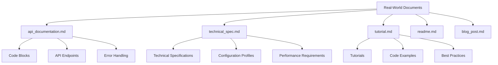
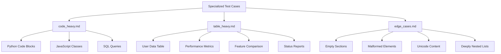
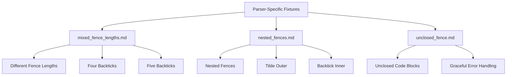
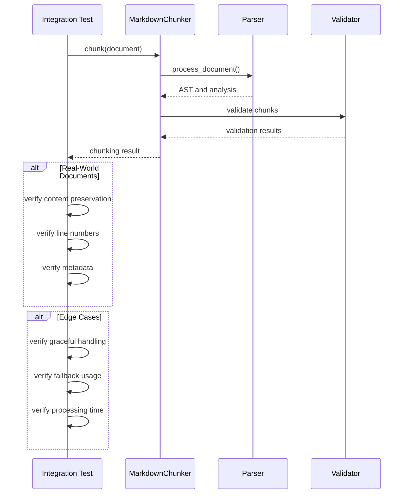

# Test Fixtures and Scenarios

<cite>
**Referenced Files in This Document**   
- [api_documentation.md](file://tests/fixtures/real_documents/api_documentation.md)
- [technical_spec.md](file://tests/fixtures/real_documents/technical_spec.md)
- [tutorial.md](file://tests/fixtures/real_documents/tutorial.md)
- [code_heavy.md](file://tests/fixtures/code_heavy.md)
- [table_heavy.md](file://tests/fixtures/table_heavy.md)
- [edge_cases.md](file://tests/fixtures/edge_cases.md)
- [mixed_fence_lengths.md](file://tests/parser/fixtures/edge_cases/mixed_fence_lengths.md)
- [nested_fences.md](file://tests/parser/fixtures/edge_cases/nested_fences.md)
- [unclosed_fence.md](file://tests/parser/fixtures/edge_cases/unclosed_fence.md)
- [test_full_pipeline_real_docs.py](file://tests/integration/test_full_pipeline_real_docs.py)
- [test_edge_cases_full_pipeline.py](file://tests/integration/test_edge_cases_full_pipeline.py)
</cite>

## Table of Contents
1. [Introduction](#introduction)
2. [Real-World Document Fixtures](#real-world-document-fixtures)
3. [Specialized Test Case Fixtures](#specialized-test-case-fixtures)
4. [Parser-Specific Fixtures](#parser-specific-fixtures)
5. [Integration Testing with Fixtures](#integration-testing-with-fixtures)
6. [Creating and Maintaining Fixtures](#creating-and-maintaining-fixtures)
7. [Conclusion](#conclusion)

## Introduction

The test fixture system in the Markdown Chunker project provides a comprehensive framework for validating the behavior of the markdown processing pipeline. This system uses a variety of fixture types to ensure robustness across different document structures, content types, and edge cases. The fixtures are designed to test both individual components and the complete end-to-end processing pipeline, ensuring that the chunker handles real-world content accurately and reliably.

The fixture system is organized into several categories: real-world documents that simulate production content, specialized test cases for specific content patterns, parser-specific fixtures for low-level markdown element testing, and edge case documents for boundary condition validation. These fixtures are used extensively in integration tests to verify that the chunking pipeline maintains content integrity, preserves structural relationships, and handles complex interactions between markdown elements.

**Section sources**
- [api_documentation.md](file://tests/fixtures/real_documents/api_documentation.md)
- [technical_spec.md](file://tests/fixtures/real_documents/technical_spec.md)
- [tutorial.md](file://tests/fixtures/real_documents/tutorial.md)

## Real-World Document Fixtures

The real_documents directory contains production-like markdown files that represent typical use cases for the markdown chunker. These fixtures are used to validate that the system performs correctly on realistic content rather than just synthetic test cases.

The `api_documentation.md` fixture contains a comprehensive API reference with multiple code blocks in different languages (Python, JavaScript, SQL), HTTP examples, JSON responses, and tables of error codes. This document tests the chunker's ability to handle technical documentation with mixed content types, preserving code integrity while appropriately chunking descriptive text.

The `technical_spec.md` fixture is a detailed technical specification document containing code examples, configuration profiles, API specifications, and performance requirements. This fixture is particularly valuable for testing the chunker's handling of complex nested structures and its ability to maintain semantic coherence across large documents with diverse content types.

The `tutorial.md` fixture represents a user guide with installation instructions, code examples, configuration options, and best practices. This document tests the chunker's ability to preserve instructional flow while handling code snippets, command-line examples, and configuration blocks.

These real-world documents are used in integration tests to verify end-to-end processing through the full pipeline. The tests validate that no content is lost during chunking, line numbers are accurate, metadata is preserved, and appropriate chunking strategies are selected based on document characteristics.

**Diagram sources **
- [api_documentation.md](file://tests/fixtures/real_documents/api_documentation.md)
- [technical_spec.md](file://tests/fixtures/real_documents/technical_spec.md)
- [tutorial.md](file://tests/fixtures/real_documents/tutorial.md)

**Section sources**
- [api_documentation.md](file://tests/fixtures/real_documents/api_documentation.md#L1-L298)
- [technical_spec.md](file://tests/fixtures/real_documents/technical_spec.md#L1-L633)
- [tutorial.md](file://tests/fixtures/real_documents/tutorial.md#L1-L305)

## Specialized Test Case Fixtures

The test suite includes specialized fixtures designed to validate specific aspects of the markdown processing pipeline. These fixtures target particular content patterns and ensure that the chunker handles them correctly.

The `code_heavy.md` fixture contains multiple code blocks in different programming languages (Python, JavaScript, SQL) with explanatory text. This fixture is used to test the code-focused chunking strategy, ensuring that code blocks are kept intact and appropriately chunked. The document structure includes a Python function for calculating Fibonacci numbers, a JavaScript class for data processing, and a complex SQL query with joins and aggregations.

The `table_heavy.md` fixture contains multiple tables with different purposes: user data, performance metrics, feature comparisons, and status reports. This fixture tests the table-focused chunking strategy, ensuring that tables are preserved as complete units and not split across chunks. The tables include various data types, alignment options, and special characters like checkmarks and cross marks.

The `edge_cases.md` fixture is designed to test boundary conditions and unusual document structures. It includes empty sections, very short sections, sections containing only code, malformed elements with unclosed code blocks, multiple blank lines, special characters, Unicode content, very long lines, deeply nested lists, and mixed formatting. This fixture ensures that the chunker handles edge cases gracefully without crashing or producing incorrect output.

These specialized fixtures are critical for ensuring that the chunker can handle the diverse content patterns found in real-world documents. They are used in both unit tests and integration tests to validate specific behaviors and ensure that the system maintains robustness across different content types.

**Diagram sources **
- [code_heavy.md](file://tests/fixtures/code_heavy.md)
- [table_heavy.md](file://tests/fixtures/table_heavy.md)
- [edge_cases.md](file://tests/fixtures/edge_cases.md)

**Section sources**
- [code_heavy.md](file://tests/fixtures/code_heavy.md#L1-L74)
- [table_heavy.md](file://tests/fixtures/table_heavy.md#L1-L40)
- [edge_cases.md](file://tests/fixtures/edge_cases.md#L1-L62)

## Parser-Specific Fixtures

The parser-specific fixtures in the tests/parser/fixtures directory target low-level markdown parsing functionality. These fixtures are designed to test specific markdown elements and edge cases that could affect the accuracy of the parsing process.

The `mixed_fence_lengths.md` fixture tests the parser's ability to handle code blocks with different fence lengths (four backticks, five backticks). This is important because markdown allows code blocks to be delimited by any number of backticks, as long as the opening and closing fences have the same length. The fixture ensures that the parser correctly identifies nested code blocks with different fence lengths and doesn't confuse them with regular content.

The `nested_fences.md` fixture tests the parser's handling of nested code blocks with different fence characters (tilde and backtick). This scenario can occur when code examples include code block delimiters as part of their content. The fixture verifies that the parser can correctly distinguish between the outer fence and inner fence, preventing premature closure of code blocks.

The `unclosed_fence.md` fixture tests the parser's behavior when encountering a code block that is opened but not properly closed. This is a common error in real-world markdown documents, and the parser must handle it gracefully by either closing the block at the end of the document or treating the remaining content appropriately. This fixture ensures that the chunker doesn't crash or produce invalid output when processing malformed markdown.

These parser-specific fixtures are used in unit tests to validate the correctness of the markdown parsing logic. They ensure that the parser can handle complex interactions between markdown elements and maintain accuracy even in the presence of unusual or malformed syntax.

**Diagram sources **
- [mixed_fence_lengths.md](file://tests/parser/fixtures/edge_cases/mixed_fence_lengths.md)
- [nested_fences.md](file://tests/parser/fixtures/edge_cases/nested_fences.md)
- [unclosed_fence.md](file://tests/parser/fixtures/edge_cases/unclosed_fence.md)

**Section sources**
- [mixed_fence_lengths.md](file://tests/parser/fixtures/edge_cases/mixed_fence_lengths.md#L1-L19)
- [nested_fences.md](file://tests/parser/fixtures/edge_cases/nested_fences.md#L1-L9)
- [unclosed_fence.md](file://tests/parser/fixtures/edge_cases/unclosed_fence.md#L1-L8)

## Integration Testing with Fixtures

Integration tests use the fixture system to verify end-to-end processing through the complete markdown chunking pipeline. These tests ensure that all components work together correctly and that the final output meets quality requirements.

The `test_full_pipeline_real_docs.py` integration test uses the real-world document fixtures to validate the complete processing pipeline. It tests each document individually and applies cross-document validation to ensure consistent behavior. The test verifies that no content is lost during chunking by reconstructing the original document from the chunks and comparing it to the source. It also validates that line numbers are accurate and sequential, metadata is properly preserved, and appropriate chunking strategies are selected based on document characteristics.

The `test_edge_cases_full_pipeline.py` integration test focuses on boundary conditions and extreme inputs. It tests empty and minimal documents, very large documents (up to 1MB), malformed markdown with unclosed code blocks and mismatched headers, documents with heavy Unicode usage, and documents with mixed line endings. This test ensures that the chunker handles edge cases gracefully without crashing or producing incorrect output.

Both integration tests use pytest fixtures to manage test dependencies and provide consistent test environments. They validate multiple quality dimensions including correctness (no content loss), reliability (graceful error handling), and performance (reasonable processing time). The tests also verify that the fallback chain works correctly, ensuring that processing never fails completely even when primary strategies encounter issues.

**Diagram sources **
- [test_full_pipeline_real_docs.py](file://tests/integration/test_full_pipeline_real_docs.py)
- [test_edge_cases_full_pipeline.py](file://tests/integration/test_edge_cases_full_pipeline.py)

**Section sources**
- [test_full_pipeline_real_docs.py](file://tests/integration/test_full_pipeline_real_docs.py#L1-L340)
- [test_edge_cases_full_pipeline.py](file://tests/integration/test_edge_cases_full_pipeline.py#L1-L494)

## Creating and Maintaining Fixtures

Creating effective test fixtures requires understanding the system's capabilities and the types of content it needs to handle. When creating new fixtures for untested scenarios, consider the following guidelines:

1. **Represent Real-World Content**: Fixtures should mimic actual documents that users are likely to process. Analyze common document types in your target use cases and create fixtures that reflect their structure and content patterns.

2. **Target Specific Behaviors**: Each fixture should have a clear purpose, whether it's testing a particular chunking strategy, validating parser behavior, or exercising error handling. Document the fixture's purpose in comments or accompanying test files.

3. **Include Diverse Content Types**: Ensure fixtures contain a mix of markdown elements (headers, lists, tables, code blocks) to test how the system handles interactions between different element types.

4. **Cover Edge Cases**: Create fixtures that test boundary conditions, such as empty sections, very long lines, deeply nested structures, and malformed syntax. These help ensure robustness in real-world scenarios.

Maintaining fixture relevance as the codebase evolves is crucial for effective testing. Regularly review fixtures to ensure they still cover important use cases and add new fixtures when new features or content types are introduced. Remove or update fixtures that no longer reflect realistic scenarios or test obsolete functionality.

When adding new fixtures, update the corresponding integration tests to include them in the test suite. Verify that the new fixtures provide meaningful test coverage by checking that they exercise code paths that weren't previously tested or that they validate new functionality.

**Section sources**
- [test_full_pipeline_real_docs.py](file://tests/integration/test_full_pipeline_real_docs.py#L1-L340)
- [test_edge_cases_full_pipeline.py](file://tests/integration/test_edge_cases_full_pipeline.py#L1-L494)

## Conclusion

The test fixture system in the Markdown Chunker project provides a comprehensive framework for validating the behavior of the markdown processing pipeline on production-like content. By using real-world documents, specialized test cases, and parser-specific fixtures, the system ensures that the chunker handles diverse content patterns accurately and reliably.

The fixture system enables reproducible testing of complex interactions between markdown elements, from simple text and headers to complex code blocks, tables, and nested structures. Integration tests use these fixtures to verify end-to-end processing through the complete pipeline, ensuring that content is preserved, line numbers are accurate, and metadata is maintained.

By following the principles of creating realistic, targeted, and diverse fixtures, the test suite maintains high coverage and effectively validates the system's behavior across different scenarios. This comprehensive testing approach ensures that the markdown chunker performs reliably in real-world applications, making it suitable for demanding use cases like RAG systems, documentation processing, and content analysis.