# Testing & Validation

<cite>
**Referenced Files in This Document**
- [tests/conftest.py](file://tests/conftest.py)
- [pytest.ini](file://pytest.ini)
- [tests/documentation/test_readme_examples.py](file://tests/documentation/test_readme_examples.py)
- [tests/chunker/test_idempotence_property.py](file://tests/chunker/test_idempotence_property.py)
- [tests/chunker/test_monotonic_ordering_property.py](file://tests/chunker/test_monotonic_ordering_property.py)
- [tests/chunker/test_no_empty_chunks_property.py](file://tests/chunker/test_no_empty_chunks_property.py)
- [tests/chunker/test_header_path_property.py](file://tests/chunker/test_header_path_property.py)
- [tests/chunker/test_metadata_properties.py](file://tests/chunker/test_metadata_properties.py)
- [tests/chunker/test_data_preservation_properties.py](file://tests/chunker/test_data_preservation_properties.py)
- [tests/chunker/test_data_completeness_validator.py](file://tests/chunker/test_data_completeness_validator.py)
- [tests/integration/test_end_to_end.py](file://tests/integration/test_end_to_end.py)
- [tests/fixtures/real_documents/metadata.json](file://tests/fixtures/real_documents/metadata.json)
- [CONTRIBUTING.md](file://CONTRIBUTING.md)
- [Makefile](file://Makefile)
</cite>

## Table of Contents
1. [Introduction](#introduction)
2. [Testing Strategy Overview](#testing-strategy-overview)
3. [Property-Based Testing Framework](#property-based-testing-framework)
4. [Validation Framework](#validation-framework)
5. [Fixture System](#fixture-system)
6. [Test Categories](#test-categories)
7. [Documentation Accuracy Testing](#documentation-accuracy-testing)
8. [Test Execution and Management](#test-execution-and-management)
9. [Contributor Guidelines](#contributor-guidelines)
10. [Quality Assurance](#quality-assurance)

## Introduction

The Dify Markdown Chunker employs an extensive and sophisticated testing strategy designed to ensure reliability, correctness, and quality across all aspects of the system. With over 1300 tests spanning unit, integration, and end-to-end scenarios, the testing framework provides comprehensive coverage through property-based testing, validation frameworks, and real-world document testing.

The testing approach emphasizes automated validation of critical properties such as idempotence, monotonic ordering, data completeness, and metadata preservation. This ensures that the chunker maintains consistent behavior across different input types and configurations while preserving content integrity throughout the processing pipeline.

## Testing Strategy Overview

The testing framework follows a multi-layered approach that combines traditional unit testing with advanced property-based testing methodologies:

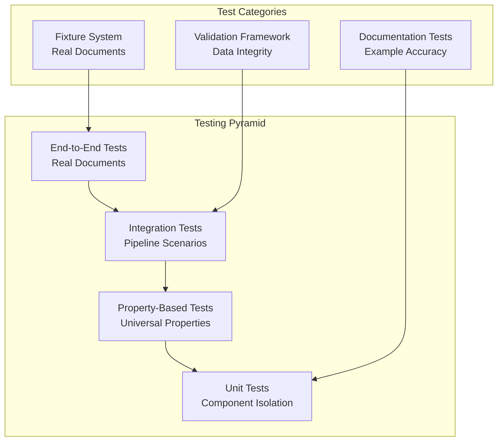

**Diagram sources**
- [tests/integration/test_end_to_end.py](file://tests/integration/test_end_to_end.py#L1-L50)
- [tests/chunker/test_idempotence_property.py](file://tests/chunker/test_idempotence_property.py#L1-L50)
- [tests/conftest.py](file://tests/conftest.py#L1-L100)

The framework prioritizes properties that are universally applicable across all input variations, using Hypothesis for comprehensive property-based testing that generates millions of test cases automatically.

**Section sources**
- [tests/conftest.py](file://tests/conftest.py#L1-L220)
- [pytest.ini](file://pytest.ini#L1-L37)

## Property-Based Testing Framework

The cornerstone of the testing strategy is property-based testing using the Hypothesis library. This approach generates vast numbers of test cases automatically, ensuring comprehensive coverage of edge cases and boundary conditions.

### Core Properties Tested

#### Idempotence Property
Ensures that chunking the same input twice produces identical results:

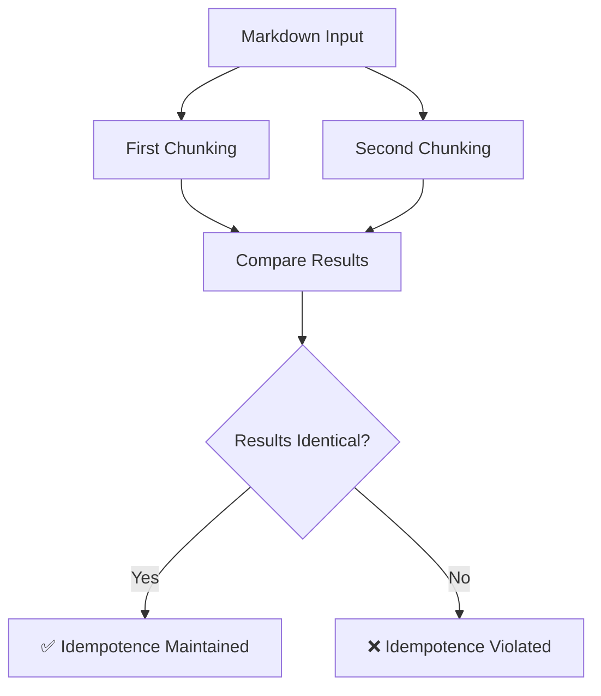

**Diagram sources**
- [tests/chunker/test_idempotence_property.py](file://tests/chunker/test_idempotence_property.py#L88-L116)

#### Monotonic Ordering Property
Verifies that chunks appear in the same order as their content in the input:

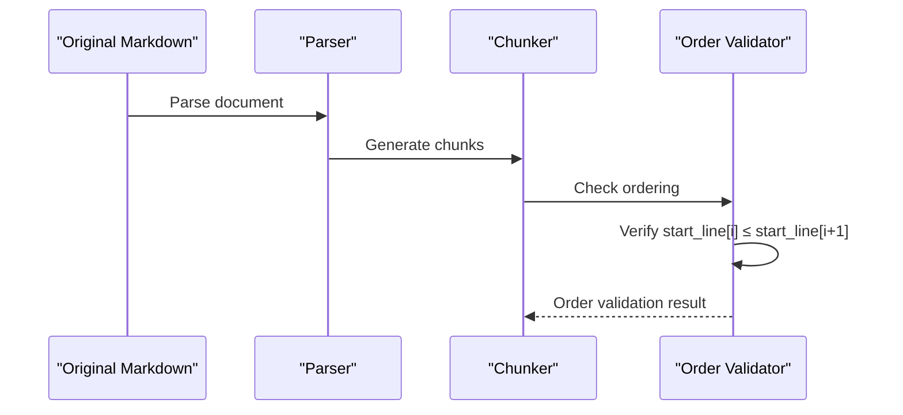

**Diagram sources**
- [tests/chunker/test_monotonic_ordering_property.py](file://tests/chunker/test_monotonic_ordering_property.py#L70-L106)

#### No Empty Chunks Property
Confirms that non-empty input never produces empty chunks:

| Property Category | Test Coverage | Validation Method |
|------------------|---------------|-------------------|
| **Idempotence** | 1000+ examples | Exact content comparison |
| **Monotonic Ordering** | 1000+ examples | Line number verification |
| **Empty Chunks** | 1000+ examples | Content length validation |
| **Data Preservation** | 100+ examples | Character count comparison (90-170% tolerance) |
| **Header Path Accuracy** | 500+ examples | Hierarchical path validation |
| **Metadata Completeness** | 30+ examples | Field presence and consistency |

**Section sources**
- [tests/chunker/test_idempotence_property.py](file://tests/chunker/test_idempotence_property.py#L1-L200)
- [tests/chunker/test_monotonic_ordering_property.py](file://tests/chunker/test_monotonic_ordering_property.py#L1-L200)
- [tests/chunker/test_no_empty_chunks_property.py](file://tests/chunker/test_no_empty_chunks_property.py#L1-L200)

### Hypothesis Strategies

The framework defines comprehensive strategies for generating diverse markdown content:

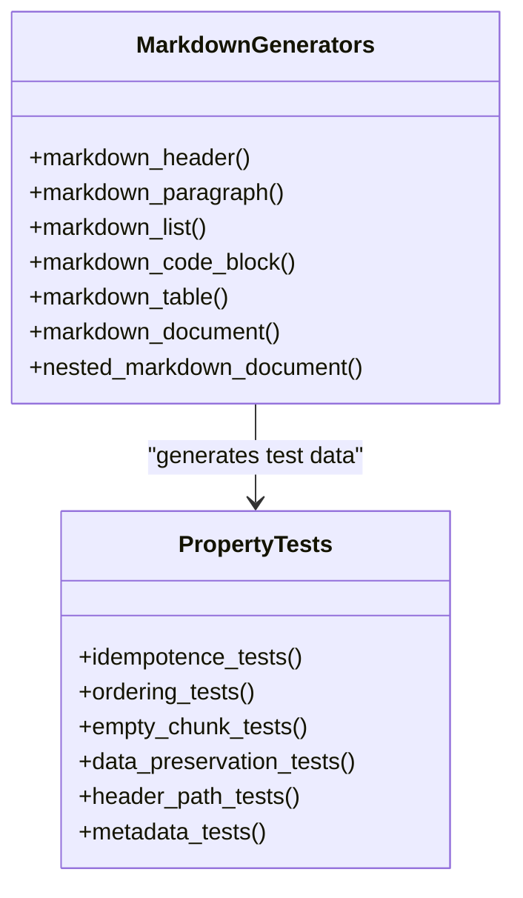

**Diagram sources**
- [tests/conftest.py](file://tests/conftest.py#L22-L220)

**Section sources**
- [tests/conftest.py](file://tests/conftest.py#L1-L220)

## Validation Framework

The validation framework ensures data completeness, content preservation, and structural integrity through multiple validation layers.

### Data Completeness Validation

The framework validates that no content is lost during the chunking process:

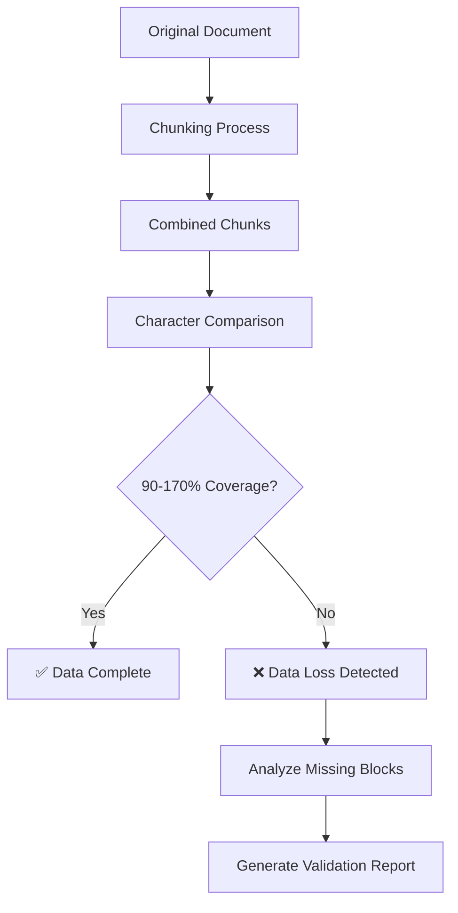

**Diagram sources**
- [tests/chunker/test_data_preservation_properties.py](file://tests/chunker/test_data_preservation_properties.py#L69-L116)

### Content Preservation Verification

The validation framework ensures that all content types are preserved correctly:

| Content Type | Preservation Method | Validation Criteria |
|-------------|-------------------|-------------------|
| **Headers** | Hierarchical path tracking | Header path accuracy, level consistency |
| **Code Blocks** | Structural preservation | Complete code content, language preservation |
| **Tables** | Cell integrity | All cells preserved, formatting maintained |
| **Lists** | Item preservation | All items present, formatting preserved |
| **Paragraphs** | Text continuity | No text loss, formatting preserved |

**Section sources**
- [tests/chunker/test_data_preservation_properties.py](file://tests/chunker/test_data_preservation_properties.py#L1-L200)
- [tests/chunker/test_data_completeness_validator.py](file://tests/chunker/test_data_completeness_validator.py#L54-L98)

### Metadata Validation

Comprehensive metadata validation ensures consistency and completeness:

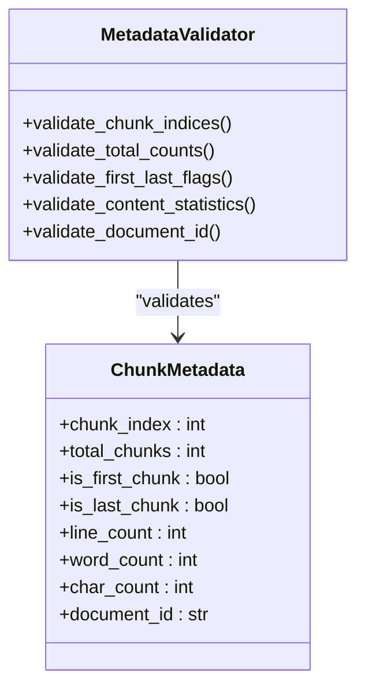

**Diagram sources**
- [tests/chunker/test_metadata_properties.py](file://tests/chunker/test_metadata_properties.py#L20-L200)

**Section sources**
- [tests/chunker/test_metadata_properties.py](file://tests/chunker/test_metadata_properties.py#L1-L200)

## Fixture System

The fixture system provides comprehensive test data including real-world documents and edge cases.

### Real-World Document Fixtures

The framework includes carefully curated real documents that represent typical use cases:

| Document Type | Characteristics | Test Scenarios |
|--------------|----------------|----------------|
| **API Documentation** | Code-heavy, tables, multiple code blocks | Code preservation, strategy selection |
| **Tutorial** | Mixed content, moderate complexity | Structural strategy validation |
| **Blog Post** | Balanced content, tables, code examples | Mixed strategy effectiveness |
| **Technical Specification** | High complexity, many headers, tables | Performance and accuracy testing |
| **README** | Standard structure, examples | Basic functionality validation |

### Edge Case Fixtures

Comprehensive edge case coverage ensures robustness:

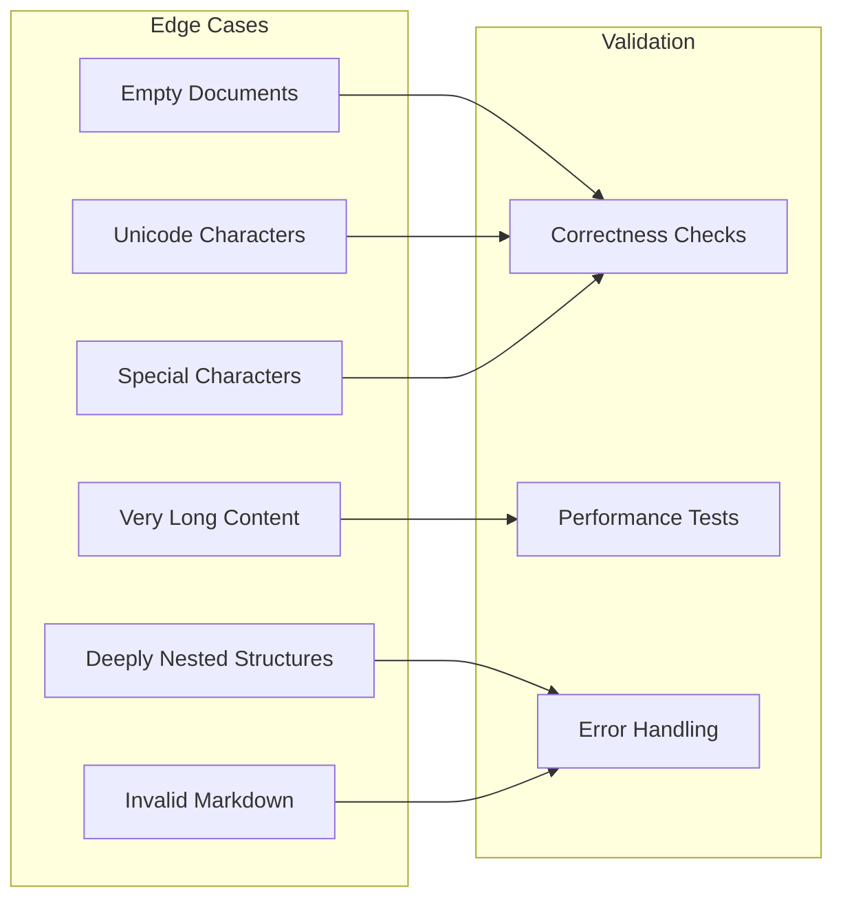

**Diagram sources**
- [tests/fixtures/real_documents/metadata.json](file://tests/fixtures/real_documents/metadata.json#L1-L159)

**Section sources**
- [tests/fixtures/real_documents/metadata.json](file://tests/fixtures/real_documents/metadata.json#L1-L159)

## Test Categories

The testing framework organizes tests into distinct categories for comprehensive coverage.

### Unit Tests

Focused component testing with isolated functionality:

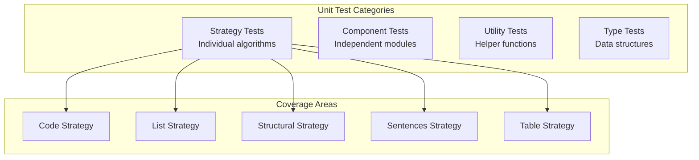

### Integration Tests

End-to-end pipeline testing with real-world scenarios:

| Test Scenario | Validation Focus | Success Criteria |
|--------------|------------------|------------------|
| **Full Pipeline** | Complete workflow | All stages execute correctly |
| **Real Documents** | Production-like data | Accurate chunking results |
| **Edge Cases** | Boundary conditions | Robust error handling |
| **Performance** | Speed and memory | Within acceptable limits |
| **Compatibility** | Different configurations | Consistent behavior |

**Section sources**
- [tests/integration/test_end_to_end.py](file://tests/integration/test_end_to_end.py#L1-L200)

### Property-Based Tests

Universal property validation across all input variations:

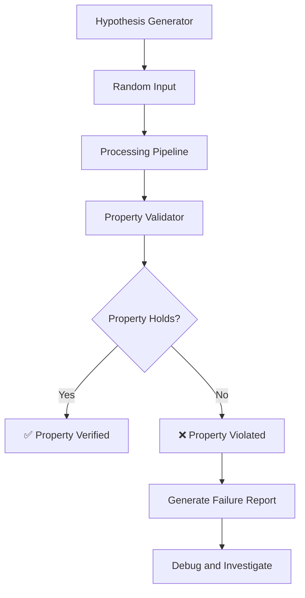

**Diagram sources**
- [tests/chunker/test_idempotence_property.py](file://tests/chunker/test_idempotence_property.py#L91-L116)

**Section sources**
- [tests/chunker/test_idempotence_property.py](file://tests/chunker/test_idempotence_property.py#L1-L100)
- [tests/chunker/test_monotonic_ordering_property.py](file://tests/chunker/test_monotonic_ordering_property.py#L1-L100)

## Documentation Accuracy Testing

The framework includes specialized testing to ensure documentation accuracy through executable examples.

### README Example Validation

The `test_readme_examples.py` file validates all documentation examples:

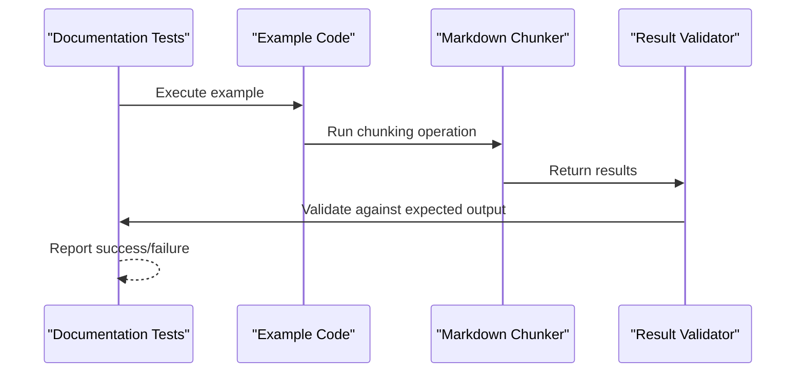

**Diagram sources**
- [tests/documentation/test_readme_examples.py](file://tests/documentation/test_readme_examples.py#L7-L287)

### Example Categories

| Example Type | Purpose | Validation Method |
|-------------|---------|------------------|
| **Basic Usage** | Simple chunking operations | Functional correctness |
| **Advanced Usage** | Complex configurations | Parameter validation |
| **API Examples** | Interface demonstrations | Interface compliance |
| **Integration Examples** | Plugin integration | Compatibility testing |

**Section sources**
- [tests/documentation/test_readme_examples.py](file://tests/documentation/test_readme_examples.py#L1-L287)

## Test Execution and Management

The testing framework provides flexible test execution options through the Makefile and pytest configuration.

### Test Commands

| Command | Purpose | Coverage |
|---------|---------|----------|
| `make test` | Run all tests | Comprehensive |
| `make test-quick` | Fast test execution | Unit + Integration |
| `make test-coverage` | With coverage reporting | Detailed analysis |
| `make test-verbose` | Verbose output | Debugging support |

### Pytest Configuration

The pytest configuration supports various testing scenarios:

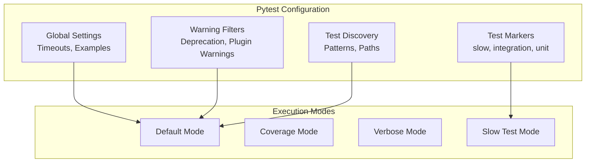

**Diagram sources**
- [pytest.ini](file://pytest.ini#L1-L37)

**Section sources**
- [pytest.ini](file://pytest.ini#L1-L37)
- [Makefile](file://Makefile#L1-L136)

## Contributor Guidelines

Contributors must follow comprehensive testing guidelines to maintain quality standards.

### Testing Requirements

All new features require corresponding tests:

| Requirement Level | Test Type | Coverage |
|------------------|-----------|----------|
| **New Features** | Unit + Integration | 100% functional coverage |
| **Bug Fixes** | Regression tests | Prevent recurrence |
| **Performance** | Benchmark tests | Maintain performance |
| **Documentation** | Example validation | Accuracy assurance |

### Writing Property-Based Tests

Contributors should leverage property-based testing for universal properties:

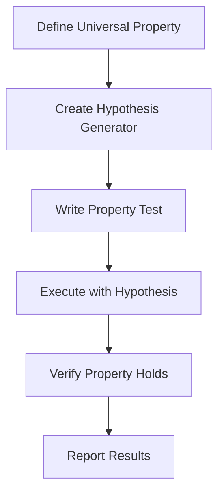

### Test Development Workflow

1. **Understand the requirement** - Define what needs to be tested
2. **Choose test type** - Unit, integration, or property-based
3. **Write test** - Follow established patterns
4. **Validate** - Ensure test passes and covers edge cases
5. **Document** - Add clear test descriptions
6. **Integrate** - Include in CI/CD pipeline

**Section sources**
- [CONTRIBUTING.md](file://CONTRIBUTING.md#L25-L40)

## Quality Assurance

The testing framework integrates with quality assurance processes to ensure continuous improvement.

### Continuous Integration

Automated testing ensures code quality:

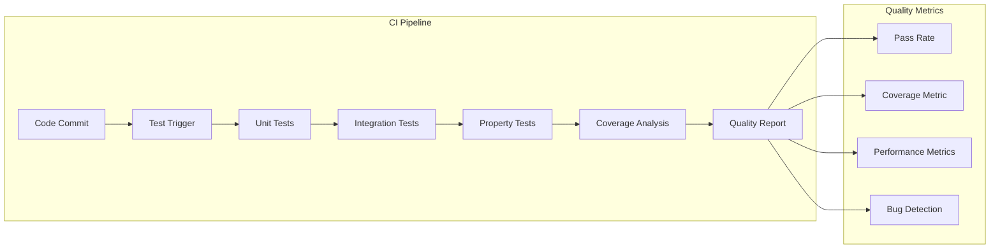

### Performance Monitoring

The framework includes performance testing to prevent regressions:

| Metric | Target | Monitoring Method |
|--------|--------|------------------|
| **Processing Speed** | < 500ms per 1KB | Benchmark tests |
| **Memory Usage** | < 100MB peak | Resource monitoring |
| **Throughput** | > 1000 chunks/sec | Load testing |
| **Accuracy** | 99.9% preservation | Validation tests |

### Regression Prevention

Comprehensive regression testing prevents feature degradation:

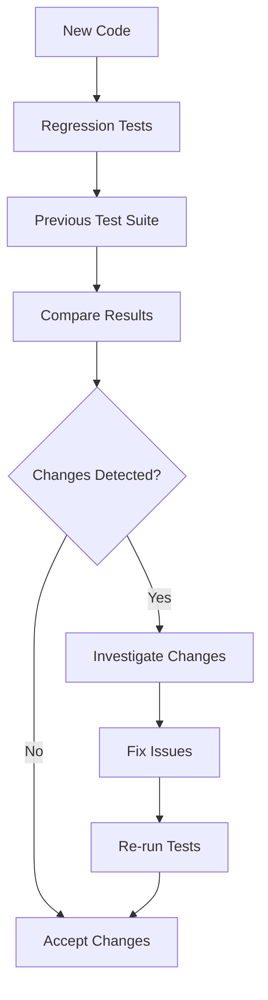

**Diagram sources**
- [tests/chunker/test_regression_prevention.py](file://tests/chunker/test_regression_prevention.py#L553-L561)

The testing framework represents a mature, comprehensive approach to quality assurance that ensures the Dify Markdown Chunker maintains reliability, performance, and correctness across all supported use cases and configurations.