# End-to-End Testing Strategy for Markdown Chunker Library

<cite>
**Referenced Files in This Document**
- [tests/integration/test_full_pipeline_real_docs.py](file://tests/integration/test_full_pipeline_real_docs.py)
- [tests/integration/test_end_to_end.py](file://tests/integration/test_end_to_end.py)
- [tests/documentation/test_readme_examples.py](file://tests/documentation/test_readme_examples.py)
- [tests/regression/test_critical_fixes.py](file://tests/regression/test_critical_fixes.py)
- [tests/integration/test_performance_full_pipeline.py](file://tests/integration/test_performance_full_pipeline.py)
- [tests/integration/test_edge_cases_full_pipeline.py](file://tests/integration/test_edge_cases_full_pipeline.py)
- [tests/fixtures/real_documents/metadata.json](file://tests/fixtures/real_documents/metadata.json)
- [tests/fixtures/real_documents/api_documentation.md](file://tests/fixtures/real_documents/api_documentation.md)
- [tests/fixtures/real_documents/technical_spec.md](file://tests/fixtures/real_documents/technical_spec.md)
- [tests/conftest.py](file://tests/conftest.py)
- [tests/test_logging_config.py](file://tests/test_logging_config.py)
</cite>

## Table of Contents
1. [Introduction](#introduction)
2. [Testing Architecture Overview](#testing-architecture-overview)
3. [Real Document Pipeline Testing](#real-document-pipeline-testing)
4. [Production-Like Environment Testing](#production-like-environment-testing)
5. [Documentation Example Validation](#documentation-example-validation)
6. [Regression Testing Strategy](#regression-testing-strategy)
7. [Performance and Error Handling](#performance-and-error-handling)
8. [Test Data Management](#test-data-management)
9. [Best Practices and Maintenance](#best-practices-and-maintenance)
10. [Common Issues and Solutions](#common-issues-and-solutions)

## Introduction

The markdown chunker library employs a comprehensive end-to-end testing strategy designed to validate the complete workflow from raw markdown input to enriched, structured chunks. This testing approach ensures production readiness by simulating real-world scenarios, validating system behavior under various conditions, and maintaining reliability across different document types and configurations.

The testing strategy encompasses multiple layers of validation, including real document processing, performance benchmarking, error handling verification, and documentation accuracy maintenance. This approach guarantees that the chunking system behaves correctly in actual user workflows while maintaining high standards for quality, reliability, and performance.

## Testing Architecture Overview

The end-to-end testing strategy is built around several key components that work together to provide comprehensive validation:

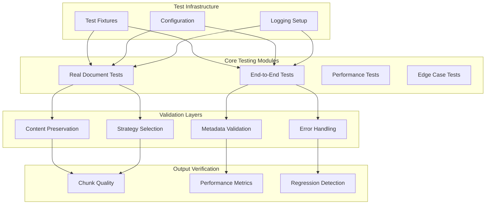

**Diagram sources**
- [tests/integration/test_full_pipeline_real_docs.py](file://tests/integration/test_full_pipeline_real_docs.py#L1-L50)
- [tests/integration/test_end_to_end.py](file://tests/integration/test_end_to_end.py#L1-L50)
- [tests/conftest.py](file://tests/conftest.py#L1-L30)

The testing architecture follows a layered approach where each component validates specific aspects of the system while contributing to overall quality assurance.

**Section sources**
- [tests/integration/test_full_pipeline_real_docs.py](file://tests/integration/test_full_pipeline_real_docs.py#L1-L100)
- [tests/integration/test_end_to_end.py](file://tests/integration/test_end_to_end.py#L1-L100)

## Real Document Pipeline Testing

The real document pipeline testing validates the complete chunking workflow using authentic markdown documents that represent typical user scenarios. This testing approach ensures that the system handles real-world content correctly and maintains content integrity throughout the processing pipeline.

### Test Document Suite

The system uses a curated collection of real documents representing different content types and complexity levels:

| Document Type | Purpose | Characteristics | Validation Focus |
|---------------|---------|-----------------|------------------|
| API Documentation | Code-heavy content | 10KB, 15 code blocks, tables | Code preservation, strategy selection |
| Tutorial | Mixed content | 8KB, balanced structure | Content balance, readability |
| README | Structured documentation | 5KB, badges, examples | Formatting preservation |
| Blog Post | Informal content | 7KB, tables, lists | Natural language handling |
| Technical Spec | Complex documentation | 20KB, extensive structure | Large document processing |

### Content Preservation Validation

The pipeline testing implements rigorous content preservation validation to ensure no information is lost during chunking:

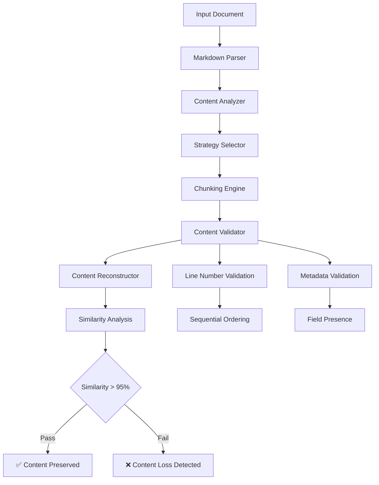

**Diagram sources**
- [tests/integration/test_full_pipeline_real_docs.py](file://tests/integration/test_full_pipeline_real_docs.py#L49-L80)

### Strategy Selection Validation

The testing framework validates that the system selects appropriate chunking strategies for different document types:

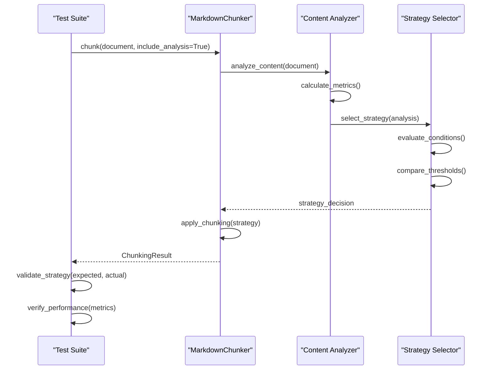

**Diagram sources**
- [tests/integration/test_full_pipeline_real_docs.py](file://tests/integration/test_full_pipeline_real_docs.py#L293-L312)

**Section sources**
- [tests/integration/test_full_pipeline_real_docs.py](file://tests/integration/test_full_pipeline_real_docs.py#L98-L340)
- [tests/fixtures/real_documents/metadata.json](file://tests/fixtures/real_documents/metadata.json#L1-L159)

## Production-Like Environment Testing

Production-like environment testing ensures the system behaves correctly under conditions that mirror real-world usage scenarios, including error handling, logging, and performance monitoring.

### Error Handling and Recovery

The system implements comprehensive error handling with fallback mechanisms to ensure graceful degradation:

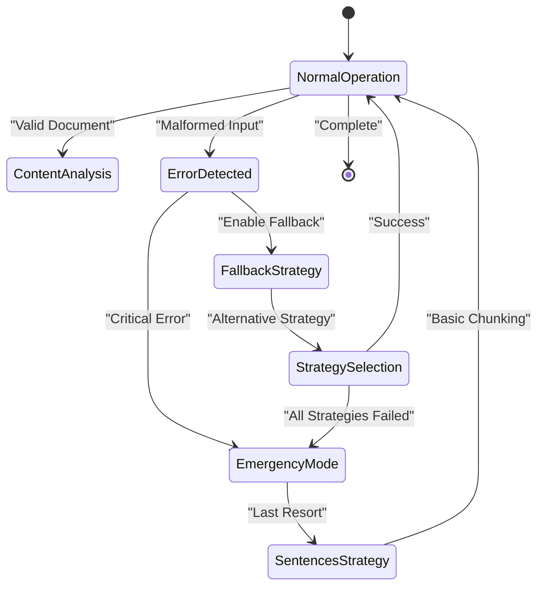

**Diagram sources**
- [tests/integration/test_edge_cases_full_pipeline.py](file://tests/integration/test_edge_cases_full_pipeline.py#L451-L494)

### Logging and Monitoring

The testing framework validates logging configuration and monitoring capabilities:

| Log Level | Purpose | Validation Criteria |
|-----------|---------|-------------------|
| DEBUG | Development tracing | Verbose operation details |
| INFO | Operational events | Key processing milestones |
| WARNING | Non-critical issues | Recoverable problems |
| ERROR | Critical failures | System errors requiring attention |
| CRITICAL | System failures | Complete system breakdowns |

### Performance Monitoring

Performance monitoring tests validate that the system meets production requirements:

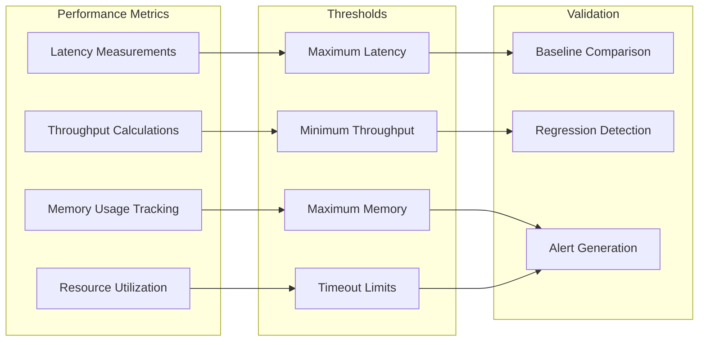

**Diagram sources**
- [tests/integration/test_performance_full_pipeline.py](file://tests/integration/test_performance_full_pipeline.py#L1-L50)

**Section sources**
- [tests/integration/test_end_to_end.py](file://tests/integration/test_end_to_end.py#L1-L277)
- [tests/integration/test_performance_full_pipeline.py](file://tests/integration/test_performance_full_pipeline.py#L1-L358)
- [tests/integration/test_edge_cases_full_pipeline.py](file://tests/integration/test_edge_cases_full_pipeline.py#L1-L494)

## Documentation Example Validation

Documentation example validation ensures that all examples in the README and documentation remain executable and accurate, maintaining trust in the system's usability.

### Automated Example Testing

The documentation example validation system automatically executes and verifies all code examples:

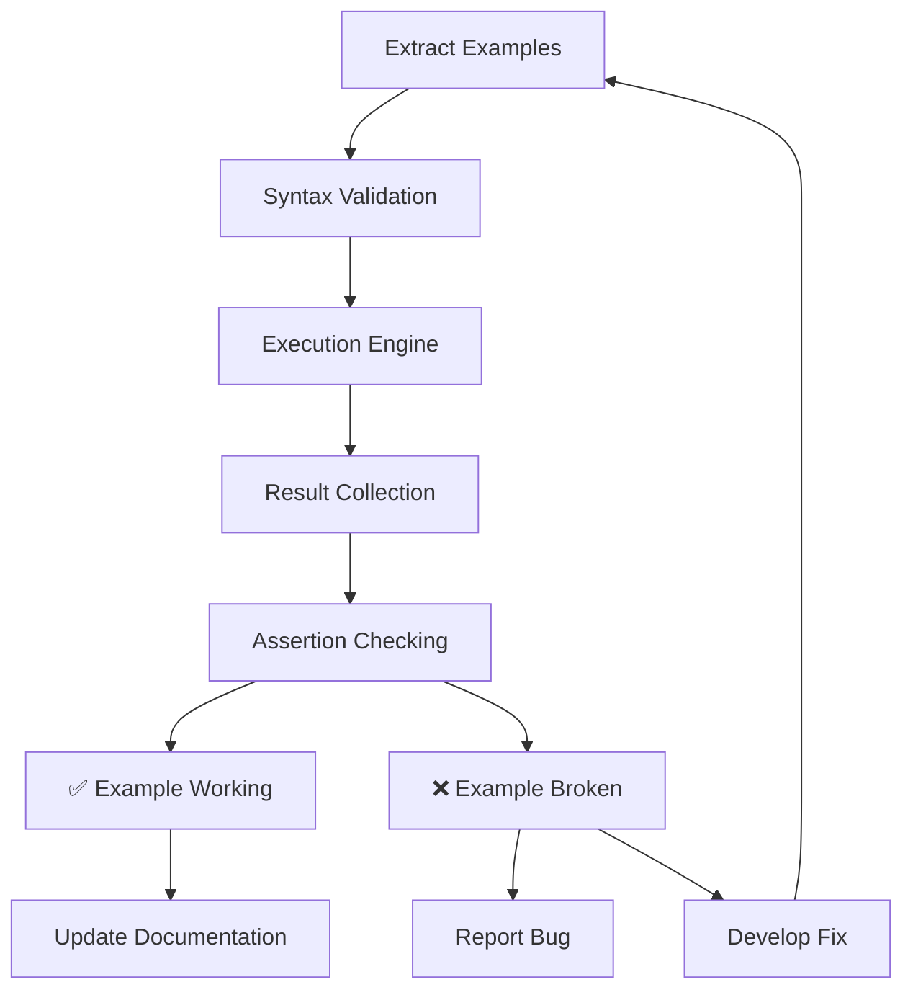

**Diagram sources**
- [tests/documentation/test_readme_examples.py](file://tests/documentation/test_readme_examples.py#L1-L50)

### Example Categories

The validation covers multiple categories of documentation examples:

| Category | Purpose | Validation Focus |
|----------|---------|------------------|
| Basic Usage | Simple operations | Syntax correctness |
| Advanced Usage | Complex scenarios | Functional accuracy |
| Configuration | Settings and tuning | Parameter validation |
| Integration | External system usage | Compatibility testing |
| Troubleshooting | Problem resolution | Error handling |

### Continuous Validation

The documentation validation runs continuously as part of the testing pipeline, ensuring that:

- All examples remain executable
- Code examples match current API
- Documentation stays synchronized with implementation
- User workflows are validated

**Section sources**
- [tests/documentation/test_readme_examples.py](file://tests/documentation/test_readme_examples.py#L1-L287)

## Regression Testing Strategy

Regression testing prevents the recurrence of known bugs and ensures system stability over time through targeted validation of critical fixes.

### Critical Fix Validation

The regression testing framework specifically validates P0 critical fixes:

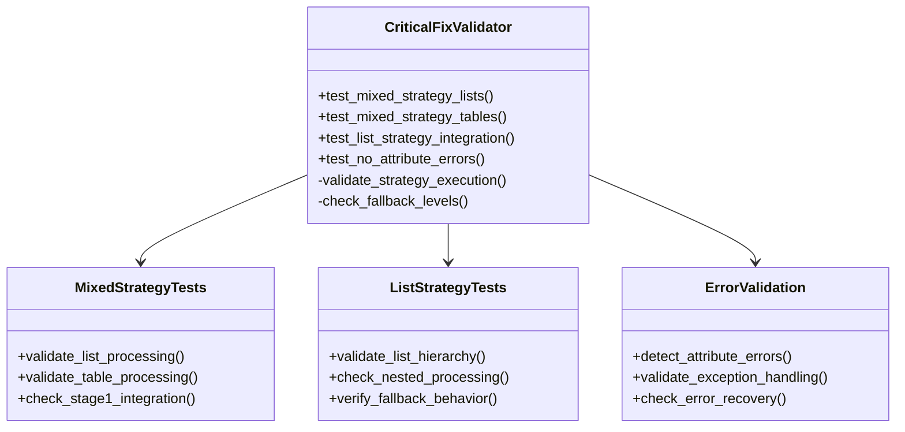

**Diagram sources**
- [tests/regression/test_critical_fixes.py](file://tests/regression/test_critical_fixes.py#L1-L50)

### Fix Categories

The regression testing covers several categories of critical fixes:

| Fix Category | Impact | Validation Approach |
|--------------|--------|-------------------|
| Strategy Selection | High | Validate strategy activation conditions |
| Content Processing | Critical | Verify content preservation |
| Error Recovery | High | Test fallback mechanisms |
| Performance | Medium | Monitor processing time |
| Memory Usage | Critical | Track memory consumption |

### Automated Regression Detection

The system automatically detects potential regressions through:

- Historical performance baseline comparisons
- Content preservation validation against known good outputs
- Strategy selection consistency checks
- Error handling improvement validation

**Section sources**
- [tests/regression/test_critical_fixes.py](file://tests/regression/test_critical_fixes.py#L1-L106)

## Performance and Error Handling

Performance and error handling testing ensures the system operates efficiently and reliably under various conditions, including edge cases and failure scenarios.

### Performance Benchmarking

The performance testing framework establishes and validates performance baselines:

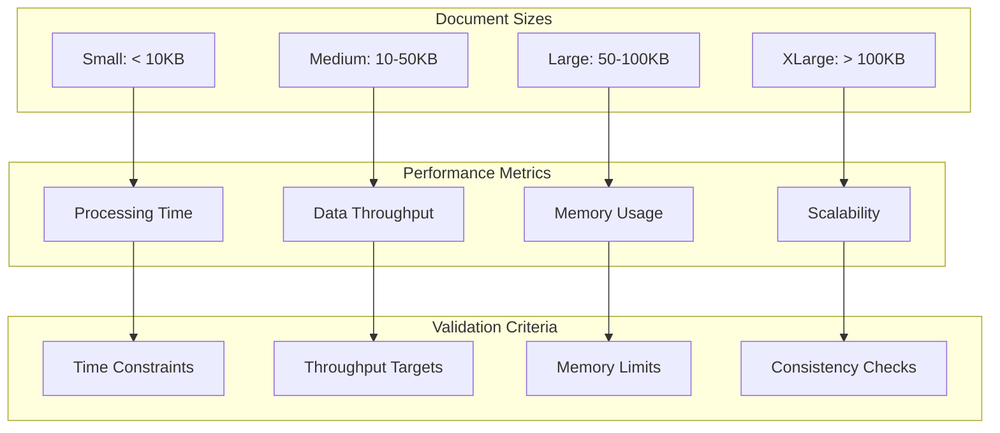

**Diagram sources**
- [tests/integration/test_performance_full_pipeline.py](file://tests/integration/test_performance_full_pipeline.py#L80-L200)

### Error Handling Scenarios

The system validates comprehensive error handling scenarios:

| Error Type | Scenario | Recovery Mechanism | Validation Criteria |
|------------|----------|-------------------|-------------------|
| Malformed Markdown | Unclosed code blocks | Fallback to sentences | Graceful degradation |
| Memory Exhaustion | Very large documents | Stream processing | Resource limits |
| Network Issues | External dependencies | Local processing | Offline capability |
| Configuration Errors | Invalid parameters | Default values | Parameter validation |
| Strategy Failures | Algorithm errors | Emergency fallback | Error containment |

### Load Testing

The testing framework includes load testing capabilities to validate system behavior under stress:

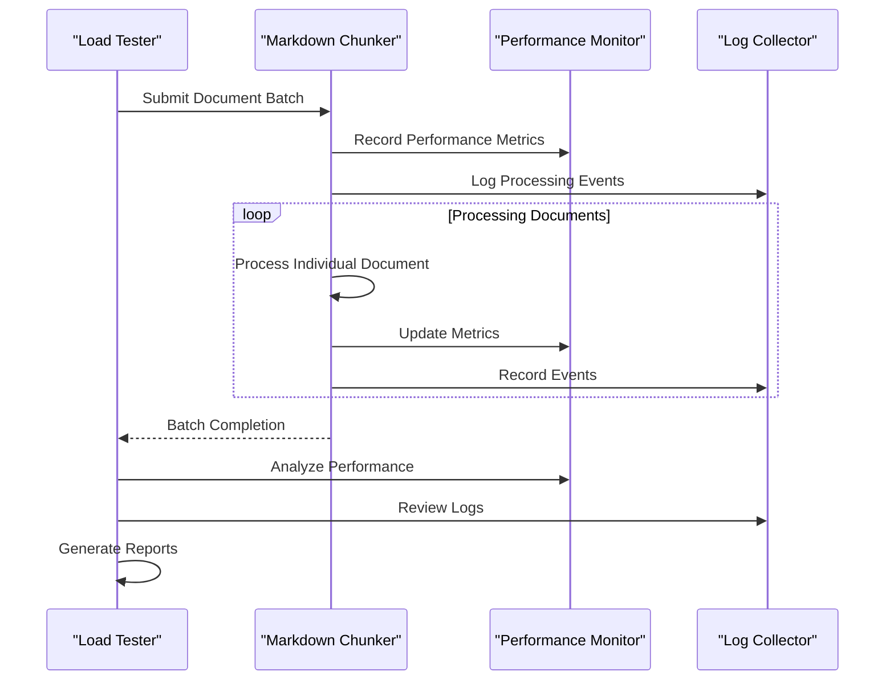

**Diagram sources**
- [tests/integration/test_performance_full_pipeline.py](file://tests/integration/test_performance_full_pipeline.py#L278-L358)

**Section sources**
- [tests/integration/test_performance_full_pipeline.py](file://tests/integration/test_performance_full_pipeline.py#L1-L358)
- [tests/integration/test_edge_cases_full_pipeline.py](file://tests/integration/test_edge_cases_full_pipeline.py#L1-L494)

## Test Data Management

Effective test data management ensures reliable, reproducible, and maintainable end-to-end tests that accurately represent real-world scenarios.

### Test Fixture Organization

The test data is organized in a hierarchical structure that supports different testing scenarios:

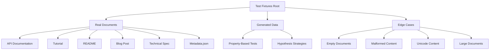

**Diagram sources**
- [tests/fixtures/real_documents/metadata.json](file://tests/fixtures/real_documents/metadata.json#L1-L50)

### Data Generation Strategies

The testing framework uses sophisticated data generation strategies to create comprehensive test scenarios:

| Strategy Type | Purpose | Implementation |
|---------------|---------|----------------|
| Property-Based Testing | Mathematical correctness | Hypothesis framework |
| Document Generation | Realistic content creation | Template-based generation |
| Edge Case Creation | Boundary condition testing | Randomized edge cases |
| Performance Data | Benchmark generation | Synthetic document creation |

### Metadata-Driven Testing

The system uses metadata-driven testing to ensure comprehensive validation:

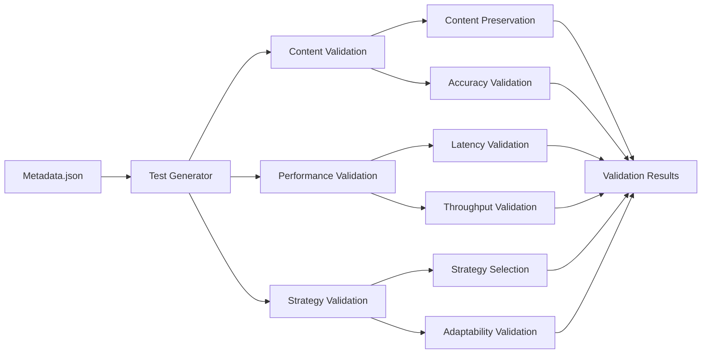

**Diagram sources**
- [tests/fixtures/real_documents/metadata.json](file://tests/fixtures/real_documents/metadata.json#L100-L159)

**Section sources**
- [tests/fixtures/real_documents/metadata.json](file://tests/fixtures/real_documents/metadata.json#L1-L159)
- [tests/conftest.py](file://tests/conftest.py#L1-L220)

## Best Practices and Maintenance

Maintaining reliable end-to-end tests requires adherence to established best practices and continuous improvement of the testing infrastructure.

### Test Design Principles

The end-to-end testing strategy follows several key design principles:

| Principle | Application | Benefits |
|-----------|-------------|----------|
| Reproducibility | Deterministic test data generation | Consistent results |
| Isolation | Independent test execution | Reliable debugging |
| Comprehensiveness | Multiple validation layers | Thorough coverage |
| Efficiency | Optimized test execution | Fast feedback cycles |
| Maintainability | Clear test organization | Easy updates |

### Continuous Improvement

The testing framework incorporates continuous improvement practices:

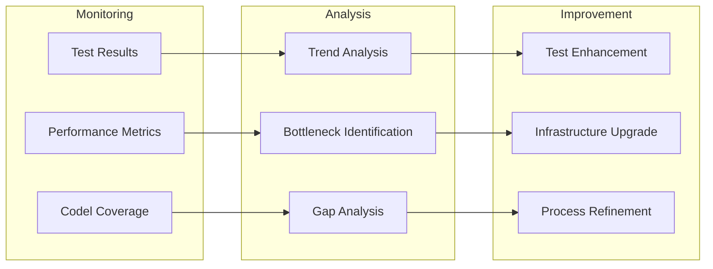

### Maintenance Procedures

Regular maintenance procedures ensure test reliability:

- **Test Data Updates**: Regular review and update of test fixtures
- **Performance Baselines**: Periodic adjustment of performance targets
- **Infrastructure Updates**: Keeping test infrastructure current
- **Coverage Analysis**: Identifying and addressing test gaps
- **Documentation Updates**: Maintaining accurate test documentation

### Quality Assurance Metrics

The system tracks key quality assurance metrics:

| Metric | Target | Measurement Method |
|--------|--------|-------------------|
| Test Pass Rate | > 99% | Successful test execution percentage |
| Coverage | > 90% | Code coverage measurement |
| Performance | Within baselines | Benchmark comparison |
| Stability | Low regression rate | Regression detection |
| Maintainability | High test quality | Code review metrics |

**Section sources**
- [tests/conftest.py](file://tests/conftest.py#L1-L220)
- [tests/test_logging_config.py](file://tests/test_logging_config.py#L1-L175)

## Common Issues and Solutions

Understanding common issues and their solutions helps maintain robust end-to-end testing and resolve problems quickly when they arise.

### Test Execution Time

**Issue**: Long test execution times affecting development velocity.

**Solutions**:
- Implement test parallelization where possible
- Use selective test execution for focused debugging
- Optimize expensive operations through caching
- Separate quick vs. slow test suites

### Environment Dependencies

**Issue**: Tests failing due to environment differences.

**Solutions**:
- Standardize test environments using containers
- Implement environment abstraction layers
- Use deterministic test data generation
- Mock external dependencies appropriately

### Data Synchronization

**Issue**: Test data becoming out of sync with implementation.

**Solutions**:
- Implement automated data validation
- Use version-controlled test fixtures
- Establish clear data governance processes
- Regular data refresh cycles

### Performance Variability

**Issue**: Inconsistent performance measurements affecting reliability.

**Solutions**:
- Implement statistical significance in performance tests
- Account for system load variations
- Use warm-up periods for accurate measurements
- Establish performance baselines with margins

### Memory Management

**Issue**: Memory leaks or excessive memory usage in tests.

**Solutions**:
- Implement proper resource cleanup
- Monitor memory usage in test execution
- Use memory profiling tools
- Implement memory usage limits

### Error Handling Complexity

**Issue**: Complex error handling scenarios difficult to test comprehensively.

**Solutions**:
- Break down complex scenarios into simpler components
- Use error injection techniques
- Implement comprehensive logging
- Create dedicated error handling test suites

**Section sources**
- [tests/integration/test_performance_full_pipeline.py](file://tests/integration/test_performance_full_pipeline.py#L100-L200)
- [tests/integration/test_edge_cases_full_pipeline.py](file://tests/integration/test_edge_cases_full_pipeline.py#L450-L494)