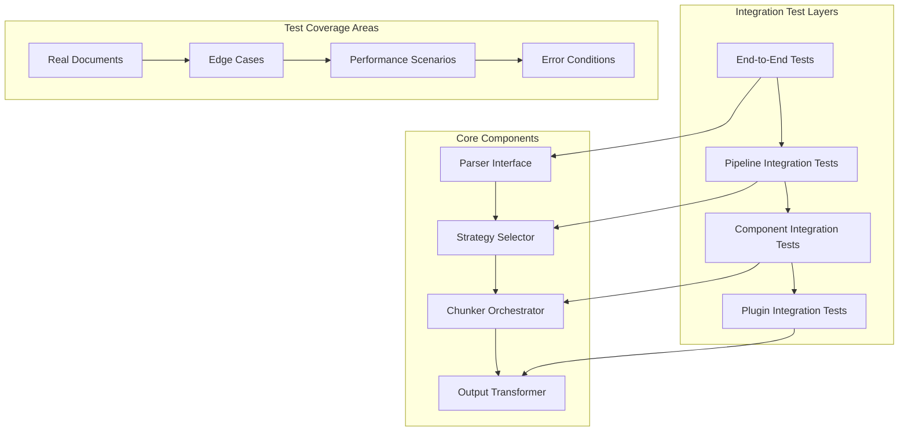
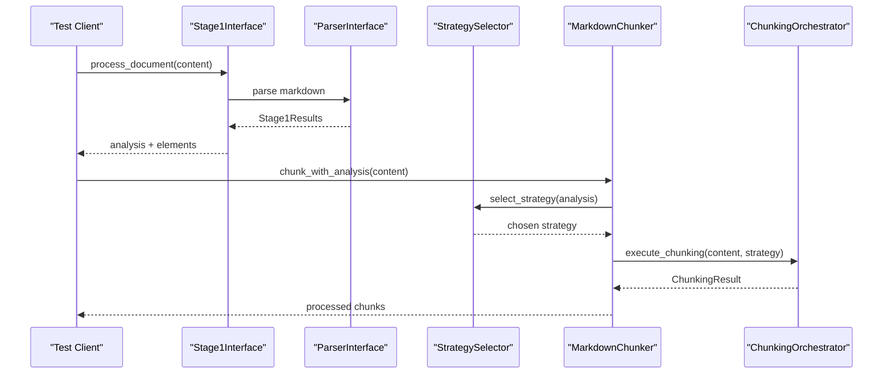
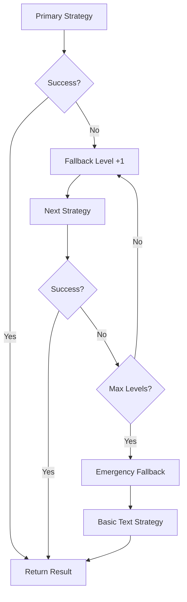
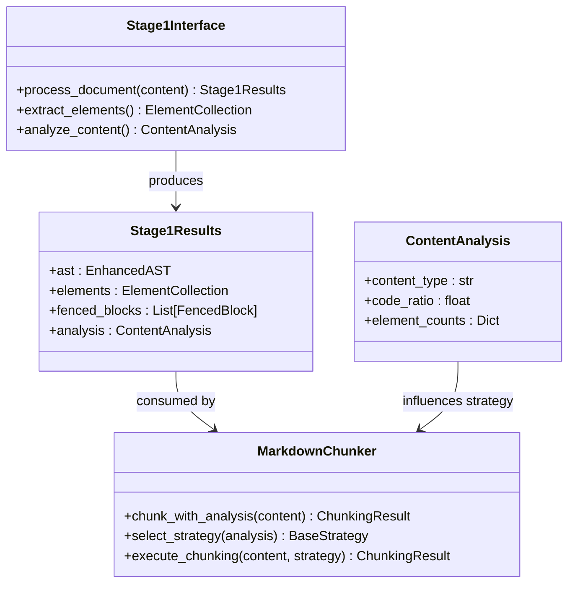
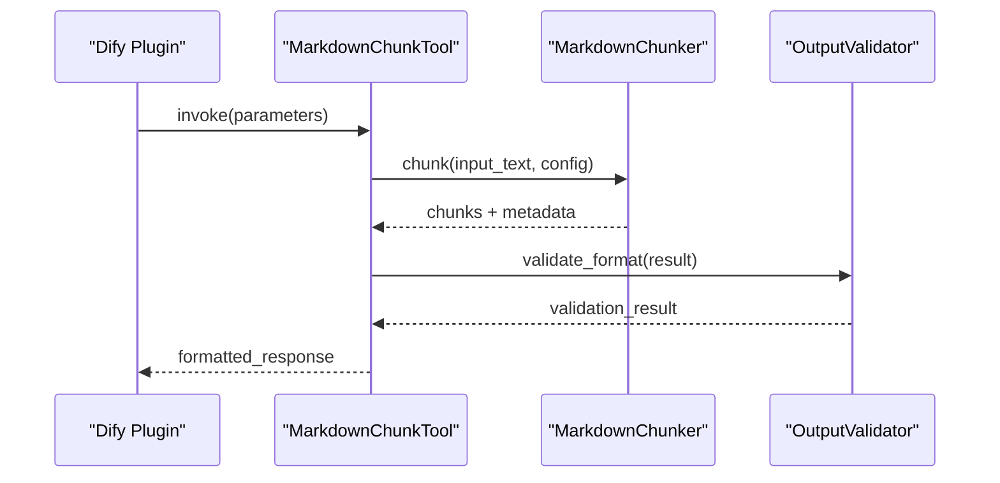
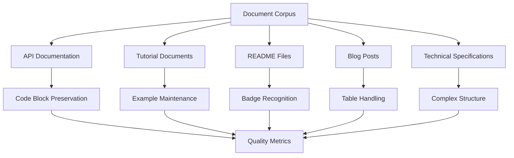
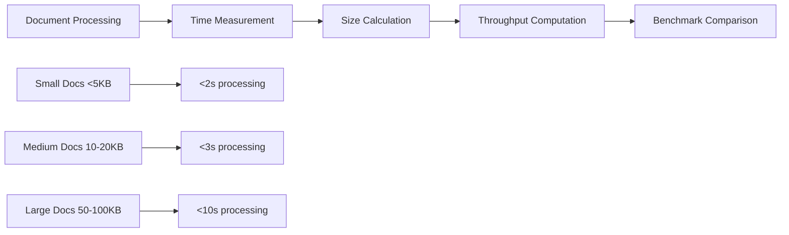
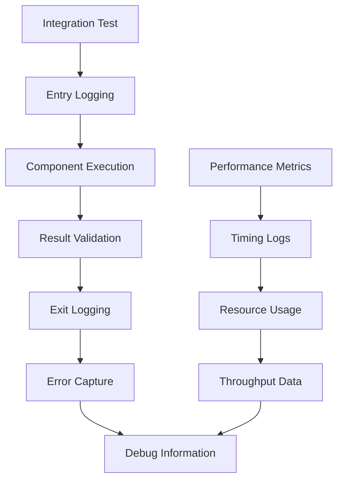

# Integration Testing Strategy

<cite>
**Referenced Files in This Document**
- [test_full_pipeline.py](file://tests/integration/test_full_pipeline.py)
- [test_parser_chunker_integration.py](file://tests/integration/test_parser_chunker_integration.py)
- [test_dify_plugin_integration.py](file://tests/integration/test_dify_plugin_integration.py)
- [test_end_to_end.py](file://tests/integration/test_end_to_end.py)
- [test_full_pipeline_real_docs.py](file://tests/integration/test_full_pipeline_real_docs.py)
- [test_performance_full_pipeline.py](file://tests/integration/test_performance_full_pipeline.py)
- [core.py](file://markdown_chunker/chunker/core.py)
- [selector.py](file://markdown_chunker/chunker/selector.py)
- [parser/__init__.py](file://markdown_chunker/parser/__init__.py)
- [conftest.py](file://tests/conftest.py)
</cite>

## Table of Contents
1. [Introduction](#introduction)
2. [Integration Testing Architecture](#integration-testing-architecture)
3. [Core Integration Test Components](#core-integration-test-components)
4. [End-to-End Pipeline Testing](#end-to-end-pipeline-testing)
5. [Parser-Chunker Integration](#parser-chunker-integration)
6. [Dify Plugin Integration Testing](#dify-plugin-integration-testing)
7. [Real-World Document Testing](#real-world-document-testing)
8. [Performance Integration Testing](#performance-integration-testing)
9. [Common Integration Issues and Solutions](#common-integration-issues-and-solutions)
10. [Debugging Strategies](#debugging-strategies)
11. [Performance Optimization Tips](#performance-optimization-tips)
12. [Best Practices](#best-practices)

## Introduction

The markdown chunker library employs a comprehensive integration testing strategy designed to validate the seamless interaction between major components throughout the complete processing pipeline. This strategy ensures that the Parser, StrategySelector, and Chunker classes work harmoniously to deliver reliable, high-quality document chunking across diverse real-world scenarios.

Integration tests serve as the final validation layer, verifying that individual unit-tested components collaborate effectively to produce correct and efficient results. Unlike unit tests that focus on isolated functionality, integration tests examine the entire system behavior, including error handling, performance characteristics, and data flow consistency.

## Integration Testing Architecture

The integration testing framework follows a layered approach that validates different aspects of the system:

**Diagram sources**
- [test_full_pipeline.py](file://tests/integration/test_full_pipeline.py#L1-L50)
- [test_parser_chunker_integration.py](file://tests/integration/test_parser_chunker_integration.py#L1-L50)

The architecture encompasses four primary testing layers:

1. **End-to-End Testing Layer**: Validates complete document processing workflows
2. **Pipeline Integration Layer**: Tests component handoffs and data flow
3. **Component Integration Layer**: Verifies individual component interactions
4. **Plugin Integration Layer**: Ensures third-party system compatibility

**Section sources**
- [test_full_pipeline.py](file://tests/integration/test_full_pipeline.py#L1-L100)
- [test_end_to_end.py](file://tests/integration/test_end_to_end.py#L1-L50)

## Core Integration Test Components

### Complete Pipeline Validation

The primary integration test validates the complete Stage 1 + Stage 2 pipeline, ensuring seamless data flow between components:

**Diagram sources**
- [test_full_pipeline.py](file://tests/integration/test_full_pipeline.py#L156-L200)
- [core.py](file://markdown_chunker/chunker/core.py#L155-L200)

### Strategy Selection Integration

The integration tests validate that the StrategySelector correctly analyzes content and selects appropriate chunking strategies:

| Content Type | Expected Strategy | Test Criteria |
|--------------|------------------|---------------|
| Code-heavy | `code` | ≥70% code ratio, fenced blocks detected |
| List-heavy | `list` | ≥5 lists detected, ordered/unordered |
| Table-heavy | `table` | ≥3 tables detected, structured data |
| Mixed content | `mixed` | Multiple element types present |
| Structured | `structural` | Headers hierarchy, clear sections |
| Simple text | `sentences` | Plain text without special elements |

**Section sources**
- [test_full_pipeline.py](file://tests/integration/test_full_pipeline.py#L202-L328)
- [selector.py](file://markdown_chunker/chunker/selector.py#L58-L100)

### Fallback Chain Validation

Integration tests verify that the fallback mechanism operates correctly when primary strategies fail:

**Diagram sources**
- [test_full_pipeline.py](file://tests/integration/test_full_pipeline.py#L329-L380)

**Section sources**
- [test_full_pipeline.py](file://tests/integration/test_full_pipeline.py#L329-L380)

## End-to-End Pipeline Testing

### Comprehensive Document Processing

The end-to-end tests validate complete document processing workflows using realistic scenarios:

**Diagram sources**
- [test_end_to_end.py](file://tests/integration/test_end_to_end.py#L95-L120)

### Real-World Scenario Validation

The tests cover various document types and processing scenarios:

| Test Category | Document Types | Validation Focus |
|---------------|----------------|------------------|
| Basic Functionality | README, Tutorial | Core chunking behavior |
| Code Documentation | API docs, Technical specs | Code block preservation |
| Data Documents | Blog posts, Reports | Table and list handling |
| Edge Cases | Malformed content | Error handling robustness |
| Performance | Large documents | Throughput and memory usage |

**Section sources**
- [test_end_to_end.py](file://tests/integration/test_end_to_end.py#L1-L277)

### Data Integrity Verification

End-to-end tests ensure complete data preservation:

- **Content Loss Detection**: Verifies no significant content is lost during chunking
- **Line Number Accuracy**: Confirms proper line number assignment across chunks
- **Metadata Completeness**: Validates all required metadata fields are present
- **Format Preservation**: Ensures markdown formatting is maintained

**Section sources**
- [test_end_to_end.py](file://tests/integration/test_end_to_end.py#L104-L111)

## Parser-Chunker Integration

### AST Handoff Validation

The parser-chunker integration tests verify that Stage1Interface produces valid data for Stage 2 processing:

**Diagram sources**
- [test_parser_chunker_integration.py](file://tests/integration/test_parser_chunker_integration.py#L17-L120)
- [parser/__init__.py](file://markdown_chunker/parser/__init__.py#L24-L30)

### Content Analysis Accuracy

Integration tests validate that content analysis accurately reflects document characteristics:

- **Element Detection**: Lists, tables, code blocks, headers
- **Content Type Classification**: Code-heavy, list-heavy, mixed, structural
- **Ratio Calculations**: Code-to-text ratios, element density measurements
- **Quality Metrics**: Content completeness, structural coherence

**Section sources**
- [test_parser_chunker_integration.py](file://tests/integration/test_parser_chunker_integration.py#L17-L120)

### Fallback Rate Monitoring

The integration tests monitor fallback usage rates to ensure system reliability:

- **Target Threshold**: <10% emergency fallback usage
- **Monitoring Metrics**: Fallback level distribution, strategy effectiveness
- **Performance Impact**: Measures impact of fallback on processing time
- **Quality Assurance**: Validates fallback results meet minimum standards

**Section sources**
- [test_parser_chunker_integration.py](file://tests/integration/test_parser_chunker_integration.py#L125-L271)

## Dify Plugin Integration Testing

### API Contract Compliance

The Dify plugin integration tests validate that the chunker adheres to expected API contracts:

**Diagram sources**
- [test_dify_plugin_integration.py](file://tests/integration/test_dify_plugin_integration.py#L54-L80)

### Data Serialization Testing

Integration tests verify proper data serialization for Dify compatibility:

| Parameter | Expected Format | Validation Criteria |
|-----------|----------------|-------------------|
| `input_text` | UTF-8 encoded markdown | Character encoding compliance |
| `max_chunk_size` | Integer > 0 | Boundary condition handling |
| `chunk_overlap` | Integer ≥ 0 | Overlap calculation accuracy |
| `strategy` | String enum | Strategy parameter mapping |
| `include_metadata` | Boolean | Metadata inclusion/exclusion |

**Section sources**
- [test_dify_plugin_integration.py](file://tests/integration/test_dify_plugin_integration.py#L54-L100)

### Error Handling Validation

The plugin tests ensure robust error handling across various failure scenarios:

- **Invalid Input**: Empty content, malformed markdown
- **Configuration Errors**: Invalid parameters, boundary violations
- **Processing Failures**: Resource exhaustion, timeout conditions
- **Serialization Errors**: Output format compliance, encoding issues

**Section sources**
- [test_dify_plugin_integration.py](file://tests/integration/test_dify_plugin_integration.py#L131-L165)

## Real-World Document Testing

### Document Corpus Validation

Integration tests process real-world documents to ensure practical applicability:

**Diagram sources**
- [test_full_pipeline_real_docs.py](file://tests/integration/test_full_pipeline_real_docs.py#L100-L200)

### Content Preservation Testing

Real document tests verify that important content elements are preserved:

- **Code Blocks**: Complete syntax highlighting, indentation preservation
- **Tables**: Structure integrity, alignment maintenance
- **Lists**: Hierarchical structure, bullet/number preservation
- **Headers**: Level hierarchy, anchor preservation
- **Formatting**: Bold, italic, links, images

**Section sources**
- [test_full_pipeline_real_docs.py](file://tests/integration/test_full_pipeline_real_docs.py#L100-L200)

### Strategy Selection Validation

Integration tests validate that appropriate strategies are selected for real documents:

- **Expected vs. Actual**: Compares selected strategies against known good outcomes
- **Flexibility Tolerance**: Allows strategy selection flexibility within reason
- **Content Adaptation**: Validates adaptation to document-specific characteristics
- **Performance Impact**: Monitors strategy selection efficiency

**Section sources**
- [test_full_pipeline_real_docs.py](file://tests/integration/test_full_pipeline_real_docs.py#L293-L312)

## Performance Integration Testing

### Throughput Measurement

Performance integration tests establish and validate throughput benchmarks:

**Diagram sources**
- [test_performance_full_pipeline.py](file://tests/integration/test_performance_full_pipeline.py#L40-L55)

### Memory Usage Validation

Integration tests monitor memory consumption patterns:

- **Proportional Scaling**: Memory usage scales appropriately with document size
- **Peak Consumption**: Identifies memory-intensive operations
- **Garbage Collection**: Validates proper resource cleanup
- **Leak Detection**: Prevents memory accumulation across multiple operations

**Section sources**
- [test_performance_full_pipeline.py](file://tests/integration/test_performance_full_pipeline.py#L237-L277)

### Consistency Testing

Performance tests ensure consistent behavior across multiple executions:

- **Timing Variance**: Measures processing time consistency
- **Result Reproducibility**: Validates identical results across runs
- **Resource Stability**: Monitors CPU and memory stability
- **External Factor Mitigation**: Accounts for system load variations

**Section sources**
- [test_performance_full_pipeline.py](file://tests/integration/test_performance_full_pipeline.py#L102-L118)

## Common Integration Issues and Solutions

### Configuration Mismatches

**Problem**: Different components use conflicting configurations
**Symptoms**: Unexpected behavior, performance degradation, incorrect results
**Solution**: Centralized configuration management with validation

### Timing Dependencies

**Problem**: Tests fail intermittently due to timing issues
**Symptoms**: Non-deterministic failures, race conditions
**Solution**: Synchronization mechanisms, timeout adjustments, retry logic

### Error Propagation

**Problem**: Errors are swallowed or improperly handled
**Symptoms**: Silent failures, misleading error messages, unexpected results
**Solution**: Comprehensive error handling with proper propagation

### Data Flow Issues

**Problem**: Data corruption or loss during component handoffs
**Symptoms**: Inconsistent results, missing metadata, malformed output
**Solution**: Data validation at each integration point

**Section sources**
- [test_full_pipeline.py](file://tests/integration/test_full_pipeline.py#L329-L380)
- [test_parser_chunker_integration.py](file://tests/integration/test_parser_chunker_integration.py#L125-L271)

## Debugging Strategies

### Logging and Monitoring

Effective debugging requires comprehensive logging at integration points:

### Test Isolation Techniques

To isolate integration issues:

- **Component Stubbing**: Replace external dependencies with controlled mocks
- **Environment Reset**: Ensure clean state between test runs
- **Incremental Testing**: Test components individually before integration
- **Parallel Execution**: Run tests concurrently to identify timing issues

### Data Validation Strategies

Comprehensive data validation ensures integration correctness:

- **Schema Validation**: Verify data structure compliance
- **Content Comparison**: Compare expected vs. actual results
- **Metadata Verification**: Validate all metadata fields
- **Cross-Component Consistency**: Ensure data consistency across components

**Section sources**
- [test_full_pipeline.py](file://tests/integration/test_full_pipeline.py#L156-L200)
- [test_end_to_end.py](file://tests/integration/test_end_to_end.py#L163-L174)

## Performance Optimization Tips

### Pipeline Optimization

Optimize integration test performance through strategic improvements:

1. **Parallel Processing**: Run independent tests concurrently
2. **Caching Strategies**: Cache expensive computations and results
3. **Resource Pooling**: Reuse expensive resources across tests
4. **Selective Testing**: Focus on critical integration paths

### Memory Management

Efficient memory usage in integration tests:

- **Object Lifecycle**: Properly manage object creation and destruction
- **Large Data Handling**: Stream large datasets rather than loading entirely
- **Garbage Collection**: Trigger garbage collection strategically
- **Resource Cleanup**: Ensure proper cleanup of external resources

### Test Design Patterns

Effective integration test design patterns:

- **Fixture Reuse**: Share common setup across related tests
- **Parameterized Testing**: Test multiple scenarios efficiently
- **Mock Strategies**: Use appropriate mocking for external dependencies
- **Validation Strategies**: Implement comprehensive result validation

**Section sources**
- [test_performance_full_pipeline.py](file://tests/integration/test_performance_full_pipeline.py#L1-L100)
- [conftest.py](file://tests/conftest.py#L1-L50)

## Best Practices

### Test Organization

Organize integration tests for maintainability and clarity:

- **Logical Grouping**: Group related tests by functionality
- **Clear Naming**: Use descriptive test names that explain purpose
- **Documentation**: Comment complex integration scenarios
- **Modular Design**: Create reusable test components

### Quality Assurance

Maintain high quality in integration testing:

- **Coverage Tracking**: Monitor integration test coverage
- **Regression Prevention**: Add tests for bug fixes immediately
- **Performance Baselines**: Establish and maintain performance benchmarks
- **Continuous Validation**: Run integration tests regularly

### Collaboration and Communication

Facilitate team collaboration through effective testing practices:

- **Shared Standards**: Establish consistent testing approaches
- **Documentation**: Maintain clear documentation of test procedures
- **Feedback Loops**: Incorporate feedback from test results
- **Knowledge Sharing**: Share insights and lessons learned

**Section sources**
- [test_full_pipeline.py](file://tests/integration/test_full_pipeline.py#L520-L555)
- [test_dify_plugin_integration.py](file://tests/integration/test_dify_plugin_integration.py#L386-L388)