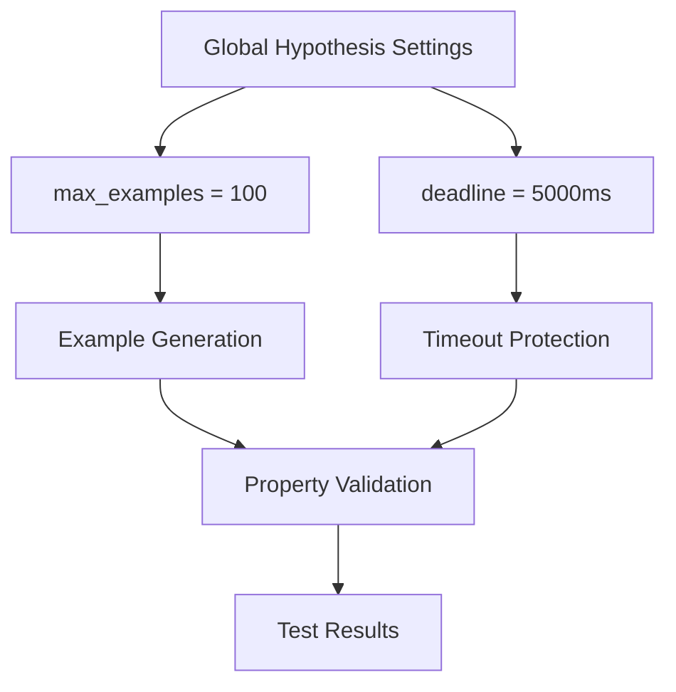
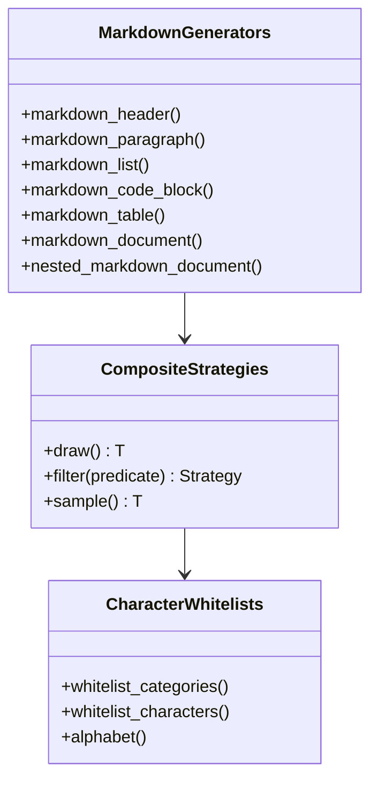
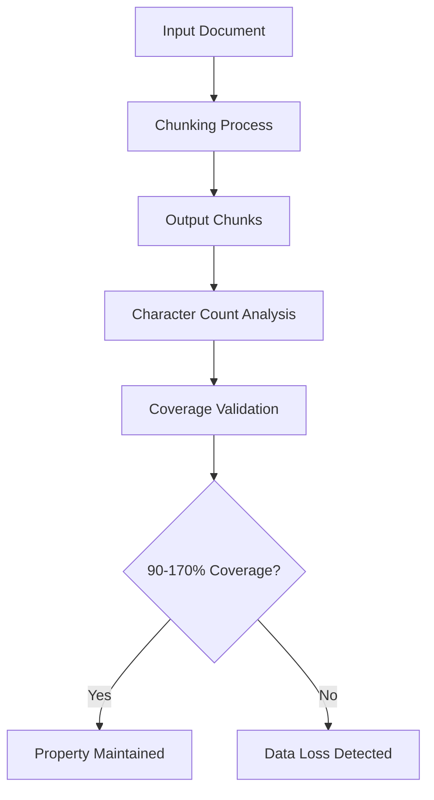
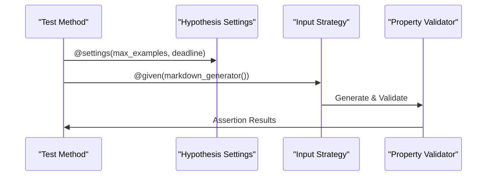
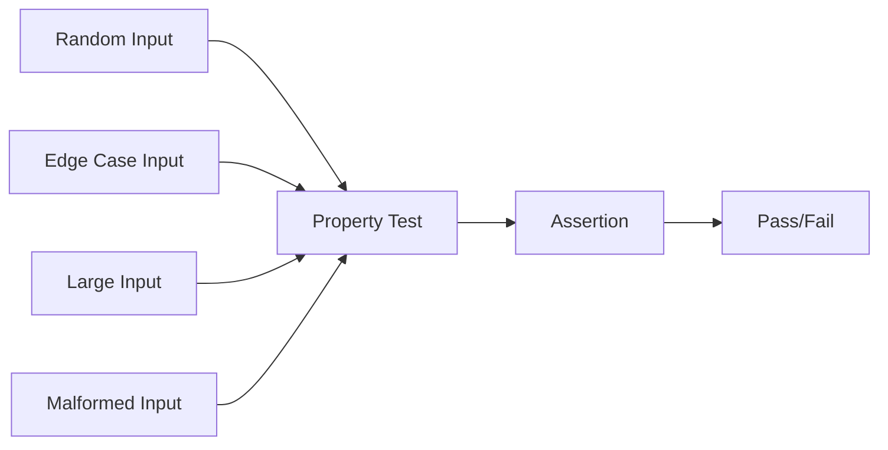
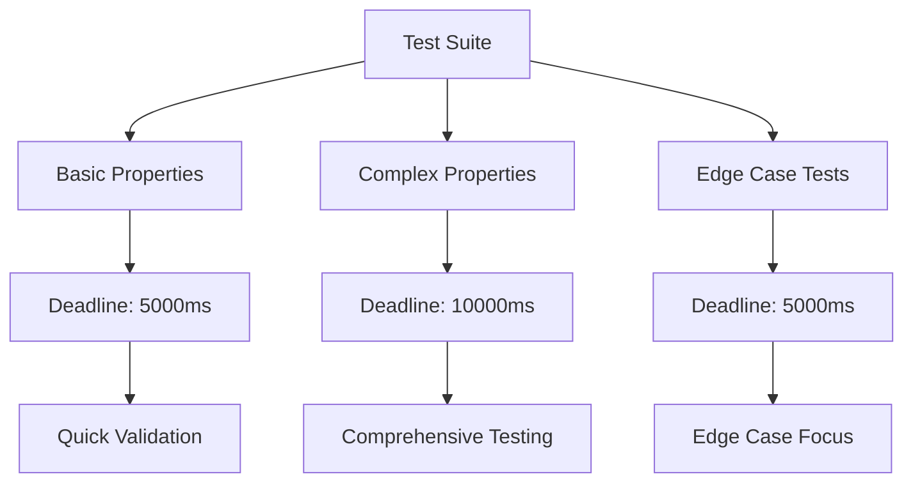

# Property-Based Testing Implementation Using Hypothesis

<cite>
**Referenced Files in This Document**
- [tests/conftest.py](file://tests/conftest.py)
- [tests/chunker/test_critical_properties.py](file://tests/chunker/test_critical_properties.py)
- [tests/chunker/test_idempotence_property.py](file://tests/chunker/test_idempotence_property.py)
- [tests/chunker/test_monotonic_ordering_property.py](file://tests/chunker/test_monotonic_ordering_property.py)
- [tests/chunker/test_serialization_roundtrip_property.py](file://tests/chunker/test_serialization_roundtrip_property.py)
- [tests/chunker/test_header_path_property.py](file://tests/chunker/test_header_path_property.py)
- [tests/chunker/test_no_empty_chunks_property.py](file://tests/chunker/test_no_empty_chunks_property.py)
- [tests/chunker/test_data_preservation_properties.py](file://tests/chunker/test_data_preservation_properties.py)
- [pytest.ini](file://pytest.ini)
</cite>

## Table of Contents
1. [Introduction](#introduction)
2. [Hypothesis Configuration](#hypothesis-configuration)
3. [Markdown Generator Strategies](#markdown-generator-strategies)
4. [Core Property Definitions](#core-property-definitions)
5. [Implementation Patterns](#implementation-patterns)
6. [Test Case Examples](#test-case-examples)
7. [Common Challenges and Solutions](#common-challenges-and-solutions)
8. [Best Practices Guidelines](#best-practices-guidelines)
9. [Performance Optimization](#performance-optimization)
10. [Troubleshooting Guide](#troubleshooting-guide)

## Introduction

The dify-markdown-chunker project employs sophisticated property-based testing using the Hypothesis library to ensure robustness and correctness across a wide range of inputs. Property-based testing shifts the focus from specific test cases to mathematical properties that must hold true for all valid inputs, enabling comprehensive coverage of edge cases and unexpected scenarios.

This implementation demonstrates advanced testing patterns for a complex markdown processing pipeline, validating invariants such as data preservation, monotonic ordering, idempotence, and serialization round-trip correctness. The approach ensures that the chunking algorithm maintains fundamental guarantees regardless of input complexity or structure.

## Hypothesis Configuration

The testing framework establishes global Hypothesis settings that balance thoroughness with performance, generating 100+ examples per property while imposing reasonable time limits to prevent excessive test execution.

### Global Settings Configuration

The configuration establishes baseline parameters for property-based testing:

**Diagram sources**
- [tests/conftest.py](file://tests/conftest.py#L14-L15)

### Profile Management

The framework registers and loads a default profile that can be customized for different testing scenarios:

- **max_examples**: Controls the number of generated test cases per property
- **deadline**: Sets timeout limits to prevent infinite loops or excessive computation
- **Custom Profiles**: Can be registered for specialized testing needs

**Section sources**
- [tests/conftest.py](file://tests/conftest.py#L14-L15)

## Markdown Generator Strategies

The testing framework provides comprehensive strategies for generating realistic markdown documents with various structures and complexities. These generators serve as the foundation for property-based testing by creating diverse input scenarios.

### Core Generator Functions

The generator ecosystem includes specialized functions for different markdown elements:

**Diagram sources**
- [tests/conftest.py](file://tests/conftest.py#L23-L220)

### Header Generation Strategy

Headers are generated with controlled complexity and realistic text patterns:

- **Level Control**: Supports H1-H6 headers with configurable depth
- **Text Generation**: Uses Unicode-safe character sets for international compatibility
- **Filtering**: Ensures non-empty, properly formatted header text

### Paragraph Generation Strategy

Paragraphs are constructed with natural language characteristics:

- **Sentence Structure**: Generates multiple sentences with varied lengths
- **Character Filtering**: Excludes problematic Unicode characters
- **Content Validation**: Ensures meaningful text content

### List and Code Block Generation

Complex content types require specialized generation approaches:

- **Lists**: Support various item types with realistic content
- **Code Blocks**: Include multiple programming languages and realistic code patterns
- **Tables**: Generate structured data with varying dimensions

**Section sources**
- [tests/conftest.py](file://tests/conftest.py#L23-L220)

## Core Property Definitions

The property-based testing framework validates fundamental invariants that must hold across all valid inputs. These properties represent critical guarantees about the chunking algorithm's behavior.

### Data Preservation Properties

Data preservation ensures that no content is lost during the chunking process:

**Diagram sources**
- [tests/chunker/test_data_preservation_properties.py](file://tests/chunker/test_data_preservation_properties.py#L72-L116)

### Monotonic Ordering Guarantee

Chunks must appear in the same order as their content in the input document:

- **Start Line Validation**: Each chunk's start_line must be ≥ previous chunk's start_line
- **Strict Ordering**: Adjacent chunks should have strictly increasing start_line values
- **Overlap Consideration**: Overlapping regions may allow equal start_line values

### Idempotence Property

The chunking process must produce identical results when applied multiple times:

- **Consistent Output**: Multiple runs with the same input produce identical chunk collections
- **Property Preservation**: All chunk properties (content, positions, metadata) remain unchanged
- **Strategy Independence**: Idempotence holds across different chunking strategies

### Serialization Round-Trip Property

Chunks must survive serialization and deserialization without data loss:

- **JSON Compatibility**: Chunks can be converted to JSON format
- **Complete Restoration**: All chunk properties are preserved during round-trip
- **Metadata Integrity**: Additional metadata survives the serialization process

**Section sources**
- [tests/chunker/test_critical_properties.py](file://tests/chunker/test_critical_properties.py#L1-L808)
- [tests/chunker/test_monotonic_ordering_property.py](file://tests/chunker/test_monotonic_ordering_property.py#L71-L391)
- [tests/chunker/test_idempotence_property.py](file://tests/chunker/test_idempotence_property.py#L89-L368)

## Implementation Patterns

The property-based testing implementation follows consistent patterns that ensure reliability and maintainability across different property types.

### Decorator-Based Configuration

Each property test uses Hypothesis decorators to configure example generation:

**Diagram sources**
- [tests/chunker/test_monotonic_ordering_property.py](file://tests/chunker/test_monotonic_ordering_property.py#L73-L106)

### Exception Handling Pattern

Robust exception handling prevents problematic inputs from breaking tests:

- **Assumption Filtering**: Uses `assume()` to skip invalid inputs
- **Try-Catch Blocks**: Catches exceptions from the chunking process
- **Graceful Degradation**: Continues testing with valid examples when problems occur

### Strategy Composition Pattern

Complex generators compose simpler strategies to create realistic content:

- **Modular Design**: Each generator focuses on a specific markdown element
- **Recursive Generation**: Nested documents build upon simpler components
- **Parameter Variation**: Different parameter sets create diverse test scenarios

**Section sources**
- [tests/chunker/test_monotonic_ordering_property.py](file://tests/chunker/test_monotonic_ordering_property.py#L73-L106)
- [tests/chunker/test_idempotence_property.py](file://tests/chunker/test_idempotence_property.py#L91-L116)

## Test Case Examples

The framework includes numerous examples demonstrating property-based testing patterns for different scenarios and edge cases.

### Basic Property Testing

Simple property tests validate fundamental invariants:

**Diagram sources**
- [tests/chunker/test_no_empty_chunks_property.py](file://tests/chunker/test_no_empty_chunks_property.py#L72-L99)

### Strategy-Specific Testing

Different chunking strategies require specialized property validation:

- **Structural Strategy**: Validates hierarchical content preservation
- **Sentences Strategy**: Ensures sentence-level boundaries
- **Mixed Strategy**: Handles complex document structures

### Configuration Testing

Properties are validated across different configuration combinations:

- **Chunk Size Variations**: Tests with various max/min chunk sizes
- **Overlap Settings**: Validates overlap behavior with different percentages
- **Strategy Selection**: Ensures appropriate strategy selection

**Section sources**
- [tests/chunker/test_no_empty_chunks_property.py](file://tests/chunker/test_no_empty_chunks_property.py#L72-L343)
- [tests/chunker/test_serialization_roundtrip_property.py](file://tests/chunker/test_serialization_roundtrip_property.py#L89-L403)

## Common Challenges and Solutions

Property-based testing presents several challenges that require careful consideration and mitigation strategies.

### Test Performance Issues

Long-running tests can become impractical for continuous integration:

**Challenge**: Complex markdown generation and chunking can exceed timeout limits
**Solution**: Strategic use of `@settings` decorator with appropriate deadlines
**Implementation**: Different timeouts for different property types (5000ms for basic, 10000ms for complex)

### Shrinking Behavior Problems

Hypothesis attempts to find minimal failing examples, which can sometimes produce misleading results:

**Challenge**: Shrinking may produce invalid or unrealistic inputs
**Solution**: Careful assumption filtering and input validation
**Implementation**: Use of `assume()` statements to reject problematic inputs early

### False Positive Detection

Tests may pass incorrectly due to insufficient coverage or overly broad assumptions:

**Challenge**: Properties may appear valid but fail with edge cases
**Solution**: Comprehensive edge case testing and multiple validation approaches
**Implementation**: Combination of character-count validation, content presence checks, and structural validation

### Memory Usage Concerns

Large inputs can consume excessive memory during testing:

**Challenge**: Very large documents may cause memory exhaustion
**Solution**: Input size limits and streaming approaches where applicable
**Implementation**: Maximum size parameters and selective testing of large inputs

**Section sources**
- [tests/chunker/test_critical_properties.py](file://tests/chunker/test_critical_properties.py#L240-L287)
- [tests/chunker/test_idempotence_property.py](file://tests/chunker/test_idempotence_property.py#L91-L116)

## Best Practices Guidelines

Effective property-based testing requires adherence to established best practices that ensure reliable and maintainable test suites.

### Property Definition Principles

Define clear, mathematical properties that capture fundamental system guarantees:

- **Mathematical Clarity**: Properties should be precisely definable
- **Invariant Nature**: Properties must hold for all valid inputs
- **Minimal Assumptions**: Avoid unnecessary constraints that limit coverage

### Input Generation Strategies

Create realistic, diverse input distributions:

- **Realistic Content**: Generate content that resembles actual usage
- **Edge Case Coverage**: Ensure edge cases are included naturally
- **Performance Balance**: Balance comprehensiveness with test execution time

### Validation Approaches

Implement robust validation mechanisms:

- **Multi-Level Validation**: Use multiple validation approaches for critical properties
- **Tolerance Handling**: Allow reasonable tolerance for floating-point comparisons
- **Progressive Testing**: Start with simple cases and gradually increase complexity

### Configuration Management

Maintain flexible, well-documented configuration:

- **Environment-Specific Settings**: Adapt settings for different environments
- **Clear Documentation**: Document the rationale behind configuration choices
- **Version Control**: Track configuration changes and their impacts

**Section sources**
- [tests/conftest.py](file://tests/conftest.py#L1-L34)
- [pytest.ini](file://pytest.ini#L1-L37)

## Performance Optimization

Optimizing property-based tests requires balancing thoroughness with practical execution time.

### Timeout Configuration

Strategic timeout allocation prevents test timeouts while maintaining coverage:

**Diagram sources**
- [tests/chunker/test_monotonic_ordering_property.py](file://tests/chunker/test_monotonic_ordering_property.py#L73-L106)

### Example Count Optimization

Balance the number of examples with test duration:

- **Basic Properties**: 100-200 examples provide good coverage
- **Complex Properties**: 50-100 examples with higher deadlines
- **Edge Cases**: 20-50 examples with focused testing

### Resource Management

Efficient resource utilization prevents test failures:

- **Memory Limits**: Monitor memory usage for large inputs
- **CPU Utilization**: Optimize algorithms to reduce computational overhead
- **I/O Operations**: Minimize file system access during testing

**Section sources**
- [tests/chunker/test_monotonic_ordering_property.py](file://tests/chunker/test_monotonic_ordering_property.py#L73-L106)
- [tests/chunker/test_idempotence_property.py](file://tests/chunker/test_idempotence_property.py#L91-L116)

## Troubleshooting Guide

Common issues in property-based testing and their solutions.

### Test Failures

**Symptom**: Tests fail intermittently or with specific inputs
**Diagnosis**: Check for assumption filtering and input validation
**Resolution**: Review `assume()` statements and add more comprehensive input validation

### Slow Test Execution

**Symptom**: Tests take excessive time to complete
**Diagnosis**: Identify computationally expensive operations
**Resolution**: Reduce `max_examples`, increase deadlines, or optimize algorithms

### Memory Exhaustion

**Symptom**: Tests crash due to memory limitations
**Diagnosis**: Large input generation or processing
**Resolution**: Implement input size limits and optimize memory usage

### Shrinkage Issues

**Symptom**: Hypothesis produces confusing or invalid minimal examples
**Diagnosis**: Insufficient assumption filtering
**Resolution**: Add more `assume()` statements to reject invalid inputs early

**Section sources**
- [tests/chunker/test_critical_properties.py](file://tests/chunker/test_critical_properties.py#L240-L287)
- [tests/chunker/test_data_preservation_properties.py](file://tests/chunker/test_data_preservation_properties.py#L72-L116)