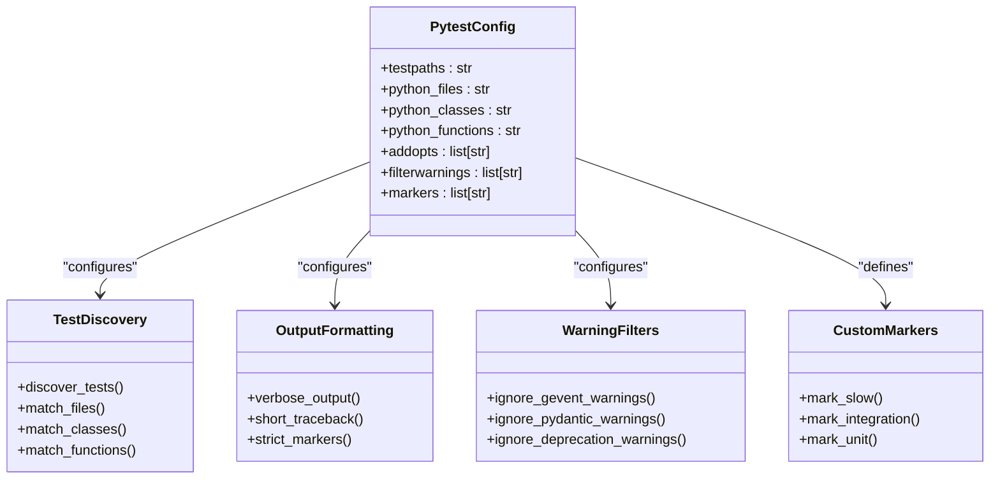
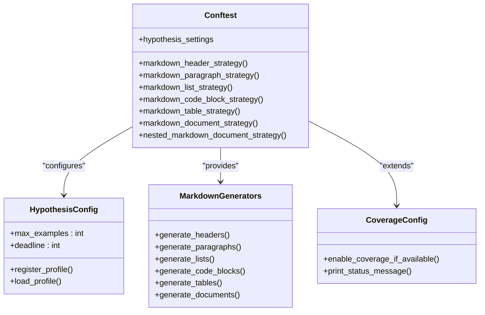
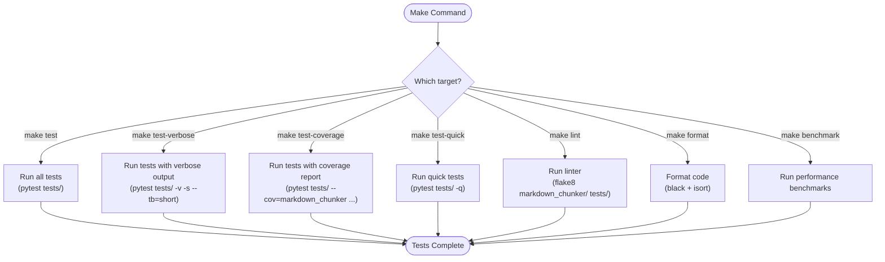
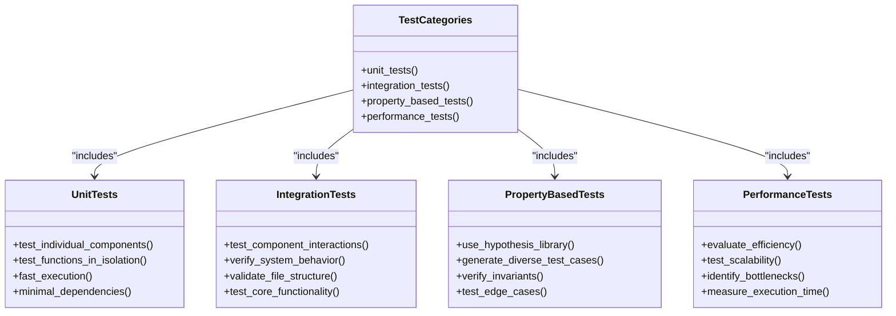
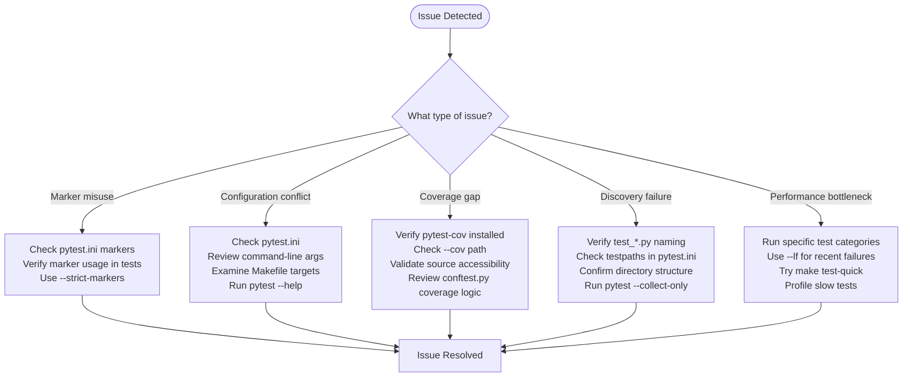

# Test Configuration and Execution

<cite>
**Referenced Files in This Document**   
- [pytest.ini](file://pytest.ini)
- [conftest.py](file://tests/conftest.py)
- [parser/conftest.py](file://tests/parser/conftest.py)
- [Makefile](file://Makefile)
- [test_integration_basic.py](file://tests/test_integration_basic.py)
- [test_code_strategy_properties.py](file://tests/chunker/test_code_strategy_properties.py)
- [test_mixed_strategy_properties.py](file://tests/chunker/test_mixed_strategy_properties.py)
- [test_performance.py](file://tests/chunker/test_performance.py)
</cite>

## Table of Contents
1. [Introduction](#introduction)
2. [Pytest Configuration](#pytest-configuration)
3. [Shared Test Fixtures and Hypothesis Configuration](#shared-test-fixtures-and-hypothesis-configuration)
4. [Test Execution via Makefile](#test-execution-via-makefile)
5. [Test Categories and Execution Methods](#test-categories-and-execution-methods)
6. [Common Execution Issues and Troubleshooting](#common-execution-issues-and-troubleshooting)
7. [Conclusion](#conclusion)

## Introduction
This document provides comprehensive guidance on the test configuration and execution framework for the markdown chunker project. It details the pytest configuration, shared fixtures, Hypothesis-based property testing setup, and Makefile-driven test execution workflows. The documentation covers how to run various test categories, interpret configuration settings, and troubleshoot common issues that may arise during test execution.

## Pytest Configuration

The pytest configuration is defined in the `pytest.ini` file, which establishes the foundational settings for test discovery, output formatting, warning filters, and custom markers. This configuration ensures consistent test behavior across different execution environments and developer setups.

The configuration specifies test discovery paths and file patterns through the `testpaths`, `python_files`, `python_classes`, and `python_functions` directives. Test output is enhanced with verbose reporting (`-v`) and concise traceback information (`--tb=short`). The `--strict-markers` option enforces proper usage of custom markers, preventing typos and ensuring marker consistency.

Warning filters are configured to suppress specific warnings that are expected or irrelevant to the testing process, such as gevent monkey-patching warnings and Pydantic deprecation warnings from external dependencies. This prevents noise in the test output while maintaining visibility into relevant warnings.

Custom markers are defined to categorize tests by type and characteristics, enabling selective test execution based on specific criteria. These markers facilitate targeted testing and efficient development workflows.

**Diagram sources**
- [pytest.ini](file://pytest.ini#L1-L37)

**Section sources**
- [pytest.ini](file://pytest.ini#L1-L37)

## Shared Test Fixtures and Hypothesis Configuration

The test suite utilizes shared fixtures and Hypothesis configuration through the `conftest.py` files in the tests directory. These files provide reusable test components, fixtures, and property-based testing strategies that ensure consistent test behavior across all test modules.

The primary `conftest.py` file configures Hypothesis with a profile that sets the maximum number of examples to 100 and a deadline of 5000 milliseconds per test. This configuration balances thorough property testing with reasonable execution times, ensuring that property-based tests are both comprehensive and efficient.

Hypothesis strategies are defined for generating various markdown structures, including headers, paragraphs, lists, code blocks, tables, and complete documents. These strategies enable property-based testing by automatically generating diverse test cases that cover edge cases and boundary conditions that might be missed with traditional example-based testing.

A secondary `conftest.py` file in the parser tests directory provides optional coverage support, automatically enabling coverage reporting if pytest-cov is available while allowing tests to run without it if the package is not installed. This ensures that test execution is not blocked by missing dependencies while still providing coverage reporting when desired.

**Diagram sources**
- [conftest.py](file://tests/conftest.py#L1-L220)
- [parser/conftest.py](file://tests/parser/conftest.py#L1-L38)

**Section sources**
- [conftest.py](file://tests/conftest.py#L1-L220)
- [parser/conftest.py](file://tests/parser/conftest.py#L1-L38)

## Test Execution via Makefile

The project provides a comprehensive Makefile with targets for executing various test suites and quality checks. This approach standardizes test execution across different development environments and simplifies common testing workflows.

The Makefile defines targets for running all tests, running tests with verbose output, executing tests with coverage reports, and running quick tests. Additional targets support linting, formatting, quality checks, benchmarks, and package validation. This integrated approach enables developers to perform common development tasks with simple, memorable commands.

The test-related targets in the Makefile invoke pytest with appropriate arguments to control test execution behavior. For example, the `test-coverage` target runs tests with coverage reporting, generating HTML, terminal, and XML reports. The `test-verbose` target provides detailed output with short tracebacks, while the `test-quick` target runs tests with minimal output for faster feedback.

**Diagram sources**
- [Makefile](file://Makefile#L1-L136)

**Section sources**
- [Makefile](file://Makefile#L1-L136)

## Test Categories and Execution Methods

The test suite is organized into multiple categories, each serving a specific purpose in the quality assurance process. Understanding these categories and their execution methods is essential for effective testing and development.

### Unit Tests
Unit tests focus on individual components and functions, verifying their correctness in isolation. These tests are typically fast and have minimal dependencies. They can be executed using the standard `make test` command or by running pytest directly with appropriate filters.

### Integration Tests
Integration tests verify the interaction between multiple components and the overall system behavior. These tests ensure that different parts of the system work together correctly. The `test_integration_basic.py` file contains basic integration tests that validate core functionality and file structure.

### Property-Based Tests
Property-based tests use the Hypothesis library to automatically generate test cases based on specified properties. These tests verify that certain invariants hold true across a wide range of inputs. The `test_code_strategy_properties.py` and `test_mixed_strategy_properties.py` files contain property-based tests for specific chunking strategies.

### Performance Tests
Performance tests evaluate the efficiency and scalability of the system. The `test_performance.py` file contains tests for performance monitoring, caching, and memory-efficient processing. These tests help identify performance bottlenecks and ensure that the system meets performance requirements.

### Running Specific Test Categories
Specific test categories can be executed using pytest markers or by specifying test file paths. For example:
- Run only integration tests: `make test && pytest -m integration`
- Run only slow tests: `pytest -m slow`
- Run tests in a specific directory: `pytest tests/chunker/`
- Run a specific test file: `pytest tests/test_integration_basic.py`

**Diagram sources**
- [test_integration_basic.py](file://tests/test_integration_basic.py#L1-L234)
- [test_code_strategy_properties.py](file://tests/chunker/test_code_strategy_properties.py#L1-L382)
- [test_mixed_strategy_properties.py](file://tests/chunker/test_mixed_strategy_properties.py#L1-L557)
- [test_performance.py](file://tests/chunker/test_performance.py#L1-L447)

**Section sources**
- [test_integration_basic.py](file://tests/test_integration_basic.py#L1-L234)
- [test_code_strategy_properties.py](file://tests/chunker/test_code_strategy_properties.py#L1-L382)
- [test_mixed_strategy_properties.py](file://tests/chunker/test_mixed_strategy_properties.py#L1-L557)
- [test_performance.py](file://tests/chunker/test_performance.py#L1-L447)

## Common Execution Issues and Troubleshooting

Despite the robust test configuration, certain issues may arise during test execution. Understanding these common problems and their solutions can help maintain productivity and ensure reliable test results.

### Marker Misuse
When using custom markers like `slow` or `integration`, ensure they are properly defined in the `pytest.ini` file and used consistently in test functions. Marker misuse can lead to tests being skipped or incorrectly categorized. Always use the `--strict-markers` option to catch undefined markers early.

### Configuration Conflicts
Conflicting configuration options between `pytest.ini`, command-line arguments, and Makefile targets can cause unexpected behavior. When in doubt, check the effective configuration by running `pytest --help` or examining the output of `pytest --version`. Ensure that configuration files are properly formatted and that there are no syntax errors.

### Coverage Reporting Gaps
Coverage reporting may fail if the `pytest-cov` package is not installed or if there are path mismatches between the source code and the coverage configuration. Ensure that the `--cov` parameter points to the correct package directory and that the source files are accessible. The optional coverage support in `tests/parser/conftest.py` demonstrates how to handle missing dependencies gracefully.

### Test Discovery Failures
Test discovery failures can occur when test files do not follow the naming convention (`test_*.py`) or when they are located outside the directories specified in `testpaths`. Verify that test files are named correctly and located in the appropriate directories. Use the `pytest --collect-only` command to see which tests are being discovered.

### Performance Bottlenecks
Property-based tests and large integration tests can be time-consuming. When performance becomes an issue, consider running specific test categories or using the `--lf` (last failed) option to focus on recently failing tests. The `test-quick` Makefile target provides a faster feedback loop for development.

**Diagram sources**
- [pytest.ini](file://pytest.ini#L1-L37)
- [Makefile](file://Makefile#L1-L136)
- [conftest.py](file://tests/conftest.py#L1-L220)
- [parser/conftest.py](file://tests/parser/conftest.py#L1-L38)

**Section sources**
- [pytest.ini](file://pytest.ini#L1-L37)
- [Makefile](file://Makefile#L1-L136)
- [conftest.py](file://tests/conftest.py#L1-L220)
- [parser/conftest.py](file://tests/parser/conftest.py#L1-L38)

## Conclusion
The test configuration and execution framework in the markdown chunker project provides a comprehensive and flexible approach to quality assurance. By leveraging pytest configuration, shared fixtures, property-based testing, and Makefile-driven workflows, the project ensures reliable and efficient testing across multiple dimensions.

The pytest.ini configuration establishes consistent test discovery and output formatting, while the conftest.py files provide shared fixtures and Hypothesis strategies for property-based testing. The Makefile simplifies common testing tasks and integrates quality checks into the development workflow.

Understanding the different test categories—unit, integration, property-based, and performance tests—and their execution methods enables developers to effectively validate the system's correctness, reliability, and performance. When issues arise, the troubleshooting guidance helps quickly identify and resolve common problems related to marker usage, configuration conflicts, coverage reporting, test discovery, and performance bottlenecks.

This robust testing infrastructure supports the project's goal of delivering a reliable and high-quality markdown chunking solution, ensuring that the system behaves correctly across a wide range of inputs and usage scenarios.