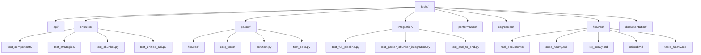
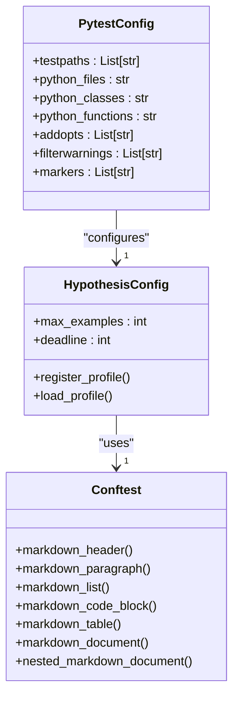
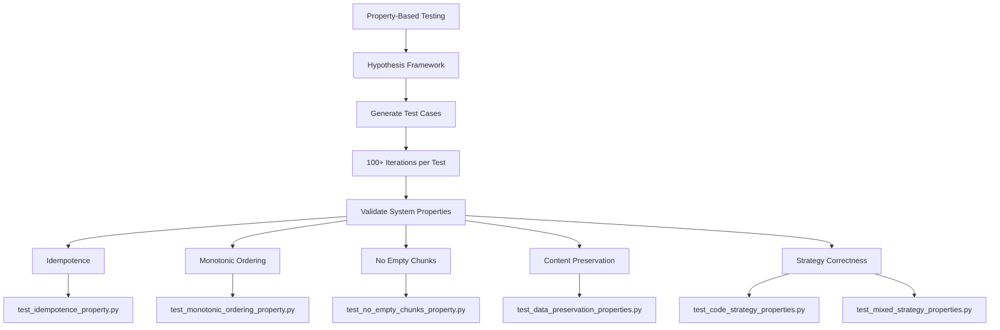

# Testing Strategy Overview

<cite>
**Referenced Files in This Document**   
- [pytest.ini](file://pytest.ini)
- [conftest.py](file://tests/conftest.py)
- [test_chunker.py](file://tests/chunker/test_chunker.py)
- [test_unified_api.py](file://tests/chunker/test_unified_api.py)
- [test_code_strategy_properties.py](file://tests/chunker/test_code_strategy_properties.py)
- [test_mixed_strategy_properties.py](file://tests/chunker/test_mixed_strategy_properties.py)
- [test_idempotence_property.py](file://tests/chunker/test_idempotence_property.py)
- [test_monotonic_ordering_property.py](file://tests/chunker/test_monotonic_ordering_property.py)
- [test_no_empty_chunks_property.py](file://tests/chunker/test_no_empty_chunks_property.py)
- [test_full_pipeline.py](file://tests/integration/test_full_pipeline.py)
- [test_performance.py](file://tests/chunker/test_performance.py)
- [test_entry_point.py](file://tests/test_entry_point.py)
- [test_error_handling.py](file://tests/test_error_handling.py)
</cite>

## Table of Contents
1. [Introduction](#introduction)
2. [Test Organization and Structure](#test-organization-and-structure)
3. [Testing Framework and Configuration](#testing-framework-and-configuration)
4. [Unit Testing Strategy](#unit-testing-strategy)
5. [Integration Testing Approach](#integration-testing-approach)
6. [Property-Based Testing with Hypothesis](#property-based-testing-with-hypothesis)
7. [End-to-End Testing](#end-to-end-testing)
8. [Test Markers and Categorization](#test-markers-and-categorization)
9. [Running the Test Suite](#running-the-test-suite)
10. [Writing New Tests](#writing-new-tests)
11. [Conclusion](#conclusion)

## Introduction

The markdown chunker library employs a comprehensive, multi-layered testing strategy designed to ensure robustness, reliability, and correctness across various dimensions of functionality. This strategy combines unit, integration, property-based, and end-to-end testing approaches to validate both individual components and the complete processing pipeline. The testing infrastructure is built on pytest as the primary testing framework, enhanced with Hypothesis for property-based testing, enabling extensive validation with over 100 iterations per test to uncover edge cases and ensure system stability. The test suite is organized by component (parser, chunker, API) and leverages a global configuration in conftest.py to establish reusable fixtures and Hypothesis profiles. This documentation provides a detailed overview of the testing strategy, including infrastructure setup, test organization, execution methods, and guidelines for contributing new tests that align with the project's established patterns.

**Section sources**
- [pytest.ini](file://pytest.ini)
- [conftest.py](file://tests/conftest.py)

## Test Organization and Structure

The test suite is organized in a hierarchical structure that mirrors the application's component architecture, facilitating targeted testing and easy navigation. The root `tests/` directory contains subdirectories for each major component: `api/`, `chunker/`, `parser/`, and `integration/`, along with specialized directories for fixtures, performance testing, and regression testing. Each component directory follows a consistent pattern, containing unit tests for specific modules and strategies, with dedicated test files for different aspects of functionality. For example, the `chunker/` directory includes `test_components/` for testing individual chunker components like the fallback manager and metadata enricher, `test_strategies/` for strategy-specific tests, and comprehensive integration tests in the root chunker test directory. The `integration/` directory houses end-to-end tests that validate the complete pipeline from input processing through chunking and output generation. Additionally, the `fixtures/` directory contains both synthetic test cases and real-world document examples used across multiple test scenarios. This organization enables developers to quickly locate relevant tests and ensures comprehensive coverage across all functional areas of the library.

**Diagram sources**
- [tests/](file://tests/)
- [tests/chunker/](file://tests/chunker/)
- [tests/parser/](file://tests/parser/)
- [tests/integration/](file://tests/integration/)
- [tests/fixtures/](file://tests/fixtures/)

**Section sources**
- [tests/](file://tests/)
- [tests/chunker/](file://tests/chunker/)
- [tests/parser/](file://tests/parser/)
- [tests/integration/](file://tests/integration/)
- [tests/fixtures/](file://tests/fixtures/)

## Testing Framework and Configuration

The testing infrastructure is built on pytest, configured through a `pytest.ini` file that establishes global settings and test discovery rules. The configuration specifies `tests` as the test path, with test files following the `test_*.py` pattern, classes named with the `Test*` prefix, and functions using the `test_*` naming convention. The configuration includes verbose output (`-v`), short traceback format (`--tb=short`), and strict marker enforcement to ensure consistent test categorization. Warning filters are configured to ignore expected deprecation warnings from external dependencies and the library's own deprecated APIs, preventing noise in test output. The global test configuration is defined in `tests/conftest.py`, which sets up Hypothesis with a profile that runs at least 100 examples per property test with a 5-second deadline, ensuring thorough property-based validation. This file also defines reusable Hypothesis strategies for generating various markdown structures, including headers, lists, code blocks, and tables, which are used across multiple test files to create diverse test inputs. The parser-specific `conftest.py` provides optional coverage reporting, automatically enabling coverage if pytest-cov is available while allowing tests to run without it if the package is not installed.

**Diagram sources**
- [pytest.ini](file://pytest.ini#L1-L37)
- [tests/conftest.py](file://tests/conftest.py#L1-L220)
- [tests/parser/conftest.py](file://tests/parser/conftest.py#L1-L38)

**Section sources**
- [pytest.ini](file://pytest.ini#L1-L37)
- [tests/conftest.py](file://tests/conftest.py#L1-L220)
- [tests/parser/conftest.py](file://tests/parser/conftest.py#L1-L38)

## Unit Testing Strategy

The unit testing strategy focuses on validating individual components and functions in isolation, ensuring that each unit of functionality behaves as expected under various conditions. Unit tests are organized by component, with dedicated test files for each major module and class. For example, the chunker component has separate test files for its core functionality (`test_chunker.py`), unified API (`test_unified_api.py`), and individual strategies (`test_code_strategy.py`, `test_list_strategy.py`, etc.). These tests use pytest's fixture system to set up test dependencies and mock external components, allowing for isolated testing of specific functionality. The tests validate a wide range of behaviors, including object creation with default and custom configurations, method functionality, error handling, and edge cases. For instance, `test_chunker.py` verifies that the MarkdownChunker can be instantiated with default and custom configurations, properly validates configurations, and handles various input scenarios. The unit tests also validate the library's error handling mechanisms, ensuring that appropriate exceptions are raised for invalid inputs and that error messages follow the expected format. This comprehensive unit testing approach provides a solid foundation for the library's reliability by verifying the correctness of individual components before they are integrated into larger systems.

**Section sources**
- [test_chunker.py](file://tests/chunker/test_chunker.py#L1-L305)
- [test_unified_api.py](file://tests/chunker/test_unified_api.py#L1-L418)
- [test_entry_point.py](file://tests/test_entry_point.py#L1-L240)
- [test_error_handling.py](file://tests/test_error_handling.py#L1-L111)

## Integration Testing Approach

The integration testing approach validates the interactions between different components of the markdown chunker library, ensuring that they work together correctly to produce the expected output. Integration tests are organized in the `tests/integration/` directory and focus on testing the complete processing pipeline from input to output. These tests verify that the parser and chunker components work together seamlessly, with proper data flow between stages. For example, `test_parser_chunker_integration.py` validates that the Stage 1 parser correctly processes documents and passes the results to the Stage 2 chunker, while `test_full_pipeline.py` tests the complete end-to-end process with complex documents containing various markdown elements. The integration tests use real-world document examples from the `fixtures/real_documents/` directory to ensure that the library handles practical use cases correctly. These tests validate that the chunking process preserves content integrity, maintains proper ordering, and produces chunks that meet size and quality requirements. The integration tests also verify that the library's fallback mechanisms work correctly when primary strategies fail, ensuring robustness in the face of unexpected input. This comprehensive integration testing approach ensures that the library's components work together as a cohesive system, providing confidence in its overall functionality.

**Section sources**
- [test_full_pipeline.py](file://tests/integration/test_full_pipeline.py#L1-L555)
- [test_parser_chunker_integration.py](file://tests/integration/test_parser_chunker_integration.py)
- [test_end_to_end.py](file://tests/integration/test_end_to_end.py)

## Property-Based Testing with Hypothesis

The library employs property-based testing using Hypothesis to systematically validate the correctness of its chunking algorithms across a wide range of inputs. This approach generates hundreds of test cases automatically, uncovering edge cases that might be missed with traditional example-based testing. The property tests are organized by strategy, with dedicated files like `test_code_strategy_properties.py`, `test_mixed_strategy_properties.py`, and `test_list_strategy_properties.py` that validate specific properties for each chunking strategy. These tests verify fundamental guarantees such as idempotence (chunking the same input twice produces identical results), monotonic ordering (chunks appear in the same order as their content in the input), and the absence of empty chunks. For example, the code strategy property tests ensure that code blocks are never split across chunks, preserving their integrity, while the mixed strategy tests verify that documents with multiple content types are handled appropriately. The Hypothesis configuration in `conftest.py` ensures that each property test runs at least 100 iterations with a 5-second deadline, providing thorough validation. The tests use custom strategies to generate realistic markdown content with specific structures, allowing for targeted validation of different aspects of the chunking algorithms. This property-based approach complements traditional unit and integration tests by providing mathematical-style proofs of correctness for key system properties.

**Diagram sources**
- [test_idempotence_property.py](file://tests/chunker/test_idempotence_property.py#L1-L368)
- [test_monotonic_ordering_property.py](file://tests/chunker/test_monotonic_ordering_property.py#L1-L391)
- [test_no_empty_chunks_property.py](file://tests/chunker/test_no_empty_chunks_property.py#L1-L343)
- [test_code_strategy_properties.py](file://tests/chunker/test_code_strategy_properties.py#L1-L382)
- [test_mixed_strategy_properties.py](file://tests/chunker/test_mixed_strategy_properties.py#L1-L557)

**Section sources**
- [test_idempotence_property.py](file://tests/chunker/test_idempotence_property.py#L1-L368)
- [test_monotonic_ordering_property.py](file://tests/chunker/test_monotonic_ordering_property.py#L1-L391)
- [test_no_empty_chunks_property.py](file://tests/chunker/test_no_empty_chunks_property.py#L1-L343)
- [test_code_strategy_properties.py](file://tests/chunker/test_code_strategy_properties.py#L1-L382)
- [test_mixed_strategy_properties.py](file://tests/chunker/test_mixed_strategy_properties.py#L1-L557)

## End-to-End Testing

The end-to-end testing strategy validates the complete functionality of the markdown chunker library from input processing through final output generation, ensuring that all components work together correctly in real-world scenarios. These tests are implemented in the `tests/integration/` directory and focus on simulating actual usage patterns of the library. The `test_full_pipeline.py` file contains comprehensive integration tests that process complex documents with various markdown elements, including headers, code blocks, tables, and lists, verifying that the entire pipeline functions as expected. These tests validate not only the correctness of the chunking results but also performance characteristics, metadata accuracy, and error handling in realistic scenarios. The end-to-end tests use both synthetic test cases and real-world document examples from the `fixtures/real_documents/` directory, ensuring that the library handles practical use cases correctly. The tests verify that the library maintains content integrity, preserves semantic structure, and produces chunks that meet size and quality requirements. Additionally, the end-to-end tests validate the library's strategy selection mechanism, ensuring that appropriate chunking strategies are chosen based on document characteristics. This comprehensive end-to-end testing approach provides confidence that the library will perform reliably in production environments.

**Section sources**
- [test_full_pipeline.py](file://tests/integration/test_full_pipeline.py#L1-L555)
- [tests/fixtures/real_documents/](file://tests/fixtures/real_documents/)

## Test Markers and Categorization

The test suite uses pytest markers to categorize tests based on their type, speed, and purpose, enabling selective test execution and better organization. The markers are defined in the `pytest.ini` configuration file and include `slow`, `integration`, and `unit` markers. The `slow` marker identifies tests that take longer to execute, allowing them to be excluded from quick test runs using the `-m "not slow"` option. The `integration` marker categorizes tests that validate interactions between multiple components, distinguishing them from unit tests that focus on isolated functionality. The `unit` marker identifies tests that validate individual functions or methods in isolation. These markers enable developers to run specific subsets of tests based on their needs, such as running only unit tests for quick feedback during development or executing only integration tests when verifying component interactions. The marker system also supports custom test selection and filtering, making it easier to manage the test suite as it grows. This categorization approach enhances test maintainability and allows for more efficient test execution by enabling targeted test runs.

**Section sources**
- [pytest.ini](file://pytest.ini#L32-L37)

## Running the Test Suite

The test suite can be executed using pytest with various options to control test selection, output format, and coverage reporting. To run the complete test suite, execute `pytest` from the project root directory, which will discover and run all tests in the `tests/` directory according to the patterns defined in `pytest.ini`. For faster feedback during development, run only unit tests using `pytest -m unit` or exclude slow tests with `pytest -m "not slow"`. To generate coverage reports, ensure pytest-cov is installed and run `pytest --cov=markdown_chunker` to measure code coverage. The test suite automatically enables coverage reporting if pytest-cov is available, as configured in `tests/parser/conftest.py`. For property-based tests, the Hypothesis configuration ensures that each property test runs at least 100 iterations, providing thorough validation. Test output includes verbose information about test execution, with short tracebacks for failures to facilitate debugging. The test suite can also be run with specific test files or directories, such as `pytest tests/chunker/` to run only chunker-related tests. This flexibility in test execution allows developers to choose the appropriate testing approach based on their current needs, whether performing quick validation during development or comprehensive testing before release.

**Section sources**
- [pytest.ini](file://pytest.ini#L1-L37)
- [tests/parser/conftest.py](file://tests/parser/conftest.py#L1-L38)

## Writing New Tests

When writing new tests for the markdown chunker library, follow the established patterns and conventions to ensure consistency with the existing test suite. New test files should be placed in the appropriate directory based on the component being tested: `api/` for API-related functionality, `chunker/` for chunking algorithms, `parser/` for parsing logic, and `integration/` for multi-component interactions. Test files should follow the `test_*.py` naming convention and contain test classes prefixed with `Test` and test methods prefixed with `test_`. Use pytest fixtures to set up test dependencies and mock external components, ensuring that tests are isolated and repeatable. For property-based testing, leverage the Hypothesis strategies defined in `conftest.py` to generate diverse test inputs and validate system properties with at least 100 iterations per test. When testing new functionality, include unit tests for individual components, integration tests for component interactions, and property-based tests for fundamental guarantees like idempotence and content preservation. Use appropriate markers (`unit`, `integration`, `slow`) to categorize tests and enable selective execution. Ensure that new tests follow the same structure and style as existing tests, maintaining consistency across the test suite. This approach to test writing ensures that new functionality is thoroughly validated and integrated seamlessly into the existing testing infrastructure.

**Section sources**
- [pytest.ini](file://pytest.ini#L1-L37)
- [tests/conftest.py](file://tests/conftest.py#L1-L220)
- [tests/chunker/test_chunker.py](file://tests/chunker/test_chunker.py#L1-L305)
- [tests/chunker/test_unified_api.py](file://tests/chunker/test_unified_api.py#L1-L418)

## Conclusion

The markdown chunker library employs a comprehensive, multi-layered testing strategy that combines unit, integration, property-based, and end-to-end testing to ensure robustness and reliability. Built on pytest with Hypothesis for property-based testing, the test suite runs over 100 iterations per test to thoroughly validate system properties and uncover edge cases. The tests are organized by component (parser, chunker, API) and categorized using markers for selective execution, with a global configuration in conftest.py that establishes reusable fixtures and Hypothesis profiles. This comprehensive approach validates both component isolation and full pipeline functionality, ensuring that the library performs correctly across a wide range of inputs and scenarios. The testing infrastructure supports efficient test execution, coverage reporting, and easy addition of new tests, providing a solid foundation for ongoing development and maintenance. By following the established patterns and conventions, developers can contribute new tests that maintain the high quality and reliability of the library.